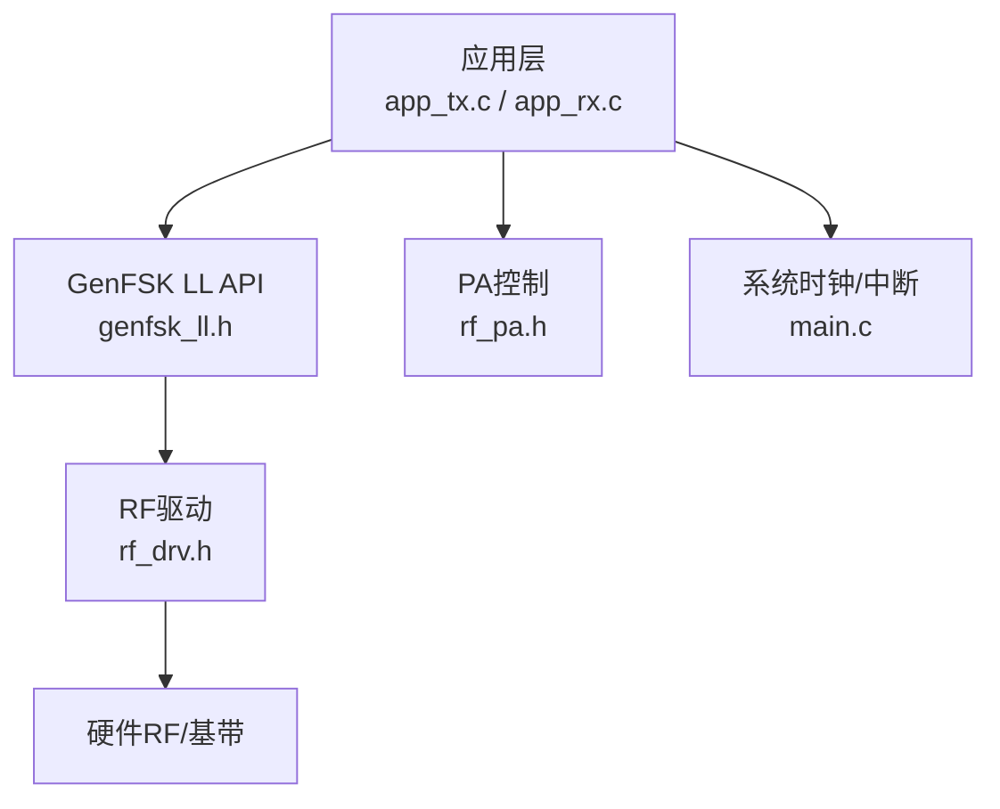
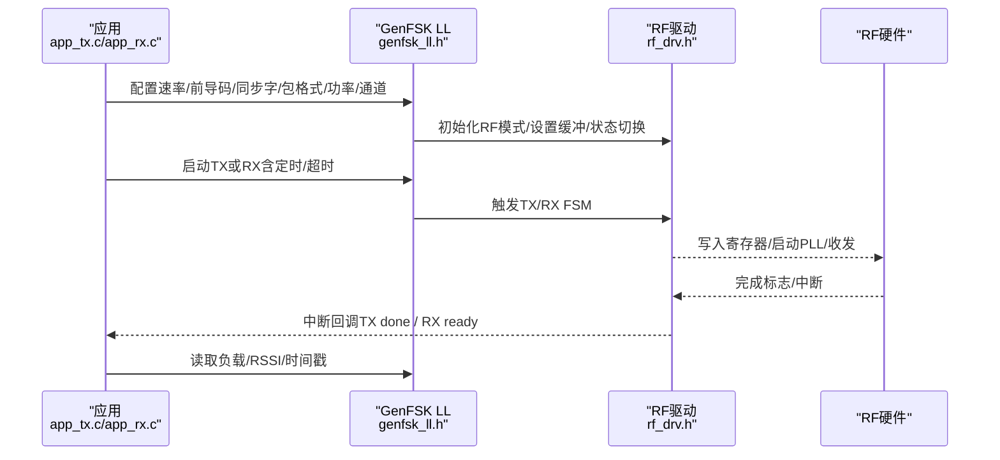
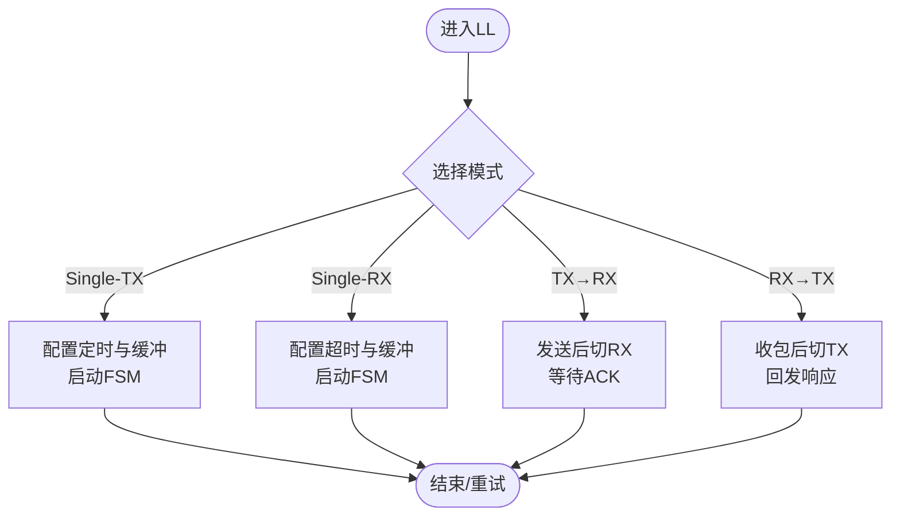
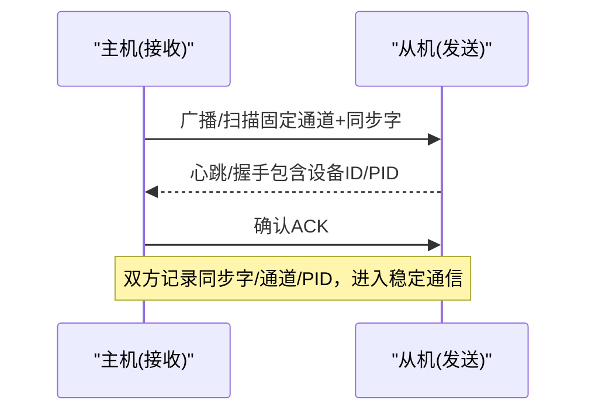
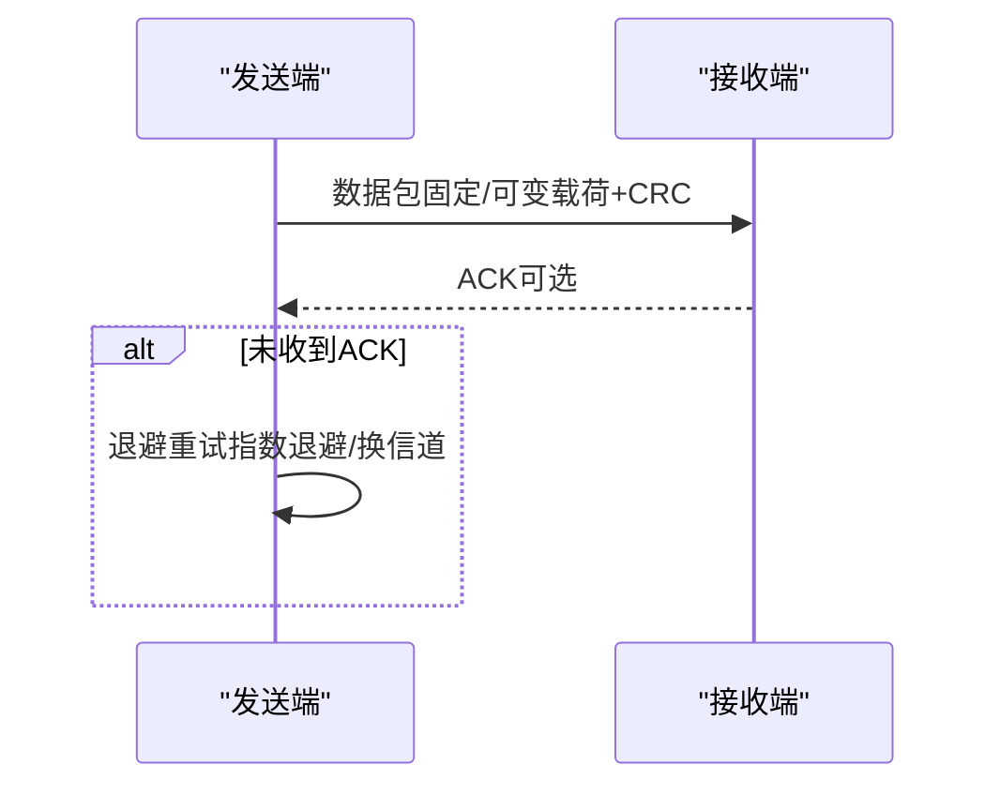
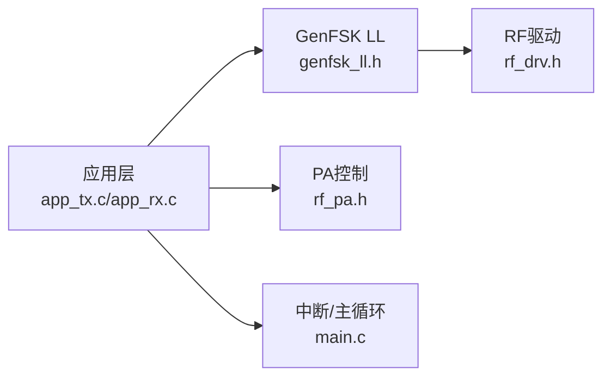

# 2.4G无线模式

<cite>
**本文引用的文件**
- [genfsk_ll.h](file://tc_ble_single_sdk/stack/2p4g/genfsk_ll/genfsk_ll.h)
- [app_config.h（GenFSK示例）](file://tc_ble_single_sdk/vendor/2p4g_genfsk_ll/app_config.h)
- [app.h（应用接口）](file://tc_ble_single_sdk/vendor/2p4g_genfsk_ll/app.h)
- [main.c（入口与中断）](file://tc_ble_single_sdk/vendor/2p4g_genfsk_ll/main.c)
- [app_tx.c（发送端示例）](file://tc_ble_single_sdk/vendor/2p4g_genfsk_ll/app_tx.c)
- [app_rx.c（接收端示例）](file://tc_ble_single_sdk/vendor/2p4g_genfsk_ll/app_rx.c)
- [rf_drv.h（B85驱动）](file://tc_ble_single_sdk/drivers/B85/lib/include/rf_drv.h)
- [rf_pa.h（PA控制）](file://tc_ble_single_sdk/drivers/B85/driver_ext/rf_pa.h)
</cite>

## 目录
1. [简介](#简介)
2. [项目结构](#项目结构)
3. [核心组件](#核心组件)
4. [架构总览](#架构总览)
5. [详细组件分析](#详细组件分析)
6. [依赖关系分析](#依赖关系分析)
7. [性能与功耗优化](#性能与功耗优化)
8. [故障诊断与调试](#故障诊断与调试)
9. [结论](#结论)
10. [附录：API参考与使用要点](#附录api参考与使用要点)

## 简介
本技术文档围绕2.4GHz GenFSK私有协议栈，系统阐述物理层参数、链路层协议与网络层管理机制，覆盖设备配对流程、信道选择与抗干扰策略，并提供设备发现、连接建立与数据传输的调用路径说明。同时给出多设备支持、冲突解决、重连机制、射频性能优化、功耗控制与信号质量监控方法，以及故障诊断工具与调试技巧。

## 项目结构
该SDK将2.4G GenFSK协议栈与应用解耦：
- 协议栈接口位于 stack/2p4g/genfsk_ll，提供统一的PHY/LL配置与收发控制API。
- 应用示例位于 vendor/2p4g_genfsk_ll，包含TX/RX/SRX/STX等模式的完整工程入口与主循环。
- 底层射频驱动位于 drivers/*/lib/include/rf_drv.h，提供RF初始化、功率、通道、缓冲、状态切换等能力。
- PA控制位于 drivers/*/driver_ext/rf_pa.h，用于外置功放开关时序配合。

图示来源
- [genfsk_ll.h:110-171](file://tc_ble_single_sdk/stack/2p4g/genfsk_ll/genfsk_ll.h#L110-L171)
- [rf_drv.h:474-549](file://tc_ble_single_sdk/drivers/B85/lib/include/rf_drv.h#L474-L549)
- [rf_pa.h:50-62](file://tc_ble_single_sdk/drivers/B85/driver_ext/rf_pa.h#L50-L62)
- [main.c:35-103](file://tc_ble_single_sdk/vendor/2p4g_genfsk_ll/main.c#L35-L103)

章节来源
- [app_config.h（GenFSK示例）:27-37](file://tc_ble_single_sdk/vendor/2p4g_genfsk_ll/app_config.h#L27-L37)
- [app.h:40-60](file://tc_ble_single_sdk/vendor/2p4g_genfsk_ll/app.h#L40-L60)
- [main.c:48-103](file://tc_ble_single_sdk/vendor/2p4g_genfsk_ll/main.c#L48-L103)

## 核心组件
- GenFSK协议栈接口（genfsk_ll.h）
  - PHY参数：数据速率、前导码长度、同步字长度与内容、CRC长度、调制指数（MI）、包格式（固定/可变载荷）。
  - 收发状态：TX/RX/AUTO/OFF；自动FSM：Single-TX、Single-RX、TX→RX、RX→TX。
  - 管道管理：Pipe0~Pipe5及ALL，支持多通道/多设备隔离。
  - 缓冲区：DMA RX缓冲设置、负载获取、RSSI读取、时间戳获取。
  - 定时：TX/RX settle/wait时间配置，保障PLL稳定与处理窗口。
- RF驱动（rf_drv.h）
  - 模式初始化、功率等级、通道设置、访问码（同步字）配置、收发状态机、缓冲配置、完成标志与RSSI读取。
  - 快速settling（部分平台）以缩短时延。
- 应用示例（app_tx.c / app_rx.c）
  - 展示如何配置速率、前导码、同步字、包格式、功率、通道、缓冲，并进入TX或RX主循环。
  - 中断处理中区分RF事件，更新计数与状态，切换下一缓冲避免丢包。
- PA控制（rf_pa.h）
  - 通过回调在TX/RX阶段控制外置功放使能引脚，提升发射功率与接收灵敏度。

章节来源
- [genfsk_ll.h:29-104](file://tc_ble_single_sdk/stack/2p4g/genfsk_ll/genfsk_ll.h#L29-L104)
- [genfsk_ll.h:110-171](file://tc_ble_single_sdk/stack/2p4g/genfsk_ll/genfsk_ll.h#L110-L171)
- [genfsk_ll.h:228-287](file://tc_ble_single_sdk/stack/2p4g/genfsk_ll/genfsk_ll.h#L228-L287)
- [genfsk_ll.h:314-423](file://tc_ble_single_sdk/stack/2p4g/genfsk_ll/genfsk_ll.h#L314-L423)
- [rf_drv.h:474-549](file://tc_ble_single_sdk/drivers/B85/lib/include/rf_drv.h#L474-L549)
- [rf_drv.h:640-780](file://tc_ble_single_sdk/drivers/B85/lib/include/rf_drv.h#L640-L780)
- [rf_pa.h:50-62](file://tc_ble_single_sdk/drivers/B85/driver_ext/rf_pa.h#L50-L62)
- [app_tx.c:111-142](file://tc_ble_single_sdk/vendor/2p4g_genfsk_ll/app_tx.c#L111-L142)
- [app_rx.c:144-178](file://tc_ble_single_sdk/vendor/2p4g_genfsk_ll/app_rx.c#L144-L178)

## 架构总览
下图展示了从应用到RF驱动的调用链路与关键状态流转。

图示来源
- [genfsk_ll.h:110-171](file://tc_ble_single_sdk/stack/2p4g/genfsk_ll/genfsk_ll.h#L110-L171)
- [genfsk_ll.h:314-423](file://tc_ble_single_sdk/stack/2p4g/genfsk_ll/genfsk_ll.h#L314-L423)
- [rf_drv.h:640-780](file://tc_ble_single_sdk/drivers/B85/lib/include/rf_drv.h#L640-L780)
- [app_tx.c:191-204](file://tc_ble_single_sdk/vendor/2p4g_genfsk_ll/app_tx.c#L191-L204)
- [app_rx.c:222-235](file://tc_ble_single_sdk/vendor/2p4g_genfsk_ll/app_rx.c#L222-L235)

## 详细组件分析

### 物理层（PHY）参数与GenFSK调制
- 数据速率与前导码
  - 速率设置必须在其他配置之前完成；前导码长度影响同步可靠性与时序开销。
- 同步字与包格式
  - 支持固定载荷与可变载荷两种包格式；同步字长度可选3/4/5字节，建议4字节以获得更好抗误判能力。
- CRC校验
  - 支持关闭、1字节、2字节三种长度，推荐至少1字节以保证基本完整性。
- 调制指数（MI）与频偏
  - MI=频偏×2/比特率；不同MI值对应不同带宽与抗噪特性，需根据环境权衡。
- 通道与频率
  - 中心频率=2400+通道×0.5 MHz；合理选择空闲信道以降低同频干扰。
- 收发定时
  - TX/RX settle时间必须满足最小要求（例如TX≥130μs，RX≥85μs），确保PLL锁定；可结合快速settling降低时延。

章节来源
- [genfsk_ll.h:118-171](file://tc_ble_single_sdk/stack/2p4g/genfsk_ll/genfsk_ll.h#L118-L171)
- [genfsk_ll.h:217-225](file://tc_ble_single_sdk/stack/2p4g/genfsk_ll/genfsk_ll.h#L217-L225)
- [genfsk_ll.h:314-354](file://tc_ble_single_sdk/stack/2p4g/genfsk_ll/genfsk_ll.h#L314-L354)
- [genfsk_ll.h:445-458](file://tc_ble_single_sdk/stack/2p4g/genfsk_ll/genfsk_ll.h#L445-L458)
- [rf_drv.h:474-549](file://tc_ble_single_sdk/drivers/B85/lib/include/rf_drv.h#L474-L549)

### 链路层（LL）协议设计
- 管道（Pipe）与多设备
  - 支持Pipe0~Pipe5，每管可独立配置同步字，实现多设备/多业务隔离；支持一次性打开/关闭所有管道。
- 自动FSM
  - Single-TX：定时精确发送。
  - Single-RX：定时监听，支持首次超时。
  - TX→RX：发送后等待ACK，适合确认机制。
  - RX→TX：收到数据后回发响应，适合请求-应答。
- 包头PID
  - 可在DPL格式包头中手动设置2bit PID，辅助区分会话或优先级。
- 缓冲与ISR
  - RX缓冲需4字节对齐且长度为16的整数倍；ISR中切换下一缓冲避免丢包，统计CRC成功次数便于评估链路质量。

图示来源
- [genfsk_ll.h:356-423](file://tc_ble_single_sdk/stack/2p4g/genfsk_ll/genfsk_ll.h#L356-L423)
- [genfsk_ll.h:173-197](file://tc_ble_single_sdk/stack/2p4g/genfsk_ll/genfsk_ll.h#L173-L197)
- [genfsk_ll.h:425-442](file://tc_ble_single_sdk/stack/2p4g/genfsk_ll/genfsk_ll.h#L425-L442)

章节来源
- [genfsk_ll.h:38-49](file://tc_ble_single_sdk/stack/2p4g/genfsk_ll/genfsk_ll.h#L38-L49)
- [genfsk_ll.h:356-423](file://tc_ble_single_sdk/stack/2p4g/genfsk_ll/genfsk_ll.h#L356-L423)
- [genfsk_ll.h:425-442](file://tc_ble_single_sdk/stack/2p4g/genfsk_ll/genfsk_ll.h#L425-L442)

### 网络层（NL）管理机制
- 设备发现与配对
  - 基于同步字+管道ID进行“软绑定”；两端预先配置相同同步字与通道，上电后对端即可被识别为已知设备。
- 信道选择与跳频
  - 静态信道：选择空闲信道降低干扰。
  - 动态跳频：按预设序列切换通道，结合随机退避减少碰撞。
- 冲突解决与重连
  - 采用CSMA-like退避：检测到忙或ACK缺失时，随机等待后重试。
  - 重连策略：连续失败N次后扩大退避窗口或切换信道。
- 多设备支持
  - 利用不同Pipe与同步字区分设备；必要时结合PID区分会话。

章节来源
- [genfsk_ll.h:38-49](file://tc_ble_single_sdk/stack/2p4g/genfsk_ll/genfsk_ll.h#L38-L49)
- [genfsk_ll.h:153-171](file://tc_ble_single_sdk/stack/2p4g/genfsk_ll/genfsk_ll.h#L153-L171)
- [genfsk_ll.h:425-442](file://tc_ble_single_sdk/stack/2p4g/genfsk_ll/genfsk_ll.h#L425-L442)

### 设备配对流程（示例）

[此图为概念流程图，不直接映射具体代码文件]

### 数据传输流程（TX→RX ACK）

图示来源
- [genfsk_ll.h:381-401](file://tc_ble_single_sdk/stack/2p4g/genfsk_ll/genfsk_ll.h#L381-L401)
- [app_tx.c:191-204](file://tc_ble_single_sdk/vendor/2p4g_genfsk_ll/app_tx.c#L191-L204)
- [app_rx.c:222-235](file://tc_ble_single_sdk/vendor/2p4g_genfsk_ll/app_rx.c#L222-L235)

## 依赖关系分析
- 应用层依赖GenFSK LL API进行参数配置与FSM调度。
- LL依赖RF驱动完成基带与RF寄存器操作。
- PA控制作为可选扩展，在TX/RX阶段控制外置功放。
- 主循环与中断服务程序负责事件分发与状态维护。

图示来源
- [genfsk_ll.h:110-171](file://tc_ble_single_sdk/stack/2p4g/genfsk_ll/genfsk_ll.h#L110-L171)
- [rf_drv.h:474-549](file://tc_ble_single_sdk/drivers/B85/lib/include/rf_drv.h#L474-L549)
- [rf_pa.h:50-62](file://tc_ble_single_sdk/drivers/B85/driver_ext/rf_pa.h#L50-L62)
- [main.c:35-103](file://tc_ble_single_sdk/vendor/2p4g_genfsk_ll/main.c#L35-L103)

章节来源
- [app_tx.c:111-142](file://tc_ble_single_sdk/vendor/2p4g_genfsk_ll/app_tx.c#L111-L142)
- [app_rx.c:144-178](file://tc_ble_single_sdk/vendor/2p4g_genfsk_ll/app_rx.c#L144-L178)
- [main.c:48-103](file://tc_ble_single_sdk/vendor/2p4g_genfsk_ll/main.c#L48-L103)

## 性能与功耗优化
- 射频性能
  - 选择合适的MI与数据速率，平衡带宽与灵敏度。
  - 合理设置前导码与同步字长度，提高同步成功率。
  - 使用CRC校验保证数据完整性。
  - 利用RSSI与时间戳进行链路质量评估与自适应调整。
- 功耗控制
  - 使用Single-RX/TX模式配合定时器，仅在需要时唤醒RF。
  - 启用低功耗模式（如深睡眠/保留模式）并在唤醒后恢复RF配置。
  - 合理设置TX/RX settle时间，避免过长待机。
- 信号质量监控
  - 统计RX CRC成功次数与RSSI分布，评估信道质量。
  - 根据RSSI阈值动态调整发射功率或切换信道。

章节来源
- [genfsk_ll.h:264-287](file://tc_ble_single_sdk/stack/2p4g/genfsk_ll/genfsk_ll.h#L264-L287)
- [genfsk_ll.h:314-354](file://tc_ble_single_sdk/stack/2p4g/genfsk_ll/genfsk_ll.h#L314-L354)
- [rf_drv.h:474-549](file://tc_ble_single_sdk/drivers/B85/lib/include/rf_drv.h#L474-L549)
- [app_rx.c:49-85](file://tc_ble_single_sdk/vendor/2p4g_genfsk_ll/app_rx.c#L49-L85)

## 故障诊断与调试
- 常见问题定位
  - 无法同步：检查同步字是否一致、前导码长度是否足够、通道是否正确。
  - CRC失败率高：检查MI与速率匹配、RSSI是否过低、是否存在强干扰。
  - 丢包：确认RX缓冲大小与对齐、ISR中是否及时切换缓冲。
- 调试工具
  - 使用调试IO输出TX/RX关键信号（TX EN、RX EN、DATA等）观察时序。
  - 打印RSSI、时间戳与计数，评估链路稳定性。
  - 通过LED指示收发状态，快速验证流程。
- 调试步骤建议
  - 先单端自环测试（TX→本地RX），再端到端测试。
  - 逐步增加负载与距离，观察RSSI与丢包变化。
  - 在不同信道与MI组合下对比性能。

章节来源
- [main.c:146-179](file://tc_ble_single_sdk/vendor/2p4g_genfsk_ll/main.c#L146-L179)
- [app_rx.c:49-85](file://tc_ble_single_sdk/vendor/2p4g_genfsk_ll/app_rx.c#L49-L85)
- [app_tx.c:39-54](file://tc_ble_single_sdk/vendor/2p4g_genfsk_ll/app_tx.c#L39-L54)

## 结论
本SDK提供了完整的2.4GHz GenFSK私有协议栈与示例工程，覆盖PHY/LL/NL各层关键能力。通过合理的参数配置、FSM调度与链路管理策略，可实现低时延、高可靠的多设备无线通信。结合RSSI监控、信道管理与功耗控制，可在复杂环境中获得稳定性能。

## 附录：API参考与使用要点
- 物理层配置
  - 设置数据速率、前导码长度、同步字长度与内容、包格式、CRC长度、调制指数、通道、功率。
  - 参考路径：[genfsk_ll.h:118-171](file://tc_ble_single_sdk/stack/2p4g/genfsk_ll/genfsk_ll.h#L118-L171)、[genfsk_ll.h:217-225](file://tc_ble_single_sdk/stack/2p4g/genfsk_ll/genfsk_ll.h#L217-L225)、[genfsk_ll.h:445-458](file://tc_ble_single_sdk/stack/2p4g/genfsk_ll/genfsk_ll.h#L445-L458)
- 收发控制
  - 设置TX/RX状态、缓冲、定时（settle/wait）、启动FSM（Single-TX/RX/TX→RX/RX→TX）。
  - 参考路径：[genfsk_ll.h:314-423](file://tc_ble_single_sdk/stack/2p4g/genfsk_ll/genfsk_ll.h#L314-L423)
- 链路层管理
  - 管道打开/关闭、TX Pipe选择、PID设置。
  - 参考路径：[genfsk_ll.h:173-197](file://tc_ble_single_sdk/stack/2p4g/genfsk_ll/genfsk_ll.h#L173-L197)、[genfsk_ll.h:425-442](file://tc_ble_single_sdk/stack/2p4g/genfsk_ll/genfsk_ll.h#L425-L442)
- 应用示例
  - 发送端初始化与主循环：[app_tx.c:111-142](file://tc_ble_single_sdk/vendor/2p4g_genfsk_ll/app_tx.c#L111-L142)、[app_tx.c:191-204](file://tc_ble_single_sdk/vendor/2p4g_genfsk_ll/app_tx.c#L191-L204)
  - 接收端初始化与主循环：[app_rx.c:144-178](file://tc_ble_single_sdk/vendor/2p4g_genfsk_ll/app_rx.c#L144-L178)、[app_rx.c:222-235](file://tc_ble_single_sdk/vendor/2p4g_genfsk_ll/app_rx.c#L222-L235)
- 射频驱动
  - 初始化、功率、通道、缓冲、状态切换、完成标志与RSSI。
  - 参考路径：[rf_drv.h:474-549](file://tc_ble_single_sdk/drivers/B85/lib/include/rf_drv.h#L474-L549)、[rf_drv.h:640-780](file://tc_ble_single_sdk/drivers/B85/lib/include/rf_drv.h#L640-L780)
- PA控制
  - 外置功放使能引脚与回调。
  - 参考路径：[rf_pa.h:50-62](file://tc_ble_single_sdk/drivers/B85/driver_ext/rf_pa.h#L50-L62)