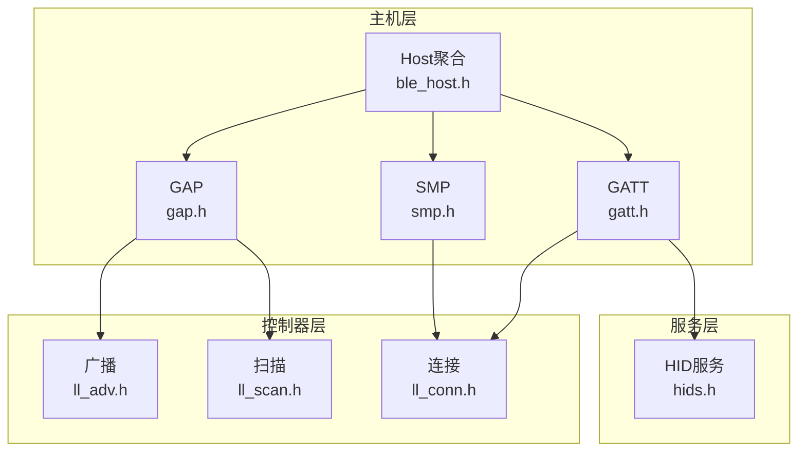
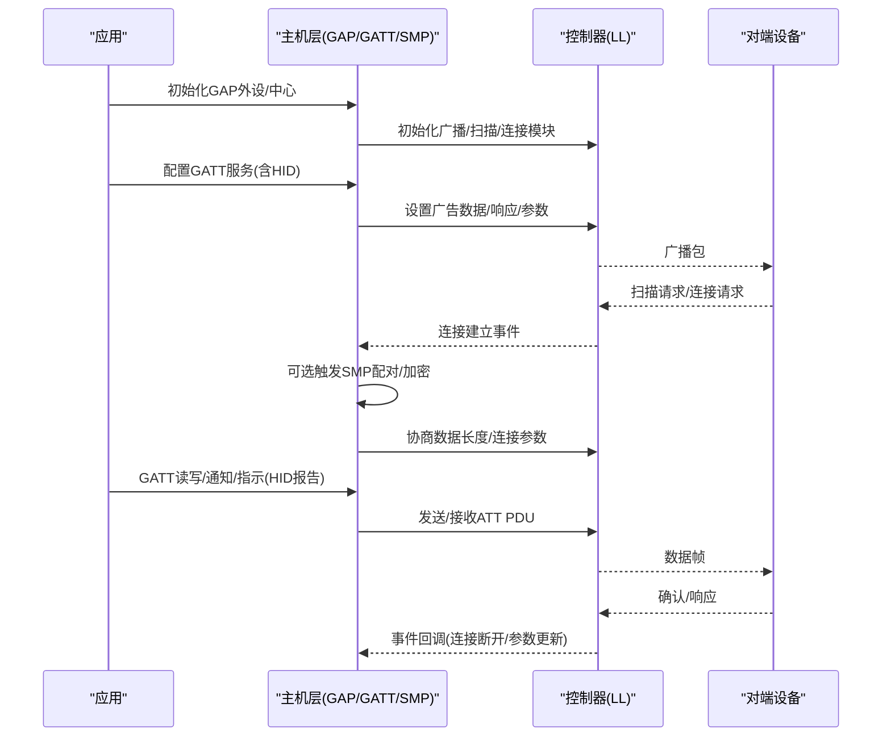
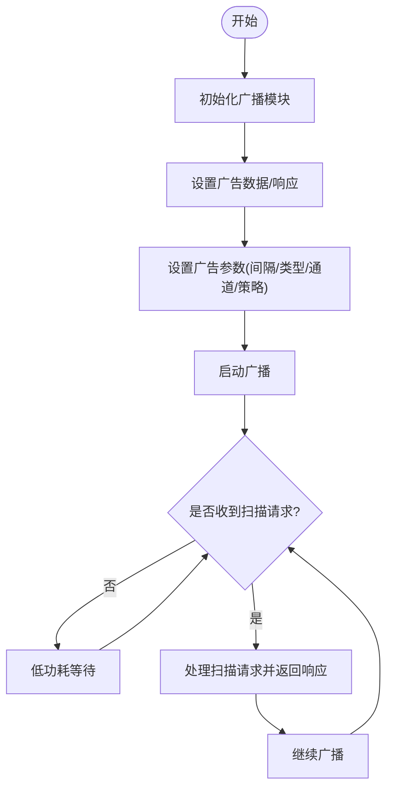
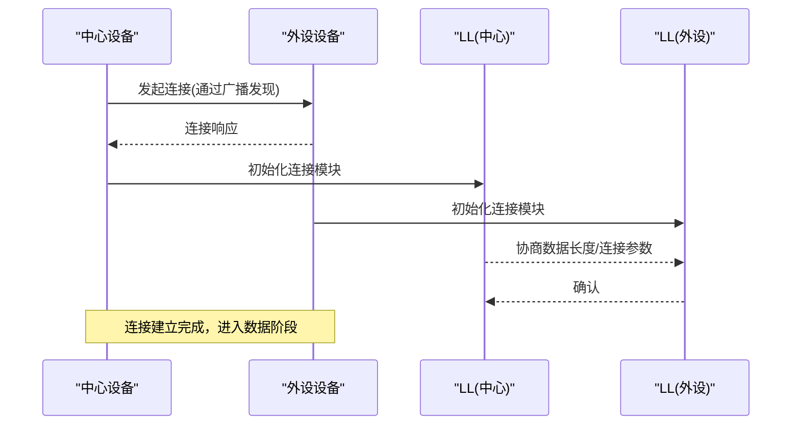
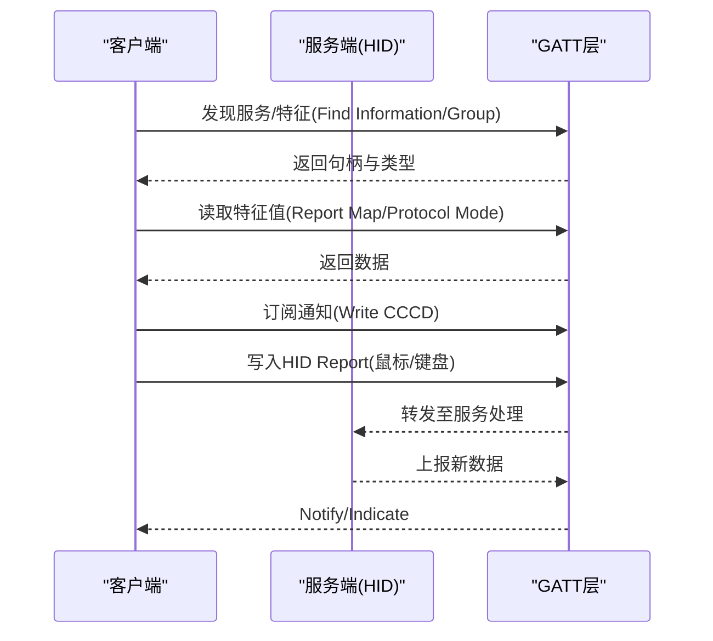
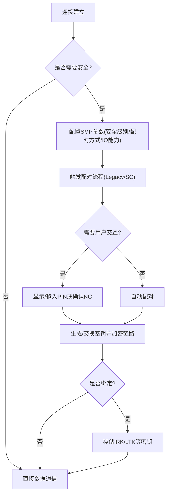
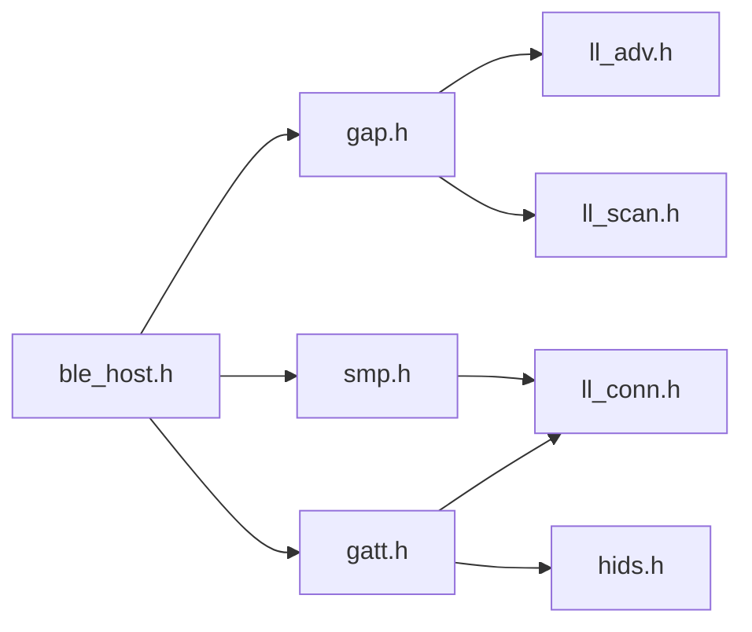

# BLE蓝牙模式

<cite>
**本文引用的文件**
- [hids.h](file://tc_ble_single_sdk/stack/ble/service/hids.h)
- [gap.h](file://tc_ble_single_sdk/stack/ble/host/gap/gap.h)
- [gatt.h](file://tc_ble_single_sdk/stack/ble/host/attr/gatt.h)
- [ble_host.h](file://tc_ble_single_sdk/stack/ble/host/ble_host.h)
- [ll_conn.h](file://tc_ble_single_sdk/stack/ble/controller/ll/ll_conn/ll_conn.h)
- [ll_adv.h](file://tc_ble_single_sdk/stack/ble/controller/ll/ll_adv.h)
- [ll_scan.h](file://tc_ble_single_sdk/stack/ble/controller/ll/ll_scan.h)
- [smp.h](file://tc_ble_single_sdk/stack/ble/host/smp/smp.h)
</cite>

## 目录
1. [简介](#简介)
2. [项目结构](#项目结构)
3. [核心组件](#核心组件)
4. [架构总览](#架构总览)
5. [详细组件分析](#详细组件分析)
6. [依赖关系分析](#依赖关系分析)
7. [性能与功耗优化](#性能与功耗优化)
8. [故障排查指南](#故障排查指南)
9. [结论](#结论)
10. [附录：API调用示例与最佳实践](#附录api调用示例与最佳实践)

## 简介
本技术文档围绕BLE 4.2协议栈在Telink SDK中的实现，系统阐述GAP（通用访问配置文件）与GATT（通用属性配置文件）工作机制，覆盖设备初始化、广播与扫描、连接建立与维护、HID服务特征定义与使用、配对与安全认证流程，以及多设备连接管理、连接参数配置与功耗优化策略。文档同时提供基于SDK接口的典型调用路径说明，帮助开发者快速构建稳定高效的BLE应用。

## 项目结构
本项目采用分层设计：控制器层（LL）负责射频链路、广播/扫描与连接状态机；主机层（Host）提供GAP/GATT/SMP等协议栈能力；服务层暴露标准服务（如HID）。关键头文件分布如下：
- GAP接口：host/gap/gap.h
- GATT接口：host/attr/gatt.h
- SMP安全：host/smp/smp.h
- LL广播/扫描/连接：controller/ll/ll_adv.h, ll_scan.h, ll_conn/ll_conn.h
- 服务定义：service/hids.h
- Host聚合入口：host/ble_host.h

图表来源
- [gap.h:78-114](file://tc_ble_single_sdk/stack/ble/host/gap/gap.h#L78-L114)
- [gatt.h:33-208](file://tc_ble_single_sdk/stack/ble/host/attr/gatt.h#L33-L208)
- [smp.h:170-372](file://tc_ble_single_sdk/stack/ble/host/smp/smp.h#L170-L372)
- [ll_adv.h:33-250](file://tc_ble_single_sdk/stack/ble/controller/ll/ll_adv.h#L33-L250)
- [ll_scan.h:31-143](file://tc_ble_single_sdk/stack/ble/controller/ll/ll_scan.h#L31-L143)
- [ll_conn.h:28-82](file://tc_ble_single_sdk/stack/ble/controller/ll/ll_conn/ll_conn.h#L28-L82)
- [hids.h:27-85](file://tc_ble_single_sdk/stack/ble/service/hids.h#L27-L85)

章节来源
- [gap.h:78-114](file://tc_ble_single_sdk/stack/ble/host/gap/gap.h#L78-L114)
- [gatt.h:33-208](file://tc_ble_single_sdk/stack/ble/host/attr/gatt.h#L33-L208)
- [smp.h:170-372](file://tc_ble_single_sdk/stack/ble/host/smp/smp.h#L170-L372)
- [ll_adv.h:33-250](file://tc_ble_single_sdk/stack/ble/controller/ll/ll_adv.h#L33-L250)
- [ll_scan.h:31-143](file://tc_ble_single_sdk/stack/ble/controller/ll/ll_scan.h#L31-L143)
- [ll_conn.h:28-82](file://tc_ble_single_sdk/stack/ble/controller/ll/ll_conn/ll_conn.h#L28-L82)
- [hids.h:27-85](file://tc_ble_single_sdk/stack/ble/service/hids.h#L27-L85)

## 核心组件
- GAP（通用访问配置文件）
  - 负责设备发现、广播/扫描、角色切换、连接事件分发。
  - 提供外设与中心初始化入口，以及主机初始化校验。
- GATT（通用属性配置文件）
  - 提供属性读写、通知/指示、查找服务/特征、批量操作等接口。
  - 是上层服务（如HID）数据交换的载体。
- SMP（安全管理器）
  - 实现配对、绑定、加密、MITM保护、OOB、Secure Connections等安全能力。
  - 支持多种IO能力与安全级别配置。
- LL（链路层）
  - 广播模块：设置广告数据/响应、广告参数、通道映射、过滤策略、定时器等。
  - 扫描模块：设置扫描类型/间隔/窗口、去重过滤、通道映射、在连接态中插入扫描等。
  - 连接模块：ACL连接句柄、数据长度协商、最大MD数量、有效收发长度查询。
- HID服务
  - 定义HID特征UUID、报告ID、协议模式、信息标志等，用于键鼠/游戏手柄等输入输出。

章节来源
- [gap.h:78-114](file://tc_ble_single_sdk/stack/ble/host/gap/gap.h#L78-L114)
- [gatt.h:33-208](file://tc_ble_single_sdk/stack/ble/host/attr/gatt.h#L33-L208)
- [smp.h:170-372](file://tc_ble_single_sdk/stack/ble/host/smp/smp.h#L170-L372)
- [ll_adv.h:33-250](file://tc_ble_single_sdk/stack/ble/controller/ll/ll_adv.h#L33-L250)
- [ll_scan.h:31-143](file://tc_ble_single_sdk/stack/ble/controller/ll/ll_scan.h#L31-L143)
- [ll_conn.h:28-82](file://tc_ble_single_sdk/stack/ble/controller/ll/ll_conn/ll_conn.h#L28-L82)
- [hids.h:27-85](file://tc_ble_single_sdk/stack/ble/service/hids.h#L27-L85)

## 架构总览
下图展示从应用到协议栈再到控制器的调用层次，以及广播/扫描/连接/数据传输的关键路径。

图表来源
- [gap.h:78-114](file://tc_ble_single_sdk/stack/ble/host/gap/gap.h#L78-L114)
- [gatt.h:33-208](file://tc_ble_single_sdk/stack/ble/host/attr/gatt.h#L33-L208)
- [smp.h:170-372](file://tc_ble_single_sdk/stack/ble/host/smp/smp.h#L170-L372)
- [ll_adv.h:33-250](file://tc_ble_single_sdk/stack/ble/controller/ll/ll_adv.h#L33-L250)
- [ll_scan.h:31-143](file://tc_ble_single_sdk/stack/ble/controller/ll/ll_scan.h#L31-L143)
- [ll_conn.h:28-82](file://tc_ble_single_sdk/stack/ble/controller/ll/ll_conn/ll_conn.h#L28-L82)

## 详细组件分析

### GAP工作流与初始化
- 外设初始化：blc_gap_peripheral_init()
- 中心初始化：blc_gap_central_init()
- 主机初始化校验：blc_host_checkHostInitialization()

要点
- 先完成底层模块初始化（广播/扫描/连接），再初始化GAP。
- 通过事件回调处理连接/断开、广播/扫描结果、参数更新等。

章节来源
- [gap.h:78-114](file://tc_ble_single_sdk/stack/ble/host/gap/gap.h#L78-L114)

### 广播与扫描
- 广播模块
  - 初始化：blc_ll_initAdvertising_module()
  - 设置广告数据/扫描响应：bls_ll_setAdvData(), bls_ll_setScanRspData()
  - 设置广告参数：bls_ll_setAdvParam()
  - 启停广播：bls_ll_setAdvEnable()
  - 高级特性：自定义通道、持续广播、过滤策略、定时器等
- 扫描模块
  - 初始化：blc_ll_initScanning_module()
  - 设置扫描参数：blc_ll_setScanParameter()
  - 启用/禁用扫描：blc_ll_setScanEnable()
  - 在连接态插入扫描：add/remove scanning in conn slave role

图表来源
- [ll_adv.h:33-250](file://tc_ble_single_sdk/stack/ble/controller/ll/ll_adv.h#L33-L250)
- [ll_scan.h:31-143](file://tc_ble_single_sdk/stack/ble/controller/ll/ll_scan.h#L31-L143)

章节来源
- [ll_adv.h:33-250](file://tc_ble_single_sdk/stack/ble/controller/ll/ll_adv.h#L33-L250)
- [ll_scan.h:31-143](file://tc_ble_single_sdk/stack/ble/controller/ll/ll_scan.h#L31-L143)

### 连接建立与维护
- 连接模块
  - 初始化：blc_ll_initConnection_module()
  - 数据长度协商：blc_ll_exchangeDataLength()
  - 查询有效收发长度：blc_ll_get_connEffectiveMaxTxOctets(), blc_ll_get_connEffectiveMaxRxOctets()
  - 连接句柄常量：BLM_CONN_HANDLE（主）、BLS_CONN_HANDLE（从）
- 维护要点
  - 连接参数更新（间隔/延迟/超时）由主机层协调，控制器执行。
  - 多连接场景需动态管理连接句柄（当前单连接SDK使用固定句柄简化）。

图表来源
- [ll_conn.h:28-82](file://tc_ble_single_sdk/stack/ble/controller/ll/ll_conn/ll_conn.h#L28-L82)

章节来源
- [ll_conn.h:28-82](file://tc_ble_single_sdk/stack/ble/controller/ll/ll_conn/ll_conn.h#L28-L82)

### GATT数据交互与服务发现
- 通知/指示：blc_gatt_pushHandleValueNotify(), blc_gatt_pushHandleValueIndicate()
- 写入：无响应写 blc_gatt_pushWriteCommand(), 带响应写 blc_gatt_pushWriteRequest()
- 读取：blc_gatt_pushReadRequest(), 分片读 blc_gatt_pushReadBlobRequest()
- 服务/特征发现：Find Information, Find By Type Value, Read By Group Type
- 批量/准备写入：Read Multi, Prepare Write + Execute Write

图表来源
- [gatt.h:33-208](file://tc_ble_single_sdk/stack/ble/host/attr/gatt.h#L33-L208)

章节来源
- [gatt.h:33-208](file://tc_ble_single_sdk/stack/ble/host/attr/gatt.h#L33-L208)

### HID服务特征与用法
- 特征UUID：Boot Input/Output、Information、Report Map、Control Point、Report、Protocol Mode
- 报告ID：键盘输入、消费控制输入、鼠标输入、游戏手柄输入、LED输出、Feature、音频/OTA等扩展
- 协议模式：Boot或Report模式，默认Report模式
- 信息标志：RemoteWake、NormallyConnectable

使用建议
- 在GATT服务中注册HID特征，按Report ID组织数据。
- 通过Write Command/Request下发控制指令，通过Notify/Indicate上报输入事件。

章节来源
- [hids.h:27-85](file://tc_ble_single_sdk/stack/ble/service/hids.h#L27-L85)

### 配对与安全认证（SMP）
- 安全级别与模式：支持无加密、未认证加密、已认证加密、安全连接加密等
- 配对方法：Legacy Pairing / Secure Connections
- IO能力：显示/按键/仅显示/无输入输出等
- 绑定模式：可绑定/不可绑定
- MITM/OOB/Keypress：可配置开启
- 调试辅助：手动设置PIN码（仅供调试）

图表来源
- [smp.h:170-372](file://tc_ble_single_sdk/stack/ble/host/smp/smp.h#L170-L372)

章节来源
- [smp.h:170-372](file://tc_ble_single_sdk/stack/ble/host/smp/smp.h#L170-L372)

## 依赖关系分析
- ble_host.h聚合了L2CAP、Signaling、ATT/GATT、SMP、GAP、Multi Device等头文件，作为主机层统一入口。
- GAP依赖LL广播/扫描以完成设备发现与连接建立。
- GATT依赖LL连接进行ATT PDU传输。
- SMP在连接建立后按需触发，影响后续数据加密与绑定。
- HID服务通过GATT暴露特征，供上下行数据交换。

图表来源
- [ble_host.h:27-51](file://tc_ble_single_sdk/stack/ble/host/ble_host.h#L27-L51)
- [gap.h:78-114](file://tc_ble_single_sdk/stack/ble/host/gap/gap.h#L78-L114)
- [gatt.h:33-208](file://tc_ble_single_sdk/stack/ble/host/attr/gatt.h#L33-L208)
- [smp.h:170-372](file://tc_ble_single_sdk/stack/ble/host/smp/smp.h#L170-L372)
- [ll_adv.h:33-250](file://tc_ble_single_sdk/stack/ble/controller/ll/ll_adv.h#L33-L250)
- [ll_scan.h:31-143](file://tc_ble_single_sdk/stack/ble/controller/ll/ll_scan.h#L31-L143)
- [ll_conn.h:28-82](file://tc_ble_single_sdk/stack/ble/controller/ll/ll_conn/ll_conn.h#L28-L82)
- [hids.h:27-85](file://tc_ble_single_sdk/stack/ble/service/hids.h#L27-L85)

章节来源
- [ble_host.h:27-51](file://tc_ble_single_sdk/stack/ble/host/ble_host.h#L27-L51)

## 性能与功耗优化
- 广播间隔与占空比
  - 增大广播间隔可降低功耗，但会增加发现时延；根据场景选择合适间隔。
  - 使用扫描响应携带必要信息，减少额外交互。
- 连接参数
  - 合理设置连接间隔、延迟与超时，平衡时延与功耗。
  - 使用数据长度协商提升吞吐，减少分包次数。
- 通道与过滤
  - 自定义广告通道可在干扰环境下改善鲁棒性。
  - 启用扫描去重过滤减少重复上报。
- 通知/指示
  - 仅在必要时订阅通知，避免频繁CCCD写入。
  - 批量写入/读取可减少协议开销。
- 安全与绑定
  - 预先生成ECDH密钥可缩短配对时延。
  - 合理使用绑定，避免重复配对带来的时延与能耗。

[本节为通用指导，不直接分析具体文件]

## 故障排查指南
- 无法发现设备
  - 检查广播数据/响应是否正确设置，广告参数是否合规。
  - 确认扫描参数（类型/间隔/窗口）与过滤策略。
- 连接失败
  - 核对地址类型、过滤策略、通道映射。
  - 检查连接模块初始化与数据长度协商。
- 配对失败
  - 检查SMP安全级别、配对方法、IO能力配置是否匹配。
  - 如需用户交互，确保正确传入PIN或确认NC。
- 数据异常
  - 验证GATT特征句柄与数据类型。
  - 检查通知订阅状态与MTU协商结果。

章节来源
- [ll_adv.h:33-250](file://tc_ble_single_sdk/stack/ble/controller/ll/ll_adv.h#L33-L250)
- [ll_scan.h:31-143](file://tc_ble_single_sdk/stack/ble/controller/ll/ll_scan.h#L31-L143)
- [ll_conn.h:28-82](file://tc_ble_single_sdk/stack/ble/controller/ll/ll_conn/ll_conn.h#L28-L82)
- [smp.h:170-372](file://tc_ble_single_sdk/stack/ble/host/smp/smp.h#L170-L372)
- [gatt.h:33-208](file://tc_ble_single_sdk/stack/ble/host/attr/gatt.h#L33-L208)

## 结论
本SDK将GAP/GATT/SMP与LL解耦清晰，便于在不同角色与场景下灵活组合。通过合理的广播/扫描参数、连接参数与安全配置，可实现低时延、低功耗且稳定的BLE通信。HID服务的标准化特征定义使键鼠/手柄等设备快速接入。结合本文档的流程与调优建议，可有效提升产品体验与可靠性。

[本节为总结，不直接分析具体文件]

## 附录：API调用示例与最佳实践
以下为典型操作流程的API调用顺序说明（以路径引用代替代码片段）：

- 设备初始化
  - 初始化广播模块：参考 [ll_adv.h:33-37](file://tc_ble_single_sdk/stack/ble/controller/ll/ll_adv.h#L33-L37)
  - 初始化扫描模块：参考 [ll_scan.h:31-36](file://tc_ble_single_sdk/stack/ble/controller/ll/ll_scan.h#L31-L36)
  - 初始化连接模块：参考 [ll_conn.h:43-49](file://tc_ble_single_sdk/stack/ble/controller/ll/ll_conn/ll_conn.h#L43-L49)
  - 初始化GAP外设/中心：参考 [gap.h:78-94](file://tc_ble_single_sdk/stack/ble/host/gap/gap.h#L78-L94)
  - 主机初始化校验：参考 [gap.h:107-114](file://tc_ble_single_sdk/stack/ble/host/gap/gap.h#L107-L114)

- 广播与扫描
  - 设置广告数据/响应：参考 [ll_adv.h:40-59](file://tc_ble_single_sdk/stack/ble/controller/ll/ll_adv.h#L40-L59)
  - 设置广告参数：参考 [ll_adv.h:74-90](file://tc_ble_single_sdk/stack/ble/controller/ll/ll_adv.h#L74-L90)
  - 启动/停止广播：参考 [ll_adv.h:95-102](file://tc_ble_single_sdk/stack/ble/controller/ll/ll_adv.h#L95-L102)
  - 设置扫描参数：参考 [ll_scan.h:39-50](file://tc_ble_single_sdk/stack/ble/controller/ll/ll_scan.h#L39-L50)
  - 启用/禁用扫描：参考 [ll_scan.h:53-62](file://tc_ble_single_sdk/stack/ble/controller/ll/ll_scan.h#L53-L62)

- 连接建立与维护
  - 数据长度协商：参考 [ll_conn.h:53-60](file://tc_ble_single_sdk/stack/ble/controller/ll/ll_conn/ll_conn.h#L53-L60)
  - 查询有效收发长度：参考 [ll_conn.h:63-75](file://tc_ble_single_sdk/stack/ble/controller/ll/ll_conn/ll_conn.h#L63-L75)

- GATT服务发现与数据传输
  - 发现服务/特征：参考 [gatt.h:86-150](file://tc_ble_single_sdk/stack/ble/host/attr/gatt.h#L86-L150)
  - 读取/写入：参考 [gatt.h:122-172](file://tc_ble_single_sdk/stack/ble/host/attr/gatt.h#L122-L172)
  - 通知/指示：参考 [gatt.h:33-59](file://tc_ble_single_sdk/stack/ble/host/attr/gatt.h#L33-L59)

- HID服务
  - 特征与报告定义：参考 [hids.h:27-85](file://tc_ble_single_sdk/stack/ble/service/hids.h#L27-L85)

- 配对与安全
  - 设置安全级别/配对方法/IO能力：参考 [smp.h:170-272](file://tc_ble_single_sdk/stack/ble/host/smp/smp.h#L170-L272)
  - 用户交互（PIN/NC）：参考 [smp.h:283-342](file://tc_ble_single_sdk/stack/ble/host/smp/smp.h#L283-L342)
  - OOB与密钥管理：参考 [smp.h:344-372](file://tc_ble_single_sdk/stack/ble/host/smp/smp.h#L344-L372)

最佳实践
- 先完成所有底层模块初始化，再进行GAP初始化与主机校验。
- 根据应用场景选择合适的广播间隔与连接参数，兼顾时延与功耗。
- 在连接建立后尽快完成数据长度协商，提升吞吐。
- 合理使用SMP安全级别与绑定策略，避免不必要的配对开销。
- 使用GATT批量操作减少协议交互次数。

[本节为操作指引，不直接分析具体文件]