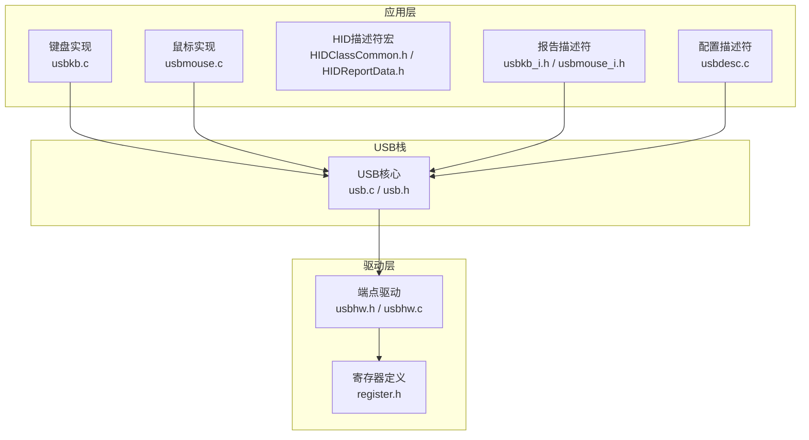
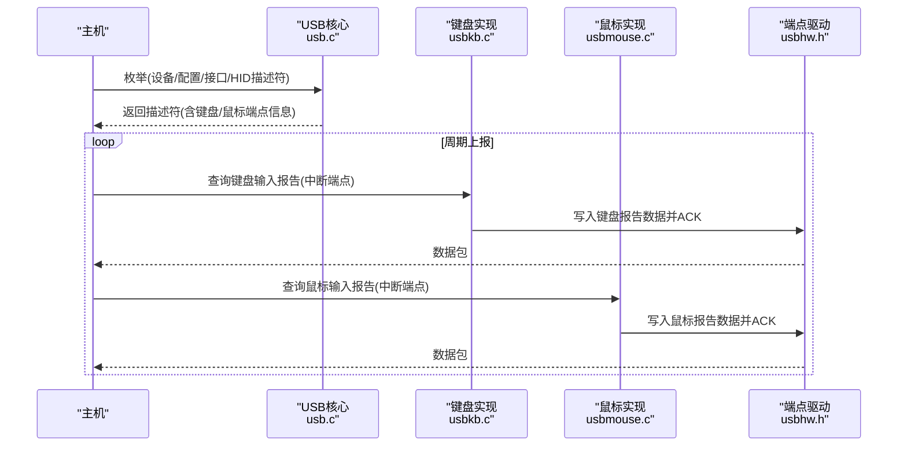
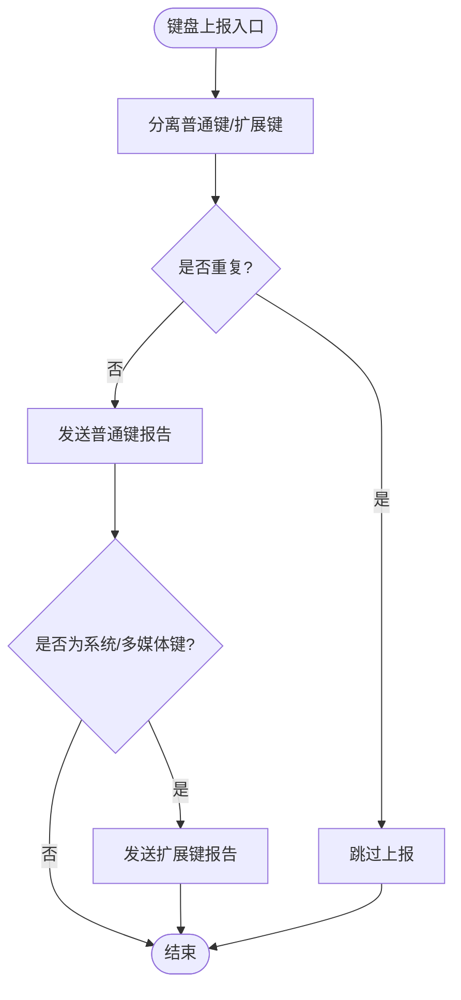
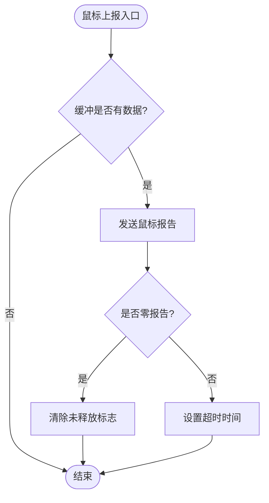
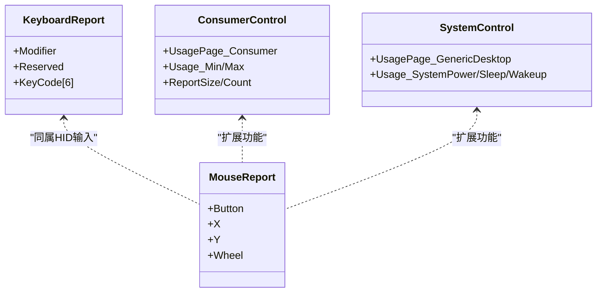
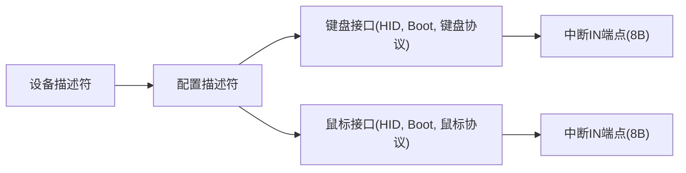
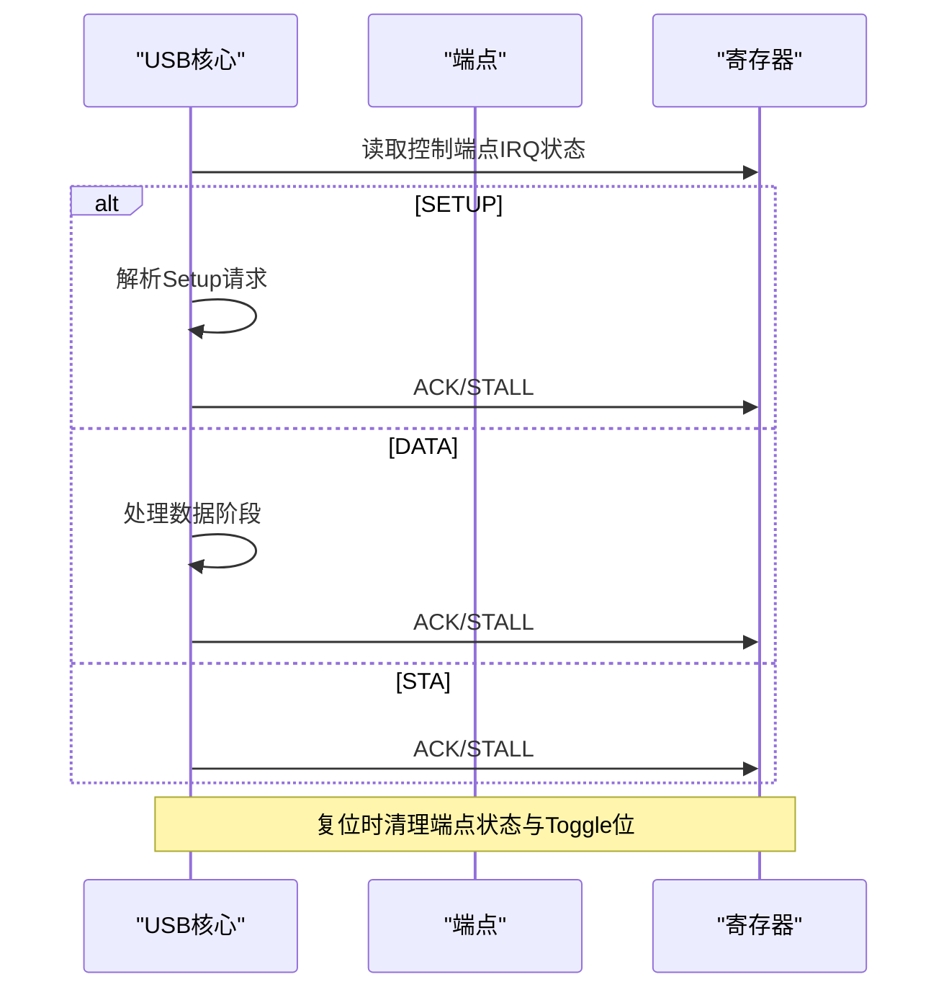
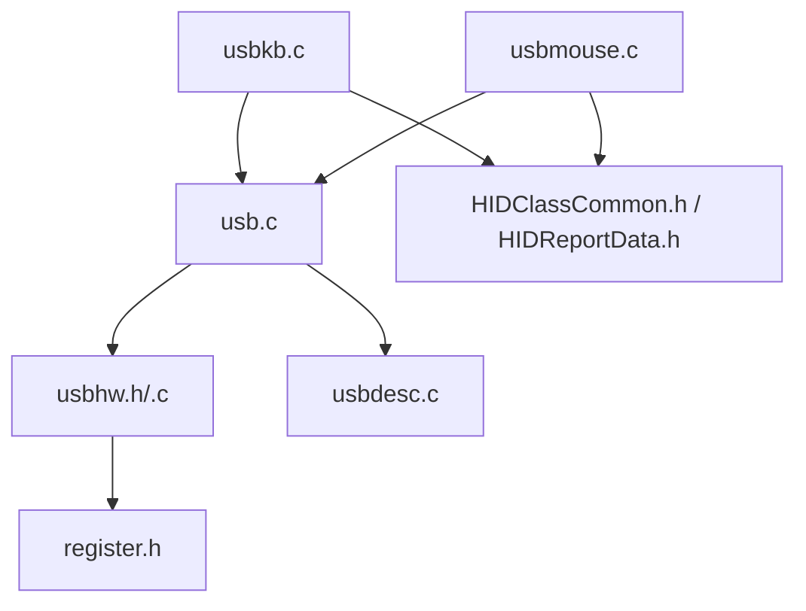

# USB有线模式

<cite>
**本文引用的文件**
- [usbkb.c](file://tc_ble_single_sdk/application/app/usbkb.c)
- [usbmouse.c](file://tc_ble_single_sdk/application/app/usbmouse.c)
- [usbkb_i.h](file://tc_ble_single_sdk/application/app/usbkb_i.h)
- [usbmouse_i.h](file://tc_ble_single_sdk/application/app/usbmouse_i.h)
- [HIDClassCommon.h](file://tc_ble_single_sdk/application/usbstd/HIDClassCommon.h)
- [HIDReportData.h](file://tc_ble_single_sdk/application/usbstd/HIDReportData.h)
- [usbdesc.c](file://tc_ble_single_sdk/application/usbstd/usbdesc.c)
- [usb.h](file://tc_ble_single_sdk/application/usbstd/usb.h)
- [usb.c](file://tc_ble_single_sdk/application/usbstd/usb.c)
- [usbhw.h](file://tc_ble_single_sdk/drivers/B85/usbhw.h)
- [usbhw.c](file://tc_ble_single_sdk/drivers/B85/usbhw.c)
- [register.h](file://tc_ble_single_sdk/drivers/B85/register.h)
</cite>

## 目录
1. [简介](#简介)
2. [项目结构](#项目结构)
3. [核心组件](#核心组件)
4. [架构总览](#架构总览)
5. [详细组件分析](#详细组件分析)
6. [依赖关系分析](#依赖关系分析)
7. [性能与优化](#性能与优化)
8. [故障排查指南](#故障排查指南)
9. [结论](#结论)
10. [附录：API调用示例与兼容性测试](#附录api调用示例与兼容性测试)

## 简介
本技术文档聚焦于该SDK中的USB有线连接模式，围绕HID类设备（键盘、鼠标）的实现原理展开。内容涵盖：
- HID报告描述符定义与使用（键盘、鼠标、多媒体键、系统控制键）
- USB设备枚举过程、端点管理与数据传输机制
- 数据缓冲与流控实现（环形缓冲、溢出保护、去抖与释放超时）
- API调用示例（初始化、发送报告、事件处理）
- USB电源管理、热插拔支持与兼容性考虑
- 性能优化技巧、错误处理与调试方法
- 不同操作系统下的兼容性测试要点

## 项目结构
本项目将USB应用层与驱动层解耦：
- 应用层：HID类实现（键盘、鼠标）、HID报告描述符、配置描述符
- 标准USB栈：控制请求处理、中断/批量传输、端点状态机
- 驱动层：寄存器级端点操作、IRQ处理、端点忙闲检测

图表来源
- [usbkb.c:1-390](file://tc_ble_single_sdk/application/app/usbkb.c#L1-L390)
- [usbmouse.c:1-157](file://tc_ble_single_sdk/application/app/usbmouse.c#L1-L157)
- [HIDClassCommon.h:295-354](file://tc_ble_single_sdk/application/usbstd/HIDClassCommon.h#L295-L354)
- [HIDReportData.h:71-110](file://tc_ble_single_sdk/application/usbstd/HIDReportData.h#L71-L110)
- [usbdesc.c:668-712](file://tc_ble_single_sdk/application/usbstd/usbdesc.c#L668-L712)
- [usb.c:891-930](file://tc_ble_single_sdk/application/usbstd/usb.c#L891-L930)
- [usbhw.h:27-54](file://tc_ble_single_sdk/drivers/B85/usbhw.h#L27-L54)
- [register.h:449-494](file://tc_ble_single_sdk/drivers/B85/register.h#L449-L494)

章节来源
- [usbdesc.c:234-266](file://tc_ble_single_sdk/application/usbstd/usbdesc.c#L234-L266)
- [usbdesc.c:668-712](file://tc_ble_single_sdk/application/usbstd/usbdesc.c#L668-L712)
- [usb.c:891-930](file://tc_ble_single_sdk/application/usbstd/usb.c#L891-L930)
- [usbhw.h:27-54](file://tc_ble_single_sdk/drivers/B85/usbhw.h#L27-L54)

## 核心组件
- 键盘HID实现：负责按键分离、重复上报抑制、系统/多媒体键映射、缓冲区与超时释放
- 鼠标HID实现：负责移动/滚轮/按键上报、平滑策略、释放超时
- HID描述符：键盘、鼠标、多媒体键、系统控制键的报告描述符
- USB配置描述符：声明接口、端点类型、轮询间隔等
- USB核心：控制请求处理、端点忙闲、数据ACK/NACK、复位处理
- 驱动层：端点读写、忙闲检测、IRQ标志位、寄存器访问

章节来源
- [usbkb.c:134-337](file://tc_ble_single_sdk/application/app/usbkb.c#L134-L337)
- [usbmouse.c:44-151](file://tc_ble_single_sdk/application/app/usbmouse.c#L44-L151)
- [usbkb_i.h:35-45](file://tc_ble_single_sdk/application/app/usbkb_i.h#L35-L45)
- [usbmouse_i.h:248-456](file://tc_ble_single_sdk/application/app/usbmouse_i.h#L248-L456)
- [usbdesc.c:668-712](file://tc_ble_single_sdk/application/usbstd/usbdesc.c#L668-L712)
- [usb.c:813-878](file://tc_ble_single_sdk/application/usbstd/usb.c#L813-L878)
- [usbhw.h:152-197](file://tc_ble_single_sdk/drivers/B85/usbhw.h#L152-L197)

## 架构总览
USB设备在主机枚举时返回设备、配置、接口、端点及HID报告描述符；设备通过中断端点周期性向主机上报输入报告。键盘与鼠标各自维护独立的数据缓冲与释放逻辑，避免重复上报并保证释放一致性。

图表来源
- [usbdesc.c:668-712](file://tc_ble_single_sdk/application/usbstd/usbdesc.c#L668-L712)
- [usb.c:891-930](file://tc_ble_single_sdk/application/usbstd/usb.c#L891-L930)
- [usbkb.c:150-213](file://tc_ble_single_sdk/application/app/usbkb.c#L150-L213)
- [usbmouse.c:107-151](file://tc_ble_single_sdk/application/app/usbmouse.c#L107-L151)
- [usbhw.h:152-197](file://tc_ble_single_sdk/drivers/B85/usbhw.h#L152-L197)

## 详细组件分析

### 键盘HID实现
- 按键分离：将普通键与扩展键（系统/多媒体）分离，分别走不同上报路径
- 重复上报抑制：比较上次数据，相同则跳过上报，减少总线负载
- 释放超时：若按键未释放，超过阈值自动发送释放报告，防止卡键
- 缓冲区：环形缓冲队列，支持多包排队与溢出保护
- CRC校验：可选软件CRC，兼容特定主机要求

图表来源
- [usbkb.c:134-148](file://tc_ble_single_sdk/application/app/usbkb.c#L134-L148)
- [usbkb.c:293-337](file://tc_ble_single_sdk/application/app/usbkb.c#L293-L337)
- [usbkb.c:343-388](file://tc_ble_single_sdk/application/app/usbkb.c#L343-L388)

章节来源
- [usbkb.c:134-337](file://tc_ble_single_sdk/application/app/usbkb.c#L134-L337)
- [usbkb.c:343-388](file://tc_ble_single_sdk/application/app/usbkb.c#L343-L388)

### 鼠标HID实现
- 数据缓冲：固定大小环形缓冲，写指针满时丢弃旧数据或等待
- 平滑策略：可配置平滑上报，降低高频抖动
- 释放超时：无动作时自动发送零报告，确保状态一致
- 协议兼容：支持非Boot与Boot协议两种格式

图表来源
- [usbmouse.c:44-98](file://tc_ble_single_sdk/application/app/usbmouse.c#L44-L98)
- [usbmouse.c:107-151](file://tc_ble_single_sdk/application/app/usbmouse.c#L107-L151)

章节来源
- [usbmouse.c:44-151](file://tc_ble_single_sdk/application/app/usbmouse.c#L44-L151)

### HID报告描述符
- 键盘：包含修饰键、保留位、最多N个按键码的输入报告
- 鼠标：按钮、X/Y相对坐标、滚轮相对量，以及多媒体键、系统控制键
- 宏定义：使用HID报告宏构建描述符，便于维护和扩展

图表来源
- [HIDClassCommon.h:295-354](file://tc_ble_single_sdk/application/usbstd/HIDClassCommon.h#L295-L354)
- [HIDReportData.h:71-110](file://tc_ble_single_sdk/application/usbstd/HIDReportData.h#L71-L110)
- [usbkb_i.h:35-45](file://tc_ble_single_sdk/application/app/usbkb_i.h#L35-L45)
- [usbmouse_i.h:248-456](file://tc_ble_single_sdk/application/app/usbmouse_i.h#L248-L456)

章节来源
- [HIDClassCommon.h:295-354](file://tc_ble_single_sdk/application/usbstd/HIDClassCommon.h#L295-L354)
- [HIDReportData.h:71-110](file://tc_ble_single_sdk/application/usbstd/HIDReportData.h#L71-L110)
- [usbkb_i.h:35-45](file://tc_ble_single_sdk/application/app/usbkb_i.h#L35-L45)
- [usbmouse_i.h:248-456](file://tc_ble_single_sdk/application/app/usbmouse_i.h#L248-L456)

### USB配置与端点
- 键盘接口：HID类、Boot子类、键盘协议，中断IN端点，8字节包长，轮询间隔由配置决定
- 鼠标接口：HID类、Boot子类、鼠标协议，中断IN端点，8字节包长，轮询间隔由配置决定
- 多媒体/系统控制：复用鼠标接口，通过不同Report ID区分

图表来源
- [usbdesc.c:668-712](file://tc_ble_single_sdk/application/usbstd/usbdesc.c#L668-L712)
- [usbdesc.c:234-266](file://tc_ble_single_sdk/application/usbstd/usbdesc.c#L234-L266)

章节来源
- [usbdesc.c:668-712](file://tc_ble_single_sdk/application/usbstd/usbdesc.c#L668-L712)
- [usbdesc.c:234-266](file://tc_ble_single_sdk/application/usbstd/usbdesc.c#L234-L266)

### USB核心与驱动
- 控制请求：SETUP/DATA/STATUS三阶段处理，STALL/ACK控制
- 端点管理：忙闲检测、数据指针重置、ACK/NACK、Toggle位管理
- IRQ处理：复位后清理端点状态，CDC/Audio等可选模块处理

图表来源
- [usb.c:813-878](file://tc_ble_single_sdk/application/usbstd/usb.c#L813-L878)
- [usb.c:891-930](file://tc_ble_single_sdk/application/usbstd/usb.c#L891-L930)
- [usbhw.h:152-197](file://tc_ble_single_sdk/drivers/B85/usbhw.h#L152-L197)
- [register.h:449-494](file://tc_ble_single_sdk/drivers/B85/register.h#L449-L494)

章节来源
- [usb.c:813-878](file://tc_ble_single_sdk/application/usbstd/usb.c#L813-L878)
- [usb.c:891-930](file://tc_ble_single_sdk/application/usbstd/usb.c#L891-L930)
- [usbhw.h:152-197](file://tc_ble_single_sdk/drivers/B85/usbhw.h#L152-L197)
- [register.h:449-494](file://tc_ble_single_sdk/drivers/B85/register.h#L449-L494)

## 依赖关系分析
- 键盘/鼠标实现依赖USB核心提供的端点忙闲检测与数据发送能力
- 报告描述符依赖HID宏定义，便于跨平台一致性
- 配置描述符声明接口与端点，影响主机枚举行为
- 驱动层提供底层寄存器访问，屏蔽硬件差异

图表来源
- [usbkb.c:1-390](file://tc_ble_single_sdk/application/app/usbkb.c#L1-L390)
- [usbmouse.c:1-157](file://tc_ble_single_sdk/application/app/usbmouse.c#L1-L157)
- [usb.c:813-930](file://tc_ble_single_sdk/application/usbstd/usb.c#L813-L930)
- [usbhw.h:27-54](file://tc_ble_single_sdk/drivers/B85/usbhw.h#L27-L54)
- [HIDClassCommon.h:295-354](file://tc_ble_single_sdk/application/usbstd/HIDClassCommon.h#L295-L354)
- [HIDReportData.h:71-110](file://tc_ble_single_sdk/application/usbstd/HIDReportData.h#L71-L110)
- [usbdesc.c:668-712](file://tc_ble_single_sdk/application/usbstd/usbdesc.c#L668-L712)
- [register.h:449-494](file://tc_ble_single_sdk/drivers/B85/register.h#L449-L494)

章节来源
- [usbkb.c:1-390](file://tc_ble_single_sdk/application/app/usbkb.c#L1-L390)
- [usbmouse.c:1-157](file://tc_ble_single_sdk/application/app/usbmouse.c#L1-L157)
- [usb.c:813-930](file://tc_ble_single_sdk/application/usbstd/usb.c#L813-L930)
- [usbhw.h:27-54](file://tc_ble_single_sdk/drivers/B85/usbhw.h#L27-L54)
- [HIDClassCommon.h:295-354](file://tc_ble_single_sdk/application/usbstd/HIDClassCommon.h#L295-L354)
- [HIDReportData.h:71-110](file://tc_ble_single_sdk/application/usbstd/HIDReportData.h#L71-L110)
- [usbdesc.c:668-712](file://tc_ble_single_sdk/application/usbstd/usbdesc.c#L668-L712)
- [register.h:449-494](file://tc_ble_single_sdk/drivers/B85/register.h#L449-L494)

## 性能与优化
- 去抖与重复抑制：键盘/鼠标均实现重复上报抑制，减少无效流量
- 缓冲与溢出保护：环形缓冲+写满丢弃/覆盖策略，避免阻塞
- 平滑上报：鼠标可配置平滑策略，降低高频抖动对主机的压力
- 轮询间隔：根据端点包长与业务需求调整，平衡延迟与带宽
- CRC校验：可选软件CRC，提升兼容性但增加CPU开销
- 释放超时：防止卡键导致的资源占用

章节来源
- [usbkb.c:293-337](file://tc_ble_single_sdk/application/app/usbkb.c#L293-L337)
- [usbmouse.c:70-98](file://tc_ble_single_sdk/application/app/usbmouse.c#L70-L98)
- [usbkb.c:150-213](file://tc_ble_single_sdk/application/app/usbkb.c#L150-L213)
- [usbdesc.c:668-712](file://tc_ble_single_sdk/application/usbstd/usbdesc.c#L668-L712)

## 故障排查指南
- 端点忙：检查端点忙闲标志，避免重复写入导致丢包
- 报告未释放：确认释放超时逻辑是否触发，必要时手动发送释放报告
- 枚举失败：核对设备/配置/接口/端点描述符，确保与主机期望一致
- CRC错误：启用/关闭软件CRC对比测试，定位兼容性问题
- 复位后异常：确认复位流程中端点状态与Toggle位是否正确清理

章节来源
- [usb.c:891-930](file://tc_ble_single_sdk/application/usbstd/usb.c#L891-L930)
- [usbkb.c:127-132](file://tc_ble_single_sdk/application/app/usbkb.c#L127-L132)
- [usbmouse.c:59-67](file://tc_ble_single_sdk/application/app/usbmouse.c#L59-L67)
- [usbhw.h:152-197](file://tc_ble_single_sdk/drivers/B85/usbhw.h#L152-L197)

## 结论
该SDK实现了稳定可靠的USB有线HID模式，键盘与鼠标采用模块化设计，具备完善的缓冲、流控与错误处理机制。通过合理的报告描述符与配置描述符，设备能在多种操作系统下良好工作。结合性能优化与调试手段，可满足高实时性与高兼容性的产品需求。

## 附录：API调用示例与兼容性测试

### 设备初始化
- 调用USB核心初始化函数，注册中断处理
- 配置键盘/鼠标端点与轮询间隔
- 加载设备/配置/接口/HID描述符

章节来源
- [usb.h:61-80](file://tc_ble_single_sdk/application/usbstd/usb.h#L61-L80)
- [usbdesc.c:234-266](file://tc_ble_single_sdk/application/usbstd/usbdesc.c#L234-L266)
- [usbdesc.c:668-712](file://tc_ble_single_sdk/application/usbstd/usbdesc.c#L668-L712)

### 报告发送
- 键盘：准备修饰键与按键码，调用键盘上报函数，检查端点忙闲
- 鼠标：准备按钮、X/Y、滚轮数据，调用鼠标的上报函数，处理释放超时

章节来源
- [usbkb.c:150-213](file://tc_ble_single_sdk/application/app/usbkb.c#L150-L213)
- [usbmouse.c:107-151](file://tc_ble_single_sdk/application/app/usbmouse.c#L107-L151)

### 事件处理
- 键盘：按键分离、重复抑制、系统/多媒体键映射、释放超时
- 鼠标：缓冲管理、平滑上报、释放超时

章节来源
- [usbkb.c:293-337](file://tc_ble_single_sdk/application/app/usbkb.c#L293-L337)
- [usbmouse.c:44-98](file://tc_ble_single_sdk/application/app/usbmouse.c#L44-L98)

### 电源管理与热插拔
- 支持选择性挂起与唤醒特性（OS特性描述符）
- 复位后清理端点状态，确保重新枚举正常

章节来源
- [usbdesc.c:90-171](file://tc_ble_single_sdk/application/usbstd/usbdesc.c#L90-L171)
- [usb.c:906-920](file://tc_ble_single_sdk/application/usbstd/usb.c#L906-L920)

### 兼容性测试指南
- Windows：验证HID驱动加载、多媒体键与系统控制键响应
- macOS：验证键盘/鼠标基本输入、滚动与按钮事件
- Linux：验证HID设备识别、事件上报与释放行为
- 交叉平台：使用USB分析仪抓包，核对描述符与数据包格式

章节来源
- [usbdesc.c:90-171](file://tc_ble_single_sdk/application/usbstd/usbdesc.c#L90-L171)
- [usbdesc.c:668-712](file://tc_ble_single_sdk/application/usbstd/usbdesc.c#L668-L712)