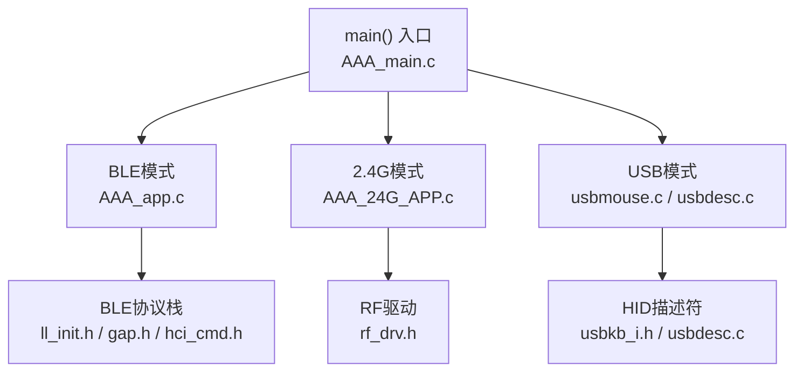
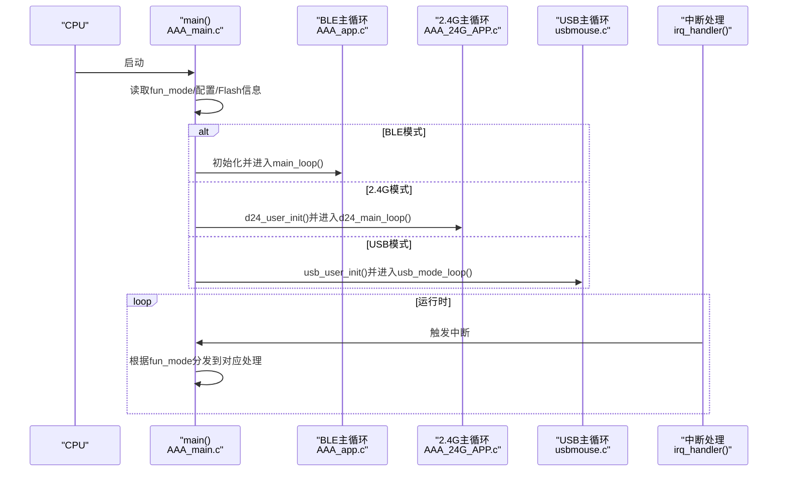
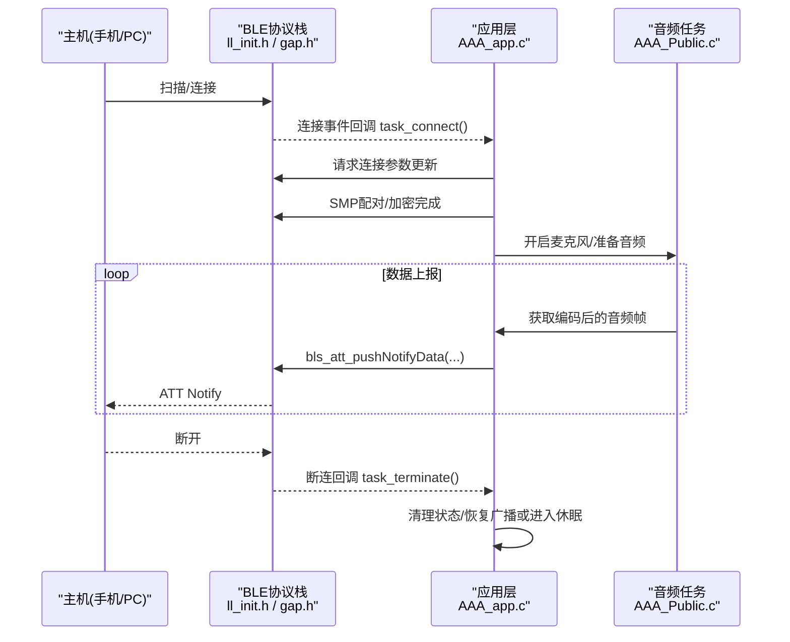
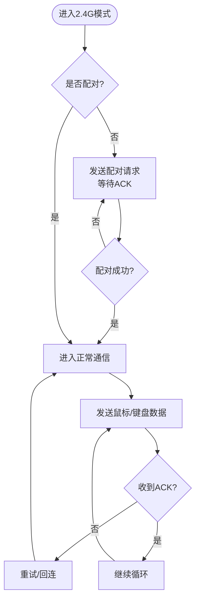
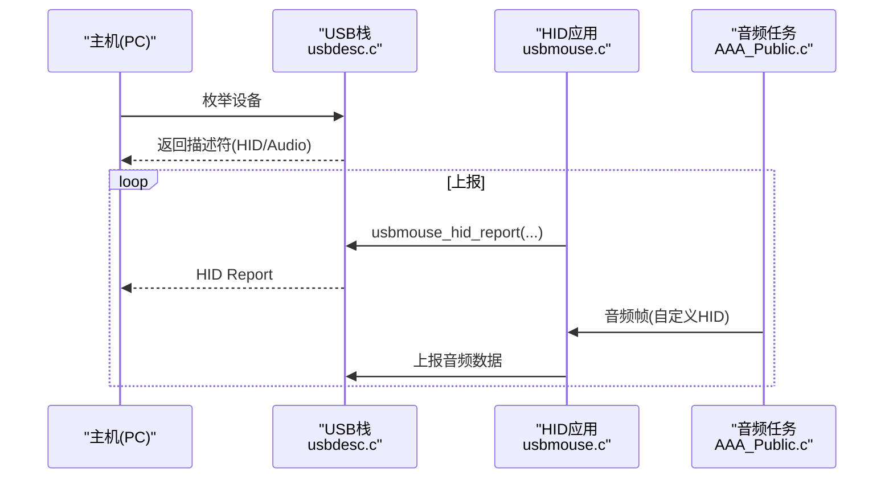
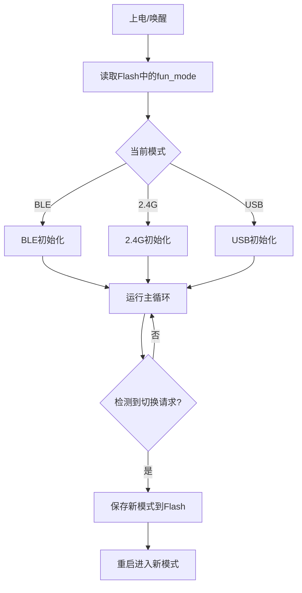
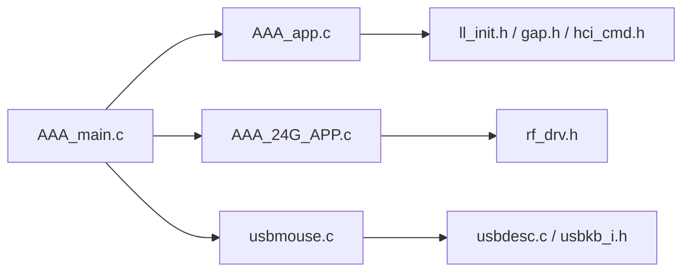

# 三模连接管理

<cite>
**本文引用的文件**
- [AAA_main.c](file://c_ble_single_sdk/vendor/827x_three_mode_mouse/AAA_main.c)
- [AAA_app.c](file://c_ble_single_sdk/vendor/827x_three_mode_mouse/AAA_app.c)
- [AAA_Public.c](file://c_ble_single_sdk/vendor/827x_three_mode_mouse/AAA_Public.c)
- [AAA_24G_APP.c](file://c_ble_single_sdk/vendor/827x_three_mode_mouse/AAA_24G_APP.c)
- [usbmouse.c](file://c_ble_single_sdk/application/app/usbmouse.c)
- [usbdesc.c](file://c_ble_single_sdk/application/usbstd/usbdesc.c)
- [usbkb_i.h](file://c_ble_single_sdk/application/app/usbkb_i.h)
- [ll_init.h](file://c_ble_single_sdk/stack/ble/controller/ll/ll_init.h)
- [gap.h](file://c_ble_single_sdk/stack/ble/host/gap/gap.h)
- [hci_cmd.h](file://c_ble_single_sdk/stack/ble/hci/hci_cmd.h)
- [rf_drv.h](file://c_ble_single_sdk/drivers/TC321X/lib/include/rf_drv.h)
- [README.md](file://README.md)
- [telink_b85m_triple_mode_audio_mouse_sdk_Release_Note .md](file://telink_b85m_triple_mode_audio_mouse_sdk_Release_Note .md)
</cite>

## 目录
1. [简介](#简介)
2. [项目结构](#项目结构)
3. [核心组件](#核心组件)
4. [架构总览](#架构总览)
5. [详细组件分析](#详细组件分析)
6. [依赖关系分析](#依赖关系分析)
7. [性能考量](#性能考量)
8. [故障排查指南](#故障排查指南)
9. [结论](#结论)
10. [附录：API与配置参考](#附录api与配置参考)

## 简介
本技术文档围绕“三模连接管理系统”展开，系统支持BLE蓝牙、2.4G无线和USB有线三种连接模式，并实现模式的自动检测与无缝切换。重点覆盖：
- 各模式初始化流程、连接建立过程、数据传输机制与断开处理逻辑
- 模式自动检测与切换机制
- 多设备管理与冲突解决策略
- 性能优化建议与常见问题解决方案
- 关键API调用路径与配置参数说明

该SDK基于Telink B85/B87系列芯片，提供鼠标+音频（麦克风）能力，并在不同模式下复用传感器、按键、音频采集与上报链路。

## 项目结构
- 应用层位于 vendor/827x_three_mode_mouse 下，包含主循环、BLE应用、2.4G应用与公共模块
- USB HID类实现位于 application/app 与 application/usbstd
- BLE协议栈位于 stack/ble（LL/GAP/HCI等）
- RF驱动位于 drivers/.../lib/include/rf_drv.h

图表来源
- [AAA_main.c:335-559](file://c_ble_single_sdk/vendor/827x_three_mode_mouse/AAA_main.c#L335-L559)
- [AAA_app.c:24-800](file://c_ble_single_sdk/vendor/827x_three_mode_mouse/AAA_app.c#L24-L800)
- [AAA_24G_APP.c:34-800](file://c_ble_single_sdk/vendor/827x_three_mode_mouse/AAA_24G_APP.c#L34-L800)
- [usbmouse.c:44-151](file://c_ble_single_sdk/application/app/usbmouse.c#L44-L151)
- [usbdesc.c:268-316](file://c_ble_single_sdk/application/usbstd/usbdesc.c#L268-L316)
- [usbkb_i.h:35-131](file://c_ble_single_sdk/application/app/usbkb_i.h#L35-L131)
- [ll_init.h:29-82](file://c_ble_single_sdk/stack/ble/controller/ll/ll_init.h#L29-L82)
- [gap.h:77-114](file://c_ble_single_sdk/stack/ble/host/gap/gap.h#L77-L114)
- [hci_cmd.h:471-498](file://c_ble_single_sdk/stack/ble/hci/hci_cmd.h#L471-L498)
- [rf_drv.h:265-290](file://c_ble_single_sdk/drivers/TC321X/lib/include/rf_drv.h#L265-L290)

章节来源
- [AAA_main.c:335-559](file://c_ble_single_sdk/vendor/827x_three_mode_mouse/AAA_main.c#L335-L559)
- [README.md:56-231](file://README.md#L56-L231)

## 核心组件
- 主控制与模式调度：根据保存的模式标志 fun_mode 选择进入BLE/2.4G/USB的主循环，并在中断中按当前模式分发IRQ处理
- BLE子系统：负责广播、配对、连接、MTU协商、数据通知（含音频）、断连与重连
- 2.4G子系统：负责配对、正常通信、ACK机制、OTA流程与应用命令通道
- USB子系统：枚举为HID（鼠标/键盘/自定义HID），支持音频HID报告传输
- 公共模块：按键扫描、音频采集与编码、FIFO缓冲、Flash持久化、电源与唤醒管理

章节来源
- [AAA_main.c:59-75](file://c_ble_single_sdk/vendor/827x_three_mode_mouse/AAA_main.c#L59-L75)
- [AAA_app.c:24-800](file://c_ble_single_sdk/vendor/827x_three_mode_mouse/AAA_app.c#L24-L800)
- [AAA_24G_APP.c:34-800](file://c_ble_single_sdk/vendor/827x_three_mode_mouse/AAA_24G_APP.c#L34-L800)
- [usbmouse.c:44-151](file://c_ble_single_sdk/application/app/usbmouse.c#L44-L151)
- [AAA_Public.c:234-535](file://c_ble_single_sdk/vendor/827x_three_mode_mouse/AAA_Public.c#L234-L535)

## 架构总览
三模系统的运行由 main() 统一调度，依据 fun_mode 决定进入对应子系统的初始化与主循环；中断服务程序根据当前模式路由到相应处理函数。

图表来源
- [AAA_main.c:59-75](file://c_ble_single_sdk/vendor/827x_three_mode_mouse/AAA_main.c#L59-L75)
- [AAA_main.c:482-551](file://c_ble_single_sdk/vendor/827x_three_mode_mouse/AAA_main.c#L482-L551)

章节来源
- [AAA_main.c:59-75](file://c_ble_single_sdk/vendor/827x_three_mode_mouse/AAA_main.c#L59-L75)
- [AAA_main.c:482-551](file://c_ble_single_sdk/vendor/827x_three_mode_mouse/AAA_main.c#L482-L551)

## 详细组件分析

### BLE模式（蓝牙）
- 初始化与广播
  - 设置广播数据与名称，配置不可发现/可连接参数
  - 使用GAP外设初始化与LL发起器模块
- 连接建立
  - 接收连接请求后更新连接参数（间隔、延迟、超时）
  - SMP配对成功后保存绑定信息，支持快速重连
- 数据传输
  - 使用ATT Notify发送鼠标与音频数据（自定义特征值）
  - MTU交换用于提升音频包大小
- 断开处理
  - 根据断连原因进入休眠或重启，支持模式切换与多设备管理

图表来源
- [ll_init.h:29-82](file://c_ble_single_sdk/stack/ble/controller/ll/ll_init.h#L29-L82)
- [gap.h:77-114](file://c_ble_single_sdk/stack/ble/host/gap/gap.h#L77-L114)
- [AAA_app.c:214-439](file://c_ble_single_sdk/vendor/827x_three_mode_mouse/AAA_app.c#L214-L439)
- [AAA_app.c:622-698](file://c_ble_single_sdk/vendor/827x_three_mode_mouse/AAA_app.c#L622-L698)
- [AAA_Public.c:473-535](file://c_ble_single_sdk/vendor/827x_three_mode_mouse/AAA_Public.c#L473-L535)

章节来源
- [AAA_app.c:214-439](file://c_ble_single_sdk/vendor/827x_three_mode_mouse/AAA_app.c#L214-L439)
- [AAA_app.c:622-698](file://c_ble_single_sdk/vendor/827x_three_mode_mouse/AAA_app.c#L622-L698)
- [AAA_Public.c:473-535](file://c_ble_single_sdk/vendor/827x_three_mode_mouse/AAA_Public.c#L473-L535)

### 2.4G模式（无线）
- 初始化与配对
  - 设置设备ID、配对命令与密钥（可选AES）
  - 进入配对状态，等待Dongle响应，成功后保存dongle_id与密钥
- 正常通信
  - 周期性发送鼠标/键盘数据包，接收ACK
  - 支持应用命令通道（如语音开关）
- OTA升级
  - 通过2.4G通道进行固件写入与校验，完成后重启
- 断开与回连
  - 无ACK或超时进入回连流程，保持低功耗

图表来源
- [AAA_24G_APP.c:695-800](file://c_ble_single_sdk/vendor/827x_three_mode_mouse/AAA_24G_APP.c#L695-L800)
- [AAA_24G_APP.c:408-624](file://c_ble_single_sdk/vendor/827x_three_mode_mouse/AAA_24G_APP.c#L408-L624)

章节来源
- [AAA_24G_APP.c:695-800](file://c_ble_single_sdk/vendor/827x_three_mode_mouse/AAA_24G_APP.c#L695-L800)
- [AAA_24G_APP.c:408-624](file://c_ble_single_sdk/vendor/827x_three_mode_mouse/AAA_24G_APP.c#L408-L624)

### USB模式（有线）
- 枚举与描述符
  - 配置HID接口与报告描述符（鼠标、键盘、自定义HID）
  - 支持音频HID报告（用于麦克风数据）
- 数据传输
  - 将鼠标移动/按键数据打包为HID Report并通过端点发送
  - 音频数据通过自定义HID报告上报
- 断开与释放
  - 检查未释放按键，超时强制释放

图表来源
- [usbdesc.c:268-316](file://c_ble_single_sdk/application/usbstd/usbdesc.c#L268-L316)
- [usbkb_i.h:35-131](file://c_ble_single_sdk/application/app/usbkb_i.h#L35-L131)
- [usbmouse.c:44-151](file://c_ble_single_sdk/application/app/usbmouse.c#L44-L151)
- [AAA_Public.c:408-465](file://c_ble_single_sdk/vendor/827x_three_mode_mouse/AAA_Public.c#L408-L465)

章节来源
- [usbdesc.c:268-316](file://c_ble_single_sdk/application/usbstd/usbdesc.c#L268-L316)
- [usbkb_i.h:35-131](file://c_ble_single_sdk/application/app/usbkb_i.h#L35-L131)
- [usbmouse.c:44-151](file://c_ble_single_sdk/application/app/usbmouse.c#L44-L151)
- [AAA_Public.c:408-465](file://c_ble_single_sdk/vendor/827x_three_mode_mouse/AAA_Public.c#L408-L465)

### 模式自动检测与无缝切换
- 模式存储与加载
  - Flash中保存当前模式标志 fun_mode，上电时加载
  - 支持从BLE/2.4G切换到USB，或反向切换
- 切换触发
  - 通过GPIO组合键或软件指令触发模式切换
  - 切换时保存配置并重启，确保新模式正确初始化
- 无缝性保障
  - 切换前清理连接状态与定时器
  - 切换后重新初始化对应子系统，避免资源竞争

图表来源
- [AAA_main.c:417-501](file://c_ble_single_sdk/vendor/827x_three_mode_mouse/AAA_main.c#L417-L501)
- [AAA_app.c:445-525](file://c_ble_single_sdk/vendor/827x_three_mode_mouse/AAA_app.c#L445-L525)
- [AAA_Public.c:543-546](file://c_ble_single_sdk/vendor/827x_three_mode_mouse/AAA_Public.c#L543-L546)

章节来源
- [AAA_main.c:417-501](file://c_ble_single_sdk/vendor/827x_three_mode_mouse/AAA_main.c#L417-L501)
- [AAA_app.c:445-525](file://c_ble_single_sdk/vendor/827x_three_mode_mouse/AAA_app.c#L445-L525)
- [AAA_Public.c:543-546](file://c_ble_single_sdk/vendor/827x_three_mode_mouse/AAA_Public.c#L543-L546)

### 多设备管理与冲突解决
- 多设备绑定
  - BLE侧维护多个绑定信息（SMP参数），支持快速重连
  - 2.4G侧记录dongle_id，支持多Dongle场景下的识别
- 冲突处理
  - 当新设备连接导致旧连接被挤掉时，进入回连状态
  - 通过主动断连与重启恢复，避免状态不一致

章节来源
- [AAA_app.c:578-610](file://c_ble_single_sdk/vendor/827x_three_mode_mouse/AAA_app.c#L578-L610)
- [AAA_24G_APP.c:719-756](file://c_ble_single_sdk/vendor/827x_three_mode_mouse/AAA_24G_APP.c#L719-L756)

### 音频传输机制
- 采集与编码
  - 麦克风数据经ADC与编解码器处理，生成固定长度音频帧
- 传输路径
  - BLE：通过ATT Notify发送音频帧
  - 2.4G：通过专用命令通道上报
  - USB：通过自定义HID报告上报
- 时长限制与自适应
  - 根据电量动态调整单次语音时长
  - 连接断开或超时自动关闭麦克风

章节来源
- [AAA_Public.c:234-368](file://c_ble_single_sdk/vendor/827x_three_mode_mouse/AAA_Public.c#L234-L368)
- [AAA_Public.c:408-535](file://c_ble_single_sdk/vendor/827x_three_mode_mouse/AAA_Public.c#L408-L535)
- [README.md:56-231](file://README.md#L56-L231)

## 依赖关系分析
- 主循环依赖模式标志 fun_mode，决定进入哪个子系统
- BLE子系统依赖协议栈（LL/GAP/HCI）与RF驱动
- 2.4G子系统依赖私有RF驱动与内部FIFO
- USB子系统依赖HID描述符与端点管理

图表来源
- [AAA_main.c:482-551](file://c_ble_single_sdk/vendor/827x_three_mode_mouse/AAA_main.c#L482-L551)
- [ll_init.h:29-82](file://c_ble_single_sdk/stack/ble/controller/ll/ll_init.h#L29-L82)
- [gap.h:77-114](file://c_ble_single_sdk/stack/ble/host/gap/gap.h#L77-L114)
- [hci_cmd.h:471-498](file://c_ble_single_sdk/stack/ble/hci/hci_cmd.h#L471-L498)
- [rf_drv.h:265-290](file://c_ble_single_sdk/drivers/TC321X/lib/include/rf_drv.h#L265-L290)
- [usbdesc.c:268-316](file://c_ble_single_sdk/application/usbstd/usbdesc.c#L268-L316)
- [usbkb_i.h:35-131](file://c_ble_single_sdk/application/app/usbkb_i.h#L35-L131)

章节来源
- [AAA_main.c:482-551](file://c_ble_single_sdk/vendor/827x_three_mode_mouse/AAA_main.c#L482-L551)
- [ll_init.h:29-82](file://c_ble_single_sdk/stack/ble/controller/ll/ll_init.h#L29-L82)
- [gap.h:77-114](file://c_ble_single_sdk/stack/ble/host/gap/gap.h#L77-L114)
- [hci_cmd.h:471-498](file://c_ble_single_sdk/stack/ble/hci/hci_cmd.h#L471-L498)
- [rf_drv.h:265-290](file://c_ble_single_sdk/drivers/TC321X/lib/include/rf_drv.h#L265-L290)
- [usbdesc.c:268-316](file://c_ble_single_sdk/application/usbstd/usbdesc.c#L268-L316)
- [usbkb_i.h:35-131](file://c_ble_single_sdk/application/app/usbkb_i.h#L35-L131)

## 性能考量
- 连接间隔优化
  - BLE连接间隔可调，低延迟提升鼠标响应速度
  - 参考HCI连接间隔定义进行合理配置
- 射频功率
  - 根据环境调整TX功率，平衡功耗与覆盖范围
- FIFO与缓冲区
  - 合理设置FIFO大小，避免音频或数据丢包
  - USB端点忙时采用队列缓冲，防止阻塞
- 音频自适应
  - 根据电量限制语音时长，降低功耗
  - 动态调整UI刷新间隔以匹配连接周期

章节来源
- [hci_cmd.h:471-498](file://c_ble_single_sdk/stack/ble/hci/hci_cmd.h#L471-L498)
- [rf_drv.h:265-290](file://c_ble_single_sdk/drivers/TC321X/lib/include/rf_drv.h#L265-L290)
- [AAA_Public.c:234-368](file://c_ble_single_sdk/vendor/827x_three_mode_mouse/AAA_Public.c#L234-L368)
- [usbmouse.c:44-151](file://c_ble_single_sdk/application/app/usbmouse.c#L44-L151)

## 故障排查指南
- 无法进入配对
  - 检查Flash中dongle_id是否有效，必要时清除并重新配对
  - 确认2.4G配对超时时间设置合理
- BLE连接不稳定
  - 调整连接间隔与超时参数
  - 检查MTU交换是否成功，确保音频数据不丢包
- USB无响应
  - 确认HID描述符是否正确，端点是否忙碌
  - 检查未释放按键导致的阻塞
- 音频异常
  - 检查麦克风偏置与PGA配置
  - 确认连接状态，断开时自动关闭麦克风

章节来源
- [AAA_24G_APP.c:719-756](file://c_ble_single_sdk/vendor/827x_three_mode_mouse/AAA_24G_APP.c#L719-L756)
- [AAA_app.c:622-698](file://c_ble_single_sdk/vendor/827x_three_mode_mouse/AAA_app.c#L622-L698)
- [usbmouse.c:59-98](file://c_ble_single_sdk/application/app/usbmouse.c#L59-L98)
- [AAA_Public.c:234-368](file://c_ble_single_sdk/vendor/827x_three_mode_mouse/AAA_Public.c#L234-L368)

## 结论
本三模连接管理系统通过统一的入口与中断分发机制，实现了BLE、2.4G与USB三种模式的共存与切换。系统在初始化、连接、数据传输与断开处理方面具备完善的流程设计，并结合FIFO、MTU、连接间隔等优化手段保障性能。多设备管理与冲突解决策略提升了用户体验，音频自适应功能进一步增强了续航与稳定性。

## 附录：API与配置参考
- BLE初始化与连接
  - 发起连接：blc_ll_createConnection(...)
  - GAP初始化：blc_gap_peripheral_init()
  - 主机初始化检查：blc_host_checkHostInitialization()
- 连接参数
  - 连接间隔枚举：CONN_INTERVAL_*（见hci_cmd.h）
- 射频功率
  - TX功率级别：RF_POWER_*（见rf_drv.h）
- USB描述符
  - 配置描述符：configuration_desc（见usbdesc.c）
  - HID报告描述符：keyboard_report_desc / audio_hogp_report_desc（见usbkb_i.h）

章节来源
- [ll_init.h:29-82](file://c_ble_single_sdk/stack/ble/controller/ll/ll_init.h#L29-L82)
- [gap.h:77-114](file://c_ble_single_sdk/stack/ble/host/gap/gap.h#L77-L114)
- [hci_cmd.h:471-498](file://c_ble_single_sdk/stack/ble/hci/hci_cmd.h#L471-L498)
- [rf_drv.h:265-290](file://c_ble_single_sdk/drivers/TC321X/lib/include/rf_drv.h#L265-L290)
- [usbdesc.c:268-316](file://c_ble_single_sdk/application/usbstd/usbdesc.c#L268-L316)
- [usbkb_i.h:35-131](file://c_ble_single_sdk/application/app/usbkb_i.h#L35-L131)