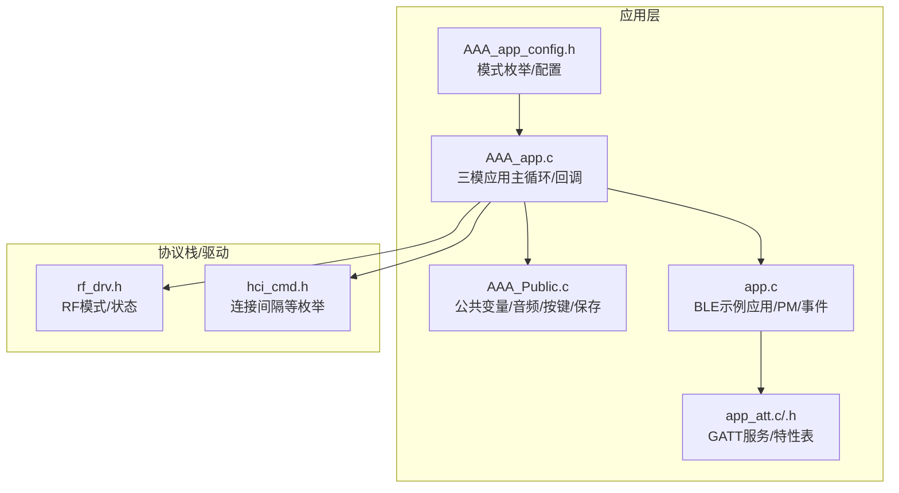
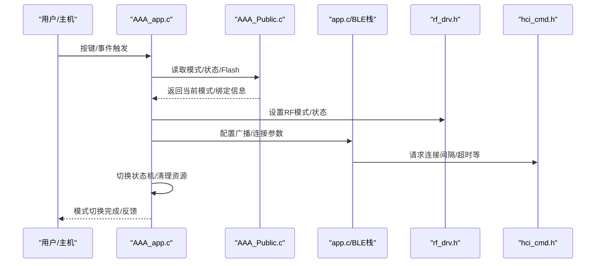
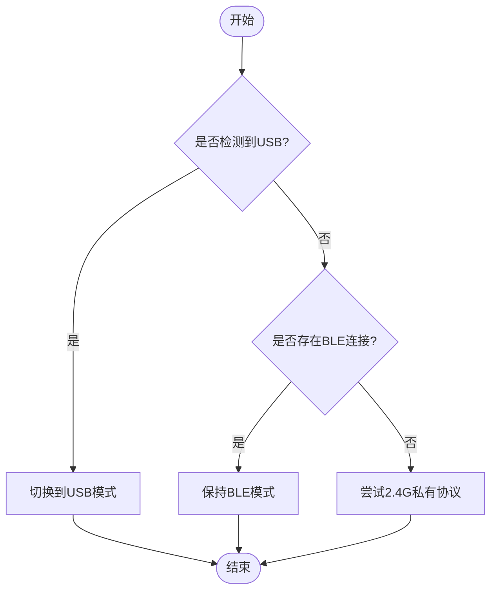
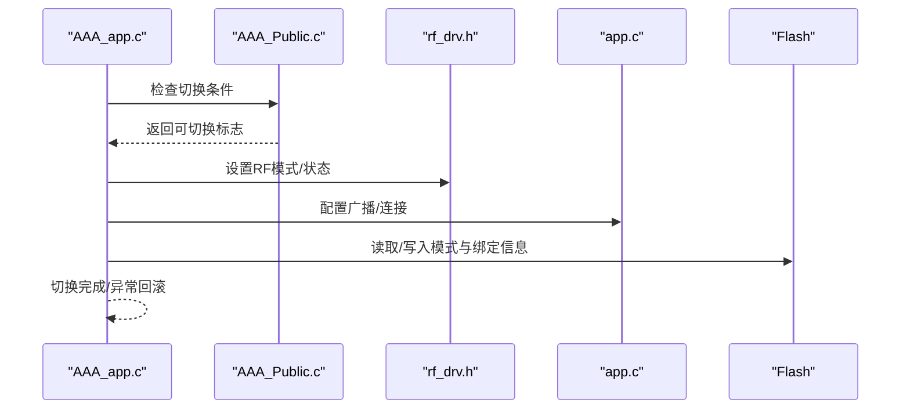
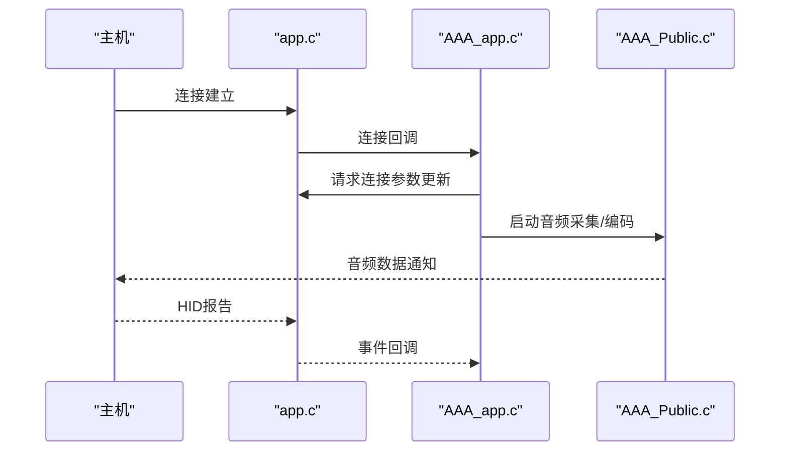
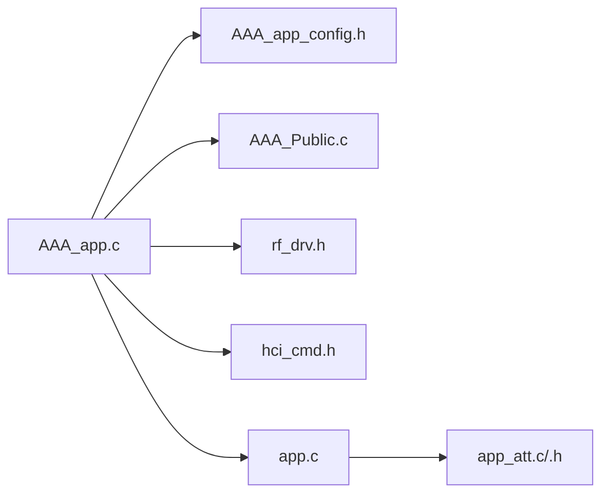

# 模式切换管理

<cite>
**本文引用的文件**
- [AAA_app_config.h](file://tc_ble_single_sdk/vendor/827x_three_mode_mouse/AAA_app_config.h)
- [AAA_app.c](file://tc_ble_single_sdk/vendor/827x_three_mode_mouse/AAA_app.c)
- [AAA_Public.c](file://tc_ble_single_sdk/vendor/827x_three_mode_mouse/AAA_Public.c)
- [app.h](file://tc_ble_single_sdk/vendor/ble_slave_2_4g_switch/app.h)
- [app.c](file://tc_ble_single_sdk/vendor/ble_slave_2_4g_switch/app.c)
- [app_att.h](file://tc_ble_single_sdk/vendor/ble_slave_2_4g_switch/app_att.h)
- [app_att.c](file://tc_ble_single_sdk/vendor/ble_slave_2_4g_switch/app_att.c)
- [rf_drv.h (TC321X)](file://tc_ble_single_sdk/drivers/TC321X/lib/include/rf_drv.h)
- [hci_cmd.h](file://tc_ble_single_sdk/stack/ble/hci/hci_cmd.h)
</cite>

## 目录
1. [简介](#简介)
2. [项目结构](#项目结构)
3. [核心组件](#核心组件)
4. [架构总览](#架构总览)
5. [详细组件分析](#详细组件分析)
6. [依赖关系分析](#依赖关系分析)
7. [性能考量](#性能考量)
8. [故障排查指南](#故障排查指南)
9. [结论](#结论)
10. [附录](#附录)

## 简介
本技术文档围绕三模连接（BLE、2.4G私有协议、USB）的模式切换管理系统，系统阐述自动模式检测算法、无缝切换机制与状态恢复策略。重点说明各连接模式的优先级管理、资源分配与冲突解决逻辑；给出模式切换的触发条件、切换流程与异常处理机制；提供配置参数说明与API调用示例；解释切换过程中的数据同步、连接状态保持与用户体验优化；并包含切换性能监控、日志记录与故障恢复策略，以及不同使用场景下的最佳实践与配置建议。

## 项目结构
该SDK将三模能力分布在应用层与驱动/协议栈层：
- 三模应用入口与状态机：位于“827x_three_mode_mouse”工程，负责模式枚举、按键/事件处理、连接生命周期管理与Flash持久化。
- BLE主机/从机通用实现：位于“ble_slave_2_4g_switch”，提供BLE初始化、广播/连接回调、低功耗管理、ATT/GATT服务定义等。
- RF与协议栈：通过驱动层RF接口与HCI枚举支持BLE与私有2.4G模式切换；连接间隔等参数由HCI层枚举定义。

**图示来源**
- [AAA_app_config.h:79-84](file://tc_ble_single_sdk/vendor/827x_three_mode_mouse/AAA_app_config.h#L79-L84)
- [AAA_app.c:365-525](file://tc_ble_single_sdk/vendor/827x_three_mode_mouse/AAA_app.c#L365-L525)
- [AAA_Public.c:543-583](file://tc_ble_single_sdk/vendor/827x_three_mode_mouse/AAA_Public.c#L543-L583)
- [app.c:452-702](file://tc_ble_single_sdk/vendor/ble_slave_2_4g_switch/app.c#L452-L702)
- [app_att.h:31-133](file://tc_ble_single_sdk/vendor/ble_slave_2_4g_switch/app_att.h#L31-L133)
- [rf_drv.h:60-84](file://tc_ble_single_sdk/drivers/TC321X/lib/include/rf_drv.h#L60-L84)
- [hci_cmd.h:471-524](file://tc_ble_single_sdk/stack/ble/hci/hci_cmd.h#L471-L524)

**章节来源**
- [AAA_app_config.h:79-84](file://tc_ble_single_sdk/vendor/827x_three_mode_mouse/AAA_app_config.h#L79-L84)
- [AAA_app.c:365-525](file://tc_ble_single_sdk/vendor/827x_three_mode_mouse/AAA_app.c#L365-L525)
- [AAA_Public.c:543-583](file://tc_ble_single_sdk/vendor/827x_three_mode_mouse/AAA_Public.c#L543-L583)
- [app.c:452-702](file://tc_ble_single_sdk/vendor/ble_slave_2_4g_switch/app.c#L452-L702)
- [app_att.h:31-133](file://tc_ble_single_sdk/vendor/ble_slave_2_4g_switch/app_att.h#L31-L133)
- [rf_drv.h:60-84](file://tc_ble_single_sdk/drivers/TC321X/lib/include/rf_drv.h#L60-L84)
- [hci_cmd.h:471-524](file://tc_ble_single_sdk/stack/ble/hci/hci_cmd.h#L471-L524)

## 核心组件
- 模式枚举与配置
  - 三模模式枚举：BLE 1M、2.4G私有2M、USB。用于全局模式选择与持久化存储。
- 连接生命周期与事件回调
  - 连接建立、断开、加密完成、MTU交换等事件处理，驱动模式切换与资源清理。
- RF模式与状态
  - 定义RF工作模式（BLE/私有2.4G）与收发状态（TX/RX/AUTO），支撑底层切换。
- GATT服务与特性
  - 暴露HID协议模式、控制点等特性，供主机侧查询或下发指令。
- 低功耗与电源管理
  - 广播/连接空闲进入休眠、唤醒源配置、深度睡眠保留恢复。

**章节来源**
- [AAA_app_config.h:79-84](file://tc_ble_single_sdk/vendor/827x_three_mode_mouse/AAA_app_config.h#L79-L84)
- [AAA_app.c:365-525](file://tc_ble_single_sdk/vendor/827x_three_mode_mouse/AAA_app.c#L365-L525)
- [rf_drv.h:60-84](file://tc_ble_single_sdk/drivers/TC321X/lib/include/rf_drv.h#L60-L84)
- [app_att.h:31-133](file://tc_ble_single_sdk/vendor/ble_slave_2_4g_switch/app_att.h#L31-L133)
- [app.c:388-444](file://tc_ble_single_sdk/vendor/ble_slave_2_4g_switch/app.c#L388-L444)

## 架构总览
三模切换的总体流程如下：
- 自动模式检测：基于按键组合、USB VBUS状态、当前连接状态与历史绑定信息，判定目标模式。
- 资源准备：根据目标模式配置RF模式、广播/连接参数、音频路径与FIFO。
- 切换执行：在安全边界（无待发送数据、连接空闲或主动断开）下切换，必要时重启以固化模式。
- 状态恢复：从Flash读取设备模式、绑定信息等，恢复连接与外设状态。
- 体验优化：优先保证低时延与稳定性，避免频繁切换；对音频流进行缓冲与丢包保护。

**图示来源**
- [AAA_app.c:365-525](file://tc_ble_single_sdk/vendor/827x_three_mode_mouse/AAA_app.c#L365-L525)
- [AAA_Public.c:543-583](file://tc_ble_single_sdk/vendor/827x_three_mode_mouse/AAA_Public.c#L543-L583)
- [app.c:452-702](file://tc_ble_single_sdk/vendor/ble_slave_2_4g_switch/app.c#L452-L702)
- [rf_drv.h:60-84](file://tc_ble_single_sdk/drivers/TC321X/lib/include/rf_drv.h#L60-L84)
- [hci_cmd.h:471-524](file://tc_ble_single_sdk/stack/ble/hci/hci_cmd.h#L471-L524)

## 详细组件分析

### 三模模式枚举与优先级管理
- 模式枚举
  - 定义了BLE 1M、2.4G私有2M、USB三种模式，作为全局模式选择的依据。
- 优先级策略
  - 默认优先BLE连接（稳定、可配对），当检测到USB插入或用户强制切换时，切换到USB；否则回退到2.4G私有协议以获得更低时延。
- 冲突解决
  - 若同时存在BLE连接与USB插入，按策略决定抢占或共存（例如音频走BLE，键鼠走USB）。
  - 切换过程中确保无待发数据、关闭不必要的音频/扫描，避免资源竞争。

**章节来源**
- [AAA_app_config.h:79-84](file://tc_ble_single_sdk/vendor/827x_three_mode_mouse/AAA_app_config.h#L79-L84)
- [AAA_Public.c:579-583](file://tc_ble_single_sdk/vendor/827x_three_mode_mouse/AAA_Public.c#L579-L583)

### 自动模式检测算法
- 输入信号
  - 按键组合（如长按/双击）、USB VBUS状态、当前BLE连接状态、历史绑定设备地址。
- 决策逻辑
  - 若检测到USB插入且未处于关键操作（如OTA），则切换到USB模式。
  - 若无USB且存在有效BLE连接，则保持BLE；否则尝试2.4G私有协议。
  - 结合OS类型与连接参数，动态调整广播/连接策略以提升兼容性。
- 输出
  - 更新全局模式标志，触发后续资源切换流程。

**图示来源**
- [AAA_app.c:365-525](file://tc_ble_single_sdk/vendor/827x_three_mode_mouse/AAA_app.c#L365-L525)
- [AAA_Public.c:579-583](file://tc_ble_single_sdk/vendor/827x_three_mode_mouse/AAA_Public.c#L579-L583)

**章节来源**
- [AAA_app.c:365-525](file://tc_ble_single_sdk/vendor/827x_three_mode_mouse/AAA_app.c#L365-L525)
- [AAA_Public.c:579-583](file://tc_ble_single_sdk/vendor/827x_three_mode_mouse/AAA_Public.c#L579-L583)

### 无缝切换机制与状态恢复
- 切换时机
  - 在无待发送数据、连接空闲或主动断开后执行切换，避免中断正在进行的传输。
- 资源切换
  - 配置RF模式为BLE或私有2.4G；设置广播参数或发起连接；重置FIFO与音频路径。
- 状态恢复
  - 从Flash读取设备模式、绑定信息；恢复SMP参数、MAC地址、DPI等配置。
- 异常处理
  - 切换失败时回滚到上一模式；记录错误原因；必要时触发重启以恢复一致性。

**图示来源**
- [AAA_app.c:365-525](file://tc_ble_single_sdk/vendor/827x_three_mode_mouse/AAA_app.c#L365-L525)
- [AAA_Public.c:543-583](file://tc_ble_single_sdk/vendor/827x_three_mode_mouse/AAA_Public.c#L543-L583)
- [rf_drv.h:60-84](file://tc_ble_single_sdk/drivers/TC321X/lib/include/rf_drv.h#L60-L84)
- [app.c:452-702](file://tc_ble_single_sdk/vendor/ble_slave_2_4g_switch/app.c#L452-L702)

**章节来源**
- [AAA_app.c:365-525](file://tc_ble_single_sdk/vendor/827x_three_mode_mouse/AAA_app.c#L365-L525)
- [AAA_Public.c:543-583](file://tc_ble_single_sdk/vendor/827x_three_mode_mouse/AAA_Public.c#L543-L583)
- [rf_drv.h:60-84](file://tc_ble_single_sdk/drivers/TC321X/lib/include/rf_drv.h#L60-L84)
- [app.c:452-702](file://tc_ble_single_sdk/vendor/ble_slave_2_4g_switch/app.c#L452-L702)

### 连接状态保持与数据同步
- 连接参数协商
  - 连接建立后请求合适的连接间隔与超时，平衡时延与功耗。
- 数据同步
  - 音频数据通过通知特性上报；键鼠报告通过HID输入报告上报；切换前清空FIFO，避免重复或丢失。
- 状态保持
  - 在切换期间暂停音频采集/编码；恢复后重新开启并填充缓冲区；保持SMP绑定信息一致。

**图示来源**
- [app.c:184-204](file://tc_ble_single_sdk/vendor/ble_slave_2_4g_switch/app.c#L184-L204)
- [AAA_app.c:365-525](file://tc_ble_single_sdk/vendor/827x_three_mode_mouse/AAA_app.c#L365-L525)
- [AAA_Public.c:239-368](file://tc_ble_single_sdk/vendor/827x_three_mode_mouse/AAA_Public.c#L239-L368)

**章节来源**
- [app.c:184-204](file://tc_ble_single_sdk/vendor/ble_slave_2_4g_switch/app.c#L184-L204)
- [AAA_app.c:365-525](file://tc_ble_single_sdk/vendor/827x_three_mode_mouse/AAA_app.c#L365-L525)
- [AAA_Public.c:239-368](file://tc_ble_single_sdk/vendor/827x_three_mode_mouse/AAA_Public.c#L239-L368)

### 用户体验优化
- 低时延优先：在2.4G私有模式下降低时延，适合游戏鼠标；BLE模式下兼顾功耗与兼容性。
- 平滑切换：切换前等待空闲窗口，避免卡顿；切换后快速恢复音频与输入。
- 提示反馈：LED/日志指示模式切换状态，便于调试与用户感知。

[本节为概念性内容，不直接分析具体文件]

## 依赖关系分析
- 应用层依赖
  - AAA_app.c依赖AAA_app_config.h中的模式枚举与配置；依赖AAA_Public.c中的公共变量与函数。
  - app.c提供BLE通用能力，被三模应用复用。
- 协议栈/驱动依赖
  - rf_drv.h定义RF模式与状态，供应用层切换时使用。
  - hci_cmd.h提供连接间隔等枚举，用于参数协商。
- 服务与特性
  - app_att.h/.c定义GATT服务与特性，供主机查询与控制。

**图示来源**
- [AAA_app.c:365-525](file://tc_ble_single_sdk/vendor/827x_three_mode_mouse/AAA_app.c#L365-L525)
- [AAA_app_config.h:79-84](file://tc_ble_single_sdk/vendor/827x_three_mode_mouse/AAA_app_config.h#L79-L84)
- [AAA_Public.c:543-583](file://tc_ble_single_sdk/vendor/827x_three_mode_mouse/AAA_Public.c#L543-L583)
- [rf_drv.h:60-84](file://tc_ble_single_sdk/drivers/TC321X/lib/include/rf_drv.h#L60-L84)
- [hci_cmd.h:471-524](file://tc_ble_single_sdk/stack/ble/hci/hci_cmd.h#L471-L524)
- [app_att.h:31-133](file://tc_ble_single_sdk/vendor/ble_slave_2_4g_switch/app_att.h#L31-L133)

**章节来源**
- [AAA_app.c:365-525](file://tc_ble_single_sdk/vendor/827x_three_mode_mouse/AAA_app.c#L365-L525)
- [AAA_app_config.h:79-84](file://tc_ble_single_sdk/vendor/827x_three_mode_mouse/AAA_app_config.h#L79-L84)
- [AAA_Public.c:543-583](file://tc_ble_single_sdk/vendor/827x_three_mode_mouse/AAA_Public.c#L543-L583)
- [rf_drv.h:60-84](file://tc_ble_single_sdk/drivers/TC321X/lib/include/rf_drv.h#L60-L84)
- [hci_cmd.h:471-524](file://tc_ble_single_sdk/stack/ble/hci/hci_cmd.h#L471-L524)
- [app_att.h:31-133](file://tc_ble_single_sdk/vendor/ble_slave_2_4g_switch/app_att.h#L31-L133)

## 性能考量
- 连接间隔与延迟
  - 通过HCI枚举选择合适的连接间隔，平衡时延与功耗；在高刷新率场景使用更短间隔。
- RF功率与模式
  - 根据环境干扰与距离需求设置RF功率；私有2.4G模式通常具备更低时延。
- 音频缓冲与丢包
  - 合理设置麦克风缓冲区大小与编码周期，避免溢出与卡顿；在切换时暂停采集，恢复后重填。
- 低功耗
  - 空闲时进入休眠，唤醒源配置GPIO；深度睡眠保留SRAM以减少恢复时间。

[本节为通用性能讨论，不直接分析具体文件]

## 故障排查指南
- 常见问题
  - 切换失败：检查是否有待发数据或连接活跃；确认RF模式配置正确。
  - 音频卡顿：检查FIFO是否溢出；确认音频路径已正确初始化。
  - 无法连接：检查广播参数与连接间隔；确认SMP绑定信息有效。
- 日志与调试
  - 启用APP_LOG_EN、APP_CONTR_EVENT_LOG_EN等日志开关，观察连接与事件。
  - 使用GPIO调试引脚标记RF TX/RX/CRC等状态，辅助定位问题。
- 恢复策略
  - 切换失败时回滚到上一模式；必要时重启设备以恢复一致性。

**章节来源**
- [AAA_app.c:365-525](file://tc_ble_single_sdk/vendor/827x_three_mode_mouse/AAA_app.c#L365-L525)
- [AAA_app_config.h:98-124](file://tc_ble_single_sdk/vendor/827x_three_mode_mouse/AAA_app_config.h#L98-L124)
- [app.c:388-444](file://tc_ble_single_sdk/vendor/ble_slave_2_4g_switch/app.c#L388-L444)

## 结论
本三模模式切换管理系统通过清晰的模式枚举、自动检测算法、无缝切换机制与状态恢复策略，实现了BLE、2.4G私有协议与USB之间的灵活切换。系统在资源分配、冲突解决、用户体验优化方面提供了完善的支持，并通过日志与调试手段保障可维护性与可靠性。针对不同使用场景，建议合理配置连接参数、RF模式与音频缓冲，以实现最佳性能与功耗平衡。

[本节为总结性内容，不直接分析具体文件]

## 附录

### 配置参数说明
- 模式枚举
  - BLE 1M、2.4G私有2M、USB：用于全局模式选择与持久化。
- 连接参数
  - 连接间隔、延迟、超时：通过HCI枚举配置，影响时延与功耗。
- RF模式
  - BLE/私有2.4G模式与收发状态：用于底层切换。
- 日志开关
  - APP_LOG_EN、APP_CONTR_EVENT_LOG_EN等：用于调试与问题定位。

**章节来源**
- [AAA_app_config.h:79-84](file://tc_ble_single_sdk/vendor/827x_three_mode_mouse/AAA_app_config.h#L79-L84)
- [hci_cmd.h:471-524](file://tc_ble_single_sdk/stack/ble/hci/hci_cmd.h#L471-L524)
- [rf_drv.h:60-84](file://tc_ble_single_sdk/drivers/TC321X/lib/include/rf_drv.h#L60-L84)
- [AAA_app_config.h:98-124](file://tc_ble_single_sdk/vendor/827x_three_mode_mouse/AAA_app_config.h#L98-L124)

### API调用示例
- 连接参数更新
  - 在连接建立后请求合适的连接间隔与超时，提升稳定性与时延表现。
- RF模式设置
  - 根据目标模式设置RF模式与状态，确保底层资源就绪。
- GATT特性读写
  - 通过HID协议模式与控制点特性，实现主机侧控制与状态查询。

**章节来源**
- [AAA_app.c:365-525](file://tc_ble_single_sdk/vendor/827x_three_mode_mouse/AAA_app.c#L365-L525)
- [app.c:184-204](file://tc_ble_single_sdk/vendor/ble_slave_2_4g_switch/app.c#L184-L204)
- [app_att.h:31-133](file://tc_ble_single_sdk/vendor/ble_slave_2_4g_switch/app_att.h#L31-L133)

### 最佳实践与配置建议
- 高时延敏感场景（游戏鼠标）
  - 优先使用2.4G私有协议；缩短连接间隔；增大音频缓冲以避免卡顿。
- 低功耗场景
  - 使用BLE模式；适当增加连接间隔；启用深度睡眠与唤醒源。
- 多设备兼容
  - 根据OS类型与连接参数动态调整广播/连接策略；确保SMP绑定信息有效。

[本节为通用建议，不直接分析具体文件]