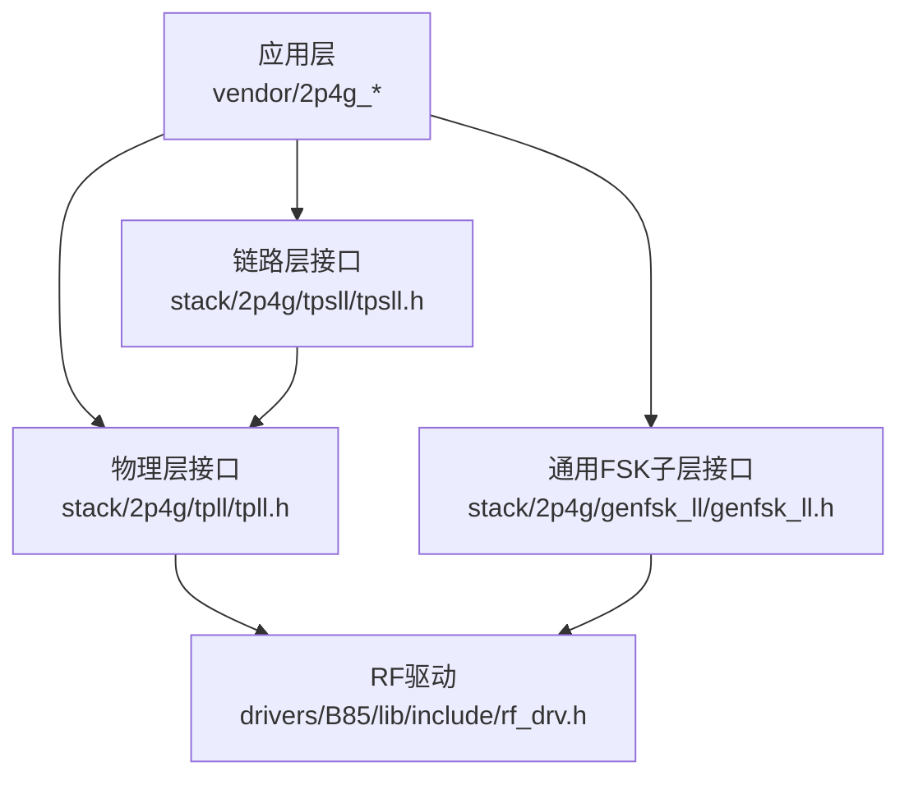
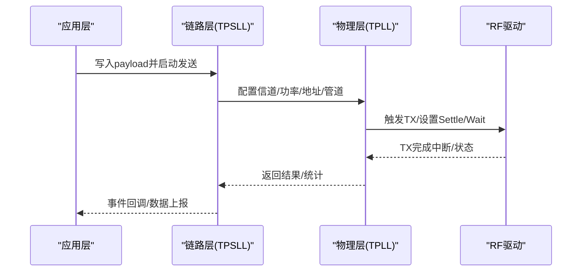
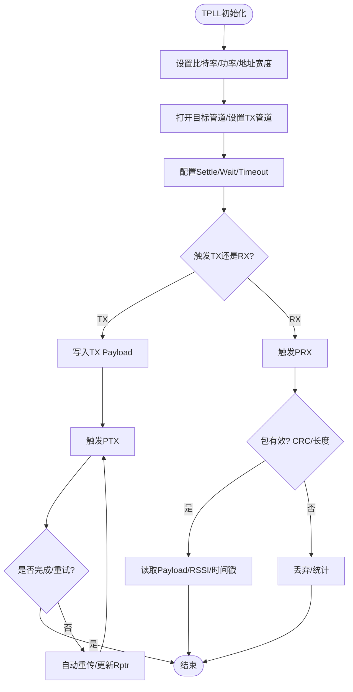
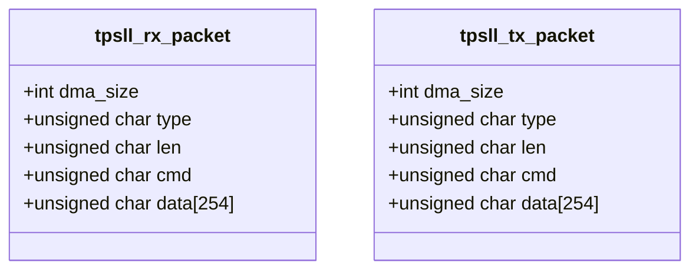
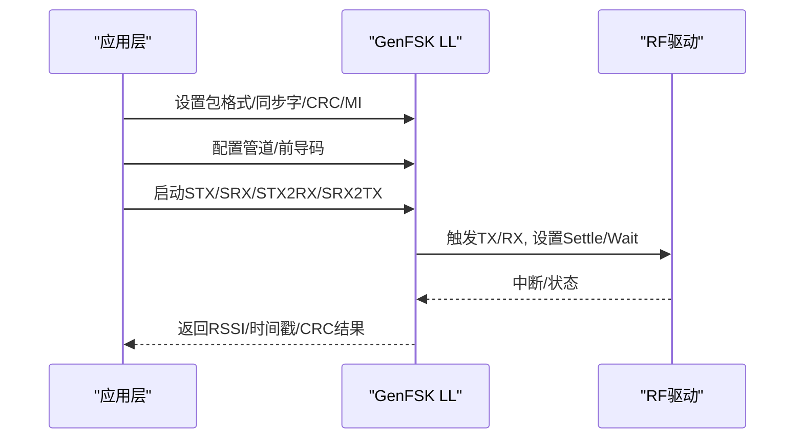
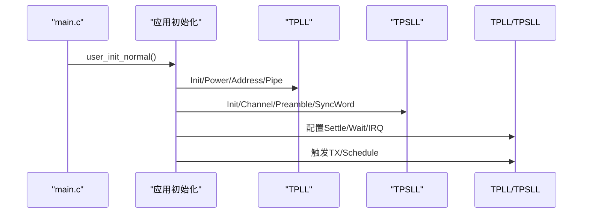
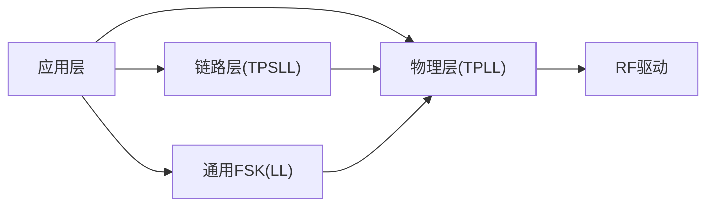
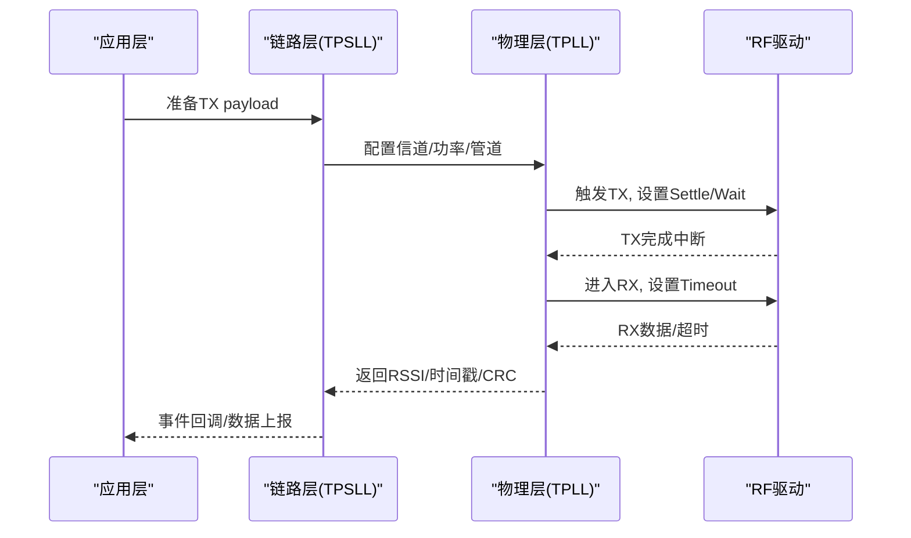
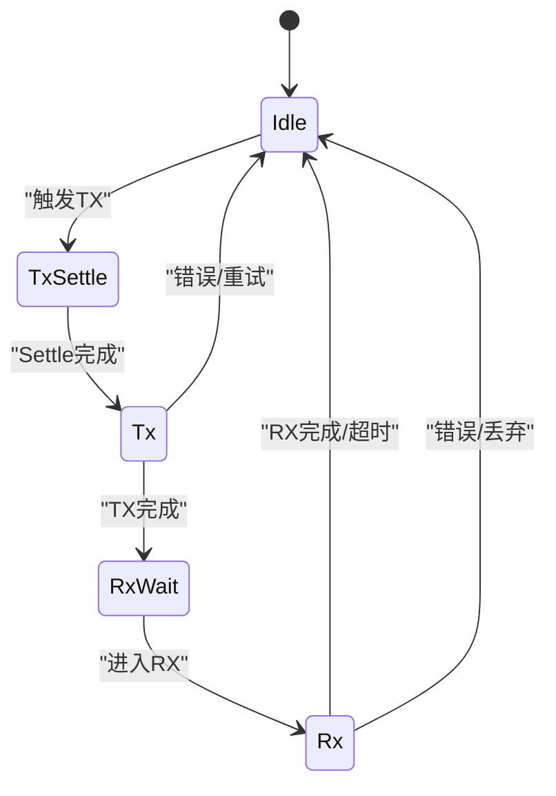

# 2.4G协议栈

<cite>
**本文引用的文件**
- [genfsk_ll.h](file://tc_ble_single_sdk/stack/2p4g/genfsk_ll/genfsk_ll.h)
- [tpll.h](file://tc_ble_single_sdk/stack/2p4g/tpll/tpll.h)
- [tpsll.h](file://tc_ble_single_sdk/stack/2p4g/tpsll/tpsll.h)
- [app_ptx.c](file://tc_ble_single_sdk/vendor/2p4g_tpll/app_ptx.c)
- [main.c (TPLL)](file://tc_ble_single_sdk/vendor/2p4g_tpll/main.c)
- [app_stx.c](file://tc_ble_single_sdk/vendor/2p4g_tpsll/app_stx.c)
- [main.c (TPSLL)](file://tc_ble_single_sdk/vendor/2p4g_tpsll/main.c)
- [rf_drv.h](file://tc_ble_single_sdk/drivers/B85/lib/include/rf_drv.h)
</cite>

## 目录
1. [简介](#简介)
2. [项目结构](#项目结构)
3. [核心组件](#核心组件)
4. [架构总览](#架构总览)
5. [详细组件分析](#详细组件分析)
6. [依赖关系分析](#依赖关系分析)
7. [性能与参数](#性能与参数)
8. [故障排查指南](#故障排查指南)
9. [结论](#结论)
10. [附录](#附录)

## 简介
本技术文档面向2.4G私有协议栈，覆盖物理层（TPLL）、链路层（TPSLL）以及通用FSK子层（GenFSK LL）的实现要点。重点说明：
- GenFSK调制解调、频率合成与数据包编解码
- 错误检测与纠正机制（CRC、自动重传、ACK载荷）
- 网络拓扑管理、信道选择与抗干扰策略
- 时序图、状态转换图与关键性能参数
- 调试工具与性能分析方法

## 项目结构
仓库中与2.4G协议栈相关的代码主要位于以下路径：
- stack/2p4g：协议栈接口与定义（TPLL、TPSLL、GenFSK LL）
- vendor/2p4g_tpll：基于TPLL的PTX/PRX应用示例与主循环
- vendor/2p4g_tpsll：基于TPSLL的STX/SRX等模式示例与主循环
- drivers/B85/lib/include：RF驱动与包处理辅助函数

图示来源
- [tpll.h:100-120](file://tc_ble_single_sdk/stack/2p4g/tpll/tpll.h#L100-L120)
- [tpsll.h:133-146](file://tc_ble_single_sdk/stack/2p4g/tpsll/tpsll.h#L133-L146)
- [genfsk_ll.h:116-133](file://tc_ble_single_sdk/stack/2p4g/genfsk_ll/genfsk_ll.h#L116-L133)
- [rf_drv.h:1106-1141](file://tc_ble_single_sdk/drivers/B85/lib/include/rf_drv.h#L1106-L1141)

章节来源
- [tpll.h:100-120](file://tc_ble_single_sdk/stack/2p4g/tpll/tpll.h#L100-L120)
- [tpsll.h:133-146](file://tc_ble_single_sdk/stack/2p4g/tpsll/tpsll.h#L133-L146)
- [genfsk_ll.h:116-133](file://tc_ble_single_sdk/stack/2p4g/genfsk_ll/genfsk_ll.h#L116-L133)
- [rf_drv.h:1106-1141](file://tc_ble_single_sdk/drivers/B85/lib/include/rf_drv.h#L1106-L1141)

## 核心组件
- 物理层（TPLL）
  - 提供射频初始化、信道设置、发射功率、地址宽度、管道配置、自动重传、等待/稳定时间、RSSI/时间戳读取、CRC校验、快速校准等能力。
- 链路层（TPSLL）
  - 提供固定/可变长度数据包格式、同步字、前导码、CRC长度、DMA RX缓冲、单发/单收/收发组合FSM、RSSI/时间戳获取、管道开关与TX管道选择等。
- 通用FSK子层（GenFSK LL）
  - 提供GenFSK调制指数、包格式（固定/可变负载）、CRC长度、同步字长度与内容、管道管理、自动FSM（STX/SRX/STX2RX/SRX2TX）、RSSI/时间戳、Tx/Rx settle/wait等。

章节来源
- [tpll.h:39-120](file://tc_ble_single_sdk/stack/2p4g/tpll/tpll.h#L39-L120)
- [tpsll.h:57-127](file://tc_ble_single_sdk/stack/2p4g/tpsll/tpsll.h#L57-L127)
- [genfsk_ll.h:29-104](file://tc_ble_single_sdk/stack/2p4g/genfsk_ll/genfsk_ll.h#L29-L104)

## 架构总览
2.4G协议栈采用分层设计：
- 应用层通过vendor示例调用链路层或物理层API
- 链路层（TPSLL）封装了更高层的数据包结构与流程控制
- 物理层（TPLL）负责射频参数、状态机、重传与底层FIFO
- 通用FSK子层（GenFSK LL）提供灵活的调制与包格式选项
- RF驱动完成实际的包处理（如加扰、CRC填充）与寄存器操作

图示来源
- [app_ptx.c:186-200](file://tc_ble_single_sdk/vendor/2p4g_tpll/app_ptx.c#L186-L200)
- [tpll.h:291-333](file://tc_ble_single_sdk/stack/2p4g/tpll/tpll.h#L291-L333)
- [rf_drv.h:1106-1141](file://tc_ble_single_sdk/drivers/B85/lib/include/rf_drv.h#L1106-L1141)

## 详细组件分析

### 物理层（TPLL）实现要点
- 初始化与配置
  - 初始化比特率、输出射频功率、地址宽度、关闭所有管道后按需打开
  - 支持设置当前信道与新信道，便于跳频
- 收发控制
  - PTX/PRX触发、自动重传次数与延迟、等待时间与稳定时间
  - 读取RSSI、时间戳、丢包计数、载波检测、管道状态
- 错误处理
  - CRC过滤开关、CRC有效性检查、包长度有效性检查、空包检测
- 快速校准
  - 快速TX/RX稳定序列，降低跳频开销；支持HPMC校准值读写

图示来源
- [tpll.h:100-120](file://tc_ble_single_sdk/stack/2p4g/tpll/tpll.h#L100-L120)
- [tpll.h:202-234](file://tc_ble_single_sdk/stack/2p4g/tpll/tpll.h#L202-L234)
- [tpll.h:291-333](file://tc_ble_single_sdk/stack/2p4g/tpll/tpll.h#L291-L333)
- [tpll.h:416-472](file://tc_ble_single_sdk/stack/2p4g/tpll/tpll.h#L416-L472)
- [tpll.h:481-516](file://tc_ble_single_sdk/stack/2p4g/tpll/tpll.h#L481-L516)
- [tpll.h:517-590](file://tc_ble_single_sdk/stack/2p4g/tpll/tpll.h#L517-L590)

章节来源
- [tpll.h:100-120](file://tc_ble_single_sdk/stack/2p4g/tpll/tpll.h#L100-L120)
- [tpll.h:202-234](file://tc_ble_single_sdk/stack/2p4g/tpll/tpll.h#L202-L234)
- [tpll.h:291-333](file://tc_ble_single_sdk/stack/2p4g/tpll/tpll.h#L291-L333)
- [tpll.h:416-472](file://tc_ble_single_sdk/stack/2p4g/tpll/tpll.h#L416-L472)
- [tpll.h:481-516](file://tc_ble_single_sdk/stack/2p4g/tpll/tpll.h#L481-L516)
- [tpll.h:517-590](file://tc_ble_single_sdk/stack/2p4g/tpll/tpll.h#L517-L590)

### 链路层（TPSLL）实现要点
- 数据包格式
  - 固定/可变负载，头字段包含类型与长度，负载为命令+数据
  - 支持3字节CRC、同步字长度3-5字节、前导码长度可配
- DMA与缓冲
  - RX缓冲需4字节对齐且长度为16字节整数倍，长度需大于整包+16
- FSM模式
  - 单发（STX）、单收（SRX）、收发组合（STX2RX、SRX2TX），支持超时与首次超时
- 管道与同步字
  - 多管道管理，按管道设置同步字，支持打开/关闭全部管道
- 指标与诊断
  - 获取接收RSSI、瞬时RSSI、时间戳、CRC校验结果

图示来源
- [tpsll.h:101-127](file://tc_ble_single_sdk/stack/2p4g/tpsll/tpsll.h#L101-L127)

章节来源
- [tpsll.h:57-127](file://tc_ble_single_sdk/stack/2p4g/tpsll/tpsll.h#L57-L127)
- [tpsll.h:133-224](file://tc_ble_single_sdk/stack/2p4g/tpsll/tpsll.h#L133-L224)
- [tpsll.h:227-359](file://tc_ble_single_sdk/stack/2p4g/tpsll/tpsll.h#L227-L359)
- [tpsll.h:361-395](file://tc_ble_single_sdk/stack/2p4g/tpsll/tpsll.h#L361-L395)

### 通用FSK子层（GenFSK LL）实现要点
- 调制与速率
  - 支持多种调制指数（MI），用于调节频偏与带宽
  - 数据速率可配置
- 包格式与CRC
  - 固定负载与可变负载两种格式
  - 可选1/2字节CRC
- 同步字与前导码
  - 同步字长度3-5字节，可按管道设置具体值
  - 前导码长度可配置
- 管道与状态机
  - 支持多管道，手动选择TX管道
  - 自动FSM：STX、SRX、STX2RX、SRX2TX，支持Settle/Wait/Timeout
- 指标与诊断
  - 获取RSSI、瞬时RSSI、时间戳、CRC校验结果

图示来源
- [genfsk_ll.h:29-104](file://tc_ble_single_sdk/stack/2p4g/genfsk_ll/genfsk_ll.h#L29-L104)
- [genfsk_ll.h:116-133](file://tc_ble_single_sdk/stack/2p4g/genfsk_ll/genfsk_ll.h#L116-L133)
- [genfsk_ll.h:143-189](file://tc_ble_single_sdk/stack/2p4g/genfsk_ll/genfsk_ll.h#L143-L189)
- [genfsk_ll.h:199-225](file://tc_ble_single_sdk/stack/2p4g/genfsk_ll/genfsk_ll.h#L199-L225)
- [genfsk_ll.h:227-354](file://tc_ble_single_sdk/stack/2p4g/genfsk_ll/genfsk_ll.h#L227-L354)
- [genfsk_ll.h:356-458](file://tc_ble_single_sdk/stack/2p4g/genfsk_ll/genfsk_ll.h#L356-L458)

章节来源
- [genfsk_ll.h:29-104](file://tc_ble_single_sdk/stack/2p4g/genfsk_ll/genfsk_ll.h#L29-L104)
- [genfsk_ll.h:116-133](file://tc_ble_single_sdk/stack/2p4g/genfsk_ll/genfsk_ll.h#L116-L133)
- [genfsk_ll.h:143-189](file://tc_ble_single_sdk/stack/2p4g/genfsk_ll/genfsk_ll.h#L143-L189)
- [genfsk_ll.h:199-225](file://tc_ble_single_sdk/stack/2p4g/genfsk_ll/genfsk_ll.h#L199-L225)
- [genfsk_ll.h:227-354](file://tc_ble_single_sdk/stack/2p4g/genfsk_ll/genfsk_ll.h#L227-L354)
- [genfsk_ll.h:356-458](file://tc_ble_single_sdk/stack/2p4g/genfsk_ll/genfsk_ll.h#L356-L458)

### 应用示例与主循环
- TPLL PTX示例
  - 初始化RF、设置功率、地址宽度、关闭/打开管道、配置定时器与中断、触发发送
- TPSLL STX示例
  - 初始化链路层、设置信道、前导码、同步字长度与内容、打开管道、设置功率与Settle、触发定时发送

图示来源
- [main.c (TPLL):48-103](file://tc_ble_single_sdk/vendor/2p4g_tpll/main.c#L48-L103)
- [app_ptx.c:186-200](file://tc_ble_single_sdk/vendor/2p4g_tpll/app_ptx.c#L186-L200)
- [main.c (TPSLL):48-103](file://tc_ble_single_sdk/vendor/2p4g_tpsll/main.c#L48-L103)
- [app_stx.c:114-161](file://tc_ble_single_sdk/vendor/2p4g_tpsll/app_stx.c#L114-L161)

章节来源
- [main.c (TPLL):48-103](file://tc_ble_single_sdk/vendor/2p4g_tpll/main.c#L48-L103)
- [app_ptx.c:186-200](file://tc_ble_single_sdk/vendor/2p4g_tpll/app_ptx.c#L186-L200)
- [main.c (TPSLL):48-103](file://tc_ble_single_sdk/vendor/2p4g_tpsll/main.c#L48-L103)
- [app_stx.c:114-161](file://tc_ble_single_sdk/vendor/2p4g_tpsll/app_stx.c#L114-L161)

## 依赖关系分析
- 应用层依赖链路层与物理层API
- 链路层依赖物理层进行射频控制与状态机
- 物理层依赖RF驱动进行包处理与寄存器操作
- 通用FSK子层作为灵活选项，可与物理层配合使用

图示来源
- [tpll.h:100-120](file://tc_ble_single_sdk/stack/2p4g/tpll/tpll.h#L100-L120)
- [tpsll.h:133-146](file://tc_ble_single_sdk/stack/2p4g/tpsll/tpsll.h#L133-L146)
- [genfsk_ll.h:116-133](file://tc_ble_single_sdk/stack/2p4g/genfsk_ll/genfsk_ll.h#L116-L133)
- [rf_drv.h:1106-1141](file://tc_ble_single_sdk/drivers/B85/lib/include/rf_drv.h#L1106-L1141)

章节来源
- [tpll.h:100-120](file://tc_ble_single_sdk/stack/2p4g/tpll/tpll.h#L100-L120)
- [tpsll.h:133-146](file://tc_ble_single_sdk/stack/2p4g/tpsll/tpsll.h#L133-L146)
- [genfsk_ll.h:116-133](file://tc_ble_single_sdk/stack/2p4g/genfsk_ll/genfsk_ll.h#L116-L133)
- [rf_drv.h:1106-1141](file://tc_ble_single_sdk/drivers/B85/lib/include/rf_drv.h#L1106-L1141)

## 性能与参数
- 调制与速率
  - 支持多种调制指数（MI），用于平衡带宽与灵敏度
  - 数据速率可配置（例如2Mbps）
- 稳定时间与等待时间
  - TX/RX settle与wait时间可配置，影响跳频与往返时延
- 错误检测与恢复
  - CRC校验（1/2/3字节），自动重传次数与延迟
  - ACK载荷功能，提升可靠性
- RSSI与时序
  - 支持冻结RSSI与瞬时RSSI，支持接收时间戳
- 快速校准
  - 快速TX/RX稳定序列，减少跳频开销

章节来源
- [tpll.h:26-36](file://tc_ble_single_sdk/stack/2p4g/tpll/tpll.h#L26-L36)
- [tpll.h:202-234](file://tc_ble_single_sdk/stack/2p4g/tpll/tpll.h#L202-L234)
- [tpll.h:291-333](file://tc_ble_single_sdk/stack/2p4g/tpll/tpll.h#L291-L333)
- [tpll.h:416-472](file://tc_ble_single_sdk/stack/2p4g/tpll/tpll.h#L416-L472)
- [tpll.h:481-516](file://tc_ble_single_sdk/stack/2p4g/tpll/tpll.h#L481-L516)
- [tpll.h:517-590](file://tc_ble_single_sdk/stack/2p4g/tpll/tpll.h#L517-L590)
- [genfsk_ll.h:60-73](file://tc_ble_single_sdk/stack/2p4g/genfsk_ll/genfsk_ll.h#L60-L73)
- [genfsk_ll.h:116-133](file://tc_ble_single_sdk/stack/2p4g/genfsk_ll/genfsk_ll.h#L116-L133)
- [genfsk_ll.h:199-225](file://tc_ble_single_sdk/stack/2p4g/genfsk_ll/genfsk_ll.h#L199-L225)
- [genfsk_ll.h:227-354](file://tc_ble_single_sdk/stack/2p4g/genfsk_ll/genfsk_ll.h#L227-L354)
- [tpsll.h:57-127](file://tc_ble_single_sdk/stack/2p4g/tpsll/tpsll.h#L57-L127)
- [tpsll.h:133-224](file://tc_ble_single_sdk/stack/2p4g/tpsll/tpsll.h#L133-L224)

## 故障排查指南
- 常见问题定位
  - 若TX未触发或无中断，检查RF IRQ使能与源清除
  - 若RX无数据或CRC失败，检查包格式、同步字、CRC长度与缓冲对齐
  - 若频繁重传，检查信道干扰、功率设置与自动重传配置
- 调试工具
  - 启用RF调试IO，观察TX EN/TX ON/RX EN/RX DATA/RX ACCESS DET等信号
  - 使用RSSI与时间戳评估链路质量与时序
- 步骤建议
  - 先验证基础收发（STX/SRX），再引入组合模式（STX2RX/SRX2TX）
  - 逐步调整Settle/Wait/Timeout，确保时序满足要求
  - 开启CRC过滤与自动重传，观察丢包与重传计数

章节来源
- [main.c (TPLL):147-180](file://tc_ble_single_sdk/vendor/2p4g_tpll/main.c#L147-L180)
- [main.c (TPSLL):146-180](file://tc_ble_single_sdk/vendor/2p4g_tpsll/main.c#L146-L180)
- [tpll.h:416-472](file://tc_ble_single_sdk/stack/2p4g/tpll/tpll.h#L416-L472)
- [genfsk_ll.h:227-354](file://tc_ble_single_sdk/stack/2p4g/genfsk_ll/genfsk_ll.h#L227-L354)

## 结论
该2.4G私有协议栈通过分层设计实现了灵活的物理层与链路层能力：
- 物理层（TPLL）提供稳定的射频控制、错误检测与快速校准
- 链路层（TPSLL）封装了数据包结构与流程控制，支持多种FSM模式
- 通用FSK子层（GenFSK LL）提供了丰富的调制与包格式选项
结合调试工具与性能参数，可在不同场景下优化可靠性与时延。

## 附录
- 时序图（典型STX2RX流程）

图示来源
- [app_stx.c:114-161](file://tc_ble_single_sdk/vendor/2p4g_tpsll/app_stx.c#L114-L161)
- [tpll.h:291-333](file://tc_ble_single_sdk/stack/2p4g/tpll/tpll.h#L291-L333)
- [rf_drv.h:1106-1141](file://tc_ble_single_sdk/drivers/B85/lib/include/rf_drv.h#L1106-L1141)

- 状态转换图（TPLL状态机）

图示来源
- [tpll.h:58-66](file://tc_ble_single_sdk/stack/2p4g/tpll/tpll.h#L58-L66)