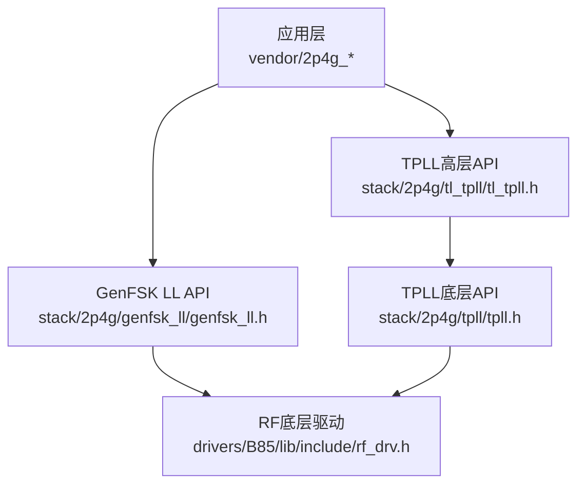
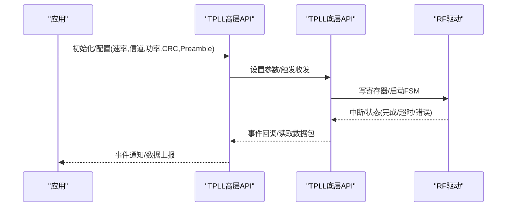
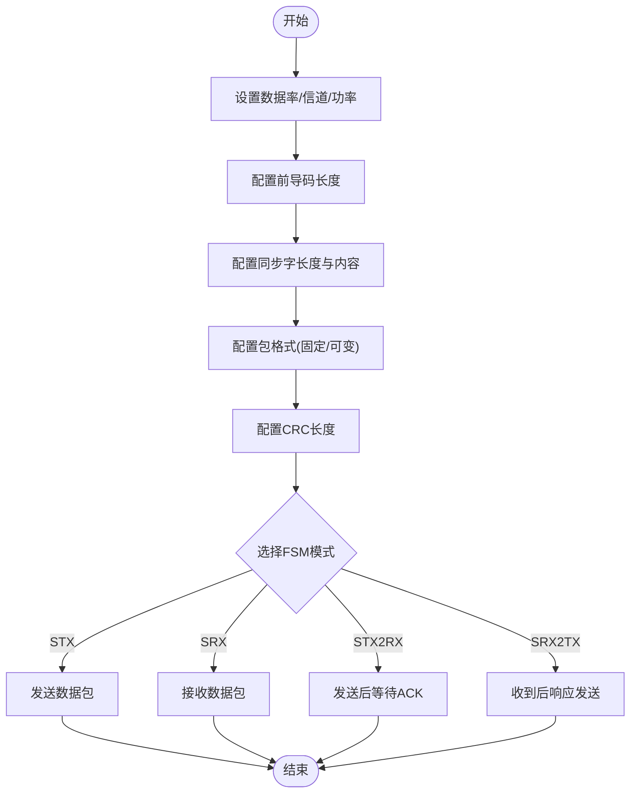
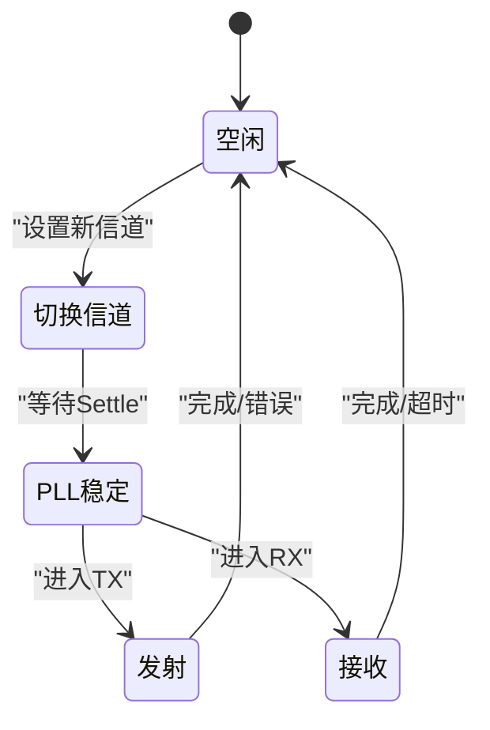
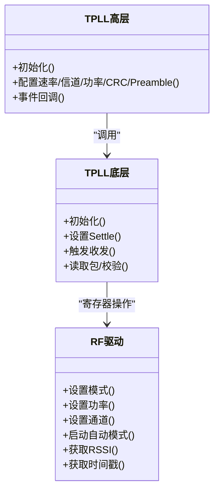
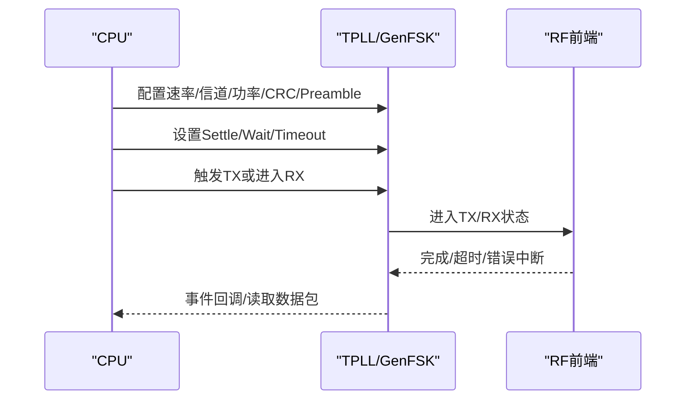
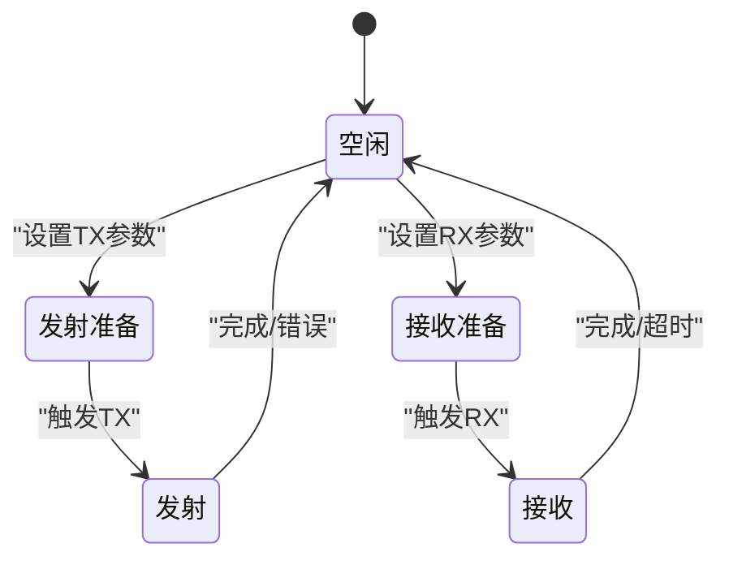
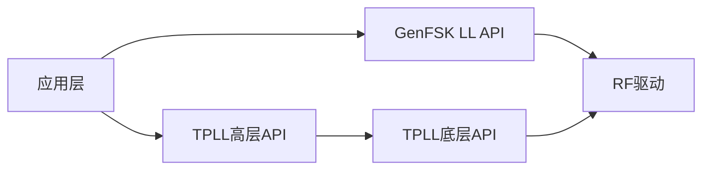

# 物理层（TPLL）

<cite>
**本文引用的文件**
- [tl_tpll.h](file://tc_ble_single_sdk/stack/2p4g/tl_tpll/tl_tpll.h)
- [tpll.h](file://tc_ble_single_sdk/stack/2p4g/tpll/tpll.h)
- [genfsk_ll.h](file://tc_ble_single_sdk/stack/2p4g/genfsk_ll/genfsk_ll.h)
- [rf_drv.h](file://tc_ble_single_sdk/drivers/B85/lib/include/rf_drv.h)
- [app_tl_ptx.c](file://tc_ble_single_sdk/vendor/2p4g_tpll/app_tl_ptx.c)
- [app_tx.c](file://tc_ble_single_sdk/vendor/2p4g_genfsk_ll/app_tx.c)
</cite>

## 目录
1. [简介](#简介)
2. [项目结构](#项目结构)
3. [核心组件](#核心组件)
4. [架构总览](#架构总览)
5. [详细组件分析](#详细组件分析)
6. [依赖关系分析](#依赖关系分析)
7. [性能与参数](#性能与参数)
8. [故障排查指南](#故障排查指南)
9. [结论](#结论)
10. [附录：API参考](#附录api参考)

## 简介
本技术文档围绕2.4G物理层（TPLL）展开，重点说明GenFSK调制解调器、频率合成器与射频前端控制的工作机制；阐述调制指数配置、预同步序列生成、CRC校验与错误检测算法；并提供射频时序图、状态转换图与性能参数表。同时给出信道选择、功率控制与抗干扰策略的实现细节，以及物理层API接口的完整参考（初始化、配置参数、数据传输接口）。

## 项目结构
仓库中与2.4G TPLL相关的代码主要分布在以下位置：
- 协议栈抽象层（Stack）：提供高层API与状态机封装
  - stack/2p4g/tl_tpll：Telink TPLL高层接口
  - stack/2p4g/tpll：TPLL底层驱动接口
  - stack/2p4g/genfsk_ll：GenFSK链路层接口
- 驱动层（Drivers）：RF底层驱动与寄存器操作
  - drivers/B85/lib/include/rf_drv.h：RF模式、通道、功率、收发状态等基础能力
- 应用示例（Vendor）：展示如何使用上述API进行PTX/PRX流程
  - vendor/2p4g_tpll/app_tl_ptx.c：TPLL PTX示例
  - vendor/2p4g_genfsk_ll/app_tx.c：GenFSK TX示例

图表来源
- [tl_tpll.h:207-553](file://tc_ble_single_sdk/stack/2p4g/tl_tpll/tl_tpll.h#L207-L553)
- [tpll.h:100-593](file://tc_ble_single_sdk/stack/2p4g/tpll/tpll.h#L100-L593)
- [genfsk_ll.h:110-459](file://tc_ble_single_sdk/stack/2p4g/genfsk_ll/genfsk_ll.h#L110-L459)
- [rf_drv.h:474-999](file://tc_ble_single_sdk/drivers/B85/lib/include/rf_drv.h#L474-L999)

章节来源
- [tl_tpll.h:207-553](file://tc_ble_single_sdk/stack/2p4g/tl_tpll/tl_tpll.h#L207-L553)
- [tpll.h:100-593](file://tc_ble_single_sdk/stack/2p4g/tpll/tpll.h#L100-L593)
- [genfsk_ll.h:110-459](file://tc_ble_single_sdk/stack/2p4g/genfsk_ll/genfsk_ll.h#L110-L459)
- [rf_drv.h:474-999](file://tc_ble_single_sdk/drivers/B85/lib/include/rf_drv.h#L474-L999)

## 核心组件
- TPLL高层接口（tl_tpll.h）
  - 提供初始化、速率、信道、功率、管道地址、自动重传、Preamble长度、CRC、事件回调、收发触发、等待/稳定时间设置等API
  - 支持多速率（1M/2M/500k/250k）、多种调制指数、16/8位CRC、最大载荷64字节、最多6个管道
- TPLL底层接口（tpll.h）
  - 提供初始化、信道、功率、管道、地址宽度、自动重传、FIFO、触发收发、等待/稳定时间、快速 settle 优化、PID管理、包有效性/CRC检查等
  - 定义状态机状态、模式（PTX/PRX）、调制指数枚举、快速settles时间选项
- GenFSK链路层接口（genfsk_ll.h）
  - 提供数据率、信道、功率、状态机（TX/RX/AUTO/OFF）、Preamble/Sync Word长度与内容、包格式（固定/可变载荷）、CRC长度、DMA RX缓冲、RSSI/时间戳、自动FSM（STX/SRX/STX2RX/SRX2TX）等
  - 提供手动PID设置、自动PID禁用、MI配置等
- RF底层驱动（rf_drv.h）
  - 提供RF模式、收发状态、通道、功率、Access Code、缓冲区、自动模式（stx/srx/stx2rx/srx2tx）、完成标志、RSSI获取、校准与优化函数等

章节来源
- [tl_tpll.h:118-196](file://tc_ble_single_sdk/stack/2p4g/tl_tpll/tl_tpll.h#L118-L196)
- [tpll.h:39-98](file://tc_ble_single_sdk/stack/2p4g/tpll/tpll.h#L39-L98)
- [genfsk_ll.h:29-104](file://tc_ble_single_sdk/stack/2p4g/genfsk_ll/genfsk_ll.h#L29-L104)
- [rf_drv.h:132-156](file://tc_ble_single_sdk/drivers/B85/lib/include/rf_drv.h#L132-L156)

## 架构总览
TPLL在SDK中采用分层设计：
- 应用层通过TPLL高层API或GenFSK LL API发起收发
- 高层API调用TPLL底层API进行具体配置与触发
- 底层API直接操作RF驱动，完成频率合成、调制解调、前导码/同步字处理、CRC计算与校验、RSSI/时间戳采集等
- 自动FSM（如STX2RX）由RF硬件/固件协同调度，减少CPU干预

图表来源
- [tl_tpll.h:207-553](file://tc_ble_single_sdk/stack/2p4g/tl_tpll/tl_tpll.h#L207-L553)
- [tpll.h:100-593](file://tc_ble_single_sdk/stack/2p4g/tpll/tpll.h#L100-L593)
- [rf_drv.h:800-999](file://tc_ble_single_sdk/drivers/B85/lib/include/rf_drv.h#L800-L999)

## 详细组件分析

### GenFSK调制解调器工作原理
- 调制方式：FSK（频移键控），通过调制指数（MI）控制频偏与带宽的平衡
- 数据率：支持1M/2M/500k/250k等速率
- 包格式：
  - 固定载荷：前导码 + 同步字 + 载荷 + CRC
  - 可变载荷：前导码 + 同步字 + 头（含长度字段）+ 载荷 + CRC
- 同步字：可配置3/4/5字节，用于帧同步与设备寻址
- 前导码：1-16字节，帮助接收端锁定与定时恢复
- 自动FSM：支持单发（STX）、单收（SRX）、发后收（STX2RX）、收后发（SRX2TX），降低CPU开销并提高实时性

图表来源
- [genfsk_ll.h:110-459](file://tc_ble_single_sdk/stack/2p4g/genfsk_ll/genfsk_ll.h#L110-L459)

章节来源
- [genfsk_ll.h:29-104](file://tc_ble_single_sdk/stack/2p4g/genfsk_ll/genfsk_ll.h#L29-L104)
- [genfsk_ll.h:110-459](file://tc_ble_single_sdk/stack/2p4g/genfsk_ll/genfsk_ll.h#L110-L459)

### 频率合成器实现机制
- 信道选择：通过设置RF通道号确定中心频率（例如2400MHz + 通道×0.5MHz）
- 稳定时间（Settle）：切换信道或进入TX/RX前需等待PLL稳定，SDK提供TX/RX settle时间配置
- 快速Settle优化：支持快速TX/RX settle初始化与开关，减少切换时延
- 校准：包含LO/HPMC等校准项，可在不同信道下获取/设置校准值

图表来源
- [tpll.h:373-401](file://tc_ble_single_sdk/stack/2p4g/tpll/tpll.h#L373-L401)
- [rf_drv.h:646-655](file://tc_ble_single_sdk/drivers/B85/lib/include/rf_drv.h#L646-L655)

章节来源
- [tpll.h:373-401](file://tc_ble_single_sdk/stack/2p4g/tpll/tpll.h#L373-L401)
- [rf_drv.h:646-655](file://tc_ble_single_sdk/drivers/B85/lib/include/rf_drv.h#L646-L655)

### 射频前端控制
- 模式与状态：支持TX/RX/AUTO/OFF，自动模式由硬件FSM调度
- 功率控制：提供多级功率档位（VBAT/VANT），可按芯片平台选择默认功率
- 天线切换：支持多天线序列模式（如0123循环）
- RSSI与时序：支持瞬时RSSI与冻结RSSI、接收时间戳、载波检测

图表来源
- [rf_drv.h:474-999](file://tc_ble_single_sdk/drivers/B85/lib/include/rf_drv.h#L474-L999)
- [tpll.h:100-593](file://tc_ble_single_sdk/stack/2p4g/tpll/tpll.h#L100-L593)
- [tl_tpll.h:207-553](file://tc_ble_single_sdk/stack/2p4g/tl_tpll/tl_tpll.h#L207-L553)

章节来源
- [rf_drv.h:474-999](file://tc_ble_single_sdk/drivers/B85/lib/include/rf_drv.h#L474-L999)
- [tpll.h:100-593](file://tc_ble_single_sdk/stack/2p4g/tpll/tpll.h#L100-L593)
- [tl_tpll.h:207-553](file://tc_ble_single_sdk/stack/2p4g/tl_tpll/tl_tpll.h#L207-L553)

### 调制指数配置
- 调制指数（MI）影响频偏与带宽，SDK提供多个MI档位（如0.32/0.5/0.6/0.7/0.8/0.9/1.2/1.3/1.4）
- TPLL与GenFSK均提供TX/RX MI设置接口，确保收发两端一致
- 公式参考：
  - TPLL：频偏 = 数据率 / (调制指数)^2
  - GenFSK：调制指数 = 频偏 × 2 / 数据率

章节来源
- [tl_tpll.h:158-171](file://tc_ble_single_sdk/stack/2p4g/tl_tpll/tl_tpll.h#L158-L171)
- [tl_tpll.h:467-481](file://tc_ble_single_sdk/stack/2p4g/tl_tpll/tl_tpll.h#L467-L481)
- [genfsk_ll.h:60-73](file://tc_ble_single_sdk/stack/2p4g/genfsk_ll/genfsk_ll.h#L60-L73)
- [genfsk_ll.h:445-458](file://tc_ble_single_sdk/stack/2p4g/genfsk_ll/genfsk_ll.h#L445-L458)
- [tpll.h:74-87](file://tc_ble_single_sdk/stack/2p4g/tpll/tpll.h#L74-L87)
- [tpll.h:481-495](file://tc_ble_single_sdk/stack/2p4g/tpll/tpll.h#L481-L495)

### 预同步序列生成
- 前导码（Preamble）：1-16字节，用于接收端同步与AGC收敛
- 同步字（Sync Word）：3-5字节，用于帧同步与设备识别
- SDK提供设置/读取前导码长度、设置同步字长度与内容的接口
- 应用示例展示了如何配置前导码与同步字并启用管道接收

章节来源
- [genfsk_ll.h:143-171](file://tc_ble_single_sdk/stack/2p4g/genfsk_ll/genfsk_ll.h#L143-L171)
- [tl_tpll.h:483-502](file://tc_ble_single_sdk/stack/2p4g/tl_tpll/tl_tpll.h#L483-L502)
- [tpll.h:497-516](file://tc_ble_single_sdk/stack/2p4g/tpll/tpll.h#L497-L516)
- [app_tx.c:111-137](file://tc_ble_single_sdk/vendor/2p4g_genfsk_ll/app_tx.c#L111-L137)

### CRC校验与错误检测
- CRC长度：支持关闭、1字节、2字节（GenFSK）；TPLL支持8/16位
- 包有效性检查：提供宏/函数判断包长度与CRC是否有效
- 错误处理：支持CRC错误时是否发送ACK、无效PID中断计数、重传次数与延迟配置
- 应用示例展示了事件回调中读取接收包与统计计数

章节来源
- [genfsk_ll.h:51-58](file://tc_ble_single_sdk/stack/2p4g/genfsk_ll/genfsk_ll.h#L51-L58)
- [genfsk_ll.h:219-254](file://tc_ble_single_sdk/stack/2p4g/genfsk_ll/genfsk_ll.h#L219-L254)
- [tl_tpll.h:173-176](file://tc_ble_single_sdk/stack/2p4g/tl_tpll/tl_tpll.h#L173-L176)
- [tl_tpll.h:525-549](file://tc_ble_single_sdk/stack/2p4g/tl_tpll/tl_tpll.h#L525-L549)
- [tpll.h:31-33](file://tc_ble_single_sdk/stack/2p4g/tpll/tpll.h#L31-L33)
- [tpll.h:416-472](file://tc_ble_single_sdk/stack/2p4g/tpll/tpll.h#L416-L472)
- [app_tl_ptx.c:51-119](file://tc_ble_single_sdk/vendor/2p4g_tpll/app_tl_ptx.c#L51-L119)

### 射频时序图

图表来源
- [genfsk_ll.h:314-423](file://tc_ble_single_sdk/stack/2p4g/genfsk_ll/genfsk_ll.h#L314-L423)
- [tpll.h:335-401](file://tc_ble_single_sdk/stack/2p4g/tpll/tpll.h#L335-L401)
- [rf_drv.h:800-862](file://tc_ble_single_sdk/drivers/B85/lib/include/rf_drv.h#L800-L862)

### 状态转换图

图表来源
- [tpll.h:58-66](file://tc_ble_single_sdk/stack/2p4g/tpll/tpll.h#L58-L66)
- [genfsk_ll.h:75-83](file://tc_ble_single_sdk/stack/2p4g/genfsk_ll/genfsk_ll.h#L75-L83)

### 性能参数表
- 数据率：1M/2M/500k/250k（TPLL/GenFSK）
- 调制指数：0.32/0.5/0.6/0.7/0.8/0.9/1.2/1.3/1.4（可选0.076私有模式）
- 前导码长度：1-16字节
- 同步字长度：3-5字节
- CRC：8/16位（TPLL），关闭/1/2字节（GenFSK）
- 最大载荷：64字节（TPLL）
- 管道数：最多6个（TPLL）
- 稳定时间：TX≥108us，RX≥85us（典型值约110-120us）
- 功率档位：从-50dBm到+10.46dBm（依平台与电源轨）

章节来源
- [tl_tpll.h:151-156](file://tc_ble_single_sdk/stack/2p4g/tl_tpll/tl_tpll.h#L151-L156)
- [tl_tpll.h:158-171](file://tc_ble_single_sdk/stack/2p4g/tl_tpll/tl_tpll.h#L158-L171)
- [tl_tpll.h:48-57](file://tc_ble_single_sdk/stack/2p4g/tl_tpll/tl_tpll.h#L48-L57)
- [genfsk_ll.h:29-36](file://tc_ble_single_sdk/stack/2p4g/genfsk_ll/genfsk_ll.h#L29-L36)
- [genfsk_ll.h:51-58](file://tc_ble_single_sdk/stack/2p4g/genfsk_ll/genfsk_ll.h#L51-L58)
- [rf_drv.h:183-257](file://tc_ble_single_sdk/drivers/B85/lib/include/rf_drv.h#L183-L257)

### 信道选择、功率控制与抗干扰策略
- 信道选择：
  - 设置RF通道号以改变中心频率
  - 支持新信道设置与快速切换
- 功率控制：
  - 根据平台选择默认功率（VBAT/VANT）
  - 动态调整功率以满足覆盖与功耗需求
- 抗干扰策略：
  - 合理配置前导码与同步字以提高同步可靠性
  - 使用CRC校验与无效PID中断过滤错误包
  - 自动重传与重试延迟提升鲁棒性
  - 快速Settle优化减少跳频时的失锁风险

章节来源
- [tl_tpll.h:222-234](file://tc_ble_single_sdk/stack/2p4g/tl_tpll/tl_tpll.h#L222-L234)
- [tpll.h:108-120](file://tc_ble_single_sdk/stack/2p4g/tpll/tpll.h#L108-L120)
- [genfsk_ll.h:126-133](file://tc_ble_single_sdk/stack/2p4g/genfsk_ll/genfsk_ll.h#L126-L133)
- [rf_drv.h:474-488](file://tc_ble_single_sdk/drivers/B85/lib/include/rf_drv.h#L474-L488)
- [app_tl_ptx.c:121-175](file://tc_ble_single_sdk/vendor/2p4g_tpll/app_tl_ptx.c#L121-L175)

## 依赖关系分析
- 应用层依赖TPLL高层API或GenFSK LL API
- TPLL高层API依赖TPLL底层API
- TPLL底层API依赖RF驱动
- 自动FSM依赖RF驱动的定时器与中断机制

图表来源
- [tl_tpll.h:207-553](file://tc_ble_single_sdk/stack/2p4g/tl_tpll/tl_tpll.h#L207-L553)
- [tpll.h:100-593](file://tc_ble_single_sdk/stack/2p4g/tpll/tpll.h#L100-L593)
- [genfsk_ll.h:110-459](file://tc_ble_single_sdk/stack/2p4g/genfsk_ll/genfsk_ll.h#L110-L459)
- [rf_drv.h:474-999](file://tc_ble_single_sdk/drivers/B85/lib/include/rf_drv.h#L474-L999)

章节来源
- [tl_tpll.h:207-553](file://tc_ble_single_sdk/stack/2p4g/tl_tpll/tl_tpll.h#L207-L553)
- [tpll.h:100-593](file://tc_ble_single_sdk/stack/2p4g/tpll/tpll.h#L100-L593)
- [genfsk_ll.h:110-459](file://tc_ble_single_sdk/stack/2p4g/genfsk_ll/genfsk_ll.h#L110-L459)
- [rf_drv.h:474-999](file://tc_ble_single_sdk/drivers/B85/lib/include/rf_drv.h#L474-L999)

## 性能与参数
- 吞吐与延迟：
  - 高数据率（2M）提升吞吐但增加对同步与MI的要求
  - 合理设置前导码与同步字可降低首包延迟
- 功耗：
  - 降低功率档位可减少功耗但影响覆盖
  - 快速Settle与自动FSM减少CPU占用与唤醒次数
- 可靠性：
  - CRC与重传机制提升误包率下的成功率
  - 无效PID中断有助于丢弃非目标设备包

[本节为通用指导，不直接分析具体文件]

## 故障排查指南
- 常见问题
  - 无法接收：检查前导码/同步字配置、信道与功率、管道使能
  - CRC错误：确认收发两端MI、数据率、CRC长度一致
  - 超时：调整RX等待时间与超时阈值
  - 重传过多：检查信道质量、功率与重传次数/延迟
- 调试手段
  - 使用RSSI与时戳定位链路质量与时序问题
  - 利用无效PID中断计数与重传计数统计异常
  - 通过自动FSM（STX2RX/SRX2TX）简化ACK流程

章节来源
- [app_tl_ptx.c:51-119](file://tc_ble_single_sdk/vendor/2p4g_tpll/app_tl_ptx.c#L51-L119)
- [genfsk_ll.h:240-287](file://tc_ble_single_sdk/stack/2p4g/genfsk_ll/genfsk_ll.h#L240-L287)
- [tpll.h:416-472](file://tc_ble_single_sdk/stack/2p4g/tpll/tpll.h#L416-L472)

## 结论
TPLL在SDK中提供了完整的2.4G物理层能力，涵盖GenFSK调制解调、频率合成、射频前端控制、CRC校验与错误检测、自动FSM调度等。通过合理的MI、前导码/同步字、CRC与重传策略，可实现高可靠、低延迟的无线通信。结合快速Settle与功率控制，可在覆盖与功耗之间取得良好平衡。

[本节为总结，不直接分析具体文件]

## 附录：API参考
- TPLL高层API（tl_tpll.h）
  - 初始化：trf_tpll_init
  - 速率：trf_tpll_set_bitrate
  - 信道：trf_tpll_set_rf_channel / trf_tpll_set_new_rf_channel
  - 功率：trf_tpll_set_txpower
  - 管道：trf_tpll_set_txpipe / trf_tpll_get_txpipe / trf_tpll_open_pipe / trf_tpll_close_pipe
  - 地址：trf_tpll_set_address / trf_tpll_get_address / trf_tpll_set_address_width / trf_tpll_get_address_width
  - 重传：trf_tpll_set_auto_retry / trf_tpll_get_transmit_attempts
  - FIFO：trf_tpll_update_txfifo_rptr / trf_tpll_txfifo_empty / trf_tpll_txfifo_full
  - 收发：trf_tpll_write_payload / trf_tpll_read_rx_payload / trf_tpll_start_tx / trf_tpll_start_rx
  - 时序：trf_tpll_set_tx_wait / trf_tpll_set_rx_wait / trf_tpll_set_rx_timeout / trf_tpll_set_tx_settle / trf_tpll_set_rx_settle
  - 模式：trf_tpll_set_mode / trf_tpll_disable
  - MI：trf_tpll_set_txmi / trf_tpll_set_rxmi
  - Preamble：trf_tpll_set_preamble_len / trf_tpll_get_preamble_len / trf_tpll_disable_preamble_detect
  - 基地址与前缀：trf_tpll_set_base_address_0 / trf_tpll_set_base_address_1 / trf_tpll_set_prefixes
  - CRC过滤：trf_tpll_enable_crcfilter
  - 事件：trf_tpll_rxirq_handler / trf_tpll_get_event_handler
  - 包处理：trf_tpll_get_rx_packet / trf_tpll_is_crc_vaild
- TPLL底层API（tpll.h）
  - 初始化：TPLL_Init
  - 信道：TPLL_SetRFChannel / TPLL_SetNewRFChannel
  - 功率：TPLL_SetOutputPower
  - 管道：TPLL_SetTXPipe / TPLL_GetTXPipe / TPLL_OpenPipe / TPLL_ClosePipe
  - 地址：TPLL_SetAddress / TPLL_GetAddress / TPLL_SetAddressWidth / TPLL_GetAddressWidth
  - 重传：TPLL_SetAutoRetry / TPLL_GetTransmitAttempts
  - FIFO：TPLL_UpdateTXFifoRptr / TPLL_TxFifoEmpty / TPLL_TxFifoFull
  - 触发：TPLL_PTXTrig / TPLL_PRXTrig
  - 时序：TPLL_RxWaitSet / TPLL_TxWaitSet / TPLL_Fast_TxWaitSet / TPLL_Fast_RxWaitSet / TPLL_RxTimeoutSet / TPLL_TxSettleSet / TPLL_Fast_TxSettleSet / TPLL_RxSettleSet / TPLL_Fast_RxSettleSet
  - 模式：TPLL_ModeSet / TPLL_ModeStop
  - 包验证：TPLL_IsRxPacketValid / TPLL_GetRxPacket / TPLL_GetRxPacketId
  - CRC：TPLL_EnableCrcfilter / TPLL_GetRxPacketCrc / TPLL_IsCrcVaild / TPLL_IsPacketLenVaild / TPLL_IsPacketEmpty
  - PID：TPLL_GetLocalPid / TPLL_Pid_Reset_Disable
  - MI：TPLL_SetTxMI / TPLL_SetRxMI
  - Preamble：TPLL_Preamble_Set / TPLL_Preamble_Read / TPLL_Preamble_Detect_Disable
  - 快速Settle：TPLL_Fast_RxSettleInit / TPLL_Fast_TxSettleInit / TPLL_Fast_TxSettleEnable / TPLL_Fast_TxSettleDisable / TPLL_Fast_RxSettleEnable / TPLL_Fast_RxSettleDisable
  - HPMC校准：TPLL_GetHpmcCalVal / TPLL_SetHpmcCalVal
- GenFSK LL API（genfsk_ll.h）
  - 数据率：gen_fsk_datarate_set
  - 功率：gen_fsk_radio_power_set
  - 信道：gen_fsk_channel_set
  - 状态：gen_fsk_radio_state_set
  - Preamble：gen_fsk_preamble_len_set
  - Sync Word：gen_fsk_sync_word_len_set / gen_fsk_sync_word_set
  - 管道：gen_fsk_pipe_open / gen_fsk_pipe_close / gen_fsk_tx_pipe_set
  - 包格式：gen_fsk_packet_format_set
  - CRC：gen_fsk_crc_len_set
  - RX缓冲：gen_fsk_rx_buffer_set
  - CRC校验：gen_fsk_is_rx_crc_ok / gen_fsk_is_rx_crc_ok_register
  - 载荷：gen_fsk_rx_payload_get
  - RSSI：gen_fsk_rx_packet_rssi_get / gen_fsk_rx_instantaneous_rssi_get
  - 时间戳：gen_fsk_rx_timestamp_get
  - 发送：gen_fsk_tx_start / gen_fsk_is_tx_done / gen_fsk_tx_done_status_clear
  - 时序：gen_fsk_tx_settle_set / gen_fsk_rx_settle_set / gen_fsk_tx_wait_set / gen_fsk_rx_wait_set
  - 自动FSM：gen_fsk_stx_start / gen_fsk_srx_start / gen_fsk_stx2rx_start / gen_fsk_srx2tx_start
  - PID：gen_fsk_auto_pid_disable / gen_fsk_set_pid
  - MI：gen_fsk_tx_set_mi / gen_fsk_rx_set_mi
- RF驱动（rf_drv.h）
  - 初始化：rf_drv_init / rf_multi_mode_drv_init
  - 功率：rf_set_power_level_index / rf_set_power_level_index_zgb / rf_get_tx_power_level
  - Access Code：rf_acc_len_set / rf_acc_code_set / rf_acc_code_get / rf_access_code_comm / rf_longrange_access_code_comm
  - 通道：rf_set_channel / rf_set_ble_channel
  - 状态：rf_trx_state_set / rf_trx_state_get / rf_set_tx_rx_off / rf_set_tx_rx_off_auto_mode
  - 收发：rf_set_txmode / rf_set_rxmode / rf_tx_pkt / rf_tx_pkt_auto / rf_start_btx / rf_start_brx / rf_start_stx / rf_start_srx / rf_start_stx2rx / rf_start_srx2tx
  - 缓冲：rf_rx_buffer_set / rf_rx_buffer_reconfig
  - 完成标志：rf_tx_finish / rf_tx_finish_clear_flag / rf_is_rx_finish / rf_rx_finish_clear_flag
  - RSSI：rf_rssi_get_154
  - 优化：reset_baseband / rf_set_rxpara / tx_settle_adjust

章节来源
- [tl_tpll.h:207-553](file://tc_ble_single_sdk/stack/2p4g/tl_tpll/tl_tpll.h#L207-L553)
- [tpll.h:100-593](file://tc_ble_single_sdk/stack/2p4g/tpll/tpll.h#L100-L593)
- [genfsk_ll.h:110-459](file://tc_ble_single_sdk/stack/2p4g/genfsk_ll/genfsk_ll.h#L110-L459)
- [rf_drv.h:474-999](file://tc_ble_single_sdk/drivers/B85/lib/include/rf_drv.h#L474-L999)