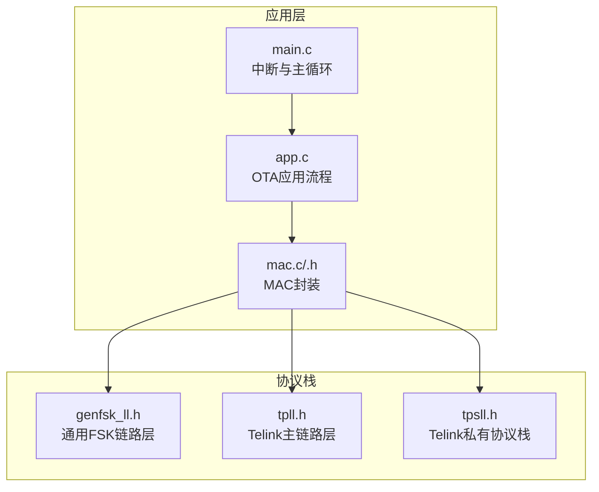
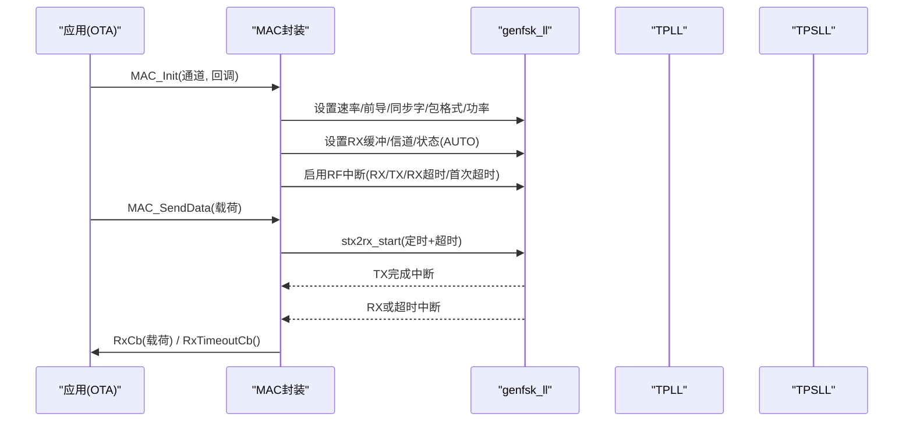
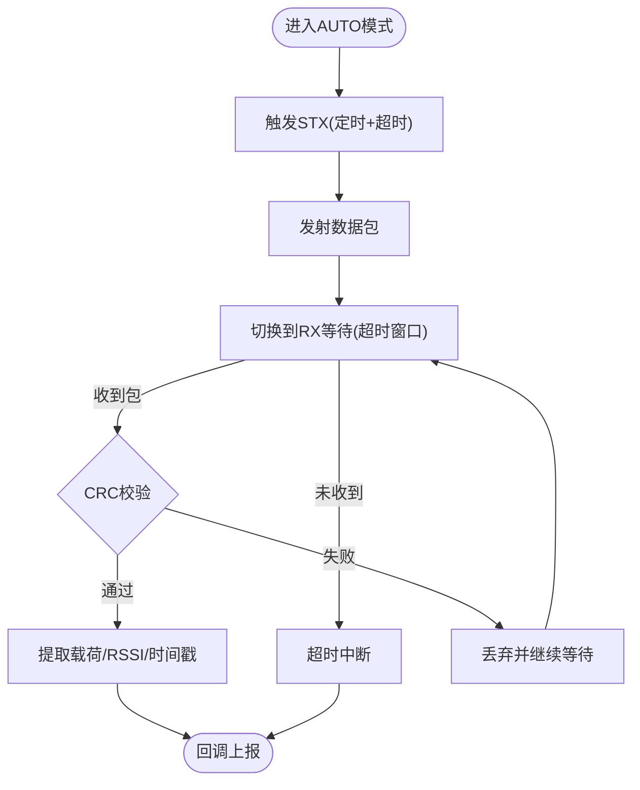
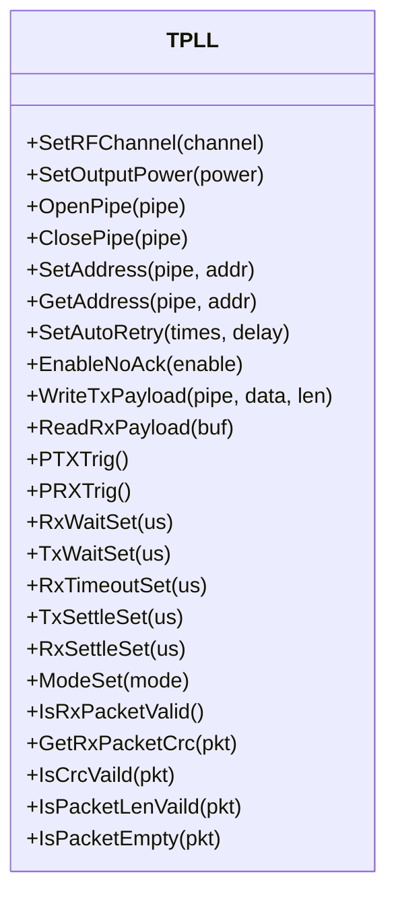
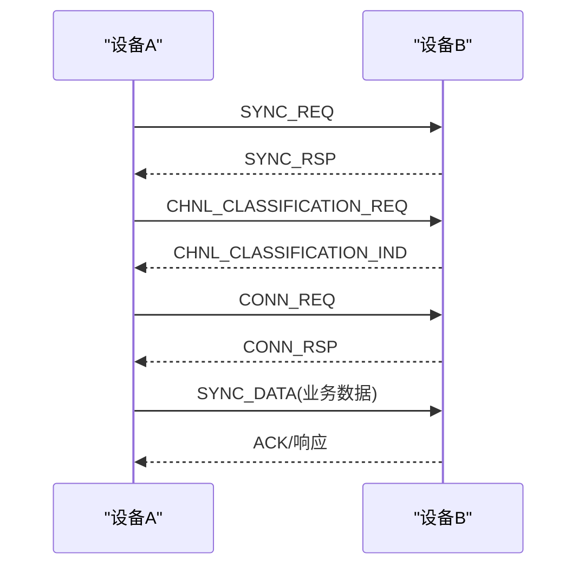
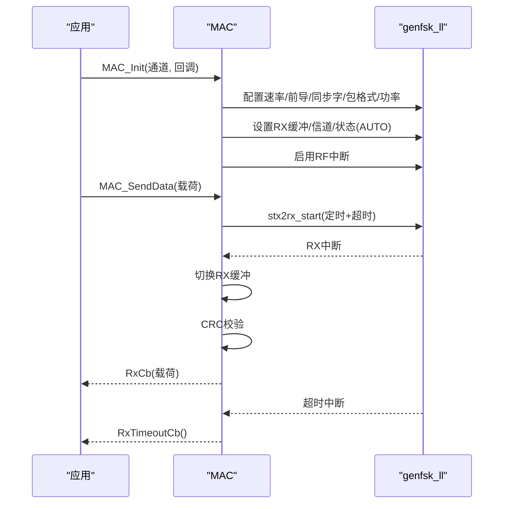
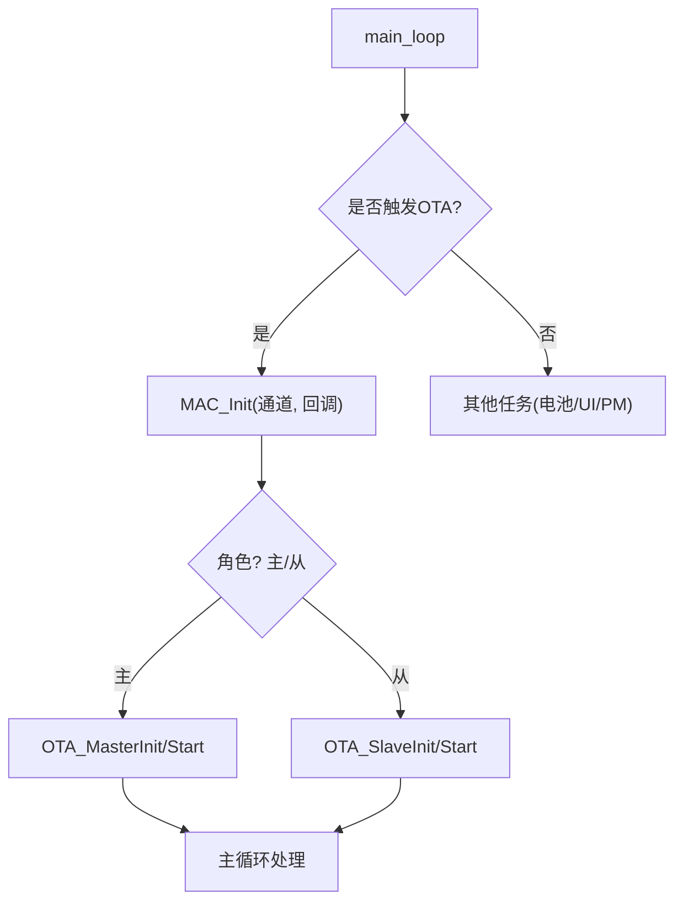
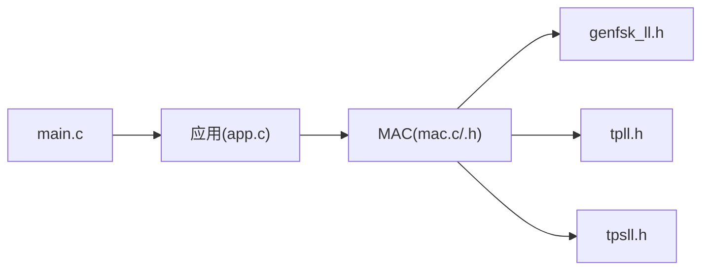

# 网络层

<cite>
**本文引用的文件**
- [genfsk_ll.h](file://tc_ble_single_sdk/stack/2p4g/genfsk_ll/genfsk_ll.h)
- [tpll.h](file://tc_ble_single_sdk/stack/2p4g/tpll/tpll.h)
- [tpsll.h](file://tc_ble_single_sdk/stack/2p4g/tpsll/tpsll.h)
- [mac.c](file://tc_ble_single_sdk/vendor/2p4g_feature/ota/mac.c)
- [mac.h](file://tc_ble_single_sdk/vendor/2p4g_feature/ota/mac.h)
- [app.c](file://tc_ble_single_sdk/vendor/2p4g_feature/ota/app.c)
- [main.c](file://tc_ble_single_sdk/vendor/2p4g_feature_test/feature_per_test/main.c)
</cite>

## 目录
1. [简介](#简介)
2. [项目结构](#项目结构)
3. [核心组件](#核心组件)
4. [架构总览](#架构总览)
5. [详细组件分析](#详细组件分析)
6. [依赖关系分析](#依赖关系分析)
7. [性能与可靠性](#性能与可靠性)
8. [故障排查指南](#故障排查指南)
9. [结论](#结论)
10. [附录：API参考](#附录api参考)

## 简介
本技术文档聚焦于2.4G网络层，围绕以下目标展开：
- 网络拓扑管理、路由算法与协议设计
- 设备发现、配对认证、网络维护与故障恢复机制
- 多节点通信、负载均衡与网络安全策略的实现细节
- 网络层API完整参考（配置、设备管理与监控）

基于仓库中的2.4G协议栈头文件与应用示例，本SDK提供三层抽象：
- 通用FSK链路层（genfsk_ll）：底层射频收发与时序控制
- Telink主链路层（TPLL）：地址、管道、自动重传、ACK等基础链路能力
- Telink私有协议栈（TPSLL）：自定义连接建立、信道分类、数据帧格式与流控

应用侧通过MAC封装（OTA示例）组织初始化、发送、接收与中断处理流程，并向上提供简洁接口。

## 项目结构
2.4G相关代码主要位于 stack/2p4g 与 vendor/2p4g_feature 下：
- stack/2p4g：协议栈核心接口定义（genfsk_ll、tpll、tpsll）
- vendor/2p4g_feature：基于协议栈的应用示例（如OTA），包含MAC封装与业务逻辑
- vendor/2p4g_feature_test：测试入口与中断调度示例

**图示来源**
- [genfsk_ll.h:1-460](file://tc_ble_single_sdk/stack/2p4g/genfsk_ll/genfsk_ll.h#L1-L460)
- [tpll.h:1-593](file://tc_ble_single_sdk/stack/2p4g/tpll/tpll.h#L1-L593)
- [tpsll.h:1-399](file://tc_ble_single_sdk/stack/2p4g/tpsll/tpsll.h#L1-L399)
- [mac.c:1-160](file://tc_ble_single_sdk/vendor/2p4g_feature/ota/mac.c#L1-L160)
- [app.c:1-375](file://tc_ble_single_sdk/vendor/2p4g_feature/ota/app.c#L1-L375)
- [main.c:1-165](file://tc_ble_single_sdk/vendor/2p4g_feature_test/feature_per_test/main.c#L1-L165)

**章节来源**
- [genfsk_ll.h:1-460](file://tc_ble_single_sdk/stack/2p4g/genfsk_ll/genfsk_ll.h#L1-L460)
- [tpll.h:1-593](file://tc_ble_single_sdk/stack/2p4g/tpll/tpll.h#L1-L593)
- [tpsll.h:1-399](file://tc_ble_single_sdk/stack/2p4g/tpsll/tpsll.h#L1-L399)
- [mac.c:1-160](file://tc_ble_single_sdk/vendor/2p4g_feature/ota/mac.c#L1-L160)
- [app.c:1-375](file://tc_ble_single_sdk/vendor/2p4g_feature/ota/app.c#L1-L375)
- [main.c:1-165](file://tc_ble_single_sdk/vendor/2p4g_feature_test/feature_per_test/main.c#L1-L165)

## 核心组件
- 通用FSK链路层（genfsk_ll）
  - 提供射频参数设置（功率、速率、信道）、包格式（固定/可变载荷）、CRC长度、前导码与同步字配置、DMA RX缓冲、RSSI/时间戳读取、自动FSM（单发/单收/收发切换）等能力
- Telink主链路层（TPLL）
  - 提供地址宽度、管道打开/关闭、地址读写、自动重传、ACK负载、状态机、FIFO操作、载波检测、丢包计数、RX/TX等待/超时/稳定时间、快速时序优化等
- Telink私有协议栈（TPSLL）
  - 定义自定义命令集（同步请求/响应、接受/拒绝、连接请求/响应、信道分类、信道映射变更、同步数据）、数据包结构（type/len/cmd/data）、以及收发FSM与参数设置

**章节来源**
- [genfsk_ll.h:29-460](file://tc_ble_single_sdk/stack/2p4g/genfsk_ll/genfsk_ll.h#L29-L460)
- [tpll.h:39-593](file://tc_ble_single_sdk/stack/2p4g/tpll/tpll.h#L39-L593)
- [tpsll.h:31-399](file://tc_ble_single_sdk/stack/2p4g/tpsll/tpsll.h#L31-L399)

## 架构总览
2.4G网络层采用分层设计：
- 应用层（OTA示例）通过MAC封装发起发送/接收，订阅回调
- MAC层负责RF初始化、通道设置、同步字、包格式、中断注册与回调分发
- 协议栈层提供链路能力（TPLL/TPSLL）与底层FSK控制（genfsk_ll）
- 硬件驱动由SDK内部实现，上层仅通过API交互

**图示来源**
- [mac.c:55-115](file://tc_ble_single_sdk/vendor/2p4g_feature/ota/mac.c#L55-L115)
- [genfsk_ll.h:116-423](file://tc_ble_single_sdk/stack/2p4g/genfsk_ll/genfsk_ll.h#L116-L423)
- [app.c:282-317](file://tc_ble_single_sdk/vendor/2p4g_feature/ota/app.c#L282-L317)

## 详细组件分析

### 通用FSK链路层（genfsk_ll）
- 关键能力
  - 射频参数：功率、速率、信道、调制指数（MI）
  - 包格式：固定/可变载荷；CRC长度；前导码与同步字长度及内容
  - 收发模式：TX/RX/AUTO；自动FSM（stx/srx/stx2rx/srx2tx）
  - 缓冲与校验：DMA RX缓冲、CRC校验、RSSI/时间戳获取
  - 管道：多管道支持（PIPE0~PIPE5），可单独或全部开关
- 复杂度与性能
  - 自动FSM减少CPU干预，降低时延抖动
  - 合理设置settling/wait/timeout以平衡功耗与可靠性

**图示来源**
- [genfsk_ll.h:116-423](file://tc_ble_single_sdk/stack/2p4g/genfsk_ll/genfsk_ll.h#L116-L423)

**章节来源**
- [genfsk_ll.h:29-460](file://tc_ble_single_sdk/stack/2p4g/genfsk_ll/genfsk_ll.h#L29-L460)

### Telink主链路层（TPLL）
- 关键能力
  - 地址与管道：地址宽度、管道地址读写、管道开关
  - 传输控制：自动重传次数与间隔、NoAck选项、ACK负载
  - FIFO与状态：TX/RX FIFO空满、丢包计数、载波检测
  - 时序优化：TX/RX settle/fast-settle、wait、timeout
  - 包质量：CRC有效性检查、包长度/空载荷检查、本地PID
- 适用场景
  - 需要可靠点对点链路、低时延ACK、自动重传与丢包统计

**图示来源**
- [tpll.h:100-593](file://tc_ble_single_sdk/stack/2p4g/tpll/tpll.h#L100-L593)

**章节来源**
- [tpll.h:39-593](file://tc_ble_single_sdk/stack/2p4g/tpll/tpll.h#L39-L593)

### Telink私有协议栈（TPSLL）
- 关键能力
  - 自定义命令：同步请求/响应、接受/拒绝、连接请求/响应、信道分类/变更、同步数据
  - 数据包结构：type/len/cmd/data，最大载荷255字节
  - 收发FSM：stx/srx/stx2rx/srx2tx，配合settle/wait/timeout
  - 参数设置：速率、信道、前导码、同步字、CRC长度、功率、RSSI/时间戳
- 适用场景
  - 多设备组网、动态信道管理、自定义连接与数据面协议

**图示来源**
- [tpsll.h:31-399](file://tc_ble_single_sdk/stack/2p4g/tpsll/tpsll.h#L31-L399)

**章节来源**
- [tpsll.h:31-399](file://tc_ble_single_sdk/stack/2p4g/tpsll/tpsll.h#L31-L399)

### MAC封装（OTA示例）
- 职责
  - RF初始化：速率、前导码、同步字、包格式、功率、RX缓冲、信道、状态
  - 中断注册：RX/TX/RX超时/首次超时
  - 发送：组装头部与载荷，调用stx2rx_start
  - 接收：切换下一个RX缓冲，校验CRC后回调上报
  - 超时：回调通知上层进行重试或恢复
- 关键点
  - 使用变量载荷格式，便于扩展头部信息
  - 通过回调解耦中断与业务逻辑

**图示来源**
- [mac.c:55-158](file://tc_ble_single_sdk/vendor/2p4g_feature/ota/mac.c#L55-L158)
- [mac.h:24-44](file://tc_ble_single_sdk/vendor/2p4g_feature/ota/mac.h#L24-L44)

**章节来源**
- [mac.c:1-160](file://tc_ble_single_sdk/vendor/2p4g_feature/ota/mac.c#L1-L160)
- [mac.h:1-44](file://tc_ble_single_sdk/vendor/2p4g_feature/ota/mac.h#L1-L44)

### 应用流程（OTA示例）
- 初始化：加载参数、电池检测、Flash保护、2P4G栈初始化占位
- 触发：根据标志位进入OTA流程，调用MAC_Init并启动主循环
- 主循环：按角色（主/从）执行对应流程，LED指示，周期性任务

**图示来源**
- [app.c:252-330](file://tc_ble_single_sdk/vendor/2p4g_feature/ota/app.c#L252-L330)
- [app.c:338-372](file://tc_ble_single_sdk/vendor/2p4g_feature/ota/app.c#L338-L372)

**章节来源**
- [app.c:1-375](file://tc_ble_single_sdk/vendor/2p4g_feature/ota/app.c#L1-L375)

### 中断与主循环
- 中断入口统一转发到2P4G SDK处理器，区分RF中断源并调用对应处理函数
- 主循环持续运行，处理应用任务、电池检测、UI与电源管理

**章节来源**
- [main.c:38-85](file://tc_ble_single_sdk/vendor/2p4g_feature_test/feature_per_test/main.c#L38-L85)
- [app.c:58-91](file://tc_ble_single_sdk/vendor/2p4g_feature/ota/app.c#L58-L91)

## 依赖关系分析
- 应用层依赖MAC封装，MAC封装依赖genfsk_ll/TPLL/TPSLL
- 中断处理在应用层集中，分派至MAC层具体处理
- 协议栈之间为顺序依赖：应用→MAC→协议栈→底层FSK

**图示来源**
- [app.c:282-317](file://tc_ble_single_sdk/vendor/2p4g_feature/ota/app.c#L282-L317)
- [mac.c:55-115](file://tc_ble_single_sdk/vendor/2p4g_feature/ota/mac.c#L55-L115)
- [main.c:38-85](file://tc_ble_single_sdk/vendor/2p4g_feature_test/feature_per_test/main.c#L38-L85)

**章节来源**
- [app.c:1-375](file://tc_ble_single_sdk/vendor/2p4g_feature/ota/app.c#L1-L375)
- [mac.c:1-160](file://tc_ble_single_sdk/vendor/2p4g_feature/ota/mac.c#L1-L160)
- [main.c:1-165](file://tc_ble_single_sdk/vendor/2p4g_feature_test/feature_per_test/main.c#L1-L165)

## 性能与可靠性
- 时延优化
  - 使用自动FSM（stx2rx/srx2tx）减少CPU介入
  - 合理配置TX/RX settle与wait，避免PLL不稳定导致的重传
  - 利用fast settle/timeout缩短空闲等待
- 可靠性提升
  - 开启CRC校验与NoAck按需选择
  - 配置自动重传次数与间隔，结合丢包计数监控
  - 使用RSSI与载波检测辅助链路质量评估
- 功耗控制
  - 最小化RX监听窗口，使用超时退出
  - 合理设置功率等级与前导码长度

[本节为通用指导，不直接分析具体文件]

## 故障排查指南
- 常见问题定位
  - 无接收：检查RX缓冲设置、信道/同步字匹配、中断使能、CRC校验
  - 频繁超时：调整RX timeout、settling时间、信道干扰情况
  - 发送失败：确认TX FIFO非空、自动重传配置、NoAck与ACK负载一致性
- 调试手段
  - 使用RSSI/瞬时RSSI评估链路质量
  - 通过丢包计数与载波检测判断干扰与拥塞
  - 在中断中记录事件计数，辅助定位时序问题

**章节来源**
- [genfsk_ll.h:265-303](file://tc_ble_single_sdk/stack/2p4g/genfsk_ll/genfsk_ll.h#L265-L303)
- [tpll.h:231-268](file://tc_ble_single_sdk/stack/2p4g/tpll/tpll.h#L231-L268)
- [mac.c:118-158](file://tc_ble_single_sdk/vendor/2p4g_feature/ota/mac.c#L118-L158)

## 结论
该2.4G网络层通过分层设计提供了灵活的链路能力与可扩展的协议栈。应用侧借助MAC封装简化了RF配置与中断处理，结合TPLL/TPSLL可实现可靠的点对点或多点通信。通过合理的时序与重传策略，可在时延、功耗与可靠性之间取得平衡。

[本节为总结性内容，不直接分析具体文件]

## 附录：API参考

### 通用FSK链路层（genfsk_ll）
- 射频配置
  - 功率设置：见 [genfsk_ll.h:116-116](file://tc_ble_single_sdk/stack/2p4g/genfsk_ll/genfsk_ll.h#L116-L116)
  - 速率设置：见 [genfsk_ll.h:124-124](file://tc_ble_single_sdk/stack/2p4g/genfsk_ll/genfsk_ll.h#L124-L124)
  - 信道设置：见 [genfsk_ll.h:133-133](file://tc_ble_single_sdk/stack/2p4g/genfsk_ll/genfsk_ll.h#L133-L133)
  - 调制指数：见 [genfsk_ll.h:450-458](file://tc_ble_single_sdk/stack/2p4g/genfsk_ll/genfsk_ll.h#L450-L458)
- 包格式与校验
  - 包格式：见 [genfsk_ll.h:217-217](file://tc_ble_single_sdk/stack/2p4g/genfsk_ll/genfsk_ll.h#L217-L217)
  - CRC长度：见 [genfsk_ll.h:225-225](file://tc_ble_single_sdk/stack/2p4g/genfsk_ll/genfsk_ll.h#L225-L225)
  - 前导码长度：见 [genfsk_ll.h:150-150](file://tc_ble_single_sdk/stack/2p4g/genfsk_ll/genfsk_ll.h#L150-L150)
  - 同步字长度/内容：见 [genfsk_ll.h:161-171](file://tc_ble_single_sdk/stack/2p4g/genfsk_ll/genfsk_ll.h#L161-L171)
- 收发控制
  - 状态设置：见 [genfsk_ll.h:141-141](file://tc_ble_single_sdk/stack/2p4g/genfsk_ll/genfsk_ll.h#L141-L141)
  - 管道开关/选择：见 [genfsk_ll.h:180-197](file://tc_ble_single_sdk/stack/2p4g/genfsk_ll/genfsk_ll.h#L180-L197)
  - 手动发送/完成检测：见 [genfsk_ll.h:296-311](file://tc_ble_single_sdk/stack/2p4g/genfsk_ll/genfsk_ll.h#L296-L311)
  - 自动FSM：见 [genfsk_ll.h:364-423](file://tc_ble_single_sdk/stack/2p4g/genfsk_ll/genfsk_ll.h#L364-L423)
- 缓冲与监控
  - RX缓冲设置：见 [genfsk_ll.h:238-238](file://tc_ble_single_sdk/stack/2p4g/genfsk_ll/genfsk_ll.h#L238-L238)
  - CRC校验：见 [genfsk_ll.h:246-254](file://tc_ble_single_sdk/stack/2p4g/genfsk_ll/genfsk_ll.h#L246-L254)
  - RSSI/时间戳：见 [genfsk_ll.h:270-287](file://tc_ble_single_sdk/stack/2p4g/genfsk_ll/genfsk_ll.h#L270-L287)

**章节来源**
- [genfsk_ll.h:29-460](file://tc_ble_single_sdk/stack/2p4g/genfsk_ll/genfsk_ll.h#L29-L460)

### Telink主链路层（TPLL）
- 初始化与射频
  - 初始化：见 [tpll.h:106-106](file://tc_ble_single_sdk/stack/2p4g/tpll/tpll.h#L106-L106)
  - 信道/功率：见 [tpll.h:113-127](file://tc_ble_single_sdk/stack/2p4g/tpll/tpll.h#L113-L127)
- 管道与地址
  - 管道开关/选择：见 [tpll.h:177-192](file://tc_ble_single_sdk/stack/2p4g/tpll/tpll.h#L177-L192)
  - 地址宽度/读写：见 [tpll.h:215-221](file://tc_ble_single_sdk/stack/2p4g/tpll/tpll.h#L215-L221), [tpll.h:192-200](file://tc_ble_single_sdk/stack/2p4g/tpll/tpll.h#L192-L200)
- 传输控制
  - 自动重传：见 [tpll.h:208-208](file://tc_ble_single_sdk/stack/2p4g/tpll/tpll.h#L208-L208)
  - NoAck/ACK负载：见 [tpll.h:154-170](file://tc_ble_single_sdk/stack/2p4g/tpll/tpll.h#L154-L170)
  - 触发收发：见 [tpll.h:326-333](file://tc_ble_single_sdk/stack/2p4g/tpll/tpll.h#L326-L333)
- 时序与状态
  - wait/settle/timeout：见 [tpll.h:341-394](file://tc_ble_single_sdk/stack/2p4g/tpll/tpll.h#L341-L394)
  - 状态机/模式：见 [tpll.h:59-72](file://tc_ble_single_sdk/stack/2p4g/tpll/tpll.h#L59-L72), [tpll.h:408-414](file://tc_ble_single_sdk/stack/2p4g/tpll/tpll.h#L408-L414)
- 监控与诊断
  - 丢包计数/载波检测：见 [tpll.h:234-262](file://tc_ble_single_sdk/stack/2p4g/tpll/tpll.h#L234-L262)
  - CRC/包长度/空载荷检查：见 [tpll.h:449-472](file://tc_ble_single_sdk/stack/2p4g/tpll/tpll.h#L449-L472)

**章节来源**
- [tpll.h:39-593](file://tc_ble_single_sdk/stack/2p4g/tpll/tpll.h#L39-L593)

### Telink私有协议栈（TPSLL）
- 命令与数据帧
  - 命令集：见 [tpsll.h:33-47](file://tc_ble_single_sdk/stack/2p4g/tpsll/tpsll.h#L33-L47)
  - 数据结构：见 [tpsll.h:105-130](file://tc_ble_single_sdk/stack/2p4g/tpsll/tpsll.h#L105-L130)
- 收发与参数
  - 初始化/信道/前导/同步字：见 [tpsll.h:138-173](file://tc_ble_single_sdk/stack/2p4g/tpsll/tpsll.h#L138-L173)
  - RX缓冲/CRC/功率：见 [tpsll.h:186-202](file://tc_ble_single_sdk/stack/2p4g/tpsll/tpsll.h#L186-L202)
  - 自动FSM：见 [tpsll.h:312-359](file://tc_ble_single_sdk/stack/2p4g/tpsll/tpsll.h#L312-L359)
  - 监控：RSSI/时间戳/完成状态：见 [tpsll.h:233-290](file://tc_ble_single_sdk/stack/2p4g/tpsll/tpsll.h#L233-L290)

**章节来源**
- [tpsll.h:31-399](file://tc_ble_single_sdk/stack/2p4g/tpsll/tpsll.h#L31-L399)

### MAC封装（OTA示例）
- 接口
  - 初始化：见 [mac.h:29-32](file://tc_ble_single_sdk/vendor/2p4g_feature/ota/mac.h#L29-L32)
  - 发送/接收：见 [mac.h:34-37](file://tc_ble_single_sdk/vendor/2p4g_feature/ota/mac.h#L34-L37)
  - 中断处理：见 [mac.h:38-40](file://tc_ble_single_sdk/vendor/2p4g_feature/ota/mac.h#L38-L40)
- 实现要点
  - RF配置与中断注册：见 [mac.c:55-98](file://tc_ble_single_sdk/vendor/2p4g_feature/ota/mac.c#L55-L98)
  - 发送流程：见 [mac.c:100-110](file://tc_ble_single_sdk/vendor/2p4g_feature/ota/mac.c#L100-L110)
  - 接收与超时回调：见 [mac.c:112-158](file://tc_ble_single_sdk/vendor/2p4g_feature/ota/mac.c#L112-L158)

**章节来源**
- [mac.h:1-44](file://tc_ble_single_sdk/vendor/2p4g_feature/ota/mac.h#L1-L44)
- [mac.c:1-160](file://tc_ble_single_sdk/vendor/2p4g_feature/ota/mac.c#L1-L160)

### 应用流程（OTA示例）
- 主循环与触发：见 [app.c:252-330](file://tc_ble_single_sdk/vendor/2p4g_feature/ota/app.c#L252-L330)
- 常规任务：见 [app.c:338-372](file://tc_ble_single_sdk/vendor/2p4g_feature/ota/app.c#L338-L372)
- 中断分发：见 [app.c:58-91](file://tc_ble_single_sdk/vendor/2p4g_feature/ota/app.c#L58-L91)

**章节来源**
- [app.c:1-375](file://tc_ble_single_sdk/vendor/2p4g_feature/ota/app.c#L1-L375)