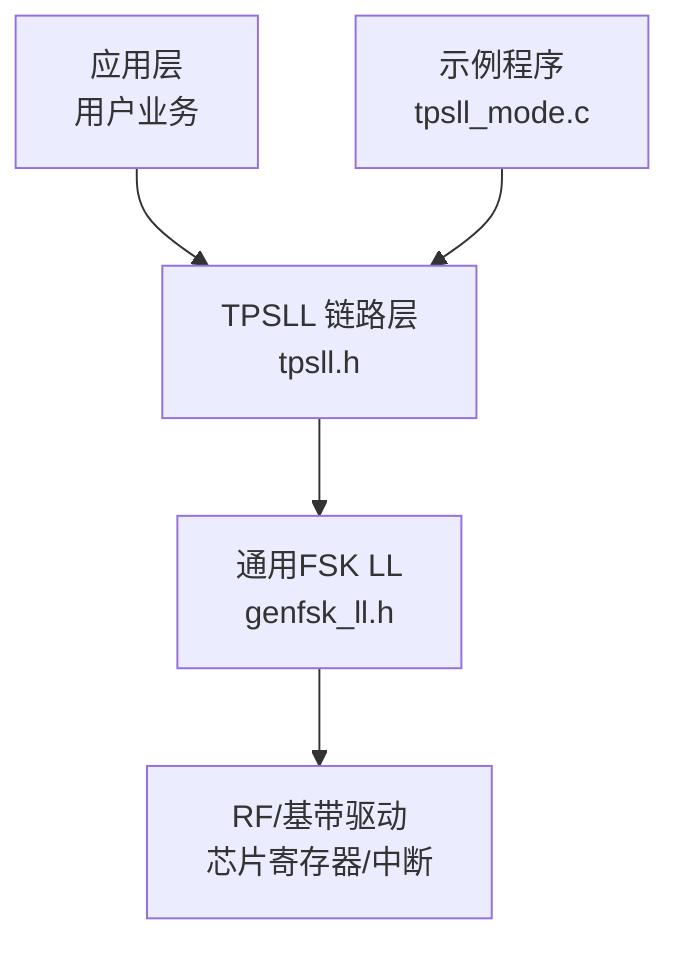
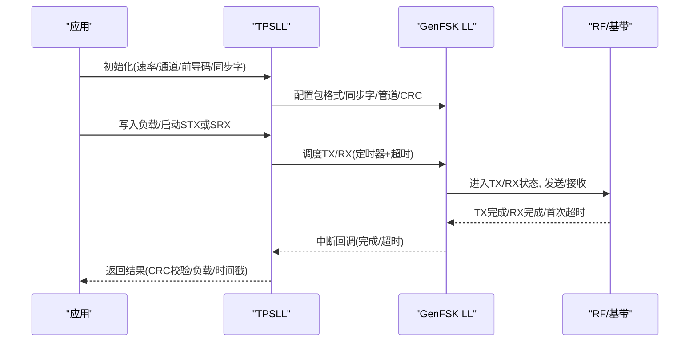
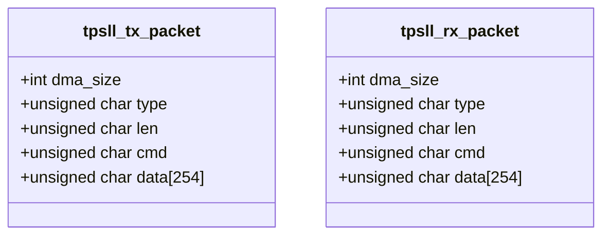
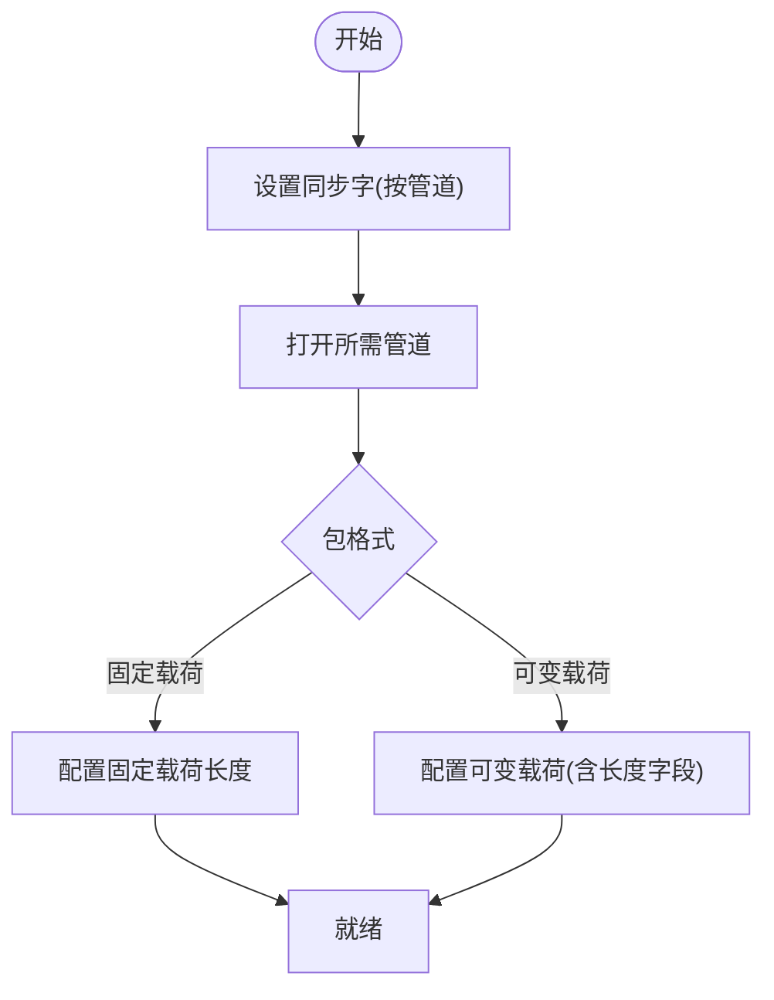
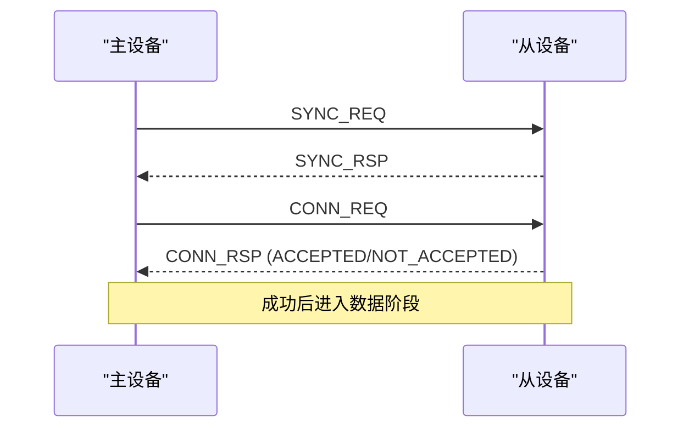
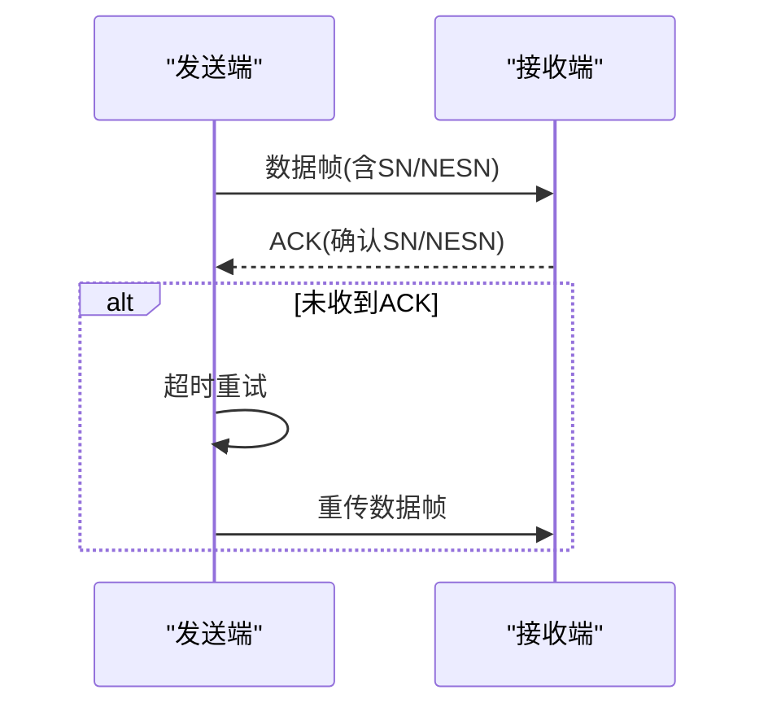
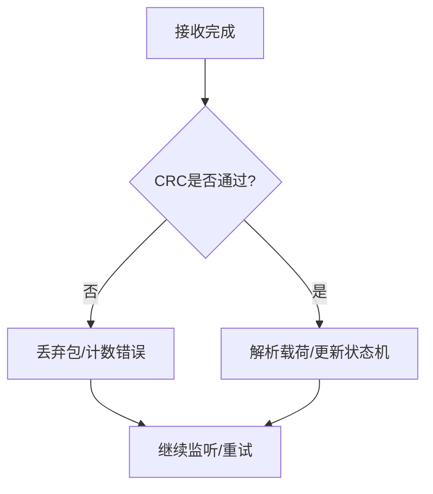
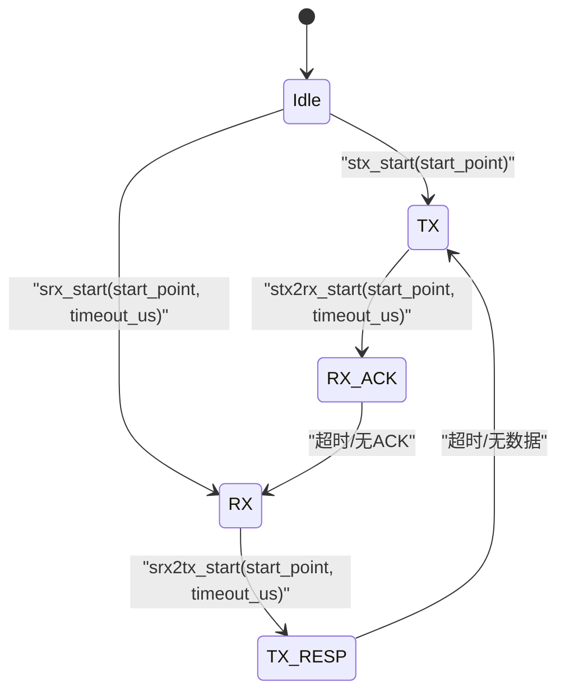
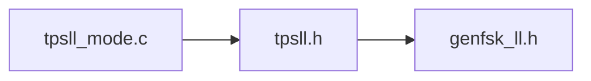

# 链路层（TPSLL）

<cite>
**本文引用的文件**
- [tpsll.h](file://tc_ble_single_sdk/stack/2p4g/tpsll/tpsll.h)
- [genfsk_ll.h](file://tc_ble_single_sdk/stack/2p4g/genfsk_ll/genfsk_ll.h)
- [tpsll_mode.c](file://tc_ble_single_sdk/vendor/2p4g_feature_test/feature_per_test/tpsll_mode.c)
</cite>

## 目录
1. [简介](#简介)
2. [项目结构](#项目结构)
3. [核心组件](#核心组件)
4. [架构总览](#架构总览)
5. [详细组件分析](#详细组件分析)
6. [依赖关系分析](#依赖关系分析)
7. [性能考虑](#性能考虑)
8. [故障排查指南](#故障排查指南)
9. [结论](#结论)
10. [附录：链路层API参考](#附录链路层api参考)

## 简介
本技术文档面向2.4G私有链路层（TPSLL），围绕数据包编解码协议、地址与管道管理、连接建立流程、数据帧格式、ACK确认机制、错误恢复策略、多设备支持、冲突避免与流量控制进行系统化说明，并提供状态机与时序图。同时给出链路层API的完整参考，涵盖连接管理、数据传输与状态查询接口。

## 项目结构
TPSLL位于2.4G协议栈子系统中，提供高层的链路层抽象与配置接口；底层通用FSK收发器通过genfsk_ll暴露射频与基带能力。示例代码展示了如何初始化、配置同步字、打开管道、设置DMA接收缓冲、启动自动收发状态机等。

图表来源
- [tpsll.h:101-130](file://tc_ble_single_sdk/stack/2p4g/tpsll/tpsll.h#L101-L130)
- [genfsk_ll.h:98-104](file://tc_ble_single_sdk/stack/2p4g/genfsk_ll/genfsk_ll.h#L98-L104)
- [tpsll_mode.c:91-122](file://tc_ble_single_sdk/vendor/2p4g_feature_test/feature_per_test/tpsll_mode.c#L91-L122)

章节来源
- [tpsll.h:1-130](file://tc_ble_single_sdk/stack/2p4g/tpsll/tpsll.h#L1-L130)
- [genfsk_ll.h:1-104](file://tc_ble_single_sdk/stack/2p4g/genfsk_ll/genfsk_ll.h#L1-L104)
- [tpsll_mode.c:91-122](file://tc_ble_single_sdk/vendor/2p4g_feature_test/feature_per_test/tpsll_mode.c#L91-L122)

## 核心组件
- 数据包结构
  - 发送/接收包结构包含类型、长度、命令与数据字段，最大载荷为255字节。
- 命令集
  - 同步请求/响应、接受/拒绝、连接请求/响应、信道分类请求/指示、同步数据等。
- 流控标志位
  - NESN、SN、已发送、已接收等标志用于重传与确认。
- 管道与地址
  - 支持多管道（PIPE0~PIPE5）与全开/关闭；可配置同步字以区分不同设备或会话。
- 射频参数
  - 速率、预同步长度、同步字长度、CRC长度、调制指数、发射功率、RX/TX settle时间等。
- 自动收发状态机
  - Single-TX、Single-RX、TX-to-RX、RX-to-TX四种模式，配合定时器触发与超时中断。

章节来源
- [tpsll.h:33-55](file://tc_ble_single_sdk/stack/2p4g/tpsll/tpsll.h#L33-L55)
- [tpsll.h:60-84](file://tc_ble_single_sdk/stack/2p4g/tpsll/tpsll.h#L60-L84)
- [tpsll.h:101-130](file://tc_ble_single_sdk/stack/2p4g/tpsll/tpsll.h#L101-L130)
- [tpsll.h:132-224](file://tc_ble_single_sdk/stack/2p4g/tpsll/tpsll.h#L132-L224)
- [tpsll.h:226-395](file://tc_ble_single_sdk/stack/2p4g/tpsll/tpsll.h#L226-L395)

## 架构总览
TPSLL作为链路层，向上提供连接与数据面API，向下通过通用FSK LL调用射频与基带能力。示例程序演示了典型收发流程：初始化、配置同步字与管道、设置DMA RX缓冲、开启中断、启动自动收发。

图表来源
- [tpsll.h:293-359](file://tc_ble_single_sdk/stack/2p4g/tpsll/tpsll.h#L293-L359)
- [genfsk_ll.h:356-423](file://tc_ble_single_sdk/stack/2p4g/genfsk_ll/genfsk_ll.h#L356-L423)
- [tpsll_mode.c:58-83](file://tc_ble_single_sdk/vendor/2p4g_feature_test/feature_per_test/tpsll_mode.c#L58-L83)

## 详细组件分析

### 数据包结构与编解码
- 帧头：type + len
- 载荷：cmd + data
- CRC：由链路层配置（如3字节）
- 对齐与DMA：发送/接收结构体要求4字节对齐，DMA长度需满足整除16字节且大于包长+16

图表来源
- [tpsll.h:101-130](file://tc_ble_single_sdk/stack/2p4g/tpsll/tpsll.h#L101-L130)

章节来源
- [tpsll.h:101-130](file://tc_ble_single_sdk/stack/2p4g/tpsll/tpsll.h#L101-L130)

### 地址管理与管道管理
- 管道ID：支持PIPE0~PIPE5及全部管道开关
- 同步字：按管道设置，用于设备识别与会话隔离
- 包格式：可变载荷（含长度字段）或固定载荷
- 管道选择：发送时可手动指定TX管道

图表来源
- [tpsll.h:66-84](file://tc_ble_single_sdk/stack/2p4g/tpsll/tpsll.h#L66-L84)
- [genfsk_ll.h:98-104](file://tc_ble_single_sdk/stack/2p4g/genfsk_ll/genfsk_ll.h#L98-L104)
- [genfsk_ll.h:163-197](file://tc_ble_single_sdk/stack/2p4g/genfsk_ll/genfsk_ll.h#L163-L197)

章节来源
- [tpsll.h:66-84](file://tc_ble_single_sdk/stack/2p4g/tpsll/tpsll.h#L66-L84)
- [genfsk_ll.h:163-197](file://tc_ble_single_sdk/stack/2p4g/genfsk_ll/genfsk_ll.h#L163-L197)

### 连接建立过程与握手时序
- 命令序列：SYNC_REQ -> SYNC_RSP -> ACCEPTED/NOT_ACCEPTED -> CONN_REQ -> CONN_RSP
- 应用可在载荷中携带协商参数（如速率、信道、同步字等）
- 建议结合信道分类与跳频（若上层实现）提升鲁棒性

图表来源
- [tpsll.h:33-47](file://tc_ble_single_sdk/stack/2p4g/tpsll/tpsll.h#L33-L47)

章节来源
- [tpsll.h:33-47](file://tc_ble_single_sdk/stack/2p4g/tpsll/tpsll.h#L33-L47)

### 数据帧格式与ACK确认机制
- 数据帧：使用SYNC_DATA命令承载业务数据
- ACK机制：可通过配对TX/RX模式实现ACK（例如STX2RX等待ACK）
- 可靠性：利用CRC校验与超时重试，结合流控标志位（NESN/SN）实现去重与重传

图表来源
- [tpsll.h:49-55](file://tc_ble_single_sdk/stack/2p4g/tpsll/tpsll.h#L49-L55)
- [tpsll.h:293-312](file://tc_ble_single_sdk/stack/2p4g/tpsll/tpsll.h#L293-L312)

章节来源
- [tpsll.h:49-55](file://tc_ble_single_sdk/stack/2p4g/tpsll/tpsll.h#L49-L55)
- [tpsll.h:293-312](file://tc_ble_single_sdk/stack/2p4g/tpsll/tpsll.h#L293-L312)

### 错误恢复策略
- CRC失败：丢弃并统计，必要时触发重传
- 首次超时：在SRX模式下，若无数据到达则触发首次超时中断，重新进入RX
- 退避与重试：应用层可根据失败次数调整退避策略与信道

图表来源
- [tpsll.h:260-274](file://tc_ble_single_sdk/stack/2p4g/tpsll/tpsll.h#L260-L274)
- [tpsll_mode.c:58-83](file://tc_ble_single_sdk/vendor/2p4g_feature_test/feature_per_test/tpsll_mode.c#L58-L83)

章节来源
- [tpsll.h:260-274](file://tc_ble_single_sdk/stack/2p4g/tpsll/tpsll.h#L260-L274)
- [tpsll_mode.c:58-83](file://tc_ble_single_sdk/vendor/2p4g_feature_test/feature_per_test/tpsll_mode.c#L58-L83)

### 多设备支持与冲突避免
- 多设备：通过不同同步字与管道组合隔离设备/会话
- 冲突避免：合理设置前导码与同步字长度、使用随机退避、信道分类与跳频（上层实现）
- 流量控制：基于SN/NESN与窗口大小限制发送速率，避免拥塞

章节来源
- [tpsll.h:60-84](file://tc_ble_single_sdk/stack/2p4g/tpsll/tpsll.h#L60-L84)
- [tpsll.h:49-55](file://tc_ble_single_sdk/stack/2p4g/tpsll/tpsll.h#L49-L55)

### 自动收发状态机与时序
- 模式：Single-TX、Single-RX、TX-to-RX、RX-to-TX
- 触发：系统定时器匹配start_point后进入相应状态
- 超时：RX首次超时与RX超时中断用于处理无应答场景

图表来源
- [tpsll.h:293-359](file://tc_ble_single_sdk/stack/2p4g/tpsll/tpsll.h#L293-L359)

章节来源
- [tpsll.h:293-359](file://tc_ble_single_sdk/stack/2p4g/tpsll/tpsll.h#L293-L359)

## 依赖关系分析
- TPSLL依赖通用FSK LL提供的包格式、管道、CRC、定时与中断能力
- 示例程序依赖TPSLL封装，展示实际收发流程与中断处理

图表来源
- [tpsll.h:132-224](file://tc_ble_single_sdk/stack/2p4g/tpsll/tpsll.h#L132-L224)
- [genfsk_ll.h:116-197](file://tc_ble_single_sdk/stack/2p4g/genfsk_ll/genfsk_ll.h#L116-L197)
- [tpsll_mode.c:91-122](file://tc_ble_single_sdk/vendor/2p4g_feature_test/feature_per_test/tpsll_mode.c#L91-L122)

章节来源
- [tpsll.h:132-224](file://tc_ble_single_sdk/stack/2p4g/tpsll/tpsll.h#L132-L224)
- [genfsk_ll.h:116-197](file://tc_ble_single_sdk/stack/2p4g/genfsk_ll/genfsk_ll.h#L116-L197)
- [tpsll_mode.c:91-122](file://tc_ble_single_sdk/vendor/2p4g_feature_test/feature_per_test/tpsll_mode.c#L91-L122)

## 性能考虑
- 速率与带宽：根据场景选择合适的数据速率（如1Mbps/2Mbps）
- 前导码与同步字：适当增加前导码与同步字长度可提高抗干扰能力，但会增加时延
- 调谐时间：合理设置TX/RX settle时间，确保PLL稳定
- 功率与距离：根据覆盖需求调整发射功率
- 吞吐优化：批量发送、窗口式流量控制、ACK合并

## 故障排查指南
- 无法接收：检查同步字与管道配置、RX缓冲对齐与长度、中断使能
- CRC失败率高：检查射频参数（MI、速率）、信道干扰、前导码/同步字长度
- 无ACK：检查配对收发模式、超时设置、对端是否处于正确状态
- 首次超时频繁：增大RX超时或检查对端发送时机

章节来源
- [tpsll_mode.c:58-83](file://tc_ble_single_sdk/vendor/2p4g_feature_test/feature_per_test/tpsll_mode.c#L58-L83)
- [tpsll.h:260-274](file://tc_ble_single_sdk/stack/2p4g/tpsll/tpsll.h#L260-L274)

## 结论
TPSLL提供了简洁高效的2.4G链路层能力，支持灵活的管道与同步字管理、多种自动收发模式以及可靠的CRC与超时机制。通过合理的参数配置与应用层协议设计，可实现稳定的多设备通信、冲突避免与流量控制。

## 附录：链路层API参考
以下为TPSLL关键API的分类参考（函数名与用途来源于头文件声明）：

- 初始化与射频配置
  - tpsll_init：初始化RF并设置空中速率
  - tpsll_channel_set：设置工作信道
  - tpsll_preamble_len_set：设置前导码长度
  - tpsll_sync_word_len_set：设置同步字长度
  - tpsll_sync_word_set：为指定管道设置同步字
  - tpsll_radio_power_set：设置发射功率
  - tpsll_crc_len_set：设置CRC长度
  - tpsll_rx_settle_set / tpsll_tx_settle_set：设置RX/TX调谐时间

- 收发控制
  - tpsll_stx_start：启动Single-TX
  - tpsll_srx_start：启动Single-RX
  - tpsll_stx2rx_start：启动TX后接RX（用于ACK）
  - tpsll_srx2tx_start：启动RX后接TX（用于响应）
  - tpsll_tx_write_payload：写入待发送载荷
  - tpsll_pipe_open / tpsll_pipe_close：打开/关闭管道
  - tpsll_tx_pipe_set：设置TX管道

- 状态与诊断
  - tpsll_is_tx_done：判断TX是否完成
  - tpsll_tx_done_status_clear：清除TX完成标志
  - tpsll_is_rx_crc_ok / tpsll_is_rx_crc_ok_register：检查CRC结果
  - tpsll_rx_payload_get：获取接收载荷与长度
  - tpsll_rx_packet_rssi_get：获取接收包RSSI
  - tpsll_rx_instantaneous_rssi_get：获取当前信道瞬时RSSI
  - tpsll_rx_timestamp_get：获取接收时间戳

- 命令与流控
  - 命令枚举：SYNC_REQ、SYNC_RSP、ACCEPTED、NOT_ACCEPTED、CONN_REQ、CONN_RSP、CHNL_CLASSIFICATION_REQ/IND、SYNC_DATA
  - 流控标志：NESN、SN、SENT、RCVD

章节来源
- [tpsll.h:33-55](file://tc_ble_single_sdk/stack/2p4g/tpsll/tpsll.h#L33-L55)
- [tpsll.h:132-224](file://tc_ble_single_sdk/stack/2p4g/tpsll/tpsll.h#L132-L224)
- [tpsll.h:226-395](file://tc_ble_single_sdk/stack/2p4g/tpsll/tpsll.h#L226-L395)