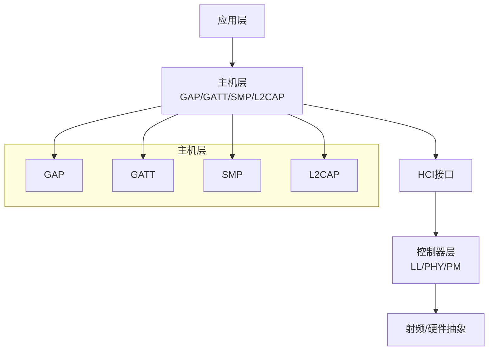
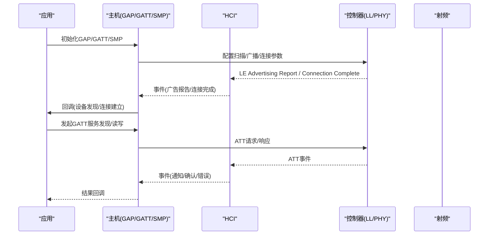
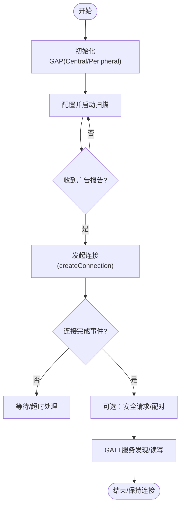
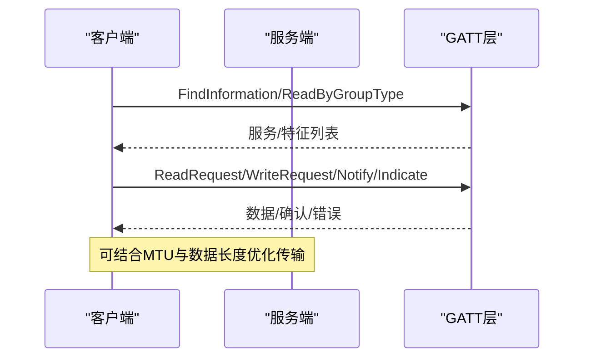
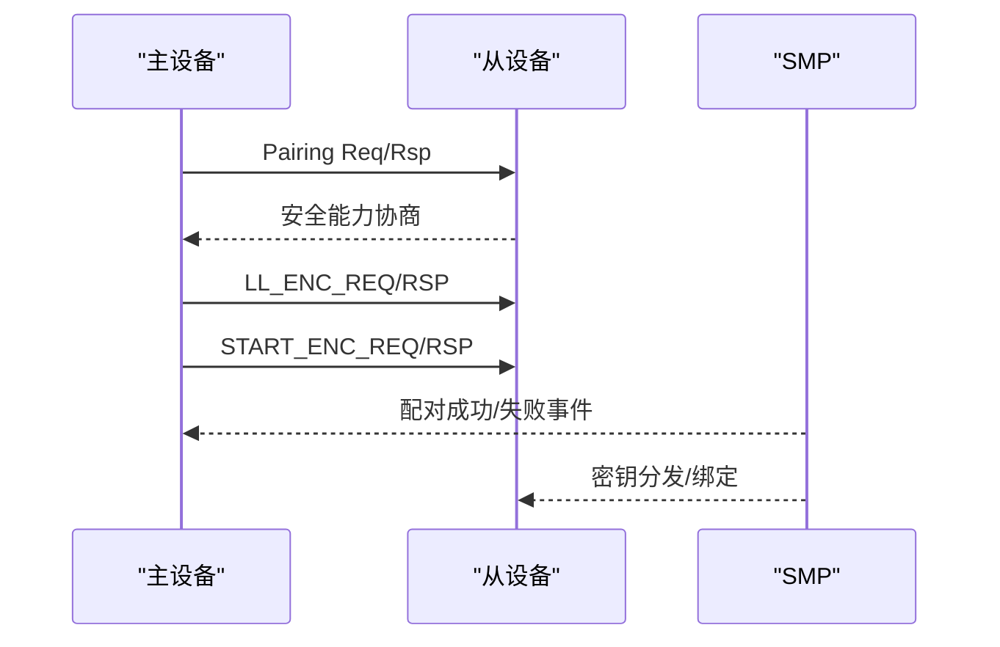
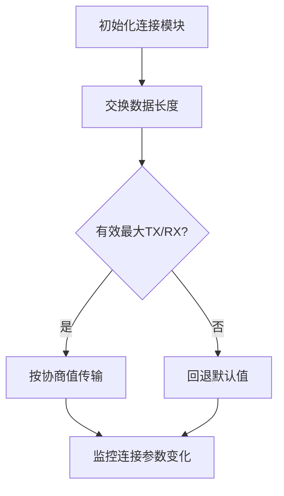
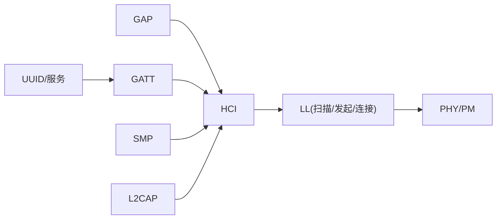

# BLE协议栈

<cite>
**本文引用的文件**
- [ble.h](file://tc_ble_single_sdk/stack/ble/ble.h)
- [ble_host.h](file://tc_ble_single_sdk/stack/ble/host/ble_host.h)
- [ble_controller.h](file://tc_ble_single_sdk/stack/ble/controller/ble_controller.h)
- [gap.h](file://tc_ble_single_sdk/stack/ble/host/gap/gap.h)
- [gap_event.h](file://tc_ble_single_sdk/stack/ble/host/gap/gap_event.h)
- [gatt.h](file://tc_ble_single_sdk/stack/ble/host/attr/gatt.h)
- [uuid.h](file://tc_ble_single_sdk/stack/ble/service/uuid.h)
- [hci_event.h](file://tc_ble_single_sdk/stack/ble/hci/hci_event.h)
- [ll_conn.h](file://tc_ble_single_sdk/stack/ble/controller/ll/ll_conn/ll_conn.h)
- [ll_init.h](file://tc_ble_single_sdk/stack/ble/controller/ll/ll_init.h)
- [ll_scan.h](file://tc_ble_single_sdk/stack/ble/controller/ll/ll_scan.h)
- [smp.h](file://tc_ble_single_sdk/stack/ble/host/smp/smp.h)
</cite>

## 目录
1. [简介](#简介)
2. [项目结构](#项目结构)
3. [核心组件](#核心组件)
4. [架构总览](#架构总览)
5. [详细组件分析](#详细组件分析)
6. [依赖关系分析](#依赖关系分析)
7. [性能与功耗优化](#性能与功耗优化)
8. [故障排查指南](#故障排查指南)
9. [结论](#结论)
10. [附录：开发指南与调试方法](#附录开发指南与调试方法)

## 简介
本技术文档面向基于该SDK的BLE协议栈开发者，围绕GAP（通用访问配置文件）与GATT（通用属性配置文件）的实现细节展开，覆盖设备发现、连接建立、服务发现、特征读写、安全配对、事件处理流程、错误恢复机制，以及数据传输优化与功耗优化策略。文档同时提供BLE数据包格式要点、状态机视图与调试方法，帮助快速定位问题并提升产品稳定性与能效。

## 项目结构
该BLE SDK采用分层设计：控制器层（Controller）、主机层（Host）、HCI接口、服务与特性定义等。关键入口与模块如下：
- 顶层聚合头文件：统一包含控制器与主机相关API
- 主机层：GAP/GATT/SMP/L2CAP/Signaling等协议栈实现
- 控制器层：LL（链路层）扫描、发起、连接管理、PHY、PM等
- HCI层：命令、事件、常量定义
- 服务层：UUID与服务定义（如HID、设备信息、OTA等）

图表来源
- [ble.h:28-44](file://tc_ble_single_sdk/stack/ble/ble.h#L28-L44)
- [ble_host.h:30-44](file://tc_ble_single_sdk/stack/ble/host/ble_host.h#L30-L44)
- [ble_controller.h:32-49](file://tc_ble_single_sdk/stack/ble/controller/ble_controller.h#L32-L49)

章节来源
- [ble.h:28-44](file://tc_ble_single_sdk/stack/ble/ble.h#L28-L44)
- [ble_host.h:30-44](file://tc_ble_single_sdk/stack/ble/host/ble_host.h#L30-L44)
- [ble_controller.h:32-49](file://tc_ble_single_sdk/stack/ble/controller/ble_controller.h#L32-L49)

## 核心组件
- GAP（通用访问配置）：负责广播/扫描、角色初始化、事件分发与安全配对触发
- GATT（通用属性配置）：服务/特征/描述符模型，读/写/通知/指示/批量操作
- SMP（安全管理器）：配对、加密、密钥分发、绑定、OOB、NC、Passkey等
- LL（链路层）：扫描、发起连接、连接参数协商、数据长度交换、PHY切换
- HCI：命令/事件封装，用于上下层交互
- UUID/服务：标准与厂商自定义服务与特征标识

章节来源
- [gap.h:77-114](file://tc_ble_single_sdk/stack/ble/host/gap/gap.h#L77-L114)
- [gatt.h:32-208](file://tc_ble_single_sdk/stack/ble/host/attr/gatt.h#L32-L208)
- [smp.h:63-372](file://tc_ble_single_sdk/stack/ble/host/smp/smp.h#L63-L372)
- [ll_conn.h:28-82](file://tc_ble_single_sdk/stack/ble/controller/ll/ll_conn/ll_conn.h#L28-L82)
- [hci_event.h:31-790](file://tc_ble_single_sdk/stack/ble/hci/hci_event.h#L31-L790)
- [uuid.h:28-118](file://tc_ble_single_sdk/stack/ble/service/uuid.h#L28-L118)

## 架构总览
BLE协议栈在主机与控制器之间通过HCI进行通信；主机侧负责GAP/GATT/SMP等高层协议，控制器侧负责LL与射频资源管理。事件从控制器经HCI上报到主机，再由主机回调至应用或上层协议处理。

图表来源
- [hci_event.h:140-201](file://tc_ble_single_sdk/stack/ble/hci/hci_event.h#L140-L201)
- [gatt.h:32-208](file://tc_ble_single_sdk/stack/ble/host/attr/gatt.h#L32-L208)
- [gap_event.h:130-185](file://tc_ble_single_sdk/stack/ble/host/gap/gap_event.h#L130-L185)

## 详细组件分析

### GAP：设备发现与连接管理
- 角色初始化：支持外设（Peripheral）与中心（Central）初始化
- 广播/扫描：通过控制器LL扫描模块设置扫描参数与使能，接收广告报告事件
- 连接建立：中心侧发起连接，指定扫描间隔/窗口、过滤策略、地址类型、连接参数等
- 事件分发：注册GAP事件处理器，订阅配对、加密、MTU交换、L2CAP COC等事件

图表来源
- [ll_scan.h:31-62](file://tc_ble_single_sdk/stack/ble/controller/ll/ll_scan.h#L31-L62)
- [ll_init.h:29-78](file://tc_ble_single_sdk/stack/ble/controller/ll/ll_init.h#L29-L78)
- [hci_event.h:140-201](file://tc_ble_single_sdk/stack/ble/hci/hci_event.h#L140-L201)
- [gap_event.h:130-185](file://tc_ble_single_sdk/stack/ble/host/gap/gap_event.h#L130-L185)

章节来源
- [gap.h:77-114](file://tc_ble_single_sdk/stack/ble/host/gap/gap.h#L77-L114)
- [ll_scan.h:31-62](file://tc_ble_single_sdk/stack/ble/controller/ll/ll_scan.h#L31-L62)
- [ll_init.h:29-78](file://tc_ble_single_sdk/stack/ble/controller/ll/ll_init.h#L29-L78)
- [hci_event.h:140-201](file://tc_ble_single_sdk/stack/ble/hci/hci_event.h#L140-L201)

### GATT：服务发现与特征读写
- 服务发现：通过Find Information/Read By Group Type等请求遍历服务与特征
- 特征读写：支持Read/Write Command/Write Request/Prepare Write/Execute Write
- 通知/指示：Push Handle Value Notify/Indicate，支持多句柄批量通知
- MTU交换：通过GATT事件获取对端MTU，优化大包传输
- 错误响应：发送ATT错误响应，便于上层定位问题

图表来源
- [gatt.h:32-208](file://tc_ble_single_sdk/stack/ble/host/attr/gatt.h#L32-L208)
- [hci_event.h:245-254](file://tc_ble_single_sdk/stack/ble/hci/hci_event.h#L245-L254)

章节来源
- [gatt.h:32-208](file://tc_ble_single_sdk/stack/ble/host/attr/gatt.h#L32-L208)
- [uuid.h:28-118](file://tc_ble_single_sdk/stack/ble/service/uuid.h#L28-L118)

### SMP：安全配对与密钥管理
- 安全级别与模式：支持无认证加密、认证加密、安全连接等
- 配对方法：传统配对与安全连接（BLE 4.2+），支持OOB、Passkey、NC
- 绑定与重连：支持Bondable模式，快速重连使用已分发LTK
- 事件回调：配对开始/成功/失败、加密完成、安全处理完成、TK显示/输入、按键通知等
- OOB与IRK：支持生成与设置SC OOB数据，本地IRK生成策略

图表来源
- [smp.h:63-372](file://tc_ble_single_sdk/stack/ble/host/smp/smp.h#L63-L372)
- [gap_event.h:30-127](file://tc_ble_single_sdk/stack/ble/host/gap/gap_event.h#L30-L127)

章节来源
- [smp.h:63-372](file://tc_ble_single_sdk/stack/ble/host/smp/smp.h#L63-L372)
- [gap_event.h:30-127](file://tc_ble_single_sdk/stack/ble/host/gap/gap_event.h#L30-L127)

### LL：连接管理与数据长度优化
- 连接句柄：主/从固定句柄简化设计，支持有效性检查
- 数据长度交换：协商最大TX/RX octets与时间，提升吞吐
- 最大MD数量：配置More Data数量，平衡延迟与功耗
- 连接参数：创建连接时指定最小/最大间隔、延迟、超时等

图表来源
- [ll_conn.h:28-82](file://tc_ble_single_sdk/stack/ble/controller/ll/ll_conn/ll_conn.h#L28-L82)
- [hci_event.h:245-254](file://tc_ble_single_sdk/stack/ble/hci/hci_event.h#L245-L254)

章节来源
- [ll_conn.h:28-82](file://tc_ble_single_sdk/stack/ble/controller/ll/ll_conn/ll_conn.h#L28-L82)
- [hci_event.h:245-254](file://tc_ble_single_sdk/stack/ble/hci/hci_event.h#L245-L254)

### HCI事件：连接生命周期与扩展功能
- 连接相关：连接完成、连接更新完成、断开完成、加密变更、数据长度变更
- 广播相关：广告报告、扩展广告报告、周期同步建立/丢失
- PHY与IQ：PHY更新完成、连接/非连接IQ报告
- BIG/CIS：音频流相关的新特性事件

章节来源
- [hci_event.h:94-790](file://tc_ble_single_sdk/stack/ble/hci/hci_event.h#L94-L790)

## 依赖关系分析
- 主机层依赖：GAP/GATT/SMP/L2CAP/Signaling，通过ble_host.h聚合
- 控制器层依赖：LL/PHY/PM/HCI，通过ble_controller.h聚合
- 服务层依赖：UUID与具体服务（HID、设备信息、OTA等）
- 事件驱动：GAP事件与HCI事件共同驱动上层逻辑

图表来源
- [ble_host.h:30-44](file://tc_ble_single_sdk/stack/ble/host/ble_host.h#L30-L44)
- [ble_controller.h:32-49](file://tc_ble_single_sdk/stack/ble/controller/ble_controller.h#L32-L49)
- [uuid.h:28-118](file://tc_ble_single_sdk/stack/ble/service/uuid.h#L28-L118)

章节来源
- [ble_host.h:30-44](file://tc_ble_single_sdk/stack/ble/host/ble_host.h#L30-L44)
- [ble_controller.h:32-49](file://tc_ble_single_sdk/stack/ble/controller/ble_controller.h#L32-L49)
- [uuid.h:28-118](file://tc_ble_single_sdk/stack/ble/service/uuid.h#L28-L118)

## 性能与功耗优化
- 数据长度优化：通过LL数据长度交换提高单次传输字节数，减少包数与唤醒次数
- MTU优化：利用GATT MTU交换结果调整应用层分包大小，避免频繁分片
- 连接参数调优：合理设置连接间隔、延迟与超时，平衡实时性与功耗
- PHY选择：根据距离与速率需求选择合适的PHY（如LE 2M/ coded）
- 广播/扫描占空比：降低扫描窗口与频率以降低功耗
- More Data控制：限制并发MD数量，避免拥塞与额外功耗

章节来源
- [ll_conn.h:53-82](file://tc_ble_single_sdk/stack/ble/controller/ll/ll_conn/ll_conn.h#L53-L82)
- [gatt.h:32-208](file://tc_ble_single_sdk/stack/ble/host/attr/gatt.h#L32-L208)
- [hci_event.h:245-254](file://tc_ble_single_sdk/stack/ble/hci/hci_event.h#L245-L254)

## 故障排查指南
- 配对失败：检查SMP安全级别、IO能力、MITM/OOB配置；查看配对失败原因码
- 连接断开：关注断开完成事件的原因字段，区分超时、加密失败、远程关闭等
- GATT错误：通过ATT错误响应定位句柄与错误码，核对服务/特征UUID与权限
- 数据长度异常：检查数据长度变更事件，确认双方协商一致
- 广播/扫描无响应：确认扫描使能与过滤策略，检查广告报告事件是否到达

章节来源
- [smp.h:40-60](file://tc_ble_single_sdk/stack/ble/host/smp/smp.h#L40-L60)
- [hci_event.h:94-128](file://tc_ble_single_sdk/stack/ble/hci/hci_event.h#L94-L128)
- [gatt.h:175-208](file://tc_ble_single_sdk/stack/ble/host/attr/gatt.h#L175-L208)
- [hci_event.h:245-254](file://tc_ble_single_sdk/stack/ble/hci/hci_event.h#L245-L254)

## 结论
该BLE协议栈以清晰的分层架构提供了完整的GAP/GATT/SMP能力，配合丰富的HCI事件与LL优化接口，能够满足低功耗、高可靠的数据传输需求。通过合理配置扫描/连接参数、数据长度与MTU，并结合SMP安全机制，可实现稳定高效的BLE通信。建议在实际项目中结合场景需求进行参数调优与功耗评估，并利用事件回调与错误响应进行问题定位与恢复。

## 附录：开发指南与调试方法
- 服务开发指南
  - 使用UUID定义服务与特征，遵循标准或自定义规范
  - 通过GATT API实现读/写/通知/指示，注意权限与MTU
  - 使用批量通知与准备写入提升效率
- 调试方法
  - 启用GAP事件掩码，订阅配对、加密、MTU等关键事件
  - 打印HCI事件（连接、数据长度、PHY、IQ等）辅助定位
  - 使用断点与日志记录GATT请求/响应序列
- 性能监控
  - 监控数据长度变更与MTU交换结果
  - 统计连接间隔与延迟变化，评估实时性
  - 观察广播/扫描占空比与RSSI，评估覆盖范围
- 功耗优化技巧
  - 降低扫描窗口与频率，延长休眠时间
  - 增大连接间隔与延迟，减少活跃时间
  - 使用更高效的PHY与数据长度，减少包数
  - 合理配置More Data数量，避免拥塞

章节来源
- [uuid.h:28-118](file://tc_ble_single_sdk/stack/ble/service/uuid.h#L28-L118)
- [gatt.h:32-208](file://tc_ble_single_sdk/stack/ble/host/attr/gatt.h#L32-L208)
- [gap_event.h:130-185](file://tc_ble_single_sdk/stack/ble/host/gap/gap_event.h#L130-L185)
- [hci_event.h:140-201](file://tc_ble_single_sdk/stack/ble/hci/hci_event.h#L140-L201)