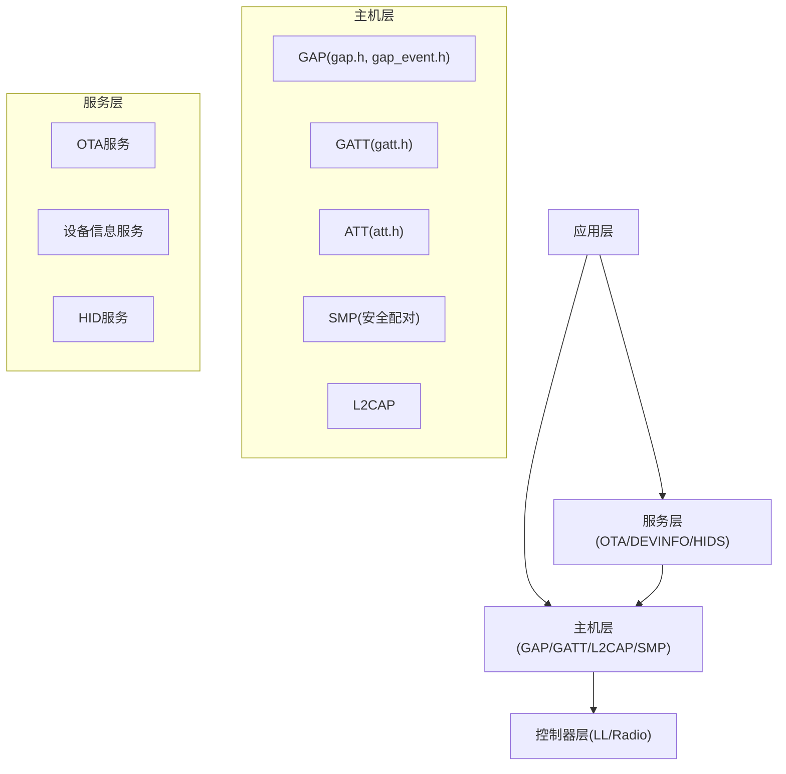
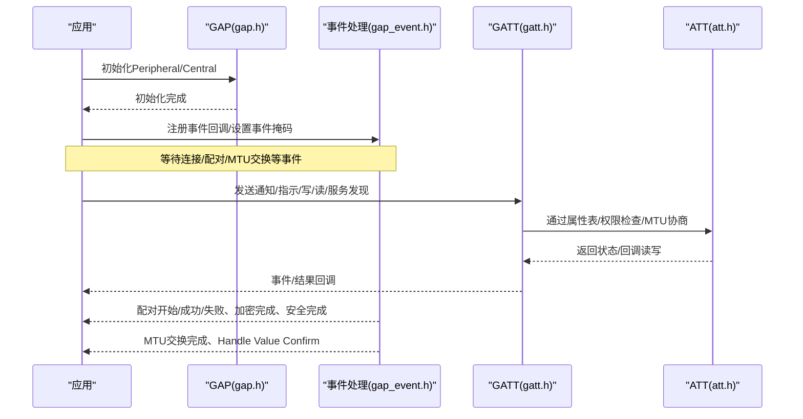
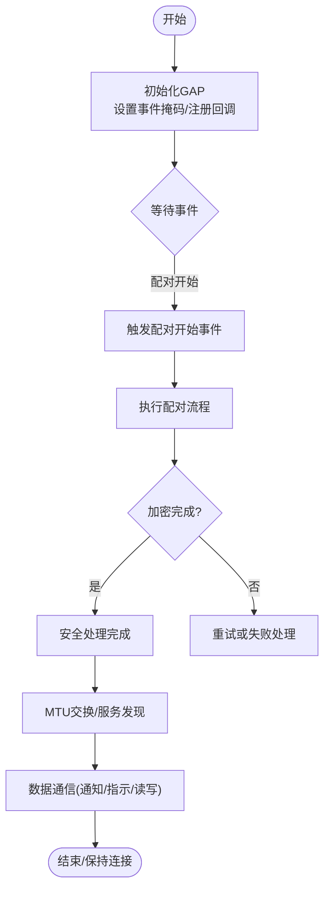
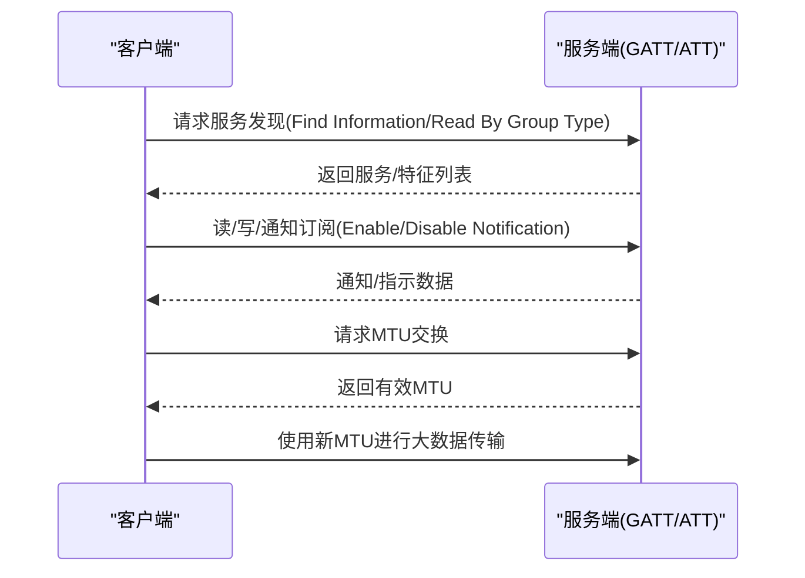
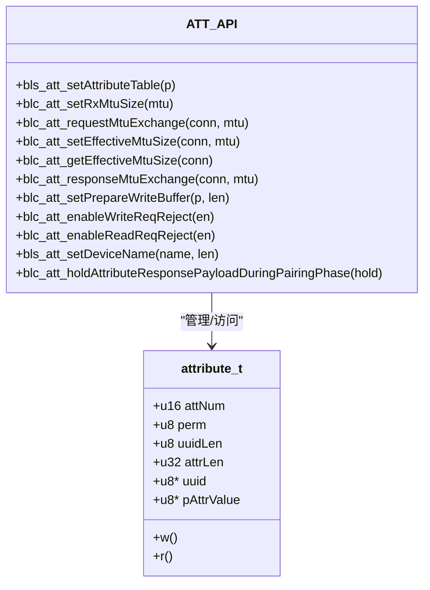
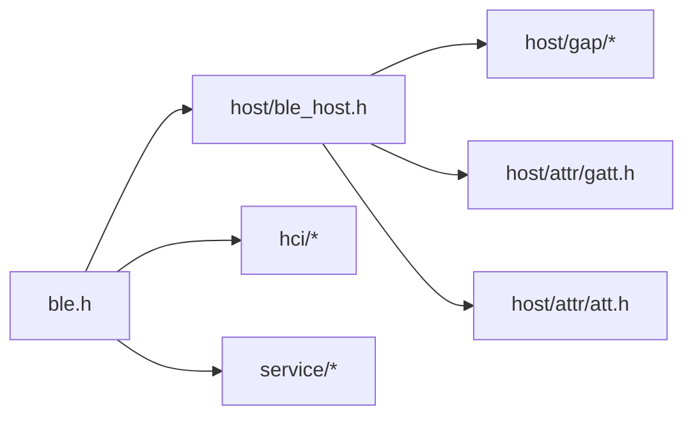

# GAP/GATT服务

<cite>
**本文引用的文件**
- [gap.h](file://tc_ble_single_sdk/stack/ble/host/gap/gap.h)
- [gap_event.h](file://tc_ble_single_sdk/stack/ble/host/gap/gap_event.h)
- [gatt.h](file://tc_ble_single_sdk/stack/ble/host/attr/gatt.h)
- [att.h](file://tc_ble_single_sdk/stack/ble/host/attr/att.h)
- [ble.h](file://tc_ble_single_sdk/stack/ble/ble.h)
</cite>

## 目录
1. [简介](#简介)
2. [项目结构](#项目结构)
3. [核心组件](#核心组件)
4. [架构总览](#架构总览)
5. [详细组件分析](#详细组件分析)
6. [依赖关系分析](#依赖关系分析)
7. [性能考虑](#性能考虑)
8. [故障排查指南](#故障排查指南)
9. [结论](#结论)
10. [附录](#附录)

## 简介
本技术文档围绕BLE协议栈中的GAP（通用访问配置文件）与GATT（通用属性配置文件）实现，面向开发者提供从设备角色、广播与扫描、连接建立到服务发现、特征读写、通知/指示、描述符管理以及属性服务器配置的系统性说明。文档基于SDK中提供的头文件接口进行梳理，并结合典型流程给出时序图与流程图，帮助快速搭建自定义BLE服务并正确集成安全与权限控制。

## 项目结构
本项目在tc_ble_single_sdk/stack/ble下提供了完整的BLE协议栈分层：
- 控制器层（controller）：底层射频与链路层
- 主机层（host）：包含GAP、GATT、L2CAP、SMP等协议栈
- 服务层（service）：内置服务如OTA、设备信息、HID等
- 应用层（application/vendor）：业务逻辑与示例

与GAP/GATT直接相关的核心头文件位于host子目录：
- GAP：gap.h、gap_event.h
- GATT/ATT：gatt.h、att.h
- 顶层聚合入口：ble.h

图表来源
- [ble.h:32-44](file://tc_ble_single_sdk/stack/ble/ble.h#L32-L44)
- [gap.h:77-114](file://tc_ble_single_sdk/stack/ble/host/gap/gap.h#L77-L114)
- [gatt.h:33-208](file://tc_ble_single_sdk/stack/ble/host/attr/gatt.h#L33-L208)
- [att.h:87-140](file://tc_ble_single_sdk/stack/ble/host/attr/att.h#L87-L140)

章节来源
- [ble.h:32-44](file://tc_ble_single_sdk/stack/ble/ble.h#L32-L44)

## 核心组件
- GAP初始化与角色
  - Peripheral初始化：blc_gap_peripheral_init
  - Central初始化：blc_gap_central_init
  - 主机初始化校验：blc_host_checkHostInitialization
- GAP事件处理
  - 事件类型与掩码：配对开始/成功/失败、加密完成、安全处理完成、MTU交换、Handle Value Confirm、L2CAP COC事件等
  - 事件回调注册：blc_gap_registerHostEventHandler
  - 事件掩码设置：blc_gap_setEventMask
- GATT客户端请求与服务端响应
  - 通知/指示：blc_gatt_pushHandleValueNotify / blc_gatt_pushMultiHandleValueNotify / blc_gatt_pushHandleValueIndicate
  - 写操作：无响应写 blc_gatt_pushWriteCommand；有响应写 blc_gatt_pushWriteRequest
  - 读操作：读 blc_gatt_pushReadRequest；分块读 blc_gatt_pushReadBlobRequest；按类型读 blc_gatt_pushReadByTypeRequest；组读 blc_gatt_pushReadByGroupTypeRequest
  - 服务发现：查找信息 blc_gatt_pushFindInformationRequest；按值查找 blc_gatt_pushFindByTypeValueRequest
  - 准备写与执行：blc_gatt_pushPrepareWriteRequest / blc_gatt_pushExecuteWriteRequest
  - 确认与错误：blc_gatt_pushConfirm / blc_gatt_pushErrResponse
- ATT属性表与权限
  - 属性结构体 attribute_t：含句柄、权限、UUID、长度、读写回调
  - 权限位：READ/WRITE/ENCRYPT/AUTHEN/SECURE_CONN等组合
  - 属性表设置：bls_att_setAttributeTable
  - MTU管理：设置RX MTU、请求交换、设置有效MTU、获取有效MTU、响应交换
  - 其他：设备名设置、准备写缓冲、读写拒绝开关、配对阶段响应挂起控制

章节来源
- [gap.h:77-114](file://tc_ble_single_sdk/stack/ble/host/gap/gap.h#L77-L114)
- [gap_event.h:130-364](file://tc_ble_single_sdk/stack/ble/host/gap/gap_event.h#L130-L364)
- [gatt.h:33-208](file://tc_ble_single_sdk/stack/ble/host/attr/gatt.h#L33-L208)
- [att.h:30-140](file://tc_ble_single_sdk/stack/ble/host/attr/att.h#L30-L140)

## 架构总览
下图展示了从应用调用到协议栈的交互路径，涵盖GAP初始化、事件回调、GATT数据收发与ATT属性表访问。

图表来源
- [gap.h:77-114](file://tc_ble_single_sdk/stack/ble/host/gap/gap.h#L77-L114)
- [gap_event.h:130-364](file://tc_ble_single_sdk/stack/ble/host/gap/gap_event.h#L130-L364)
- [gatt.h:33-208](file://tc_ble_single_sdk/stack/ble/host/attr/gatt.h#L33-L208)
- [att.h:87-140](file://tc_ble_single_sdk/stack/ble/host/attr/att.h#L87-L140)

## 详细组件分析

### GAP事件处理与安全流程
- 事件类型覆盖SMP配对各阶段、加密完成、安全处理完成、MTU交换、Handle Value Confirm及L2CAP COC相关事件。
- 通过事件掩码选择需要上报的事件，并统一由公共回调入口分发。
- 典型流程包括标准配对（三阶段：特性交换、加密、密钥分发）与快速连接（仅加密）。

图表来源
- [gap_event.h:130-364](file://tc_ble_single_sdk/stack/ble/host/gap/gap_event.h#L130-L364)

章节来源
- [gap_event.h:130-364](file://tc_ble_single_sdk/stack/ble/host/gap/gap_event.h#L130-L364)

### GATT服务发现与数据传输协议
- 服务发现：支持按组类型读取、查找信息、按值查找等，便于客户端枚举服务与特征。
- 数据传输：
  - 通知：无需确认，适合高频数据推送
  - 指示：需确认，适合可靠传输
  - 写：无响应写与有响应写两种模式
  - 读：普通读与分块读，支持按类型/组类型批量读取
- MTU协商：通过ATT层设置RX MTU、请求交换、设置有效MTU，确保大数据量传输效率。

图表来源
- [gatt.h:33-208](file://tc_ble_single_sdk/stack/ble/host/attr/gatt.h#L33-L208)
- [att.h:146-203](file://tc_ble_single_sdk/stack/ble/host/attr/att.h#L146-L203)

章节来源
- [gatt.h:33-208](file://tc_ble_single_sdk/stack/ble/host/attr/gatt.h#L33-L208)
- [att.h:146-203](file://tc_ble_single_sdk/stack/ble/host/attr/att.h#L146-L203)

### 属性服务器实现与描述符管理
- 属性表：通过attribute_t定义每个属性的句柄、权限、UUID、长度、读写回调。
- 权限控制：支持读/写、加密、认证、安全连接等组合，满足安全策略。
- 描述符：可结合特征描述符（如Client Characteristic Configuration Descriptor）实现通知/指示订阅控制。
- 服务注册：通过bls_att_setAttributeTable将属性表注入协议栈，供客户端发现与访问。
- MTU与缓冲：设置RX MTU、请求交换、设置有效MTU；准备写缓冲用于分片写入。

图表来源
- [att.h:87-140](file://tc_ble_single_sdk/stack/ble/host/attr/att.h#L87-L140)
- [att.h:146-275](file://tc_ble_single_sdk/stack/ble/host/attr/att.h#L146-L275)

章节来源
- [att.h:87-140](file://tc_ble_single_sdk/stack/ble/host/attr/att.h#L87-L140)
- [att.h:146-275](file://tc_ble_single_sdk/stack/ble/host/attr/att.h#L146-L275)

### BLE服务开发指南（自定义服务创建、UUID分配、权限配置）
- 步骤概览
  - 定义属性表：为服务、特征、描述符分别定义attribute_t条目，按句柄升序排列。
  - 设置权限：根据安全需求选择READ/WRITE/ENCRYPT/AUTHEN/SECURE_CONN组合。
  - 注册属性表：调用bls_att_setAttributeTable将表注入协议栈。
  - 配置MTU：设置RX MTU并在连接后请求交换，提升吞吐。
  - 实现读写回调：在attribute_t的r/w回调中处理数据存取与鉴权。
  - 启用通知/指示：通过特征描述符（如CCCD）控制订阅，使用blc_gatt_pushHandleValueNotify/Indicate发送数据。
- UUID分配建议
  - 优先使用标准16位UUID以兼容性好；若需私有扩展，使用128位UUID避免冲突。
  - 在服务内合理组织句柄顺序，便于客户端枚举。
- 权限与安全
  - 对敏感特征开启ENCRYPT/AUTHEN/SECURE_CONN，确保配对与加密后再访问。
  - 利用读写拒绝开关精细控制异常请求。

章节来源
- [att.h:30-140](file://tc_ble_single_sdk/stack/ble/host/attr/att.h#L30-L140)
- [gatt.h:33-208](file://tc_ble_single_sdk/stack/ble/host/attr/gatt.h#L33-L208)

## 依赖关系分析
- 顶层入口ble.h聚合了控制器、主机、HCI、服务层头文件，形成统一的SDK接入点。
- GAP与GATT/ATT之间通过事件与API解耦：GAP负责连接/角色/安全事件，GATT/ATT负责属性数据流与权限。
- 服务层（OTA/设备信息/HID）作为上层模块，复用GATT/ATT能力暴露标准服务。

图表来源
- [ble.h:32-44](file://tc_ble_single_sdk/stack/ble/ble.h#L32-L44)

章节来源
- [ble.h:32-44](file://tc_ble_single_sdk/stack/ble/ble.h#L32-L44)

## 性能考虑
- MTU优化：合理设置RX MTU并在连接后请求交换，减少分片次数，提高带宽利用率。
- 通知/指示选择：高频小数据用通知；需要可靠性时用指示，注意确认开销。
- 服务发现期间阻塞：SDK提供“服务端数据挂起时间”机制，避免在SDP过程中发送通知/指示导致失败；可根据场景调整该时间。
- 准备写缓冲：大文件分片写入时启用准备写缓冲，降低内存碎片与丢包风险。
- 事件掩码最小化：仅订阅必要事件，减少回调负担。

[本节为通用指导，不直接分析具体文件]

## 故障排查指南
- 配对/加密问题
  - 检查是否已注册事件回调并设置事件掩码，关注配对开始/成功/失败、加密完成、安全处理完成事件。
  - 确认权限位是否要求加密/认证，必要时先完成配对再访问敏感特征。
- 服务发现失败
  - 检查是否在SDP期间发送通知/指示，必要时调整“服务端数据挂起时间”。
  - 确认属性表句柄排序与权限配置正确。
- 通知/指示失败
  - 检查订阅描述符是否正确配置，确认客户端已启用通知/指示。
  - 验证有效MTU是否足够承载数据。
- 读写被拒绝
  - 启用读写拒绝开关后，回调返回值将决定拒绝原因；检查权限与安全状态。
  - 使用错误响应API定位具体错误码与出错的属性句柄。

章节来源
- [gap_event.h:130-364](file://tc_ble_single_sdk/stack/ble/host/gap/gap_event.h#L130-L364)
- [att.h:206-275](file://tc_ble_single_sdk/stack/ble/host/attr/att.h#L206-L275)
- [gatt.h:176-208](file://tc_ble_single_sdk/stack/ble/host/attr/gatt.h#L176-L208)

## 结论
本SDK在GAP与GATT层面提供了完整且清晰的API集合，覆盖设备角色初始化、事件驱动的安全流程、丰富的GATT数据操作与ATT属性表管理。通过合理配置权限、MTU与事件掩码，可实现高效可靠的BLE服务。建议在开发中遵循属性表有序、权限最小化、MTU协商与事件最小订阅的原则，以获得最佳稳定性与性能。

[本节为总结，不直接分析具体文件]

## 附录
- 常用API速查
  - GAP初始化：blc_gap_peripheral_init、blc_gap_central_init
  - 事件处理：blc_gap_registerHostEventHandler、blc_gap_setEventMask
  - GATT数据：blc_gatt_pushHandleValueNotify、blc_gatt_pushHandleValueIndicate、blc_gatt_pushWriteCommand、blc_gatt_pushWriteRequest、blc_gatt_pushReadRequest、blc_gatt_pushReadBlobRequest、blc_gatt_pushReadByTypeRequest、blc_gatt_pushReadByGroupTypeRequest
  - 服务发现：blc_gatt_pushFindInformationRequest、blc_gatt_pushFindByTypeValueRequest
  - 准备写与执行：blc_gatt_pushPrepareWriteRequest、blc_gatt_pushExecuteWriteRequest
  - 确认与错误：blc_gatt_pushConfirm、blc_gatt_pushErrResponse
  - ATT属性表与MTU：bls_att_setAttributeTable、blc_att_setRxMtuSize、blc_att_requestMtuSizeExchange、blc_att_setEffectiveMtuSize、blc_att_getEffectiveMtuSize、blc_att_responseMtuSizeExchange
  - 其他：bls_att_setDeviceName、blc_att_setServerDataPendingTime_upon_ClientCmd、blc_att_setPrepareWriteBuffer、blc_att_enableWriteReqReject、blc_att_enableReadReqReject、blc_att_holdAttributeResponsePayloadDuringPairingPhase

章节来源
- [gap.h:77-114](file://tc_ble_single_sdk/stack/ble/host/gap/gap.h#L77-L114)
- [gap_event.h:130-364](file://tc_ble_single_sdk/stack/ble/host/gap/gap_event.h#L130-L364)
- [gatt.h:33-208](file://tc_ble_single_sdk/stack/ble/host/attr/gatt.h#L33-L208)
- [att.h:87-275](file://tc_ble_single_sdk/stack/ble/host/attr/att.h#L87-L275)