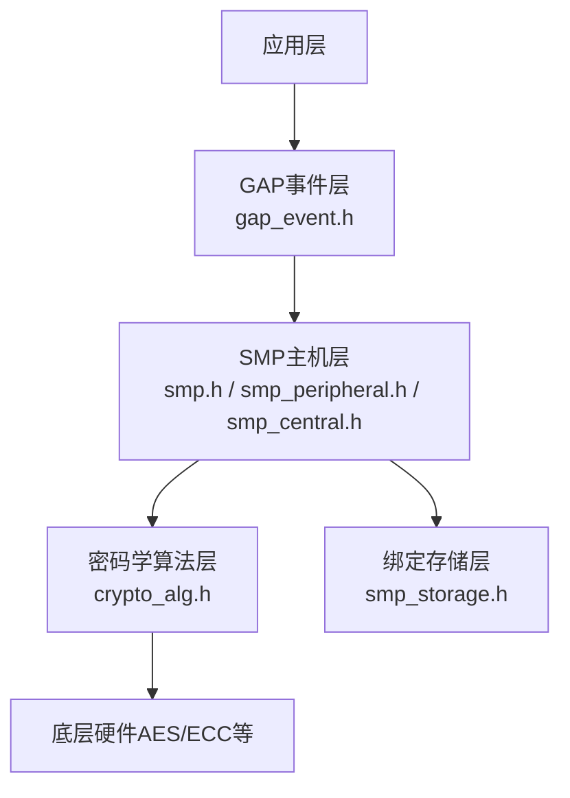
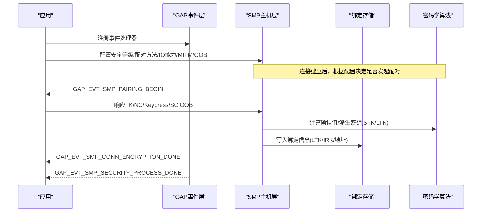
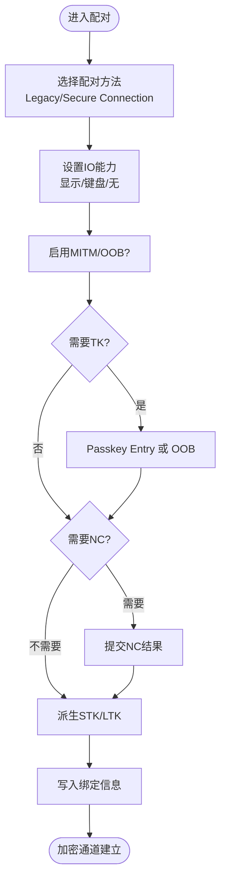
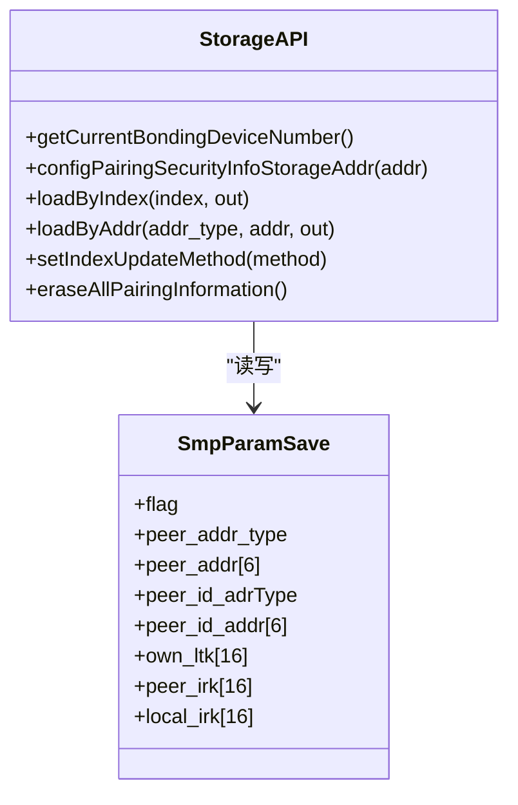
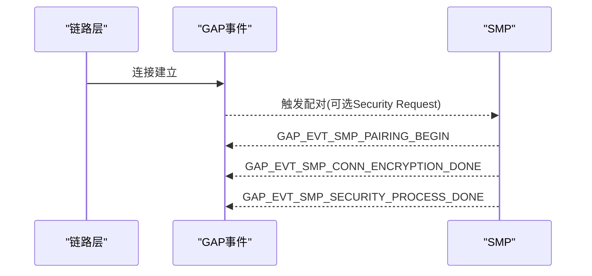
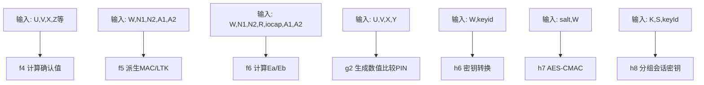
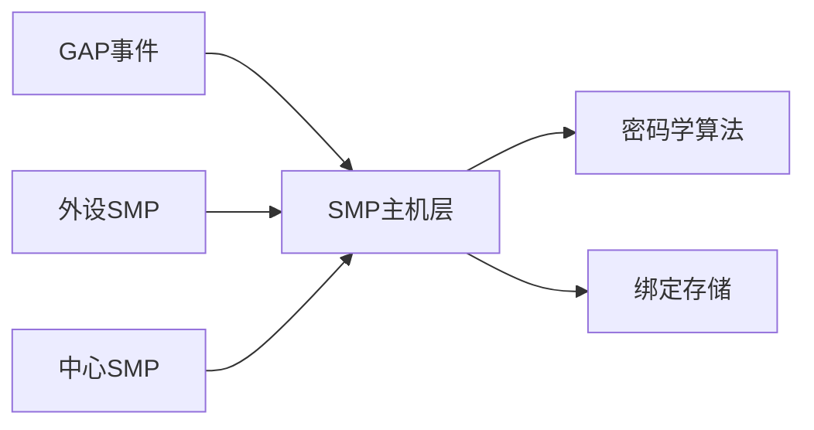

# 安全配对机制

<cite>
**本文引用的文件**
- [smp.h](file://tc_ble_single_sdk/stack/ble/host/smp/smp.h)
- [smp_peripheral.h](file://tc_ble_single_sdk/stack/ble/host/smp/smp_peripheral.h)
- [smp_central.h](file://tc_ble_single_sdk/stack/ble/host/smp/smp_central.h)
- [smp_storage.h](file://tc_ble_single_sdk/stack/ble/host/smp/smp_storage.h)
- [gap_event.h](file://tc_ble_single_sdk/stack/ble/host/gap/gap_event.h)
- [crypto_alg.h](file://tc_ble_single_sdk/algorithm/crypto/crypto_alg.h)
</cite>

## 目录
1. [简介](#简介)
2. [项目结构](#项目结构)
3. [核心组件](#核心组件)
4. [架构总览](#架构总览)
5. [详细组件分析](#详细组件分析)
6. [依赖关系分析](#依赖关系分析)
7. [性能考虑](#性能考虑)
8. [故障排除指南](#故障排除指南)
9. [结论](#结论)
10. [附录](#附录)

## 简介
本技术文档围绕BLE安全配对机制，系统阐述SMP（Simple Pairing）在Telink SDK中的实现与配置方法，覆盖安全等级、配对模式、密钥交换流程、加密通信建立、绑定信息管理、密钥存储与恢复、安全配置指南（IO能力、认证级别、加密强度）、常见安全问题防护、密钥管理与审计方法，以及调试与排障要点。读者可据此完成从基础到进阶的安全集成与优化。

## 项目结构
本项目中与安全配对相关的代码主要位于BLE协议栈的Host层SMP模块及算法库：
- SMP主机侧API与配置：smp.h
- 外设角色SMP初始化与请求控制：smp_peripheral.h
- 中心角色SMP初始化与处理：smp_central.h
- 绑定信息存储接口：smp_storage.h
- GAP事件与配对流程事件：gap_event.h
- 密码学原语与配对算法：crypto_alg.h

**图表来源**
- [smp.h:169-272](file://tc_ble_single_sdk/stack/ble/host/smp/smp.h#L169-L272)
- [smp_peripheral.h:35-67](file://tc_ble_single_sdk/stack/ble/host/smp/smp_peripheral.h#L35-L67)
- [smp_central.h:67-162](file://tc_ble_single_sdk/stack/ble/host/smp/smp_central.h#L67-L162)
- [smp_storage.h:43-181](file://tc_ble_single_sdk/stack/ble/host/smp/smp_storage.h#L43-L181)
- [gap_event.h:132-176](file://tc_ble_single_sdk/stack/ble/host/gap/gap_event.h#L132-L176)
- [crypto_alg.h:28-156](file://tc_ble_single_sdk/algorithm/crypto/crypto_alg.h#L28-L156)

**章节来源**
- [smp.h:169-272](file://tc_ble_single_sdk/stack/ble/host/smp/smp.h#L169-L272)
- [smp_peripheral.h:35-67](file://tc_ble_single_sdk/stack/ble/host/smp/smp_peripheral.h#L35-L67)
- [smp_central.h:67-162](file://tc_ble_single_sdk/stack/ble/host/smp/smp_central.h#L67-L162)
- [smp_storage.h:43-181](file://tc_ble_single_sdk/stack/ble/host/smp/smp_storage.h#L43-L181)
- [gap_event.h:132-176](file://tc_ble_single_sdk/stack/ble/host/gap/gap_event.h#L132-L176)
- [crypto_alg.h:28-156](file://tc_ble_single_sdk/algorithm/crypto/crypto_alg.h#L28-L156)

## 核心组件
- SMP主机配置与交互API：提供安全等级、配对方法、IO能力、MITM/OOB开关、按键输入、NC确认、SC OOB数据生成与设置、本地IRK生成等。
- 外设角色SMP：初始化、Security Request发送策略、最大绑定设备数配置。
- 中心角色SMP：初始化、安全触发、SMP消息处理、配对设备查询与删除、加密状态回调。
- 绑定存储：保存/加载LTK、IRK、对端地址等信息，支持按索引或地址查找、更新策略、批量擦除。
- GAP事件：配对开始/成功/失败、加密完成、安全流程完成、TK显示/请求/数值比较、Keypress通知、SC OOB数据相关事件。
- 密码学算法：c1/s1/f4/g2/f5/f6/h6/h7/h8/prand/ah等，支撑STK/LTK派生、确认值计算、RPA哈希等。

**章节来源**
- [smp.h:169-372](file://tc_ble_single_sdk/stack/ble/host/smp/smp.h#L169-L372)
- [smp_peripheral.h:35-67](file://tc_ble_single_sdk/stack/ble/host/smp/smp_peripheral.h#L35-L67)
- [smp_central.h:67-162](file://tc_ble_single_sdk/stack/ble/host/smp/smp_central.h#L67-L162)
- [smp_storage.h:43-181](file://tc_ble_single_sdk/stack/ble/host/smp/smp_storage.h#L43-L181)
- [gap_event.h:132-176](file://tc_ble_single_sdk/stack/ble/host/gap/gap_event.h#L132-L176)
- [crypto_alg.h:28-156](file://tc_ble_single_sdk/algorithm/crypto/crypto_alg.h#L28-L156)

## 架构总览
SMP在Host层组织，通过GAP事件与应用交互；对外设与中心分别提供初始化与处理入口；绑定信息持久化至Flash；密码学算法由底层驱动或硬件加速。

**图表来源**
- [gap_event.h:132-176](file://tc_ble_single_sdk/stack/ble/host/gap/gap_event.h#L132-L176)
- [smp.h:169-372](file://tc_ble_single_sdk/stack/ble/host/smp/smp.h#L169-L372)
- [smp_storage.h:43-181](file://tc_ble_single_sdk/stack/ble/host/smp/smp_storage.h#L43-L181)
- [crypto_alg.h:28-156](file://tc_ble_single_sdk/algorithm/crypto/crypto_alg.h#L28-L156)

## 详细组件分析

### SMP主机配置与交互（smp.h）
- 安全等级与模式：支持无加密、未认证加密、已认证加密、LE安全连接加密，以及数据签名模式。
- 配对方法：传统配对（Legacy Pairing）与安全连接（Secure Connections）。
- IO能力：显示仅、显示是/否、键盘仅、无输入输出、键盘+显示。
- MITM/OOB/Keypress：可独立启用或禁用，配合Passkey Entry或OOB进行身份验证。
- NC确认：数值比较结果提交。
- SC OOB：生成与设置远程/本地OOB数据，用于安全连接快速配对。
- 本地IRK：支持按设备固定或随机生成策略，并提供生成接口。

**图表来源**
- [smp.h:112-128](file://tc_ble_single_sdk/stack/ble/host/smp/smp.h#L112-L128)
- [smp.h:169-372](file://tc_ble_single_sdk/stack/ble/host/smp/smp.h#L169-L372)

**章节来源**
- [smp.h:112-128](file://tc_ble_single_sdk/stack/ble/host/smp/smp.h#L112-L128)
- [smp.h:169-372](file://tc_ble_single_sdk/stack/ble/host/smp/smp.h#L169-L372)

### 外设角色SMP（smp_peripheral.h）
- 初始化：完成SMP参数与绑定区初始化。
- Security Request策略：新连接/重连时立即或延迟发送，或不发送。
- 手动发送Security Request：主动触发配对。
- 最大绑定设备数：限制可绑定的对端数量。

**章节来源**
- [smp_peripheral.h:35-67](file://tc_ble_single_sdk/stack/ble/host/smp/smp_peripheral.h#L35-L67)

### 中心角色SMP（smp_central.h）
- 初始化：中心侧SMP模块启动。
- 安全触发：配置由主/从触发配对或自动连接加密。
- SMP消息处理：接收并处理来自从设备的SMP报文。
- 绑定管理：搜索/删除从设备绑定信息，获取配对设备数量，按索引加载参数。
- 加密状态回调：监听加密变更事件。

**章节来源**
- [smp_central.h:67-162](file://tc_ble_single_sdk/stack/ble/host/smp/smp_central.h#L67-L162)

### 绑定信息与密钥存储（smp_storage.h）
- 存储结构：包含标志位、对端地址类型与地址、身份地址类型与地址、本地/对端IRK、自身LTK等。
- 索引更新策略：按配对顺序或连接顺序更新索引。
- 查询接口：按索引或地址加载绑定信息。
- 擦除接口：清空所有绑定信息。
- 多本地设备支持：在多本地设备模式下按本地设备索引查询绑定数量与参数。

**图表来源**
- [smp_storage.h:43-181](file://tc_ble_single_sdk/stack/ble/host/smp/smp_storage.h#L43-L181)

**章节来源**
- [smp_storage.h:43-181](file://tc_ble_single_sdk/stack/ble/host/smp/smp_storage.h#L43-L181)

### GAP事件与配对流程（gap_event.h）
- 事件类型：配对开始、配对成功、配对失败、加密完成、安全流程完成。
- TK交互：显示TK、请求Passkey、请求OOB、数值比较、Keypress通知、SC OOB数据发送/请求。
- 事件掩码：允许应用选择性订阅感兴趣的事件。

**图表来源**
- [gap_event.h:132-176](file://tc_ble_single_sdk/stack/ble/host/gap/gap_event.h#L132-L176)

**章节来源**
- [gap_event.h:132-176](file://tc_ble_single_sdk/stack/ble/host/gap/gap_event.h#L132-L176)

### 密码学算法与密钥派生（crypto_alg.h）
- c1：用于传统配对确认值计算。
- s1：传统配对STK派生。
- f4/f6：安全连接阶段确认值计算。
- g2：数值比较阶段派生PIN值。
- f5：LTK与承诺函数所需材料派生。
- h6/h7/h8：密钥转换与分组会话密钥派生。
- prand/ah：RPA随机数与RPA哈希。

**图表来源**
- [crypto_alg.h:28-156](file://tc_ble_single_sdk/algorithm/crypto/crypto_alg.h#L28-L156)

**章节来源**
- [crypto_alg.h:28-156](file://tc_ble_single_sdk/algorithm/crypto/crypto_alg.h#L28-L156)

## 依赖关系分析
- SMP主机层依赖GAP事件进行配对流程编排与应用交互。
- SMP主机层依赖密码学算法完成密钥派生与确认值计算。
- SMP主机层依赖绑定存储进行LTK/IRK等关键信息的持久化。
- 外设/中心角色SMP提供不同角色的初始化与处理入口，统一调用主机层API。

**图表来源**
- [smp.h:169-372](file://tc_ble_single_sdk/stack/ble/host/smp/smp.h#L169-L372)
- [smp_peripheral.h:35-67](file://tc_ble_single_sdk/stack/ble/host/smp/smp_peripheral.h#L35-L67)
- [smp_central.h:67-162](file://tc_ble_single_sdk/stack/ble/host/smp/smp_central.h#L67-L162)
- [smp_storage.h:43-181](file://tc_ble_single_sdk/stack/ble/host/smp/smp_storage.h#L43-L181)
- [gap_event.h:132-176](file://tc_ble_single_sdk/stack/ble/host/gap/gap_event.h#L132-L176)
- [crypto_alg.h:28-156](file://tc_ble_single_sdk/algorithm/crypto/crypto_alg.h#L28-L156)

**章节来源**
- [smp.h:169-372](file://tc_ble_single_sdk/stack/ble/host/smp/smp.h#L169-L372)
- [smp_peripheral.h:35-67](file://tc_ble_single_sdk/stack/ble/host/smp/smp_peripheral.h#L35-L67)
- [smp_central.h:67-162](file://tc_ble_single_sdk/stack/ble/host/smp/smp_central.h#L67-L162)
- [smp_storage.h:43-181](file://tc_ble_single_sdk/stack/ble/host/smp/smp_storage.h#L43-L181)
- [gap_event.h:132-176](file://tc_ble_single_sdk/stack/ble/host/gap/gap_event.h#L132-L176)
- [crypto_alg.h:28-156](file://tc_ble_single_sdk/algorithm/crypto/crypto_alg.h#L28-L156)

## 性能考虑
- 预生成ECDH密钥：可在配对前预先生成公钥/私钥对，减少配对时延。
- 安全请求策略：合理设置新连接与重连时的Security Request发送时机，平衡安全性与连接速度。
- 绑定索引更新策略：按配对顺序或连接顺序更新，影响后续快速重连命中率。
- 算法开销：安全连接涉及更多密码学运算，需评估MCU负载与功耗。

[本节为通用指导，不直接分析具体文件]

## 故障排除指南
- 配对失败原因：参考配对失败原因定义，定位是Passkey输入错误、OOB不可用、认证要求不满足、确认失败、不支持配对、加密密钥长度不足、命令不支持、指定原因、重复尝试、无效参数、DHKey检查失败、数值比较失败、跨传输密钥不允许、超时、连接断开、仅支持NC等。
- 事件监控：订阅配对开始/成功/失败、加密完成、安全流程完成事件，结合TK显示/请求/数值比较事件进行定位。
- 绑定信息校验：通过按索引或地址加载绑定信息，核对LTK/IRK与对端地址是否匹配。
- 安全请求策略：检查外设Security Request发送配置是否正确。
- 调试工具：使用手动设置Pin码接口进行调试（注意非标准用法），或通过Keypress通知观察输入过程。

**章节来源**
- [smp.h:40-60](file://tc_ble_single_sdk/stack/ble/host/smp/smp.h#L40-L60)
- [smp.h:283-342](file://tc_ble_single_sdk/stack/ble/host/smp/smp.h#L283-L342)
- [gap_event.h:132-176](file://tc_ble_single_sdk/stack/ble/host/gap/gap_event.h#L132-L176)
- [smp_storage.h:81-141](file://tc_ble_single_sdk/stack/ble/host/smp/smp_storage.h#L81-L141)
- [smp_peripheral.h:35-67](file://tc_ble_single_sdk/stack/ble/host/smp/smp_peripheral.h#L35-L67)

## 结论
该SDK提供了完整的BLE安全配对能力，涵盖传统配对与安全连接、灵活的IO能力与认证方式、完善的绑定存储与查询、丰富的GAP事件与调试接口。通过合理配置安全等级、配对方法与Security Request策略，可实现兼顾安全与性能的配对体验。建议在生产环境启用安全连接与MITM保护，严格管理绑定信息，并结合事件与日志进行安全审计与问题定位。

[本节为总结性内容，不直接分析具体文件]

## 附录
- 安全配置指南
  - IO能力设置：根据设备能力选择显示/键盘/无输入输出等，影响配对交互方式。
  - 认证级别选择：依据业务需求选择未认证加密或已认证加密，必要时启用安全连接。
  - 加密强度配置：确保双方支持相同的最小加密密钥长度，避免“加密密钥长度不足”导致失败。
  - MITM/OOB：在高风险场景启用MITM或OOB增强认证。
  - 绑定信息管理：定期清理不再使用的绑定信息，限制最大绑定数量，防止资源耗尽。
  - 密钥存储与恢复：确保Flash区域正确配置，支持按索引/地址加载与擦除。
- 常见问题防护
  - 防重放与防中间人：启用安全连接与MITM，避免使用弱口令或固定TK。
  - 防暴力破解：限制配对尝试次数，结合超时与断连策略。
  - 密钥泄露防护：避免将LTK/IRK硬编码，使用安全生成与存储机制。
- 安全审计方法
  - 事件日志：记录配对开始/成功/失败、加密完成、安全流程完成等事件。
  - 绑定审计：定期检查绑定列表，识别异常设备。
  - 算法审计：确保使用SDK提供的密码学原语，避免自行实现易错逻辑。
- 调试与排障
  - 使用手动设置Pin码接口进行调试（仅限开发阶段）。
  - 通过Keypress通知观察输入过程，辅助定位交互问题。
  - 检查Security Request策略与配对方法配置是否一致。

[本节为通用指导，不直接分析具体文件]