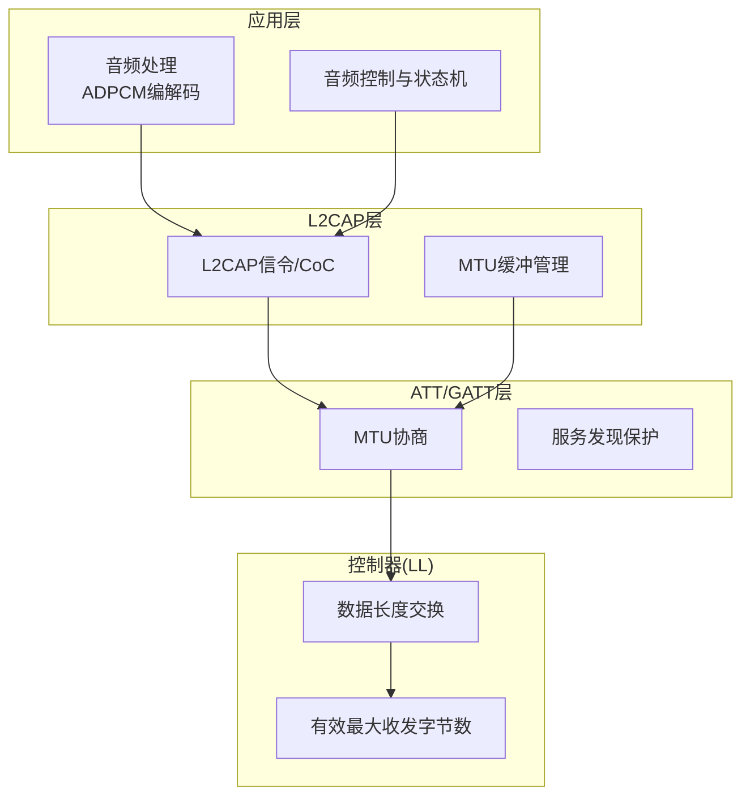
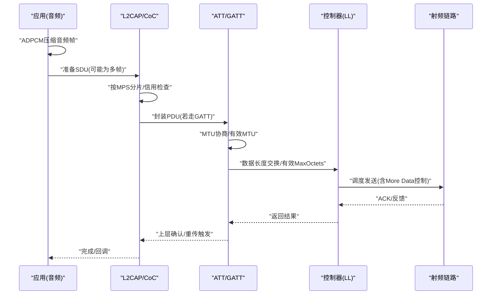
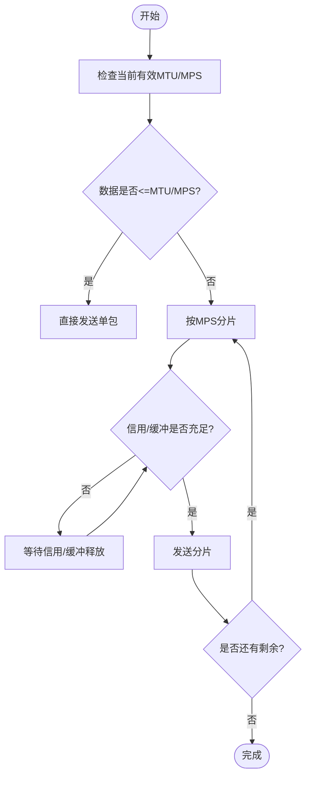
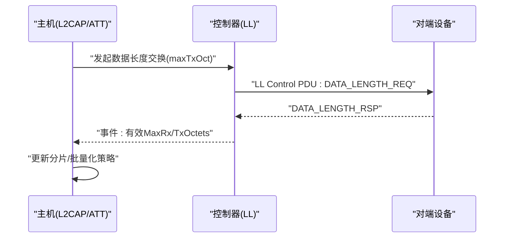
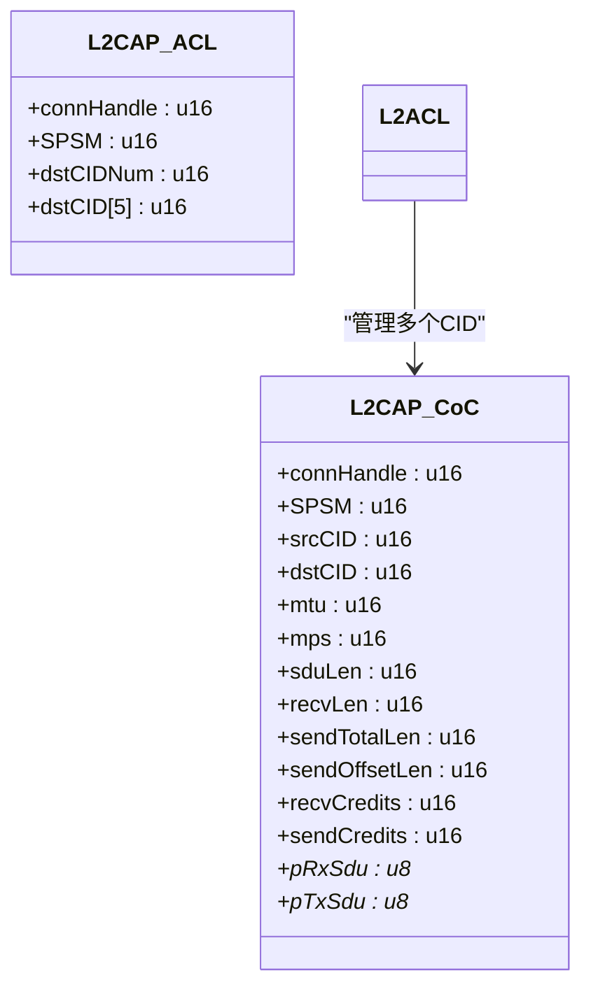
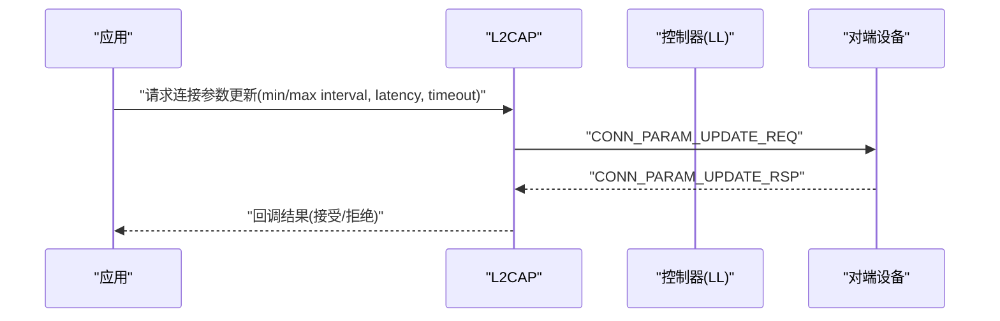
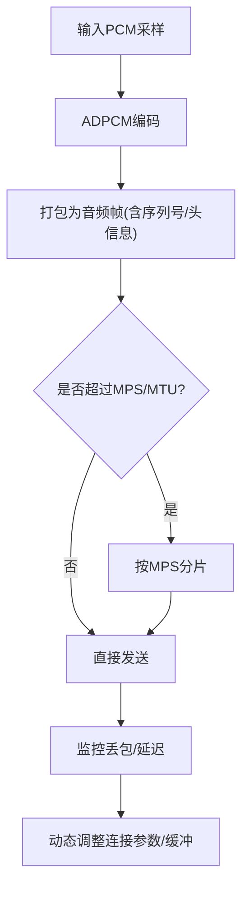

# 数据传输优化

<cite>
**本文引用的文件**
- [att.h](file://tc_ble_single_sdk/stack/ble/host/attr/att.h)
- [l2cap.h](file://tc_ble_single_sdk/stack/ble/host/l2cap/l2cap.h)
- [ll_conn.h](file://tc_ble_single_sdk/stack/ble/controller/ll/ll_conn/ll_conn.h)
- [controller.h](file://tc_ble_single_sdk/stack/ble/controller/controller.h)
- [signaling.h](file://tc_ble_single_sdk/stack/ble/host/signaling/signaling.h)
- [hci_cmd.h](file://tc_ble_single_sdk/stack/ble/hci/hci_cmd.h)
- [adpcm.h](file://tc_ble_single_sdk/application/audio/adpcm.h)
- [adpcm.c](file://tc_ble_single_sdk/application/audio/adpcm.c)
- [gl_audio.h](file://tc_ble_single_sdk/application/audio/gl_audio.h)
</cite>

## 目录
1. [简介](#简介)
2. [项目结构](#项目结构)
3. [核心组件](#核心组件)
4. [架构总览](#架构总览)
5. [详细组件分析](#详细组件分析)
6. [依赖关系分析](#依赖关系分析)
7. [性能考虑](#性能考虑)
8. [故障排查指南](#故障排查指南)
9. [结论](#结论)
10. [附录](#附录)

## 简介
本技术文档围绕BLE数据传输优化，系统阐述数据包格式、MTU协商与数据分片传输机制；深入说明传输层优化策略（连接参数更新、数据长度交换、L2CAP CoC信用流控）、流量控制与拥塞避免；结合音频场景的数据压缩（ADPCM）、批量传输与实时传输策略；给出包大小优化、速率配置与延迟控制的调优指南；并提供监控指标、错误检测与重传机制建议，以及性能测试方法与瓶颈定位工具。

## 项目结构
本项目在BLE协议栈与应用层之间形成清晰分层：
- 控制器层（LL）：负责链路层连接、数据长度交换、有效最大收发字节数查询等。
- L2CAP层：提供信令通道、CoC（基于信用的连接）及大MTU缓冲管理。
- ATT/GATT层：实现属性协议、MTU协商、服务发现期间的数据发送保护。
- 应用层（音频）：实现ADPCM编解码、音频帧打包与传输控制。

图表来源
- [l2cap.h:29-33](file://tc_ble_single_sdk/stack/ble/host/l2cap/l2cap.h#L29-L33)
- [att.h:147-203](file://tc_ble_single_sdk/stack/ble/host/attr/att.h#L147-L203)
- [ll_conn.h:53-82](file://tc_ble_single_sdk/stack/ble/controller/ll/ll_conn/ll_conn.h#L53-L82)

章节来源
- [l2cap.h:29-33](file://tc_ble_single_sdk/stack/ble/host/l2cap/l2cap.h#L29-L33)
- [att.h:147-203](file://tc_ble_single_sdk/stack/ble/host/attr/att.h#L147-L203)
- [ll_conn.h:53-82](file://tc_ble_single_sdk/stack/ble/controller/ll/ll_conn/ll_conn.h#L53-L82)

## 核心组件
- MTU协商与缓冲管理
  - 支持设置接收MTU、发起/响应MTU交换、获取有效MTU，以及为大MTU注册自定义缓冲。
- 数据长度交换与链路容量
  - 通过LL层进行数据长度交换，查询有效最大TX/RX Octets，并限制More Data数量。
- L2CAP CoC与信用流控
  - 提供基于信用的CoC通道创建、配置与数据发送，内置MPS/MTU约束与缓冲区计算。
- 连接参数更新
  - 支持请求连接间隔、时延、超时等参数更新，以平衡延迟与功耗。
- 音频压缩与实时传输
  - ADPCM编解码用于降低带宽占用；音频模块定义超时与标志位，支撑实时流式传输。

章节来源
- [att.h:147-203](file://tc_ble_single_sdk/stack/ble/host/attr/att.h#L147-L203)
- [l2cap.h:122-132](file://tc_ble_single_sdk/stack/ble/host/l2cap/l2cap.h#L122-L132)
- [ll_conn.h:53-82](file://tc_ble_single_sdk/stack/ble/controller/ll/ll_conn/ll_conn.h#L53-L82)
- [signaling.h:43-143](file://tc_ble_single_sdk/stack/ble/host/signaling/signaling.h#L43-L143)
- [hci_cmd.h:471-534](file://tc_ble_single_sdk/stack/ble/hci/hci_cmd.h#L471-L534)
- [adpcm.h:27-44](file://tc_ble_single_sdk/application/audio/adpcm.h#L27-L44)
- [gl_audio.h:35-63](file://tc_ble_single_sdk/application/audio/gl_audio.h#L35-L63)

## 架构总览
下图展示从应用音频到LL层的完整数据路径，包括压缩、分片、MTU协商、数据长度交换与信用流控。

图表来源
- [att.h:147-203](file://tc_ble_single_sdk/stack/ble/host/attr/att.h#L147-L203)
- [ll_conn.h:53-82](file://tc_ble_single_sdk/stack/ble/controller/ll/ll_conn/ll_conn.h#L53-L82)
- [signaling.h:43-143](file://tc_ble_single_sdk/stack/ble/host/signaling/signaling.h#L43-L143)
- [l2cap.h:122-132](file://tc_ble_single_sdk/stack/ble/host/l2cap/l2cap.h#L122-L132)

## 详细组件分析

### MTU协商与数据分片传输
- 关键能力
  - 设置接收MTU、发起/响应MTU交换、获取有效MTU。
  - 默认SDK缓冲支持最大MTU为250，超过需注册自定义缓冲。
- 分片策略
  - 当应用数据大于MTU或MPS时，由L2CAP/ATT按MPS切分，配合More Data机制逐步发送。
- 服务发现保护
  - 在服务发现期间，可阻塞服务器数据发送以避免冲突。

图表来源
- [att.h:147-203](file://tc_ble_single_sdk/stack/ble/host/attr/att.h#L147-L203)
- [l2cap.h:29-33](file://tc_ble_single_sdk/stack/ble/host/l2cap/l2cap.h#L29-L33)
- [signaling.h:43-143](file://tc_ble_single_sdk/stack/ble/host/signaling/signaling.h#L43-L143)

章节来源
- [att.h:147-203](file://tc_ble_single_sdk/stack/ble/host/attr/att.h#L147-L203)
- [l2cap.h:29-33](file://tc_ble_single_sdk/stack/ble/host/l2cap/l2cap.h#L29-L33)
- [signaling.h:43-143](file://tc_ble_single_sdk/stack/ble/host/signaling/signaling.h#L43-L143)

### 数据长度交换与链路容量
- 数据长度交换
  - 通过LL接口发起数据长度交换，协商双方最大TX/RX Octets，提升单次传输效率。
- 有效容量查询
  - 查询有效最大TX/RX Octets，指导上层分片与批量化策略。
- More Data限制
  - 初始化最大More Data数量，避免对端缓冲溢出。

图表来源
- [ll_conn.h:53-82](file://tc_ble_single_sdk/stack/ble/controller/ll/ll_conn/ll_conn.h#L53-L82)
- [controller.h:98-108](file://tc_ble_single_sdk/stack/ble/controller/controller.h#L98-L108)

章节来源
- [ll_conn.h:53-82](file://tc_ble_single_sdk/stack/ble/controller/ll/ll_conn/ll_conn.h#L53-L82)
- [controller.h:98-108](file://tc_ble_single_sdk/stack/ble/controller/controller.h#L98-L108)

### L2CAP CoC与信用流控
- 信用模型
  - 每个CID维护recv/send Credits，按MPS分片发送，收到Credit Ind后恢复发送。
- 缓冲与内存
  - 提供CoC模块缓冲大小宏，依据连接数、CID数与MTU计算所需内存。
- 创建与发送
  - 支持创建LE信用连接与通用信用连接，发送数据使用统一API。

图表来源
- [signaling.h:43-143](file://tc_ble_single_sdk/stack/ble/host/signaling/signaling.h#L43-L143)

章节来源
- [signaling.h:43-143](file://tc_ble_single_sdk/stack/ble/host/signaling/signaling.h#L43-L143)

### 连接参数更新与延迟控制
- 连接参数
  - 支持请求最小/最大连接间隔、时延、超时，影响端到端延迟与吞吐。
- 最小更新时机
  - 连接建立后可设置最小时间再发起参数更新，避免刚连接即频繁更新。
- 典型间隔枚举
  - 提供多种连接间隔枚举值，便于选择低延迟或低功耗配置。

图表来源
- [l2cap.h:53-69](file://tc_ble_single_sdk/stack/ble/host/l2cap/l2cap.h#L53-L69)
- [hci_cmd.h:471-534](file://tc_ble_single_sdk/stack/ble/hci/hci_cmd.h#L471-L534)

章节来源
- [l2cap.h:53-69](file://tc_ble_single_sdk/stack/ble/host/l2cap/l2cap.h#L53-L69)
- [hci_cmd.h:471-534](file://tc_ble_single_sdk/stack/ble/hci/hci_cmd.h#L471-L534)

### 音频压缩与实时传输策略
- 压缩算法
  - 采用ADPCM将PCM采样压缩为更小的码流，显著降低带宽占用。
- 实时缓冲与同步
  - 音频模块包含超时、标志位与缓冲指针管理，确保实时性与稳定性。
- 传输适配
  - 根据MTU/MPS对压缩后的音频帧进行分片与批量发送，必要时调整连接间隔以降低延迟。

图表来源
- [adpcm.h:27-44](file://tc_ble_single_sdk/application/audio/adpcm.h#L27-L44)
- [adpcm.c:29-488](file://tc_ble_single_sdk/application/audio/adpcm.c#L29-L488)
- [gl_audio.h:35-63](file://tc_ble_single_sdk/application/audio/gl_audio.h#L35-L63)

章节来源
- [adpcm.h:27-44](file://tc_ble_single_sdk/application/audio/adpcm.h#L27-L44)
- [adpcm.c:29-488](file://tc_ble_single_sdk/application/audio/adpcm.c#L29-L488)
- [gl_audio.h:35-63](file://tc_ble_single_sdk/application/audio/gl_audio.h#L35-L63)

## 依赖关系分析
- 应用层依赖L2CAP/CoC进行高吞吐传输，依赖ATT进行MTU协商与服务发现保护。
- L2CAP依赖LL的数据长度交换与有效容量查询，以决定分片与批量化策略。
- 控制器层暴露事件与查询接口，供上层动态调整传输策略。

图表来源
- [l2cap.h:29-33](file://tc_ble_single_sdk/stack/ble/host/l2cap/l2cap.h#L29-L33)
- [att.h:147-203](file://tc_ble_single_sdk/stack/ble/host/attr/att.h#L147-L203)
- [ll_conn.h:53-82](file://tc_ble_single_sdk/stack/ble/controller/ll/ll_conn/ll_conn.h#L53-L82)

章节来源
- [l2cap.h:29-33](file://tc_ble_single_sdk/stack/ble/host/l2cap/l2cap.h#L29-L33)
- [att.h:147-203](file://tc_ble_single_sdk/stack/ble/host/attr/att.h#L147-L203)
- [ll_conn.h:53-82](file://tc_ble_single_sdk/stack/ble/controller/ll/ll_conn/ll_conn.h#L53-L82)

## 性能考虑
- 包大小优化
  - 优先启用数据长度交换以获得更大的有效MaxOctets；合理设置MTU与MPS，减少头部开销与分片次数。
  - 对于大对象传输，优先使用L2CAP CoC的信用流控，避免ATT队列拥塞。
- 传输速率配置
  - 根据业务需求选择合适的连接间隔：低延迟场景选择较小间隔（如7.5ms~15ms），低功耗场景选择较大间隔。
  - 连接建立后延迟一段时间再发起参数更新，避免刚连接时的抖动。
- 延迟控制
  - 利用More Data与信用机制平滑突发流量；在服务发现期间暂停服务器数据发送，防止干扰。
- 批量化与实时性
  - 音频数据采用ADPCM压缩后再分片；对实时流，适当提高连接频率并监控丢包率，必要时动态回退压缩比或降低采样率。

## 故障排查指南
- 常见问题
  - 服务发现期间发送失败：检查是否启用了“客户端命令触发时的服务器数据挂起”机制，必要时调整挂起时间。
  - 大MTU传输失败：确认已注册足够大小的L2CAP缓冲，且MTU不超过设备能力。
  - 连接不稳定：检查连接间隔与时延配置，评估环境干扰；必要时增大时延或降低速率。
- 错误检测与重传
  - 依赖LL层的ACK与More Data机制进行可靠传输；若出现丢包，可通过上层序列号与超时检测触发重传。
  - 使用CoC的信用模型避免对端缓冲溢出导致的丢包。
- 监控指标
  - 统计发送/接收包数、分片次数、信用耗尽次数、连接参数更新结果、丢包率与端到端延迟。
  - 针对音频场景，记录压缩前后数据量、帧丢失与抖动。

章节来源
- [att.h:205-231](file://tc_ble_single_sdk/stack/ble/host/attr/att.h#L205-L231)
- [l2cap.h:122-132](file://tc_ble_single_sdk/stack/ble/host/l2cap/l2cap.h#L122-L132)
- [signaling.h:43-143](file://tc_ble_single_sdk/stack/ble/host/signaling/signaling.h#L43-L143)
- [ll_conn.h:53-82](file://tc_ble_single_sdk/stack/ble/controller/ll/ll_conn/ll_conn.h#L53-L82)

## 结论
通过在LL层进行数据长度交换、在L2CAP层采用CoC信用流控、在ATT层进行MTU协商与服务发现保护，并结合ADPCM压缩与合理的连接参数配置，可在BLE链路上实现高效、稳定、低延迟的大数据量与实时音频传输。实际部署中应持续监控关键指标，动态调整参数以应对环境变化与负载波动。

## 附录
- 术语
  - MTU：最大传输单元；MPS：L2CAP最大PDU载荷；CoC：基于信用的连接；LL：链路层。
- 参考实践
  - 先完成数据长度交换与MTU协商，再开启大对象传输；音频流优先压缩后分片，结合信用流控与连接参数更新达到最佳平衡。