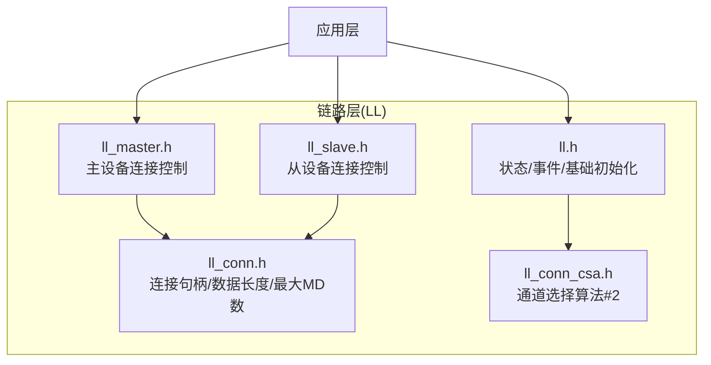
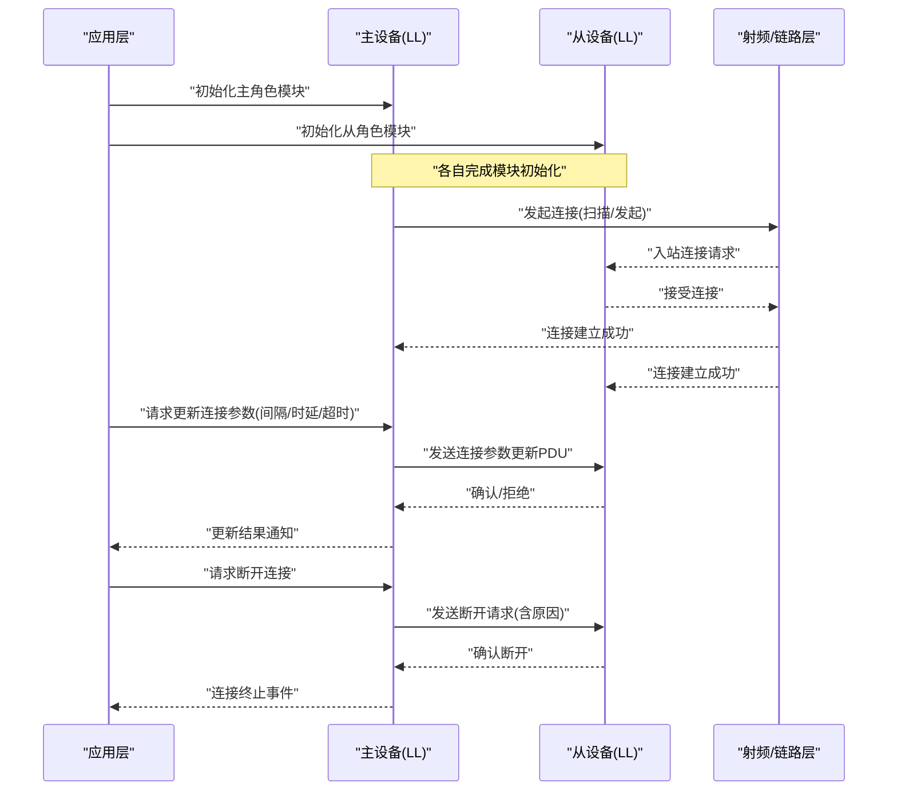
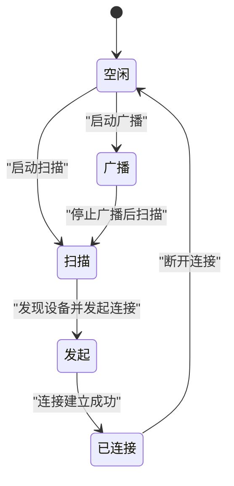
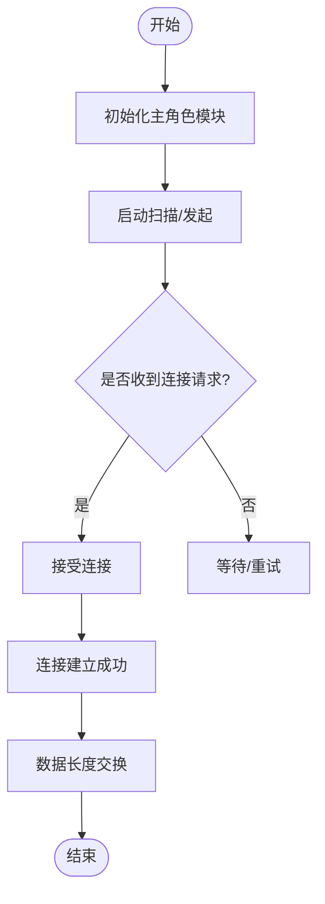
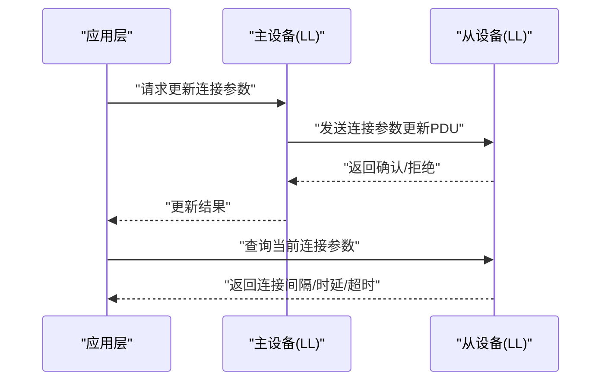
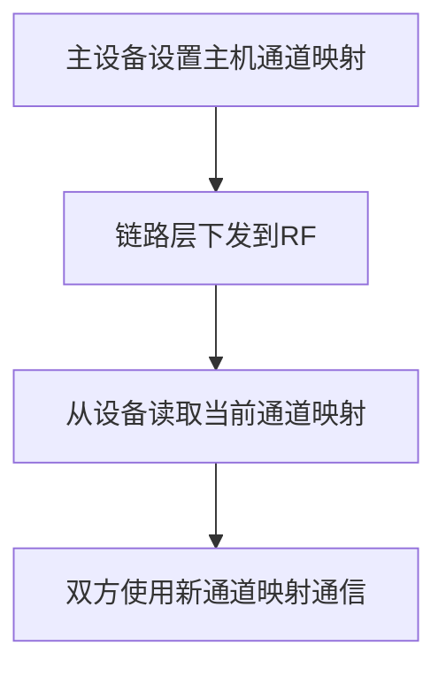
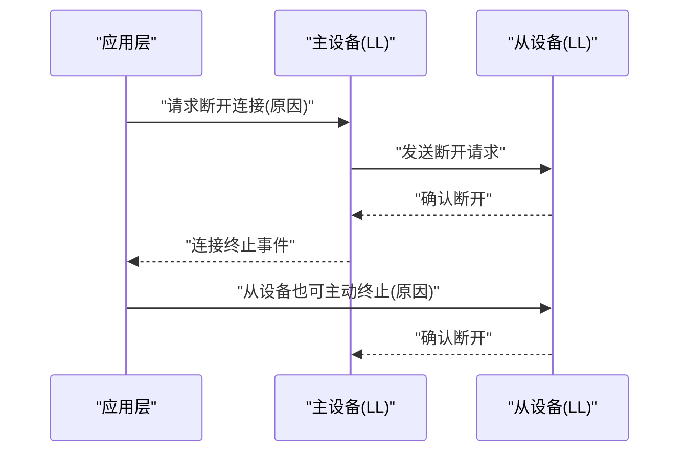
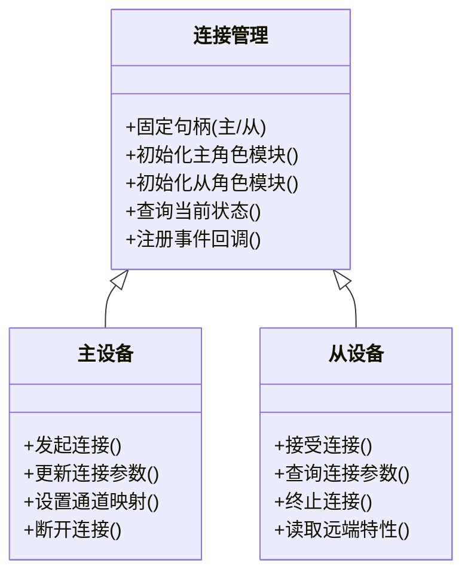
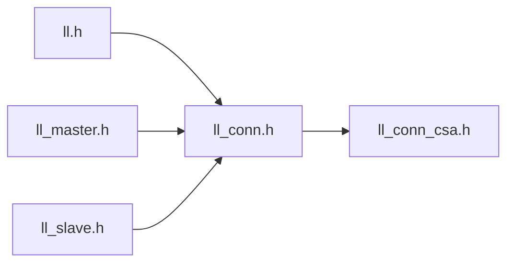

# 连接管理

<cite>
**本文引用的文件**
- [ll_conn.h](file://tc_ble_single_sdk/stack/ble/controller/ll/ll_conn/ll_conn.h)
- [ll_master.h](file://tc_ble_single_sdk/stack/ble/controller/ll/ll_conn/ll_master.h)
- [ll_slave.h](file://tc_ble_single_sdk/stack/ble/controller/ll/ll_conn/ll_slave.h)
- [ll_conn_csa.h](file://tc_ble_single_sdk/stack/ble/controller/ll/ll_conn/ll_conn_csa.h)
- [ll.h](file://tc_ble_single_sdk/stack/ble/controller/ll/ll.h)
</cite>

## 目录
1. [简介](#简介)
2. [项目结构](#项目结构)
3. [核心组件](#核心组件)
4. [架构总览](#架构总览)
5. [详细组件分析](#详细组件分析)
6. [依赖关系分析](#依赖关系分析)
7. [性能考虑](#性能考虑)
8. [故障诊断指南](#故障诊断指南)
9. [结论](#结论)
10. [附录：API参考](#附录api参考)

## 简介
本技术文档聚焦于BLE连接管理系统，围绕连接状态机、连接建立流程、连接参数协商机制展开，覆盖主从角色切换、连接更新与终止过程。同时提供连接参数优化建议（连接间隔调整、超时处理、重连策略）、多连接管理与冲突解决思路，以及连接性能调优与故障诊断方法。文档基于SDK中链路层（LL）相关头文件进行梳理，确保内容与实际接口一致。

## 项目结构
本项目在链路层（Link Layer）模块下提供了连接管理相关的核心接口，主要分布在以下文件：
- 通用连接模块接口：定义连接句柄常量、初始化与数据长度交换等能力
- 主设备（Master）侧接口：提供连接初始化、断开、参数更新、通道映射设置、远端特性读取等
- 从设备（Slave）侧接口：提供连接初始化、断开、连接参数查询、版本读取、事件掩码设置、BRX事件控制等
- 通道选择算法（CSA#2）初始化接口
- 链路层通用接口：包括状态获取、中断处理入口、基本MCU初始化、随机地址设置、RSSI读取、事件回调注册等

图表来源
- [ll.h:31-105](file://tc_ble_single_sdk/stack/ble/controller/ll/ll.h#L31-L105)
- [ll_conn.h:28-82](file://tc_ble_single_sdk/stack/ble/controller/ll/ll_conn/ll_conn.h#L28-L82)
- [ll_master.h:30-101](file://tc_ble_single_sdk/stack/ble/controller/ll/ll_conn/ll_master.h#L30-L101)
- [ll_slave.h:34-167](file://tc_ble_single_sdk/stack/ble/controller/ll/ll_conn/ll_slave.h#L34-L167)
- [ll_conn_csa.h:30-35](file://tc_ble_single_sdk/stack/ble/controller/ll/ll_conn/ll_conn_csa.h#L30-L35)

章节来源
- [ll.h:31-105](file://tc_ble_single_sdk/stack/ble/controller/ll/ll.h#L31-L105)
- [ll_conn.h:28-82](file://tc_ble_single_sdk/stack/ble/controller/ll/ll_conn/ll_conn.h#L28-L82)
- [ll_master.h:30-101](file://tc_ble_single_sdk/stack/ble/controller/ll/ll_conn/ll_master.h#L30-L101)
- [ll_slave.h:34-167](file://tc_ble_single_sdk/stack/ble/controller/ll/ll_conn/ll_slave.h#L34-L167)
- [ll_conn_csa.h:30-35](file://tc_ble_single_sdk/stack/ble/controller/ll/ll_conn/ll_conn_csa.h#L30-L35)

## 核心组件
- 连接句柄与有效性校验：定义了主/从固定连接句柄常量及无效句柄判断，便于单连接场景简化开发
- 连接模块初始化：主/从分别提供初始化入口，用户需在对应角色启动前调用
- 连接参数协商：主设备发起连接参数更新（最小/最大连接间隔、时延、超时），从设备可查询当前参数
- 连接终止：主/从均可发起断开流程，并携带原因码
- 通道映射与特性读取：主设备可设置主机通道映射；主/从均可读取远端特性或版本信息
- 链路层状态与事件：提供状态查询、事件回调注册、RF忙检测、RSSI读取等

章节来源
- [ll_conn.h:28-82](file://tc_ble_single_sdk/stack/ble/controller/ll/ll_conn/ll_conn.h#L28-L82)
- [ll_master.h:30-101](file://tc_ble_single_sdk/stack/ble/controller/ll/ll_conn/ll_master.h#L30-L101)
- [ll_slave.h:34-167](file://tc_ble_single_sdk/stack/ble/controller/ll/ll_conn/ll_slave.h#L34-L167)
- [ll.h:31-105](file://tc_ble_single_sdk/stack/ble/controller/ll/ll.h#L31-L105)

## 架构总览
下图展示了主从设备在连接生命周期中的关键交互，包括连接建立、参数协商、连接更新与终止。

图表来源
- [ll_master.h:30-101](file://tc_ble_single_sdk/stack/ble/controller/ll/ll_conn/ll_master.h#L30-L101)
- [ll_slave.h:34-167](file://tc_ble_single_sdk/stack/ble/controller/ll/ll_conn/ll_slave.h#L34-L167)
- [ll.h:31-105](file://tc_ble_single_sdk/stack/ble/controller/ll/ll.h#L31-L105)

## 详细组件分析

### 连接状态机
- 状态集合：空闲、广播、扫描、发起、已连接（主/从）
- 状态查询：通过链路层接口获取当前状态，用于上层决策
- 事件回调：注册链路层事件回调，处理连接建立、断开、参数更新等事件
- RF忙检测：在主设备发起操作前检查RF状态，避免冲突

图表来源
- [ll.h:31-105](file://tc_ble_single_sdk/stack/ble/controller/ll/ll.h#L31-L105)

章节来源
- [ll.h:31-105](file://tc_ble_single_sdk/stack/ble/controller/ll/ll.h#L31-L105)

### 连接建立流程
- 主设备：初始化主角色模块，执行扫描/发起流程，等待连接建立
- 从设备：初始化从角色模块，响应连接请求，进入连接状态
- 连接成功后，双方可进行数据长度交换、特性读取等操作

图表来源
- [ll_master.h:30-101](file://tc_ble_single_sdk/stack/ble/controller/ll/ll_conn/ll_master.h#L30-L101)
- [ll_slave.h:34-167](file://tc_ble_single_sdk/stack/ble/controller/ll/ll_conn/ll_slave.h#L34-L167)
- [ll_conn.h:44-82](file://tc_ble_single_sdk/stack/ble/controller/ll/ll_conn/ll_conn.h#L44-L82)

章节来源
- [ll_master.h:30-101](file://tc_ble_single_sdk/stack/ble/controller/ll/ll_conn/ll_master.h#L30-L101)
- [ll_slave.h:34-167](file://tc_ble_single_sdk/stack/ble/controller/ll/ll_conn/ll_slave.h#L34-L167)
- [ll_conn.h:44-82](file://tc_ble_single_sdk/stack/ble/controller/ll/ll_conn/ll_conn.h#L44-L82)

### 连接参数协商机制
- 主设备发起连接参数更新：指定最小/最大连接间隔、时延、超时等
- 从设备可查询当前连接参数：连接间隔、时延、超时
- 协商结果由链路层返回状态，上层据此调整行为

图表来源
- [ll_master.h:57-73](file://tc_ble_single_sdk/stack/ble/controller/ll/ll_conn/ll_master.h#L57-L73)
- [ll_slave.h:51-75](file://tc_ble_single_sdk/stack/ble/controller/ll/ll_conn/ll_slave.h#L51-L75)

章节来源
- [ll_master.h:57-73](file://tc_ble_single_sdk/stack/ble/controller/ll/ll_conn/ll_master.h#L57-L73)
- [ll_slave.h:51-75](file://tc_ble_single_sdk/stack/ble/controller/ll/ll_conn/ll_slave.h#L51-L75)

### 连接更新与通道映射
- 主设备可设置主机通道映射，影响通信信道选择
- 从设备可通过HCI读取当前通道映射
- 结合CSA#2初始化，提升抗干扰能力

图表来源
- [ll_master.h:76-83](file://tc_ble_single_sdk/stack/ble/controller/ll/ll_conn/ll_master.h#L76-L83)
- [ll_slave.h:131-140](file://tc_ble_single_sdk/stack/ble/controller/ll/ll_conn/ll_slave.h#L131-L140)
- [ll_conn_csa.h:30-35](file://tc_ble_single_sdk/stack/ble/controller/ll/ll_conn/ll_conn_csa.h#L30-L35)

章节来源
- [ll_master.h:76-83](file://tc_ble_single_sdk/stack/ble/controller/ll/ll_conn/ll_master.h#L76-L83)
- [ll_slave.h:131-140](file://tc_ble_single_sdk/stack/ble/controller/ll/ll_conn/ll_slave.h#L131-L140)
- [ll_conn_csa.h:30-35](file://tc_ble_single_sdk/stack/ble/controller/ll/ll_conn/ll_conn_csa.h#L30-L35)

### 连接终止过程
- 主设备发起断开：指定连接句柄与原因
- 从设备也可主动终止连接：指定原因
- 链路层处理后上报断开事件

图表来源
- [ll_master.h:47-54](file://tc_ble_single_sdk/stack/ble/controller/ll/ll_conn/ll_master.h#L47-L54)
- [ll_slave.h:42-48](file://tc_ble_single_sdk/stack/ble/controller/ll/ll_conn/ll_slave.h#L42-L48)

章节来源
- [ll_master.h:47-54](file://tc_ble_single_sdk/stack/ble/controller/ll/ll_conn/ll_master.h#L47-L54)
- [ll_slave.h:42-48](file://tc_ble_single_sdk/stack/ble/controller/ll/ll_conn/ll_slave.h#L42-L48)

### 主从角色切换与多连接管理
- 单连接SDK设计：主/从使用固定连接句柄，简化开发
- 多连接SDK提示：若使用多连接SDK，需动态管理连接句柄
- 角色切换：通过初始化不同角色模块实现主/从切换

图表来源
- [ll_conn.h:28-41](file://tc_ble_single_sdk/stack/ble/controller/ll/ll_conn/ll_conn.h#L28-L41)
- [ll_master.h:30-101](file://tc_ble_single_sdk/stack/ble/controller/ll/ll_conn/ll_master.h#L30-L101)
- [ll_slave.h:34-167](file://tc_ble_single_sdk/stack/ble/controller/ll/ll_conn/ll_slave.h#L34-L167)
- [ll.h:31-105](file://tc_ble_single_sdk/stack/ble/controller/ll/ll.h#L31-L105)

章节来源
- [ll_conn.h:28-41](file://tc_ble_single_sdk/stack/ble/controller/ll/ll_conn/ll_conn.h#L28-L41)
- [ll_master.h:30-101](file://tc_ble_single_sdk/stack/ble/controller/ll/ll_conn/ll_master.h#L30-L101)
- [ll_slave.h:34-167](file://tc_ble_single_sdk/stack/ble/controller/ll/ll_conn/ll_slave.h#L34-L167)
- [ll.h:31-105](file://tc_ble_single_sdk/stack/ble/controller/ll/ll.h#L31-L105)

## 依赖关系分析
- 主/从模块均依赖通用连接模块接口（句柄、数据长度、最大MD数）
- 链路层通用接口提供状态、事件、RF忙检测等基础能力
- 通道选择算法（CSA#2）作为可选增强功能，提升连接稳定性

图表来源
- [ll.h:31-105](file://tc_ble_single_sdk/stack/ble/controller/ll/ll.h#L31-L105)
- [ll_conn.h:28-82](file://tc_ble_single_sdk/stack/ble/controller/ll/ll_conn/ll_conn.h#L28-L82)
- [ll_master.h:30-101](file://tc_ble_single_sdk/stack/ble/controller/ll/ll_conn/ll_master.h#L30-L101)
- [ll_slave.h:34-167](file://tc_ble_single_sdk/stack/ble/controller/ll/ll_conn/ll_slave.h#L34-L167)
- [ll_conn_csa.h:30-35](file://tc_ble_single_sdk/stack/ble/controller/ll/ll_conn/ll_conn_csa.h#L30-L35)

章节来源
- [ll.h:31-105](file://tc_ble_single_sdk/stack/ble/controller/ll/ll.h#L31-L105)
- [ll_conn.h:28-82](file://tc_ble_single_sdk/stack/ble/controller/ll/ll_conn/ll_conn.h#L28-L82)
- [ll_master.h:30-101](file://tc_ble_single_sdk/stack/ble/controller/ll/ll_conn/ll_master.h#L30-L101)
- [ll_slave.h:34-167](file://tc_ble_single_sdk/stack/ble/controller/ll/ll_conn/ll_slave.h#L34-L167)
- [ll_conn_csa.h:30-35](file://tc_ble_single_sdk/stack/ble/controller/ll/ll_conn/ll_conn_csa.h#L30-L35)

## 性能考虑
- 连接间隔与时延：根据业务需求合理设置最小/最大连接间隔与时延，平衡功耗与延迟
- 超时处理：设置合适的监督超时时间，避免长时间无响应导致资源占用
- BRX事件控制：在闪存操作期间禁用BRX事件，减少干扰；支持提前唤醒时间调节
- RSSI监控：定期获取平均RSSI，评估链路质量并动态调整参数
- 通道映射与CSA#2：启用CSA#2并合理设置通道映射，提升抗干扰能力

[本节为通用指导，不直接分析具体文件]

## 故障诊断指南
- 状态检查：通过链路层接口获取当前状态，确认是否在期望状态
- 事件回调：注册链路层事件回调，捕获连接建立、断开、参数更新等事件
- RF忙检测：在主设备发起操作前检查RF状态，避免冲突
- 数据长度与缓冲区：查询有效最大TX/RX数据长度，确保数据分片合理
- 错误处理：所有连接操作返回状态码，依据状态码定位问题

章节来源
- [ll.h:96-129](file://tc_ble_single_sdk/stack/ble/controller/ll/ll.h#L96-L129)
- [ll_conn.h:53-82](file://tc_ble_single_sdk/stack/ble/controller/ll/ll_conn/ll_conn.h#L53-L82)
- [ll_master.h:38-101](file://tc_ble_single_sdk/stack/ble/controller/ll/ll_conn/ll_master.h#L38-L101)
- [ll_slave.h:42-167](file://tc_ble_single_sdk/stack/ble/controller/ll/ll_conn/ll_slave.h#L42-L167)

## 结论
本连接管理系统以链路层为核心，提供主从角色的完整连接生命周期管理能力。通过合理的参数配置、事件处理与性能优化，可实现稳定高效的BLE连接。建议在应用中结合RSSI监控、通道映射与CSA#2，动态调整连接参数以提升鲁棒性。

[本节为总结，不直接分析具体文件]

## 附录：API参考
- 连接模块初始化
  - 主设备：初始化主角色模块
  - 从设备：初始化从角色模块
  - 通用：初始化ACL连接模块
- 连接参数协商
  - 主设备：发起连接参数更新（最小/最大连接间隔、时延、超时）
  - 从设备：查询当前连接间隔、时延、超时
- 连接终止
  - 主设备：发起断开连接（含原因）
  - 从设备：终止连接（含原因）
- 通道与特性
  - 主设备：设置主机通道映射、读取远端特性
  - 从设备：读取当前通道映射、读取远端特性/版本
- 链路层通用
  - 状态查询、事件回调注册、RF忙检测、RSSI读取、数据长度查询、BRX事件控制

章节来源
- [ll_conn.h:44-82](file://tc_ble_single_sdk/stack/ble/controller/ll/ll_conn/ll_conn.h#L44-L82)
- [ll_master.h:30-101](file://tc_ble_single_sdk/stack/ble/controller/ll/ll_conn/ll_master.h#L30-L101)
- [ll_slave.h:34-167](file://tc_ble_single_sdk/stack/ble/controller/ll/ll_conn/ll_slave.h#L34-L167)
- [ll.h:31-105](file://tc_ble_single_sdk/stack/ble/controller/ll/ll.h#L31-L105)