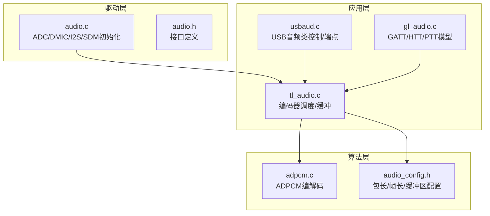
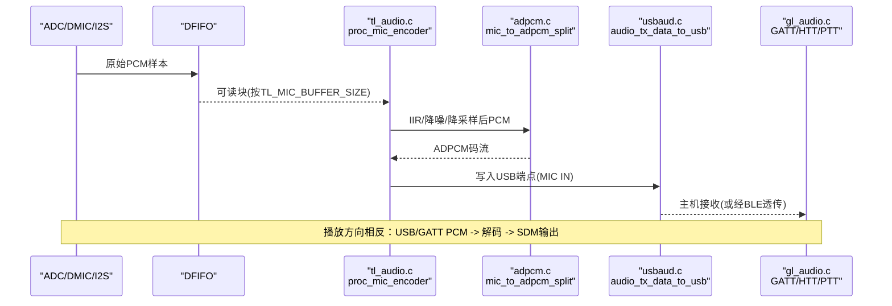
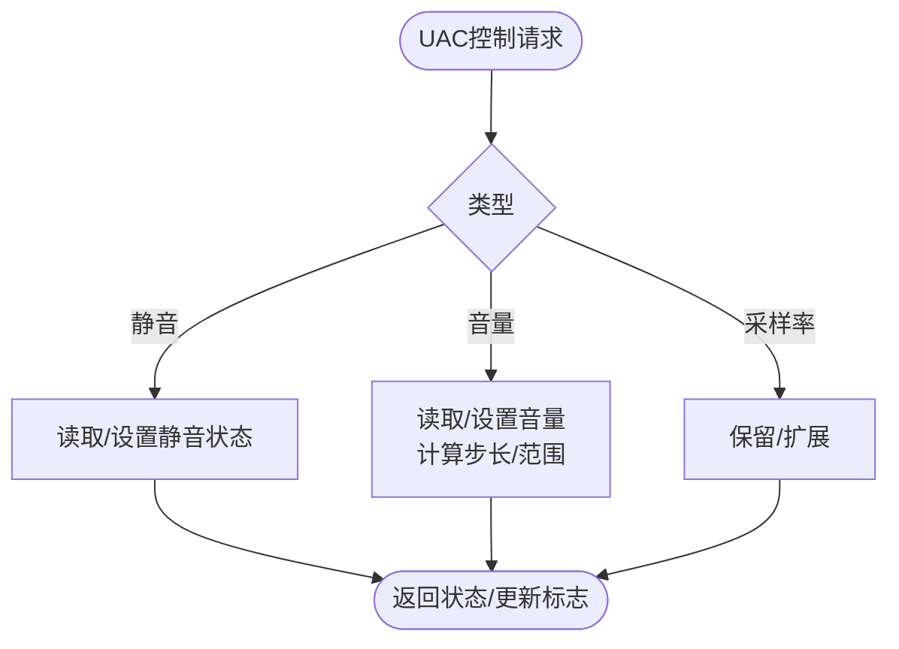
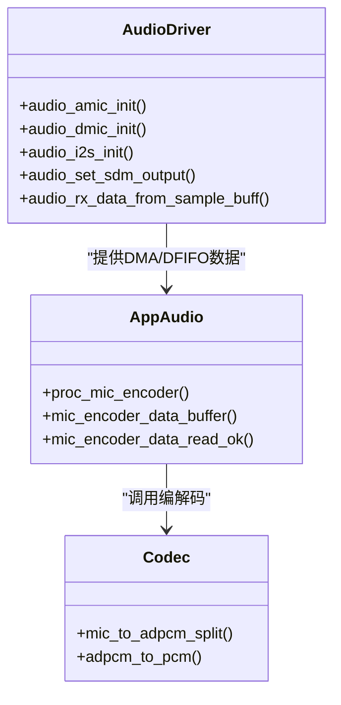
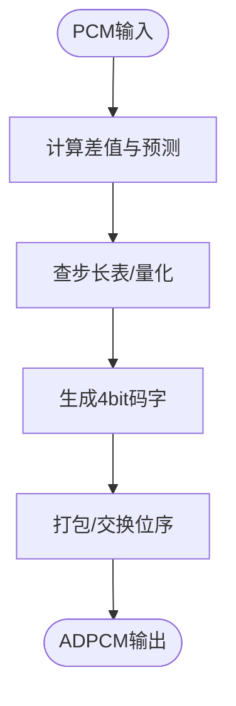
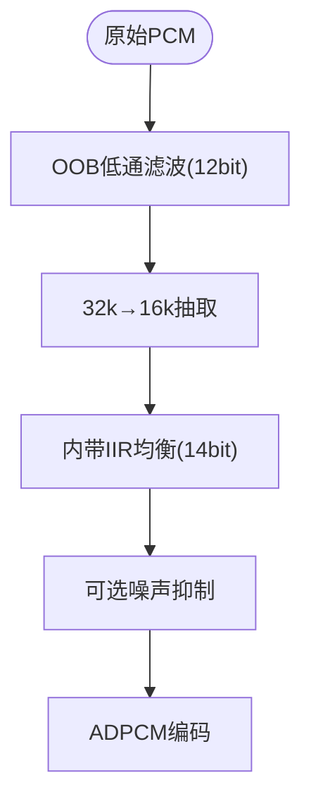
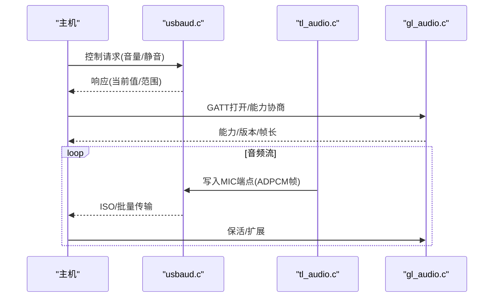
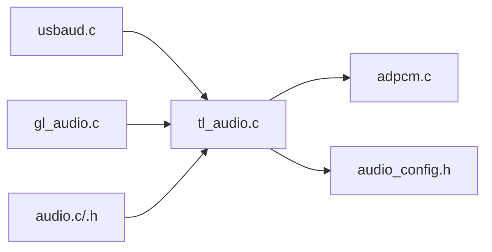

# Audio类设备

<cite>
**本文引用的文件**
- [usbaud.c](file://tc_ble_single_sdk/application/app/usbaud.c)
- [AudioClassCommon.h](file://tc_ble_single_sdk/application/usbstd/AudioClassCommon.h)
- [tl_audio.c](file://tc_ble_single_sdk/application/audio/tl_audio.c)
- [tl_audio.h](file://tc_ble_single_sdk/application/audio/tl_audio.h)
- [adpcm.c](file://tc_ble_single_sdk/application/audio/adpcm.c)
- [audio_config.h](file://tc_ble_single_sdk/application/audio/audio_config.h)
- [gl_audio.c](file://tc_ble_single_sdk/application/audio/gl_audio.c)
- [audio.c](file://tc_ble_single_sdk/drivers/B85/audio.c)
- [audio.h](file://tc_ble_single_sdk/drivers/B85/audio.h)
</cite>

## 目录
1. [简介](#简介)
2. [项目结构](#项目结构)
3. [核心组件](#核心组件)
4. [架构总览](#架构总览)
5. [详细组件分析](#详细组件分析)
6. [依赖关系分析](#依赖关系分析)
7. [性能与延迟优化](#性能与延迟优化)
8. [故障排查指南](#故障排查指南)
9. [结论](#结论)
10. [附录：测试方法与调优建议](#附录测试方法与调优建议)

## 简介
本技术文档围绕USB音频类（UAC）实现、音频流控制与格式支持，系统性地解析该SDK中音频采集、播放与编解码处理流程。重点覆盖ADPCM编码实现、采样率转换、音量控制、设备同步机制、延迟优化与音质保证策略，并提供可操作的测试方法与性能调优指南。

## 项目结构
本项目将音频功能分为三层：
- 驱动层：负责ADC/DMIC/I2S/SDM等硬件初始化、时钟配置、DFIFO数据通路、IIR滤波与音量控制。
- 应用层：封装USB音频类协议处理、GATT/HID音频模型、缓冲管理、编码器调度与数据打包。
- 算法层：提供ADPCM/SBC/MSBC编解码、噪声抑制、IIR均衡与采样率转换。

图表来源
- [audio.c:92-364](file://tc_ble_single_sdk/drivers/B85/audio.c#L92-L364)
- [audio.h:109-161](file://tc_ble_single_sdk/drivers/B85/audio.h#L109-L161)
- [usbaud.c:294-453](file://tc_ble_single_sdk/application/app/usbaud.c#L294-L453)
- [tl_audio.c:323-800](file://tc_ble_single_sdk/application/audio/tl_audio.c#L323-L800)
- [adpcm.c:53-208](file://tc_ble_single_sdk/application/audio/adpcm.c#L53-L208)
- [audio_config.h:32-107](file://tc_ble_single_sdk/application/audio/audio_config.h#L32-L107)

章节来源
- [audio.c:92-364](file://tc_ble_single_sdk/drivers/B85/audio.c#L92-L364)
- [usbaud.c:294-453](file://tc_ble_single_sdk/application/app/usbaud.c#L294-L453)
- [tl_audio.c:323-800](file://tc_ble_single_sdk/application/audio/tl_audio.c#L323-L800)
- [adpcm.c:53-208](file://tc_ble_single_sdk/application/audio/adpcm.c#L53-L208)
- [audio_config.h:32-107](file://tc_ble_single_sdk/application/audio/audio_config.h#L32-L107)

## 核心组件
- USB音频类控制与端点：实现UAC控制请求（静音/音量/采样率）、端点数据收发、HID上报兼容。
- 音频采集与播放：AMIC/DMIC/I2S/USB输入路径，SDM输出路径，DFIFO双缓冲与中断驱动。
- 编解码流水线：ADPCM/SBC/MSBC编码器选择，IIR滤波、降噪、采样率转换（32k→16k）。
- 同步与缓冲：环形缓冲、包边界对齐、溢出保护、超时与重连恢复。
- 音量控制：数字ALC/PGA增益、软件音量映射、静音控制。

章节来源
- [usbaud.c:162-293](file://tc_ble_single_sdk/application/app/usbaud.c#L162-L293)
- [tl_audio.c:180-318](file://tc_ble_single_sdk/application/audio/tl_audio.c#L180-L318)
- [audio.c:92-478](file://tc_ble_single_sdk/drivers/B85/audio.c#L92-L478)

## 架构总览
下图展示从麦克风采集到USB/GATT传输的端到端数据流，以及播放反向路径的关键节点。

图表来源
- [tl_audio.c:323-800](file://tc_ble_single_sdk/application/audio/tl_audio.c#L323-L800)
- [adpcm.c:53-208](file://tc_ble_single_sdk/application/audio/adpcm.c#L53-L208)
- [usbaud.c:311-453](file://tc_ble_single_sdk/application/app/usbaud.c#L311-L453)
- [gl_audio.c:60-355](file://tc_ble_single_sdk/application/audio/gl_audio.c#L60-L355)

## 详细组件分析

### USB音频类（UAC）控制与端点
- 控制面：处理Feature单元（静音/音量/采样率），维护当前值、最小/最大/分辨率，并标记变更位供上层刷新。
- 数据面：MIC端点周期性发送ADPCM帧；SPEAKER端点接收PCM并转发至音频子系统。
- HID兼容：可选通过音频IN端点发送HID报告以承载媒体控制命令。

图表来源
- [usbaud.c:162-293](file://tc_ble_single_sdk/application/app/usbaud.c#L162-L293)
- [AudioClassCommon.h:125-144](file://tc_ble_single_sdk/application/usbstd/AudioClassCommon.h#L125-L144)

章节来源
- [usbaud.c:162-293](file://tc_ble_single_sdk/application/app/usbaud.c#L162-L293)
- [AudioClassCommon.h:125-144](file://tc_ble_single_sdk/application/usbstd/AudioClassCommon.h#L125-L144)

### 音频采集与播放路径
- 采集路径：根据模式选择AMIC/DMIC/I2S/USB输入，配置CIC/HPF/LPF与解调比，数据进入DFIFO，应用层定时取块进行滤波与编码。
- 播放路径：USB/GATT接收PCM，经解码器还原为PCM，送入SDM或I2S输出。

图表来源
- [audio.c:92-478](file://tc_ble_single_sdk/drivers/B85/audio.c#L92-L478)
- [tl_audio.c:323-800](file://tc_ble_single_sdk/application/audio/tl_audio.c#L323-L800)
- [adpcm.c:53-208](file://tc_ble_single_sdk/application/audio/adpcm.c#L53-L208)

章节来源
- [audio.c:92-478](file://tc_ble_single_sdk/drivers/B85/audio.c#L92-L478)
- [tl_audio.c:323-800](file://tc_ble_single_sdk/application/audio/tl_audio.c#L323-L800)

### ADPCM音频编码实现
- 编码器：基于自适应差分脉冲编码，使用预测器与步长表，每4个样值打包成1字节码字，支持不同平台/协议的帧头格式。
- 关键参数：包长度、单位采样数、缓冲区大小由配置宏决定，适配Google/Telink/HID等不同协议。
- 解码器：对应逆过程，恢复PCM用于播放或进一步处理。

图表来源
- [adpcm.c:53-208](file://tc_ble_single_sdk/application/audio/adpcm.c#L53-L208)
- [adpcm.c:289-440](file://tc_ble_single_sdk/application/audio/adpcm.c#L289-L440)
- [audio_config.h:32-107](file://tc_ble_single_sdk/application/audio/audio_config.h#L32-L107)

章节来源
- [adpcm.c:53-208](file://tc_ble_single_sdk/application/audio/adpcm.c#L53-L208)
- [adpcm.c:289-440](file://tc_ble_single_sdk/application/audio/adpcm.c#L289-L440)
- [audio_config.h:32-107](file://tc_ble_single_sdk/application/audio/audio_config.h#L32-L107)

### 采样率转换与音质处理
- 采样率转换：在部分模式下执行32k→16k半采样抽取，配合IIR内带均衡与OOB低通滤波，提升语音清晰度。
- 噪声抑制：可选模块，基于短时/长时能量估计动态调整增益，抑制背景噪声。
- 滤波器：多段IIR系数可从Flash加载，支持手动/自动增益调节。

图表来源
- [tl_audio.c:86-178](file://tc_ble_single_sdk/application/audio/tl_audio.c#L86-L178)
- [tl_audio.c:354-418](file://tc_ble_single_sdk/application/audio/tl_audio.c#L354-L418)
- [tl_audio.h:66-105](file://tc_ble_single_sdk/application/audio/tl_audio.h#L66-L105)

章节来源
- [tl_audio.c:86-178](file://tc_ble_single_sdk/application/audio/tl_audio.c#L86-L178)
- [tl_audio.c:354-418](file://tc_ble_single_sdk/application/audio/tl_audio.c#L354-L418)
- [tl_audio.h:66-105](file://tc_ble_single_sdk/application/audio/tl_audio.h#L66-L105)

### 音量控制与静音
- 数字音量：通过ALC/PGA寄存器设置，支持左右声道独立与固定增益模式。
- 软件音量：UAC Feature单元提供最小/最大/分辨率查询与当前值设置，内部映射为步长。
- 静音：Feature单元静音位控制，影响采集/播放路径。

章节来源
- [tl_audio.c:180-318](file://tc_ble_single_sdk/application/audio/tl_audio.c#L180-L318)
- [usbaud.c:123-159](file://tc_ble_single_sdk/application/app/usbaud.c#L123-L159)
- [usbaud.c:218-293](file://tc_ble_single_sdk/application/app/usbaud.c#L218-L293)

### 音频设备同步机制
- USB端点：MIC端点周期性ACK，SPEAKER端点批量读取并写入音频寄存器，确保帧对齐。
- GATT/HTT/PTT：通过通知/指示维持会话生命周期，包含打开/关闭/能力协商与心跳保活。
- 缓冲同步：环形缓冲写读指针管理，溢出检测与自动复位，避免丢帧与爆音。

图表来源
- [usbaud.c:311-453](file://tc_ble_single_sdk/application/app/usbaud.c#L311-L453)
- [gl_audio.c:60-355](file://tc_ble_single_sdk/application/audio/gl_audio.c#L60-L355)
- [tl_audio.c:323-800](file://tc_ble_single_sdk/application/audio/tl_audio.c#L323-L800)

章节来源
- [usbaud.c:311-453](file://tc_ble_single_sdk/application/app/usbaud.c#L311-L453)
- [gl_audio.c:60-355](file://tc_ble_single_sdk/application/audio/gl_audio.c#L60-L355)
- [tl_audio.c:323-800](file://tc_ble_single_sdk/application/audio/tl_audio.c#L323-L800)

## 依赖关系分析
- 应用层依赖驱动层提供的音频采集/输出接口与寄存器访问。
- 编解码模块被应用层调度，依据配置宏选择不同协议/帧长。
- USB音频类与GATT/HTT/PTT模型共同构成传输通道，需保持时序一致。

图表来源
- [tl_audio.c:323-800](file://tc_ble_single_sdk/application/audio/tl_audio.c#L323-L800)
- [adpcm.c:53-208](file://tc_ble_single_sdk/application/audio/adpcm.c#L53-L208)
- [audio_config.h:32-107](file://tc_ble_single_sdk/application/audio/audio_config.h#L32-L107)
- [usbaud.c:294-453](file://tc_ble_single_sdk/application/app/usbaud.c#L294-L453)
- [gl_audio.c:60-355](file://tc_ble_single_sdk/application/audio/gl_audio.c#L60-L355)
- [audio.c:92-478](file://tc_ble_single_sdk/drivers/B85/audio.c#L92-L478)

章节来源
- [tl_audio.c:323-800](file://tc_ble_single_sdk/application/audio/tl_audio.c#L323-L800)
- [adpcm.c:53-208](file://tc_ble_single_sdk/application/audio/adpcm.c#L53-L208)
- [audio_config.h:32-107](file://tc_ble_single_sdk/application/audio/audio_config.h#L32-L107)
- [usbaud.c:294-453](file://tc_ble_single_sdk/application/app/usbaud.c#L294-L453)
- [gl_audio.c:60-355](file://tc_ble_single_sdk/application/audio/gl_audio.c#L60-L355)
- [audio.c:92-478](file://tc_ble_single_sdk/drivers/B85/audio.c#L92-L478)

## 性能与延迟优化
- 降低链路延迟
  - 减小ADPCM包长与缓冲深度，缩短端到端时延（参考配置宏对包长/帧长的约束）。
  - 合理设置DFIFO解调比与IIR滤波器阶数，平衡音质与时延。
- 提高稳定性
  - 启用溢出检测与自动复位逻辑，防止长时间运行后的缓冲漂移。
  - 在GATT/HTT/PTT模型中实现心跳保活与超时关闭，避免僵尸会话。
- 提升音质
  - 启用IIR均衡与噪声抑制，针对实际声学环境调整系数。
  - 校准PGA/ALC增益，避免削波与底噪过大。

[本节为通用指导，不直接分析具体文件]

## 故障排查指南
- 无声音/无声
  - 检查音频路径是否启用（SDM/I2S输出、USB输入）。
  - 确认音量与静音状态，验证Feature单元读写。
- 爆音/卡顿
  - 检查DFIFO与环形缓冲是否溢出，必要时增大缓冲或降低编码复杂度。
  - 核对采样率与解调比配置是否与硬件匹配。
- 连接不稳定
  - 检查GATT通知/指示成功率，增加重试与超时处理。
  - 确认心跳保活与超时关闭逻辑生效。

章节来源
- [usbaud.c:162-293](file://tc_ble_single_sdk/application/app/usbaud.c#L162-L293)
- [tl_audio.c:876-932](file://tc_ble_single_sdk/application/audio/tl_audio.c#L876-L932)
- [gl_audio.c:185-211](file://tc_ble_single_sdk/application/audio/gl_audio.c#L185-L211)

## 结论
该SDK实现了完整的USB音频类与多种无线音频模型（GATT/HTT/PTT），具备灵活的编解码选择、完善的音量与静音控制、可靠的同步与缓冲机制。通过合理的配置与调优，可在低延迟与高音质之间取得良好平衡，适用于语音助手、会议通话与多媒体场景。

[本节为总结性内容，不直接分析具体文件]

## 附录：测试方法与调优建议
- 基础功能测试
  - 采集：录制并回放，验证各采样率与通道配置。
  - 播放：通过USB/GATT下发PCM，验证SDM/I2S输出。
  - 控制：遍历音量/静音/采样率请求，验证返回值与行为。
- 性能测试
  - 时延测量：从采集到播放的端到端时延，评估不同包长与缓冲策略。
  - 负载测试：长时间运行观察缓冲溢出与复位触发频率。
- 调优建议
  - 根据应用场景选择ADPCM/SBC/MSBC，权衡带宽与音质。
  - 调整IIR系数与噪声抑制阈值，改善语音清晰度与抗噪能力。
  - 结合硬件PGA/ALC设置，优化动态范围与底噪。

[本节为通用指导，不直接分析具体文件]