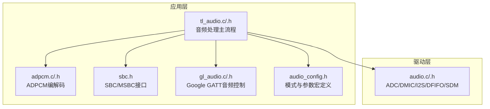
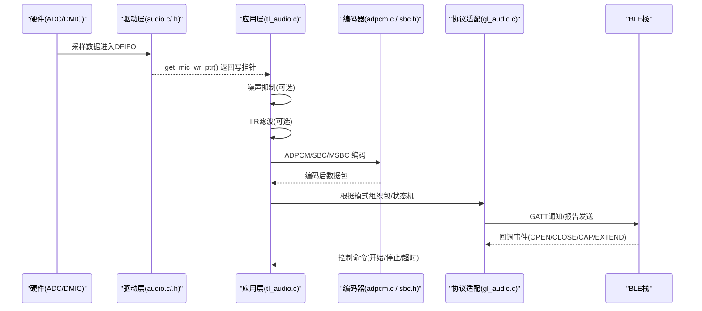
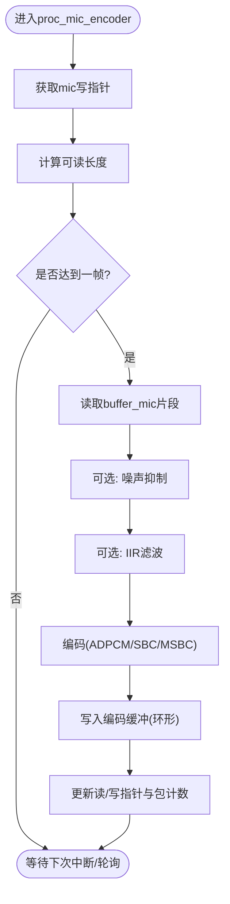
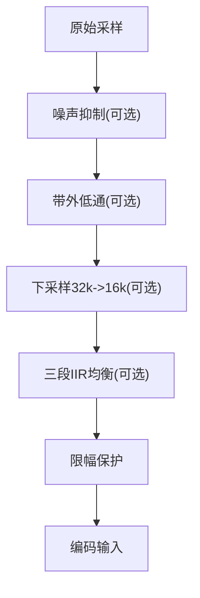
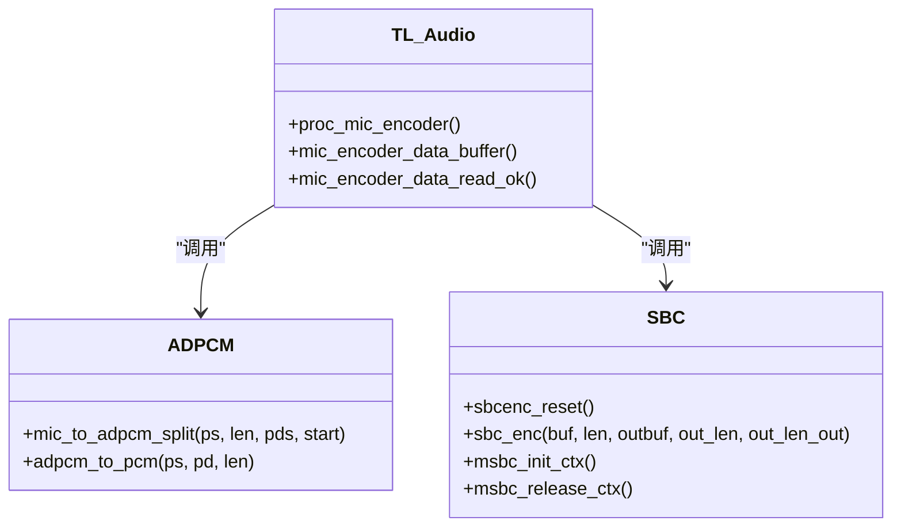
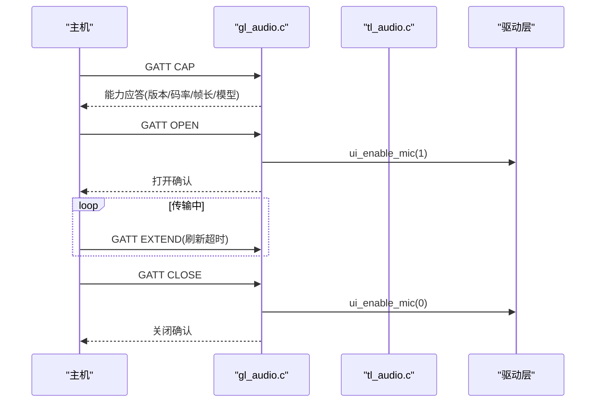
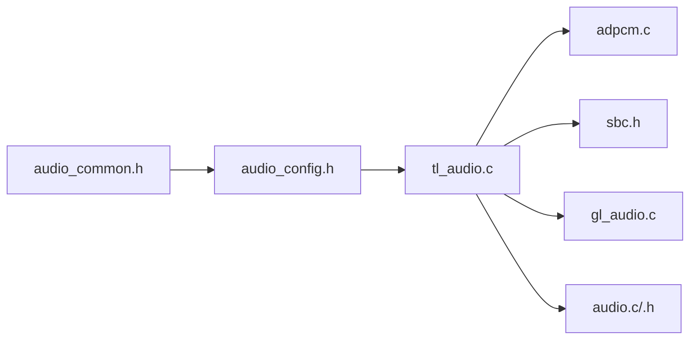

# 音频处理

<cite>
**本文引用的文件**
- [tl_audio.h](file://tc_ble_single_sdk/application/audio/tl_audio.h)
- [tl_audio.c](file://tc_ble_single_sdk/application/audio/tl_audio.c)
- [gl_audio.h](file://tc_ble_single_sdk/application/audio/gl_audio.h)
- [gl_audio.c](file://tc_ble_single_sdk/application/audio/gl_audio.c)
- [adpcm.h](file://tc_ble_single_sdk/application/audio/adpcm.h)
- [adpcm.c](file://tc_ble_single_sdk/application/audio/adpcm.c)
- [sbc.h](file://tc_ble_single_sdk/application/audio/sbc.h)
- [audio_config.h](file://tc_ble_single_sdk/application/audio/audio_config.h)
- [audio_common.h](file://tc_ble_single_sdk/application/audio/audio_common.h)
- [audio.h](file://tc_ble_single_sdk/drivers/B85/audio.h)
- [audio.c](file://tc_ble_single_sdk/drivers/B85/audio.c)
</cite>

## 目录
1. [简介](#简介)
2. [项目结构](#项目结构)
3. [核心组件](#核心组件)
4. [架构总览](#架构总览)
5. [详细组件分析](#详细组件分析)
6. [依赖关系分析](#依赖关系分析)
7. [性能与延迟优化](#性能与延迟优化)
8. [故障排查指南](#故障排查指南)
9. [结论](#结论)
10. [附录](#附录)

## 简介
本技术文档围绕该SDK中的音频采集、处理与传输流程，系统阐述缓冲区管理、实时处理机制、内存优化策略，以及滤波、降噪、音效增强、质量控制、动态范围压缩与自动增益控制等能力。同时给出性能优化与延迟最小化建议，帮助开发者在资源受限的MCU平台上实现低延迟、高稳定的语音链路。

## 项目结构
音频相关代码主要分布在应用层与驱动层：
- 应用层（application/audio）：封装音频模式选择、编码（ADPCM/SBC/MSBC）、Google GATT协议交互、IIR滤波与噪声抑制、缓冲队列管理等。
- 驱动层（drivers/B85）：提供ADC/DMIC/I2S初始化、采样率配置、PGA/ALC/HF/LF滤波器、DMA/DFIFO数据通路、SDM输出等底层能力。

图表来源
- [tl_audio.c:323-751](file://tc_ble_single_sdk/application/audio/tl_audio.c#L323-L751)
- [adpcm.c:47-283](file://tc_ble_single_sdk/application/audio/adpcm.c#L47-L283)
- [sbc.h:44-55](file://tc_ble_single_sdk/application/audio/sbc.h#L44-L55)
- [gl_audio.c:30-356](file://tc_ble_single_sdk/application/audio/gl_audio.c#L30-L356)
- [audio_config.h:28-123](file://tc_ble_single_sdk/application/audio/audio_config.h#L28-L123)
- [audio.c:92-200](file://tc_ble_single_sdk/drivers/B85/audio.c#L92-L200)

章节来源
- [tl_audio.c:323-751](file://tc_ble_single_sdk/application/audio/tl_audio.c#L323-L751)
- [audio_config.h:28-123](file://tc_ble_single_sdk/application/audio/audio_config.h#L28-L123)
- [audio.c:92-200](file://tc_ble_single_sdk/drivers/B85/audio.c#L92-L200)

## 核心组件
- 音频采集与缓冲：通过驱动层获取麦克风数据到固定大小缓冲，应用层按帧读取并处理。
- 实时处理管线：可选噪声抑制 → IIR滤波（带通/低通）→ 下采样 → 编码（ADPCM/SBC/MSBC）。
- 编码模块：ADPCM（内置表驱动），SBC/MSBC（通过接口调用）。
- 协议适配：Google GATT音频控制（开启/关闭/能力协商/超时处理）。
- 配置与音量：从Flash加载IIR系数与音量/PGA设置，支持运行时音量调节。

章节来源
- [tl_audio.h:32-129](file://tc_ble_single_sdk/application/audio/tl_audio.h#L32-L129)
- [tl_audio.c:52-318](file://tc_ble_single_sdk/application/audio/tl_audio.c#L52-L318)
- [adpcm.c:47-283](file://tc_ble_single_sdk/application/audio/adpcm.c#L47-L283)
- [sbc.h:44-55](file://tc_ble_single_sdk/application/audio/sbc.h#L44-L55)
- [gl_audio.c:30-356](file://tc_ble_single_sdk/application/audio/gl_audio.c#L30-L356)

## 架构总览
下图展示从硬件采集到上层协议发送的整体数据流与控制流。

图表来源
- [tl_audio.c:323-751](file://tc_ble_single_sdk/application/audio/tl_audio.c#L323-L751)
- [adpcm.c:47-283](file://tc_ble_single_sdk/application/audio/adpcm.c#L47-L283)
- [sbc.h:44-55](file://tc_ble_single_sdk/application/audio/sbc.h#L44-L55)
- [gl_audio.c:30-356](file://tc_ble_single_sdk/application/audio/gl_audio.c#L30-L356)
- [audio.c:92-200](file://tc_ble_single_sdk/drivers/B85/audio.c#L92-L200)

## 详细组件分析

### 音频采集与缓冲管理
- 采集入口：驱动层提供get_mic_wr_ptr()获取当前写入位置；应用层维护读指针与环形缓冲，按帧大小消费数据。
- 缓冲策略：使用固定大小的buffer_mic与多包缓冲buffer_mic_enc，配合写/读指针与包计数防止溢出。
- 帧边界：依据TL_MIC_ADPCM_UNIT_SIZE或MIC_SHORT_DEC_SIZE决定一次处理的样本数。

图表来源
- [tl_audio.c:323-418](file://tc_ble_single_sdk/application/audio/tl_audio.c#L323-L418)
- [tl_audio.c:439-525](file://tc_ble_single_sdk/application/audio/tl_audio.c#L439-L525)
- [tl_audio.c:546-649](file://tc_ble_single_sdk/application/audio/tl_audio.c#L546-L649)
- [tl_audio.c:651-751](file://tc_ble_single_sdk/application/audio/tl_audio.c#L651-L751)

章节来源
- [tl_audio.c:323-751](file://tc_ble_single_sdk/application/audio/tl_audio.c#L323-L751)
- [audio.h:127-134](file://tc_ble_single_sdk/drivers/B85/audio.h#L127-L134)

### 实时处理管线（滤波、降噪、音质增强）
- 噪声抑制：基于短时/长时能量估计与自适应增益，抑制静音段背景噪声，提升信噪比。
- IIR滤波：
  - 带外低通：voice_iir_OOB用于去除高频噪声。
  - 带内均衡：voice_iir串联三段EQ，改善语音频响。
  - 可配置移位以匹配不同位宽（12bit/14bit）与定点运算精度。
- 下采样：将32kHz降至16kHz以减少带宽与计算量。
- 音量与PGA：filter_setting从Flash加载EQ系数与音量/PGA设置，Audio_VolumeSet设置数字音量。

图表来源
- [tl_audio.h:66-109](file://tc_ble_single_sdk/application/audio/tl_audio.h#L66-L109)
- [tl_audio.c:86-178](file://tc_ble_single_sdk/application/audio/tl_audio.c#L86-L178)
- [tl_audio.c:226-318](file://tc_ble_single_sdk/application/audio/tl_audio.c#L226-L318)

章节来源
- [tl_audio.h:66-109](file://tc_ble_single_sdk/application/audio/tl_audio.h#L66-L109)
- [tl_audio.c:86-178](file://tc_ble_single_sdk/application/audio/tl_audio.c#L86-L178)
- [tl_audio.c:226-318](file://tc_ble_single_sdk/application/audio/tl_audio.c#L226-L318)

### 编码模块（ADPCM/SBC/MSBC）
- ADPCM：
  - 编码：mic_to_adpcm_split按帧压缩，维护预测值与步长索引表，支持不同协议头格式（Telink/Google v0.4/v1.0）。
  - 解码：adpcm_to_pcm将接收到的ADPCM还原为PCM。
- SBC/MSBC：
  - 通过sbc_enc/msbc_init_ctx等接口进行压缩，适用于HID服务或STB场景。

图表来源
- [adpcm.c:47-283](file://tc_ble_single_sdk/application/audio/adpcm.c#L47-L283)
- [adpcm.c:287-516](file://tc_ble_single_sdk/application/audio/adpcm.c#L287-L516)
- [sbc.h:44-55](file://tc_ble_single_sdk/application/audio/sbc.h#L44-L55)
- [tl_audio.c:323-751](file://tc_ble_single_sdk/application/audio/tl_audio.c#L323-L751)

章节来源
- [adpcm.c:47-283](file://tc_ble_single_sdk/application/audio/adpcm.c#L47-L283)
- [adpcm.c:287-516](file://tc_ble_single_sdk/application/audio/adpcm.c#L287-L516)
- [sbc.h:44-55](file://tc_ble_single_sdk/application/audio/sbc.h#L44-L55)
- [tl_audio.c:323-751](file://tc_ble_single_sdk/application/audio/tl_audio.c#L323-L751)

### Google GATT音频控制流程
- 能力协商：响应CAP指令，上报版本、编解码器、帧长、交互模型（On-Request/PTT/HTT）。
- 会话控制：OPEN/ CLOSE命令触发麦克风开关与数据传输启停。
- 超时管理：EXTEND刷新超时计时器，超时自动关闭并通知主机。
- 按键模型：HTT/PTT模式下按键按下/释放触发音频流开始/结束。

图表来源
- [gl_audio.c:213-356](file://tc_ble_single_sdk/application/audio/gl_audio.c#L213-L356)
- [gl_audio.c:60-211](file://tc_ble_single_sdk/application/audio/gl_audio.c#L60-L211)

章节来源
- [gl_audio.c:60-211](file://tc_ble_single_sdk/application/audio/gl_audio.c#L60-L211)
- [gl_audio.c:213-356](file://tc_ble_single_sdk/application/audio/gl_audio.c#L213-L356)

### 配置与音量/PGA
- 从Flash加载IIR系数与移位量，分步校验避免重复加载。
- 数字音量与PGA后置增益可通过寄存器配置，支持手动/自动模式切换。
- 支持不同MCU核心的差异化配置路径。

章节来源
- [tl_audio.c:226-318](file://tc_ble_single_sdk/application/audio/tl_audio.c#L226-L318)

## 依赖关系分析
- 编译期模式选择：audio_common.h与audio_config.h通过宏组合确定RCU/Dongle、ADPCM/SBC/MSBC、HID/GATT等通道。
- 运行时依赖：
  - tl_audio.c依赖adpcm.c与sbc.h提供的编解码能力。
  - gl_audio.c依赖BLE栈进行GATT通知/回调。
  - 驱动层audio.c提供ADC/DMIC/I2S初始化与数据通路。

图表来源
- [audio_common.h:27-79](file://tc_ble_single_sdk/application/audio/audio_common.h#L27-L79)
- [audio_config.h:28-123](file://tc_ble_single_sdk/application/audio/audio_config.h#L28-L123)
- [tl_audio.c:24-30](file://tc_ble_single_sdk/application/audio/tl_audio.c#L24-L30)
- [gl_audio.c:24-32](file://tc_ble_single_sdk/application/audio/gl_audio.c#L24-L32)
- [audio.c:24-31](file://tc_ble_single_sdk/drivers/B85/audio.c#L24-L31)

章节来源
- [audio_common.h:27-79](file://tc_ble_single_sdk/application/audio/audio_common.h#L27-L79)
- [audio_config.h:28-123](file://tc_ble_single_sdk/application/audio/audio_config.h#L28-L123)

## 性能与延迟优化
- 降低处理链复杂度：
  - 仅在必要时启用噪声抑制与IIR滤波，减少CPU占用。
  - 合理选择下采样（32k→16k）以降低带宽与计算量。
- 内存与缓存：
  - 使用环形缓冲与固定帧大小，避免频繁分配。
  - 关键函数标记为RAM执行（如_IIR_、_adpcm_to_pcm_）以减少取指开销。
- 编码优化：
  - ADPCM采用查表与位操作，保持低复杂度。
  - SBC/MSBC按帧批量处理，减少函数调用开销。
- 传输与超时：
  - 合理设置Google GATT超时时间，避免长时间占用资源。
  - 在溢出时主动丢弃旧包，保证实时性。
- 动态范围控制：
  - 利用ALC/HF/LPF与PGA后置增益，避免削波与底噪过大。
  - 数字音量与模拟增益协同，确保最佳信噪比。

[本节为通用指导，不直接分析具体文件]

## 故障排查指南
- 无声音/无声：
  - 检查驱动层ADC/DMIC初始化是否正确，采样率与解调比是否匹配。
  - 确认音量与PGA设置未被覆盖或处于静音状态。
- 爆音/失真：
  - 检查限幅逻辑是否生效，避免超出16位范围。
  - 调整IIR系数与增益，避免过激均衡导致峰值放大。
- 卡顿/丢帧：
  - 检查缓冲是否溢出（包计数判断），必要时增大缓冲或降低帧大小。
  - 确认编码耗时与传输周期匹配，避免堆积。
- Google GATT异常：
  - 核对CAP/OPEN/CLOSE/EXTEND时序，确保超时刷新及时。
  - 检查按键模型（HTT/PTT/On-Request）与主机期望一致。

章节来源
- [tl_audio.c:52-318](file://tc_ble_single_sdk/application/audio/tl_audio.c#L52-L318)
- [gl_audio.c:185-211](file://tc_ble_single_sdk/application/audio/gl_audio.c#L185-L211)
- [audio.c:92-200](file://tc_ble_single_sdk/drivers/B85/audio.c#L92-L200)

## 结论
该SDK提供了完整的音频采集、处理与传输方案，涵盖噪声抑制、IIR滤波、ADPCM/SBC/MSBC编码与Google GATT协议适配。通过合理的缓冲管理、实时处理流水线与内存优化，可在低功耗MCU上实现低延迟、高质量的语音链路。建议在实际项目中根据场景裁剪处理链、优化参数与超时策略，以获得最佳体验。

[本节为总结，不直接分析具体文件]

## 附录
- 关键宏与模式：
  - RCU_PROJECT/DONGLE_PROJECT：区分设备角色。
  - TL_AUDIO_MASK_*：标识编解码与通道类型。
  - GOOGLE_AUDIO_VERSION：选择Google协议版本。
- 典型帧大小：
  - ADPCM：约120-136字节/包，对应240-256个16位样本。
  - SBC/MSBC：按帧长度配置，通常较小且稳定。

章节来源
- [audio_common.h:27-79](file://tc_ble_single_sdk/application/audio/audio_common.h#L27-L79)
- [audio_config.h:28-123](file://tc_ble_single_sdk/application/audio/audio_config.h#L28-L123)