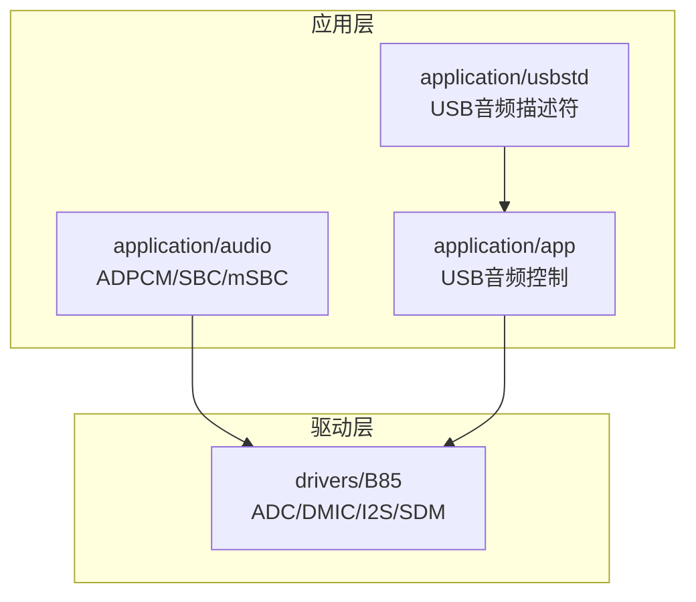
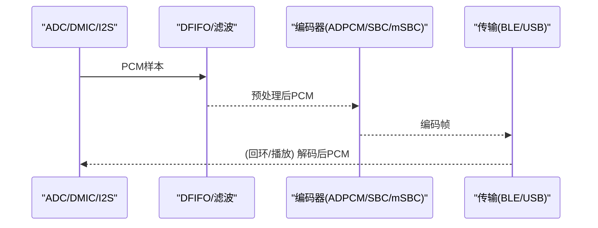
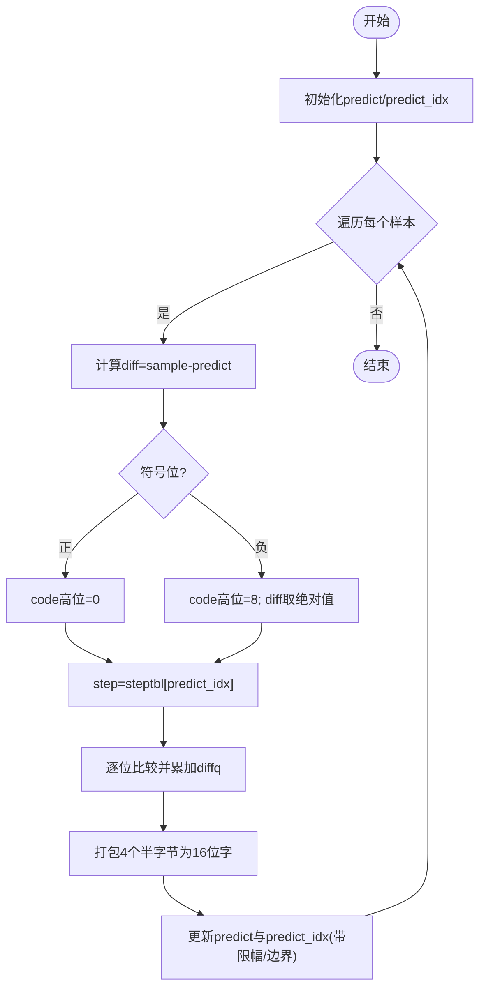
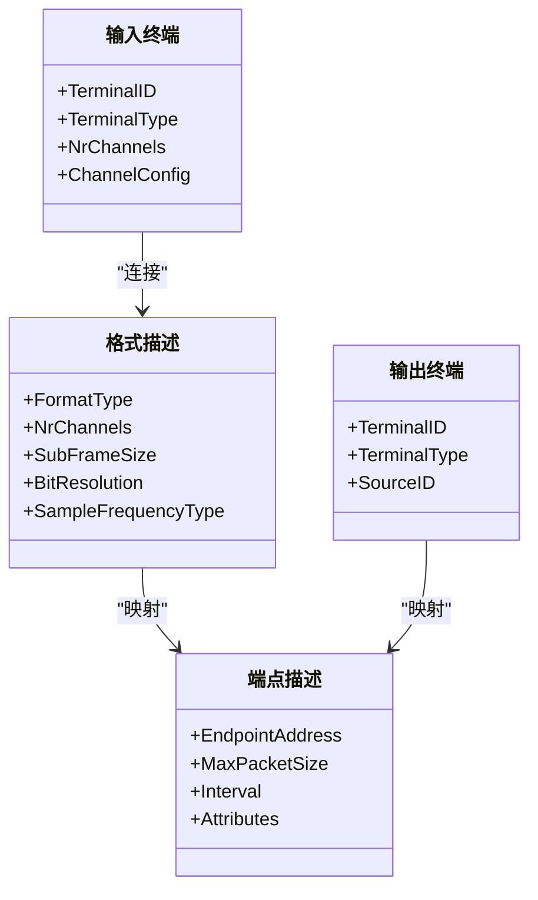
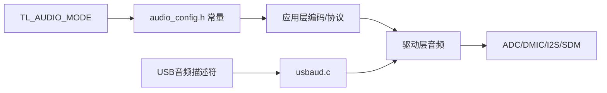

# 音频格式支持

<cite>
**本文引用的文件**
- [adpcm.c](file://tc_ble_single_sdk/application/audio/adpcm.c)
- [adpcm.h](file://tc_ble_single_sdk/application/audio/adpcm.h)
- [audio_config.h](file://tc_ble_single_sdk/application/audio/audio_config.h)
- [audio_common.h](file://tc_ble_single_sdk/application/audio/audio_common.h)
- [gl_audio.c](file://tc_ble_single_sdk/application/audio/gl_audio.c)
- [tl_audio.c](file://tc_ble_single_sdk/application/audio/tl_audio.c)
- [tl_audio.h](file://tc_ble_single_sdk/application/audio/tl_audio.h)
- [audio.c](file://tc_ble_single_sdk/drivers/B85/audio.c)
- [audio.h](file://tc_ble_single_sdk/drivers/B85/audio.h)
- [usbaud.c](file://tc_ble_single_sdk/application/app/usbaud.c)
- [usbaud.h](file://tc_ble_single_sdk/application/app/usbaud.h)
- [AudioClassCommon.h](file://tc_ble_single_sdk/application/usbstd/AudioClassCommon.h)
- [usbdesc.c](file://tc_ble_single_sdk/application/usbstd/usbdesc.c)
- [usbdesc.h](file://tc_ble_single_sdk/application/usbstd/usbdesc.h)
</cite>

## 目录
1. [简介](#简介)
2. [项目结构](#项目结构)
3. [核心组件](#核心组件)
4. [架构总览](#架构总览)
5. [详细组件分析](#详细组件分析)
6. [依赖关系分析](#依赖关系分析)
7. [性能考虑](#性能考虑)
8. [故障排查指南](#故障排查指南)
9. [结论](#结论)
10. [附录](#附录)

## 简介
本技术文档聚焦于该SDK的“音频格式支持”能力，重点覆盖：
- 支持的音频编码格式与传输通道（ADPCM、SBC、mSBC；BLE GATT/HID/USB）
- ADPCM编解码算法实现细节（预测器、步长表、索引表、端序处理）
- 音频格式描述符配置（USB Audio Class 描述符、采样率、位深、通道数）
- 采样率支持与位深度设置（ADC/DAC时钟、分频、IIR滤波、PGA增益）
- 数据格式转换流程（PCM->ADPCM、ADPCM->PCM、SBC/mSBC编码）
- 通道数配置（单声道/立体声）与音频质量参数（降噪、均衡、音量）
- 不同音频格式的兼容性处理与格式检测机制
- 优化与调优建议（内存、时延、功耗、CPU占用）

## 项目结构
围绕音频功能的关键目录与文件：
- application/audio：应用层音频处理（ADPCM/SBC/mSBC、Google语音协议适配、缓冲与流水线）
- drivers/B85：底层音频驱动（ADC/DMIC/I2S/SDM、时钟与滤波器、输入输出路由）
- application/app：USB音频控制与数据通路（音量、静音、端点收发）
- application/usbstd：USB音频类标准定义与设备描述符（接口、端点、格式类型、采样率）

图表来源
- [tl_audio.c:323-751](file://tc_ble_single_sdk/application/audio/tl_audio.c#L323-L751)
- [audio.c:92-364](file://tc_ble_single_sdk/drivers/B85/audio.c#L92-L364)
- [usbaud.c:311-431](file://tc_ble_single_sdk/application/app/usbaud.c#L311-L431)
- [usbdesc.c:552-618](file://tc_ble_single_sdk/application/usbstd/usbdesc.c#L552-L618)

章节来源
- [tl_audio.c:323-751](file://tc_ble_single_sdk/application/audio/tl_audio.c#L323-L751)
- [audio.c:92-364](file://tc_ble_single_sdk/drivers/B85/audio.c#L92-L364)
- [usbaud.c:311-431](file://tc_ble_single_sdk/application/app/usbaud.c#L311-L431)
- [usbdesc.c:552-618](file://tc_ble_single_sdk/application/usbstd/usbdesc.c#L552-L618)

## 核心组件
- ADPCM编解码模块：提供mic_to_adpcm_split与adpcm_to_pcm，实现IMA-ADPCM风格的预测编码/解码，含步长表与索引表，支持多种GATT/HID打包格式。
- 音频流水线与编码器选择：根据TL_AUDIO_MODE编译选项，选择ADPCM/SBC/mSBC路径，统一封装proc_mic_encoder等接口。
- 底层音频驱动：配置AMIC/DMIC/I2S输入、SDM/I2S输出、时钟分频、ALC/HPF/LPF、PGA增益、DFIFO模式。
- USB音频控制：处理Host对音量、静音、采样率的控制请求，管理端点数据收发。
- USB音频描述符：声明接口、终端、格式类型（PCM为主）、采样率、通道数、端点属性。

章节来源
- [adpcm.h:27-44](file://tc_ble_single_sdk/application/audio/adpcm.h#L27-L44)
- [tl_audio.c:323-751](file://tc_ble_single_sdk/application/audio/tl_audio.c#L323-L751)
- [audio.h:103-168](file://tc_ble_single_sdk/drivers/B85/audio.h#L103-L168)
- [usbaud.h:52-113](file://tc_ble_single_sdk/application/app/usbaud.h#L52-L113)
- [AudioClassCommon.h:147-339](file://tc_ble_single_sdk/application/usbstd/AudioClassCommon.h#L147-L339)

## 架构总览
从采集到发送的整体数据流：
- 采集：AMIC/DMIC/I2S经ADC/数字前端进入DFIFO，按采样率与分频得到PCM样本。
- 预处理：可选IIR滤波、降噪、下采样（如32k->16k）。
- 编码：按模式选择ADPCM或SBC/mSBC编码，生成固定长度帧。
- 传输：BLE GATT/HID或USB ISO端点发送；接收侧执行反向流程。

图表来源
- [audio.c:92-364](file://tc_ble_single_sdk/drivers/B85/audio.c#L92-L364)
- [tl_audio.c:323-751](file://tc_ble_single_sdk/application/audio/tl_audio.c#L323-L751)
- [usbaud.c:311-431](file://tc_ble_single_sdk/application/app/usbaud.c#L311-L431)

## 详细组件分析

### ADPCM编解码算法实现
- 算法要点
  - 使用预测值predict与预测索引predict_idx，结合步长表steptbl与索引调整表idxtbl进行差分量化与重建。
  - 每4个1/2字节码元打包为一个16位字，注意端序交换以兼容Android/Google协议。
  - 提供多套打包头格式：Telink自定义、Google v0.4/v1.0、HID Service通道。
- 关键函数
  - mic_to_adpcm_split：将PCM块压缩为ADPCM帧，支持start标志写入初始状态。
  - adpcm_to_pcm：从ADPCM帧恢复PCM，包含端序修正与边界保护。
- 复杂度
  - 时间复杂度O(N)，N为样本数；空间复杂度O(1)额外（除输入输出缓冲）。
- 错误与边界
  - 预测值限幅至±32767；索引表访问前做越界保护。

图表来源
- [adpcm.c:53-126](file://tc_ble_single_sdk/application/audio/adpcm.c#L53-L126)
- [adpcm.c:289-361](file://tc_ble_single_sdk/application/audio/adpcm.c#L289-L361)
- [adpcm.c:372-440](file://tc_ble_single_sdk/application/audio/adpcm.c#L372-L440)

章节来源
- [adpcm.c:32-42](file://tc_ble_single_sdk/application/audio/adpcm.c#L32-L42)
- [adpcm.c:53-126](file://tc_ble_single_sdk/application/audio/adpcm.c#L53-L126)
- [adpcm.c:289-361](file://tc_ble_single_sdk/application/audio/adpcm.c#L289-L361)
- [adpcm.c:372-440](file://tc_ble_single_sdk/application/audio/adpcm.c#L372-L440)
- [adpcm.h:27-44](file://tc_ble_single_sdk/application/audio/adpcm.h#L27-L44)

### 音频格式描述符配置（USB）
- 接口与终端
  - 输入终端（麦克风）、输出终端（扬声器），通过CS Interface Header/AS General描述。
- 格式类型
  - 当前USB音频流主要声明PCM格式（FormatType=PCM），通道数、子帧大小、位分辨率由描述符指定。
- 采样率
  - 通过Sample Frequency描述符声明支持频率（例如48kHz），端点属性支持采样率控制。
- 端点
  - 同步/异步ISO端点，最大包长与轮询间隔匹配带宽需求。

图表来源
- [AudioClassCommon.h:147-339](file://tc_ble_single_sdk/application/usbstd/AudioClassCommon.h#L147-L339)
- [usbdesc.c:552-618](file://tc_ble_single_sdk/application/usbstd/usbdesc.c#L552-L618)

章节来源
- [AudioClassCommon.h:147-339](file://tc_ble_single_sdk/application/usbstd/AudioClassCommon.h#L147-L339)
- [usbdesc.c:552-618](file://tc_ble_single_sdk/application/usbstd/usbdesc.c#L552-L618)

### 采样率支持与位深度设置
- 采样率
  - 驱动层支持8k/16k/32k/48k等，通过CIC分频与DFIFO模式选择实现。
  - AMIC/DMIC分别配置不同的CIC速率矩阵，确保目标采样率。
- 位深度
  - ADC分辨率可配置（如14bit），后续经数字滤波与缩放输出16bit PCM。
- 时钟
  - DMIC/I2S时钟通过分频寄存器设置，保证与外部Codec或传感器同步。

章节来源
- [audio.c:39-54](file://tc_ble_single_sdk/drivers/B85/audio.c#L39-L54)
- [audio.c:92-237](file://tc_ble_single_sdk/drivers/B85/audio.c#L92-L237)
- [audio.c:288-364](file://tc_ble_single_sdk/drivers/B85/audio.c#L288-L364)
- [audio.h:56-62](file://tc_ble_single_sdk/drivers/B85/audio.h#L56-L62)

### 数据格式转换与通道数配置
- 转换路径
  - RCU侧：根据TL_AUDIO_MODE选择ADPCM/SBC/mSBC编码路径，统一调用proc_mic_encoder。
  - Dongle侧：对应解码路径，将ADPCM/SBC/mSBC还原为PCM。
- 通道数
  - AMIC可配置单声道/立体声；USB端点可通过mono_en开关控制单声道模式。
- 缓冲区与流水线
  - 环形缓冲+读写指针管理，避免溢出与丢帧；按帧大小批量处理。

章节来源
- [tl_audio.c:323-751](file://tc_ble_single_sdk/application/audio/tl_audio.c#L323-L751)
- [tl_audio.h:61-63](file://tc_ble_single_sdk/application/audio/tl_audio.h#L61-L63)
- [usbaud.c:53-62](file://tc_ble_single_sdk/application/app/usbaud.c#L53-L62)
- [audio.c:717-720](file://tc_ble_single_sdk/drivers/B85/audio.c#L717-L720)

### 音频质量参数设置
- 降噪与滤波
  - 可选噪声抑制（基于短时/长时能量估计自适应增益）。
  - IIR内带均衡与外带低通滤波，系数可从Flash加载，支持移位缩放。
- 音量与增益
  - PGA预/后级增益可固定或自动调节；数字ALC最小音量可配置。
- 端点控制
  - USB Host可通过Feature Unit控制静音与音量，返回当前/最小/最大/分辨率。

章节来源
- [tl_audio.c:52-178](file://tc_ble_single_sdk/application/audio/tl_audio.c#L52-L178)
- [tl_audio.c:226-318](file://tc_ble_single_sdk/application/audio/tl_audio.c#L226-L318)
- [tl_audio.h:66-105](file://tc_ble_single_sdk/application/audio/tl_audio.h#L66-L105)
- [usbaud.c:162-293](file://tc_ble_single_sdk/application/app/usbaud.c#L162-L293)

### 不同音频格式的兼容性处理与格式检测
- BLE GATT/HTT/PTT模型
  - Google语音协议：支持v0.4与v1.0两种帧格式，包含序列号、ID、预测状态字段；通过能力协商（CAP）上报支持的编解码与帧长。
- HID服务通道
  - 针对HID通道定义专用打包格式，保持与主机期望一致。
- 格式检测
  - 通过TL_AUDIO_MODE宏在编译期选择具体实现；运行时依据Google命令（OPEN/CLOSE/CAP/EXTEND）切换行为。

章节来源
- [gl_audio.c:54-356](file://tc_ble_single_sdk/application/audio/gl_audio.c#L54-L356)
- [audio_config.h:32-119](file://tc_ble_single_sdk/application/audio/audio_config.h#L32-L119)
- [audio_common.h:27-72](file://tc_ble_single_sdk/application/audio/audio_common.h#L27-L72)

## 依赖关系分析
- 编译期依赖
  - TL_AUDIO_MODE决定启用哪些音频模式（RCU/DONGLE、ADPCM/SBC/mSBC、GATT/HID）。
  - audio_config.h根据模式定义包长、缓冲大小、单位帧尺寸等常量。
- 运行期依赖
  - 驱动层提供ADC/DMIC/I2S/SDM时钟与滤波器；应用层负责编码与协议适配。
  - USB音频依赖描述符与端点配置，控制面通过Feature Unit交互。

图表来源
- [audio_common.h:27-72](file://tc_ble_single_sdk/application/audio/audio_common.h#L27-L72)
- [audio_config.h:32-119](file://tc_ble_single_sdk/application/audio/audio_config.h#L32-L119)
- [usbaud.c:311-431](file://tc_ble_single_sdk/application/app/usbaud.c#L311-L431)
- [usbdesc.c:552-618](file://tc_ble_single_sdk/application/usbstd/usbdesc.c#L552-L618)

章节来源
- [audio_common.h:27-72](file://tc_ble_single_sdk/application/audio/audio_common.h#L27-L72)
- [audio_config.h:32-119](file://tc_ble_single_sdk/application/audio/audio_config.h#L32-L119)
- [usbaud.c:311-431](file://tc_ble_single_sdk/application/app/usbaud.c#L311-L431)
- [usbdesc.c:552-618](file://tc_ble_single_sdk/application/usbstd/usbdesc.c#L552-L618)

## 性能考虑
- 时延与吞吐
  - 合理设置TL_MIC_BUFFER_SIZE与TL_MIC_PACKET_BUFFER_NUM，平衡延迟与溢出风险。
  - 对于ADPCM，尽量批量处理整帧以减少函数调用开销。
- CPU占用
  - IIR滤波与降噪可在空闲时段或中断中谨慎调度；必要时关闭非必要效果链。
- 功耗
  - 未使用时关闭ADC/模块电源；降低采样率或关闭输出通道可降低功耗。
- 内存
  - 避免重复分配；复用环形缓冲；注意端点最大包长与DMA限制。

[本节为通用指导，不直接引用具体文件]

## 故障排查指南
- 无声音/无声
  - 检查音频模块是否启动（audio_amic_init/audio_dmic_init），确认DFIFO模式与输入选择。
  - 确认PGA增益与ALC设置，避免信号过小或被限幅。
- 爆音/失真
  - 检查预测值限幅与IIR输出限幅；适当降低增益或调整滤波器系数。
- 蓝牙语音异常
  - 核对Google协议版本与帧格式（v0.4/v1.0），确认CAP协商结果与流ID。
- USB音量无效
  - 检查Feature Unit控制请求处理（静音/音量），确认端点忙状态与ACK。

章节来源
- [audio.c:92-364](file://tc_ble_single_sdk/drivers/B85/audio.c#L92-L364)
- [tl_audio.c:52-178](file://tc_ble_single_sdk/application/audio/tl_audio.c#L52-L178)
- [gl_audio.c:213-356](file://tc_ble_single_sdk/application/audio/gl_audio.c#L213-L356)
- [usbaud.c:162-293](file://tc_ble_single_sdk/application/app/usbaud.c#L162-L293)

## 结论
该SDK提供了完整的音频格式支持栈：从底层ADC/DMIC/I2S采集，到ADPCM/SBC/mSBC编码，再到BLE GATT/HID与USB传输。ADPCM实现遵循经典预测差分量化，具备多协议兼容能力；USB音频通过标准描述符声明PCM格式与采样率，便于主机识别与控制。通过合理的缓冲、滤波与增益配置，可在低功耗MCU上实现稳定、低时延的语音链路。

[本节为总结性内容，不直接引用具体文件]

## 附录
- 常用配置项速查
  - TL_AUDIO_MODE：选择RCU/DONGLE、ADPCM/SBC/mSBC、GATT/HID通道。
  - ADPCM_PACKET_LEN/TL_MIC_ADPCM_UNIT_SIZE/TL_MIC_BUFFER_SIZE：影响帧大小与缓冲。
  - MIC_CHANNEL_COUNT/MONO_EN：控制单/立体声。
  - USB音频描述符：FormatType、通道数、位深、采样率、端点属性。
- 参考路径
  - ADPCM实现：[adpcm.c](file://tc_ble_single_sdk/application/audio/adpcm.c)
  - 音频流水线：[tl_audio.c](file://tc_ble_single_sdk/application/audio/tl_audio.c)
  - 驱动配置：[audio.c](file://tc_ble_single_sdk/drivers/B85/audio.c)
  - USB控制：[usbaud.c](file://tc_ble_single_sdk/application/app/usbaud.c)
  - 描述符：[usbdesc.c](file://tc_ble_single_sdk/application/usbstd/usbdesc.c)、[AudioClassCommon.h](file://tc_ble_single_sdk/application/usbstd/AudioClassCommon.h)

[本节为补充信息，不直接引用具体文件]