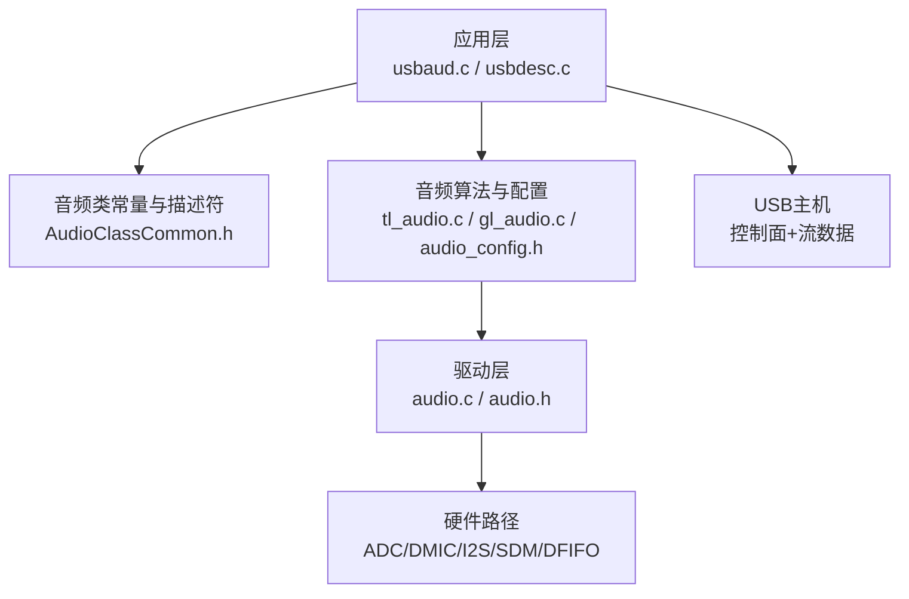
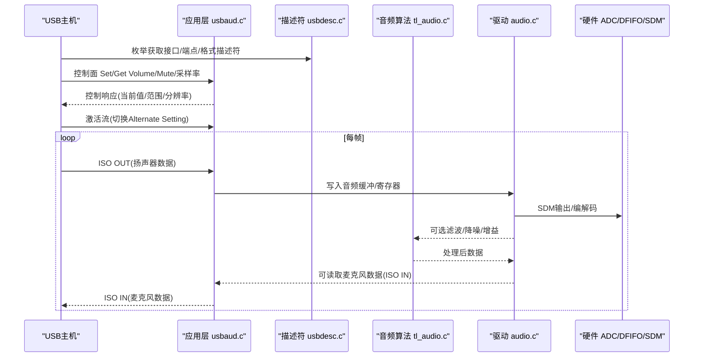
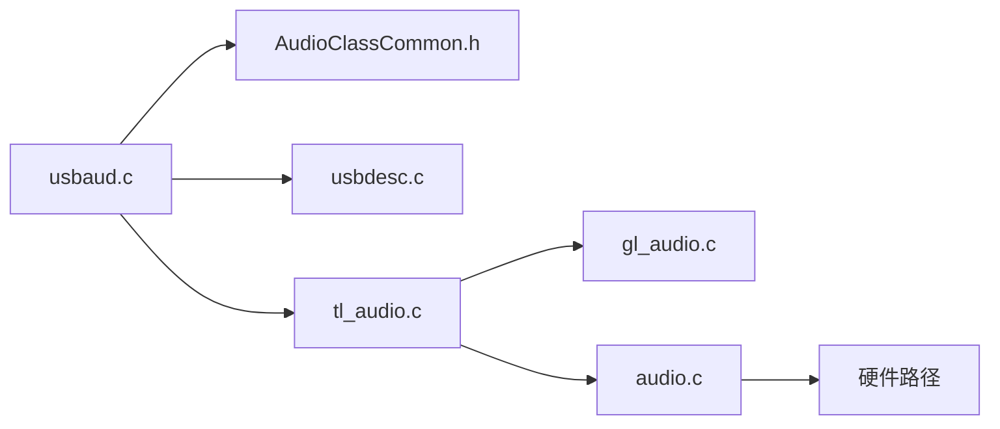

# 音频流控制

<cite>
**本文引用的文件**
- [usbaud.c](file://tc_ble_single_sdk/application/app/usbaud.c)
- [usbaud.h](file://tc_ble_single_sdk/application/app/usbaud.h)
- [usbaud_i.h](file://tc_ble_single_sdk/application/app/usbaud_i.h)
- [AudioClassCommon.h](file://tc_ble_single_sdk/application/usbstd/AudioClassCommon.h)
- [usbdesc.c](file://tc_ble_single_sdk/application/usbstd/usbdesc.c)
- [tl_audio.c](file://tc_ble_single_sdk/application/audio/tl_audio.c)
- [gl_audio.c](file://tc_ble_single_sdk/application/audio/gl_audio.c)
- [gl_audio.h](file://tc_ble_single_sdk/application/audio/gl_audio.h)
- [audio_config.h](file://tc_ble_single_sdk/application/audio/audio_config.h)
- [audio.c](file://tc_ble_single_sdk/drivers/B85/audio.c)
- [audio.h](file://tc_ble_single_sdk/drivers/B85/audio.h)
</cite>

## 目录
1. [简介](#简介)
2. [项目结构](#项目结构)
3. [核心组件](#核心组件)
4. [架构总览](#架构总览)
5. [详细组件分析](#详细组件分析)
6. [依赖关系分析](#依赖关系分析)
7. [性能与延迟特性](#性能与延迟特性)
8. [故障排查指南](#故障排查指南)
9. [结论](#结论)

## 简介
本技术文档围绕USB音频类（UAC）的流控制实现，系统阐述音频接口描述符、端点配置与控制面交互；详述音频流的建立、管理与终止流程；并深入说明采样率控制、音量调节与静音的实现细节。同时给出音频流同步机制与延迟控制策略，以及状态监控与错误处理方案。该实现基于Telink B85平台SDK，包含应用层USB音频协议栈、音频驱动与底层ADC/DFIFO/SDM路径。

## 项目结构
本项目将USB音频功能划分为三层：
- 应用层：USB音频类实现、控制请求处理、HID辅助控制、音频数据收发
- 音频算法与配置：编码/解码、IIR滤波、噪声抑制、Google语音模型等
- 驱动层：音频采集/播放、时钟与滤波器、DMA/DFIFO、SDM输出

图表来源
- [usbdesc.c:445-641](file://tc_ble_single_sdk/application/usbstd/usbdesc.c#L445-L641)
- [AudioClassCommon.h:101-144](file://tc_ble_single_sdk/application/usbstd/AudioClassCommon.h#L101-L144)
- [usbaud.c:162-293](file://tc_ble_single_sdk/application/app/usbaud.c#L162-L293)
- [tl_audio.c:323-800](file://tc_ble_single_sdk/application/audio/tl_audio.c#L323-L800)
- [audio.c:288-478](file://tc_ble_single_sdk/drivers/B85/audio.c#L288-L478)

章节来源
- [usbdesc.c:445-641](file://tc_ble_single_sdk/application/usbstd/usbdesc.c#L445-L641)
- [usbaud.c:162-293](file://tc_ble_single_sdk/application/app/usbaud.c#L162-L293)
- [tl_audio.c:323-800](file://tc_ble_single_sdk/application/audio/tl_audio.c#L323-L800)
- [audio.c:288-478](file://tc_ble_single_sdk/drivers/B85/audio.c#L288-L478)

## 核心组件
- USB音频控制面：处理Set/Get Volume/Mute、采样率等控制请求，维护设备状态
- 音频流数据面：ISO端点上的PCM数据收发（麦克风上行、扬声器下行）
- 音频算法：ADPCM/SBC/MSBC编码、IIR滤波、降噪、增益与PGA设置
- 驱动层：ADC/DMIC/I2S初始化、DFIFO配置、SDM输出与时钟管理
- 配置与描述符：UAC接口/端点/格式描述符、HID报告描述符、音频参数宏定义

章节来源
- [usbaud.h:52-90](file://tc_ble_single_sdk/application/app/usbaud.h#L52-L90)
- [AudioClassCommon.h:125-144](file://tc_ble_single_sdk/application/usbstd/AudioClassCommon.h#L125-L144)
- [usbdesc.c:445-641](file://tc_ble_single_sdk/application/usbstd/usbdesc.c#L445-L641)
- [tl_audio.c:180-318](file://tc_ble_single_sdk/application/audio/tl_audio.c#L180-L318)
- [audio.c:88-478](file://tc_ble_single_sdk/drivers/B85/audio.c#L88-L478)

## 架构总览
下图展示了从主机到设备的完整数据与控制路径，包括控制面请求处理与流数据通路。

图表来源
- [usbdesc.c:445-641](file://tc_ble_single_sdk/application/usbstd/usbdesc.c#L445-L641)
- [usbaud.c:311-431](file://tc_ble_single_sdk/application/app/usbaud.c#L311-L431)
- [tl_audio.c:323-800](file://tc_ble_single_sdk/application/audio/tl_audio.c#L323-L800)
- [audio.c:288-478](file://tc_ble_single_sdk/drivers/B85/audio.c#L288-L478)

## 详细组件分析

### USB音频类描述符与接口配置
- 控制接口：声明为Audio Control Class/Subclass/Protocol，用于Volume/Mute/采样率等控制请求
- 流接口：分别定义Speaker与Mic的Streaming Interface，含AS General、Format Type、Sample Rate、Endpoint等描述符
- 端点类型：
  - Speaker：ISOchronous OUT，自适应同步（Adaptive），支持采样率控制
  - Mic：ISOchronous IN，同步（Sync）或自适应（取决于实现），支持采样率控制
- 通道与位深：根据配置定义通道数、子帧大小、位分辨率
- 采样率：通过Format Specific描述符暴露离散采样率集合，由主机选择

章节来源
- [usbdesc.c:445-641](file://tc_ble_single_sdk/application/usbstd/usbdesc.c#L445-L641)
- [AudioClassCommon.h:101-144](file://tc_ble_single_sdk/application/usbstd/AudioClassCommon.h#L101-L144)

### 控制面：音量、静音与采样率
- 音量与静音：
  - Feature Unit中启用Mute与Volume控制位
  - 控制请求Set/Get Current/Min/Max/Resolution，设备侧维护当前值、步长与静音标志
  - 对Speaker与Mic分别维护setting结构体，更新change标志供上层处理
- 采样率控制：
  - 端点属性支持Sampling Frequency Control，主机可通过Control EP下发采样率变更
  - 设备在收到采样率变化后需调整DFIFO分频、ADC/DMIC时钟及后续编码参数

章节来源
- [usbaud.c:162-293](file://tc_ble_single_sdk/application/app/usbaud.c#L162-L293)
- [usbaud.h:52-90](file://tc_ble_single_sdk/application/app/usbaud.h#L52-L90)
- [AudioClassCommon.h:125-144](file://tc_ble_single_sdk/application/usbstd/AudioClassCommon.h#L125-L144)

### 音频流建立、管理与终止
- 建立：
  - 主机枚举后，选择Alternate Setting激活流接口
  - 设备侧准备端点缓冲区、重置指针、开启中断
- 运行：
  - 每帧ISO传输：
    - 接收Speaker数据：从EP6读取PCM，写入音频路径（可能经滤波/增益/编码）
    - 发送Mic数据：从ADC/DMIC读入PCM，按速率打包至EP7发送
  - 中断处理：统计端点事件，触发数据搬运
- 终止：
  - 主机停用流或断开连接时，关闭端点、停止音频模块、释放资源

章节来源
- [usbaud.c:311-454](file://tc_ble_single_sdk/application/app/usbaud.c#L311-L454)
- [audio.c:288-478](file://tc_ble_single_sdk/drivers/B85/audio.c#L288-L478)

### 音频采样率控制
- 描述符暴露支持的采样率集合（如48kHz）
- 主机通过控制请求或端点属性进行采样率切换
- 设备侧根据新采样率：
  - 调整DFIFO分频比
  - 配置ADC/DMIC时钟
  - 更新编码单元尺寸与缓冲大小（ADPCM/SBC/MSBC）

章节来源
- [usbdesc.c:553-640](file://tc_ble_single_sdk/application/usbstd/usbdesc.c#L553-L640)
- [audio.c:175-201](file://tc_ble_single_sdk/drivers/B85/audio.c#L175-L201)
- [audio_config.h:32-74](file://tc_ble_single_sdk/application/audio/audio_config.h#L32-L74)

### 音量调节与静音
- 音量范围与分辨率：
  - 定义最小/最大/分辨率与默认值
  - 计算当前音量对应的步进索引
- 静音：
  - 通过Feature Unit Mute控制位切换
  - 影响实际输出/输入增益或数字静音
- 应用层维护speaker_setting_t/mic_setting_t，提供查询接口

章节来源
- [usbaud.h:55-90](file://tc_ble_single_sdk/application/app/usbaud.h#L55-L90)
- [usbaud.c:123-159](file://tc_ble_single_sdk/application/app/usbaud.c#L123-L159)
- [tl_audio.c:180-318](file://tc_ble_single_sdk/application/audio/tl_audio.c#L180-L318)

### 音频流同步与延迟控制
- 同步类型：
  - Speaker端点使用自适应同步，允许主机动态调整采样率以匹配设备
  - Mic端点使用同步或自适应，确保数据对齐
- 延迟控制：
  - 端点专用描述符中的Lock Delay单位与值
  - 通过Frame Delay与端点间隔控制端到端延迟
- 缓冲管理：
  - DFIFO双缓冲/环形缓冲避免欠载/溢出
  - 编码器缓冲队列与读写指针管理

章节来源
- [usbdesc.c:569-640](file://tc_ble_single_sdk/application/usbstd/usbdesc.c#L569-L640)
- [tl_audio.c:323-800](file://tc_ble_single_sdk/application/audio/tl_audio.c#L323-L800)

### 状态监控与错误处理
- 状态变量：
  - 维护change标志位指示音量/静音变化
  - 端点忙状态检查，避免重复发送
- 错误处理：
  - 控制请求非法返回错误码
  - 超时与断连处理（如Google语音模型场景）
  - 缓冲溢出保护与丢弃策略

章节来源
- [usbaud.c:145-215](file://tc_ble_single_sdk/application/app/usbaud.c#L145-L215)
- [gl_audio.c:185-211](file://tc_ble_single_sdk/application/audio/gl_audio.c#L185-L211)
- [tl_audio.c:520-544](file://tc_ble_single_sdk/application/audio/tl_audio.c#L520-L544)

### 音频算法与驱动路径
- 编码：
  - ADPCM/SBC/MSBC多模式支持，按配置选择帧长与缓冲
- 滤波与降噪：
  - IIR滤波、LPF、噪声抑制、软高通
- 增益与PGA：
  - 数字/模拟增益设置，PGA预放与后放
- 输出路径：
  - SDM输出、I2S输出、USB输出路径选择

章节来源
- [tl_audio.c:323-800](file://tc_ble_single_sdk/application/audio/tl_audio.c#L323-L800)
- [audio.c:88-478](file://tc_ble_single_sdk/drivers/B85/audio.c#L88-L478)
- [audio_config.h:32-123](file://tc_ble_single_sdk/application/audio/audio_config.h#L32-L123)

## 依赖关系分析
- 应用层usbaud.c依赖AudioClassCommon.h中的UAC常量与请求定义
- usbdesc.c提供完整的UAC描述符树，被应用层枚举与主机识别
- tl_audio.c与gl_audio.c提供音频算法与Google语音模型控制
- 驱动层audio.c提供ADC/DMIC/I2S/SDM/DFIFO配置与数据通路

图表来源
- [usbaud.c:162-293](file://tc_ble_single_sdk/application/app/usbaud.c#L162-L293)
- [AudioClassCommon.h:101-144](file://tc_ble_single_sdk/application/usbstd/AudioClassCommon.h#L101-L144)
- [usbdesc.c:445-641](file://tc_ble_single_sdk/application/usbstd/usbdesc.c#L445-L641)
- [tl_audio.c:323-800](file://tc_ble_single_sdk/application/audio/tl_audio.c#L323-L800)
- [audio.c:288-478](file://tc_ble_single_sdk/drivers/B85/audio.c#L288-L478)

章节来源
- [usbaud.c:162-293](file://tc_ble_single_sdk/application/app/usbaud.c#L162-L293)
- [usbdesc.c:445-641](file://tc_ble_single_sdk/application/usbstd/usbdesc.c#L445-L641)
- [tl_audio.c:323-800](file://tc_ble_single_sdk/application/audio/tl_audio.c#L323-L800)
- [audio.c:288-478](file://tc_ble_single_sdk/drivers/B85/audio.c#L288-L478)

## 性能与延迟特性
- 低延迟策略：
  - 使用ISO端点与小包大小，减少帧内等待
  - DFIFO双缓冲降低CPU干预频率
  - 合理设置端点Polling Interval与Lock Delay
- 吞吐优化：
  - 批量数据搬运，减少寄存器访问次数
  - 编码前滤波与降噪按需启用，平衡音质与CPU占用
- 功耗考虑：
  - 空闲时关闭ADC/DMIC与音频模块
  - 动态调整采样率与缓冲大小

[本节为通用指导，不直接分析具体文件]

## 故障排查指南
- 无声音/无声：
  - 检查Mute位与音量范围是否有效
  - 确认端点已激活且数据正常收发
  - 验证SDM/I2S输出路径配置
- 爆音/失真：
  - 检查增益与PGA设置是否过大
  - 确认滤波参数与采样率匹配
  - 检查缓冲溢出与丢帧情况
- 同步问题：
  - 核对端点同步类型与主机期望一致
  - 调整Lock Delay与Frame Delay
- Google语音模型异常：
  - 检查超时与断连处理逻辑
  - 确认控制特征值通知成功

章节来源
- [usbaud.c:145-215](file://tc_ble_single_sdk/application/app/usbaud.c#L145-L215)
- [gl_audio.c:185-211](file://tc_ble_single_sdk/application/audio/gl_audio.c#L185-L211)
- [tl_audio.c:520-544](file://tc_ble_single_sdk/application/audio/tl_audio.c#L520-L544)

## 结论
本实现提供了完整的USB音频类流控制能力，涵盖控制面请求处理、流数据收发、采样率与音量/静音控制、同步与延迟管理，以及状态监控与错误处理。通过分层架构与模块化设计，可在不同音频模式（ADPCM/SBC/MSBC）与多种输入输出路径间灵活切换，满足多样化应用场景需求。建议在实际部署中结合硬件平台特性调优缓冲、滤波与同步参数，以获得最佳音质与稳定性。