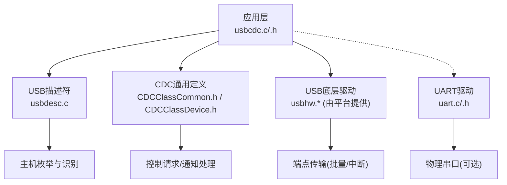
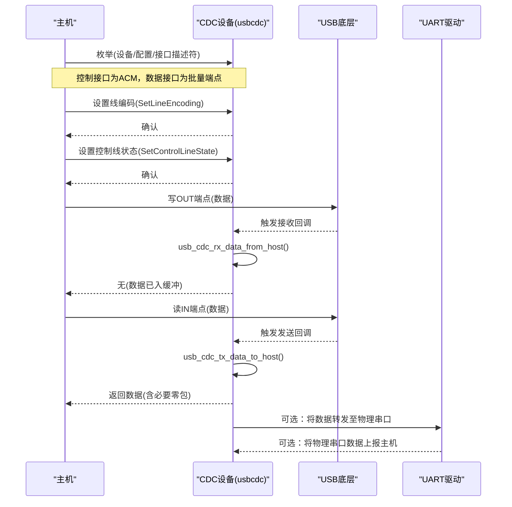
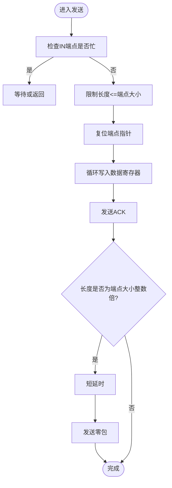
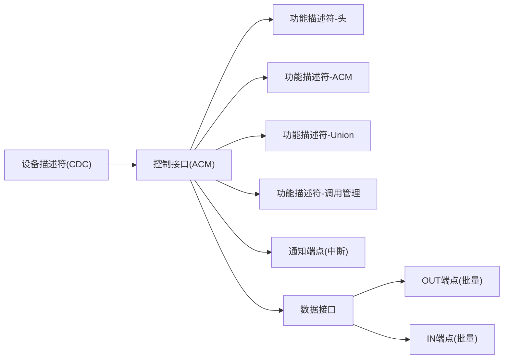
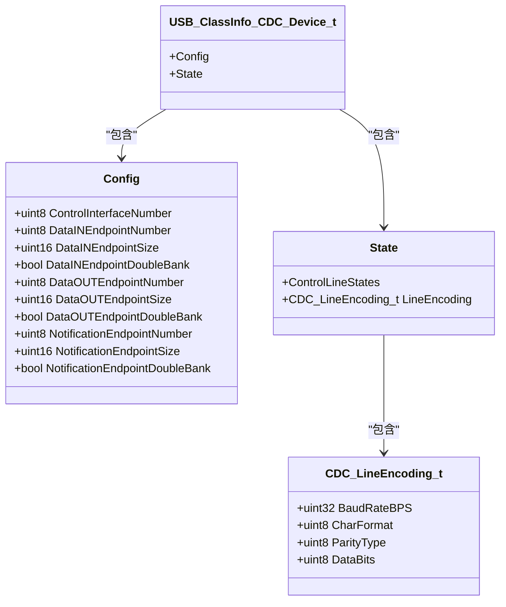
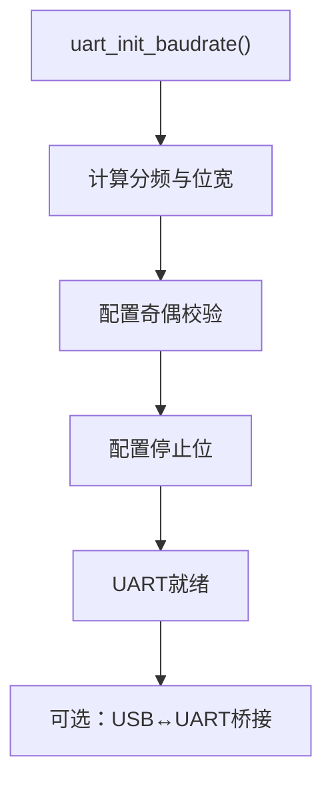
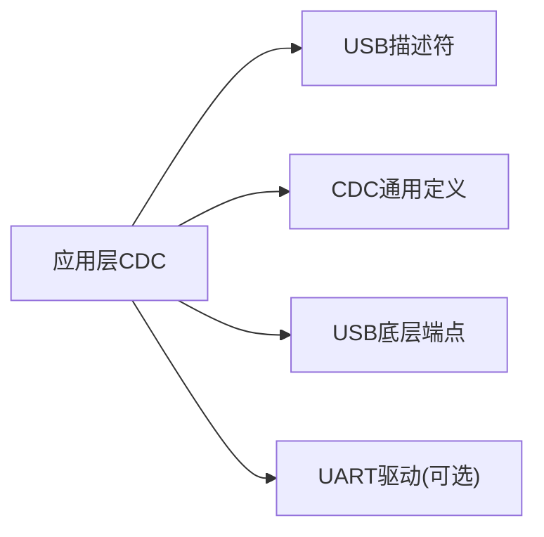

# CDC类设备

<cite>
**本文引用的文件**
- [usbcdc.c](file://tc_ble_single_sdk/application/app/usbcdc.c)
- [usbcdc.h](file://tc_ble_single_sdk/application/app/usbcdc.h)
- [usbcdc_i.h](file://tc_ble_single_sdk/application/app/usbcdc_i.h)
- [CDCClassCommon.h](file://tc_ble_single_sdk/application/usbstd/CDCClassCommon.h)
- [CDCClassDevice.h](file://tc_ble_single_sdk/application/usbstd/CDCClassDevice.h)
- [usbdesc.c](file://tc_ble_single_sdk/application/usbstd/usbdesc.c)
- [uart.c](file://tc_ble_single_sdk/drivers/B85/uart.c)
- [uart.h](file://tc_ble_single_sdk/drivers/B85/uart.h)
</cite>

## 目录
1. [简介](#简介)
2. [项目结构](#项目结构)
3. [核心组件](#核心组件)
4. [架构总览](#架构总览)
5. [详细组件分析](#详细组件分析)
6. [依赖关系分析](#依赖关系分析)
7. [性能考虑](#性能考虑)
8. [故障排除指南](#故障排除指南)
9. [结论](#结论)
10. [附录](#附录)

## 简介
本技术文档围绕该SDK中的USB CDC（通信设备类）实现，系统阐述虚拟串口的工作原理、控制接口与数据接口的配置与使用、串口参数设置、数据收发流程、流控机制、调试与诊断方法，以及兼容性测试与常见问题排查。读者可据此在B85平台上快速集成并稳定使用USB CDC虚拟串口功能。

## 项目结构
CDC相关代码主要分布在应用层与USB标准库中：
- 应用层CDC封装：usbcdc.c/.h/.i.h，提供上层调用的发送/接收API与端点常量定义
- USB描述符：usbdesc.c，声明CDC的接口、端点及ACM功能描述符
- CDC通用类型与请求：CDCClassCommon.h、CDCClassDevice.h，定义线编码、控制位、状态结构等
- UART驱动：uart.c/.h，提供硬件UART初始化、波特率计算、奇偶校验、停止位、RTS/CTS引脚映射等

图表来源
- [usbcdc.c:24-97](file://tc_ble_single_sdk/application/app/usbcdc.c#L24-L97)
- [usbdesc.c:304-410](file://tc_ble_single_sdk/application/usbstd/usbdesc.c#L304-L410)
- [CDCClassCommon.h:37-175](file://tc_ble_single_sdk/application/usbstd/CDCClassCommon.h#L37-L175)
- [CDCClassDevice.h:35-61](file://tc_ble_single_sdk/application/usbstd/CDCClassDevice.h#L35-L61)
- [uart.c:159-200](file://tc_ble_single_sdk/drivers/B85/uart.c#L159-L200)
- [uart.h:66-149](file://tc_ble_single_sdk/drivers/B85/uart.h#L66-L149)

章节来源
- [usbcdc.c:24-97](file://tc_ble_single_sdk/application/app/usbcdc.c#L24-L97)
- [usbdesc.c:304-410](file://tc_ble_single_sdk/application/usbstd/usbdesc.c#L304-L410)
- [CDCClassCommon.h:37-175](file://tc_ble_single_sdk/application/usbstd/CDCClassCommon.h#L37-L175)
- [CDCClassDevice.h:35-61](file://tc_ble_single_sdk/application/usbstd/CDCClassDevice.h#L35-L61)
- [uart.c:159-200](file://tc_ble_single_sdk/drivers/B85/uart.c#L159-L200)
- [uart.h:66-149](file://tc_ble_single_sdk/drivers/B85/uart.h#L66-L149)

## 核心组件
- CDC应用层封装
  - 端点与缓冲区：定义通知、数据IN/OUT端点号与大小，维护全局收发缓冲与长度
  - 发送函数：将数据写入IN端点，必要时发送零包以结束数据阶段
  - 接收函数：从OUT端点读取主机下发的数据，更新长度标志
- USB描述符
  - 设备类设置为CDC，包含控制接口（ACM）与数据接口
  - 声明通知端点（中断）、数据IN/OUT端点（批量），并配置端点大小
- CDC通用定义
  - 控制线状态位（DTR/RTS等）
  - 线编码结构（波特率、停止位、校验、数据位）
  - 设备状态结构（控制线状态、线编码）
- UART驱动
  - 初始化与波特率计算
  - 奇偶校验、停止位配置
  - RTS/CTS引脚映射与模式

章节来源
- [usbcdc.h:38-73](file://tc_ble_single_sdk/application/app/usbcdc.h#L38-L73)
- [usbcdc.c:31-93](file://tc_ble_single_sdk/application/app/usbcdc.c#L31-L93)
- [usbdesc.c:319-409](file://tc_ble_single_sdk/application/usbstd/usbdesc.c#L319-L409)
- [CDCClassCommon.h:37-175](file://tc_ble_single_sdk/application/usbstd/CDCClassCommon.h#L37-L175)
- [CDCClassDevice.h:35-61](file://tc_ble_single_sdk/application/usbstd/CDCClassDevice.h#L35-L61)
- [uart.c:159-200](file://tc_ble_single_sdk/drivers/B85/uart.c#L159-L200)
- [uart.h:66-149](file://tc_ble_single_sdk/drivers/B85/uart.h#L66-L149)

## 架构总览
CDC设备由“控制接口（ACM）+数据接口”组成。控制接口用于串口参数设置与控制信号；数据接口负责实际的数据传输。

图表来源
- [usbdesc.c:319-409](file://tc_ble_single_sdk/application/usbstd/usbdesc.c#L319-L409)
- [usbcdc.c:42-93](file://tc_ble_single_sdk/application/app/usbcdc.c#L42-L93)
- [CDCClassCommon.h:69-77](file://tc_ble_single_sdk/application/usbstd/CDCClassCommon.h#L69-L77)

## 详细组件分析

### CDC应用层封装（usbcdc.c/.h）
- 端点与常量
  - 通知端点：中断类型，用于序列状态通知
  - 数据IN端点：批量类型，设备到主机
  - 数据OUT端点：批量类型，主机到设备
  - 端点大小：通常为64字节
- 发送流程
  - 检查端点忙状态
  - 限制单次发送长度不超过端点大小
  - 复位端点指针并逐字节写入数据寄存器
  - 发送ACK；若长度为端点大小的整数倍，延时后发送零包以结束数据阶段
- 接收流程
  - 读取端点指针获取长度
  - 复位端点指针并循环读取数据寄存器到缓冲
  - 更新全局长度变量供上层处理

图表来源
- [usbcdc.c:42-73](file://tc_ble_single_sdk/application/app/usbcdc.c#L42-L73)

章节来源
- [usbcdc.h:38-73](file://tc_ble_single_sdk/application/app/usbcdc.h#L38-L73)
- [usbcdc.c:31-93](file://tc_ble_single_sdk/application/app/usbcdc.c#L31-L93)

### USB描述符与接口配置（usbdesc.c）
- 设备类：CDC
- 控制接口：ACM子类别，AT命令协议
- 功能描述符：
  - 头描述符（版本）
  - ACM能力描述符
  - Union描述符（关联控制与数据接口）
  - 调用管理描述符
- 数据接口：
  - 通知端点（中断，8字节）
  - 数据OUT端点（批量，64字节）
  - 数据IN端点（批量，64字节）

图表来源
- [usbdesc.c:319-409](file://tc_ble_single_sdk/application/usbstd/usbdesc.c#L319-L409)

章节来源
- [usbdesc.c:319-409](file://tc_ble_single_sdk/application/usbstd/usbdesc.c#L319-L409)

### CDC通用类型与请求（CDCClassCommon.h / CDCClassDevice.h）
- 控制线状态位
  - 输出：DTR、RTS
  - 输入：DCD、DSR、Break、Ring、帧错误、校验错误、溢出错误
- 线编码结构
  - 波特率、字符格式（停止位）、校验类型、数据位
- 设备状态结构
  - 控制线状态（主机到设备、设备到主机）
  - 当前线编码

图表来源
- [CDCClassCommon.h:169-175](file://tc_ble_single_sdk/application/usbstd/CDCClassCommon.h#L169-L175)
- [CDCClassDevice.h:35-61](file://tc_ble_single_sdk/application/usbstd/CDCClassDevice.h#L35-L61)

章节来源
- [CDCClassCommon.h:37-175](file://tc_ble_single_sdk/application/usbstd/CDCClassCommon.h#L37-L175)
- [CDCClassDevice.h:35-61](file://tc_ble_single_sdk/application/usbstd/CDCClassDevice.h#L35-L61)

### UART驱动与虚拟串口的关系（uart.c/.h）
- 初始化与波特率
  - 根据系统时钟与目标波特率计算分频与位宽
  - 配置奇偶校验与停止位
- 引脚映射
  - TX/RX/RTS/CTS引脚选择
- 与CDC的关系
  - CDC通过USB向主机暴露虚拟串口
  - 可将USB数据桥接到物理UART，或将物理UART数据上报主机，实现“USB虚拟串口 ↔ 物理串口”的双向透传

图表来源
- [uart.c:159-200](file://tc_ble_single_sdk/drivers/B85/uart.c#L159-L200)
- [uart.h:66-149](file://tc_ble_single_sdk/drivers/B85/uart.h#L66-L149)

章节来源
- [uart.c:159-200](file://tc_ble_single_sdk/drivers/B85/uart.c#L159-L200)
- [uart.h:66-149](file://tc_ble_single_sdk/drivers/B85/uart.h#L66-L149)

## 依赖关系分析
- 应用层CDC依赖USB描述符以完成枚举与接口发现
- CDC通用定义提供控制请求与数据结构
- 数据收发依赖USB底层端点操作（由平台驱动提供）
- 可选地依赖UART驱动进行物理串口桥接

图表来源
- [usbcdc.c:24-97](file://tc_ble_single_sdk/application/app/usbcdc.c#L24-L97)
- [usbdesc.c:319-409](file://tc_ble_single_sdk/application/usbstd/usbdesc.c#L319-L409)
- [CDCClassCommon.h:37-175](file://tc_ble_single_sdk/application/usbstd/CDCClassCommon.h#L37-L175)
- [uart.c:159-200](file://tc_ble_single_sdk/drivers/B85/uart.c#L159-L200)

章节来源
- [usbcdc.c:24-97](file://tc_ble_single_sdk/application/app/usbcdc.c#L24-L97)
- [usbdesc.c:319-409](file://tc_ble_single_sdk/application/usbstd/usbdesc.c#L319-L409)
- [CDCClassCommon.h:37-175](file://tc_ble_single_sdk/application/usbstd/CDCClassCommon.h#L37-L175)
- [uart.c:159-200](file://tc_ble_single_sdk/drivers/B85/uart.c#L159-L200)

## 性能考虑
- 端点大小与零包
  - 当发送数据长度为端点大小的整数倍时，需发送零包以结束数据阶段，避免主机误判数据未结束
- 批量传输吞吐
  - 合理批量化发送，减少频繁ACK开销
- 接收缓冲
  - 及时读取OUT端点数据，避免覆盖或丢包
- 与UART桥接
  - 若启用USB↔UART桥接，注意两端速率匹配与FIFO深度，避免瓶颈

[本节为通用指导，不直接分析具体文件]

## 故障排除指南
- 主机无法识别为CDC设备
  - 检查设备类与接口描述符是否正确（CDC类、ACM子类别、Union描述符）
  - 确认IN/OUT端点类型为批量，通知端点为中断且大小正确
- 无法设置波特率或出现乱码
  - 检查SetLineEncoding是否被正确处理
  - 核对线编码字段（波特率、停止位、校验、数据位）
- 发送卡住或主机未收到数据
  - 确认IN端点未被占用；发送前检查端点忙状态
  - 若发送长度为端点大小整数倍，确保发送了零包
- 接收不到数据
  - 确认OUT端点有数据到达并已读取；检查长度标志是否更新
- 流控异常
  - 检查DTR/RTS控制线状态是否按预期变化
  - 若使用硬件RTS/CTS，确认引脚映射与模式配置正确

章节来源
- [usbdesc.c:319-409](file://tc_ble_single_sdk/application/usbstd/usbdesc.c#L319-L409)
- [CDCClassCommon.h:37-77](file://tc_ble_single_sdk/application/usbstd/CDCClassCommon.h#L37-L77)
- [usbcdc.c:42-93](file://tc_ble_single_sdk/application/app/usbcdc.c#L42-L93)
- [uart.h:82-149](file://tc_ble_single_sdk/drivers/B85/uart.h#L82-L149)

## 结论
该SDK提供了完整的CDC虚拟串口实现，涵盖控制接口与数据接口的描述符配置、端点传输、线编码与控制线状态管理，并可扩展至物理UART桥接。遵循本文的配置与流程说明，可实现稳定可靠的USB虚拟串口通信，便于调试、日志输出与诊断工具集成。

[本节为总结性内容，不直接分析具体文件]

## 附录

### 串口参数设置与使用
- 线编码（波特率、停止位、校验、数据位）
  - 通过CDC控制请求设置与查询
  - 设备内部维护线编码状态
- 控制线状态
  - DTR/RTS用于握手与流控
  - 设备可上报DCD/DSR/错误状态

章节来源
- [CDCClassCommon.h:37-77](file://tc_ble_single_sdk/application/usbstd/CDCClassCommon.h#L37-L77)
- [CDCClassDevice.h:51-61](file://tc_ble_single_sdk/application/usbstd/CDCClassDevice.h#L51-L61)

### 数据收发与流控机制
- 发送
  - 检查端点忙 → 写入数据 → ACK → 必要时发送零包
- 接收
  - 读取端点长度 → 拷贝数据 → 更新长度标志
- 流控
  - 软件层面可通过DTR/RTS协调
  - 硬件层面可使用UART的RTS/CTS引脚

章节来源
- [usbcdc.c:42-93](file://tc_ble_single_sdk/application/app/usbcdc.c#L42-L93)
- [uart.h:82-149](file://tc_ble_single_sdk/drivers/B85/uart.h#L82-L149)

### 调试与诊断
- 使用终端工具（如PuTTY、Tera Term）连接虚拟串口
- 观察控制线状态变化与波特率切换
- 若启用USB↔UART桥接，可在物理串口侧抓包验证

[本节为通用指导，不直接分析具体文件]

### 兼容性测试建议
- 多操作系统测试（Windows、Linux、macOS）
- 不同终端软件与驱动版本
- 高吞吐场景下的稳定性与丢包率评估

[本节为通用指导，不直接分析具体文件]