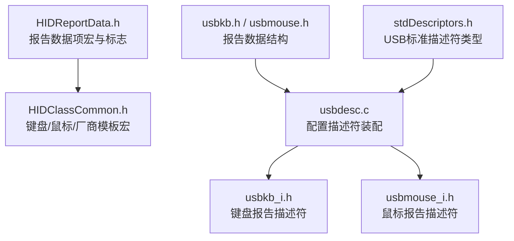
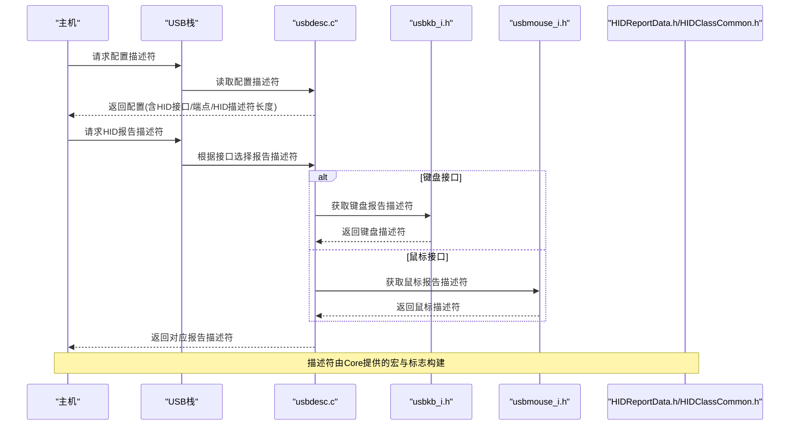
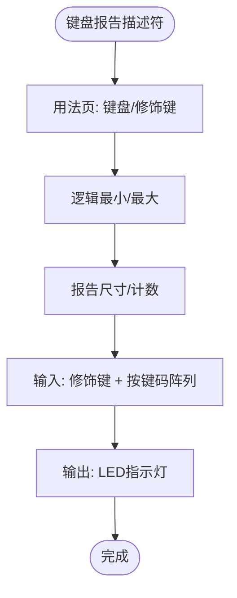
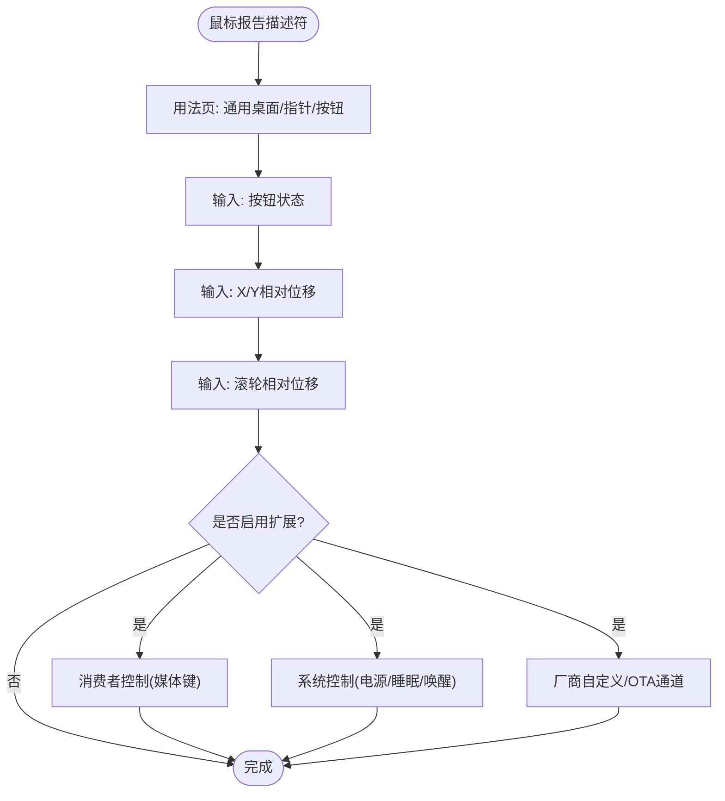
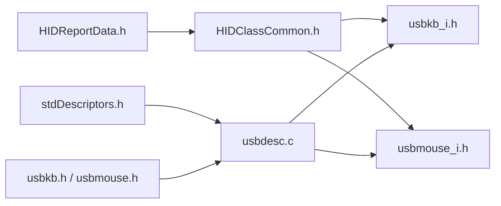

# HID报告描述符

<cite>
**本文引用的文件**
- [HIDClassCommon.h](file://tc_ble_single_sdk/application/usbstd/HIDClassCommon.h)
- [HIDReportData.h](file://tc_ble_single_sdk/application/usbstd/HIDReportData.h)
- [usbdesc.c](file://tc_ble_single_sdk/application/usbstd/usbdesc.c)
- [usbkb_i.h](file://tc_ble_single_sdk/application/app/usbkb_i.h)
- [usbmouse_i.h](file://tc_ble_single_sdk/application/app/usbmouse_i.h)
- [usbkb.h](file://tc_ble_single_sdk/application/app/usbkb.h)
- [usbmouse.h](file://tc_ble_single_sdk/application/app/usbmouse.h)
- [stdDescriptors.h](file://tc_ble_single_sdk/application/usbstd/stdDescriptors.h)
</cite>

## 目录
1. [简介](#简介)
2. [项目结构](#项目结构)
3. [核心组件](#核心组件)
4. [架构总览](#架构总览)
5. [详细组件分析](#详细组件分析)
6. [依赖关系分析](#依赖关系分析)
7. [性能考虑](#性能考虑)
8. [故障排查指南](#故障排查指南)
9. [结论](#结论)
10. [附录](#附录)

## 简介
本技术文档围绕HID（Human Interface Device）报告描述符，结合仓库中的实现，系统阐述：
- HID报告描述符的语法结构与数据项类型、嵌套规则
- 输入报告、输出报告与特性报告的描述符定义方法
- 标准设备类（键盘、鼠标）的报告描述符模板与扩展方式
- 自定义设备的描述符设计指南
- 报告描述符验证工具、调试方法与兼容性测试策略
- 不同操作系统下的解析差异与解决方案

## 项目结构
本项目在USB栈中通过统一的描述符装配层将HID接口、端点与报告描述符组合起来。关键路径如下：
- 通用宏与数据类型：HID报告数据项宏、IO标志位、枚举等
- 设备配置描述符：包含HID接口、HID描述符、中断端点等
- 具体HID报告描述符：键盘、鼠标、媒体键、系统控制、厂商自定义等
- 应用层数据结构：键盘/鼠标报告的数据结构定义

图表来源
- [HIDReportData.h:26-111](file://tc_ble_single_sdk/application/usbstd/HIDReportData.h#L26-L111)
- [HIDClassCommon.h:266-372](file://tc_ble_single_sdk/application/usbstd/HIDClassCommon.h#L266-L372)
- [usbdesc.c:668-712](file://tc_ble_single_sdk/application/usbstd/usbdesc.c#L668-L712)
- [usbkb_i.h:35-45](file://tc_ble_single_sdk/application/app/usbkb_i.h#L35-L45)
- [usbmouse_i.h:248-449](file://tc_ble_single_sdk/application/app/usbmouse_i.h#L248-L449)
- [usbkb.h:50-57](file://tc_ble_single_sdk/application/app/usbkb.h#L50-L57)
- [usbmouse.h:40-50](file://tc_ble_single_sdk/application/app/usbmouse.h#L40-L50)
- [stdDescriptors.h:52-78](file://tc_ble_single_sdk/application/usbstd/stdDescriptors.h#L52-L78)

章节来源
- [usbdesc.c:668-712](file://tc_ble_single_sdk/application/usbstd/usbdesc.c#L668-L712)
- [HIDReportData.h:26-111](file://tc_ble_single_sdk/application/usbstd/HIDReportData.h#L26-L111)
- [HIDClassCommon.h:266-372](file://tc_ble_single_sdk/application/usbstd/HIDClassCommon.h#L266-L372)

## 核心组件
- 报告数据项与标志
  - 主项、全局项、本地项三类数据项，以及输入/输出/集合/特性/结束集合等主项
  - IO标志位：数据/常量、变量/数组、相对/绝对、包装/非包装、线性/非线性、首选状态、空位置、易失/非易失、缓冲字节、位域
- 键盘/鼠标/厂商模板宏
  - 提供键盘、鼠标、摇杆、厂商自定义等常用模板，便于快速生成报告描述符
- 配置描述符装配
  - 在配置描述符中声明HID接口、HID描述符（指向报告描述符）、中断端点
- 报告数据结构
  - 键盘报告：修饰键、保留位、按键码数组
  - 鼠标报告：按钮、X/Y/Wheel等

章节来源
- [HIDReportData.h:51-111](file://tc_ble_single_sdk/application/usbstd/HIDReportData.h#L51-L111)
- [HIDClassCommon.h:295-372](file://tc_ble_single_sdk/application/usbstd/HIDClassCommon.h#L295-L372)
- [usbkb.h:50-57](file://tc_ble_single_sdk/application/app/usbkb.h#L50-L57)
- [usbmouse.h:40-50](file://tc_ble_single_sdk/application/app/usbmouse.h#L40-L50)

## 架构总览
下图展示从配置描述符到具体报告描述符的装配关系，以及各模块的职责边界。

图表来源
- [usbdesc.c:668-712](file://tc_ble_single_sdk/application/usbstd/usbdesc.c#L668-L712)
- [usbkb_i.h:35-45](file://tc_ble_single_sdk/application/app/usbkb_i.h#L35-L45)
- [usbmouse_i.h:248-449](file://tc_ble_single_sdk/application/app/usbmouse_i.h#L248-L449)
- [HIDReportData.h:26-111](file://tc_ble_single_sdk/application/usbstd/HIDReportData.h#L26-L111)
- [HIDClassCommon.h:266-372](file://tc_ble_single_sdk/application/usbstd/HIDClassCommon.h#L266-L372)

## 详细组件分析

### 键盘报告描述符（标准Boot键盘）
- 使用模板宏构建，包含：
  - 用法页：键盘/修饰键
  - 逻辑最小/最大、报告尺寸/计数
  - 输入项：修饰键、按键码阵列
  - 输出项：LED指示灯
- 特点：符合Boot协议，兼容性好；支持多键同时上报

图表来源
- [HIDClassCommon.h:295-324](file://tc_ble_single_sdk/application/usbstd/HIDClassCommon.h#L295-L324)
- [usbkb_i.h:35-45](file://tc_ble_single_sdk/application/app/usbkb_i.h#L35-L45)

章节来源
- [HIDClassCommon.h:295-324](file://tc_ble_single_sdk/application/usbstd/HIDClassCommon.h#L295-L324)
- [usbkb_i.h:35-45](file://tc_ble_single_sdk/application/app/usbkb_i.h#L35-L45)

### 鼠标报告描述符（带滚轮与媒体/系统控制）
- 基础部分：
  - 用法页：通用桌面、指针、按钮
  - 输入项：按钮状态、X/Y相对位移、滚轮相对位移
- 扩展部分：
  - 消费者控制（媒体键）
  - 系统控制（电源/睡眠/唤醒）
  - 厂商自定义或OTA命令通道（特性/输入/输出）
- 注意：
  - 相对坐标需设置相对标志
  - 填充位用于对齐字节边界

图表来源
- [usbmouse_i.h:248-449](file://tc_ble_single_sdk/application/app/usbmouse_i.h#L248-L449)

章节来源
- [usbmouse_i.h:248-449](file://tc_ble_single_sdk/application/app/usbmouse_i.h#L248-L449)

### 特性报告（Feature Report）
- 用途：用于设备与主机之间的可配置参数交换（如校准、模式切换）
- 在本项目中，鼠标描述符包含特性项，用于特定功能配置
- 注意事项：
  - 特性项需在描述符中明确声明
  - 主机通过Get/Set Report请求访问

章节来源
- [usbmouse_i.h:418-447](file://tc_ble_single_sdk/application/app/usbmouse_i.h#L418-L447)

### 厂商自定义报告（Vendor Defined）
- 通过厂商用法页（0xFFxx）定义私有协议
- 常见用途：扩展功能、调试、OTA升级、音频HOGP等
- 示例：
  - 音频HOGP报告描述符（多Report ID、输入/输出）
  - OTA命令通道（输入/输出/特性）

章节来源
- [usbkb_i.h:47-130](file://tc_ble_single_sdk/application/app/usbkb_i.h#L47-L130)
- [usbmouse_i.h:457-501](file://tc_ble_single_sdk/application/app/usbmouse_i.h#L457-L501)

### 配置描述符装配（HID接口与端点）
- 在配置描述符中为每个HID接口声明：
  - 接口类/子类/协议（键盘/鼠标Boot协议）
  - HID描述符（指向报告描述符及其长度）
  - 中断端点（方向、大小、轮询间隔）
- 关键点：
  - 报告描述符长度必须与实际一致
  - 端点大小与轮询间隔影响吞吐与延迟

章节来源
- [usbdesc.c:668-712](file://tc_ble_single_sdk/application/usbstd/usbdesc.c#L668-L712)

## 依赖关系分析
- 低层宏与标志：HIDReportData.h
- 模板与枚举：HIDClassCommon.h
- 配置装配：usbdesc.c
- 具体报告：usbkb_i.h、usbmouse_i.h
- 数据结构：usbkb.h、usbmouse.h
- 标准类型：stdDescriptors.h

图表来源
- [HIDReportData.h:26-111](file://tc_ble_single_sdk/application/usbstd/HIDReportData.h#L26-L111)
- [HIDClassCommon.h:266-372](file://tc_ble_single_sdk/application/usbstd/HIDClassCommon.h#L266-L372)
- [usbdesc.c:668-712](file://tc_ble_single_sdk/application/usbstd/usbdesc.c#L668-L712)
- [usbkb_i.h:35-45](file://tc_ble_single_sdk/application/app/usbkb_i.h#L35-L45)
- [usbmouse_i.h:248-449](file://tc_ble_single_sdk/application/app/usbmouse_i.h#L248-L449)
- [usbkb.h:50-57](file://tc_ble_single_sdk/application/app/usbkb.h#L50-L57)
- [usbmouse.h:40-50](file://tc_ble_single_sdk/application/app/usbmouse.h#L40-L50)
- [stdDescriptors.h:52-78](file://tc_ble_single_sdk/application/usbstd/stdDescriptors.h#L52-L78)

## 性能考虑
- 报告尺寸与轮询间隔
  - 过大的报告或过短的轮询间隔会增加带宽占用与CPU负载
  - 建议按实际数据量调整端点大小与轮询间隔
- 相对坐标与填充位
  - 合理设置相对/绝对标志与填充位，避免多余数据传输
- 多Report ID
  - 将不同功能拆分到不同Report ID，减少无效字段传输
- 厂商自定义通道
  - 谨慎使用大报文，必要时分片传输

[本节为通用指导，不直接分析具体文件]

## 故障排查指南
- 常见问题
  - 报告描述符长度与声明不一致：导致主机解析失败
  - 端点大小不匹配：造成数据截断或溢出
  - 相对/绝对标志错误：导致鼠标移动异常
  - Report ID未正确分配：主机无法区分不同报告
- 调试方法
  - 使用USB抓包工具（如Wireshark、USBlyzer）抓取HID描述符与报告
  - 逐步简化描述符，定位问题项
  - 检查IO标志位与逻辑范围是否合理
- 兼容性测试策略
  - 在Windows、macOS、Linux下分别测试键盘/鼠标/媒体键/系统控制
  - 对厂商自定义通道进行跨平台验证
  - 关注不同系统的默认行为差异（如滚动方向、媒体键映射）

章节来源
- [usbdesc.c:668-712](file://tc_ble_single_sdk/application/usbstd/usbdesc.c#L668-L712)
- [usbmouse_i.h:248-449](file://tc_ble_single_sdk/application/app/usbmouse_i.h#L248-L449)
- [usbkb_i.h:35-45](file://tc_ble_single_sdk/application/app/usbkb_i.h#L35-L45)

## 结论
本项目通过模块化宏与模板实现了标准化的HID报告描述符构建，覆盖键盘、鼠标、媒体键、系统控制及厂商自定义场景。借助清晰的配置装配与数据结构定义，开发者可快速扩展新设备功能。建议在设计与调试过程中严格遵循HID规范，结合抓包与跨平台测试确保兼容性。

[本节为总结性内容，不直接分析具体文件]

## 附录
- 报告描述符语法要点
  - 主项：Input/Output/Collection/Feature/End Collection
  - 全局项：Usage Page/Logical Min/Max/Physical Min/Max/Unit Exponent/Unit/Report Size/Report ID/Report Count/Push/Pop
  - 本地项：Usage/Usage Minimum/Usage Maximum
- 嵌套规则
  - Collection需成对出现，内部可嵌套多个子集合
  - 全局项在集合内有效，离开后恢复上次值
- 验证工具推荐
  - USB协议分析仪（Wireshark、USBlyzer、Bus Hound）
  - HID描述符在线解析器（基于HID规范）
- 不同操作系统差异与解决
  - Windows：对Boot协议支持良好，厂商自定义需驱动配合
  - macOS：对媒体键与系统控制有特定映射，需按规范定义
  - Linux：内核HID子系统较灵活，但需注意轮询间隔与端点大小

[本节为概念性内容，不直接分析具体文件]