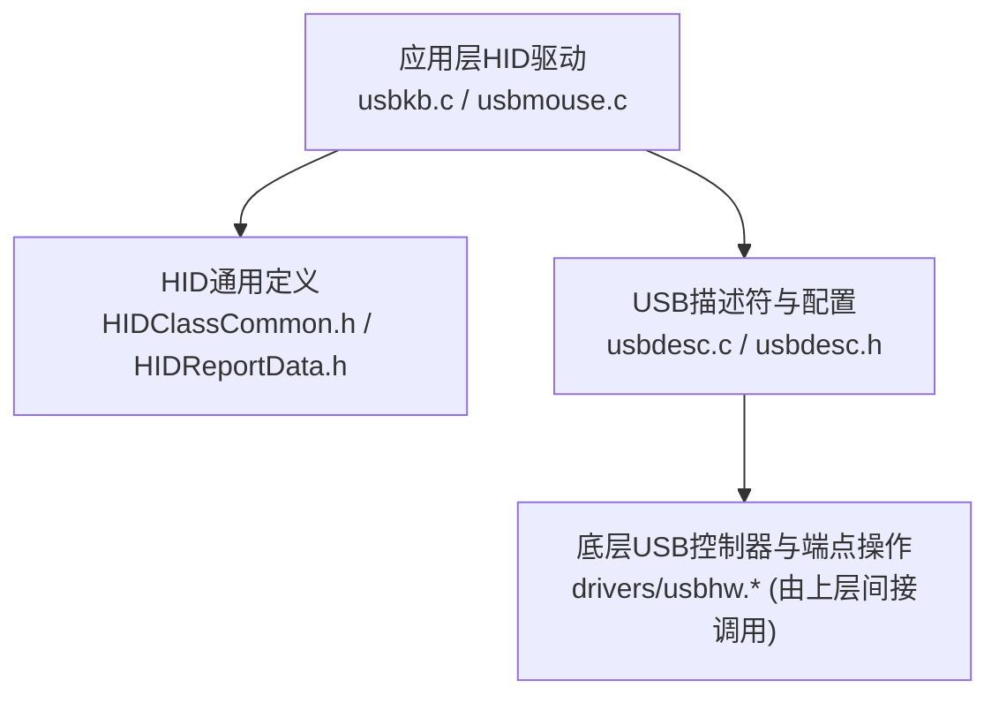
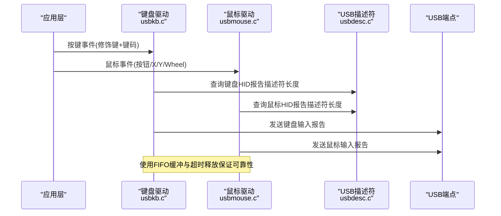
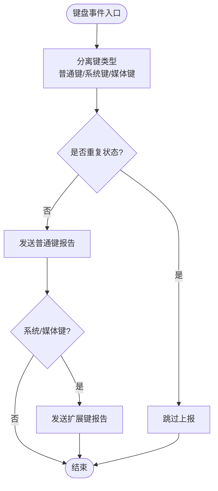
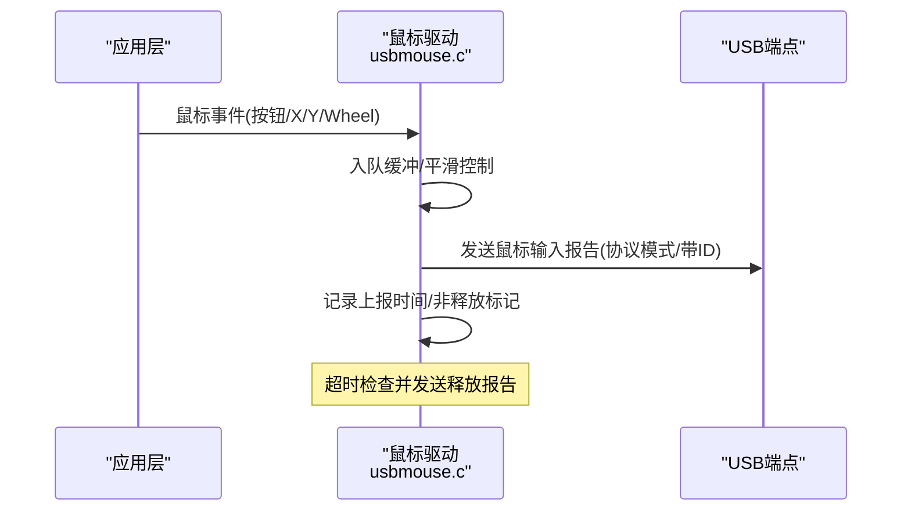
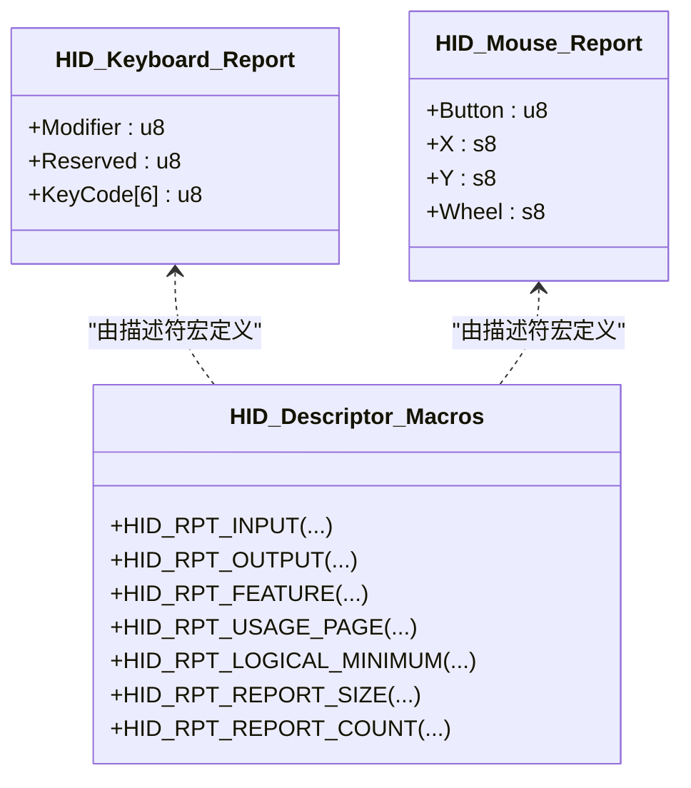
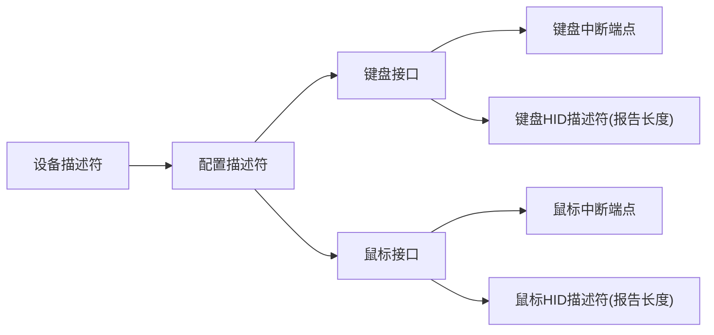
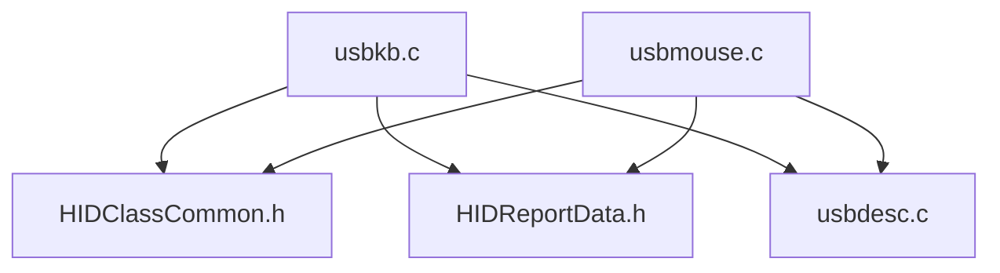

# HID类设备

<cite>
**本文引用的文件**
- [usbkb.c](file://tc_ble_single_sdk/application/app/usbkb.c)
- [usbmouse.c](file://tc_ble_single_sdk/application/app/usbmouse.c)
- [usbkb.h](file://tc_ble_single_sdk/application/app/usbkb.h)
- [usbmouse.h](file://tc_ble_single_sdk/application/app/usbmouse.h)
- [HIDClassCommon.h](file://tc_ble_single_sdk/application/usbstd/HIDClassCommon.h)
- [HIDReportData.h](file://tc_ble_single_sdk/application/usbstd/HIDReportData.h)
- [usbdesc.c](file://tc_ble_single_sdk/application/usbstd/usbdesc.c)
- [usbdesc.h](file://tc_ble_single_sdk/application/usbstd/usbdesc.h)
</cite>

## 目录
1. [简介](#简介)
2. [项目结构](#项目结构)
3. [核心组件](#核心组件)
4. [架构总览](#架构总览)
5. [详细组件分析](#详细组件分析)
6. [依赖关系分析](#依赖关系分析)
7. [性能考虑](#性能考虑)
8. [故障排查指南](#故障排查指南)
9. [结论](#结论)
10. [附录](#附录)

## 简介
本技术文档围绕HID（Human Interface Device）类设备的实现，聚焦于报告描述符定义、输入/输出与特性报告的生成与处理，以及鼠标与键盘设备的报告格式、数据结构与事件处理机制。同时涵盖HID设备初始化、报告发送与接收流程、电源管理与休眠唤醒策略、错误处理机制，并提供兼容性测试与调试方法建议。

## 项目结构
本项目在USB HID相关实现上采用分层组织：
- 应用层HID驱动：键盘与鼠标的报告封装、去抖与释放逻辑、队列缓冲与端点发送。
- USB描述符与配置：设备、配置、接口、端点与HID报告描述符的声明与组装。
- HID通用宏与类型：HID报告项编码宏、标准键码与修饰键常量、HID请求与描述符类型等。

图表来源
- [usbkb.c:1-390](file://tc_ble_single_sdk/application/app/usbkb.c#L1-L390)
- [usbmouse.c:1-157](file://tc_ble_single_sdk/application/app/usbmouse.c#L1-L157)
- [HIDClassCommon.h:295-372](file://tc_ble_single_sdk/application/usbstd/HIDClassCommon.h#L295-L372)
- [HIDReportData.h:71-110](file://tc_ble_single_sdk/application/usbstd/HIDReportData.h#L71-L110)
- [usbdesc.c:668-712](file://tc_ble_single_sdk/application/usbstd/usbdesc.c#L668-L712)

章节来源
- [usbkb.c:1-390](file://tc_ble_single_sdk/application/app/usbkb.c#L1-L390)
- [usbmouse.c:1-157](file://tc_ble_single_sdk/application/app/usbmouse.c#L1-L157)
- [HIDClassCommon.h:295-372](file://tc_ble_single_sdk/application/usbstd/HIDClassCommon.h#L295-L372)
- [HIDReportData.h:71-110](file://tc_ble_single_sdk/application/usbstd/HIDReportData.h#L71-L110)
- [usbdesc.c:668-712](file://tc_ble_single_sdk/application/usbstd/usbdesc.c#L668-L712)

## 核心组件
- 键盘HID驱动（usbkb.c/.h）：负责按键扫描结果到HID输入报告的转换、修饰键与扩展键（系统/媒体）分离、重复检测与超时释放、FIFO缓冲与端点发送。
- 鼠标HID驱动（usbmouse.c/.h）：负责鼠标移动、滚轮与按键状态打包为HID输入报告，支持平滑上报与超时释放。
- HID通用定义（HIDClassCommon.h、HIDReportData.h）：提供HID报告描述符宏、输入/输出/特性项标志、标准键码与修饰键常量。
- USB描述符（usbdesc.c/.h）：声明设备、配置、接口、端点及HID报告描述符长度，并暴露获取各描述符的接口。

章节来源
- [usbkb.h:38-61](file://tc_ble_single_sdk/application/app/usbkb.h#L38-L61)
- [usbmouse.h:40-50](file://tc_ble_single_sdk/application/app/usbmouse.h#L40-L50)
- [HIDClassCommon.h:35-46](file://tc_ble_single_sdk/application/usbstd/HIDClassCommon.h#L35-L46)
- [HIDReportData.h:51-110](file://tc_ble_single_sdk/application/usbstd/HIDReportData.h#L51-L110)
- [usbdesc.h:69-81](file://tc_ble_single_sdk/application/usbstd/usbdesc.h#L69-L81)

## 架构总览
HID数据流从应用层采集事件开始，经驱动层转换为HID报告，再通过USB中断端点发送给主机。描述符层向主机声明设备能力与报告格式。

图表来源
- [usbkb.c:150-213](file://tc_ble_single_sdk/application/app/usbkb.c#L150-L213)
- [usbmouse.c:107-151](file://tc_ble_single_sdk/application/app/usbmouse.c#L107-L151)
- [usbdesc.c:668-712](file://tc_ble_single_sdk/application/usbstd/usbdesc.c#L668-L712)

## 详细组件分析

### 键盘HID驱动（usbkb.c/.h）
- 报告结构与格式
  - 输入报告包含修饰键字节、保留字节与最多6个键码数组。
  - 通过HIDClassCommon中的键盘描述符宏定义输入项布局。
- 事件处理机制
  - 将按键分为普通键、系统键与媒体键三类；系统/媒体键通过专用通道上报。
  - 重复检测避免连续相同状态重复上报；超时未释放时强制发送释放报告。
  - FIFO缓冲用于端点忙时的异步排队，防止丢包。
- 端点发送
  - 直接写入端点数据寄存器并置ACK，维护数据令牌翻转。
  - 可选软件CRC校验路径（按编译选项）。

图表来源
- [usbkb.c:135-148](file://tc_ble_single_sdk/application/app/usbkb.c#L135-L148)
- [usbkb.c:306-337](file://tc_ble_single_sdk/application/app/usbkb.c#L306-L337)
- [usbkb.c:150-213](file://tc_ble_single_sdk/application/app/usbkb.c#L150-L213)

章节来源
- [usbkb.c:82-132](file://tc_ble_single_sdk/application/app/usbkb.c#L82-L132)
- [usbkb.c:150-213](file://tc_ble_single_sdk/application/app/usbkb.c#L150-L213)
- [usbkb.c:279-337](file://tc_ble_single_sdk/application/app/usbkb.c#L279-L337)
- [usbkb.h:50-61](file://tc_ble_single_sdk/application/app/usbkb.h#L50-L61)
- [HIDClassCommon.h:295-324](file://tc_ble_single_sdk/application/usbstd/HIDClassCommon.h#L295-L324)

### 鼠标HID驱动（usbmouse.c/.h）
- 报告结构与格式
  - 输入报告包含按钮位、X/Y位移与滚轮增量，长度为固定字节数。
  - 支持协议模式（无report_id）与带report_id的模式切换。
- 事件处理机制
  - 队列缓冲多帧鼠标数据，批量上报以减少CPU占用。
  - 平滑上报开关可限制高频上报频率，提升体验。
  - 超时释放：若持续有按键或移动，超时后发送零报告确保主机状态一致。
- 端点发送
  - 根据协议模式选择是否携带report_id，写入端点后置ACK并翻转数据令牌。

图表来源
- [usbmouse.c:44-98](file://tc_ble_single_sdk/application/app/usbmouse.c#L44-L98)
- [usbmouse.c:107-151](file://tc_ble_single_sdk/application/app/usbmouse.c#L107-L151)

章节来源
- [usbmouse.c:44-98](file://tc_ble_single_sdk/application/app/usbmouse.c#L44-L98)
- [usbmouse.c:107-151](file://tc_ble_single_sdk/application/app/usbmouse.c#L107-L151)
- [usbmouse.h:40-50](file://tc_ble_single_sdk/application/app/usbmouse.h#L40-L50)
- [HIDClassCommon.h:326-354](file://tc_ble_single_sdk/application/usbstd/HIDClassCommon.h#L326-L354)

### HID报告描述符与数据项
- 键盘描述符：包含修饰键输入、LED输出（Caps/Num/Scroll）、键码数组输入。
- 鼠标描述符：包含按钮输入、X/Y相对坐标输入、滚轮输入。
- 报告项宏：提供Input/Output/Feature、Usage Page/Usage、Logical/Physical范围、Report Size/Count等构建块。

图表来源
- [HIDClassCommon.h:295-324](file://tc_ble_single_sdk/application/usbstd/HIDClassCommon.h#L295-L324)
- [HIDClassCommon.h:326-354](file://tc_ble_single_sdk/application/usbstd/HIDClassCommon.h#L326-L354)
- [HIDReportData.h:71-110](file://tc_ble_single_sdk/application/usbstd/HIDReportData.h#L71-L110)

章节来源
- [HIDClassCommon.h:295-372](file://tc_ble_single_sdk/application/usbstd/HIDClassCommon.h#L295-L372)
- [HIDReportData.h:71-110](file://tc_ble_single_sdk/application/usbstd/HIDReportData.h#L71-L110)

### USB描述符与接口配置
- 设备与配置：声明设备版本、类/子类/协议、最大包长、供电等。
- 接口与端点：键盘与鼠标各自独立接口，使用中断端点，指定轮询间隔。
- HID描述符引用：通过HID描述符结构体指向具体报告描述符长度。

图表来源
- [usbdesc.c:234-266](file://tc_ble_single_sdk/application/usbstd/usbdesc.c#L234-L266)
- [usbdesc.c:668-712](file://tc_ble_single_sdk/application/usbstd/usbdesc.c#L668-L712)
- [usbdesc.h:346-364](file://tc_ble_single_sdk/application/usbstd/usbdesc.h#L346-L364)

章节来源
- [usbdesc.c:234-266](file://tc_ble_single_sdk/application/usbstd/usbdesc.c#L234-L266)
- [usbdesc.c:668-712](file://tc_ble_single_sdk/application/usbstd/usbdesc.c#L668-L712)
- [usbdesc.h:346-364](file://tc_ble_single_sdk/application/usbstd/usbdesc.h#L346-L364)

## 依赖关系分析
- 键盘驱动依赖：
  - HIDClassCommon.h：键码、修饰键、HID描述符宏。
  - usbdesc.c：键盘接口与端点配置。
  - 底层USB端点操作：通过寄存器写入数据与控制位。
- 鼠标驱动依赖：
  - HIDClassCommon.h：鼠标描述符宏。
  - usbdesc.c：鼠标接口与端点配置。
  - 底层USB端点操作：同上。
- 共同依赖：
  - HIDReportData.h：报告项编码宏。
  - 公共FIFO与时间管理：用于缓冲与超时释放。

图表来源
- [usbkb.c:1-390](file://tc_ble_single_sdk/application/app/usbkb.c#L1-L390)
- [usbmouse.c:1-157](file://tc_ble_single_sdk/application/app/usbmouse.c#L1-L157)
- [HIDClassCommon.h:295-372](file://tc_ble_single_sdk/application/usbstd/HIDClassCommon.h#L295-L372)
- [HIDReportData.h:71-110](file://tc_ble_single_sdk/application/usbstd/HIDReportData.h#L71-L110)
- [usbdesc.c:668-712](file://tc_ble_single_sdk/application/usbstd/usbdesc.c#L668-L712)

章节来源
- [usbkb.c:1-390](file://tc_ble_single_sdk/application/app/usbkb.c#L1-L390)
- [usbmouse.c:1-157](file://tc_ble_single_sdk/application/app/usbmouse.c#L1-L157)
- [HIDClassCommon.h:295-372](file://tc_ble_single_sdk/application/usbstd/HIDClassCommon.h#L295-L372)
- [HIDReportData.h:71-110](file://tc_ble_single_sdk/application/usbstd/HIDReportData.h#L71-L110)
- [usbdesc.c:668-712](file://tc_ble_single_sdk/application/usbstd/usbdesc.c#L668-L712)

## 性能考虑
- 端点忙时采用FIFO缓冲，避免阻塞主循环；当缓冲区溢出时丢弃旧数据以保证实时性。
- 键盘重复检测减少不必要上报；鼠标平滑上报降低CPU与总线负载。
- 超时释放机制确保主机状态一致性，避免“粘键”问题。
- 可选软件CRC校验路径可根据平台能力启用以提升鲁棒性。

## 故障排查指南
- 现象：按键卡住或鼠标不释放
  - 检查超时释放逻辑是否触发，确认上报时间与释放条件。
  - 参考键盘释放检查与鼠标释放检查函数路径。
- 现象：主机识别不到HID设备
  - 核对设备/配置/接口/端点描述符是否正确，确认HID描述符长度与端点大小匹配。
- 现象：上报数据异常
  - 检查报告结构是否与描述符一致；确认修饰键与键码数组长度。
  - 验证协议模式（是否携带report_id）与端点数据写入顺序。

章节来源
- [usbkb.c:127-132](file://tc_ble_single_sdk/application/app/usbkb.c#L127-L132)
- [usbmouse.c:59-67](file://tc_ble_single_sdk/application/app/usbmouse.c#L59-L67)
- [usbdesc.c:668-712](file://tc_ble_single_sdk/application/usbstd/usbdesc.c#L668-L712)

## 结论
该HID实现以清晰的层次划分与稳健的事件处理机制，提供了可靠的键盘与鼠标输入上报能力。通过描述符与报告结构的严格对齐、FIFO缓冲与超时释放策略，确保了在不同主机环境下的兼容性与稳定性。建议在产品化阶段结合兼容性测试工具进行端到端验证，并根据实际功耗需求优化轮询间隔与上报策略。

## 附录
- 兼容性测试建议
  - 使用主机侧HID嗅探工具抓取描述符与报告，验证字段长度与语义。
  - 覆盖不同操作系统（Windows/macOS/Linux）与不同USB端口（2.0/3.x）场景。
- 调试工具使用方法
  - 启用日志打印与断点跟踪，观察FIFO指针变化与端点忙状态。
  - 通过修改轮询间隔与平滑参数，评估延迟与功耗折中。
- 电源管理与休眠唤醒
  - 利用USB选择性挂起与远程唤醒能力，结合设备空闲策略降低功耗。
  - 在低功耗模式下保持必要的唤醒源（如按键），并在唤醒后快速恢复HID连接。