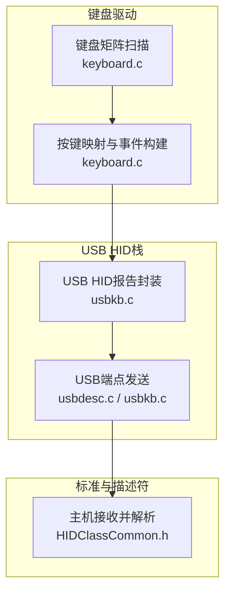
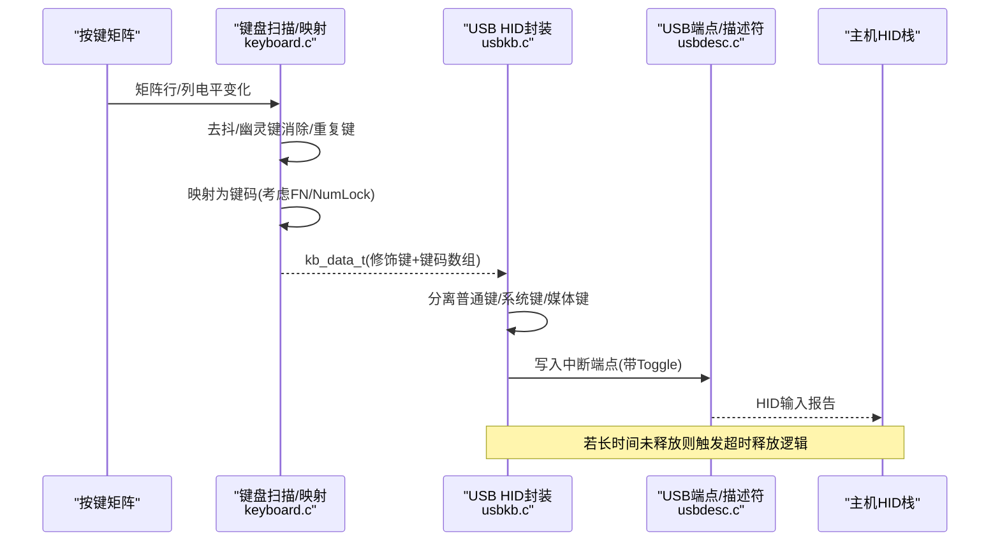
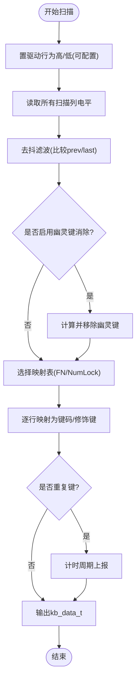
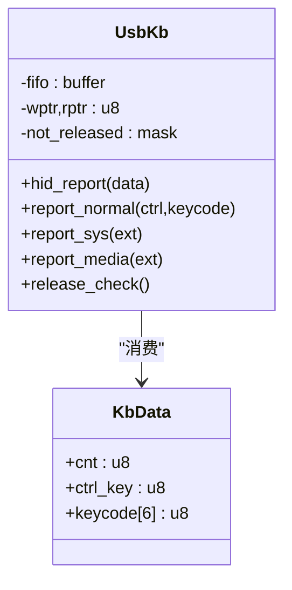
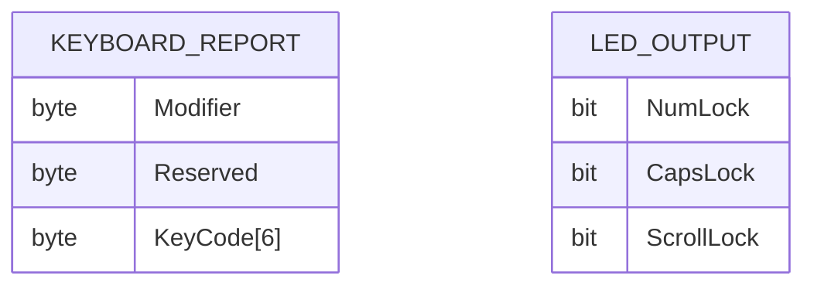
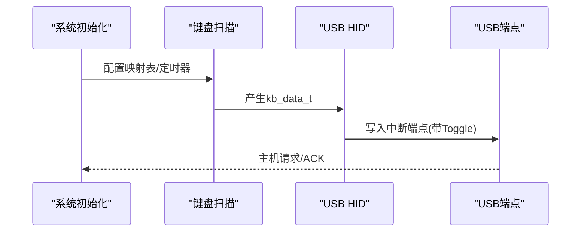
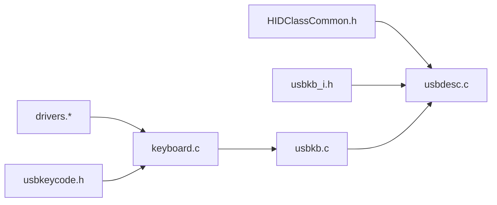

# HID键盘设备

<cite>
**本文引用的文件**
- [usbkb.c](file://tc_ble_single_sdk/application/app/usbkb.c)
- [usbkb.h](file://tc_ble_single_sdk/application/app/usbkb.h)
- [usbkb_i.h](file://tc_ble_single_sdk/application/app/usbkb_i.h)
- [keyboard.c](file://tc_ble_single_sdk/application/keyboard/keyboard.c)
- [keyboard.h](file://tc_ble_single_sdk/application/keyboard/keyboard.h)
- [HIDClassCommon.h](file://tc_ble_single_sdk/application/usbstd/HIDClassCommon.h)
- [HIDReportData.h](file://tc_ble_single_sdk/application/usbstd/HIDReportData.h)
- [usbkeycode.h](file://tc_ble_single_sdk/application/usbstd/usbkeycode.h)
- [usbdesc.c](file://tc_ble_single_sdk/application/usbstd/usbdesc.c)
- [usbdesc.h](file://tc_ble_single_sdk/application/usbstd/usbdesc.h)
</cite>

## 目录
1. [简介](#简介)
2. [项目结构](#项目结构)
3. [核心组件](#核心组件)
4. [架构总览](#架构总览)
5. [详细组件分析](#详细组件分析)
6. [依赖关系分析](#依赖关系分析)
7. [性能与功耗考量](#性能与功耗考量)
8. [故障诊断指南](#故障诊断指南)
9. [结论](#结论)
10. [附录](#附录)

## 简介
本技术文档面向基于该SDK的HID键盘设备，系统性阐述以下主题：
- HID报告描述符定义、按键扫描机制与输入报告格式
- 按键事件检测、防抖处理、组合键支持与多媒体键映射
- 键盘设备初始化、按键扫描、报告生成与主机通信流程
- LED控制（Num/Caps/Scroll）、背光管理与低功耗模式实现思路
- 兼容性测试、按键映射配置与故障诊断方法

## 项目结构
本项目将HID键盘功能划分为“应用层USB HID”、“键盘矩阵扫描与映射”、“HID标准定义与描述符”三大层次：
- 应用层USB HID：负责将按键事件封装为HID报告并通过USB端点发送
- 键盘矩阵扫描与映射：负责硬件矩阵扫描、去抖、幽灵键消除、重复键、FN/NumLock状态切换等
- HID标准与描述符：提供HID类通用宏、报告描述符、键码定义与USB配置描述符

**图表来源**
- [keyboard.c:313-486](file://tc_ble_single_sdk/application/keyboard/keyboard.c#L313-L486)
- [usbkb.c:82-337](file://tc_ble_single_sdk/application/app/usbkb.c#L82-L337)
- [usbdesc.c:668-692](file://tc_ble_single_sdk/application/usbstd/usbdesc.c#L668-L692)
- [HIDClassCommon.h:295-324](file://tc_ble_single_sdk/application/usbstd/HIDClassCommon.h#L295-L324)

**章节来源**
- [usbkb.c:1-390](file://tc_ble_single_sdk/application/app/usbkb.c#L1-L390)
- [keyboard.c:1-498](file://tc_ble_single_sdk/application/keyboard/keyboard.c#L1-L498)
- [usbdesc.c:668-692](file://tc_ble_single_sdk/application/usbstd/usbdesc.c#L668-L692)
- [HIDClassCommon.h:295-324](file://tc_ble_single_sdk/application/usbstd/HIDClassCommon.h#L295-L324)

## 核心组件
- 键盘矩阵扫描与映射模块：完成物理按键到虚拟键码的转换，支持多模式映射（普通/数字/函数），支持FN键、NumLock状态、重复键、幽灵键消除。
- USB HID报告模块：将按键事件拆分为普通键、系统键、媒体键三类分别上报，支持防重发与超时释放。
- HID描述符与键码定义：提供标准HID键盘报告描述符、LED输出位域、键码枚举及多媒体键映射表。
- USB配置描述符：声明键盘接口、HID描述符、中断端点及轮询间隔。

**章节来源**
- [keyboard.h:28-113](file://tc_ble_single_sdk/application/keyboard/keyboard.h#L28-L113)
- [usbkb.h:38-62](file://tc_ble_single_sdk/application/app/usbkb.h#L38-L62)
- [usbkb_i.h:35-45](file://tc_ble_single_sdk/application/app/usbkb_i.h#L35-L45)
- [usbdesc.c:668-692](file://tc_ble_single_sdk/application/usbstd/usbdesc.c#L668-L692)

## 架构总览
下图展示了从按键按下到主机收到HID报告的完整数据流与控制流。

**图表来源**
- [keyboard.c:313-486](file://tc_ble_single_sdk/application/keyboard/keyboard.c#L313-L486)
- [usbkb.c:134-337](file://tc_ble_single_sdk/application/app/usbkb.c#L134-L337)
- [usbdesc.c:668-692](file://tc_ble_single_sdk/application/usbstd/usbdesc.c#L668-L692)

## 详细组件分析

### 键盘矩阵扫描与按键映射
- 扫描方式：按行驱动、列读取；支持行/列有效电平配置、SPI Flash复用引脚切换。
- 去抖与稳定：维护前次与上次矩阵状态，采用滑动窗口式滤波；支持长按优化计数。
- 幽灵键消除：当多行矩阵交叉出现疑似幽灵键时进行剔除。
- 映射策略：根据NumLock与FN键状态选择不同映射表；支持Ctrl/Shift/Alt/Win修饰键合成。
- 重复键：对指定键在持续按下时按周期上报。

**图表来源**
- [keyboard.c:224-262](file://tc_ble_single_sdk/application/keyboard/keyboard.c#L224-L262)
- [keyboard.c:313-358](file://tc_ble_single_sdk/application/keyboard/keyboard.c#L313-L358)
- [keyboard.c:396-486](file://tc_ble_single_sdk/application/keyboard/keyboard.c#L396-L486)

**章节来源**
- [keyboard.c:30-186](file://tc_ble_single_sdk/application/keyboard/keyboard.c#L30-L186)
- [keyboard.c:202-218](file://tc_ble_single_sdk/application/keyboard/keyboard.c#L202-L218)
- [keyboard.c:224-262](file://tc_ble_single_sdk/application/keyboard/keyboard.c#L224-L262)
- [keyboard.c:313-358](file://tc_ble_single_sdk/application/keyboard/keyboard.c#L313-L358)
- [keyboard.c:396-486](file://tc_ble_single_sdk/application/keyboard/keyboard.c#L396-L486)

### USB HID报告封装与发送
- 报告拆分：将一次按键事件拆分为普通键、系统键、媒体键三类分别上报，避免单包超限。
- 防重发与超时释放：记录最近一次上报数据，相同数据不重复上报；若超过超时时间仍未释放，强制清空各类型释放标志。
- 缓冲与FIFO：当端点忙时，将数据压入环形缓冲区，由上层调度发送。
- CRC可选：支持可选的软件CRC校验以增强可靠性。

**图表来源**
- [usbkb.c:72-132](file://tc_ble_single_sdk/application/app/usbkb.c#L72-L132)
- [usbkb.c:150-213](file://tc_ble_single_sdk/application/app/usbkb.c#L150-L213)
- [usbkb.c:279-337](file://tc_ble_single_sdk/application/app/usbkb.c#L279-L337)
- [usbkb.h:50-62](file://tc_ble_single_sdk/application/app/usbkb.h#L50-L62)

**章节来源**
- [usbkb.c:82-132](file://tc_ble_single_sdk/application/app/usbkb.c#L82-L132)
- [usbkb.c:134-213](file://tc_ble_single_sdk/application/app/usbkb.c#L134-L213)
- [usbkb.c:255-337](file://tc_ble_single_sdk/application/app/usbkb.c#L255-L337)
- [usbkb.h:38-62](file://tc_ble_single_sdk/application/app/usbkb.h#L38-L62)

### HID报告描述符与输入报告格式
- 键盘报告描述符：包含修饰键输入、保留字节、最多6个键码输入，以及LED输出位域（Num/Caps/Scroll）。
- 输入报告格式：修饰键字节 + 保留字节 + 最多6个键码。
- 多媒体键：通过消费者页面或扩展键范围映射，使用独立上报通道。
- USB配置：声明键盘接口、HID描述符、中断端点大小与轮询间隔。

**图表来源**
- [HIDClassCommon.h:295-324](file://tc_ble_single_sdk/application/usbstd/HIDClassCommon.h#L295-L324)
- [usbkb.h:50-62](file://tc_ble_single_sdk/application/app/usbkb.h#L50-L62)
- [usbdesc.c:668-692](file://tc_ble_single_sdk/application/usbstd/usbdesc.c#L668-L692)

**章节来源**
- [usbkb_i.h:35-45](file://tc_ble_single_sdk/application/app/usbkb_i.h#L35-L45)
- [HIDClassCommon.h:295-324](file://tc_ble_single_sdk/application/usbstd/HIDClassCommon.h#L295-L324)
- [usbdesc.c:668-692](file://tc_ble_single_sdk/application/usbstd/usbdesc.c#L668-L692)

### 按键事件检测、防抖与组合键支持
- 事件检测：矩阵扫描得到行列状态，结合GPIO缓存快速判断。
- 防抖：三态历史比较（当前/上次/再上次）确保稳定。
- 组合键：修饰键（Ctrl/Shift/Alt/Win）与普通键分开处理，支持同时按下。
- FN/NumLock：动态切换映射表，影响数字区与功能键行为。

**章节来源**
- [keyboard.c:313-358](file://tc_ble_single_sdk/application/keyboard/keyboard.c#L313-L358)
- [keyboard.c:396-486](file://tc_ble_single_sdk/application/keyboard/keyboard.c#L396-L486)
- [usbkb.c:134-148](file://tc_ble_single_sdk/application/app/usbkb.c#L134-L148)

### 多媒体键映射
- 媒体键范围：定义在扩展键区间，内部映射到具体消费者代码或扩展键值。
- 上报路径：通过专用通道上报，避免与常规键冲突。
- 支持常见媒体操作：播放/暂停、音量加减、静音、上一曲/下一曲、浏览器导航等。

**章节来源**
- [usbkb.c:39-62](file://tc_ble_single_sdk/application/app/usbkb.c#L39-L62)
- [usbkeycode.h:184-249](file://tc_ble_single_sdk/application/usbstd/usbkeycode.h#L184-L249)
- [usbkeycode.h:254-349](file://tc_ble_single_sdk/application/usbstd/usbkeycode.h#L254-L349)

### 设备初始化、报告生成与主机通信流程
- 初始化：加载映射表、清零状态机、准备端点与描述符。
- 报告生成：扫描→映射→拆分→封装→发送。
- 主机通信：中断端点周期性轮询，设备在可用时立即发送；支持FIFO缓冲应对突发。

**图表来源**
- [usbdesc.c:668-692](file://tc_ble_single_sdk/application/usbstd/usbdesc.c#L668-L692)
- [usbkb.c:339-341](file://tc_ble_single_sdk/application/app/usbkb.c#L339-L341)
- [usbkb.c:343-388](file://tc_ble_single_sdk/application/app/usbkb.c#L343-L388)

**章节来源**
- [usbkb.c:339-341](file://tc_ble_single_sdk/application/app/usbkb.c#L339-L341)
- [usbkb.c:343-388](file://tc_ble_single_sdk/application/app/usbkb.c#L343-L388)
- [usbdesc.c:668-692](file://tc_ble_single_sdk/application/usbstd/usbdesc.c#L668-L692)

## 依赖关系分析
- keyboard.c 依赖：drivers（GPIO/时钟/延时）、usbkeycode（键码定义）
- usbkb.c 依赖：keyboard（事件源）、usbstd（HID宏/描述符）、底层USB端点寄存器
- usbdesc.c 依赖：HIDClassCommon（描述符宏）、usbkb_i（键盘报告描述符）

**图表来源**
- [keyboard.c:24-27](file://tc_ble_single_sdk/application/keyboard/keyboard.c#L24-L27)
- [usbkb.c:24-30](file://tc_ble_single_sdk/application/app/usbkb.c#L24-L30)
- [usbdesc.c:24-34](file://tc_ble_single_sdk/application/usbstd/usbdesc.c#L24-L34)

**章节来源**
- [keyboard.c:24-27](file://tc_ble_single_sdk/application/keyboard/keyboard.c#L24-L27)
- [usbkb.c:24-30](file://tc_ble_single_sdk/application/app/usbkb.c#L24-L30)
- [usbdesc.c:24-34](file://tc_ble_single_sdk/application/usbstd/usbdesc.c#L24-L34)

## 性能与功耗考量
- 轮询间隔：键盘中断端点PollingInterval决定响应延迟与功耗平衡，需根据产品定位调整。
- 去抖与重复键：合理设置去抖阈值与重复键间隔，减少无效上报与CPU占用。
- FIFO缓冲：端点忙时进入FIFO，避免丢包；注意溢出策略。
- 可选CRC：开启软件CRC提升可靠性但增加CPU开销。
- 低功耗建议：在无按键时降低扫描频率；利用系统空闲与睡眠模式；关闭不必要的外设。

[本节为通用指导，无需特定文件引用]

## 故障诊断指南
- 无响应或卡键：检查去抖与释放超时逻辑；确认矩阵扫描GPIO配置与有效电平；验证幽灵键消除是否误删。
- 键位错乱：核对映射表（普通/数字/FN）与NumLock状态；检查修饰键合成逻辑。
- 多媒体键无效：确认媒体键映射表与上报通道；检查消费者代码是否正确。
- 主机识别异常：核对USB配置描述符（接口、端点、HID描述符长度）；确认轮询间隔与端点大小。
- 兼容性问题：在不同操作系统下测试；必要时调整轮询间隔或启用CRC。

**章节来源**
- [keyboard.c:224-262](file://tc_ble_single_sdk/application/keyboard/keyboard.c#L224-L262)
- [usbkb.c:127-132](file://tc_ble_single_sdk/application/app/usbkb.c#L127-L132)
- [usbdesc.c:668-692](file://tc_ble_single_sdk/application/usbstd/usbdesc.c#L668-L692)

## 结论
该SDK实现了完整的HID键盘方案：从矩阵扫描、去抖、映射到HID报告封装与USB传输，具备组合键、多媒体键、重复键与超时释放等实用特性。通过合理的轮询间隔与低功耗策略，可在响应性与功耗间取得良好平衡。建议在量产前进行多平台兼容性测试，并根据实际场景调优去抖与重复键参数。

[本节为总结性内容，无需特定文件引用]

## 附录

### LED控制（Num/Caps/Scroll）
- 键盘报告描述符定义了LED输出位域，用于向设备下发Num/Caps/Scroll状态。
- 设备侧可通过输出端点接收LED状态，控制对应指示灯。

**章节来源**
- [HIDClassCommon.h:295-324](file://tc_ble_single_sdk/application/usbstd/HIDClassCommon.h#L295-L324)

### 背光管理（概念性说明）
- 通常通过PWM或GPIO控制LED背光亮度；可根据按键活动或空闲时长调节亮度。
- 建议结合低功耗策略，在无按键时降低背光或关闭。

[本节为概念性说明，无需特定文件引用]

### 低功耗模式实现（概念性说明）
- 在无按键时降低扫描频率或进入休眠；按键唤醒后恢复扫描。
- 合理设置USB轮询间隔，减少总线唤醒次数。

[本节为概念性说明，无需特定文件引用]

### 按键映射配置
- 修改映射表以适配不同布局或自定义键位；支持普通/数字/FN三种模式。
- 通过配置宏开关启用/禁用重复键、幽灵键消除等功能。

**章节来源**
- [keyboard.c:103-186](file://tc_ble_single_sdk/application/keyboard/keyboard.c#L103-L186)
- [keyboard.h:38-76](file://tc_ble_single_sdk/application/keyboard/keyboard.h#L38-L76)

### 兼容性测试要点
- 操作系统：Windows/macOS/Linux
- 测试项：基础键、组合键、多媒体键、Fn/NumLock切换、长连击、快速连击
- 工具：HID Descriptor Tool、USB协议分析仪

[本节为通用指导，无需特定文件引用]