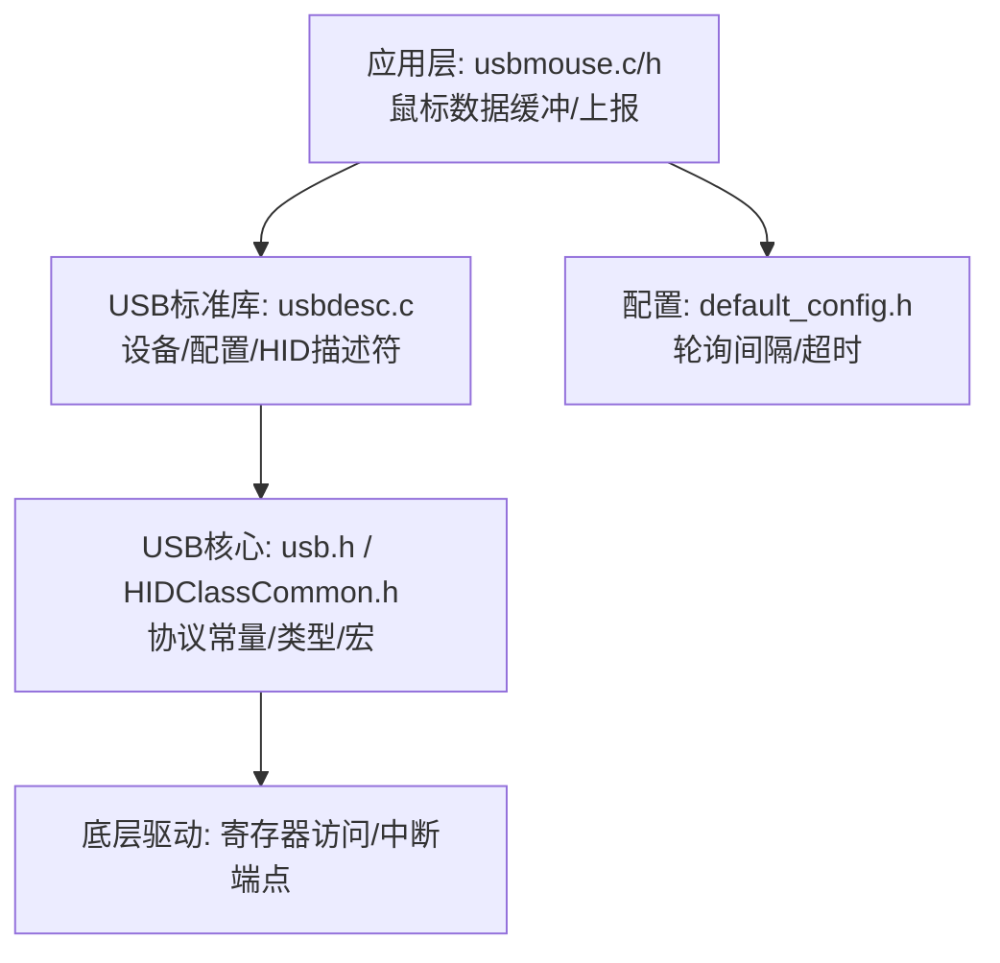
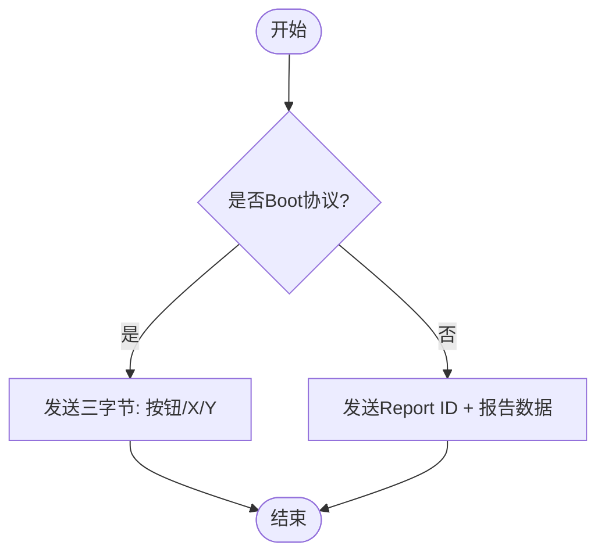
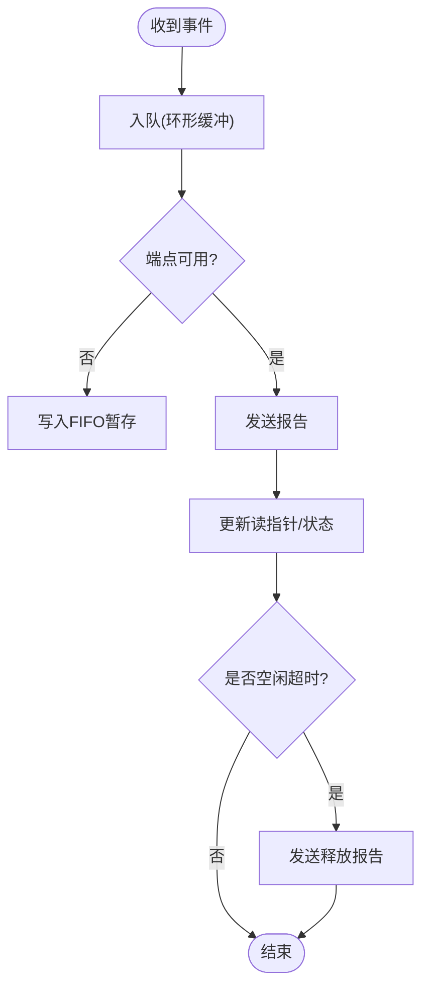
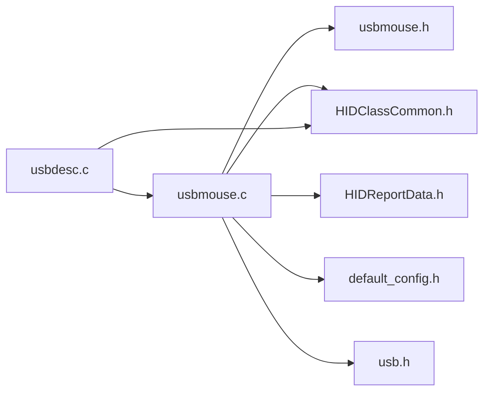

# HID鼠标设备

<cite>
**本文引用的文件**
- [usbmouse.c](file://tc_ble_single_sdk/application/app/usbmouse.c)
- [usbmouse.h](file://tc_ble_single_sdk/application/app/usbmouse.h)
- [usbmouse_i.h](file://tc_ble_single_sdk/application/app/usbmouse_i.h)
- [HIDClassCommon.h](file://tc_ble_single_sdk/application/usbstd/HIDClassCommon.h)
- [HIDReportData.h](file://tc_ble_single_sdk/application/usbstd/HIDReportData.h)
- [usbdesc.c](file://tc_ble_single_sdk/application/usbstd/usbdesc.c)
- [usb.h](file://tc_ble_single_sdk/application/usbstd/usb.h)
- [default_config.h](file://tc_ble_single_sdk/vendor/common/default_config.h)
</cite>

## 目录
1. [简介](#简介)
2. [项目结构](#项目结构)
3. [核心组件](#核心组件)
4. [架构总览](#架构总览)
5. [详细组件分析](#详细组件分析)
6. [依赖关系分析](#依赖关系分析)
7. [性能考虑](#性能考虑)
8. [故障排查指南](#故障排查指南)
9. [结论](#结论)
10. [附录](#附录)

## 简介
本技术文档围绕HID鼠标设备的报告描述符定义、输入报告格式与事件处理机制展开，结合SDK中的USB HID实现，系统说明鼠标移动检测、按键状态、滚轮操作的数据结构与传输协议。文档还涵盖设备初始化、报告发送流程、事件回调、电源管理（空闲超时释放）、错误处理与兼容性要点，并提供性能优化与调试技巧，帮助开发者快速定位问题并提升鼠标响应性与稳定性。

## 项目结构
本项目中HID鼠标相关代码主要分布在应用层与USB标准库层：
- 应用层：鼠标数据封装、上报队列、报告发送接口
- USB标准库层：HID类通用定义、报告描述符宏、USB枚举与端点配置、控制请求处理
- 配置层：轮询间隔、释放超时等全局参数



图表来源
- [usbdesc.c:693-712](file://tc_ble_single_sdk/application/usbstd/usbdesc.c#L693-L712)
- [usbmouse.c:44-151](file://tc_ble_single_sdk/application/app/usbmouse.c#L44-L151)
- [HIDClassCommon.h:326-354](file://tc_ble_single_sdk/application/usbstd/HIDClassCommon.h#L326-L354)
- [default_config.h:163-172](file://tc_ble_single_sdk/vendor/common/default_config.h#L163-L172)

章节来源
- [usbdesc.c:693-712](file://tc_ble_single_sdk/application/usbstd/usbdesc.c#L693-L712)
- [usbmouse.c:44-151](file://tc_ble_single_sdk/application/app/usbmouse.c#L44-L151)
- [HIDClassCommon.h:326-354](file://tc_ble_single_sdk/application/usbstd/HIDClassCommon.h#L326-L354)
- [default_config.h:163-172](file://tc_ble_single_sdk/vendor/common/default_config.h#L163-L172)

## 核心组件
- 鼠标数据结构与长度
  - mouse_data_t：包含按钮位域、X/Y相对位移、滚轮增量
  - MOUSE_REPORT_DATA_LEN：输入报告长度
- 报告描述符
  - 定义鼠标HID报告布局（按钮、X/Y、滚轮），以及媒体键、系统控制、OTA特征描述符
- USB端点与枚举
  - 鼠标接口为HID类，Boot子类+鼠标协议；中断IN端点用于上报
- 报告发送与协议模式
  - 支持Boot协议与非Boot协议两种格式；通过SetProtocol切换
- 事件缓冲与平滑上报
  - 环形缓冲累积鼠标帧，支持平滑策略减少频繁上报
- 空闲释放
  - 超时后自动发送释放报告，确保主机状态一致

章节来源
- [usbmouse.h:40-49](file://tc_ble_single_sdk/application/app/usbmouse.h#L40-L49)
- [usbmouse_i.h:136-231](file://tc_ble_single_sdk/application/app/usbmouse_i.h#L136-L231)
- [usbdesc.c:693-712](file://tc_ble_single_sdk/application/usbstd/usbdesc.c#L693-L712)
- [usbmouse.c:44-151](file://tc_ble_single_sdk/application/app/usbmouse.c#L44-L151)

## 架构总览
下图展示从传感器/上层事件到USB主机接收的完整链路：

```mermaid
sequenceDiagram
participant App as "应用层"
participant Mouse as "usbmouse.c"
participant USB as "usbdesc.c/usb.h"
participant Dev as "USB控制器"
participant Host as "主机"
App->>Mouse : 组装mouse_data_t(按钮/X/Y/滚轮)
Mouse->>Mouse : 入队(环形缓冲)/平滑策略
Mouse->>Dev : 检查端点忙/写入数据/设置ACK/翻转DAT toggle
Dev-->>Host : 中断IN包(鼠标报告)
Host-->>Mouse : SetProtocol/SetIdle(可选)
Note over Mouse,Host : 非Boot协议含Report ID; Boot协议直接三字节
```

图表来源
- [usbmouse.c:107-151](file://tc_ble_single_sdk/application/app/usbmouse.c#L107-L151)
- [usbdesc.c:693-712](file://tc_ble_single_sdk/application/usbstd/usbdesc.c#L693-L712)
- [usb.h:44-48](file://tc_ble_single_sdk/application/usbstd/usb.h#L44-L48)

## 详细组件分析

### 报告描述符与输入报告格式
- 鼠标主报告（Report ID=1）
  - 按钮：5位有效（Bit0~Bit4），剩余3位填充
  - X/Y：相对位移，支持8位或16位范围（由配置决定）
  - 滚轮：相对增量
- 其他报告
  - 媒体键（Consumer Control）
  - 系统控制（System Control）
  - 自定义特征描述符（如OTA命令）
- 协议模式
  - Boot协议：无Report ID，直接发送三字节（按钮、X、Y）
  - 非Boot协议：首字节为Report ID，随后为具体报告内容



图表来源
- [usbmouse.c:132-149](file://tc_ble_single_sdk/application/app/usbmouse.c#L132-L149)
- [usbmouse_i.h:136-231](file://tc_ble_single_sdk/application/app/usbmouse_i.h#L136-L231)

章节来源
- [usbmouse_i.h:136-231](file://tc_ble_single_sdk/application/app/usbmouse_i.h#L136-L231)
- [usbmouse.c:132-149](file://tc_ble_single_sdk/application/app/usbmouse.c#L132-L149)

### 输入数据结构与复杂度
- mouse_data_t
  - 字段：按钮位域、X/Y相对位移、滚轮增量
  - 大小：MOUSE_REPORT_DATA_LEN
- 时间复杂度
  - 入队/出队：O(1)（环形缓冲）
  - 报告发送：O(n)，n为报告长度（通常≤8）
- 空间复杂度
  - 缓冲容量固定（USBMOUSE_BUFF_DATA_NUM）

章节来源
- [usbmouse.h:40-49](file://tc_ble_single_sdk/application/app/usbmouse.h#L40-L49)
- [usbmouse.c:35-56](file://tc_ble_single_sdk/application/app/usbmouse.c#L35-L56)

### 事件处理机制
- 事件入队
  - 将鼠标帧加入环形缓冲，避免丢帧
- 上报调度
  - 周期性调用上报函数，若端点忙则进入FIFO暂存
- 平滑上报
  - 当缓冲差值较小且短时间未达阈值时延迟上报，降低带宽占用
- 空闲释放
  - 若持续有按键但未释放，超过超时后主动发送释放报告，保证主机状态正确



图表来源
- [usbmouse.c:44-98](file://tc_ble_single_sdk/application/app/usbmouse.c#L44-L98)
- [default_config.h:171-172](file://tc_ble_single_sdk/vendor/common/default_config.h#L171-L172)

章节来源
- [usbmouse.c:44-98](file://tc_ble_single_sdk/application/app/usbmouse.c#L44-L98)
- [default_config.h:171-172](file://tc_ble_single_sdk/vendor/common/default_config.h#L171-L172)

### 设备初始化与端点配置
- 设备/配置描述符
  - 声明HID类接口、HID描述符引用、中断IN端点（大小与轮询间隔）
- 鼠标端点
  - 使用USB_EDP_MOUSE作为IN端点，类型为中断，轮询间隔可配置
- 初始化入口
  - 在USB初始化阶段调用usbmouse_init()（当前为空实现，可扩展）

章节来源
- [usbdesc.c:693-712](file://tc_ble_single_sdk/application/usbstd/usbdesc.c#L693-L712)
- [default_config.h:163-165](file://tc_ble_single_sdk/vendor/common/default_config.h#L163-L165)
- [usbmouse.c:154-155](file://tc_ble_single_sdk/application/app/usbmouse.c#L154-L155)

### 协议切换与控制请求
- SetProtocol
  - 主机可通过SetProtocol切换Boot/非Boot协议，影响报告格式（是否带Report ID）
- SetIdle
  - 设置空闲周期，用于低功耗或减少上报频率
- 内部变量
  - usb_mouse_report_proto：记录当前协议模式

章节来源
- [usb.h:44-48](file://tc_ble_single_sdk/application/usbstd/usb.h#L44-L48)
- [usbmouse.c:132-149](file://tc_ble_single_sdk/application/app/usbmouse.c#L132-L149)

### 电源管理与空闲释放
- 空闲释放超时
  - USB_MOUSE_RELEASE_TIMEOUT：在无释放事件时，超时后发送释放报告
- 轮询间隔
  - USB_MOUSE_POLL_INTERVAL：控制上报频率，影响功耗与响应性
- 建议
  - 在高刷新场景适当增大轮询间隔以降低功耗
  - 合理设置释放超时，避免长时间按键导致主机状态不一致

章节来源
- [default_config.h:163-172](file://tc_ble_single_sdk/vendor/common/default_config.h#L163-L172)
- [usbmouse.c:59-67](file://tc_ble_single_sdk/application/app/usbmouse.c#L59-L67)

## 依赖关系分析
- 应用层依赖
  - usbmouse.c依赖usbmouse.h定义的数据结构与长度
  - 依赖HIDClassCommon.h中的HID宏与类型
- USB层依赖
  - usbdesc.c引用鼠标报告描述符与端点配置
  - usb.h提供协议常量与全局变量
- 配置层依赖
  - default_config.h提供轮询间隔与超时等关键参数



图表来源
- [usbmouse.c:24-29](file://tc_ble_single_sdk/application/app/usbmouse.c#L24-L29)
- [usbdesc.c:24-30](file://tc_ble_single_sdk/application/usbstd/usbdesc.c#L24-L30)
- [default_config.h:163-172](file://tc_ble_single_sdk/vendor/common/default_config.h#L163-L172)

章节来源
- [usbmouse.c:24-29](file://tc_ble_single_sdk/application/app/usbmouse.c#L24-L29)
- [usbdesc.c:24-30](file://tc_ble_single_sdk/application/usbstd/usbdesc.c#L24-L30)
- [default_config.h:163-172](file://tc_ble_single_sdk/vendor/common/default_config.h#L163-L172)

## 性能考虑
- 轮询间隔
  - 默认1ms，可根据需求调整以平衡延迟与功耗
- 平滑上报
  - 启用平滑策略可减少频繁上报，降低总线负载
- 缓冲与FIFO
  - 环形缓冲与FIFO防止丢帧，注意容量与溢出策略
- 协议选择
  - Boot协议更简洁但功能受限；非Boot协议灵活但需处理Report ID
- 空闲释放
  - 合理设置超时，避免主机状态异常

[本节为通用指导，不直接分析具体文件]

## 故障排查指南
- 主机无法识别鼠标
  - 检查设备/配置描述符是否正确声明HID接口与端点
  - 确认报告描述符长度与端点大小匹配
- 鼠标移动卡顿或丢帧
  - 检查环形缓冲是否溢出，必要时增大容量
  - 调整轮询间隔与平滑策略
- 按键状态异常
  - 确认空闲释放逻辑是否触发，检查超时配置
  - 验证协议模式（Boot/非Boot）是否与主机期望一致
- 兼容性问题
  - 在不同主机上测试SetProtocol/SetIdle行为
  - 使用抓包工具验证报告格式与顺序

章节来源
- [usbdesc.c:693-712](file://tc_ble_single_sdk/application/usbstd/usbdesc.c#L693-L712)
- [usbmouse.c:59-98](file://tc_ble_single_sdk/application/app/usbmouse.c#L59-L98)
- [default_config.h:163-172](file://tc_ble_single_sdk/vendor/common/default_config.h#L163-L172)

## 结论
该SDK实现了完整的HID鼠标功能，包括报告描述符、输入报告格式、事件缓冲与上报、协议切换与空闲释放。通过合理的轮询间隔与平滑策略，可在保证低延迟的同时优化功耗。建议在多平台环境下进行兼容性测试，并结合抓包与日志进行问题定位。

[本节为总结，不直接分析具体文件]

## 附录
- 关键配置项
  - USB_MOUSE_POLL_INTERVAL：鼠标上报轮询间隔（毫秒）
  - USB_MOUSE_RELEASE_TIMEOUT：空闲释放超时（微秒）
- 常用宏与类型
  - HID_RPT_*：HID描述符构建宏
  - USB_HID_MouseBootProtocol：鼠标Boot协议标识
- 参考路径
  - 报告描述符：usbmouse_i.h
  - 端点配置：usbdesc.c
  - 协议常量：HIDClassCommon.h、usb.h

章节来源
- [default_config.h:163-172](file://tc_ble_single_sdk/vendor/common/default_config.h#L163-L172)
- [HIDClassCommon.h:326-354](file://tc_ble_single_sdk/application/usbstd/HIDClassCommon.h#L326-L354)
- [usbmouse_i.h:136-231](file://tc_ble_single_sdk/application/app/usbmouse_i.h#L136-L231)
- [usbdesc.c:693-712](file://tc_ble_single_sdk/application/usbstd/usbdesc.c#L693-L712)