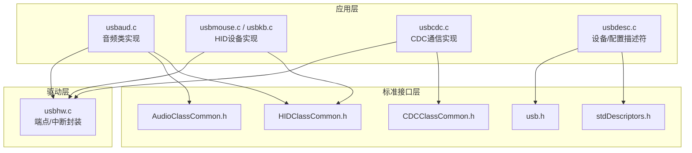
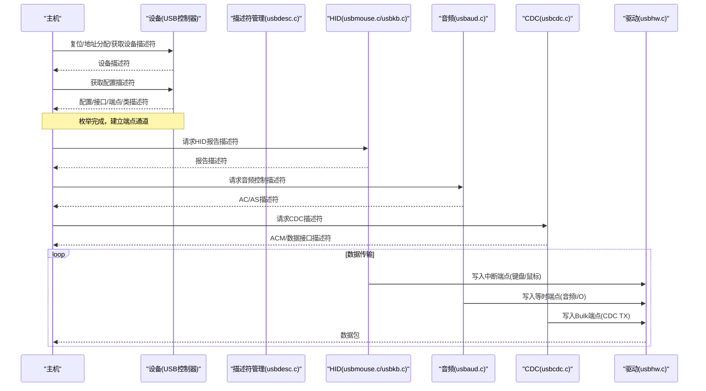
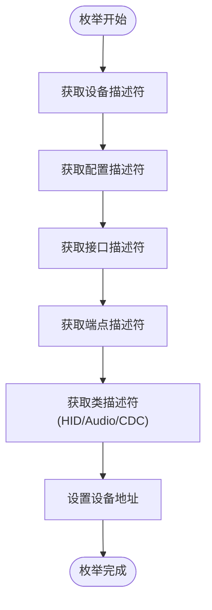
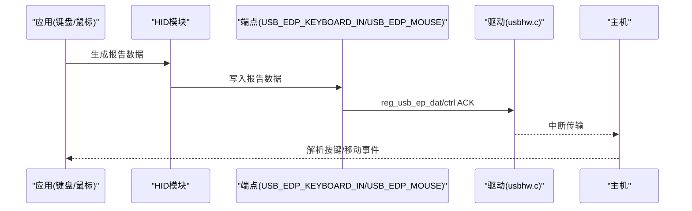
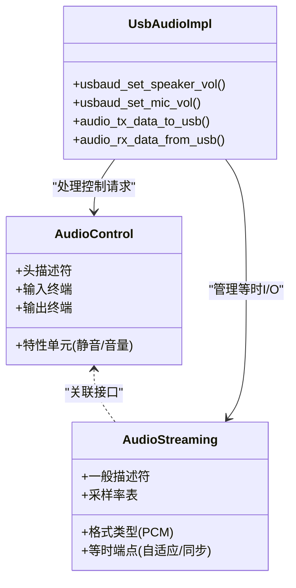
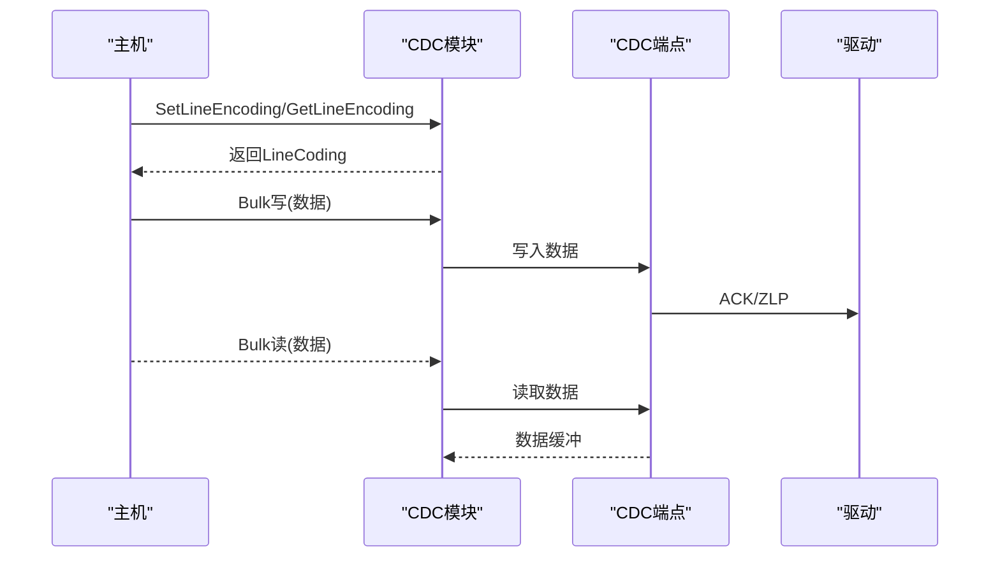
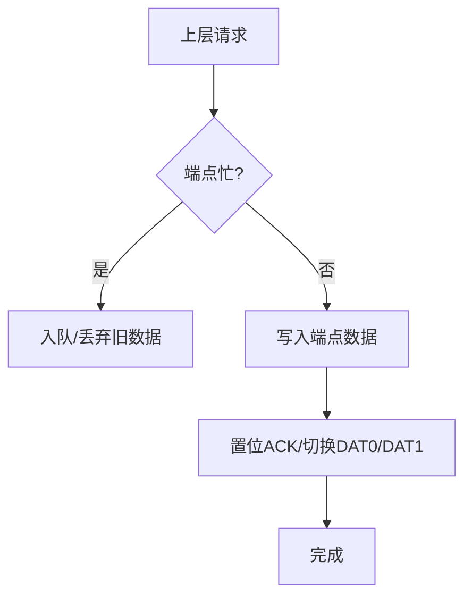
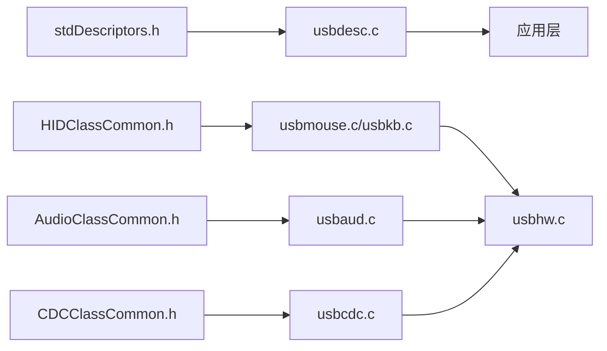

# USB协议栈

<cite>
**本文引用的文件**
- [stdDescriptors.h](file://tc_ble_single_sdk/application/usbstd/stdDescriptors.h)
- [usbdesc.c](file://tc_ble_single_sdk/application/usbstd/usbdesc.c)
- [HIDClassCommon.h](file://tc_ble_single_sdk/application/usbstd/HIDClassCommon.h)
- [AudioClassCommon.h](file://tc_ble_single_sdk/application/usbstd/AudioClassCommon.h)
- [CDCClassCommon.h](file://tc_ble_single_sdk/application/usbstd/CDCClassCommon.h)
- [usbaud.c](file://tc_ble_single_sdk/application/app/usbaud.c)
- [usbaud_i.h](file://tc_ble_single_sdk/application/app/usbaud_i.h)
- [usbmouse.c](file://tc_ble_single_sdk/application/app/usbmouse.c)
- [usbmouse_i.h](file://tc_ble_single_sdk/application/app/usbmouse_i.h)
- [usbkb.c](file://tc_ble_single_sdk/application/app/usbkb.c)
- [usbkb_i.h](file://tc_ble_single_sdk/application/app/usbkb_i.h)
- [usbcdc.c](file://tc_ble_single_sdk/application/app/usbcdc.c)
- [usb.h](file://tc_ble_single_sdk/application/usbstd/usb.h)
- [usbhw.c](file://tc_ble_single_sdk/drivers/B85/usbhw.c)
</cite>

## 目录
1. [简介](#简介)
2. [项目结构](#项目结构)
3. [核心组件](#核心组件)
4. [架构总览](#架构总览)
5. [详细组件分析](#详细组件分析)
6. [依赖关系分析](#依赖关系分析)
7. [性能与实时性](#性能与实时性)
8. [故障排查指南](#故障排查指南)
9. [结论](#结论)
10. [附录：调试与兼容性测试](#附录：调试与兼容性测试)

## 简介
本技术文档围绕Telink B85平台的USB协议栈，系统阐述设备描述符配置、HID类（键盘/鼠标/多媒体键）、USB Audio类（麦克风/扬声器）以及CDC类的实现细节。重点覆盖：
- USB枚举过程、端点管理与数据传输机制
- HID报告描述符定义与处理流程
- USB音频流控制（采样率、静音、音量）与I/O路径
- CDC通信的上下行数据收发
- 电源管理、热插拔与错误恢复机制
- 调试方法与兼容性测试建议

## 项目结构
该SDK将USB协议栈与应用层按“标准接口 + 应用实现”分层组织：
- 标准接口层：定义通用描述符、类规范常量与数据结构（如HID、Audio、CDC）
- 应用层：具体设备的枚举描述符组装、报告描述符、数据收发逻辑
- 驱动层：底层USB控制器寄存器操作、端点读写、中断处理封装

图表来源
- [usbdesc.c:234-761](file://tc_ble_single_sdk/application/usbstd/usbdesc.c#L234-L761)
- [HIDClassCommon.h:374-444](file://tc_ble_single_sdk/application/usbstd/HIDClassCommon.h#L374-L444)
- [AudioClassCommon.h:91-144](file://tc_ble_single_sdk/application/usbstd/AudioClassCommon.h#L91-L144)
- [CDCClassCommon.h:55-175](file://tc_ble_single_sdk/application/usbstd/CDCClassCommon.h#L55-L175)
- [usb.h:33-80](file://tc_ble_single_sdk/application/usbstd/usb.h#L33-L80)
- [usbhw.c:54-82](file://tc_ble_single_sdk/drivers/B85/usbhw.c#L54-L82)

章节来源
- [usbdesc.c:234-761](file://tc_ble_single_sdk/application/usbstd/usbdesc.c#L234-L761)
- [usb.h:33-80](file://tc_ble_single_sdk/application/usbstd/usb.h#L33-L80)

## 核心组件
- 描述符与枚举：设备描述符、配置描述符、接口与端点描述符、字符串描述符、HID/Audio/CDC功能描述符
- HID类：键盘、鼠标、多媒体键的系统/消费控制报告描述符与上报流程
- Audio类：控制接口（AC）与流接口（AS），输入/输出终端、特性单元、等时端点、采样率/静音/音量控制
- CDC类：控制接口（ACM）与数据接口（Bulk），通知端点、LineCoding、上下行数据
- 驱动封装：端点读写、ACK、忙状态检测、中断标志处理

章节来源
- [stdDescriptors.h:52-262](file://tc_ble_single_sdk/application/usbstd/stdDescriptors.h#L52-L262)
- [HIDClassCommon.h:374-444](file://tc_ble_single_sdk/application/usbstd/HIDClassCommon.h#L374-L444)
- [AudioClassCommon.h:91-144](file://tc_ble_single_sdk/application/usbstd/AudioClassCommon.h#L91-L144)
- [CDCClassCommon.h:55-175](file://tc_ble_single_sdk/application/usbstd/CDCClassCommon.h#L55-L175)
- [usbhw.c:54-82](file://tc_ble_single_sdk/drivers/B85/usbhw.c#L54-L82)

## 架构总览
USB协议栈采用“描述符集中定义 + 多类并行实现”的架构。设备启动后，主机通过控制端点请求各类描述符；设备根据配置返回完整描述符树，完成枚举。随后各功能模块独立处理各自的数据端点与类请求。

图表来源
- [usbdesc.c:234-761](file://tc_ble_single_sdk/application/usbstd/usbdesc.c#L234-L761)
- [usbmouse.c:107-151](file://tc_ble_single_sdk/application/app/usbmouse.c#L107-L151)
- [usbkb.c:150-213](file://tc_ble_single_sdk/application/app/usbkb.c#L150-L213)
- [usbaud.c:311-431](file://tc_ble_single_sdk/application/app/usbaud.c#L311-L431)
- [usbcdc.c:42-93](file://tc_ble_single_sdk/application/app/usbcdc.c#L42-L93)
- [usbhw.c:54-82](file://tc_ble_single_sdk/drivers/B85/usbhw.c#L54-L82)

## 详细组件分析

### USB枚举与描述符体系
- 设备描述符：包含USB版本、类/子类/协议、端点0最大包长、厂商/产品ID、字符串索引、配置数量
- 配置描述符：总长度、接口数、属性（远程唤醒、自供电）、最大功耗
- 接口与端点：为HID、Audio、CDC分别声明接口与端点类型（中断/等时/Bulk）
- 字符串描述符：语言、厂商、产品、序列号
- 类特定描述符：HID报告描述符、Audio AC/AS描述符、CDC功能描述符

图表来源
- [stdDescriptors.h:80-262](file://tc_ble_single_sdk/application/usbstd/stdDescriptors.h#L80-L262)
- [usbdesc.c:234-761](file://tc_ble_single_sdk/application/usbstd/usbdesc.c#L234-L761)

章节来源
- [stdDescriptors.h:80-262](file://tc_ble_single_sdk/application/usbstd/stdDescriptors.h#L80-L262)
- [usbdesc.c:234-761](file://tc_ble_single_sdk/application/usbstd/usbdesc.c#L234-L761)

### HID类设备（键盘/鼠标/多媒体键）
- 报告描述符：
  - 键盘：按键矩阵、修饰键、LED输出
  - 鼠标：按钮、X/Y相对位移、滚轮
  - 多媒体键：消费控制页的使用项
- 上报机制：
  - 键盘/鼠标使用中断端点周期性上报
  - 支持软件CRC校验与去抖/重复上报抑制
  - 释放超时机制确保按键状态正确回零

图表来源
- [usbkb.c:150-213](file://tc_ble_single_sdk/application/app/usbkb.c#L150-L213)
- [usbmouse.c:107-151](file://tc_ble_single_sdk/application/app/usbmouse.c#L107-L151)
- [usbhw.c:54-61](file://tc_ble_single_sdk/drivers/B85/usbhw.c#L54-L61)

章节来源
- [HIDClassCommon.h:374-444](file://tc_ble_single_sdk/application/usbstd/HIDClassCommon.h#L374-L444)
- [usbkb_i.h:35-45](file://tc_ble_single_sdk/application/app/usbkb_i.h#L35-L45)
- [usbmouse_i.h:248-449](file://tc_ble_single_sdk/application/app/usbmouse_i.h#L248-L449)
- [usbkb.c:150-213](file://tc_ble_single_sdk/application/app/usbkb.c#L150-L213)
- [usbmouse.c:107-151](file://tc_ble_single_sdk/application/app/usbmouse.c#L107-L151)

### USB Audio类（麦克风/扬声器）
- 控制接口（AC）：
  - 头描述符、输入/输出终端、特性单元（静音/音量）
- 流接口（AS）：
  - 一般描述符、格式类型（PCM）、离散采样率
  - 等时端点：自适应/同步模式、刷新/同步端点号
- 控制命令：
  - 当前值/最小/最大/分辨率查询与设置
  - 静音控制、音量映射与步长计算
- 数据路径：
  - 麦克风：DMA/DFIFO读取到USB等时IN端点
  - 扬声器：从USB等时OUT端点读取到DAC/I2S

图表来源
- [AudioClassCommon.h:91-144](file://tc_ble_single_sdk/application/usbstd/AudioClassCommon.h#L91-L144)
- [usbdesc.c:445-641](file://tc_ble_single_sdk/application/usbstd/usbdesc.c#L445-L641)
- [usbaud.c:162-293](file://tc_ble_single_sdk/application/app/usbaud.c#L162-L293)
- [usbaud.c:311-431](file://tc_ble_single_sdk/application/app/usbaud.c#L311-L431)

章节来源
- [AudioClassCommon.h:91-144](file://tc_ble_single_sdk/application/usbstd/AudioClassCommon.h#L91-L144)
- [usbdesc.c:445-641](file://tc_ble_single_sdk/application/usbstd/usbdesc.c#L445-L641)
- [usbaud.c:162-293](file://tc_ble_single_sdk/application/app/usbaud.c#L162-L293)
- [usbaud.c:311-431](file://tc_ble_single_sdk/application/app/usbaud.c#L311-L431)

### CDC类通信（虚拟串口）
- 控制接口（ACM）：
  - 功能描述符（Header/ACM/Union/CallManagement）
  - 通知端点（中断）
- 数据接口（Bulk）：
  - IN/OUT端点用于数据收发
- LineCoding：波特率、停止位、校验位、数据位
- 数据收发：
  - 发送：逐字节写入端点，必要时发送ZLP结束
  - 接收：读取端点指针长度并拷贝至缓冲区

图表来源
- [CDCClassCommon.h:55-175](file://tc_ble_single_sdk/application/usbstd/CDCClassCommon.h#L55-L175)
- [usbdesc.c:304-410](file://tc_ble_single_sdk/application/usbstd/usbdesc.c#L304-L410)
- [usbcdc.c:42-93](file://tc_ble_single_sdk/application/app/usbcdc.c#L42-L93)
- [usbhw.c:54-82](file://tc_ble_single_sdk/drivers/B85/usbhw.c#L54-L82)

章节来源
- [CDCClassCommon.h:55-175](file://tc_ble_single_sdk/application/usbstd/CDCClassCommon.h#L55-L175)
- [usbdesc.c:304-410](file://tc_ble_single_sdk/application/usbstd/usbdesc.c#L304-L410)
- [usbcdc.c:42-93](file://tc_ble_single_sdk/application/app/usbcdc.c#L42-L93)

### 端点管理与数据传输机制
- 控制端点（Endpoint 0）：用于枚举与类请求
- 中断端点：HID键盘/鼠标上报
- 等时端点：音频I/O，支持自适应/同步模式
- Bulk端点：CDC数据通道
- 驱动封装：
  - 端点指针重置、数据写入、ACK标志置位
  - 忙状态检测避免冲突
  - 中断标志清理与计数统计

图表来源
- [usbhw.c:54-82](file://tc_ble_single_sdk/drivers/B85/usbhw.c#L54-L82)
- [usbmouse.c:107-151](file://tc_ble_single_sdk/application/app/usbmouse.c#L107-L151)
- [usbkb.c:150-213](file://tc_ble_single_sdk/application/app/usbkb.c#L150-L213)
- [usbaud.c:311-431](file://tc_ble_single_sdk/application/app/usbaud.c#L311-L431)
- [usbcdc.c:42-93](file://tc_ble_single_sdk/application/app/usbcdc.c#L42-L93)

章节来源
- [usbhw.c:54-82](file://tc_ble_single_sdk/drivers/B85/usbhw.c#L54-L82)
- [usb.h:57-63](file://tc_ble_single_sdk/application/usbstd/usb.h#L57-L63)

## 依赖关系分析
- 描述符层依赖标准结构体定义（stdDescriptors.h）
- 应用层依赖类规范头（HID/Audio/CDC）
- 所有数据通路最终调用驱动层端点操作
- 音频模块同时依赖控制路径（音量/静音）与等时数据路径

图表来源
- [stdDescriptors.h:80-262](file://tc_ble_single_sdk/application/usbstd/stdDescriptors.h#L80-L262)
- [usbdesc.c:234-761](file://tc_ble_single_sdk/application/usbstd/usbdesc.c#L234-L761)
- [HIDClassCommon.h:374-444](file://tc_ble_single_sdk/application/usbstd/HIDClassCommon.h#L374-L444)
- [AudioClassCommon.h:91-144](file://tc_ble_single_sdk/application/usbstd/AudioClassCommon.h#L91-L144)
- [CDCClassCommon.h:55-175](file://tc_ble_single_sdk/application/usbstd/CDCClassCommon.h#L55-L175)
- [usbhw.c:54-82](file://tc_ble_single_sdk/drivers/B85/usbhw.c#L54-L82)

章节来源
- [usbdesc.c:234-761](file://tc_ble_single_sdk/application/usbstd/usbdesc.c#L234-L761)
- [usbhw.c:54-82](file://tc_ble_single_sdk/drivers/B85/usbhw.c#L54-L82)

## 性能与实时性
- HID上报：
  - 中断端点周期轮询，注意polling interval与端点大小匹配
  - 去重与释放超时避免重复上报与粘滞
- 音频等时：
  - 等时端点对时序敏感，需保证每帧按时填充/消费数据
  - 自适应/同步模式选择影响抖动与延迟
- CDC Bulk：
  - 大报文分片与ZLP处理确保主机正确识别边界
- 驱动层：
  - 忙状态检测避免端点冲突
  - 中断标志及时清理防止丢失事件

[本节提供通用指导，不直接分析具体文件]

## 故障排查指南
- 枚举失败：
  - 检查设备/配置/接口/端点描述符长度与字段一致性
  - 确认字符串描述符索引与设备描述符对应
- HID无响应：
  - 验证报告描述符与端点类型匹配
  - 检查端点忙状态与ACK置位
- 音频无声/爆音：
  - 核对采样率与格式描述符与实际数据一致
  - 检查等时端点刷新/同步参数与主机配置
- CDC无法收发：
  - 确认LineCoding设置与主机一致
  - 检查Bulk端点方向与ZLP处理

章节来源
- [usbdesc.c:234-761](file://tc_ble_single_sdk/application/usbstd/usbdesc.c#L234-L761)
- [usbmouse.c:107-151](file://tc_ble_single_sdk/application/app/usbmouse.c#L107-L151)
- [usbkb.c:150-213](file://tc_ble_single_sdk/application/app/usbkb.c#L150-L213)
- [usbaud.c:311-431](file://tc_ble_single_sdk/application/app/usbaud.c#L311-L431)
- [usbcdc.c:42-93](file://tc_ble_single_sdk/application/app/usbcdc.c#L42-L93)

## 结论
该USB协议栈以清晰的层次化设计实现了HID、Audio与CDC三类常用设备功能。通过标准化的描述符与类接口，结合驱动层的端点封装，提供了稳定可靠的枚举与数据传输能力。实际应用中需重点关注：
- 描述符一致性与类请求处理
- 端点类型与时序匹配
- 音频等时的实时性与稳定性
- CDC的LineCoding与ZLP处理

[本节总结性内容，不直接分析具体文件]

## 附录：调试与兼容性测试
- 调试方法：
  - 抓包工具分析枚举与类请求
  - 打印关键路径日志（端点忙、ACK、中断标志）
  - 使用示波器/逻辑分析仪观察USB差分信号时序
- 兼容性测试：
  - 多操作系统（Windows/macOS/Linux）枚举与功能验证
  - 不同主机端口（USB2.0/3.0）与Hub组合测试
  - 音频采样率/声道/位深组合验证
  - CDC在不同终端软件下的收发测试

[本节提供通用指导，不直接分析具体文件]