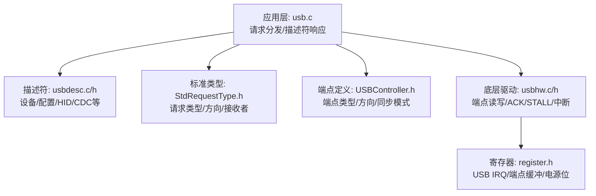
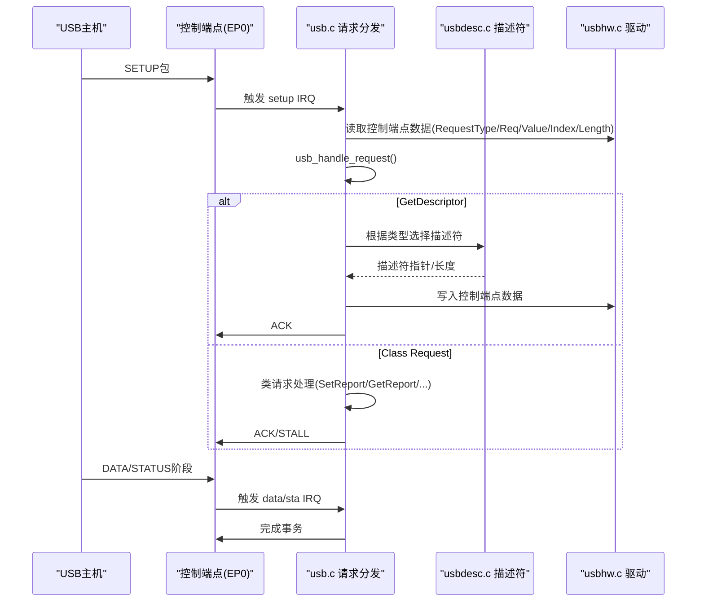
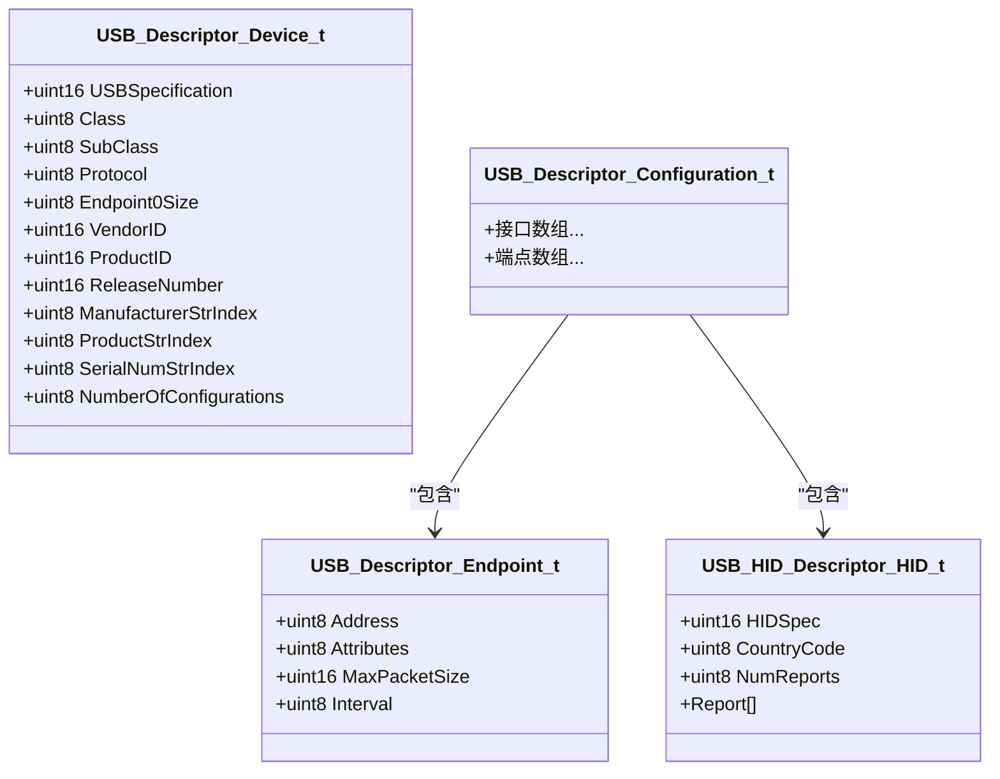
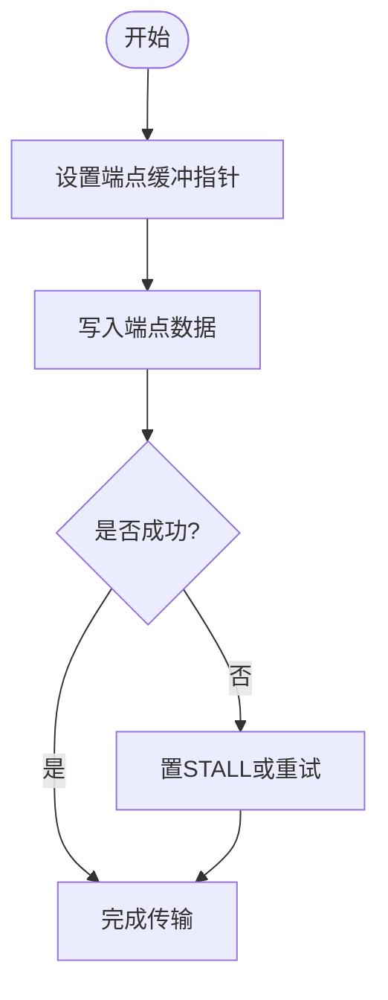
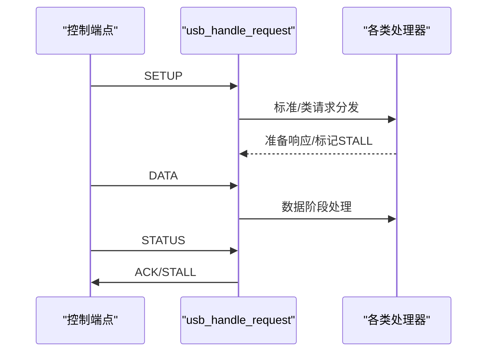
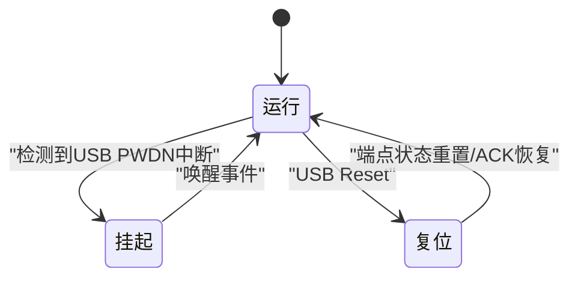
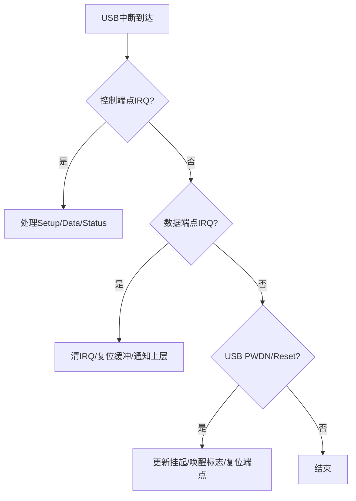
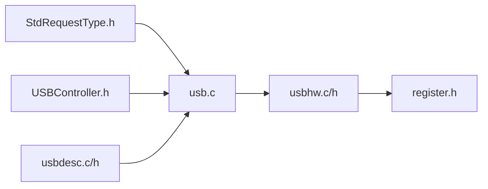

# USB核心协议

<cite>
**本文引用的文件**
- [usb.c](file://tc_ble_single_sdk/application/usbstd/usb.c)
- [usb.h](file://tc_ble_single_sdk/application/usbstd/usb.h)
- [usbdesc.c](file://tc_ble_single_sdk/application/usbstd/usbdesc.c)
- [usbdesc.h](file://tc_ble_single_sdk/application/usbstd/usbdesc.h)
- [stdDescriptors.h](file://tc_ble_single_sdk/application/usbstd/stdDescriptors.h)
- [StdRequestType.h](file://tc_ble_single_sdk/application/usbstd/StdRequestType.h)
- [USBController.h](file://tc_ble_single_sdk/application/usbstd/USBController.h)
- [usbhw.c](file://tc_ble_single_sdk/drivers/B85/usbhw.c)
- [usbhw.h](file://tc_ble_single_sdk/drivers/B85/usbhw.h)
- [register.h](file://tc_ble_single_sdk/drivers/B87/register.h)
</cite>

## 目录
1. [简介](#简介)
2. [项目结构](#项目结构)
3. [核心组件](#核心组件)
4. [架构总览](#架构总览)
5. [详细组件分析](#详细组件分析)
6. [依赖关系分析](#依赖关系分析)
7. [性能考量](#性能考量)
8. [故障排查指南](#故障排查指南)
9. [结论](#结论)
10. [附录](#附录)

## 简介
本技术文档围绕该SDK中的USB设备栈实现，系统性阐述USB设备枚举、描述符管理、端点配置与数据传输机制；深入解析USB请求处理流程、状态机管理与错误恢复；并覆盖总线电源管理（挂起/唤醒）、热插拔处理、中断处理、缓冲区管理及兼容性测试与调试方法。内容基于仓库中实际源码进行归纳与可视化说明，便于不同背景的读者理解与使用。

## 项目结构
本项目将USB相关代码分为应用层协议栈与底层驱动：
- 应用层协议栈：位于 application/usbstd，负责标准请求分发、描述符组装、类请求处理（HID/CDC/Audio等）以及控制端点事务编排。
- 底层驱动：位于 drivers/B85/B87，提供寄存器级访问、端点缓冲管理、中断屏蔽与手动中断控制等能力。

图表来源
- [usb.c:707-878](file://tc_ble_single_sdk/application/usbstd/usb.c#L707-L878)
- [usbdesc.c:234-828](file://tc_ble_single_sdk/application/usbstd/usbdesc.c#L234-L828)
- [StdRequestType.h:34-71](file://tc_ble_single_sdk/application/usbstd/StdRequestType.h#L34-L71)
- [USBController.h:44-62](file://tc_ble_single_sdk/application/usbstd/USBController.h#L44-L62)
- [usbhw.c:54-82](file://tc_ble_single_sdk/drivers/B85/usbhw.c#L54-L82)
- [register.h:605-634](file://tc_ble_single_sdk/drivers/B87/register.h#L605-L634)

章节来源
- [usb.c:707-981](file://tc_ble_single_sdk/application/usbstd/usb.c#L707-L981)
- [usbdesc.c:234-828](file://tc_ble_single_sdk/application/usbstd/usbdesc.c#L234-L828)
- [usbhw.c:54-82](file://tc_ble_single_sdk/drivers/B85/usbhw.c#L54-L82)

## 核心组件
- 控制端点事务处理：setup/data/status三阶段，统一入口为 usb_handle_request，按请求类型路由到具体处理器。
- 描述符管理器：集中维护设备、配置、接口、端点、字符串及OS特性描述符，支持按需返回。
- 类请求处理器：针对HID、CDC、Audio等类请求进行解析与响应，包含SetReport/GetReport/SetIdle/GetProtocol等。
- 底层驱动封装：提供端点数据读写、ACK/STALL控制、中断使能/屏蔽、端点缓冲指针复位等原子操作。
- 中断与电源管理：统一在 usb_handle_irq 中处理控制端点IRQ、数据端点IRQ、USB复位、挂起/唤醒标志。

章节来源
- [usb.c:813-878](file://tc_ble_single_sdk/application/usbstd/usb.c#L813-L878)
- [usb.c:707-803](file://tc_ble_single_sdk/application/usbstd/usb.c#L707-L803)
- [usbdesc.c:234-828](file://tc_ble_single_sdk/application/usbstd/usbdesc.c#L234-L828)
- [usbhw.c:54-82](file://tc_ble_single_sdk/drivers/B85/usbhw.c#L54-L82)
- [usbhw.h:65-121](file://tc_ble_single_sdk/drivers/B85/usbhw.h#L65-L121)

## 架构总览
下图展示了USB主机与设备间的控制传输流程，从Setup阶段读取请求头，到Data阶段发送描述符或参数，再到Status阶段完成握手。

图表来源
- [usb.c:813-878](file://tc_ble_single_sdk/application/usbstd/usb.c#L813-L878)
- [usb.c:707-803](file://tc_ble_single_sdk/application/usbstd/usb.c#L707-L803)
- [usbdesc.c:234-828](file://tc_ble_single_sdk/application/usbstd/usbdesc.c#L234-L828)
- [usbhw.c:54-82](file://tc_ble_single_sdk/drivers/B85/usbhw.c#L54-L82)

## 详细组件分析

### 设备枚举与描述符管理
- 设备描述符：包含USB版本、类/子类/协议、最大包长、厂商/产品ID、发行号、字符串索引、配置数等。
- 配置/接口/端点描述符：按功能模块（鼠标、键盘、音频、CDC等）组织，包含HID描述符、端点属性（类型、方向、同步/用法）。
- 字符串描述符：语言ID、厂商、产品、序列号，以及可选的MS OS字符串。
- OS特性描述符：Extended Compat ID 与 Extended Properties，用于Windows驱动匹配与选择性挂起能力声明。

图表来源
- [stdDescriptors.h:80-137](file://tc_ble_single_sdk/application/usbstd/stdDescriptors.h#L80-L137)
- [usbdesc.h:236-274](file://tc_ble_single_sdk/application/usbstd/usbdesc.h#L236-L274)
- [usbdesc.c:234-828](file://tc_ble_single_sdk/application/usbstd/usbdesc.c#L234-L828)

章节来源
- [stdDescriptors.h:37-78](file://tc_ble_single_sdk/application/usbstd/stdDescriptors.h#L37-L78)
- [usbdesc.c:234-828](file://tc_ble_single_sdk/application/usbstd/usbdesc.c#L234-L828)

### 端点配置与数据传输
- 端点类型与方向：控制、批量、中断、等时；方向IN/OUT由端点地址最高位决定。
- 同步与用法：等时端点的同步类型（无同步/异步/自适应/同步）与用途（数据/反馈/显式反馈）。
- 端点缓冲与ACK/STALL：通过驱动函数设置端点缓冲指针、写入数据、置ACK或STALL以完成传输。
- 多端点映射：部分平台支持逻辑端点映射，便于复用物理端点资源。

图表来源
- [usbhw.c:54-82](file://tc_ble_single_sdk/drivers/B85/usbhw.c#L54-L82)
- [usbhw.h:152-195](file://tc_ble_single_sdk/drivers/B85/usbhw.h#L152-L195)
- [USBController.h:44-62](file://tc_ble_single_sdk/application/usbstd/USBController.h#L44-L62)

章节来源
- [USBController.h:44-62](file://tc_ble_single_sdk/application/usbstd/USBController.h#L44-L62)
- [usbhw.h:152-195](file://tc_ble_single_sdk/drivers/B85/usbhw.h#L152-L195)

### USB请求处理流程与状态机
- 控制传输三阶段：
  - Setup：读取请求头，调用 usb_handle_request 分发。
  - Data：根据请求类型准备响应数据或消费输入数据。
  - Status：ACK/STALL完成事务。
- 标准请求：GetDescriptor、GetConfiguration、SetConfiguration、GetInterface、SetInterface等。
- 类请求：HID的SetReport/GetReport/SetIdle/GetProtocol；CDC的LineCoding等；Audio的采样频率控制等。
- 错误恢复：遇到未知请求或非法参数时置STALL，保证协议健壮性。

图表来源
- [usb.c:707-878](file://tc_ble_single_sdk/application/usbstd/usb.c#L707-L878)
- [StdRequestType.h:34-71](file://tc_ble_single_sdk/application/usbstd/StdRequestType.h#L34-L71)

章节来源
- [usb.c:707-878](file://tc_ble_single_sdk/application/usbstd/usb.c#L707-L878)
- [StdRequestType.h:34-71](file://tc_ble_single_sdk/application/usbstd/StdRequestType.h#L34-L71)

### 总线电源管理、热插拔与挂起唤醒
- 挂起/唤醒：在中断处理中检测USB电源管理中断标志，设置 usb_has_suspend_irq 与 usb_just_wakeup_from_suspend 标志，供上层做低功耗策略。
- 热插拔：USB Reset事件会重置端点状态、清除toggle位，并重新初始化必要的端点（如CDC OUT需先ACK以避免后续中断不产生）。
- 选择性挂起：通过OS特性描述符声明设备空闲状态与超时，配合主机选择性挂起策略。

图表来源
- [usb.c:880-981](file://tc_ble_single_sdk/application/usbstd/usb.c#L880-L981)
- [register.h:605-634](file://tc_ble_single_sdk/drivers/B87/register.h#L605-L634)

章节来源
- [usb.c:880-981](file://tc_ble_single_sdk/application/usbstd/usb.c#L880-L981)
- [register.h:605-634](file://tc_ble_single_sdk/drivers/B87/register.h#L605-L634)

### 中断处理、数据传输与缓冲区管理
- 控制端点中断：Setup/Data/Status三类中断分别进入对应处理函数，统一清理中断标志。
- 数据端点中断：按端点号判断并清中断，必要时复位缓冲指针并通知上层（如SOMATIC OUT）。
- 缓冲区管理：通过端点缓冲指针与最大包长控制，确保数据正确入出队；对等时/中断端点采用ACK确认机制。
- 手动中断：可切换硬件自动中断与软件手动中断模式，便于调试与特殊场景控制。

图表来源
- [usb.c:891-981](file://tc_ble_single_sdk/application/usbstd/usb.c#L891-L981)
- [usbhw.c:54-82](file://tc_ble_single_sdk/drivers/B85/usbhw.c#L54-L82)
- [usbhw.h:152-195](file://tc_ble_single_sdk/drivers/B85/usbhw.h#L152-L195)

章节来源
- [usb.c:891-981](file://tc_ble_single_sdk/application/usbstd/usb.c#L891-L981)
- [usbhw.c:54-82](file://tc_ble_single_sdk/drivers/B85/usbhw.c#L54-L82)

## 依赖关系分析
- 应用层依赖标准类型定义与控制器端点属性，组合描述符并按请求返回。
- 驱动层提供寄存器抽象，屏蔽芯片差异，向上暴露统一的端点操作API。
- 各功能模块（HID/CDC/Audio）通过描述符与类请求处理器集成，形成多接口复合设备。

图表来源
- [StdRequestType.h:34-71](file://tc_ble_single_sdk/application/usbstd/StdRequestType.h#L34-L71)
- [USBController.h:44-62](file://tc_ble_single_sdk/application/usbstd/USBController.h#L44-L62)
- [usbdesc.c:234-828](file://tc_ble_single_sdk/application/usbstd/usbdesc.c#L234-L828)
- [usb.c:707-981](file://tc_ble_single_sdk/application/usbstd/usb.c#L707-L981)
- [usbhw.c:54-82](file://tc_ble_single_sdk/drivers/B85/usbhw.c#L54-L82)
- [register.h:605-634](file://tc_ble_single_sdk/drivers/B87/register.h#L605-L634)

章节来源
- [usb.c:707-981](file://tc_ble_single_sdk/application/usbstd/usb.c#L707-L981)
- [usbdesc.c:234-828](file://tc_ble_single_sdk/application/usbstd/usbdesc.c#L234-L828)
- [usbhw.c:54-82](file://tc_ble_single_sdk/drivers/B85/usbhw.c#L54-L82)

## 性能考量
- 控制端点批量写优化：在B80平台上，针对特定长度边界调整校准寄存器以降低功耗与提升吞吐。
- 端点缓冲大小：合理设置端点最大包长与缓冲指针，避免溢出与重复拷贝。
- 中断处理路径：尽量精简中断上下文内的操作，将耗时任务下沉至主循环或任务队列。
- 选择性挂起：利用OS特性描述符与主机协商，降低空闲功耗。

[本节为通用指导，无需特定文件引用]

## 故障排查指南
- 枚举失败：检查设备/配置/接口/端点描述符完整性与长度；确认字符串描述符索引有效。
- 类请求异常：核对HID报告描述符与SetReport/GetReport处理分支；确认端点方向与类型匹配。
- 挂起/唤醒问题：确认USB PWDN中断标志处理与唤醒后端点状态恢复；必要时重新ACK CDC OUT等关键端点。
- 兼容性问题：启用MS OS特性描述符，验证Extended Compat ID与Properties字段；使用USB分析仪抓包定位协议偏差。

章节来源
- [usb.c:707-878](file://tc_ble_single_sdk/application/usbstd/usb.c#L707-L878)
- [usbdesc.c:234-828](file://tc_ble_single_sdk/application/usbstd/usbdesc.c#L234-L828)
- [usb.c:880-981](file://tc_ble_single_sdk/application/usbstd/usb.c#L880-L981)

## 结论
该SDK的USB核心协议实现以清晰的分层与模块化设计，覆盖了设备枚举、描述符管理、端点配置、请求处理、中断与电源管理等关键环节。通过标准化的请求分发与描述符集中管理，结合底层驱动的寄存器抽象，实现了稳定可靠的USB设备通信能力。建议在实际项目中依据功能需求裁剪描述符与类请求处理，并结合USB分析仪进行兼容性验证与性能调优。

[本节为总结性内容，无需特定文件引用]

## 附录
- 常用端点常量：参考 usbhw.h 中的端点编号定义，便于配置与调试。
- 标准请求枚举：参考 StdRequestType.h 中的请求类型与方向定义。
- 端点属性宏：参考 USBController.h 中的端点类型、方向与同步模式宏。

章节来源
- [usbhw.h:27-45](file://tc_ble_single_sdk/drivers/B85/usbhw.h#L27-L45)
- [StdRequestType.h:34-71](file://tc_ble_single_sdk/application/usbstd/StdRequestType.h#L34-L71)
- [USBController.h:44-62](file://tc_ble_single_sdk/application/usbstd/USBController.h#L44-L62)