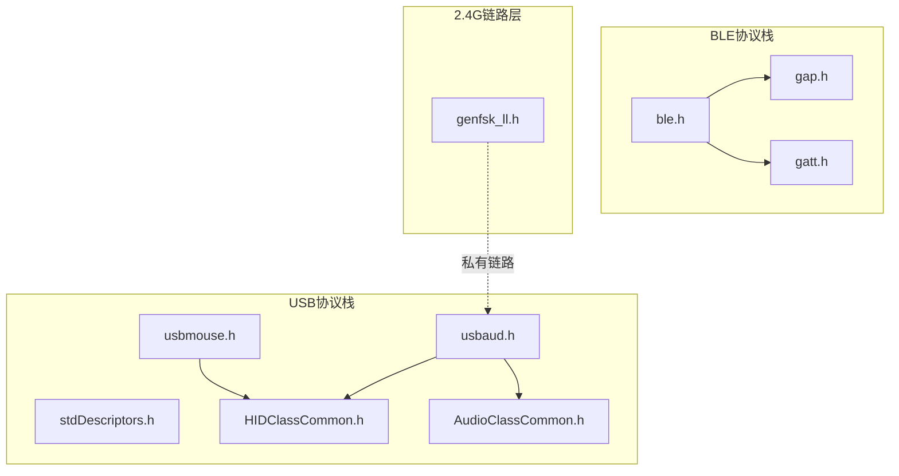
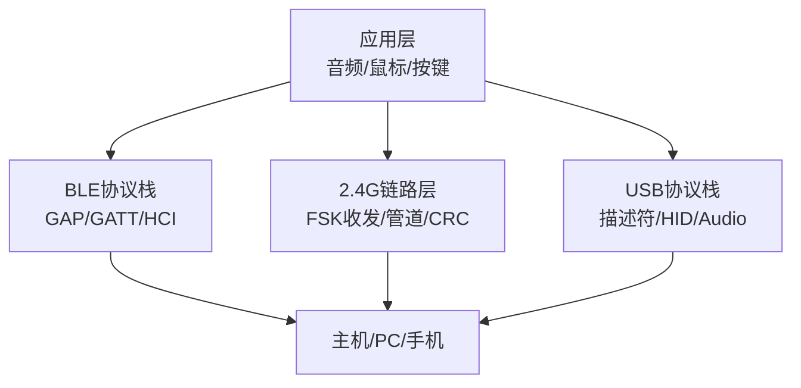
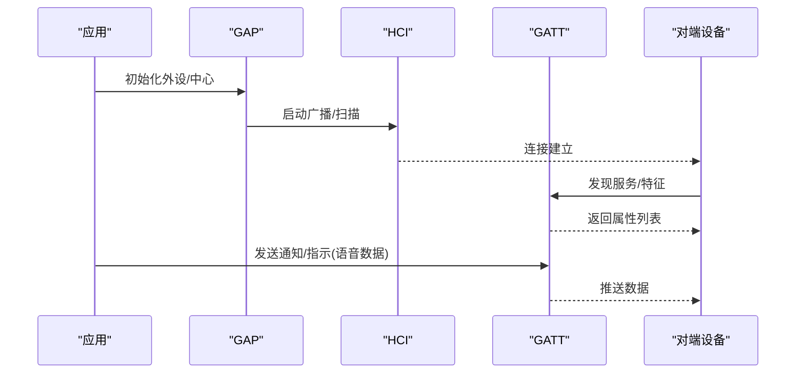
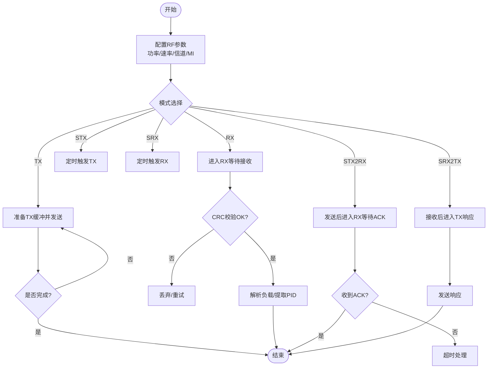
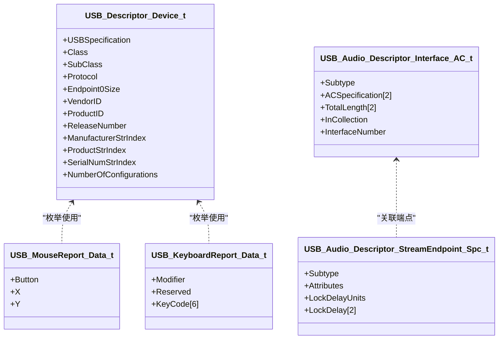
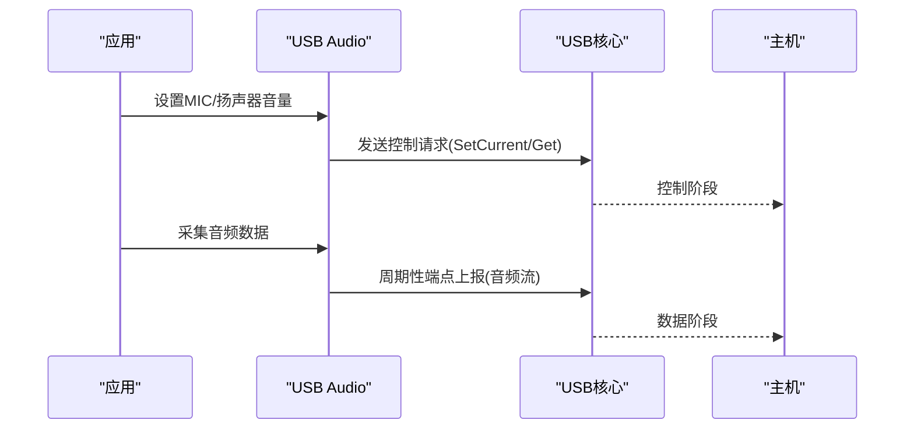
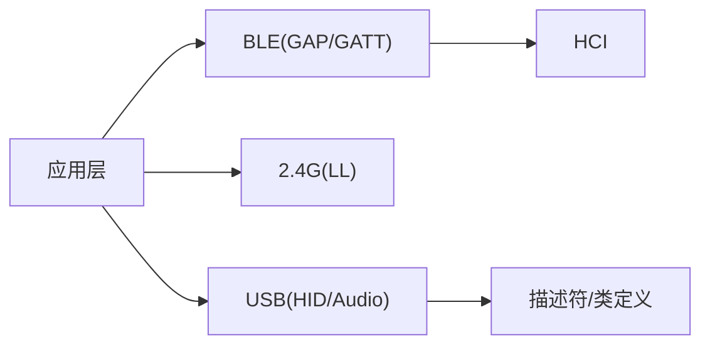

# 协议栈详解

<cite>
**本文引用的文件**
- [README.md](file://README.md)
- [telink_b85m_triple_mode_audio_mouse_sdk_Release_Note .md](file://telink_b85m_triple_mode_audio_mouse_sdk_Release_Note .md)
- [ble.h](file://tc_ble_single_sdk/stack/ble/ble.h)
- [gap.h](file://tc_ble_single_sdk/stack/ble/host/gap/gap.h)
- [gatt.h](file://tc_ble_single_sdk/stack/ble/host/attr/gatt.h)
- [genfsk_ll.h](file://tc_ble_single_sdk/stack/2p4g/genfsk_ll/genfsk_ll.h)
- [stdDescriptors.h](file://tc_ble_single_sdk/application/usbstd/stdDescriptors.h)
- [HIDClassCommon.h](file://tc_ble_single_sdk/application/usbstd/HIDClassCommon.h)
- [AudioClassCommon.h](file://tc_ble_single_sdk/application/usbstd/AudioClassCommon.h)
- [usbaud.h](file://tc_ble_single_sdk/application/app/usbaud.h)
- [usbmouse.h](file://tc_ble_single_sdk/application/app/usbmouse.h)
</cite>

## 目录
1. [简介](#简介)
2. [项目结构](#项目结构)
3. [核心组件](#核心组件)
4. [架构总览](#架构总览)
5. [详细组件分析](#详细组件分析)
6. [依赖关系分析](#依赖关系分析)
7. [性能考量](#性能考量)
8. [故障排查指南](#故障排查指南)
9. [结论](#结论)
10. [附录](#附录)

## 简介
本技术文档面向三模音频鼠标（BLE/2.4G/USB）的协议栈实现，系统性阐述以下方面：
- BLE协议栈：GAP/GATT服务、连接管理、安全机制与事件处理。
- 2.4G私有协议：物理层、链路层与网络层设计要点、数据包格式、状态机与错误处理。
- USB协议栈：设备描述符、HID类（键盘/鼠标）、Audio类的实现细节与数据流。
- 跨协议协调与资源分配策略。
- 调试工具与性能分析方法。

该SDK支持B85/B80/B87等芯片平台，提供BLE、2.4G与USB三种工作模式，并在不同版本中持续修复兼容性与稳定性问题，同时引入MSBC编码、EMI测试、USB模式等功能增强。

**章节来源**
- [README.md:1-231](file://README.md#L1-L231)
- [telink_b85m_triple_mode_audio_mouse_sdk_Release_Note .md:1-217](file://telink_b85m_triple_mode_audio_mouse_sdk_Release_Note .md#L1-L217)

## 项目结构
仓库采用“按功能分层+多平台适配”的组织方式：
- stack/ble：BLE协议栈（控制器、主机、HCI、GAP/GATT、服务）。
- stack/2p4g：2.4G通用FSK链路层接口。
- application/usbstd：USB标准描述符与类定义（HID、Audio、CDC等）。
- application/app：应用层实现（USB Audio、USB Mouse、键盘、打印等）。
- drivers/*：各芯片平台的驱动抽象与外设驱动。
- project/*：具体工程构建配置。

**图表来源**
- [ble.h:28-44](file://tc_ble_single_sdk/stack/ble/ble.h#L28-L44)
- [gap.h:77-114](file://tc_ble_single_sdk/stack/ble/host/gap/gap.h#L77-L114)
- [gatt.h:32-208](file://tc_ble_single_sdk/stack/ble/host/attr/gatt.h#L32-L208)
- [genfsk_ll.h:29-459](file://tc_ble_single_sdk/stack/2p4g/genfsk_ll/genfsk_ll.h#L29-L459)
- [stdDescriptors.h:52-262](file://tc_ble_single_sdk/application/usbstd/stdDescriptors.h#L52-L262)
- [HIDClassCommon.h:266-444](file://tc_ble_single_sdk/application/usbstd/HIDClassCommon.h#L266-L444)
- [AudioClassCommon.h:91-348](file://tc_ble_single_sdk/application/usbstd/AudioClassCommon.h#L91-L348)
- [usbaud.h:37-113](file://tc_ble_single_sdk/application/app/usbaud.h#L37-L113)
- [usbmouse.h:40-50](file://tc_ble_single_sdk/application/app/usbmouse.h#L40-L50)

**章节来源**
- [ble.h:28-44](file://tc_ble_single_sdk/stack/ble/ble.h#L28-L44)
- [stdDescriptors.h:52-262](file://tc_ble_single_sdk/application/usbstd/stdDescriptors.h#L52-L262)

## 核心组件
- BLE主机与控制器接口：通过统一头文件聚合HCI、GAP、GATT与服务模块，便于上层调用。
- GAP：提供广播/扫描初始化、发现模式、角色切换等能力。
- GATT：提供属性读写、通知/指示、批量请求等接口，支撑自定义服务（如语音数据通道）。
- 2.4G链路层：提供射频收发、包格式、管道、CRC、RSSI、定时控制等底层API。
- USB设备描述符与类：定义设备/配置/接口/端点描述符，以及HID与Audio类的报告结构与请求。
- 应用层：USB Audio与Mouse的实现，负责数据打包、上报与中断处理。

**章节来源**
- [ble.h:28-44](file://tc_ble_single_sdk/stack/ble/ble.h#L28-L44)
- [gap.h:77-114](file://tc_ble_single_sdk/stack/ble/host/gap/gap.h#L77-L114)
- [gatt.h:32-208](file://tc_ble_single_sdk/stack/ble/host/attr/gatt.h#L32-L208)
- [genfsk_ll.h:29-459](file://tc_ble_single_sdk/stack/2p4g/genfsk_ll/genfsk_ll.h#L29-L459)
- [stdDescriptors.h:52-262](file://tc_ble_single_sdk/application/usbstd/stdDescriptors.h#L52-L262)
- [HIDClassCommon.h:266-444](file://tc_ble_single_sdk/application/usbstd/HIDClassCommon.h#L266-L444)
- [AudioClassCommon.h:91-348](file://tc_ble_single_sdk/application/usbstd/AudioClassCommon.h#L91-L348)
- [usbaud.h:37-113](file://tc_ble_single_sdk/application/app/usbaud.h#L37-L113)
- [usbmouse.h:40-50](file://tc_ble_single_sdk/application/app/usbmouse.h#L40-L50)

## 架构总览
下图展示三模系统的整体架构与各协议间的交互关系：

**图表来源**
- [ble.h:28-44](file://tc_ble_single_sdk/stack/ble/ble.h#L28-L44)
- [genfsk_ll.h:29-459](file://tc_ble_single_sdk/stack/2p4g/genfsk_ll/genfsk_ll.h#L29-L459)
- [stdDescriptors.h:52-262](file://tc_ble_single_sdk/application/usbstd/stdDescriptors.h#L52-L262)
- [HIDClassCommon.h:266-444](file://tc_ble_single_sdk/application/usbstd/HIDClassCommon.h#L266-L444)
- [AudioClassCommon.h:91-348](file://tc_ble_single_sdk/application/usbstd/AudioClassCommon.h#L91-L348)

## 详细组件分析

### BLE协议栈：GAP/GATT与安全
- GAP初始化与角色管理：提供外设与中心初始化函数，用于进入可发现/连接状态。
- GATT操作：支持通知/指示、写命令/请求、查找信息、批量读取等，便于实现自定义服务（如语音数据通道）。
- 安全机制：通过SMP（简单配对）与加密流程保障链路安全；在连接建立后可进行MTU交换以优化大数据传输。

**图表来源**
- [gap.h:77-114](file://tc_ble_single_sdk/stack/ble/host/gap/gap.h#L77-L114)
- [gatt.h:32-208](file://tc_ble_single_sdk/stack/ble/host/attr/gatt.h#L32-L208)

**章节来源**
- [gap.h:77-114](file://tc_ble_single_sdk/stack/ble/host/gap/gap.h#L77-L114)
- [gatt.h:32-208](file://tc_ble_single_sdk/stack/ble/host/attr/gatt.h#L32-L208)

### 2.4G私有协议：物理层、链路层与网络层
- 物理层：支持固定/可变载荷包格式、同步字长度、调制指数、信道与速率设置、TX/RX settle/wait时间配置。
- 链路层：提供管道选择、CRC校验、RSSI获取、时间戳捕获、自动FSM（单发/单收/收发组合）等。
- 网络层：通过PID字段区分业务流，结合ACK/超时机制实现可靠传输（由上层协议封装）。

**图表来源**
- [genfsk_ll.h:98-459](file://tc_ble_single_sdk/stack/2p4g/genfsk_ll/genfsk_ll.h#L98-L459)

**章节来源**
- [genfsk_ll.h:98-459](file://tc_ble_single_sdk/stack/2p4g/genfsk_ll/genfsk_ll.h#L98-L459)

### USB协议栈：设备描述符、HID与Audio
- 设备描述符：定义设备类、子类、协议、端点大小、VID/PID、字符串索引等，确保主机正确枚举。
- HID类：提供键盘与鼠标的报告描述符宏与数据结构，支持相对/绝对坐标、按钮映射与扩展Vendor页。
- Audio类：支持AC/AS接口、输入/输出终端、特性单元、采样率与声道配置，满足麦克风/扬声器需求。

**图表来源**
- [stdDescriptors.h:80-262](file://tc_ble_single_sdk/application/usbstd/stdDescriptors.h#L80-L262)
- [HIDClassCommon.h:430-444](file://tc_ble_single_sdk/application/usbstd/HIDClassCommon.h#L430-L444)
- [AudioClassCommon.h:207-348](file://tc_ble_single_sdk/application/usbstd/AudioClassCommon.h#L207-L348)

**章节来源**
- [stdDescriptors.h:80-262](file://tc_ble_single_sdk/application/usbstd/stdDescriptors.h#L80-L262)
- [HIDClassCommon.h:266-444](file://tc_ble_single_sdk/application/usbstd/HIDClassCommon.h#L266-L444)
- [AudioClassCommon.h:91-348](file://tc_ble_single_sdk/application/usbstd/AudioClassCommon.h#L91-L348)

### 应用层：USB Audio与Mouse
- USB Audio：提供音量/静音控制、MIC/扬声器设置、数据收发回调与中断处理，支持MSBC编码与自适应采样。
- USB Mouse：定义鼠标报告结构体与上报接口，支持按钮、位移、滚轮等事件。

**图表来源**
- [usbaud.h:37-113](file://tc_ble_single_sdk/application/app/usbaud.h#L37-L113)
- [AudioClassCommon.h:125-148](file://tc_ble_single_sdk/application/usbstd/AudioClassCommon.h#L125-L148)

**章节来源**
- [usbaud.h:37-113](file://tc_ble_single_sdk/application/app/usbaud.h#L37-L113)
- [usbmouse.h:40-50](file://tc_ble_single_sdk/application/app/usbmouse.h#L40-L50)

## 依赖关系分析
- BLE模块依赖HCI与GAP/GATT，向上提供连接管理与数据通道。
- 2.4G链路层独立于BLE，提供低延迟无线传输能力，供上层协议封装。
- USB模块依赖标准描述符与类定义，应用层通过HID/Audio接口与主机通信。
- 应用层根据工作模式选择不同协议栈，必要时进行资源协调（如FIFO、定时器、DMA）。

**图表来源**
- [ble.h:28-44](file://tc_ble_single_sdk/stack/ble/ble.h#L28-L44)
- [genfsk_ll.h:29-459](file://tc_ble_single_sdk/stack/2p4g/genfsk_ll/genfsk_ll.h#L29-L459)
- [stdDescriptors.h:52-262](file://tc_ble_single_sdk/application/usbstd/stdDescriptors.h#L52-L262)

**章节来源**
- [ble.h:28-44](file://tc_ble_single_sdk/stack/ble/ble.h#L28-L44)
- [genfsk_ll.h:29-459](file://tc_ble_single_sdk/stack/2p4g/genfsk_ll/genfsk_ll.h#L29-L459)
- [stdDescriptors.h:52-262](file://tc_ble_single_sdk/application/usbstd/stdDescriptors.h#L52-L262)

## 性能考量
- BLE：合理设置连接间隔与MTU，避免拥塞；使用通知/指示批量传输语音数据时注意丢包与重传策略。
- 2.4G：调整TX/RX settle/wait时间与超时，平衡功耗与可靠性；利用RSSI与时间戳辅助链路质量评估。
- USB：音频流端点采用同步/自适应模式，确保采样率稳定；HID报告率根据任务负载动态调整。
- 资源：FIFO容量与DMA对齐要求需严格遵循，避免溢出与对齐错误导致的数据损坏。

[本节为通用指导，不直接分析具体文件]

## 故障排查指南
- BLE连接异常：检查GAP初始化与广播/扫描配置；确认GATT服务发现与特征句柄正确；验证SMP配对流程。
- 2.4G无法配对或丢包：核对同步字、CRC长度、调制指数与信道设置；检查自动FSM的超时与等待时间；查看RSSI与时间戳定位弱信号场景。
- USB枚举失败：确认设备/配置/接口/端点描述符完整性；检查HID报告描述符与Audio AC/AS配置是否符合主机期望。
- 音频卡顿或杂音：调整采样率与端点大小；检查MIC/扬声器音量与静音状态；确认MSBC编码与缓冲区管理。

**章节来源**
- [gap.h:77-114](file://tc_ble_single_sdk/stack/ble/host/gap/gap.h#L77-L114)
- [gatt.h:32-208](file://tc_ble_single_sdk/stack/ble/host/attr/gatt.h#L32-L208)
- [genfsk_ll.h:98-459](file://tc_ble_single_sdk/stack/2p4g/genfsk_ll/genfsk_ll.h#L98-L459)
- [stdDescriptors.h:52-262](file://tc_ble_single_sdk/application/usbstd/stdDescriptors.h#L52-L262)
- [AudioClassCommon.h:91-348](file://tc_ble_single_sdk/application/usbstd/AudioClassCommon.h#L91-L348)

## 结论
该三模音频鼠标SDK在BLE、2.4G与USB三个维度提供了完整的协议栈实现与丰富的应用接口。通过合理的GAP/GATT配置、2.4G链路层参数调优与USB描述符/类定义，可实现稳定的音频与鼠标数据传输。建议在开发中关注连接间隔、MTU、超时与FIFO管理等关键性能点，并结合日志与RSSI等调试手段进行问题定位。

[本节为总结性内容，不直接分析具体文件]

## 附录
- 版本与兼容性：参考发布说明了解新增功能与修复项（如MSBC编码、EMI测试、USB模式等）。
- 调试工具：建议使用蓝牙抓包工具、USB分析仪与2.4G频谱仪进行端到端验证。
- 最佳实践：在高频数据场景下优先使用批量传输与DMA；在低功耗场景下合理关闭未使用模块并降低轮询频率。

**章节来源**
- [telink_b85m_triple_mode_audio_mouse_sdk_Release_Note .md:1-217](file://telink_b85m_triple_mode_audio_mouse_sdk_Release_Note .md#L1-L217)