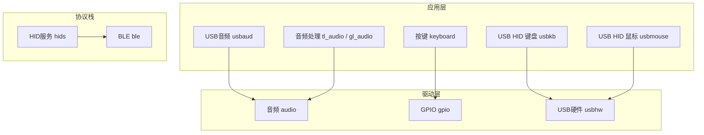
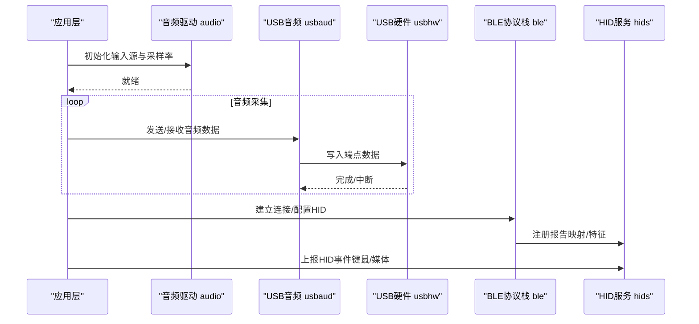
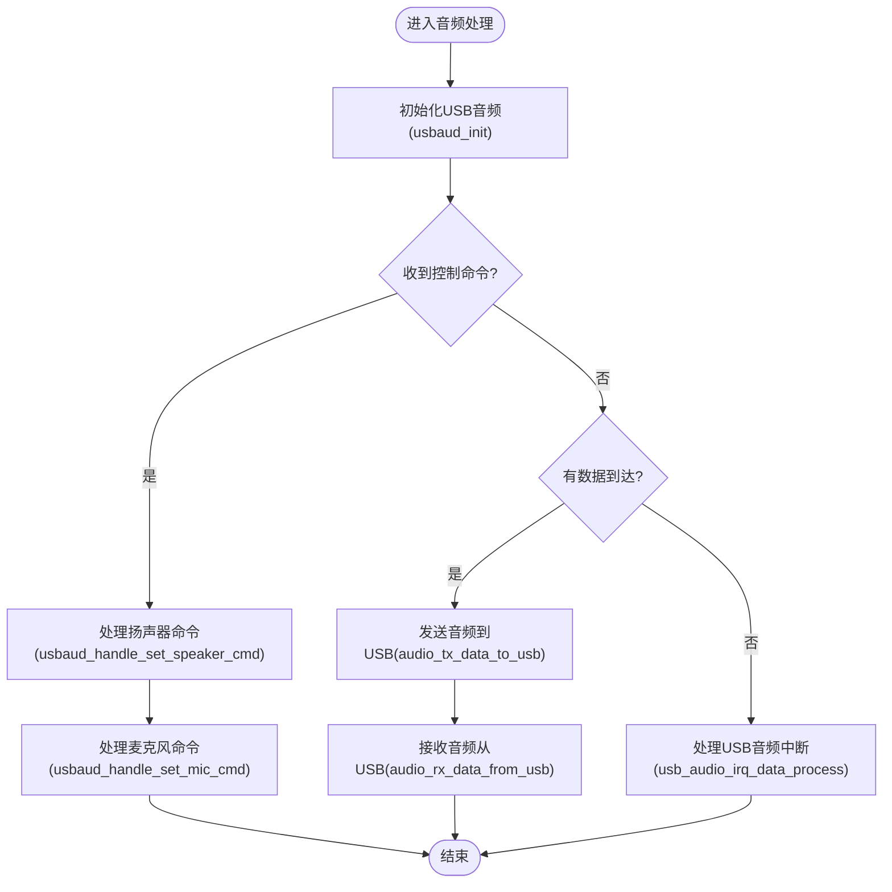
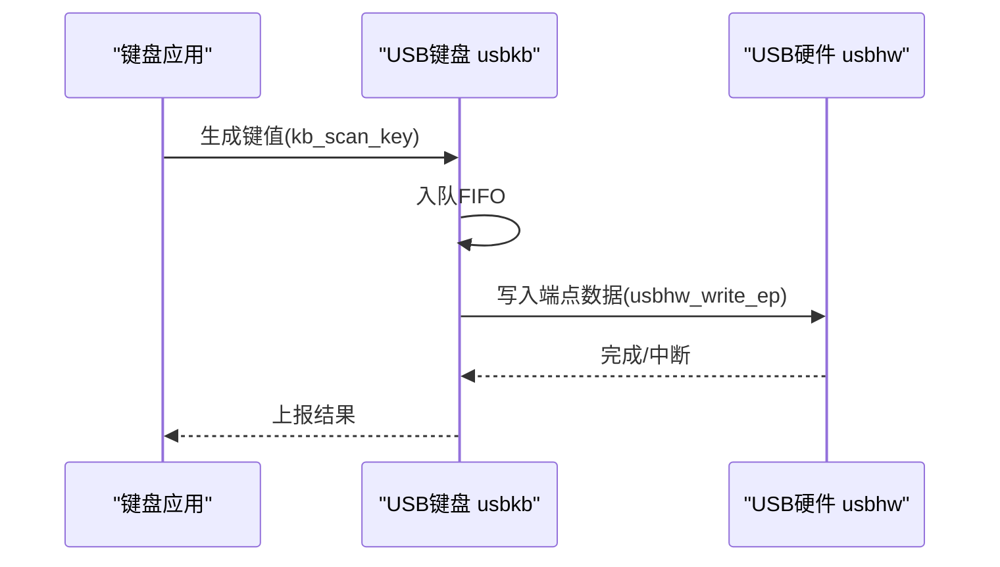
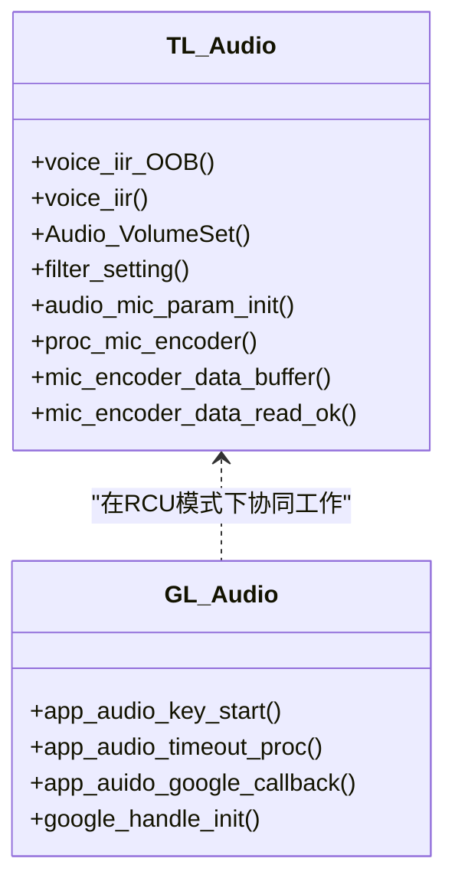
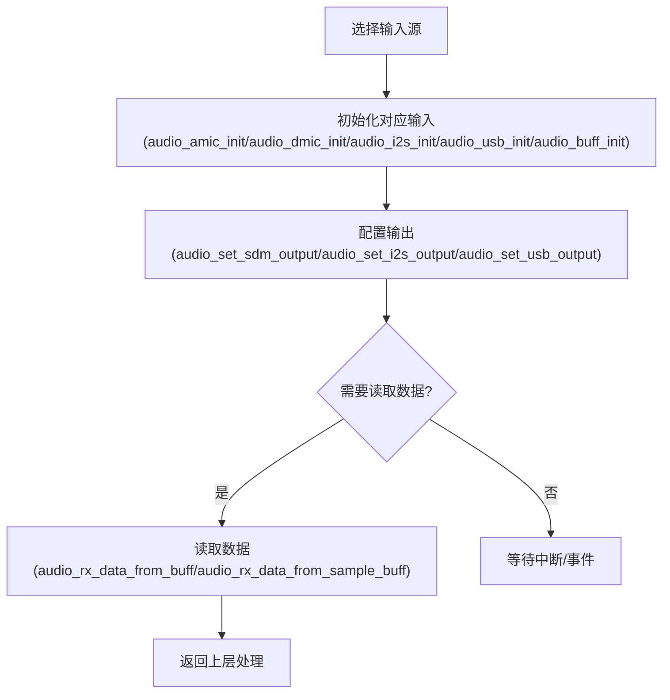
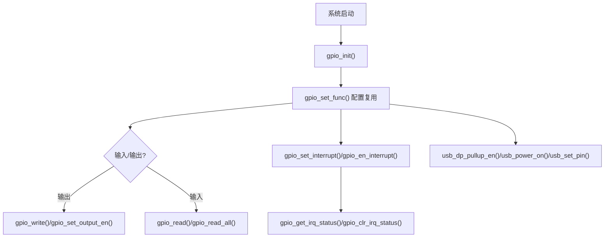
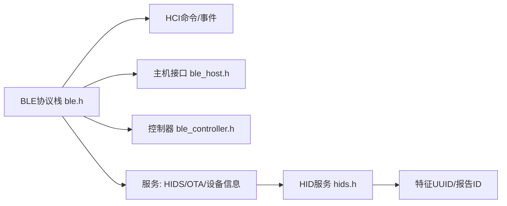
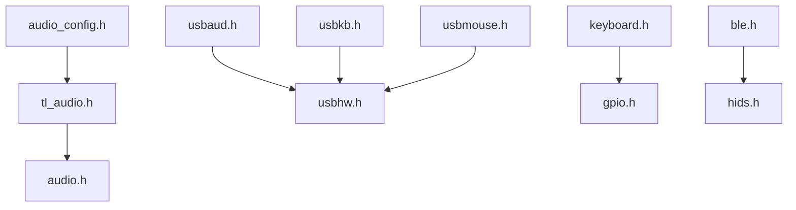

# API参考手册

<cite>
**本文引用的文件**
- [tl_audio.h](file://tc_ble_single_sdk/application/audio/tl_audio.h)
- [audio_config.h](file://tc_ble_single_sdk/application/audio/audio_config.h)
- [gl_audio.h](file://tc_ble_single_sdk/application/audio/gl_audio.h)
- [usbaud.h](file://tc_ble_single_sdk/application/app/usbaud.h)
- [usbmouse.h](file://tc_ble_single_sdk/application/app/usbmouse.h)
- [usbkb.h](file://tc_ble_single_sdk/application/app/usbkb.h)
- [keyboard.h](file://tc_ble_single_sdk/application/keyboard/keyboard.h)
- [audio.h](file://tc_ble_single_sdk/drivers/B85/audio.h)
- [gpio.h](file://tc_ble_single_sdk/drivers/B85/gpio.h)
- [usbhw.h](file://tc_ble_single_sdk/drivers/B85/usbhw.h)
- [ble.h](file://tc_ble_single_sdk/stack/ble/ble.h)
- [hids.h](file://tc_ble_single_sdk/stack/ble/service/hids.h)
- [types.h](file://tc_ble_single_sdk/common/types.h)
</cite>

## 目录
1. [简介](#简介)
2. [项目结构](#项目结构)
3. [核心组件](#核心组件)
4. [架构总览](#架构总览)
5. [详细组件分析](#详细组件分析)
6. [依赖关系分析](#依赖关系分析)
7. [性能考虑](#性能考虑)
8. [故障排查指南](#故障排查指南)
9. [结论](#结论)
10. [附录](#附录)

## 简介
本API参考手册面向基于Telink B85/B87的音频鼠标SDK，覆盖USB接口、音频处理、GPIO控制与蓝牙协议栈等关键模块。文档按功能模块组织，提供公共接口的函数原型、参数说明、返回值定义、使用注意事项与错误处理机制，并给出代码示例路径，便于快速集成与调试。

## 项目结构
该SDK采用分层设计：
- 应用层（application）：USB HID（键盘、鼠标）、USB音频、音频算法与Google语音适配、按键扫描等。
- 驱动层（drivers/B8x）：音频编解码、GPIO、USB硬件、时钟、定时器、I2C/SPI/UART等外设驱动。
- 协议栈（stack/ble）：BLE控制器与主机、HID服务、OTA、设备信息等。
- 通用（common）：基础类型、字符串工具、版本信息等。

图表来源
- [usbaud.h:91-113](file://tc_ble_single_sdk/application/app/usbaud.h#L91-L113)
- [usbkb.h:59-61](file://tc_ble_single_sdk/application/app/usbkb.h#L59-L61)
- [usbmouse.h:50-50](file://tc_ble_single_sdk/application/app/usbmouse.h#L50-L50)
- [tl_audio.h:107-118](file://tc_ble_single_sdk/application/audio/tl_audio.h#L107-L118)
- [audio.h:136-202](file://tc_ble_single_sdk/drivers/B85/audio.h#L136-L202)
- [gpio.h:173-196](file://tc_ble_single_sdk/drivers/B85/gpio.h#L173-L196)
- [usbhw.h:207-213](file://tc_ble_single_sdk/drivers/B85/usbhw.h#L207-L213)
- [ble.h:28-44](file://tc_ble_single_sdk/stack/ble/ble.h#L28-L44)
- [hids.h:27-85](file://tc_ble_single_sdk/stack/ble/service/hids.h#L27-L85)

章节来源
- [usbaud.h:91-113](file://tc_ble_single_sdk/application/app/usbaud.h#L91-L113)
- [usbkb.h:59-61](file://tc_ble_single_sdk/application/app/usbkb.h#L59-L61)
- [usbmouse.h:50-50](file://tc_ble_single_sdk/application/app/usbmouse.h#L50-L50)
- [tl_audio.h:107-118](file://tc_ble_single_sdk/application/audio/tl_audio.h#L107-L118)
- [audio.h:136-202](file://tc_ble_single_sdk/drivers/B85/audio.h#L136-L202)
- [gpio.h:173-196](file://tc_ble_single_sdk/drivers/B85/gpio.h#L173-L196)
- [usbhw.h:207-213](file://tc_ble_single_sdk/drivers/B85/usbhw.h#L207-L213)
- [ble.h:28-44](file://tc_ble_single_sdk/stack/ble/ble.h#L28-L44)
- [hids.h:27-85](file://tc_ble_single_sdk/stack/ble/service/hids.h#L27-L85)

## 核心组件
- USB音频：负责麦克风/扬声器数据收发、音量控制、静音控制及USB中断数据处理。
- USB HID（键盘/鼠标）：上报键值与鼠标移动、滚轮事件。
- 音频处理：ADC/DMIC/I2S/USB输入选择、采样率配置、编码（ADPCM/SBC/MSBC）与缓冲管理。
- GPIO控制：引脚复用、电平读写、中断配置、USB DP上拉与电源控制。
- BLE协议栈：HID服务、报告映射、连接管理与OTA服务。

章节来源
- [usbaud.h:91-113](file://tc_ble_single_sdk/application/app/usbaud.h#L91-L113)
- [usbkb.h:59-61](file://tc_ble_single_sdk/application/app/usbkb.h#L59-L61)
- [usbmouse.h:50-50](file://tc_ble_single_sdk/application/app/usbmouse.h#L50-L50)
- [tl_audio.h:107-118](file://tc_ble_single_sdk/application/audio/tl_audio.h#L107-L118)
- [audio.h:136-202](file://tc_ble_single_sdk/drivers/B85/audio.h#L136-L202)
- [gpio.h:173-196](file://tc_ble_single_sdk/drivers/B85/gpio.h#L173-L196)
- [ble.h:28-44](file://tc_ble_single_sdk/stack/ble/ble.h#L28-L44)

## 架构总览
下图展示从传感器/音频采集到USB/BLE上报的整体流程，以及各模块间的调用关系。

图表来源
- [audio.h:136-202](file://tc_ble_single_sdk/drivers/B85/audio.h#L136-L202)
- [usbaud.h:91-113](file://tc_ble_single_sdk/application/app/usbaud.h#L91-L113)
- [usbhw.h:207-213](file://tc_ble_single_sdk/drivers/B85/usbhw.h#L207-L213)
- [ble.h:28-44](file://tc_ble_single_sdk/stack/ble/ble.h#L28-L44)
- [hids.h:27-85](file://tc_ble_single_sdk/stack/ble/service/hids.h#L27-L85)

## 详细组件分析

### USB音频接口（usbaud）
- 初始化与状态
  - 初始化：用于设置USB音频类相关结构与端点。
  - 获取音量：分别获取扬声器与麦克风当前音量。
  - 麦克风使能：开启或关闭麦克风采集。
- 命令处理
  - 设置扬声器命令：根据类型执行音量/静音等操作。
  - 设置麦克风命令：根据类型执行音量/静音等操作。
  - 获取扬声器/麦克风属性：查询当前音量、步长、静音状态。
- 数据通道
  - 发送音频到USB：指定输入类型与采样率进行上行传输。
  - 从USB接收音频：读取下行音频数据。
  - USB音频中断处理：统一处理USB音频相关中断与数据流。

图表来源
- [usbaud.h:91-113](file://tc_ble_single_sdk/application/app/usbaud.h#L91-L113)

章节来源
- [usbaud.h:91-113](file://tc_ble_single_sdk/application/app/usbaud.h#L91-L113)

### USB HID（键盘/鼠标）
- 键盘
  - 正常上报：将修饰键与键码数组通过HID报告发送。
  - FIFO处理：维护USB FIFO队列，批量处理上报。
- 鼠标
  - 上报：封装按钮、X/Y位移、滚轮为HID报告并发送。

图表来源
- [usbkb.h:59-61](file://tc_ble_single_sdk/application/app/usbkb.h#L59-L61)
- [usbhw.h:207-213](file://tc_ble_single_sdk/drivers/B85/usbhw.h#L207-L213)
- [keyboard.h:98-112](file://tc_ble_single_sdk/application/keyboard/keyboard.h#L98-L112)

章节来源
- [usbkb.h:59-61](file://tc_ble_single_sdk/application/app/usbkb.h#L59-L61)
- [usbmouse.h:50-50](file://tc_ble_single_sdk/application/app/usbmouse.h#L50-L50)
- [keyboard.h:98-112](file://tc_ble_single_sdk/application/keyboard/keyboard.h#L98-L112)

### 音频处理（tl_audio / gl_audio）
- RCU项目模式
  - IIR滤波：对音频数据进行带外滤波与常规滤波。
  - 音量设置：支持输入/输出选择与音量调节。
  - 滤波器设置：配置音频通路滤波参数。
  - 麦克风参数初始化：初始化ADC/DMIC等参数。
  - 编码器处理：周期性处理麦克风编码（如ADPCM）。
  - 缓冲区管理：获取编码器数据缓冲区指针，标记读取完成。
- Google语音适配（gl_audio）
  - 按键启动：触发语音采集开始/停止。
  - 超时处理：处理语音会话超时逻辑。
  - 回调处理：Google语音事件回调入口。
  - 初始化：配置Google语音所需的控制/报告端点句柄。

图表来源
- [tl_audio.h:107-118](file://tc_ble_single_sdk/application/audio/tl_audio.h#L107-L118)
- [gl_audio.h:145-149](file://tc_ble_single_sdk/application/audio/gl_audio.h#L145-L149)

章节来源
- [tl_audio.h:107-118](file://tc_ble_single_sdk/application/audio/tl_audio.h#L107-L118)
- [gl_audio.h:145-149](file://tc_ble_single_sdk/application/audio/gl_audio.h#L145-L149)

### 音频驱动（audio）
- 初始化与配置
  - 音频复位/停止：重置或关闭音频模块。
  - DMIC/I2S时钟：配置分频与调制参数。
  - 输入源初始化：AMIC/DMIC/I2S/USB/BUFFER输入初始化。
  - 输出配置：SDM/I2S/USB输出模式与参数。
  - Codec设置：I2S输入与编解码器模式。
- 数据读取
  - 从缓冲读取：以字节或16位样本读取音频数据。
  - AMIC模式：单声道/立体声切换。
  - SDM输出模式：单/双输出模式。

图表来源
- [audio.h:86-202](file://tc_ble_single_sdk/drivers/B85/audio.h#L86-L202)

章节来源
- [audio.h:86-202](file://tc_ble_single_sdk/drivers/B85/audio.h#L86-L202)

### GPIO控制（gpio）
- 初始化与复用
  - GPIO初始化：整体初始化，可选模拟寄存器复位。
  - 功能复用：设置引脚为特定功能（如USB、I2S、DMIC等）。
- 输入输出
  - 输出使能/输入使能：启用或禁用引脚方向。
  - 写电平/读电平：直接操作引脚电平与读取状态。
  - 批量读取：一次性读取多组引脚状态。
- 中断
  - 中断极性：上升沿/下降沿触发。
  - 中断使能/屏蔽：全局或引脚级中断控制。
  - 状态查询/清除：读取与清除中断标志。
- USB相关
  - DP上拉：控制USB DP内部上拉电阻。
  - USB电源：控制USB模块供电。
  - USB引脚复用：将GPIO复用为USB DP/DM，并可选启用dp_through_swire。

图表来源
- [gpio.h:173-196](file://tc_ble_single_sdk/drivers/B85/gpio.h#L173-L196)
- [gpio.h:244-269](file://tc_ble_single_sdk/drivers/B85/gpio.h#L244-L269)
- [gpio.h:294-332](file://tc_ble_single_sdk/drivers/B85/gpio.h#L294-L332)
- [gpio.h:505-560](file://tc_ble_single_sdk/drivers/B85/gpio.h#L505-L560)

章节来源
- [gpio.h:173-196](file://tc_ble_single_sdk/drivers/B85/gpio.h#L173-L196)
- [gpio.h:244-269](file://tc_ble_single_sdk/drivers/B85/gpio.h#L244-L269)
- [gpio.h:294-332](file://tc_ble_single_sdk/drivers/B85/gpio.h#L294-L332)
- [gpio.h:505-560](file://tc_ble_single_sdk/drivers/B85/gpio.h#L505-L560)

### 蓝牙协议栈（BLE/HID）
- 协议栈入口
  - 包含控制器与主机接口、HCI命令/事件、HID服务、OTA、设备信息、UUID等。
- HID服务
  - 特征UUID：Boot Key Input/Output、Mouse Input、Report Map、Control Point、Protocol Mode等。
  - 报告ID：键盘输入、消费控制输入、鼠标输入、游戏手柄输入、LED输出、特性报告、音频输入等。
  - 协议模式：Boot/Report模式。
  - 标志位：远程唤醒、通常可连接。

图表来源
- [ble.h:28-44](file://tc_ble_single_sdk/stack/ble/ble.h#L28-L44)
- [hids.h:27-85](file://tc_ble_single_sdk/stack/ble/service/hids.h#L27-L85)

章节来源
- [ble.h:28-44](file://tc_ble_single_sdk/stack/ble/ble.h#L28-L44)
- [hids.h:27-85](file://tc_ble_single_sdk/stack/ble/service/hids.h#L27-L85)

## 依赖关系分析
- 应用层依赖驱动层提供的音频、GPIO、USB硬件能力。
- 音频处理模块依赖音频驱动与配置宏（不同项目模式决定缓冲大小、包长度等）。
- USB HID与USB音频共享USB硬件抽象，避免端点冲突。
- BLE协议栈通过HID服务向上层暴露标准HID能力，兼容操作系统HID栈。

图表来源
- [tl_audio.h:107-118](file://tc_ble_single_sdk/application/audio/tl_audio.h#L107-L118)
- [audio.h:136-202](file://tc_ble_single_sdk/drivers/B85/audio.h#L136-L202)
- [usbaud.h:91-113](file://tc_ble_single_sdk/application/app/usbaud.h#L91-L113)
- [usbhw.h:207-213](file://tc_ble_single_sdk/drivers/B85/usbhw.h#L207-L213)
- [usbkb.h:59-61](file://tc_ble_single_sdk/application/app/usbkb.h#L59-L61)
- [usbmouse.h:50-50](file://tc_ble_single_sdk/application/app/usbmouse.h#L50-L50)
- [keyboard.h:98-112](file://tc_ble_single_sdk/application/keyboard/keyboard.h#L98-L112)
- [gpio.h:173-196](file://tc_ble_single_sdk/drivers/B85/gpio.h#L173-L196)
- [ble.h:28-44](file://tc_ble_single_sdk/stack/ble/ble.h#L28-L44)
- [hids.h:27-85](file://tc_ble_single_sdk/stack/ble/service/hids.h#L27-L85)
- [audio_config.h:28-123](file://tc_ble_single_sdk/application/audio/audio_config.h#L28-L123)

章节来源
- [audio_config.h:28-123](file://tc_ble_single_sdk/application/audio/audio_config.h#L28-L123)
- [usbhw.h:207-213](file://tc_ble_single_sdk/drivers/B85/usbhw.h#L207-L213)
- [ble.h:28-44](file://tc_ble_single_sdk/stack/ble/ble.h#L28-L44)

## 性能考虑
- 音频缓冲与包长度：依据项目模式（RCU/Dongle）与编码格式（ADPCM/SBC/MSBC）选择合适的缓冲大小与包长度，避免溢出或延迟过大。
- 端点带宽：USB音频与HID共用端点时，需合理分配带宽，避免高负载下丢包。
- 中断处理：USB音频中断频繁，建议在中断中仅做最小化处理，将数据搬运至缓冲区后由主循环处理。
- 功耗优化：在不使用时关闭音频模块与USB电源；合理使用GPIO低功耗模式与中断唤醒。

[本节为通用指导，不直接分析具体文件]

## 故障排查指南
- USB无法枚举
  - 检查DP上拉是否启用、USB电源是否打开、引脚复用是否正确。
  - 参考：USB DP上拉、USB电源、USB引脚复用。
- 音频无声或杂音
  - 确认输入源初始化与采样率匹配；检查滤波器设置与音量配置。
  - 参考：音频输入初始化、滤波器设置、音量设置。
- HID上报异常
  - 检查HID报告结构、报告ID与FIFO处理逻辑；确认端点忙状态与ACK。
  - 参考：键盘/鼠标上报、USB端点操作。
- BLE连接失败
  - 检查HID服务特征是否注册、协议模式是否正确；查看HCI事件与错误码。
  - 参考：BLE协议栈、HID服务。

章节来源
- [gpio.h:505-560](file://tc_ble_single_sdk/drivers/B85/gpio.h#L505-L560)
- [audio.h:136-202](file://tc_ble_single_sdk/drivers/B85/audio.h#L136-L202)
- [usbkb.h:59-61](file://tc_ble_single_sdk/application/app/usbkb.h#L59-L61)
- [usbhw.h:170-195](file://tc_ble_single_sdk/drivers/B85/usbhw.h#L170-L195)
- [ble.h:28-44](file://tc_ble_single_sdk/stack/ble/ble.h#L28-L44)
- [hids.h:27-85](file://tc_ble_single_sdk/stack/ble/service/hids.h#L27-L85)

## 结论
本手册梳理了音频鼠标SDK的核心API，涵盖USB音频、USB HID、音频处理、GPIO控制与BLE协议栈。通过模块化设计与清晰的接口定义，开发者可快速集成音频采集、编码与上报，以及键鼠事件与蓝牙通信。建议在项目中结合配置宏与驱动初始化顺序，确保资源分配与带宽满足实时性要求。

[本节为总结，不直接分析具体文件]

## 附录
- 常用类型定义：u8/s8/u16/s16/u32/s32等基础类型与布尔常量。
- 音频配置宏：不同项目模式下的缓冲大小、包长度、解码尺寸等。

章节来源
- [types.h:27-99](file://tc_ble_single_sdk/common/types.h#L27-L99)
- [audio_config.h:28-123](file://tc_ble_single_sdk/application/audio/audio_config.h#L28-L123)