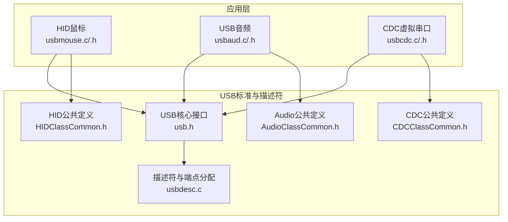
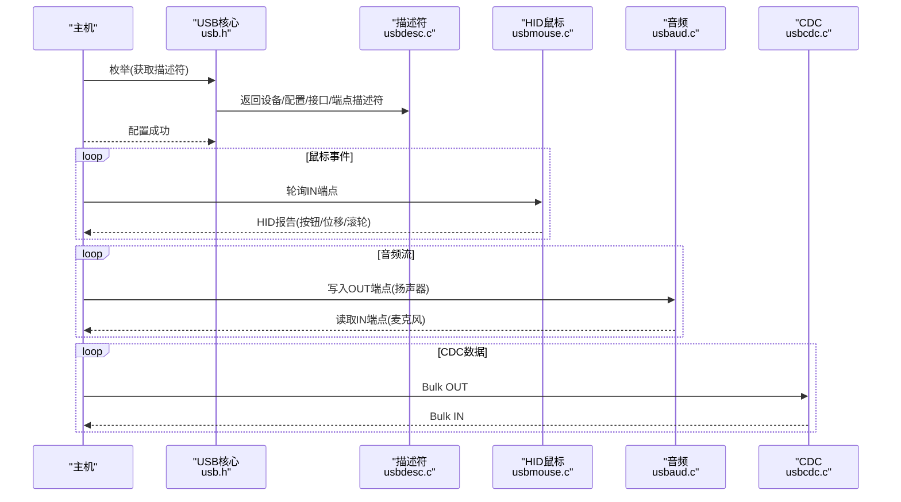
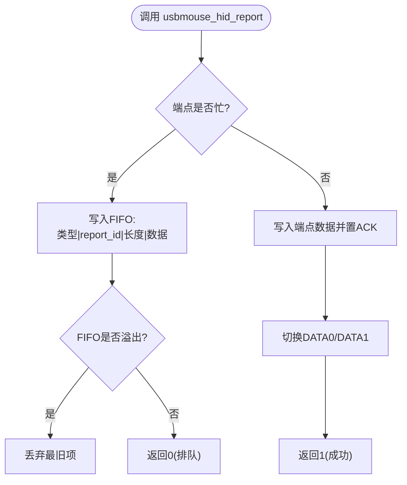
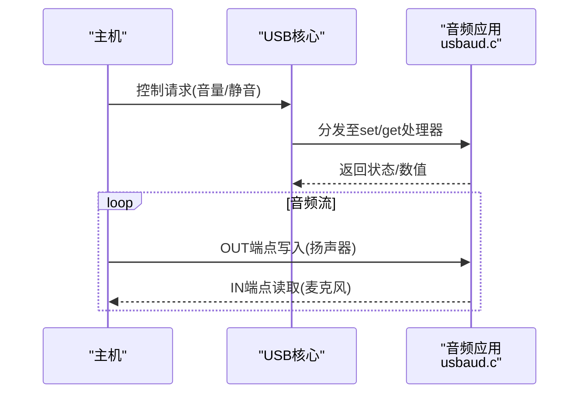
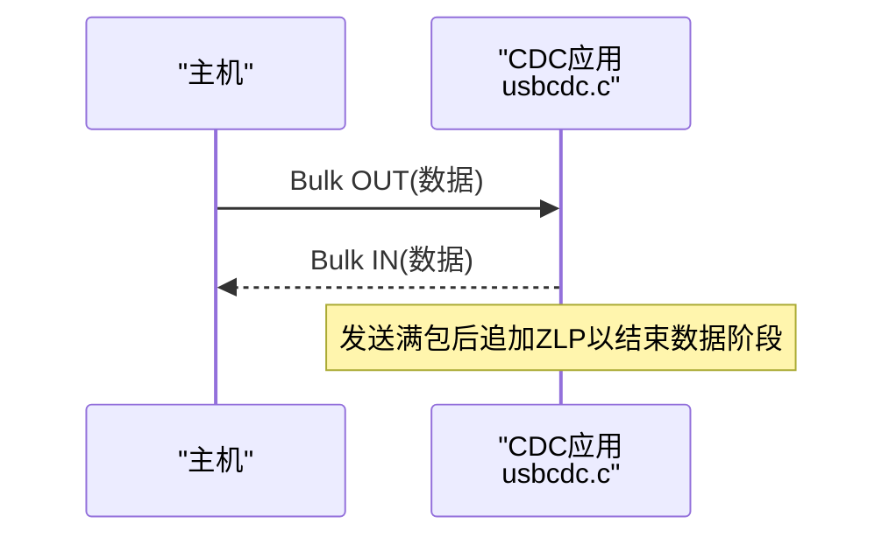
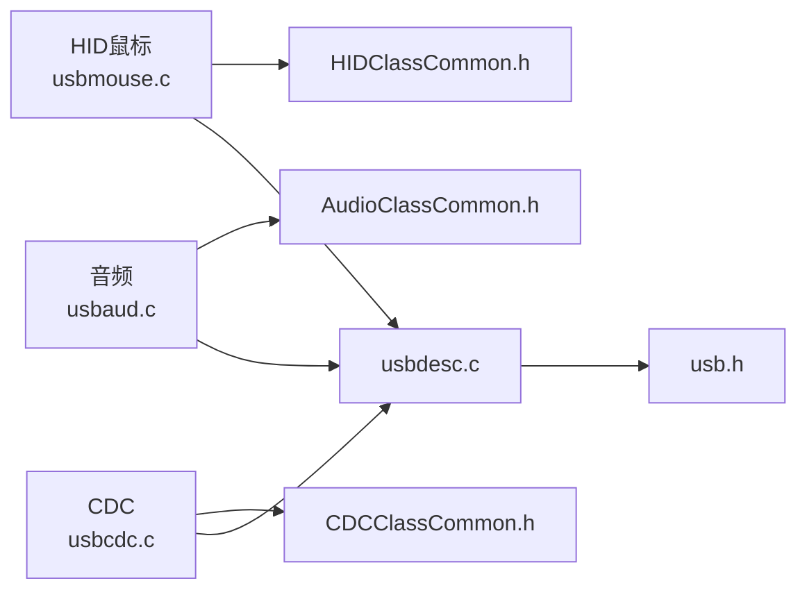

# USB接口API

<cite>
**本文引用的文件**
- [usbmouse.c](file://tc_ble_single_sdk/application/app/usbmouse.c)
- [usbmouse.h](file://tc_ble_single_sdk/application/app/usbmouse.h)
- [usbaud.c](file://tc_ble_single_sdk/application/app/usbaud.c)
- [usbaud.h](file://tc_ble_single_sdk/application/app/usbaud.h)
- [usbcdc.c](file://tc_ble_single_sdk/application/app/usbcdc.c)
- [usbcdc.h](file://tc_ble_single_sdk/application/app/usbcdc.h)
- [usb.h](file://tc_ble_single_sdk/application/usbstd/usb.h)
- [usbdesc.c](file://tc_ble_single_sdk/application/usbstd/usbdesc.c)
- [HIDClassCommon.h](file://tc_ble_single_sdk/application/usbstd/HIDClassCommon.h)
- [AudioClassCommon.h](file://tc_ble_single_sdk/application/usbstd/AudioClassCommon.h)
- [CDCClassCommon.h](file://tc_ble_single_sdk/application/usbstd/CDCClassCommon.h)
</cite>

## 目录
1. [简介](#简介)
2. [项目结构](#项目结构)
3. [核心组件](#核心组件)
4. [架构总览](#架构总览)
5. [详细组件分析](#详细组件分析)
6. [依赖关系分析](#依赖关系分析)
7. [性能考虑](#性能考虑)
8. [故障排查指南](#故障排查指南)
9. [结论](#结论)
10. [附录](#附录)

## 简介
本技术文档面向USB设备端（Device）的三类接口：HID（鼠标/键盘）、USB Audio、CDC（虚拟串口）。重点说明：
- USB设备初始化、枚举与端点配置
- HID报告发送流程，尤其是usbmouse_hid_report的使用方法与FIFO队列机制
- 音频数据流（麦克风输入、扬声器输出）及音量/静音控制
- CDC数据收发
- USB模式切换、电源管理与错误处理要点

## 项目结构
本项目将USB各功能按类分层组织：
- application/app：具体类实现（HID鼠标、音频、CDC等）
- application/usbstd：USB标准描述符、类公共定义（HID/Audio/CDC）
- drivers：底层驱动（寄存器访问、DMA、时钟、中断等）

图表来源
- [usb.h:61-80](file://tc_ble_single_sdk/application/usbstd/usb.h#L61-L80)
- [usbdesc.c:234-761](file://tc_ble_single_sdk/application/usbstd/usbdesc.c#L234-L761)
- [HIDClassCommon.h:326-444](file://tc_ble_single_sdk/application/usbstd/HIDClassCommon.h#L326-L444)
- [AudioClassCommon.h:91-138](file://tc_ble_single_sdk/application/usbstd/AudioClassCommon.h#L91-L138)
- [CDCClassCommon.h:55-77](file://tc_ble_single_sdk/application/usbstd/CDCClassCommon.h#L55-L77)

章节来源
- [usb.h:61-80](file://tc_ble_single_sdk/application/usbstd/usb.h#L61-L80)
- [usbdesc.c:234-761](file://tc_ble_single_sdk/application/usbstd/usbdesc.c#L234-L761)

## 核心组件
- HID鼠标：提供鼠标移动、按键、滚轮上报；内部维护环形缓冲与FIFO队列，支持平滑上报与释放超时。
- USB音频：提供麦克风采集上行、扬声器下行、音量/静音控制；支持单声道/立体声设置。
- CDC：提供批量数据传输，支持主机到设备与设备到主机双向通信。

章节来源
- [usbmouse.c:44-151](file://tc_ble_single_sdk/application/app/usbmouse.c#L44-L151)
- [usbaud.c:53-100,311-453:53-100](file://tc_ble_single_sdk/application/app/usbaud.c#L53-L100)
- [usbcdc.c:42-93](file://tc_ble_single_sdk/application/app/usbcdc.c#L42-L93)

## 架构总览
USB设备通过描述符声明多接口（HID Mouse、Audio、CDC），由USB核心调度中断与请求处理，应用层在各端点回调中完成数据收发与控制命令处理。

图表来源
- [usbdesc.c:234-761](file://tc_ble_single_sdk/application/usbstd/usbdesc.c#L234-L761)
- [usb.h:61-80](file://tc_ble_single_sdk/application/usbstd/usb.h#L61-L80)
- [usbmouse.c:107-151](file://tc_ble_single_sdk/application/app/usbmouse.c#L107-L151)
- [usbaud.c:311-453](file://tc_ble_single_sdk/application/app/usbaud.c#L311-L453)
- [usbcdc.c:42-93](file://tc_ble_single_sdk/application/app/usbcdc.c#L42-L93)

## 详细组件分析

### HID鼠标接口（HID类）
- 数据结构
  - mouse_data_t：包含按钮位、X/Y位移、滚轮增量。
  - MOUSE_REPORT_DATA_LEN：报告长度常量。
- 关键API
  - usbmouse_hid_report(report_id, data, cnt)：向主机发送HID报告。当端点忙时，将{类型, report_id, 长度, 数据}压入FIFO队列；否则直接写入端点并置ACK。
  - usbmouse_add_frame(packet_mouse, packet_num)：将多个鼠标帧加入环形缓冲。
  - usbmouse_report_frame()：周期性从环形缓冲取数据并通过usbmouse_hid_report发送。
  - usbmouse_release_check()：若按键未释放且超过超时时间，自动发送“无按键”报告。
- FIFO与平滑上报
  - 当端点忙时，使用固定大小FIFO暂存待发送项；若溢出则丢弃最旧数据。
  - 可选平滑上报：在低负载时延迟发送，减少频繁中断。
- 端点与协议
  - 使用中断IN端点USB_EDP_MOUSE，轮询间隔由描述符配置。
  - 支持Boot协议与非Boot协议两种报告格式。

图表来源
- [usbmouse.c:107-151](file://tc_ble_single_sdk/application/app/usbmouse.c#L107-L151)

章节来源
- [usbmouse.c:44-151](file://tc_ble_single_sdk/application/app/usbmouse.c#L44-L151)
- [usbmouse.h:40-50](file://tc_ble_single_sdk/application/app/usbmouse.h#L40-L50)
- [HIDClassCommon.h:326-444](file://tc_ble_single_sdk/application/usbstd/HIDClassCommon.h#L326-L444)
- [usbdesc.c:693-712](file://tc_ble_single_sdk/application/usbstd/usbdesc.c#L693-L712)

#### 鼠标事件使用示例（步骤）
- 鼠标移动
  - 构造mouse_data_t，填充x/y与按钮状态。
  - 调用usbmouse_add_frame或usbmouse_report_frame进行上报。
- 按键事件
  - 设置按钮位，调用usbmouse_hid_report发送；若长时间未释放，release_check会自动发送释放。
- 滚轮操作
  - 设置wheel字段，随同其他字段一起上报。

章节来源
- [usbmouse.c:44-98](file://tc_ble_single_sdk/application/app/usbmouse.c#L44-L98)
- [usbmouse.c:107-151](file://tc_ble_single_sdk/application/app/usbmouse.c#L107-L151)

### USB音频接口（Audio类）
- 控制面
  - usbaud_set_audio_mode(mono_en)：设置麦克风端点为单声道或立体声。
  - usbaud_handle_set_speaker_cmd / usbaud_handle_set_mic_cmd：处理主机下发的静音/音量设置。
  - usbaud_handle_get_speaker_cmd / usbaud_handle_get_mic_cmd：响应主机的查询请求（当前值、最小/最大、分辨率）。
  - usbaud_init：初始化默认音量与通道模式。
- 数据面
  - audio_tx_data_to_usb(Input_Type, Audio_Rate)：将麦克风采样数据写入IN端点（ISO/同步）。
  - audio_rx_data_from_usb()：从OUT端点读取扬声器数据并写入DAC/音频路径。
  - usb_audio_irq_data_process()：处理端点中断计数。
- 音量/静音
  - 通过Feature Unit控制，支持Mute与Volume属性。

图表来源
- [usbaud.c:53-100](file://tc_ble_single_sdk/application/app/usbaud.c#L53-L100)
- [usbaud.c:162-293](file://tc_ble_single_sdk/application/app/usbaud.c#L162-L293)
- [usbaud.c:311-453](file://tc_ble_single_sdk/application/app/usbaud.c#L311-L453)
- [AudioClassCommon.h:91-138](file://tc_ble_single_sdk/application/usbstd/AudioClassCommon.h#L91-L138)

章节来源
- [usbaud.c:53-100](file://tc_ble_single_sdk/application/app/usbaud.c#L53-L100)
- [usbaud.c:162-293](file://tc_ble_single_sdk/application/app/usbaud.c#L162-L293)
- [usbaud.c:311-453](file://tc_ble_single_sdk/application/app/usbaud.c#L311-L453)
- [usbaud.h:52-113](file://tc_ble_single_sdk/application/app/usbaud.h#L52-L113)
- [AudioClassCommon.h:91-138](file://tc_ble_single_sdk/application/usbstd/AudioClassCommon.h#L91-L138)

### CDC接口（CDC类）
- 端点
  - 通知端点：CDC_NOTIFICATION_EPNUM（中断）
  - 数据端点：CDC_TX_EPNUM（Bulk IN）、CDC_RX_EPNUM（Bulk OUT）
- API
  - usb_cdc_tx_data_to_host(data_ptr, data_len)：发送数据到主机；若长度为wMaxPacketSize倍数，需发送ZLP。
  - usb_cdc_rx_data_from_host(rx_buff)：从主机接收数据。
- 线编码
  - LineCoding用于波特率、停止位、校验位、数据位配置。

图表来源
- [usbcdc.c:42-93](file://tc_ble_single_sdk/application/app/usbcdc.c#L42-L93)
- [usbcdc.h:38-59](file://tc_ble_single_sdk/application/app/usbcdc.h#L38-L59)
- [CDCClassCommon.h:55-77](file://tc_ble_single_sdk/application/usbstd/CDCClassCommon.h#L55-L77)

章节来源
- [usbcdc.c:42-93](file://tc_ble_single_sdk/application/app/usbcdc.c#L42-L93)
- [usbcdc.h:38-59](file://tc_ble_single_sdk/application/app/usbcdc.h#L38-L59)
- [CDCClassCommon.h:55-77](file://tc_ble_single_sdk/application/usbstd/CDCClassCommon.h#L55-L77)

### USB连接管理、设备枚举与端点配置
- 设备/配置/接口/端点描述符集中定义于usbdesc.c，启用宏控制各类接口（HID Mouse、Audio、CDC等）。
- USB核心暴露usb_init、usb_handle_irq等入口，负责枚举、请求分发与端点中断处理。
- 端点号与大小在描述符中声明，应用层通过reg_usb_ep_*系列寄存器访问。

章节来源
- [usbdesc.c:234-761](file://tc_ble_single_sdk/application/usbstd/usbdesc.c#L234-L761)
- [usb.h:61-80](file://tc_ble_single_sdk/application/usbstd/usb.h#L61-L80)

### USB模式切换、电源管理与错误处理
- 模式切换
  - 通过编译宏（如USB_MIC_ENABLE、USB_SPEAKER_ENABLE、USB_CDC_ENABLE、USB_MOUSE_ENABLE）组合不同功能接口。
  - 音频单/立体声可通过usbaud_set_audio_mode切换。
- 电源管理
  - 支持选择性挂起与远程唤醒（OS特性描述符中体现）。
  - 可结合USB_TIME_BEFORE_ALLOW_SUSPEND等常量调整挂起策略。
- 错误处理
  - HID报告：端点忙时进入FIFO，溢出会丢弃最旧数据；非零返回表示立即发送成功。
  - CDC：发送满包需发送ZLP，否则主机可能无法识别数据结束。
  - 音频：注意DFIFO下溢/上溢标志，避免丢帧或卡顿。

章节来源
- [usbdesc.c:83-171](file://tc_ble_single_sdk/application/usbstd/usbdesc.c#L83-L171)
- [usb.h:33-48](file://tc_ble_single_sdk/application/usbstd/usb.h#L33-L48)
- [usbmouse.c:107-151](file://tc_ble_single_sdk/application/app/usbmouse.c#L107-L151)
- [usbcdc.c:42-93](file://tc_ble_single_sdk/application/app/usbcdc.c#L42-L93)
- [usbaud.c:311-453](file://tc_ble_single_sdk/application/app/usbaud.c#L311-L453)

## 依赖关系分析
- 应用层依赖USB核心与描述符：
  - HID鼠标依赖HIDClassCommon与描述符中的Mouse接口/端点。
  - 音频依赖AudioClassCommon与描述符中的AC/AS接口/端点。
  - CDC依赖CDCClassCommon与描述符中的ACM/Data接口/端点。
- 端点复用与冲突：
  - 各接口使用独立端点号，避免冲突。
  - 音频IN/OUT为同步端点，对时序要求高。

图表来源
- [usbmouse.c:107-151](file://tc_ble_single_sdk/application/app/usbmouse.c#L107-L151)
- [usbaud.c:311-453](file://tc_ble_single_sdk/application/app/usbaud.c#L311-L453)
- [usbcdc.c:42-93](file://tc_ble_single_sdk/application/app/usbcdc.c#L42-L93)
- [usbdesc.c:234-761](file://tc_ble_single_sdk/application/usbstd/usbdesc.c#L234-L761)
- [usb.h:61-80](file://tc_ble_single_sdk/application/usbstd/usb.h#L61-L80)

章节来源
- [usbdesc.c:234-761](file://tc_ble_single_sdk/application/usbstd/usbdesc.c#L234-L761)
- [usb.h:61-80](file://tc_ble_single_sdk/application/usbstd/usb.h#L61-L80)

## 性能考虑
- HID鼠标
  - 合理设置轮询间隔与平滑上报阈值，降低CPU占用。
  - FIFO容量应满足峰值突发，避免频繁溢出。
- 音频
  - 选择合适采样率与位宽，平衡音质与带宽。
  - 关注DFIFO中断标志，及时读写避免丢帧。
- CDC
  - 批量传输尽量对齐wMaxPacketSize，必要时发送ZLP。
  - 大文件分块传输，避免阻塞。

[本节为通用指导，不直接分析具体文件]

## 故障排查指南
- 鼠标无响应
  - 检查端点是否忙与FIFO是否溢出；确认usbmouse_report_frame被周期性调用。
  - 确认描述符中Mouse端点已启用且轮询间隔合理。
- 音频无声/爆音
  - 检查单/立体声设置是否与主机期望一致。
  - 监控DFIFO中断，确保及时读写。
- CDC无法通信
  - 确认LineCoding设置与主机一致。
  - 发送满包后是否发送了ZLP。

章节来源
- [usbmouse.c:44-151](file://tc_ble_single_sdk/application/app/usbmouse.c#L44-L151)
- [usbaud.c:311-453](file://tc_ble_single_sdk/application/app/usbaud.c#L311-L453)
- [usbcdc.c:42-93](file://tc_ble_single_sdk/application/app/usbcdc.c#L42-L93)

## 结论
本SDK提供了完整的USB HID（鼠标）、Audio与CDC接口实现，涵盖设备枚举、端点配置、数据流与控制命令处理。通过合理的FIFO与平滑上报策略，HID鼠标可实现低延迟与稳定上报；音频模块支持灵活的音量/静音控制与双通道配置；CDC提供可靠的批量数据传输。开发者可根据需求启用相应宏，快速构建多功能USB设备。

[本节为总结性内容，不直接分析具体文件]

## 附录
- 重要常量与端点
  - HID：USB_EDP_MOUSE，轮询间隔由描述符配置。
  - Audio：USB_EDP_MIC（IN）、USB_EDP_SPEAKER（OUT），同步端点。
  - CDC：CDC_TX_EPNUM（IN）、CDC_RX_EPNUM（OUT），通知端点CDC_NOTIFICATION_EPNUM。
- 常用API速查
  - HID：usbmouse_hid_report、usbmouse_add_frame、usbmouse_report_frame、usbmouse_release_check
  - Audio：usbaud_set_audio_mode、audio_tx_data_to_usb、audio_rx_data_from_usb、usbaud_handle_set_*_cmd、usbaud_handle_get_*_cmd
  - CDC：usb_cdc_tx_data_to_host、usb_cdc_rx_data_from_host

章节来源
- [usbdesc.c:234-761](file://tc_ble_single_sdk/application/usbstd/usbdesc.c#L234-L761)
- [usbmouse.c:44-151](file://tc_ble_single_sdk/application/app/usbmouse.c#L44-L151)
- [usbaud.c:53-100,162-293,311-453:53-100](file://tc_ble_single_sdk/application/app/usbaud.c#L53-L100)
- [usbcdc.c:42-93](file://tc_ble_single_sdk/application/app/usbcdc.c#L42-L93)