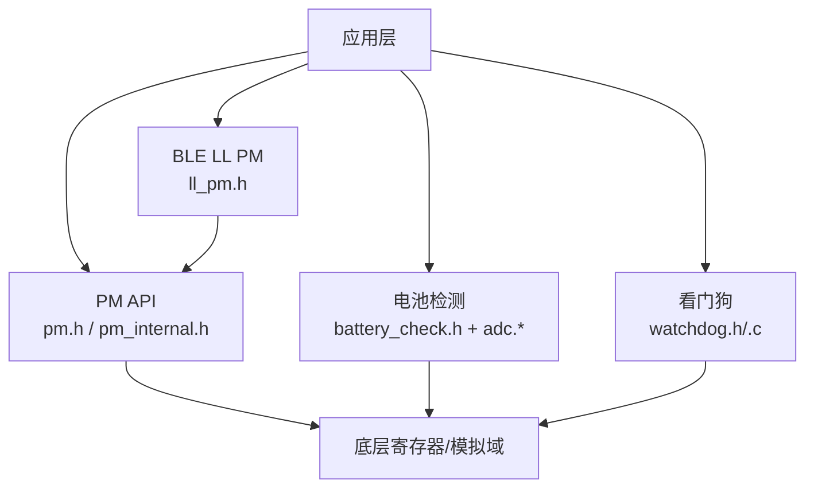
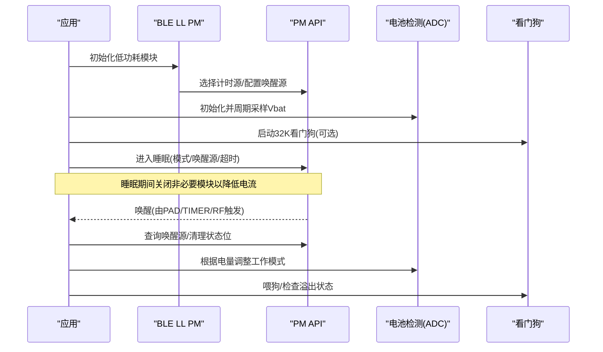
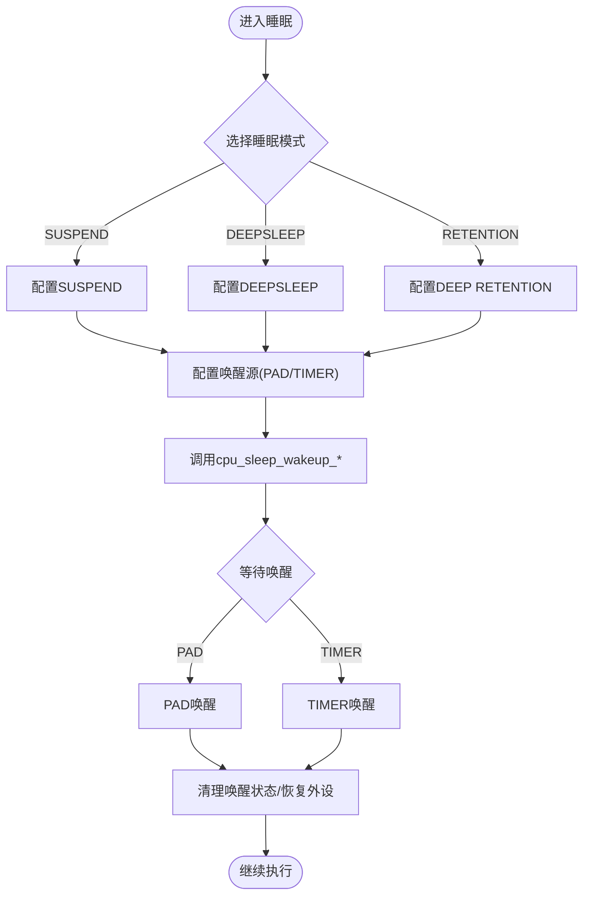
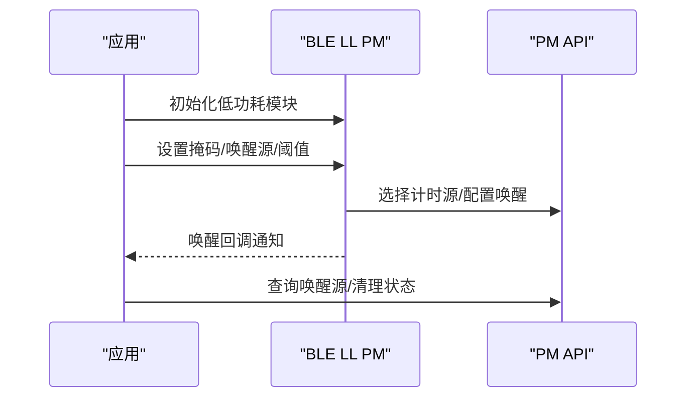
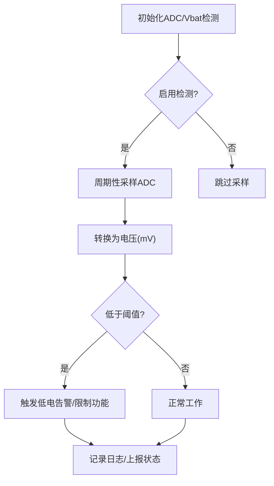
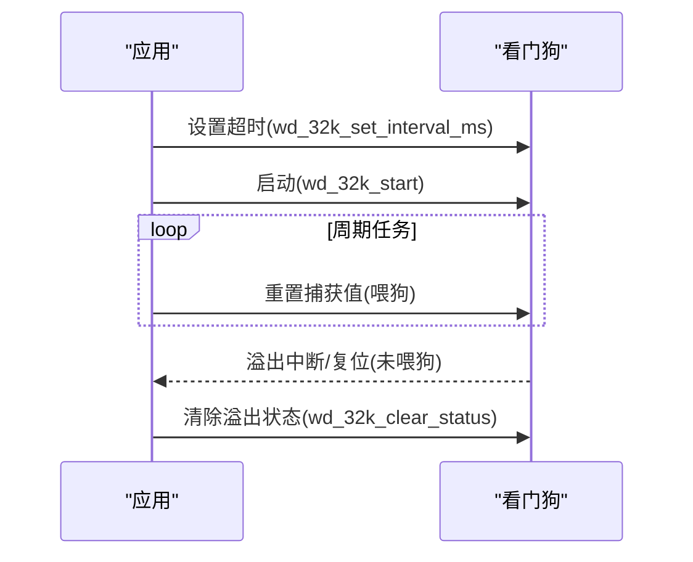
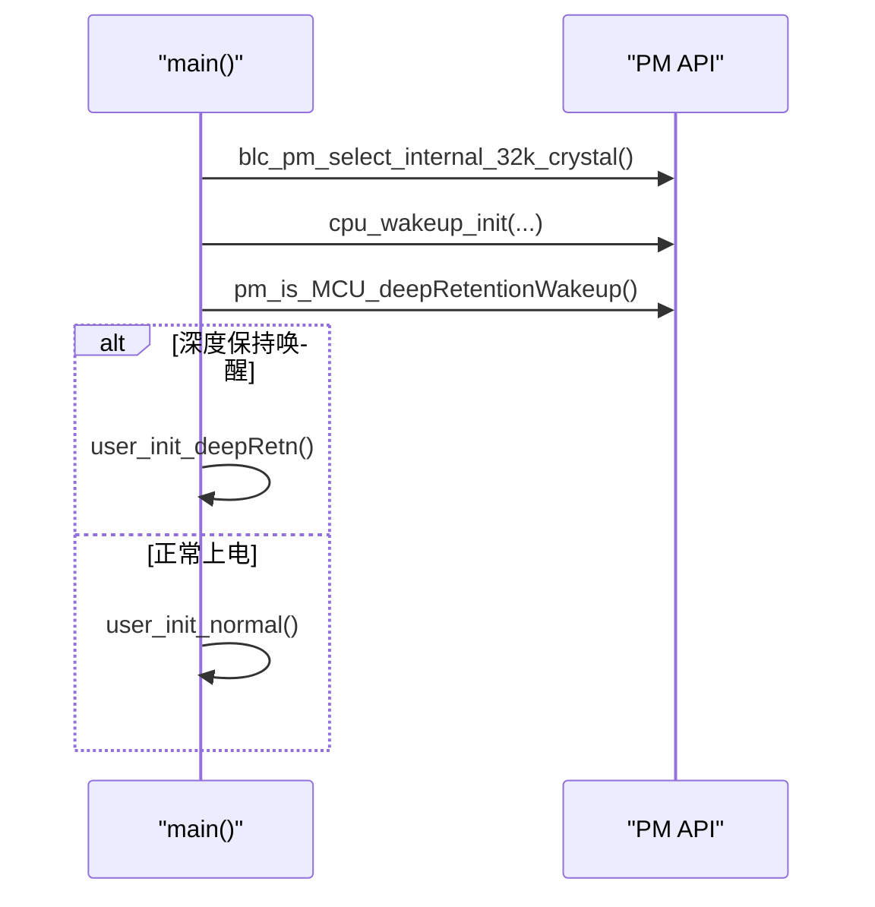
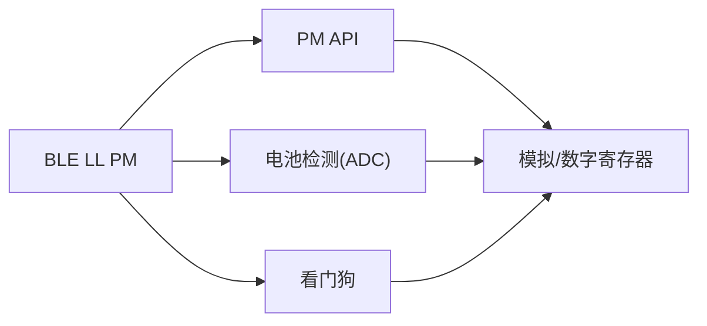

# 电源管理API

<cite>
**本文引用的文件**
- [pm.h](file://tc_ble_single_sdk/drivers/TC321X/lib/include/pm/pm.h)
- [pm_internal.h](file://tc_ble_single_sdk/drivers/TC321X/lib/include/pm/pm_internal.h)
- [watchdog.h](file://tc_ble_single_sdk/drivers/TC321X/watchdog.h)
- [watchdog.c](file://tc_ble_single_sdk/drivers/TC321X/watchdog.c)
- [battery_check.h](file://tc_ble_single_sdk/vendor/common/battery_check.h)
- [ll_pm.h](file://tc_ble_single_sdk/stack/ble/controller/ll/ll_pm.h)
- [main.c](file://tc_ble_single_sdk/vendor/2p4g_feature_test/feature_pm_test/main.c)
- [adc.h](file://tc_ble_single_sdk/drivers/B85/adc.h)
- [SDK_Wiki.md](file://doc/SDK_Wiki.md)
</cite>

## 目录
1. [简介](#简介)
2. [项目结构](#项目结构)
3. [核心组件](#核心组件)
4. [架构总览](#架构总览)
5. [详细组件分析](#详细组件分析)
6. [依赖关系分析](#依赖关系分析)
7. [性能与功耗优化](#性能与功耗优化)
8. [故障排查指南](#故障排查指南)
9. [结论](#结论)
10. [附录：关键API速查](#附录：关键api速查)

## 简介
本技术文档面向嵌入式系统的电源管理API，聚焦电池电量检测、低功耗模式切换、唤醒机制、看门狗定时器、睡眠模式配置与电源状态监控等能力。文档基于Telink SDK中TC321X平台的PM模块、BLE协议栈低功耗接口、ADC电池检测以及看门狗驱动进行系统化说明，并提供功耗优化策略、电池寿命延长与系统稳定性保证的实践建议，覆盖不同工作模式的功耗分析与调优方法。

## 项目结构
本项目在SDK中按平台与功能分层组织：
- PM（电源管理）：TC321X平台的pm.h/pm_internal.h提供睡眠/唤醒、时钟恢复、LDO调节、模块供电控制等能力。
- BLE LL PM：ll_pm.h提供BLE链路层低功耗模式初始化、掩码设置、唤醒源与阈值配置等。
- 电池检测：battery_check.h封装ADC采样、低电压保护与日志开关；各平台adc.*提供具体采样实现。
- 看门狗：watchdog.h/.c提供系统看门狗与32K看门狗的启停、超时设置与状态处理。
- 示例：feature_pm_test/main.c展示PM选择内部32K RC、唤醒初始化与深度保持唤醒分支流程。

图表来源
- [pm.h:1-375](file://tc_ble_single_sdk/drivers/TC321X/lib/include/pm/pm.h#L1-L375)
- [pm_internal.h:1-275](file://tc_ble_single_sdk/drivers/TC321X/lib/include/pm/pm_internal.h#L1-L275)
- [ll_pm.h:1-171](file://tc_ble_single_sdk/stack/ble/controller/ll/ll_pm.h#L1-L171)
- [battery_check.h:1-129](file://tc_ble_single_sdk/vendor/common/battery_check.h#L1-L129)
- [watchdog.h:1-157](file://tc_ble_single_sdk/drivers/TC321X/watchdog.h#L1-L157)
- [watchdog.c:1-91](file://tc_ble_single_sdk/drivers/TC321X/watchdog.c#L1-L91)

章节来源
- [pm.h:1-375](file://tc_ble_single_sdk/drivers/TC321X/lib/include/pm/pm.h#L1-L375)
- [pm_internal.h:1-275](file://tc_ble_single_sdk/drivers/TC321X/lib/include/pm/pm_internal.h#L1-L275)
- [ll_pm.h:1-171](file://tc_ble_single_sdk/stack/ble/controller/ll/ll_pm.h#L1-L171)
- [battery_check.h:1-129](file://tc_ble_single_sdk/vendor/common/battery_check.h#L1-L129)
- [watchdog.h:1-157](file://tc_ble_single_sdk/drivers/TC321X/watchdog.h#L1-L157)
- [watchdog.c:1-91](file://tc_ble_single_sdk/drivers/TC321X/watchdog.c#L1-L91)
- [main.c:1-165](file://tc_ble_single_sdk/vendor/2p4g_feature_test/feature_pm_test/main.c#L1-L165)

## 核心组件
- PM睡眠与唤醒
  - 支持SUSPEND、DEEPSLEEP、DEEPSLEEP_RETENTION_SRAM_LOWxx、SHUTDOWN等模式。
  - 唤醒源包括PAD、TIMER等；可配置GPIO极性唤醒。
  - 提供32K RC/XTAL两种计时源的睡眠/唤醒接口，支持长时睡眠。
  - 支持设置休眠前模块供电（如基带/USB），以进一步降低电流。
- BLE LL PM
  - 提供低功耗模式初始化、掩码设置、唤醒源配置、进入深保的阈值与提前唤醒时间配置。
  - 支持应用回调在低功耗唤醒后执行特定任务。
- 电池检测
  - 通过ADC采集Vbat，提供低电压报警阈值与采样配置。
  - 提供初始化、使能/禁用检测、读取结果等接口。
- 看门狗
  - 系统看门狗：用于运行期异常复位。
  - 32K看门狗：在睡眠/唤醒场景下提供安全保护，需配合32K定时源使用。
  - 提供启动/停止、超时设置、溢出状态获取与清除。

章节来源
- [pm.h:75-337](file://tc_ble_single_sdk/drivers/TC321X/lib/include/pm/pm.h#L75-L337)
- [ll_pm.h:30-171](file://tc_ble_single_sdk/stack/ble/controller/ll/ll_pm.h#L30-L171)
- [battery_check.h:28-129](file://tc_ble_single_sdk/vendor/common/battery_check.h#L28-L129)
- [watchdog.h:24-157](file://tc_ble_single_sdk/drivers/TC321X/watchdog.h#L24-L157)
- [watchdog.c:29-91](file://tc_ble_single_sdk/drivers/TC321X/watchdog.c#L29-L91)

## 架构总览
下图展示了从应用到PM、BLE LL PM、ADC与看门狗的交互关系，以及唤醒路径与电源状态监控点。

图表来源
- [pm.h:260-337](file://tc_ble_single_sdk/drivers/TC321X/lib/include/pm/pm.h#L260-L337)
- [ll_pm.h:58-137](file://tc_ble_single_sdk/stack/ble/controller/ll/ll_pm.h#L58-L137)
- [battery_check.h:80-124](file://tc_ble_single_sdk/vendor/common/battery_check.h#L80-L124)
- [watchdog.h:68-157](file://tc_ble_single_sdk/drivers/TC321X/watchdog.h#L68-L157)

## 详细组件分析

### PM模块：睡眠模式与唤醒机制
- 睡眠模式
  - SUSPEND_MODE：挂起，适合短时休眠。
  - DEEPSLEEP_MODE：深度睡眠，更低功耗。
  - DEEPSLEEP_MODE_RET_SRAM_LOW32/LOW64：深度保持睡眠，保留部分SRAM。
  - SHUTDOWN_MODE：关机模式。
- 唤醒源
  - PAD：GPIO电平触发，可配置高/低电平。
  - TIMER：基于STIMER或32K计数器的定时唤醒。
- 计时源
  - 32K RC：默认推荐，无需等待晶振稳定。
  - 32K XTAL：高精度但需要等待稳定。
- 关键API
  - cpu_sleep_wakeup_32k_rc / cpu_long_sleep_wakeup：进入睡眠并指定唤醒源与超时。
  - cpu_set_gpio_wakeup：配置GPIO为唤醒引脚及极性。
  - pm_set_wakeup_time_param：配置唤醒时序参数。
  - pm_set_xtal_stable_timer_param：适配慢起振晶体的稳定等待。
  - pm_set_suspend_power_cfg：在睡眠前关闭基带/USB等模块以降低电流。
  - blc_pm_select_internal_32k_crystal：选择内部32K RC作为计时源。

图表来源
- [pm.h:75-337](file://tc_ble_single_sdk/drivers/TC321X/lib/include/pm/pm.h#L75-L337)
- [pm_internal.h:183-275](file://tc_ble_single_sdk/drivers/TC321X/lib/include/pm/pm_internal.h#L183-L275)

章节来源
- [pm.h:75-337](file://tc_ble_single_sdk/drivers/TC321X/lib/include/pm/pm.h#L75-L337)
- [pm_internal.h:183-275](file://tc_ble_single_sdk/drivers/TC321X/lib/include/pm/pm_internal.h#L183-L275)

### BLE LL PM：链路层低功耗集成
- 初始化与掩码
  - blc_ll_initPowerManagement_module：初始化BLE LL低功耗模块。
  - bls_pm_setSuspendMask：设置允许进入的低功耗模式掩码。
- 唤醒与阈值
  - bls_pm_setWakeupSource：设置唤醒源。
  - blc_pm_setDeepsleepRetentionThreshold：设置进入深保的阈值（广播/连接态）。
  - blc_pm_setDeepsleepRetentionEarlyWakeupTiming：设置深保提前唤醒时间。
- 应用回调
  - bls_pm_registerAppWakeupLowPowerCb：注册唤醒后的回调函数。

图表来源
- [ll_pm.h:58-137](file://tc_ble_single_sdk/stack/ble/controller/ll/ll_pm.h#L58-L137)
- [pm.h:348-353](file://tc_ble_single_sdk/drivers/TC321X/lib/include/pm/pm.h#L348-L353)

章节来源
- [ll_pm.h:58-137](file://tc_ble_single_sdk/stack/ble/controller/ll/ll_pm.h#L58-L137)
- [pm.h:348-353](file://tc_ble_single_sdk/drivers/TC321X/lib/include/pm/pm.h#L348-L353)

### 电池电量检测：ADC采样与低电压保护
- 初始化与使能
  - adc_vbat_detect_init：初始化ADC用于电池检测。
  - battery_set_detect_enable：启用/禁用电池检测。
- 采样与转换
  - adc_sample_and_get_result / adc_sample_and_get_result_manual_mode：获取ADC原始值。
  - 结合校准值与分压比转换为mV。
- 低电压保护
  - app_battery_power_check：根据阈值判断是否低于低电告警。
  - user_battery_power_check：应用侧低电压保护逻辑（可在RAM代码中执行）。

图表来源
- [battery_check.h:80-124](file://tc_ble_single_sdk/vendor/common/battery_check.h#L80-L124)
- [adc.h:1154-1183](file://tc_ble_single_sdk/drivers/B85/adc.h#L1154-L1183)

章节来源
- [battery_check.h:80-124](file://tc_ble_single_sdk/vendor/common/battery_check.h#L80-L124)
- [adc.h:1154-1183](file://tc_ble_single_sdk/drivers/B85/adc.h#L1154-L1183)

### 看门狗定时器：安全机制与最佳实践
- 系统看门狗
  - wd_start/wd_stop/wd_clear：启动/停止/清零。
  - wd_set_interval_ms：设置超时周期（系统时钟）。
- 32K看门狗
  - wd_32k_start/stop：在睡眠/唤醒场景下启用/停用。
  - wd_32k_set_interval_ms：设置32K看门狗超时（毫秒级）。
  - wd_32k_get_status/clear_status：获取/清除溢出状态。
- 注意事项
  - 若睡眠时无定时器唤醒源，则不能启用32K看门狗。
  - 32K看门狗无“喂狗”操作，只能通过重置捕获值来刷新。
  - OTP产品建议将关键代码放入RAM执行以降低崩溃风险。

图表来源
- [watchdog.h:68-157](file://tc_ble_single_sdk/drivers/TC321X/watchdog.h#L68-L157)
- [watchdog.c:29-91](file://tc_ble_single_sdk/drivers/TC321X/watchdog.c#L29-L91)

章节来源
- [watchdog.h:68-157](file://tc_ble_single_sdk/drivers/TC321X/watchdog.h#L68-L157)
- [watchdog.c:29-91](file://tc_ble_single_sdk/drivers/TC321X/watchdog.c#L29-L91)

### 示例：PM选择与唤醒流程
- main.c展示了在PM测试模式下：
  - 选择内部32K RC作为计时源。
  - 初始化唤醒相关配置。
  - 判断是否从深度保持唤醒，分别执行不同的初始化流程。

图表来源
- [main.c:51-85](file://tc_ble_single_sdk/vendor/2p4g_feature_test/feature_pm_test/main.c#L51-L85)
- [pm.h:348-353](file://tc_ble_single_sdk/drivers/TC321X/lib/include/pm/pm.h#L348-L353)

章节来源
- [main.c:51-85](file://tc_ble_single_sdk/vendor/2p4g_feature_test/feature_pm_test/main.c#L51-L85)
- [pm.h:348-353](file://tc_ble_single_sdk/drivers/TC321X/lib/include/pm/pm.h#L348-L353)

## 依赖关系分析
- PM模块依赖底层模拟寄存器与时钟恢复机制，提供稳定的睡眠/唤醒能力。
- BLE LL PM与PM模块协同，统一管理链路层低功耗策略与唤醒时机。
- 电池检测依赖ADC驱动与校准参数，确保电压测量准确。
- 看门狗与PM模块共同保障系统在异常情况下能够复位恢复。

图表来源
- [pm_internal.h:183-275](file://tc_ble_single_sdk/drivers/TC321X/lib/include/pm/pm_internal.h#L183-L275)
- [ll_pm.h:58-137](file://tc_ble_single_sdk/stack/ble/controller/ll/ll_pm.h#L58-L137)
- [battery_check.h:80-124](file://tc_ble_single_sdk/vendor/common/battery_check.h#L80-L124)
- [watchdog.h:68-157](file://tc_ble_single_sdk/drivers/TC321X/watchdog.h#L68-L157)

章节来源
- [pm_internal.h:183-275](file://tc_ble_single_sdk/drivers/TC321X/lib/include/pm/pm_internal.h#L183-L275)
- [ll_pm.h:58-137](file://tc_ble_single_sdk/stack/ble/controller/ll/ll_pm.h#L58-L137)
- [battery_check.h:80-124](file://tc_ble_single_sdk/vendor/common/battery_check.h#L80-L124)
- [watchdog.h:68-157](file://tc_ble_single_sdk/drivers/TC321X/watchdog.h#L68-L157)

## 性能与功耗优化
- 工作模式选择
  - 短时空闲优先使用SUSPEND；长时间空闲使用DEEPSLEEP或DEEP RETENTION。
  - 使用cpu_long_sleep_wakeup系列接口进行分钟级长睡眠。
- 唤醒源优化
  - 仅启用必要的唤醒源，避免误唤醒导致功耗上升。
  - 合理配置GPIO唤醒极性，减少干扰。
- 模块供电控制
  - 在睡眠前关闭基带/USB等模块，降低漏电流。
  - 唤醒后按需重新初始化模块。
- 电池检测与自适应
  - 根据电量动态调整工作频率、报告率与功能时长，延长续航。
  - 低电压时限制Flash写入/擦除，防止不稳定。
- 看门狗与稳定性
  - 在睡眠/唤醒路径启用32K看门狗，防止死锁。
  - 正确设置超时并在主循环中喂狗。
- 参考实践
  - 平台SDK Wiki中关于PM演进与应用侧低功耗实践，包括SWS上拉、语音报告率调整、语音时长自适应等。

章节来源
- [pm.h:282-337](file://tc_ble_single_sdk/drivers/TC321X/lib/include/pm/pm.h#L282-L337)
- [battery_check.h:51-124](file://tc_ble_single_sdk/vendor/common/battery_check.h#L51-L124)
- [watchdog.h:24-157](file://tc_ble_single_sdk/drivers/TC321X/watchdog.h#L24-L157)
- [SDK_Wiki.md:687-712](file://doc/SDK_Wiki.md#L687-L712)

## 故障排查指南
- 无法进入睡眠
  - 检查唤醒源配置是否正确，是否存在持续电平导致无法进入。
  - 确认未启用不必要的模块供电。
- 唤醒后异常
  - 清理唤醒状态位，避免残留标志影响后续逻辑。
  - 检查32K看门狗溢出状态，必要时清除。
- 电池检测不准
  - 确认ADC初始化与校准参数正确。
  - 提高采样次数与滤波，避免噪声影响。
- 低功耗电流偏高
  - 核对SWS等引脚上拉配置，避免悬空导致漏电。
  - 评估晶振起振时间与稳定等待参数。

章节来源
- [pm.h:238-253](file://tc_ble_single_sdk/drivers/TC321X/lib/include/pm/pm.h#L238-L253)
- [watchdog.h:141-157](file://tc_ble_single_sdk/drivers/TC321X/watchdog.h#L141-L157)
- [battery_check.h:80-124](file://tc_ble_single_sdk/vendor/common/battery_check.h#L80-L124)
- [SDK_Wiki.md:707-712](file://doc/SDK_Wiki.md#L707-L712)

## 结论
本SDK提供了完善的电源管理能力，涵盖多种睡眠模式、灵活的唤醒机制、精确的电池检测与可靠的看门狗安全机制。通过合理配置PM模块、BLE LL PM与ADC，并结合看门狗保护，可实现低功耗、长续航与高稳定性的嵌入式系统。建议在实际项目中依据应用场景选择合适的睡眠模式与唤醒源，并根据电量动态调整工作策略，以获得最佳的功耗与性能平衡。

## 附录：关键API速查
- PM睡眠与唤醒
  - 选择计时源：blc_pm_select_internal_32k_crystal
  - 进入睡眠：cpu_sleep_wakeup_32k_rc / cpu_long_sleep_wakeup
  - GPIO唤醒：cpu_set_gpio_wakeup
  - 唤醒时序：pm_set_wakeup_time_param
  - 晶振稳定：pm_set_xtal_stable_timer_param
  - 模块供电：pm_set_suspend_power_cfg
- BLE LL PM
  - 初始化：blc_ll_initPowerManagement_module
  - 掩码/唤醒源：bls_pm_setSuspendMask / bls_pm_setWakeupSource
  - 深保阈值/提前唤醒：blc_pm_setDeepsleepRetentionThreshold / blc_pm_setDeepsleepRetentionEarlyWakeupTiming
  - 应用回调：bls_pm_registerAppWakeupLowPowerCb
- 电池检测
  - 初始化：adc_vbat_detect_init
  - 使能：battery_set_detect_enable
  - 采样：adc_sample_and_get_result / adc_sample_and_get_result_manual_mode
  - 低电保护：app_battery_power_check / user_battery_power_check
- 看门狗
  - 系统看门狗：wd_start / wd_stop / wd_clear / wd_set_interval_ms
  - 32K看门狗：wd_32k_start / wd_32k_stop / wd_32k_set_interval_ms / wd_32k_get_status / wd_32k_clear_status

章节来源
- [pm.h:260-337](file://tc_ble_single_sdk/drivers/TC321X/lib/include/pm/pm.h#L260-L337)
- [ll_pm.h:58-137](file://tc_ble_single_sdk/stack/ble/controller/ll/ll_pm.h#L58-L137)
- [battery_check.h:80-124](file://tc_ble_single_sdk/vendor/common/battery_check.h#L80-L124)
- [watchdog.h:68-157](file://tc_ble_single_sdk/drivers/TC321X/watchdog.h#L68-L157)
- [watchdog.c:29-91](file://tc_ble_single_sdk/drivers/TC321X/watchdog.c#L29-L91)