# 硬件抽象层API

<cite>
**本文引用的文件**
- [gpio.h](file://tc_ble_single_sdk/drivers/B85/gpio.h)
- [timer.h](file://tc_ble_single_sdk/drivers/B85/timer.h)
- [i2c.h](file://tc_ble_single_sdk/drivers/B85/i2c.h)
- [adc.h](file://tc_ble_single_sdk/drivers/B85/adc.h)
- [dma.h](file://tc_ble_single_sdk/drivers/B85/dma.h)
- [clock.h](file://tc_ble_single_sdk/drivers/B85/clock.h)
- [irq.h](file://tc_ble_single_sdk/drivers/B85/irq.h)
- [pwm.h](file://tc_ble_single_sdk/drivers/B85/pwm.h)
- [watchdog.h](file://tc_ble_single_sdk/drivers/B85/watchdog.h)
- [bsp.h](file://tc_ble_single_sdk/drivers/B85/bsp.h)
</cite>

## 目录
1. [简介](#简介)
2. [项目结构](#项目结构)
3. [核心组件](#核心组件)
4. [架构总览](#架构总览)
5. [详细组件分析](#详细组件分析)
6. [依赖关系分析](#依赖关系分析)
7. [性能与功耗考量](#性能与功耗考量)
8. [故障排查指南](#故障排查指南)
9. [结论](#结论)
10. [附录：初始化流程与示例参考](#附录：初始化流程与示例参考)

## 简介
本技术文档面向Telink B85系列芯片的硬件抽象层（HAL）API，覆盖GPIO控制、定时器配置、I2C通信、ADC读取、中断处理、DMA传输、时钟管理、PWM输出、看门狗等基础与高级功能。文档同时给出传感器驱动、LED控制、按键扫描等外设操作的典型使用思路，并说明电源管理与低功耗模式相关的注意事项。内容基于SDK中B85平台驱动头文件进行梳理，便于在不同应用工程中快速定位接口、理解参数含义与错误处理方式。

## 项目结构
- 驱动位于 tc_ble_single_sdk/drivers/B85 目录下，按外设模块划分头文件与实现文件，例如 gpio.h/.c、i2c.h/.c、adc.h/.c、timer.h/.c、dma.h、clock.h、irq.h、pwm.h、watchdog.h 等。
- BSP通用宏与寄存器访问工具在 bsp.h 中提供，用于位操作、寄存器读写封装。
- 用户配置入口为 common/config/user_config.h，通常包含工程级宏定义与编译选项。

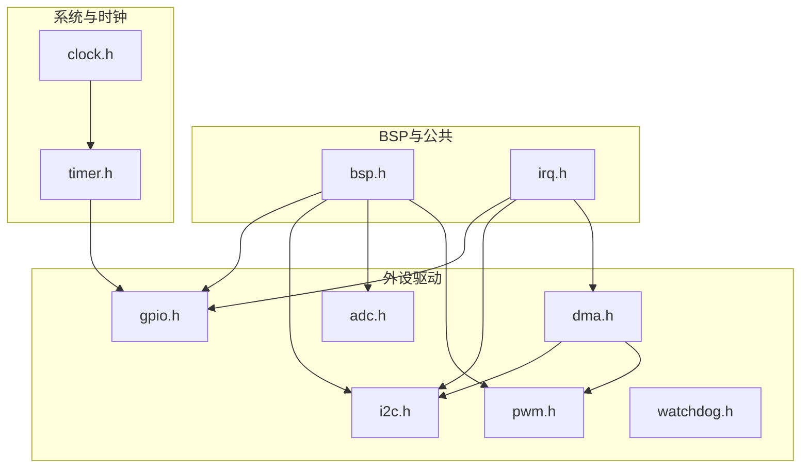

图表来源
- [bsp.h:24-172](file://tc_ble_single_sdk/drivers/B85/bsp.h#L24-L172)
- [irq.h:24-168](file://tc_ble_single_sdk/drivers/B85/irq.h#L24-L168)
- [clock.h:24-168](file://tc_ble_single_sdk/drivers/B85/clock.h#L24-L168)
- [timer.h:24-198](file://tc_ble_single_sdk/drivers/B85/timer.h#L24-L198)
- [gpio.h:24-561](file://tc_ble_single_sdk/drivers/B85/gpio.h#L24-L561)
- [i2c.h:24-198](file://tc_ble_single_sdk/drivers/B85/i2c.h#L24-L198)
- [adc.h:24-800](file://tc_ble_single_sdk/drivers/B85/adc.h#L24-L800)
- [pwm.h:24-436](file://tc_ble_single_sdk/drivers/B85/pwm.h#L24-L436)
- [dma.h:24-160](file://tc_ble_single_sdk/drivers/B85/dma.h#L24-L160)
- [watchdog.h:24-68](file://tc_ble_single_sdk/drivers/B85/watchdog.h#L24-L68)

章节来源
- [bsp.h:24-172](file://tc_ble_single_sdk/drivers/B85/bsp.h#L24-L172)
- [user_config.h:1-28](file://tc_ble_single_sdk/common/config/user_config.h#L1-L28)

## 核心组件
- GPIO：引脚复用、输入输出、上下拉、中断极性、USB DP/DM复用、休眠关断等。
- 定时器：系统时间、延时、GPIO触发/宽度捕获、中断状态查询与清除。
- I2C：主从模式、引脚选择、速率设置、单字节/批量读写、映射/DMA缓冲、中断状态。
- ADC：采样率、参考电压、通道选择、分辨率、差分/单端、采样周期、状态长度、RNS模式等。
- DMA：通道使能/中断、缓冲区大小、RF收发相关偏移常量。
- 时钟：系统时钟源选择、32K时钟、RC校准、指令延时。
- 中断：全局开关、屏蔽、源获取与清除、RF中断。
- PWM：模式、时钟、占空比/周期、相位、脉冲数、IR FIFO与DMA波形发送。
- 看门狗：间隔设置、启停、喂狗。

章节来源
- [gpio.h:24-561](file://tc_ble_single_sdk/drivers/B85/gpio.h#L24-L561)
- [timer.h:24-198](file://tc_ble_single_sdk/drivers/B85/timer.h#L24-L198)
- [i2c.h:24-198](file://tc_ble_single_sdk/drivers/B85/i2c.h#L24-L198)
- [adc.h:24-800](file://tc_ble_single_sdk/drivers/B85/adc.h#L24-L800)
- [dma.h:24-160](file://tc_ble_single_sdk/drivers/B85/dma.h#L24-L160)
- [clock.h:24-168](file://tc_ble_single_sdk/drivers/B85/clock.h#L24-L168)
- [irq.h:24-168](file://tc_ble_single_sdk/drivers/B85/irq.h#L24-L168)
- [pwm.h:24-436](file://tc_ble_single_sdk/drivers/B85/pwm.h#L24-L436)
- [watchdog.h:24-68](file://tc_ble_single_sdk/drivers/B85/watchdog.h#L24-L68)

## 架构总览
B85 HAL以“外设驱动 + BSP/IRQ/CLOCK”分层组织。上层应用通过统一API调用各外设；底层通过寄存器访问与位操作完成具体配置。DMA常用于I2C、PWM等外设的数据搬运以降低CPU占用。时钟子系统为所有定时与通信提供基准，中断子系统负责事件上报与处理。

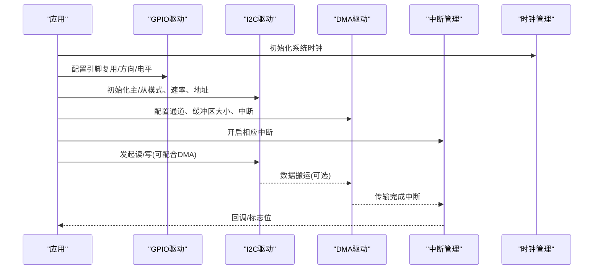

图表来源
- [clock.h:80-168](file://tc_ble_single_sdk/drivers/B85/clock.h#L80-L168)
- [gpio.h:173-561](file://tc_ble_single_sdk/drivers/B85/gpio.h#L173-L561)
- [i2c.h:77-198](file://tc_ble_single_sdk/drivers/B85/i2c.h#L77-L198)
- [dma.h:61-160](file://tc_ble_single_sdk/drivers/B85/dma.h#L61-L160)
- [irq.h:28-168](file://tc_ble_single_sdk/drivers/B85/irq.h#L28-L168)

## 详细组件分析

### GPIO 控制
- 引脚分组与复用：支持A~E组引脚，复用功能包括UART、I2C、SPI、I2S、USB、ADC、CMP、ATS、PWM等。
- 基本操作：设置输入/输出使能、写入电平、读取电平、读取缓存、批量读取、高阻态关闭。
- 上拉/下拉：支持浮空、弱上拉、下拉电阻配置。
- 中断：支持上升/下降沿触发、多核中断路由（GPIO/RISC0/RISC1）、中断掩码与状态清理。
- USB专用：DP/DM复用、内部上拉控制、电源开关。

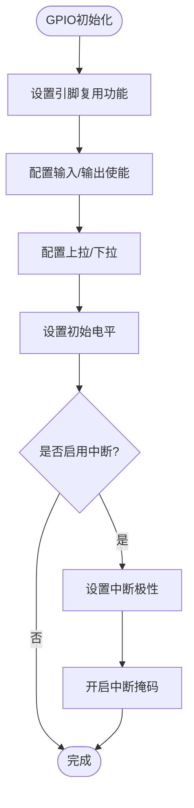

图表来源
- [gpio.h:173-561](file://tc_ble_single_sdk/drivers/B85/gpio.h#L173-L561)

章节来源
- [gpio.h:35-171](file://tc_ble_single_sdk/drivers/B85/gpio.h#L35-L171)
- [gpio.h:173-561](file://tc_ble_single_sdk/drivers/B85/gpio.h#L173-L561)

### 定时器与系统时间
- 系统时间：提供微秒级计数与延时函数，支持超时判断。
- 定时器模式：系统时钟、GPIO触发、GPIO宽度捕获、Tick模式。
- GPIO触发/宽度：为每个定时器提供GPIO初始化接口，支持极性配置。
- 启动/停止：对指定定时器进行启停控制。
- 中断状态：查询与清除定时器中断标志。

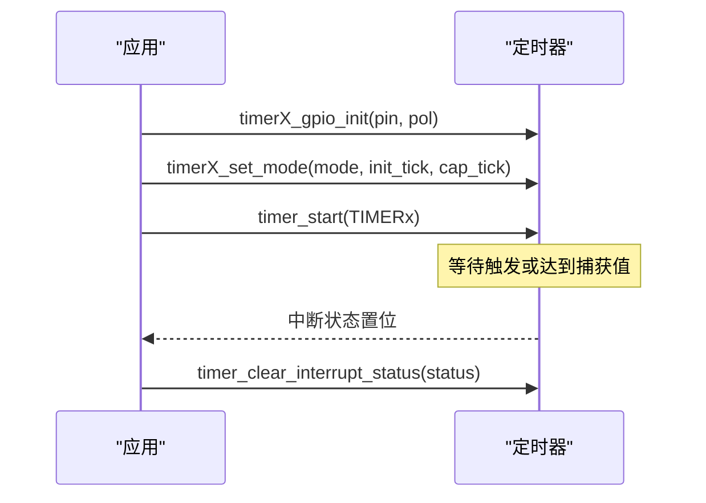

图表来源
- [timer.h:73-198](file://tc_ble_single_sdk/drivers/B85/timer.h#L73-L198)

章节来源
- [timer.h:31-198](file://tc_ble_single_sdk/drivers/B85/timer.h#L31-L198)

### I2C 通信
- 引脚选择：支持多组引脚作为SDA/SCL。
- 主模式：设置设备ID（含读写位）、分频系数配置时钟。
- 从模式：支持DMA与Mapping两种缓冲模式，Mapping模式下读写缓冲地址由硬件管理。
- 数据传输：单字节读写、批量读写（支持不同地址长度）。
- 中断：主机/从机中断状态查询与清除。

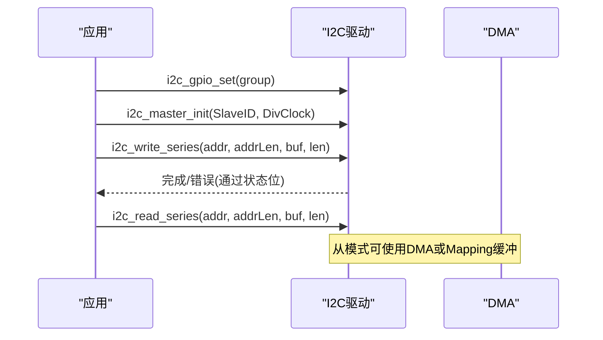

图表来源
- [i2c.h:77-198](file://tc_ble_single_sdk/drivers/B85/i2c.h#L77-L198)

章节来源
- [i2c.h:31-198](file://tc_ble_single_sdk/drivers/B85/i2c.h#L31-L198)

### ADC 读取
- 采样率与参考电压：支持多种采样率与参考电压选择，VBAT分压配置。
- 通道配置：正负输入通道选择，支持左/右/Misc通道独立配置。
- 分辨率与模式：8/10/12/14位分辨率，单端/差分模式切换。
- 采样周期与状态长度：可配置采样周期与capture/set状态长度，支持RNS模式。
- 时钟：外部24M到SAR ADC的时钟开关与分频。

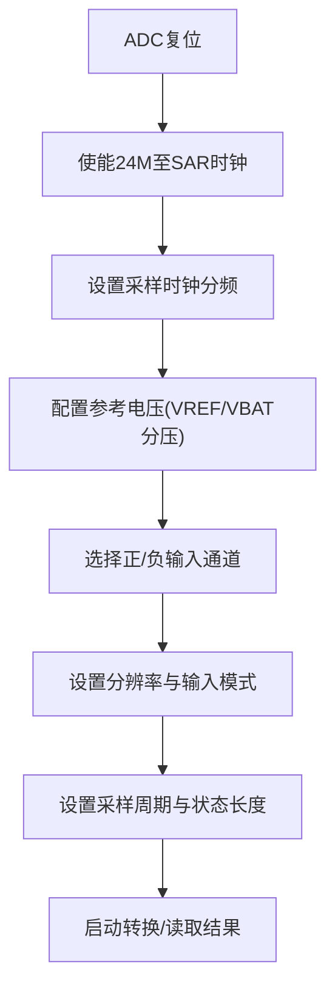

图表来源
- [adc.h:219-800](file://tc_ble_single_sdk/drivers/B85/adc.h#L219-L800)

章节来源
- [adc.h:31-216](file://tc_ble_single_sdk/drivers/B85/adc.h#L31-L216)
- [adc.h:219-800](file://tc_ble_single_sdk/drivers/B85/adc.h#L219-L800)

### DMA 传输
- 通道枚举：UART RX/TX、RF RX/TX、AES编解码、PWM等。
- 控制：复位、通道使能、中断使能/禁用、缓冲区大小设置。
- RF接收信息：提供头部、长度、CRC、时间戳、频偏、RSSI等偏移常量，便于解析DMA接收数据。

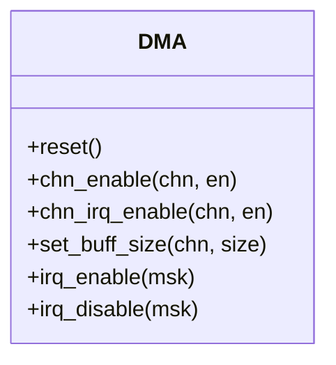

图表来源
- [dma.h:61-160](file://tc_ble_single_sdk/drivers/B85/dma.h#L61-L160)

章节来源
- [dma.h:30-160](file://tc_ble_single_sdk/drivers/B85/dma.h#L30-L160)

### 时钟管理
- 系统时钟：支持16M/24M/32M/48M晶振与RC源，提供初始化与获取当前源。
- 32K时钟：RC或晶振源选择。
- RC校准：24M/32K/48M校准函数，注意在高频率或USB通信期间避免校准导致异常。
- 指令延时：提供NOP级延时宏。

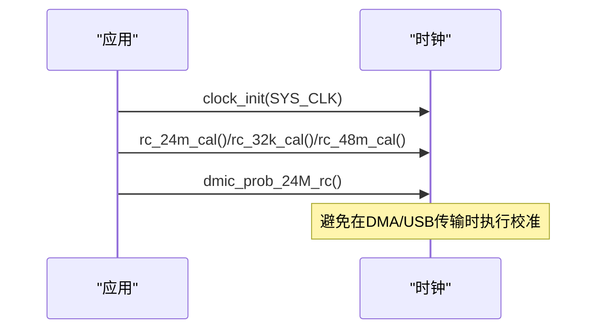

图表来源
- [clock.h:80-168](file://tc_ble_single_sdk/drivers/B85/clock.h#L80-L168)

章节来源
- [clock.h:31-168](file://tc_ble_single_sdk/drivers/B85/clock.h#L31-L168)

### 中断处理
- 全局中断：启用/禁用/恢复。
- 中断屏蔽：按类型启用/禁用、查询与清除源。
- RF中断：单独屏蔽与状态管理。

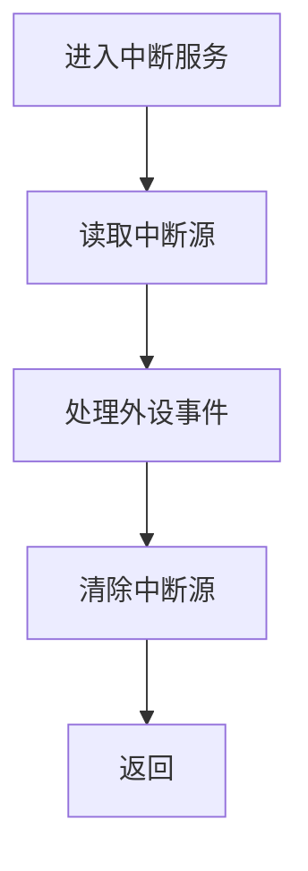

图表来源
- [irq.h:28-168](file://tc_ble_single_sdk/drivers/B85/irq.h#L28-L168)

章节来源
- [irq.h:28-168](file://tc_ble_single_sdk/drivers/B85/irq.h#L28-L168)

### PWM 输出与IR发射
- 模式：普通、计数、IR、IR FIFO、IR DMA FIFO。
- 参数：时钟分频、比较值(CMP)、周期(MAX)、相位、脉冲数。
- IR FIFO：数据写入、空满判断、触发级别、DMA波形配置与发送。
- 中断：帧中断、FIFO中断等状态查询与清除。

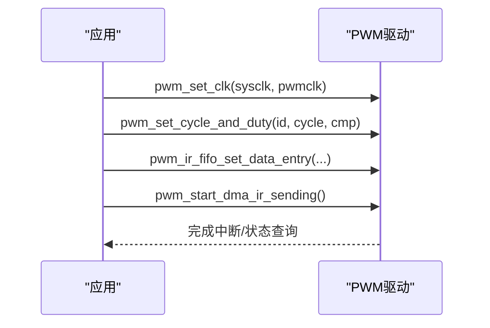

图表来源
- [pwm.h:77-436](file://tc_ble_single_sdk/drivers/B85/pwm.h#L77-L436)

章节来源
- [pwm.h:31-436](file://tc_ble_single_sdk/drivers/B85/pwm.h#L31-L436)

### 看门狗
- 间隔设置：根据系统时钟tick计算实际捕获值。
- 启停与喂狗：启动/停止看门狗，定期喂狗防止复位。

章节来源
- [watchdog.h:29-68](file://tc_ble_single_sdk/drivers/B85/watchdog.h#L29-L68)

## 依赖关系分析
- GPIO依赖BSP位操作与寄存器访问，部分功能依赖analog与usbhw。
- I2C依赖GPIO引脚复用，DMA可用于从模式缓冲。
- ADC依赖analog寄存器与GPIO通道映射。
- PWM依赖timer与clock，IR FIFO可与DMA结合。
- 所有外设中断均通过irq.h统一管理。

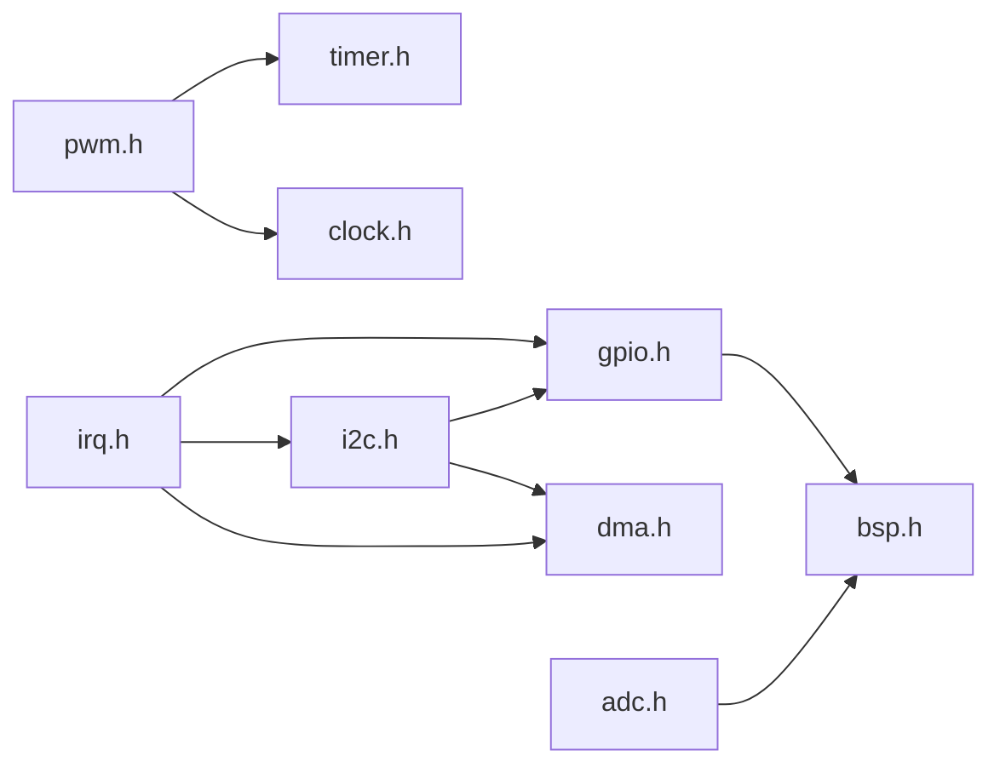

图表来源
- [gpio.h:24-561](file://tc_ble_single_sdk/drivers/B85/gpio.h#L24-L561)
- [i2c.h:24-198](file://tc_ble_single_sdk/drivers/B85/i2c.h#L24-L198)
- [adc.h:24-800](file://tc_ble_single_sdk/drivers/B85/adc.h#L24-L800)
- [pwm.h:24-436](file://tc_ble_single_sdk/drivers/B85/pwm.h#L24-L436)
- [dma.h:24-160](file://tc_ble_single_sdk/drivers/B85/dma.h#L24-L160)
- [timer.h:24-198](file://tc_ble_single_sdk/drivers/B85/timer.h#L24-L198)
- [clock.h:24-168](file://tc_ble_single_sdk/drivers/B85/clock.h#L24-L168)
- [irq.h:24-168](file://tc_ble_single_sdk/drivers/B85/irq.h#L24-L168)
- [bsp.h:24-172](file://tc_ble_single_sdk/drivers/B85/bsp.h#L24-L172)

章节来源
- [bsp.h:24-172](file://tc_ble_single_sdk/drivers/B85/bsp.h#L24-L172)
- [irq.h:24-168](file://tc_ble_single_sdk/drivers/B85/irq.h#L24-L168)

## 性能与功耗考量
- 时钟切换期间DMA可能丢失数据，应避免在DMA收发过程中切换系统时钟。
- 校准函数（24M/32K/48M）在高频率或USB通信期间调用可能导致异常，需避开关键路径。
- I2C从模式使用DMA或Mapping缓冲可降低CPU负载，适合高频数据交换。
- ADC采样周期与分辨率影响功耗与精度，合理配置以满足需求即可。
- PWM IR FIFO+DMA可实现高效波形发送，减少CPU干预。
- 看门狗需合理设置喂狗周期，避免误复位。

[本节为通用指导，不直接分析具体文件]

## 故障排查指南
- GPIO中断未触发：检查引脚复用是否正确、中断极性是否匹配、中断掩码是否开启、中断源是否已清除。
- I2C通信失败：确认引脚组选择正确、速率分频合适、设备地址包含读写位、总线状态与中断标志是否处理。
- ADC读数异常：核对参考电压与VBAT分压、通道选择、分辨率与输入模式、采样周期是否满足信号要求。
- DMA传输异常：检查通道使能与中断、缓冲区大小设置、RF接收数据偏移解析是否正确。
- 时钟不稳定：确保首次上电后尽快进行24M RC校准，避免温度漂移影响振荡器起振。
- PWM IR发送异常：确认FIFO非满再写入、DMA地址与模式配置正确、中断状态及时清除。
- 看门狗复位：检查喂狗周期与系统tick匹配，确保在主循环中定期喂狗。

章节来源
- [gpio.h:294-502](file://tc_ble_single_sdk/drivers/B85/gpio.h#L294-L502)
- [i2c.h:178-198](file://tc_ble_single_sdk/drivers/B85/i2c.h#L178-L198)
- [adc.h:219-800](file://tc_ble_single_sdk/drivers/B85/adc.h#L219-L800)
- [dma.h:61-160](file://tc_ble_single_sdk/drivers/B85/dma.h#L61-L160)
- [clock.h:80-168](file://tc_ble_single_sdk/drivers/B85/clock.h#L80-L168)
- [pwm.h:246-436](file://tc_ble_single_sdk/drivers/B85/pwm.h#L246-L436)
- [watchdog.h:29-68](file://tc_ble_single_sdk/drivers/B85/watchdog.h#L29-L68)

## 结论
本HAL提供了完整的B85外设控制能力，涵盖基础GPIO、定时器、I2C、ADC以及高级的DMA、PWM、时钟与中断管理。通过统一的API与清晰的初始化流程，开发者可以快速构建传感器驱动、LED控制、按键扫描等应用。遵循时钟与DMA的使用注意事项，可有效提升系统稳定性与能效。

[本节为总结性内容，不直接分析具体文件]

## 附录：初始化流程与示例参考

### GPIO LED控制示例思路
- 选择引脚并设置为复用为GPIO。
- 配置输出使能，设置初始电平。
- 需要时配置上拉/下拉。
- 若需按键检测，配置输入使能与中断极性，开启中断掩码并在中断中清除状态。

章节来源
- [gpio.h:173-502](file://tc_ble_single_sdk/drivers/B85/gpio.h#L173-L502)

### I2C传感器读取示例思路
- 选择I2C引脚组。
- 初始化主模式，设置设备ID与分频。
- 调用批量读写函数进行寄存器访问。
- 如需低功耗或高吞吐，使用从模式DMA/Mapping缓冲。

章节来源
- [i2c.h:110-176](file://tc_ble_single_sdk/drivers/B85/i2c.h#L110-L176)

### ADC电池电压读取示例思路
- 复位ADC模块，使能24M至SAR时钟。
- 设置采样时钟分频与参考电压（可选择VBAT分压）。
- 配置正负输入通道为VBAT或温度传感器。
- 设置分辨率与采样周期，启动转换并读取结果。

章节来源
- [adc.h:219-362](file://tc_ble_single_sdk/drivers/B85/adc.h#L219-L362)
- [adc.h:350-416](file://tc_ble_single_sdk/drivers/B85/adc.h#L350-L416)

### 定时器延时与捕获示例思路
- 使用系统时间函数进行微秒延时与超时判断。
- 对于GPIO触发或宽度测量，初始化对应定时器GPIO与模式，启动定时器并处理中断。

章节来源
- [timer.h:73-198](file://tc_ble_single_sdk/drivers/B85/timer.h#L73-L198)

### PWM IR波形发送示例思路
- 设置PWM时钟与模式。
- 配置FIFO数据条目，检查空满状态。
- 配置DMA波形与地址，启动DMA发送。
- 处理完成中断并清除状态。

章节来源
- [pwm.h:246-436](file://tc_ble_single_sdk/drivers/B85/pwm.h#L246-L436)

### 看门狗使用示例思路
- 根据系统时钟tick设置喂狗间隔。
- 启动看门狗并在主循环中定期喂狗。

章节来源
- [watchdog.h:29-68](file://tc_ble_single_sdk/drivers/B85/watchdog.h#L29-L68)