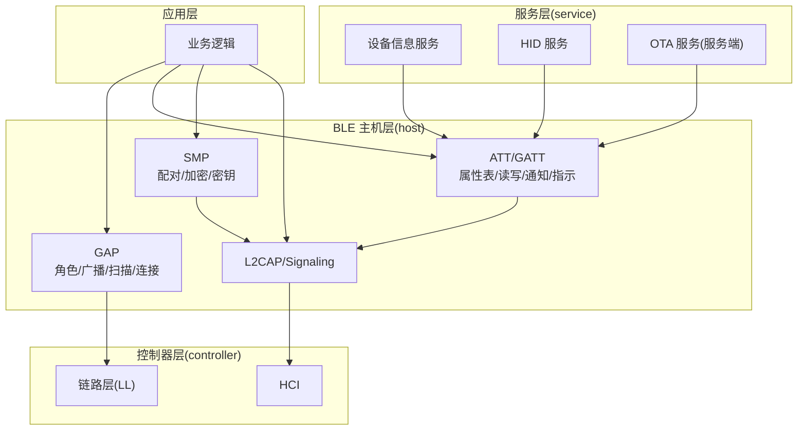
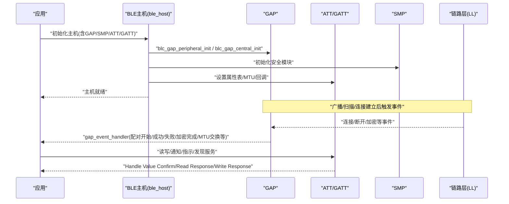
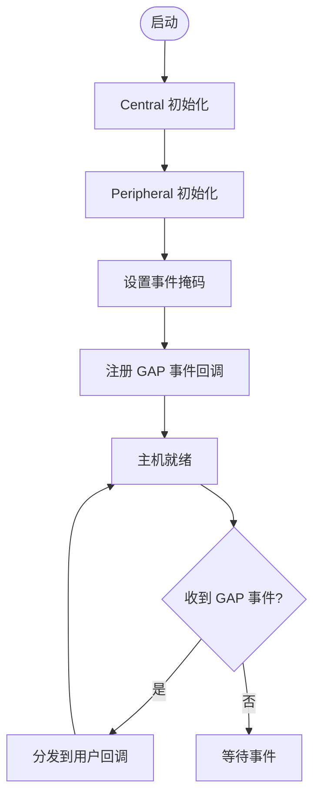
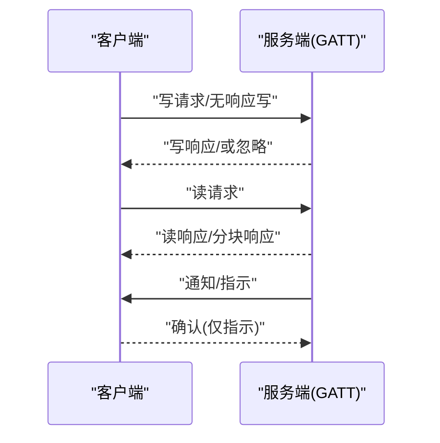
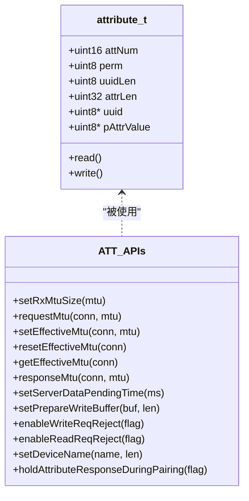
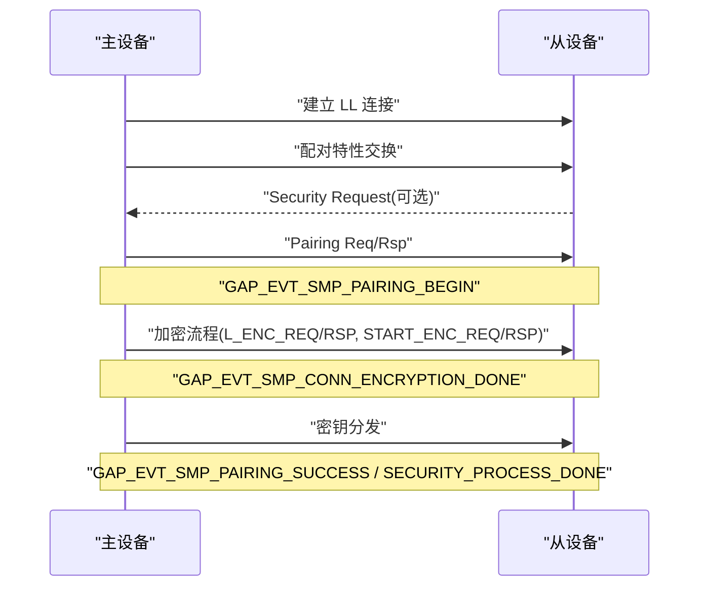
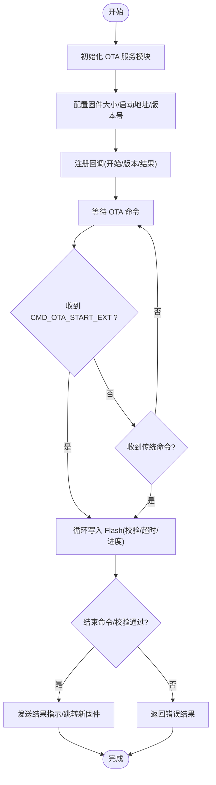
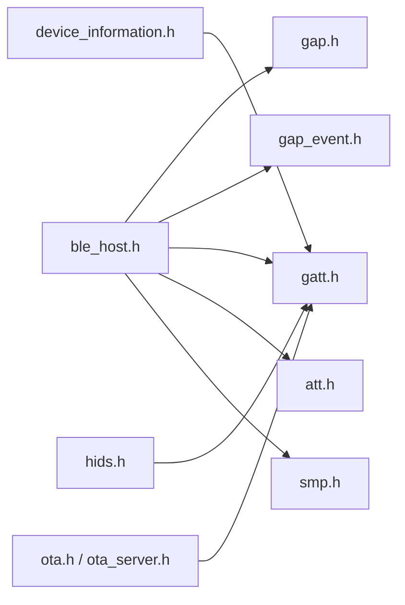

# 蓝牙协议栈API

<cite>
**本文引用的文件**
- [ble_host.h](file://tc_ble_single_sdk/stack/ble/host/ble_host.h)
- [gap_event.h](file://tc_ble_single_sdk/stack/ble/host/gap/gap_event.h)
- [gap.h](file://tc_ble_single_sdk/stack/ble/host/gap/gap.h)
- [gatt.h](file://tc_ble_single_sdk/stack/ble/host/attr/gatt.h)
- [att.h](file://tc_ble_single_sdk/stack/ble/host/attr/att.h)
- [device_information.h](file://tc_ble_single_sdk/stack/ble/service/device_information.h)
- [hids.h](file://tc_ble_single_sdk/stack/ble/service/hids.h)
- [ota.h](file://tc_ble_single_sdk/stack/ble/service/ota/ota.h)
- [ota_server.h](file://tc_ble_single_sdk/stack/ble/service/ota/ota_server.h)
</cite>

## 目录
1. [简介](#简介)
2. [项目结构](#项目结构)
3. [核心组件](#核心组件)
4. [架构总览](#架构总览)
5. [详细组件分析](#详细组件分析)
6. [依赖关系分析](#依赖关系分析)
7. [性能考虑](#性能考虑)
8. [故障排查指南](#故障排查指南)
9. [结论](#结论)
10. [附录](#附录)

## 简介
本技术文档面向基于 Telink BLE SDK 的开发者，系统说明 BLE 协议栈 API 的使用与集成要点。内容覆盖：
- BLE 初始化流程（主机侧）与 GAP 事件回调机制
- GAP 角色管理、广播与扫描、连接参数配置与安全配对
- GATT 服务配置、特征值读写、通知与指示
- OTA 升级、设备信息服务（Device Information Service）、HID 服务实现指南
- 典型调用示例与最佳实践

本档以“由浅入深”的方式组织，既适合快速上手，也便于深入查阅具体接口与流程。

## 项目结构
本项目将 BLE 协议栈按层次划分，关键目录与职责如下：
- host（主机层）
  - gap：GAP 初始化、角色设置、事件回调注册与处理
  - attr：ATT/GATT 属性表、MTU、读写请求、通知/指示等
  - smp：安全配对与密钥分发
  - l2cap/signaling：L2CAP 与信号化（如连接更新、信道复用等）
- service（服务层）
  - device_information：标准设备信息特性 UUID
  - hids：HID 服务特性与报告定义
  - ota：OTA 命令、数据结构与服务端 API
- controller（控制器层）：LL、PHY、HCI 等底层实现（本档聚焦 host 与 service 层 API）

图表来源
- [ble_host.h:27-51](file://tc_ble_single_sdk/stack/ble/host/ble_host.h#L27-L51)
- [gap.h:77-114](file://tc_ble_single_sdk/stack/ble/host/gap/gap.h#L77-L114)
- [gatt.h:32-208](file://tc_ble_single_sdk/stack/ble/host/attr/gatt.h#L32-L208)
- [att.h:29-275](file://tc_ble_single_sdk/stack/ble/host/attr/att.h#L29-L275)
- [device_information.h:27-39](file://tc_ble_single_sdk/stack/ble/service/device_information.h#L27-L39)
- [hids.h:27-85](file://tc_ble_single_sdk/stack/ble/service/hids.h#L27-L85)
- [ota.h:28-186](file://tc_ble_single_sdk/stack/ble/service/ota/ota.h#L28-L186)
- [ota_server.h:30-184](file://tc_ble_single_sdk/stack/ble/service/ota/ota_server.h#L30-L184)

章节来源
- [ble_host.h:27-51](file://tc_ble_single_sdk/stack/ble/host/ble_host.h#L27-L51)

## 核心组件
- GAP（通用访问配置文件）
  - 提供 Central/Peripheral 初始化、角色切换、广播/扫描、连接管理等能力
  - 通过事件回调上报配对、加密、MTU 交换、L2CAP COC 等状态
- ATT/GATT（属性传输/通用属性配置文件）
  - 暴露属性表、读写请求、通知/指示、批量操作、错误响应等
  - 支持 MTU 协商、服务器数据挂起优化、准备写入等
- SMP（安全管理器）
  - 标准配对与快速连接两种流程，支持 TK/Passkey/OOB/SC 等交互
  - 通过 GAP 事件上报配对开始、成功、失败、加密完成、安全处理完成等
- 服务层
  - Device Information：标准特性 UUID 定义
  - HID：报告类型、协议模式、标志位等
  - OTA：命令集、结果码、服务端初始化与回调、超时与进度指示

章节来源
- [gap_event.h:130-364](file://tc_ble_single_sdk/stack/ble/host/gap/gap_event.h#L130-L364)
- [gatt.h:32-208](file://tc_ble_single_sdk/stack/ble/host/attr/gatt.h#L32-L208)
- [att.h:29-275](file://tc_ble_single_sdk/stack/ble/host/attr/att.h#L29-L275)
- [device_information.h:27-39](file://tc_ble_single_sdk/stack/ble/service/device_information.h#L27-L39)
- [hids.h:27-85](file://tc_ble_single_sdk/stack/ble/service/hids.h#L27-L85)
- [ota.h:28-186](file://tc_ble_single_sdk/stack/ble/service/ota/ota.h#L28-L186)
- [ota_server.h:30-184](file://tc_ble_single_sdk/stack/ble/service/ota/ota_server.h#L30-L184)

## 架构总览
下图展示从应用到协议栈的关键调用路径与事件回传机制，重点体现 ble_init 初始化顺序与 gap_event 回调处理。

图表来源
- [ble_host.h:27-51](file://tc_ble_single_sdk/stack/ble/host/ble_host.h#L27-L51)
- [gap.h:77-114](file://tc_ble_single_sdk/stack/ble/host/gap/gap.h#L77-L114)
- [gap_event.h:345-364](file://tc_ble_single_sdk/stack/ble/host/gap/gap_event.h#L345-L364)
- [gatt.h:32-208](file://tc_ble_single_sdk/stack/ble/host/attr/gatt.h#L32-L208)

## 详细组件分析

### GAP 初始化与事件回调
- 初始化
  - Peripheral 初始化：用于作为外设广播与接受连接
  - Central 初始化：用于主动扫描与发起连接
  - 主机初始化检查：在所有主机初始化完成后调用，校验配置正确性
- 事件回调
  - 注册公共入口：所有 GAP 事件统一进入用户回调函数
  - 事件掩码：可按需启用特定事件（如配对、加密、MTU 交换、L2CAP COC 等）
  - 常用事件：配对开始/成功/失败、加密完成、安全处理完成、MTU 交换、L2CAP COC 连接/断开/重配/收发数据等

图表来源
- [gap.h:77-114](file://tc_ble_single_sdk/stack/ble/host/gap/gap.h#L77-L114)
- [gap_event.h:345-364](file://tc_ble_single_sdk/stack/ble/host/gap/gap_event.h#L345-L364)

章节来源
- [gap.h:77-114](file://tc_ble_single_sdk/stack/ble/host/gap/gap.h#L77-L114)
- [gap_event.h:130-364](file://tc_ble_single_sdk/stack/ble/host/gap/gap_event.h#L130-L364)

### GATT 服务与特征值读写
- 通知与指示
  - 单句柄通知：向客户端推送特征值
  - 多句柄通知：批量推送多个句柄的值
  - 指示：带确认的通知
- 读写请求
  - 无响应写、有响应写
  - 读请求、分块读（Blob）、按类型/组读取、查找信息等
  - 准备写入与执行写入（事务式批量写）
- 错误与确认
  - 发送 ATT 错误响应
  - 发送 Handle Value Confirm（对 Indication）

图表来源
- [gatt.h:32-208](file://tc_ble_single_sdk/stack/ble/host/attr/gatt.h#L32-L208)

章节来源
- [gatt.h:32-208](file://tc_ble_single_sdk/stack/ble/host/attr/gatt.h#L32-L208)

### ATT 属性表与权限控制
- 权限位
  - 读/写/读写
  - 加密/认证/安全连接/授权等组合
- 属性结构
  - 句柄、UUID、长度、值指针、读写回调
- MTU 管理
  - 设置接收 MTU、请求交换、设置有效 MTU、重置、查询
  - 服务器数据挂起时间：在中心设备服务发现期间抑制部分上行数据，避免冲突
- 其他
  - 设置准备写入缓冲区
  - 允许拒绝读/写请求（返回错误码）
  - 设置设备名
  - 配对阶段是否持有 ATT 响应载荷

图表来源
- [att.h:29-275](file://tc_ble_single_sdk/stack/ble/host/attr/att.h#L29-L275)

章节来源
- [att.h:29-275](file://tc_ble_single_sdk/stack/ble/host/attr/att.h#L29-L275)

### 安全配对（SMP）与 GAP 事件
- 两种流程
  - 标准配对：包含配对特性交换、加密、密钥分发三个阶段
  - 快速连接：直接加密（使用已分发 LTK）
- 事件与回调
  - 配对开始/成功/失败
  - 加密完成
  - 安全处理完成
  - TK 显示/请求 Passkey/OOB/数值比较/按键通知/SC OOB 数据
- 事件掩码与回调注册
  - 按需启用事件
  - 注册全局 GAP 事件处理器

图表来源
- [gap_event.h:30-127](file://tc_ble_single_sdk/stack/ble/host/gap/gap_event.h#L30-L127)
- [gap_event.h:130-235](file://tc_ble_single_sdk/stack/ble/host/gap/gap_event.h#L130-L235)

章节来源
- [gap_event.h:30-235](file://tc_ble_single_sdk/stack/ble/host/gap/gap_event.h#L30-L235)

### OTA 升级（服务端）
- 命令与数据结构
  - 传统命令：版本、开始、结束
  - 扩展命令：开始扩展、固件版本请求/响应、结果、调度指示（PDU 数量/固件大小）
  - 结果码：涵盖序列错误、CRC 错误、Flash 写入错误、超时、版本比较失败等
- 服务端 API
  - 初始化 OTA 服务模块
  - 设置最大固件大小与新固件启动地址
  - 设置固件版本号
  - 注册开始命令回调、版本请求回调、结果指示回调
  - 设置总超时与数据包间隔超时
  - 设置按 PDU 数量的进度指示分辨率
  - 设置 ATT 句柄偏移（写与通知可共用或分离）
  - 写入 Flash 的数据处理入口

图表来源
- [ota.h:28-186](file://tc_ble_single_sdk/stack/ble/service/ota/ota.h#L28-L186)
- [ota_server.h:30-184](file://tc_ble_single_sdk/stack/ble/service/ota/ota_server.h#L30-L184)

章节来源
- [ota.h:28-186](file://tc_ble_single_sdk/stack/ble/service/ota/ota.h#L28-L186)
- [ota_server.h:30-184](file://tc_ble_single_sdk/stack/ble/service/ota/ota_server.h#L30-L184)

### 设备信息服务（DIS）
- 标准特性 UUID
  - 制造商名称、型号编号、序列号、硬件/固件/软件版本、系统 ID、IEEE 列表、PNP ID 等
- 使用方式
  - 在属性表中为这些特性分配句柄并填充值
  - 根据权限位控制读/写与加密要求

章节来源
- [device_information.h:27-39](file://tc_ble_single_sdk/stack/ble/service/device_information.h#L27-L39)

### HID 服务
- 特性与报告
  - Boot 键盘输入/输出、鼠标输入、HID 信息、报告映射、控制点、报告、协议模式
  - 报告 ID：键盘、消费控制、鼠标、游戏手柄、LED、特征、音频相关、OTA 等
  - 报告类型：输入/输出/特征
  - 协议模式：Boot/Report
  - 标志位：远程唤醒、通常可连接
- 使用方式
  - 配置报告映射与报告句柄
  - 根据协议模式选择 Boot 或 Report 行为
  - 通过通知/写请求发送/接收报告数据

章节来源
- [hids.h:27-85](file://tc_ble_single_sdk/stack/ble/service/hids.h#L27-L85)

## 依赖关系分析
- 主机头文件聚合了各子模块接口，便于应用一次性引入
- GAP 事件驱动上层业务（配对、加密、MTU、L2CAP COC）
- ATT/GATT 向上提供服务发现与数据通道，向下依赖 L2CAP/HCI
- 服务层（DIS/HID/OTA）通过 GATT 暴露功能，依赖 ATT 权限与 MTU 机制

图表来源
- [ble_host.h:27-51](file://tc_ble_single_sdk/stack/ble/host/ble_host.h#L27-L51)
- [gatt.h:32-208](file://tc_ble_single_sdk/stack/ble/host/attr/gatt.h#L32-L208)
- [att.h:29-275](file://tc_ble_single_sdk/stack/ble/host/attr/att.h#L29-L275)
- [device_information.h:27-39](file://tc_ble_single_sdk/stack/ble/service/device_information.h#L27-L39)
- [hids.h:27-85](file://tc_ble_single_sdk/stack/ble/service/hids.h#L27-L85)
- [ota.h:28-186](file://tc_ble_single_sdk/stack/ble/service/ota/ota.h#L28-L186)
- [ota_server.h:30-184](file://tc_ble_single_sdk/stack/ble/service/ota/ota_server.h#L30-L184)

章节来源
- [ble_host.h:27-51](file://tc_ble_single_sdk/stack/ble/host/ble_host.h#L27-L51)

## 性能考虑
- MTU 协商与有效 MTU
  - 合理设置接收 MTU 并在连接后协商，提升吞吐
  - 主设备侧维护有效 MTU，避免过大导致丢包
- 服务器数据挂起
  - 在服务发现期间限制上行数据发送，降低冲突概率
  - 可根据场景调整挂起时间
- 批量操作
  - 使用多句柄通知与准备写入减少交互次数
- 超时与重试
  - OTA 过程设置合适的总超时与数据包间隔超时，避免长时间阻塞
- 权限最小化
  - 仅开放必要权限，减少不必要的加密/认证开销

[本节为通用指导，不直接分析具体文件]

## 故障排查指南
- 主机初始化检查
  - 在所有主机初始化完成后调用检查函数，定位配置错误
- GAP 事件诊断
  - 通过事件掩码过滤关注的事件，结合回调参数判断配对/加密/MTU 状态
- ATT/GATT 错误
  - 使用错误响应接口定位请求中的句柄与错误码
  - 检查权限位是否与当前连接安全级别匹配
- OTA 问题
  - 核对结果码含义（序列错误、CRC 错误、Flash 写入错误、超时、版本比较失败等）
  - 检查固件大小与启动地址配置是否正确
  - 调整超时与进度指示分辨率，辅助定位瓶颈

章节来源
- [gap.h:107-114](file://tc_ble_single_sdk/stack/ble/host/gap/gap.h#L107-L114)
- [gatt.h:200-208](file://tc_ble_single_sdk/stack/ble/host/attr/gatt.h#L200-L208)
- [ota.h:47-77](file://tc_ble_single_sdk/stack/ble/service/ota/ota.h#L47-L77)
- [ota_server.h:60-184](file://tc_ble_single_sdk/stack/ble/service/ota/ota_server.h#L60-L184)

## 结论
本 SDK 提供了完整的 BLE 主机与服务能力，配合 GAP 事件回调与 ATT/GATT 接口，可高效实现连接管理、服务配置、数据传输与安全配对。通过合理的 MTU 与权限配置、以及 OTA 流程的健壮设计，可在资源受限设备上获得稳定可靠的 BLE 体验。建议在实际项目中：
- 明确角色与生命周期，尽早完成主机初始化与事件注册
- 依据场景选择合适的权限与安全策略
- 利用批量操作与 MTU 协商提升性能
- 完善 OTA 的错误处理与进度反馈

[本节为总结性内容，不直接分析具体文件]

## 附录
- 典型调用示例（文字描述）
  - 初始化流程
    - 初始化 Central/Peripheral
    - 设置事件掩码并注册 GAP 事件回调
    - 设置属性表与 MTU
    - 启动广播/扫描/连接
  - 连接建立
    - 广播/扫描建立 LL 连接
    - 触发 GAP 事件（连接/加密/MTU 交换）
  - GATT 操作
    - 发现服务与特征
    - 读写特征值、订阅通知/指示
  - 安全配对
    - 根据需求启用配对特性与密钥分发
    - 处理配对开始/成功/失败事件
  - OTA 升级
    - 初始化 OTA 服务，配置固件大小与启动地址
    - 注册回调，处理开始/版本/结果事件
    - 循环写入 Flash，监控超时与进度

[本节为概念性说明，不直接分析具体文件]