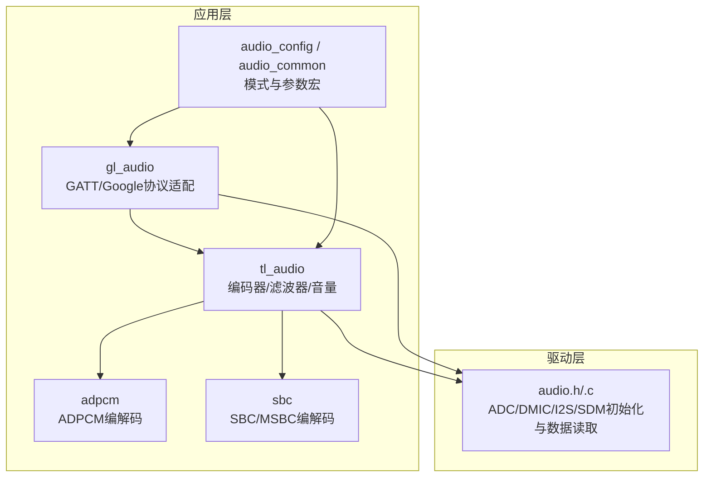
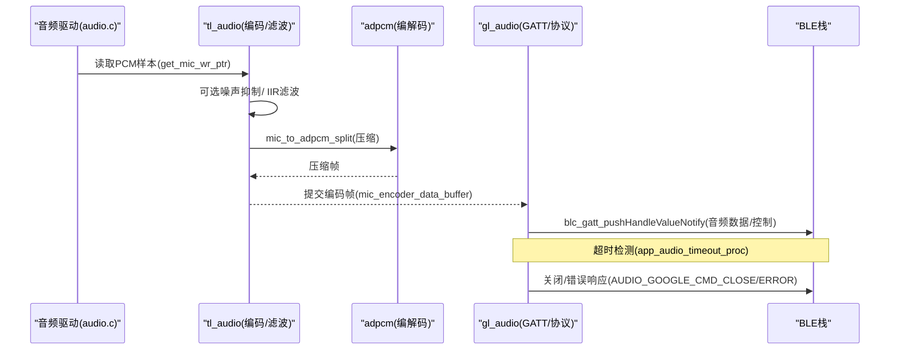
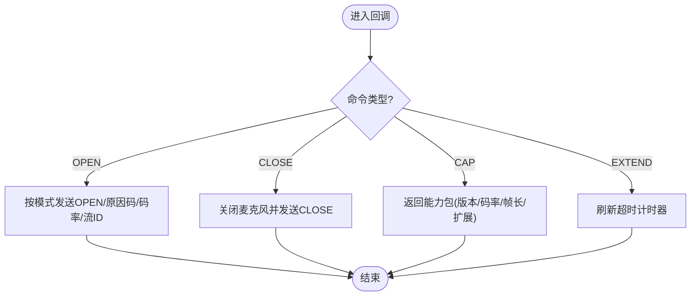
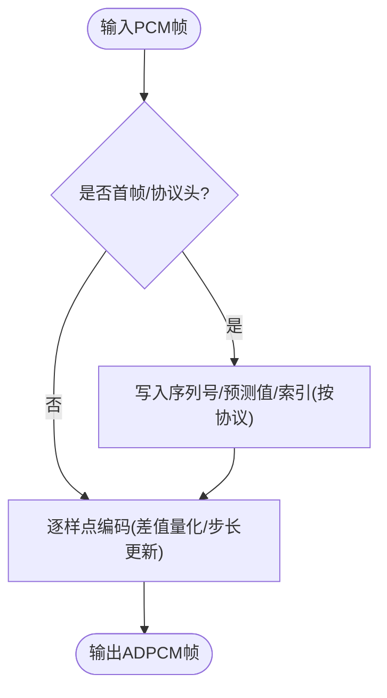
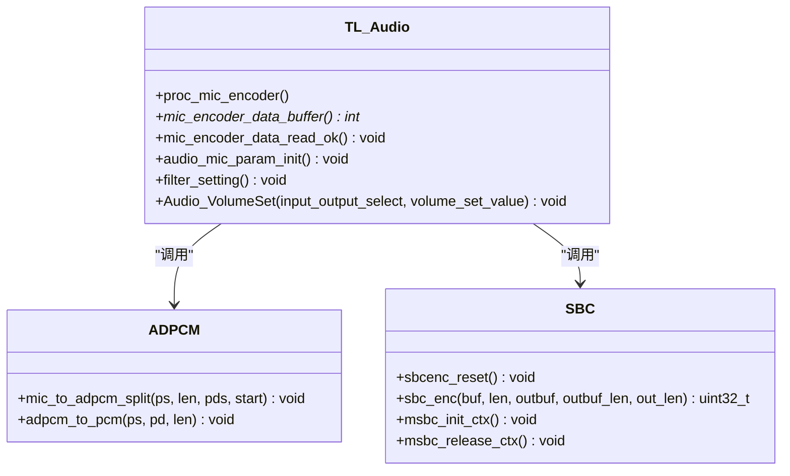
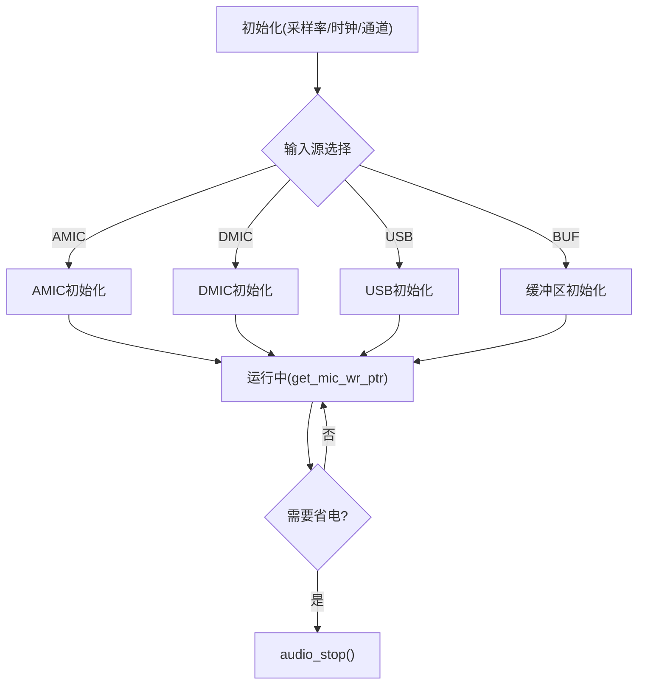
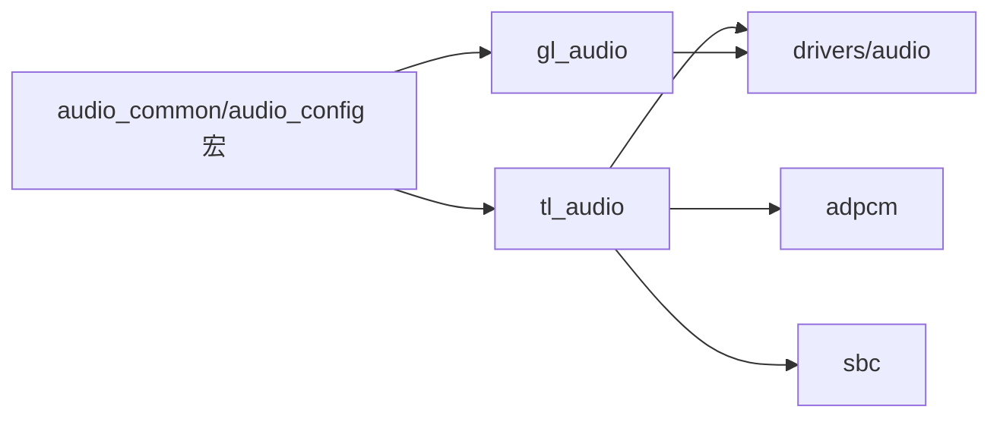

# 音频处理API

<cite>
**本文引用的文件**
- [gl_audio.h](file://tc_ble_single_sdk/application/audio/gl_audio.h)
- [gl_audio.c](file://tc_ble_single_sdk/application/audio/gl_audio.c)
- [adpcm.h](file://tc_ble_single_sdk/application/audio/adpcm.h)
- [adpcm.c](file://tc_ble_single_sdk/application/audio/adpcm.c)
- [tl_audio.h](file://tc_ble_single_sdk/application/audio/tl_audio.h)
- [tl_audio.c](file://tc_ble_single_sdk/application/audio/tl_audio.c)
- [audio_config.h](file://tc_ble_single_sdk/application/audio/audio_config.h)
- [audio_common.h](file://tc_ble_single_sdk/application/audio/audio_common.h)
- [sbc.h](file://tc_ble_single_sdk/application/audio/sbc.h)
- [audio.h](file://tc_ble_single_sdk/drivers/B85/audio.h)
- [audio.c](file://tc_ble_single_sdk/drivers/B85/audio.c)
</cite>

## 目录
1. [简介](#简介)
2. [项目结构](#项目结构)
3. [核心组件](#核心组件)
4. [架构总览](#架构总览)
5. [详细组件分析](#详细组件分析)
6. [依赖关系分析](#依赖关系分析)
7. [性能与功耗考量](#性能与功耗考量)
8. [故障排查指南](#故障排查指南)
9. [结论](#结论)
10. [附录：接口速查](#附录接口速查)

## 简介
本技术文档面向基于该SDK的音频采集、编解码（ADPCM/SBC/MSBC）、传输（BLE GATT/HID）以及高级音频处理（噪声抑制、IIR滤波、音量控制等）的开发者。重点说明 gl_audio 模块的音频流处理流程与 adpcm 编解码器的使用方法，覆盖实时与离线两种场景下的调用方式、缓冲区管理、采样率配置、延迟与功耗优化建议，并提供可操作的流程图与时序图帮助快速集成。

## 项目结构
音频相关代码主要位于 application/audio 与 drivers/B85 两个层次：
- application/audio：应用层音频协议与算法封装（gl_audio、adpcm、tl_audio、sbc、配置头文件）
- drivers/B85：底层音频驱动（ADC/DMIC/I2S/SDM输出、DMA/DFIFO、时钟与音量寄存器配置）

图表来源
- [gl_audio.c:24-30](file://tc_ble_single_sdk/application/audio/gl_audio.c#L24-L30)
- [tl_audio.c:24-30](file://tc_ble_single_sdk/application/audio/tl_audio.c#L24-L30)
- [adpcm.c:24-29](file://tc_ble_single_sdk/application/audio/adpcm.c#L24-L29)
- [audio.c:24-31](file://tc_ble_single_sdk/drivers/B85/audio.c#L24-L31)
- [audio_config.h:28-74](file://tc_ble_single_sdk/application/audio/audio_config.h#L28-L74)
- [audio_common.h:27-73](file://tc_ble_single_sdk/application/audio/audio_common.h#L27-L73)

章节来源
- [gl_audio.c:24-30](file://tc_ble_single_sdk/application/audio/gl_audio.c#L24-L30)
- [tl_audio.c:24-30](file://tc_ble_single_sdk/application/audio/tl_audio.c#L24-L30)
- [adpcm.c:24-29](file://tc_ble_single_sdk/application/audio/adpcm.c#L24-L29)
- [audio.c:24-31](file://tc_ble_single_sdk/drivers/B85/audio.c#L24-L31)
- [audio_config.h:28-74](file://tc_ble_single_sdk/application/audio/audio_config.h#L28-L74)
- [audio_common.h:27-73](file://tc_ble_single_sdk/application/audio/audio_common.h#L27-L73)

## 核心组件
- gl_audio：实现Google语音协议（GATT）的握手、能力协商、开启/关闭麦克风、超时与按键事件上报；维护流ID、状态机与BLE通知发送。
- tl_audio：提供统一的音频采集与编码流水线（可选噪声抑制、IIR滤波、ADPCM/SBC/MSBC编码），暴露缓冲读写与参数初始化接口。
- adpcm：实现ADPCM压缩与解压，支持不同协议版本（Telink/GATT Google v0.4/v1.0）与HID通道。
- sbc：提供SBC/MSBC编解码接口，用于HID或STB链路。
- 驱动层 audio：负责ADC/DMIC/I2S/SDM初始化、采样率设置、输入源选择、音量与PGA增益配置、数据指针获取。

章节来源
- [gl_audio.h:75-143](file://tc_ble_single_sdk/application/audio/gl_audio.h#L75-L143)
- [gl_audio.c:54-181](file://tc_ble_single_sdk/application/audio/gl_audio.c#L54-L181)
- [tl_audio.h:66-119](file://tc_ble_single_sdk/application/audio/tl_audio.h#L66-L119)
- [tl_audio.c:323-800](file://tc_ble_single_sdk/application/audio/tl_audio.c#L323-L800)
- [adpcm.h:27-44](file://tc_ble_single_sdk/application/audio/adpcm.h#L27-L44)
- [adpcm.c:53-208](file://tc_ble_single_sdk/application/audio/adpcm.c#L53-L208)
- [sbc.h:44-54](file://tc_ble_single_sdk/application/audio/sbc.h#L44-L54)
- [audio.h:127-202](file://tc_ble_single_sdk/drivers/B85/audio.h#L127-L202)

## 架构总览
下图展示从麦克风采集到BLE传输的端到端流程，包括可选的噪声抑制与IIR滤波、ADPCM编码、GATT通知发送与超时处理。

图表来源
- [tl_audio.c:338-418](file://tc_ble_single_sdk/application/audio/tl_audio.c#L338-L418)
- [adpcm.c:53-208](file://tc_ble_single_sdk/application/audio/adpcm.c#L53-L208)
- [gl_audio.c:185-211](file://tc_ble_single_sdk/application/audio/gl_audio.c#L185-L211)
- [gl_audio.c:213-355](file://tc_ble_single_sdk/application/audio/gl_audio.c#L213-L355)
- [audio.h:127-146](file://tc_ble_single_sdk/drivers/B85/audio.h#L127-L146)

## 详细组件分析

### gl_audio 模块（Google语音协议适配）
- 功能要点
  - 能力协商：根据对端模型（ON_REQUEST/PTT/HTT）返回对应能力包，包含版本、码率、帧长、扩展配置等。
  - 会话控制：OPEN/CLOSE命令处理，按模型发送原因码（MIC_OPEN/PTT/HTT）。
  - 按键交互：在ON_REQUEST模式下通过HID消费键上报搜索/开始/停止序列。
  - 超时保护：定时刷新与超时关闭，避免长时间占用资源。
  - 流ID管理：自增stream_id用于区分多路流。
- 关键接口
  - google_handle_init：注册控制与报告句柄
  - app_audio_key_start：按键触发开启/关闭音频
  - app_auido_google_callback：解析并响应GATT控制消息
  - app_audio_timeout_proc：超时处理与释放麦克风
- 使用示例（概念性）
  - 启动时调用 google_handle_init 绑定GATT句柄
  - 按键按下时调用 app_audio_key_start(1)，根据模式发送OPEN或HID搜索序列
  - 收到对端CLOSE后调用 app_audio_key_start(0) 关闭音频
  - 周期性调用 app_audio_timeout_proc 检查超时

图表来源
- [gl_audio.c:213-355](file://tc_ble_single_sdk/application/audio/gl_audio.c#L213-L355)
- [gl_audio.h:75-143](file://tc_ble_single_sdk/application/audio/gl_audio.h#L75-L143)

章节来源
- [gl_audio.c:54-181](file://tc_ble_single_sdk/application/audio/gl_audio.c#L54-L181)
- [gl_audio.c:185-211](file://tc_ble_single_sdk/application/audio/gl_audio.c#L185-L211)
- [gl_audio.c:213-355](file://tc_ble_single_sdk/application/audio/gl_audio.c#L213-L355)
- [gl_audio.h:75-143](file://tc_ble_single_sdk/application/audio/gl_audio.h#L75-L143)

### adpcm 编解码器
- 功能要点
  - 压缩：mic_to_adpcm_split 将PCM样本按ADPCM规则编码，支持不同协议头格式（v0.4带序列号/预测值/索引，v1.0纯音频数据）
  - 解压：adpcm_to_pcm 将ADPCM帧还原为PCM，兼容不同协议头布局
  - 表驱动：使用步长表与索引表进行自适应差分编码
- 关键接口
  - mic_to_adpcm_split：压缩入口，start标志决定协议头写入
  - adpcm_to_pcm：解压入口，按协议版本解析头部并重建预测值
- 使用示例（概念性）
  - 采集到一帧PCM后，调用 mic_to_adpcm_split 得到ADPCM帧
  - 接收端收到ADPCM帧后，调用 adpcm_to_pcm 恢复PCM供后续处理或播放

图表来源
- [adpcm.c:53-208](file://tc_ble_single_sdk/application/audio/adpcm.c#L53-L208)
- [adpcm.c:289-440](file://tc_ble_single_sdk/application/audio/adpcm.c#L289-L440)

章节来源
- [adpcm.h:27-44](file://tc_ble_single_sdk/application/audio/adpcm.h#L27-L44)
- [adpcm.c:53-208](file://tc_ble_single_sdk/application/audio/adpcm.c#L53-L208)
- [adpcm.c:289-440](file://tc_ble_single_sdk/application/audio/adpcm.c#L289-L440)

### tl_audio 音频流水线（采集/滤波/编码/缓冲）
- 功能要点
  - 采集：通过 get_mic_wr_ptr 获取新样本，按配置的单元大小（TL_MIC_ADPCM_UNIT_SIZE）切分
  - 可选处理：噪声抑制（noise_suppression）、IIR滤波（voice_iir/voice_iir_OOB）
  - 编码：根据模式调用 ADPCM/SBC/MSBC 编码器
  - 缓冲：环形缓冲管理写指针与读指针，溢出保护
  - 音量：Audio_VolumeSet 设置数字音量与PGA增益
- 关键接口
  - proc_mic_encoder：主处理循环（采集→处理→编码→入缓冲）
  - mic_encoder_data_buffer：取出一帧已编码数据
  - mic_encoder_data_read_ok：标记已消费
  - audio_mic_param_init：初始化编码器状态
  - filter_setting：加载滤波器系数与音量/PGA设置
- 使用示例（概念性）
  - 初始化：audio_mic_param_init + filter_setting
  - 周期任务：proc_mic_encoder 被定期调用以处理新样本
  - 上层消费：mic_encoder_data_buffer 获取编码帧，处理后调用 mic_encoder_data_read_ok

图表来源
- [tl_audio.c:323-800](file://tc_ble_single_sdk/application/audio/tl_audio.c#L323-L800)
- [adpcm.c:53-208](file://tc_ble_single_sdk/application/audio/adpcm.c#L53-L208)
- [sbc.h:44-54](file://tc_ble_single_sdk/application/audio/sbc.h#L44-L54)

章节来源
- [tl_audio.h:66-119](file://tc_ble_single_sdk/application/audio/tl_audio.h#L66-L119)
- [tl_audio.c:323-800](file://tc_ble_single_sdk/application/audio/tl_audio.c#L323-L800)
- [sbc.h:44-54](file://tc_ble_single_sdk/application/audio/sbc.h#L44-L54)

### 驱动层音频（ADC/DMIC/I2S/SDM）
- 功能要点
  - 初始化：audio_amic_init/audio_dmic_init/audio_usb_init/audio_buff_init 配置采样率、时钟、通道、分辨率、PGA增益
  - 输出：audio_set_sdm_output/audio_set_i2s_output/audio_set_usb_output 选择输出路径
  - 数据读取：get_mic_wr_ptr 获取写指针，配合上层缓冲消费
  - 音量：Audio_VolumeSet 设置数字音量与模拟PGA增益
- 关键接口
  - audio_stop：关闭ADC模块以省电
  - audio_set_codec：配置外部Codec（I2S）
  - audio_rx_data_from_sample_buff：从缓冲区读取样本

图表来源
- [audio.h:90-202](file://tc_ble_single_sdk/drivers/B85/audio.h#L90-L202)
- [audio.c:80-200](file://tc_ble_single_sdk/drivers/B85/audio.c#L80-L200)

章节来源
- [audio.h:90-202](file://tc_ble_single_sdk/drivers/B85/audio.h#L90-L202)
- [audio.c:80-200](file://tc_ble_single_sdk/drivers/B85/audio.c#L80-L200)

## 依赖关系分析
- 编译期模式选择由 audio_common.h 与 audio_config.h 的宏定义决定，影响各模块行为与缓冲区大小。
- gl_audio 依赖 BLE GATT 接口发送控制与音频数据；tl_audio 依赖驱动层获取PCM；adpcm/sbc 作为算法库被tl_audio调用。
- 潜在耦合点
  - 模式切换需保证缓冲区大小与帧长一致（如GOOGLE v1.0 vs v0.4）
  - 噪声抑制与IIR滤波启用会增加CPU负载，需权衡音质与功耗
  - 音量与PGA增益设置需与硬件匹配，避免削波

图表来源
- [audio_common.h:27-73](file://tc_ble_single_sdk/application/audio/audio_common.h#L27-L73)
- [audio_config.h:28-123](file://tc_ble_single_sdk/application/audio/audio_config.h#L28-L123)
- [tl_audio.c:24-30](file://tc_ble_single_sdk/application/audio/tl_audio.c#L24-L30)
- [gl_audio.c:24-30](file://tc_ble_single_sdk/application/audio/gl_audio.c#L24-L30)

章节来源
- [audio_common.h:27-73](file://tc_ble_single_sdk/application/audio/audio_common.h#L27-L73)
- [audio_config.h:28-123](file://tc_ble_single_sdk/application/audio/audio_config.h#L28-L123)

## 性能与功耗考量
- 采样率与帧长
  - 通过 audio_amic_init/audio_dmic_init 设置目标采样率（8k/16k/32k/48k）
  - 根据协议选择帧长（如GOOGLE v1.0为120字节，v0.4含头部）
- 延迟控制
  - 减少滤波链路与噪声抑制处理可降低延迟
  - 合理设置TL_MIC_PACKET_BUFFER_NUM与缓冲大小，避免溢出与等待
- 功耗管理
  - 空闲时调用 audio_stop 关闭ADC模块
  - 在ON_REQUEST模式中及时关闭麦克风，避免持续占用
- 音质优化
  - 启用IIR滤波与噪声抑制提升语音清晰度
  - 调整音量与PGA增益避免失真

[本节为通用指导，不直接分析具体文件]

## 故障排查指南
- 常见问题
  - 无音频数据：检查 get_mic_wr_ptr 是否递增、缓冲是否溢出、编码是否成功
  - 连接断开或超时：确认 app_audio_timeout_proc 是否被周期性调用，超时阈值是否合理
  - 协议不匹配：核对 GOOGLE_AUDIO_VERSION 与对端期望版本（v0.4/v1.0）
  - 音量过小/过大：检查 Audio_VolumeSet 与 PGA_POST_GAIN 设置范围
- 定位方法
  - 在 gl_audio 回调中打印命令与状态
  - 在 tl_audio 中打印缓冲指针变化与编码帧长度
  - 使用驱动层函数验证ADC/DMIC工作正常

章节来源
- [gl_audio.c:185-211](file://tc_ble_single_sdk/application/audio/gl_audio.c#L185-L211)
- [tl_audio.c:338-418](file://tc_ble_single_sdk/application/audio/tl_audio.c#L338-L418)
- [audio.c:80-200](file://tc_ble_single_sdk/drivers/B85/audio.c#L80-L200)

## 结论
该SDK提供了完整的音频采集、编解码与传输能力，gl_audio 与 tl_audio 形成清晰的分层：前者专注协议与会话管理，后者负责信号处理与编码流水线。通过合理的模式配置、缓冲管理与滤波策略，可在保证音质的同时实现低延迟与低功耗。实际项目中应结合具体硬件与协议要求，选择合适的采样率、帧长与处理链，并严格遵循超时与错误处理机制。

[本节为总结，不直接分析具体文件]

## 附录：接口速查
- gl_audio
  - google_handle_init：绑定GATT控制与报告句柄
  - app_audio_key_start：按键触发音频开启/关闭
  - app_auido_google_callback：处理GATT控制消息
  - app_audio_timeout_proc：超时检测与释放
- tl_audio
  - audio_mic_param_init：初始化编码器状态
  - proc_mic_encoder：主处理循环（采集→处理→编码）
  - mic_encoder_data_buffer：取出一帧编码数据
  - mic_encoder_data_read_ok：标记已消费
  - filter_setting：加载滤波器与音量/PGA设置
  - Audio_VolumeSet：设置数字音量
- adpcm
  - mic_to_adpcm_split：压缩PCM到ADPCM
  - adpcm_to_pcm：解压ADPCM到PCM
- sbc
  - sbcenc_reset/msbc_init_ctx：初始化编码器上下文
  - sbc_enc：SBC/MSBC编码
  - sbc_decode：SBC/MSBC解码
- 驱动层
  - audio_amic_init/audio_dmic_init/audio_usb_init/audio_buff_init：初始化输入源与采样率
  - audio_set_sdm_output/audio_set_i2s_output/audio_set_usb_output：选择输出路径
  - audio_stop：关闭ADC模块以省电

章节来源
- [gl_audio.h:145-149](file://tc_ble_single_sdk/application/audio/gl_audio.h#L145-L149)
- [gl_audio.c:54-181](file://tc_ble_single_sdk/application/audio/gl_audio.c#L54-L181)
- [gl_audio.c:185-211](file://tc_ble_single_sdk/application/audio/gl_audio.c#L185-L211)
- [gl_audio.c:213-355](file://tc_ble_single_sdk/application/audio/gl_audio.c#L213-L355)
- [tl_audio.h:107-119](file://tc_ble_single_sdk/application/audio/tl_audio.h#L107-L119)
- [tl_audio.c:323-800](file://tc_ble_single_sdk/application/audio/tl_audio.c#L323-L800)
- [adpcm.h:27-44](file://tc_ble_single_sdk/application/audio/adpcm.h#L27-L44)
- [adpcm.c:53-208](file://tc_ble_single_sdk/application/audio/adpcm.c#L53-L208)
- [adpcm.c:289-440](file://tc_ble_single_sdk/application/audio/adpcm.c#L289-L440)
- [sbc.h:44-54](file://tc_ble_single_sdk/application/audio/sbc.h#L44-L54)
- [audio.h:90-202](file://tc_ble_single_sdk/drivers/B85/audio.h#L90-L202)
- [audio.c:80-200](file://tc_ble_single_sdk/drivers/B85/audio.c#L80-L200)