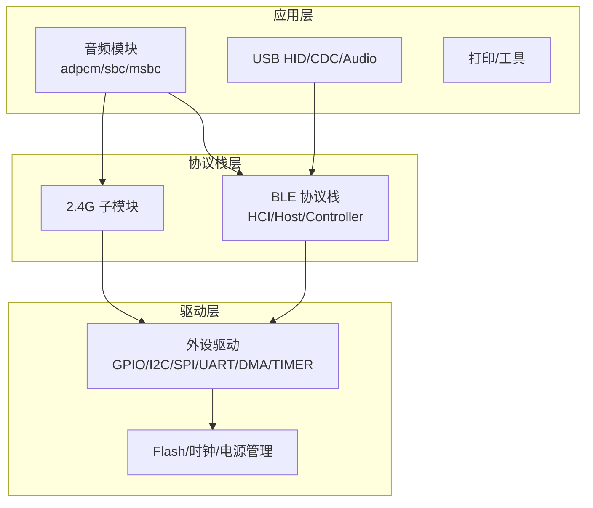
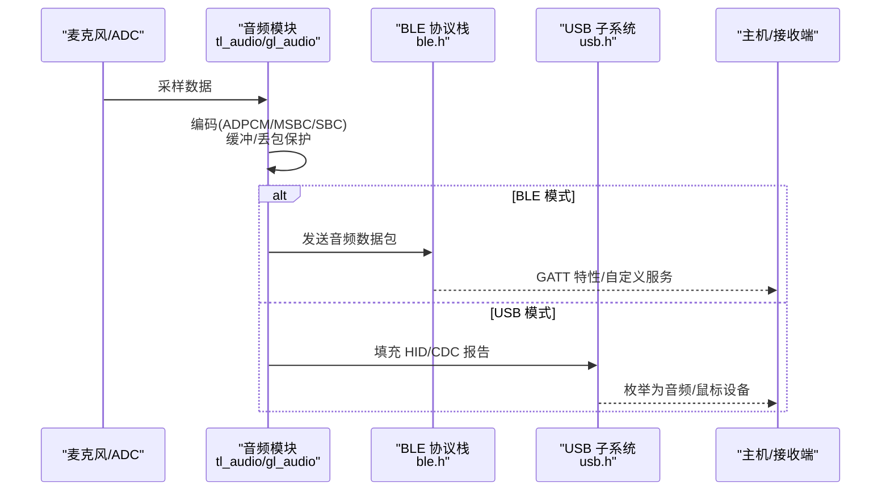
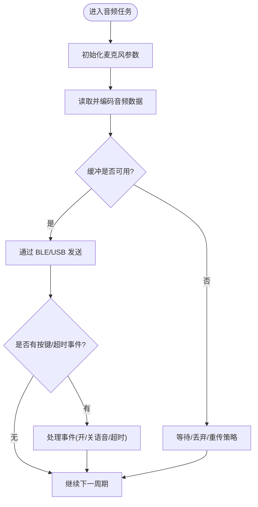
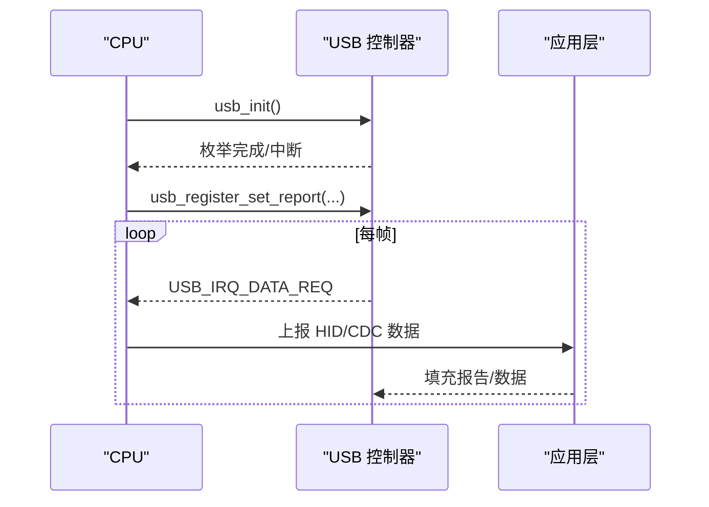
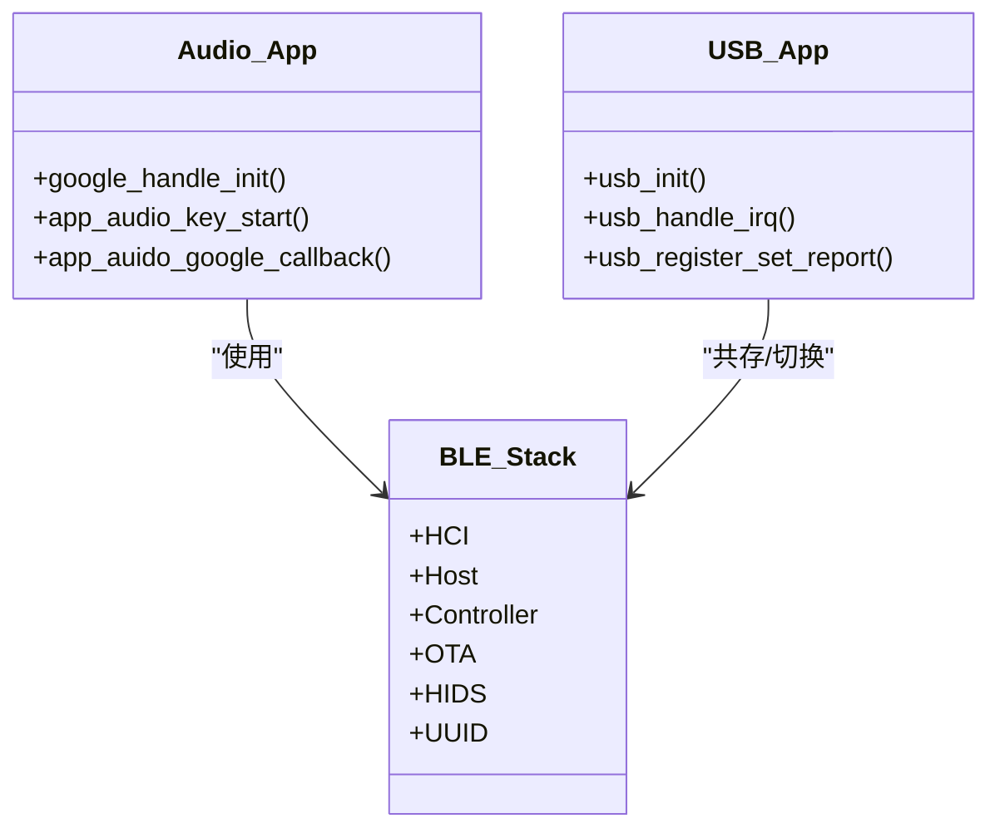
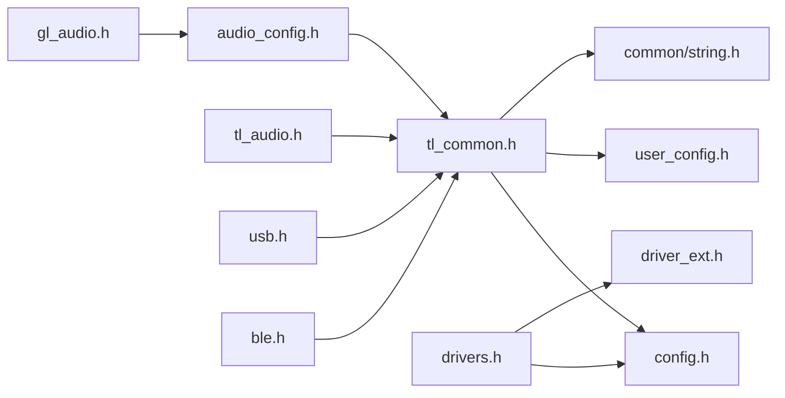

# 应用开发指南

<cite>
**本文引用的文件**
- [README.md](file://README.md)
- [telink_b85m_triple_mode_audio_mouse_sdk_Release_Note .md](file://telink_b85m_triple_mode_audio_mouse_sdk_Release_Note .md)
- [config.h](file://tc_ble_single_sdk/config.h)
- [tl_common.h](file://tc_ble_single_sdk/tl_common.h)
- [drivers.h](file://tc_ble_single_sdk/drivers.h)
- [audio_config.h](file://tc_ble_single_sdk/application/audio/audio_config.h)
- [gl_audio.h](file://tc_ble_single_sdk/application/audio/gl_audio.h)
- [tl_audio.h](file://tc_ble_single_sdk/application/audio/tl_audio.h)
- [usb.h](file://tc_ble_single_sdk/application/usbstd/usb.h)
- [ble.h](file://tc_ble_single_sdk/stack/ble/ble.h)
</cite>

## 目录
1. [简介](#简介)
2. [项目结构](#项目结构)
3. [核心组件](#核心组件)
4. [架构总览](#架构总览)
5. [详细组件分析](#详细组件分析)
6. [依赖关系分析](#依赖关系分析)
7. [性能与功耗考量](#性能与功耗考量)
8. [故障排查指南](#故障排查指南)
9. [结论](#结论)
10. [附录：API参考与配置项](#附录api参考与配置项)

## 简介
本指南面向基于 Telink B85/B80 的三模音频鼠标（BLE/USB/2.4G）应用开发者，提供从框架使用、标准开发流程到完整 API 参考、配置说明、调试与性能优化、以及典型场景模板的系统化文档。SDK 支持 BLE 与 USB 双通道音频上报（ADPCM/MSBC/SBC），并兼容 HID 鼠标数据与自定义服务；同时提供 Dongle 端接收与转发能力。版本信息、功能演进与已知问题可参考发布说明。

**章节来源**
- [README.md:1-231](file://README.md#L1-L231)
- [telink_b85m_triple_mode_audio_mouse_sdk_Release_Note .md:1-217](file://telink_b85m_triple_mode_audio_mouse_sdk_Release_Note .md#L1-L217)

## 项目结构
该 SDK 采用“平台驱动 + 协议栈 + 应用层”的分层组织方式：
- 平台驱动层：按芯片系列（B85/B87/TC321X）提供外设驱动（ADC、GPIO、I2C、SPI、UART、DMA、定时器、看门狗等）。
- 协议栈层：BLE 协议栈（控制器/主机/HCI/服务）、2.4G 子模块（TPL/TPL/TPLSLL）。
- 应用层：音频采集/编码/传输（ADPCM/MSBC/SBC）、USB HID 设备类、打印与工具库、用户配置入口。
- 工程与构建：各芯片/项目的 Makefile 与链接脚本，便于模块化编译与裁剪。

**图示来源**
- [tl_common.h:27-52](file://tc_ble_single_sdk/tl_common.h#L27-L52)
- [drivers.h:26-30](file://tc_ble_single_sdk/drivers.h#L26-L30)
- [ble.h:28-44](file://tc_ble_single_sdk/stack/ble/ble.h#L28-L44)

**章节来源**
- [tl_common.h:27-52](file://tc_ble_single_sdk/tl_common.h#L27-L52)
- [drivers.h:26-30](file://tc_ble_single_sdk/drivers.h#L26-L30)
- [ble.h:28-44](file://tc_ble_single_sdk/stack/ble/ble.h#L28-L44)

## 核心组件
- 音频子系统
  - 配置与模式选择：通过 audio_config.h 中的 TL_AUDIO_MODE 宏选择 RCU（鼠标端）或 DONGLE（接收端）及具体编解码方案（ADPCM/MSBC/SBC）。
  - 编码器与缓冲：tl_audio.h 暴露麦克风参数初始化、编码处理、缓冲区读写接口；gl_audio.h 定义 Google 语音协议相关常量、状态位与回调。
- USB 子系统
  - usb.h 提供 USB 初始化、中断处理、HID 报告注册、CDC 数据处理、MIC 开关检测等接口。
- BLE 子系统
  - ble.h 聚合 HCI、Host、Controller、OTA、HIDS、UUID 等服务头文件，作为 BLE 能力统一入口。
- 公共与配置
  - config.h 定义芯片类型与 MCU 核心类型；tl_common.h 汇总通用头与 vendor 配置入口；user_config.h 根据工程宏包含对应 app_config。

**章节来源**
- [audio_config.h:28-123](file://tc_ble_single_sdk/application/audio/audio_config.h#L28-L123)
- [tl_audio.h:32-129](file://tc_ble_single_sdk/application/audio/tl_audio.h#L32-L129)
- [gl_audio.h:29-151](file://tc_ble_single_sdk/application/audio/gl_audio.h#L29-L151)
- [usb.h:27-81](file://tc_ble_single_sdk/application/usbstd/usb.h#L27-L81)
- [ble.h:28-44](file://tc_ble_single_sdk/stack/ble/ble.h#L28-L44)
- [config.h:31-55](file://tc_ble_single_sdk/config.h#L31-L55)
- [tl_common.h:27-52](file://tc_ble_single_sdk/tl_common.h#L27-L52)
- [user_config.h:27-61](file://tc_ble_single_sdk/vendor/common/user_config.h#L27-L61)

## 架构总览
下图展示从传感器/麦克风输入到 BLE/USB 输出的端到端数据流，以及关键模块间的调用关系。

**图示来源**
- [tl_audio.h:112-118](file://tc_ble_single_sdk/application/audio/tl_audio.h#L112-L118)
- [gl_audio.h:145-150](file://tc_ble_single_sdk/application/audio/gl_audio.h#L145-L150)
- [usb.h:61-81](file://tc_ble_single_sdk/application/usbstd/usb.h#L61-L81)
- [ble.h:28-44](file://tc_ble_single_sdk/stack/ble/ble.h#L28-L44)

## 详细组件分析

### 音频子系统（RCU/鼠标端）
- 模式与参数
  - 通过 audio_config.h 的 TL_AUDIO_MODE 选择 RCU 分支，并根据 Google ADPCM v1.0/v0.4、HID、SBC、MSBC 等模式设置帧长、单元大小与缓冲大小。
- 关键接口
  - 初始化与处理：audio_mic_param_init、proc_mic_encoder、mic_encoder_data_buffer、mic_encoder_data_read_ok。
  - 事件与超时：app_audio_key_start、app_audio_timeout_proc、app_auido_google_callback。
  - Google 语音控制：google_handle_init 用于绑定控制/报告句柄。
- 状态与标志
  - gl_audio.h 定义了音频就绪、等待事件、多包请求、同步、更新参数等标志位，以及按键事件掩码。

**图示来源**
- [tl_audio.h:112-118](file://tc_ble_single_sdk/application/audio/tl_audio.h#L112-L118)
- [gl_audio.h:145-150](file://tc_ble_single_sdk/application/audio/gl_audio.h#L145-L150)
- [audio_config.h:32-74](file://tc_ble_single_sdk/application/audio/audio_config.h#L32-L74)

**章节来源**
- [audio_config.h:28-74](file://tc_ble_single_sdk/application/audio/audio_config.h#L28-L74)
- [tl_audio.h:32-118](file://tc_ble_single_sdk/application/audio/tl_audio.h#L32-L118)
- [gl_audio.h:29-151](file://tc_ble_single_sdk/application/audio/gl_audio.h#L29-L151)

### USB 子系统
- 初始化与中断
  - usb_init 完成枚举与描述符加载；usb_handle_irq 处理 SETUP/DATA 请求。
- HID 报告与 CDC
  - 通过 usb_register_set_report 注册 HID 报告回调；usb_cdc_irq_data_process 处理 CDC 数据。
- MIC 开关与状态
  - usb_mic_is_enable 判断当前替代接口的 MIC 启用状态；USB_TIME_BEFORE_ALLOW_SUSPEND 控制挂起前延时。

**图示来源**
- [usb.h:33-81](file://tc_ble_single_sdk/application/usbstd/usb.h#L33-L81)

**章节来源**
- [usb.h:33-81](file://tc_ble_single_sdk/application/usbstd/usb.h#L33-L81)

### BLE 子系统与服务
- 统一入口
  - ble.h 聚合 HCI、Host、Controller、OTA、HIDS、UUID 等头文件，作为 BLE 能力总入口。
- 典型服务
  - HIDS：鼠标 HID 报告。
  - OTA：固件升级服务。
  - 自定义服务：Google 语音/自定义 UUID 通道。

**图示来源**
- [ble.h:28-44](file://tc_ble_single_sdk/stack/ble/ble.h#L28-L44)
- [gl_audio.h:145-150](file://tc_ble_single_sdk/application/audio/gl_audio.h#L145-L150)
- [usb.h:61-81](file://tc_ble_single_sdk/application/usbstd/usb.h#L61-L81)

**章节来源**
- [ble.h:28-44](file://tc_ble_single_sdk/stack/ble/ble.h#L28-L44)

## 依赖关系分析
- 顶层入口
  - tl_common.h 引入 common/utility/bit/assert、vendor/user_config、config.h、string 等，形成应用公共头。
  - drivers.h 引入 config.h 与 driver_ext/driver_ext.h，屏蔽底层差异。
- 音频与协议栈
  - 音频模块依赖 audio_config.h 的模式宏，并通过 tl_audio.h 暴露接口；BLE/USB 分别通过 ble.h/usb.h 接入。
- 配置注入
  - user_config.h 根据工程宏包含不同 app_config，实现项目级配置隔离。

**图示来源**
- [tl_common.h:27-52](file://tc_ble_single_sdk/tl_common.h#L27-L52)
- [drivers.h:26-30](file://tc_ble_single_sdk/drivers.h#L26-L30)
- [audio_config.h:24-30](file://tc_ble_single_sdk/application/audio/audio_config.h#L24-L30)
- [gl_audio.h:27-31](file://tc_ble_single_sdk/application/audio/gl_audio.h#L27-L31)
- [tl_audio.h:27-32](file://tc_ble_single_sdk/application/audio/tl_audio.h#L27-L32)
- [usb.h:25-27](file://tc_ble_single_sdk/application/usbstd/usb.h#L25-L27)
- [ble.h:28-33](file://tc_ble_single_sdk/stack/ble/ble.h#L28-L33)
- [user_config.h:27-61](file://tc_ble_single_sdk/vendor/common/user_config.h#L27-L61)

**章节来源**
- [tl_common.h:27-52](file://tc_ble_single_sdk/tl_common.h#L27-L52)
- [drivers.h:26-30](file://tc_ble_single_sdk/drivers.h#L26-L30)
- [user_config.h:27-61](file://tc_ble_single_sdk/vendor/common/user_config.h#L27-L61)

## 性能与功耗考量
- 音频带宽与延迟
  - 合理选择编码格式与帧长（ADPCM/MSBC/SBC），在音质与带宽间权衡；根据连接间隔动态调整 UI/上报间隔，避免拥塞。
- 缓冲与丢包
  - 利用麦克风流缓冲与索引机制，防止丢包导致的数据错乱；必要时启用重传或丢弃策略。
- 低功耗
  - 在非活跃期降低上报率；合理使用睡眠唤醒；关闭未使用的 IO 输出以减少功耗。
- USB 挂起
  - 遵循 USB_TIME_BEFORE_ALLOW_SUSPEND 策略，确保系统休眠/唤醒行为符合预期。

[本节为通用指导，不直接分析具体文件]

## 故障排查指南
- 常见问题定位
  - 无法进入睡眠/唤醒异常：检查 USB 挂起逻辑与 BLE 回连状态。
  - 语音模式下画线卡顿：确认 FIFO 容量与上报率匹配，必要时降低 poll rate。
  - LED 指示异常：核对 OTA 成功/失败灯效逻辑。
- 调试手段
  - 使用打印接口（u_printf）输出关键路径日志。
  - 通过 USB CDC/HID 报告观察数据流。
  - 结合 EMI 测试功能验证射频链路稳定性。

**章节来源**
- [README.md:1-231](file://README.md#L1-L231)
- [telink_b85m_triple_mode_audio_mouse_sdk_Release_Note .md:1-217](file://telink_b85m_triple_mode_audio_mouse_sdk_Release_Note .md#L1-L217)

## 结论
本 SDK 提供了完善的三模音频鼠标开发基础，涵盖音频采集编码、BLE/USB 传输、HID 服务与 OTA 能力。通过合理的配置与资源管理，可实现稳定低延迟的语音与鼠标数据上报。建议在新项目中优先复用现有音频与协议栈接口，聚焦业务逻辑与用户体验优化。

[本节为总结性内容，不直接分析具体文件]

## 附录：API参考与配置项

### 音频模块 API（RCU/鼠标端）
- 初始化与处理
  - audio_mic_param_init：初始化麦克风参数。
  - proc_mic_encoder：周期性执行编码与缓冲管理。
  - mic_encoder_data_buffer：获取编码数据缓冲区指针。
  - mic_encoder_data_read_ok：通知上层已消费数据。
- 事件与回调
  - app_audio_key_start(isPress)：处理语音键按下/释放。
  - app_audio_timeout_proc()：处理语音超时逻辑。
  - app_auido_google_callback(p)：Google 语音事件回调。
  - google_handle_init(ctl_dp_h, report_dp_h)：初始化控制/报告句柄。

**章节来源**
- [tl_audio.h:112-118](file://tc_ble_single_sdk/application/audio/tl_audio.h#L112-L118)
- [gl_audio.h:145-150](file://tc_ble_single_sdk/application/audio/gl_audio.h#L145-L150)

### USB 子系统 API
- 初始化与中断
  - usb_init()：初始化 USB 设备。
  - usb_handle_irq()：处理 USB 中断。
- 报告与数据
  - usb_register_set_report(src)：注册 HID 报告回调。
  - usb_cdc_irq_data_process()：处理 CDC 数据。
- 状态查询
  - usb_mic_is_enable()：查询 MIC 是否启用。

**章节来源**
- [usb.h:61-81](file://tc_ble_single_sdk/application/usbstd/usb.h#L61-L81)

### BLE 子系统入口
- 统一头文件
  - ble.h：聚合 HCI、Host、Controller、OTA、HIDS、UUID 等能力。

**章节来源**
- [ble.h:28-44](file://tc_ble_single_sdk/stack/ble/ble.h#L28-L44)

### 配置项说明
- 芯片与核心类型
  - config.h：CHIP_TYPE、MCU_CORE_TYPE 等宏，决定目标芯片与核心。
- 音频模式与参数
  - audio_config.h：TL_AUDIO_MODE 选择 RCU/DONGLE 及具体编码方案；各模式下的帧长、单元大小、缓冲大小。
- 用户工程配置
  - user_config.h：根据工程宏包含对应 app_config，实现项目级配置隔离。

**章节来源**
- [config.h:31-55](file://tc_ble_single_sdk/config.h#L31-L55)
- [audio_config.h:28-123](file://tc_ble_single_sdk/application/audio/audio_config.h#L28-L123)
- [user_config.h:27-61](file://tc_ble_single_sdk/vendor/common/user_config.h#L27-L61)

### 典型应用场景与模板
- 场景一：BLE 模式开启语音
  - 步骤
    - 设置 TL_AUDIO_MODE 为 RCU_ADPCM_GATT_GOOGLE 或 MSBC_HID。
    - 初始化音频参数并启动编码任务。
    - 通过 google_handle_init 绑定控制/报告句柄。
    - 监听 app_audio_key_start 控制语音开关。
  - 参考路径
    - [audio_config.h:32-74](file://tc_ble_single_sdk/application/audio/audio_config.h#L32-L74)
    - [gl_audio.h:145-150](file://tc_ble_single_sdk/application/audio/gl_audio.h#L145-L150)
    - [tl_audio.h:112-118](file://tc_ble_single_sdk/application/audio/tl_audio.h#L112-L118)

- 场景二：USB 模式同时上报鼠标与音频
  - 步骤
    - 初始化 USB 设备并注册 HID 报告回调。
    - 将音频数据填充至 HID/CDC 报告。
    - 根据系统状态调整上报率与缓冲策略。
  - 参考路径
    - [usb.h:61-81](file://tc_ble_single_sdk/application/usbstd/usb.h#L61-L81)

- 场景三：Dongle 接收并转发音频
  - 步骤
    - 选择 DONGLE 分支与对应编码模式。
    - 初始化音频缓冲与解码流程。
    - 通过 USB 或 BLE 将音频流转发至上位机。
  - 参考路径
    - [audio_config.h:76-123](file://tc_ble_single_sdk/application/audio/audio_config.h#L76-L123)
    - [tl_audio.h:120-127](file://tc_ble_single_sdk/application/audio/tl_audio.h#L120-L127)