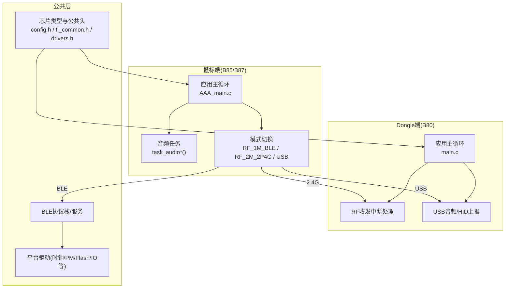
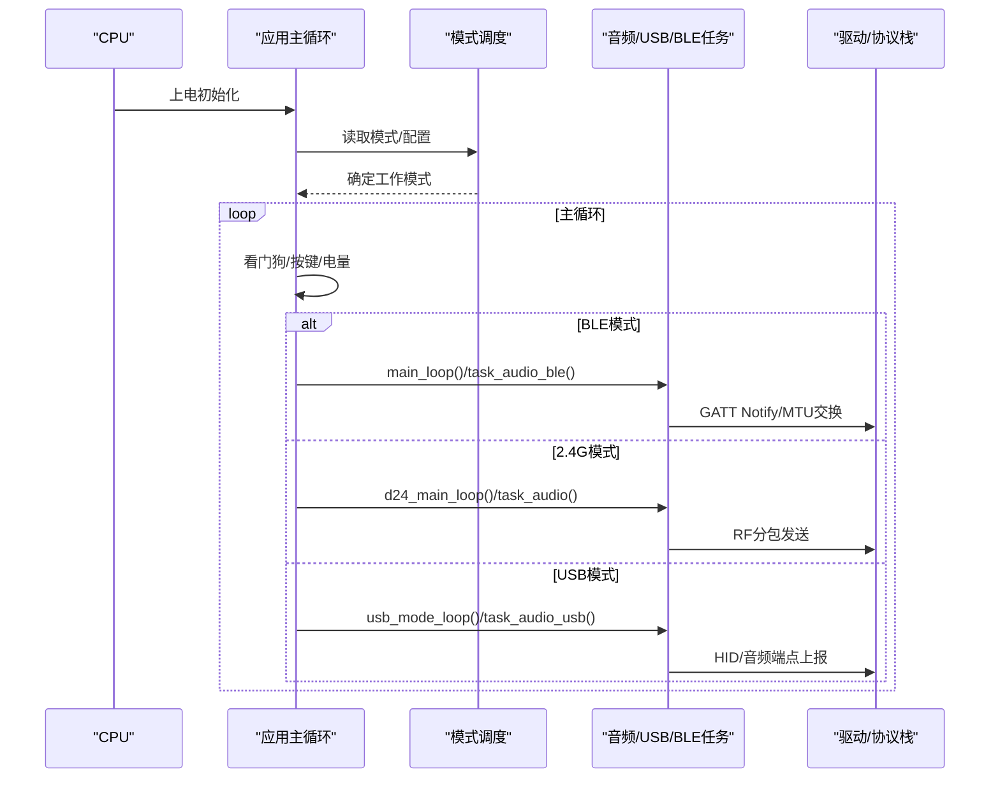
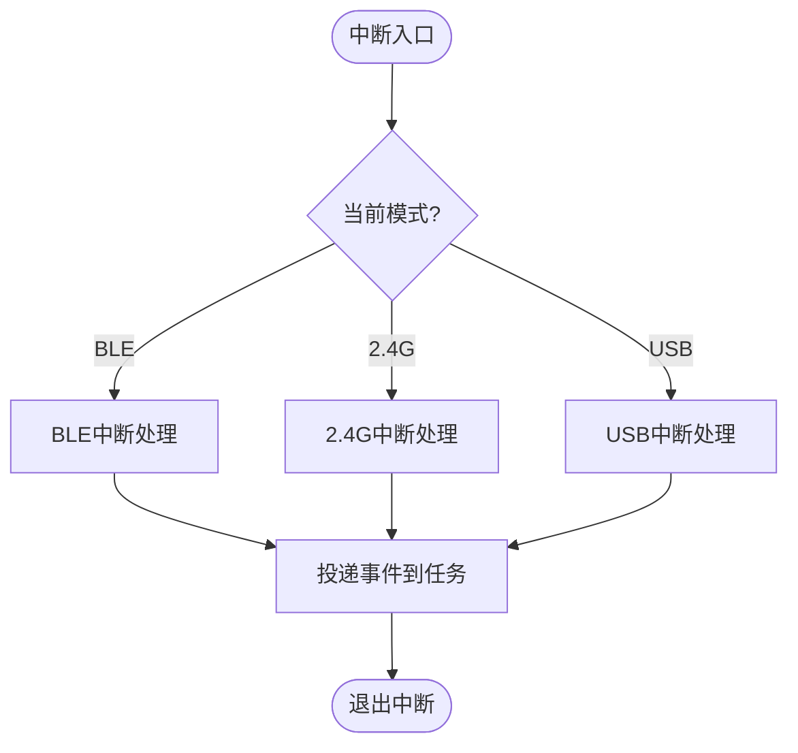
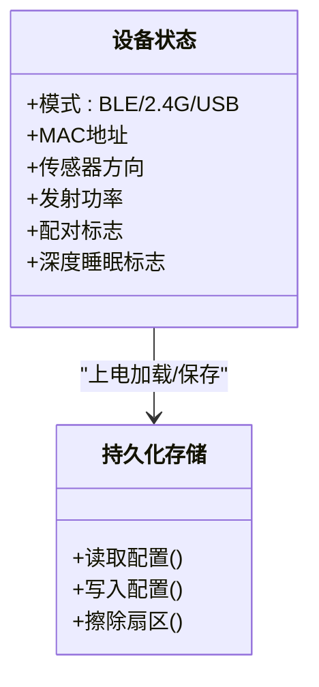
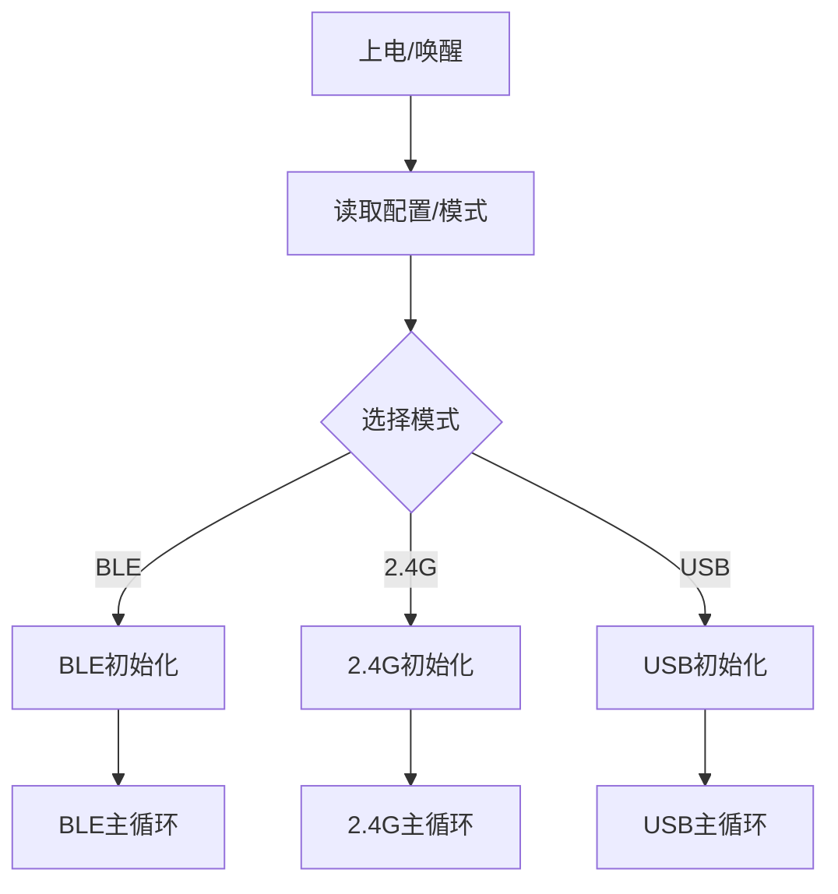
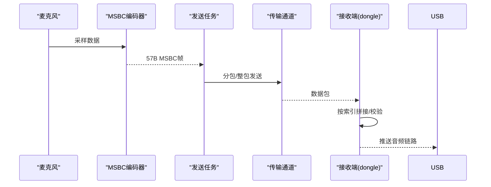
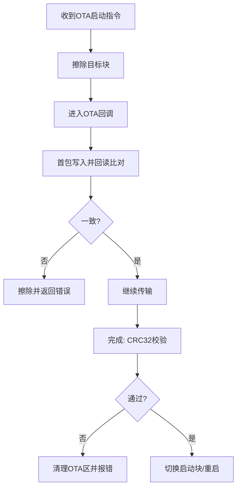
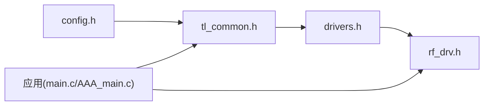

# 开发最佳实践

<cite>
**本文引用的文件**
- [README.md](file://README.md)
- [telink_b85m_triple_mode_audio_mouse_sdk_Release_Note .md](file://telink_b85m_triple_mode_audio_mouse_sdk_Release_Note .md)
- [SDK_Wiki.md](file://doc/SDK_Wiki.md)
- [AAA_main.c（B85）](file://tc_ble_single_sdk/vendor/8258_dual_mouse/AAA_main.c)
- [AAA_main.c（B87）](file://tc_ble_single_sdk/vendor/827x_three_mode_mouse/AAA_main.c)
- [config.h](file://tc_ble_single_sdk/config.h)
- [tl_common.h](file://tc_ble_single_sdk/tl_common.h)
- [drivers.h](file://tc_ble_single_sdk/drivers.h)
- [main.c（Dongle）](file://8373_dongle_for_km/demo/vendor/eaglet_dongle_Demo/main.c)
- [rf_drv.h](file://8373_dongle_for_km/chip/B80/drivers/lib/include/rf_drv.h)
</cite>

## 目录
1. [引言](#引言)
2. [项目结构](#项目结构)
3. [核心组件](#核心组件)
4. [架构总览](#架构总览)
5. [详细组件分析](#详细组件分析)
6. [依赖关系分析](#依赖关系分析)
7. [性能与功耗优化](#性能与功耗优化)
8. [故障诊断与调试](#故障诊断与调试)
9. [测试与验证流程](#测试与验证流程)
10. [代码重构、版本管理与团队协作](#代码重构版本管理与团队协作)
11. [常见陷阱与调优建议](#常见陷阱与调优建议)
12. [结论](#结论)

## 引言
本指南面向嵌入式音频鼠标（三模：BLE/2.4G/USB）应用开发，基于 Telink B85/B87/B80 平台 SDK 的工程实践，总结事件处理机制、状态管理模式、内存与资源管理策略，以及三模连接切换、电源管理优化、调试技巧、性能分析与故障诊断、测试验证、代码重构与版本管理等最佳实践。文档以仓库中的工程入口、Wiki 与发布说明为依据，提供可落地的流程与规范建议。

## 项目结构
本项目由三部分构成：
- 鼠标端应用（B85/B87）：支持 BLE、2.4G、USB 三模，含音频采集、编码与上报；
- Dongle 端应用（B80）：接收 2.4G 音频并转发至 USB；
- 公共驱动与协议栈：BLE 协议栈、平台驱动、启动与配置头文件等。

图表来源
- [AAA_main.c（B85）:312-529](file://tc_ble_single_sdk/vendor/8258_dual_mouse/AAA_main.c#L312-L529)
- [AAA_main.c（B87）:335-561](file://tc_ble_single_sdk/vendor/827x_three_mode_mouse/AAA_main.c#L335-L561)
- [main.c（Dongle）:119-241](file://8373_dongle_for_km/demo/vendor/eaglet_dongle_Demo/main.c#L119-L241)
- [config.h:31-55](file://tc_ble_single_sdk/config.h#L31-L55)
- [tl_common.h:27-52](file://tc_ble_single_sdk/tl_common.h#L27-L52)
- [drivers.h:26-30](file://tc_ble_single_sdk/drivers.h#L26-L30)

章节来源
- [README.md:1-231](file://README.md#L1-L231)
- [SDK_Wiki.md:10-40](file://doc/SDK_Wiki.md#L10-L40)

## 核心组件
- 应用主循环与初始化：按当前工作模式进入不同初始化与主循环分支，统一在 main 中调度。
- 音频采集与编码：AMIC 输入，MSBC 编码，按模式分包或整包上报。
- 三模连接切换：通过硬件开关/枚举状态选择 BLE/2.4G/USB 模式，并在运行时维护模式状态。
- Flash 保护与 OTA：注册协议栈回调，在 OTA 期间解锁/加锁，保证固件安全。
- 低功耗管理：根据模式与任务动态调整报告率、休眠唤醒源与外设电源。

章节来源
- [AAA_main.c（B85）:312-529](file://tc_ble_single_sdk/vendor/8258_dual_mouse/AAA_main.c#L312-L529)
- [AAA_main.c（B87）:335-561](file://tc_ble_single_sdk/vendor/827x_three_mode_mouse/AAA_main.c#L335-L561)
- [SDK_Wiki.md:86-258](file://doc/SDK_Wiki.md#L86-L258)

## 架构总览
系统采用“应用主循环 + 任务调度”的轻量 RTOS 风格架构：
- 主循环负责看门狗清狗、模式轮询、电池检测、按键扫描等；
- 各模式独立的主循环与任务（如 task_audio_*）负责具体业务；
- 中断仅做最小化处理，将耗时逻辑下沉到任务。

图表来源
- [AAA_main.c（B85）:488-529](file://tc_ble_single_sdk/vendor/8258_dual_mouse/AAA_main.c#L488-L529)
- [AAA_main.c（B87）:530-561](file://tc_ble_single_sdk/vendor/827x_three_mode_mouse/AAA_main.c#L530-L561)
- [SDK_Wiki.md:102-173](file://doc/SDK_Wiki.md#L102-L173)

## 详细组件分析

### 事件处理机制
- 中断入口统一分发：根据当前模式调用对应中断处理函数（BLE/2.4G/USB），避免在中断中执行重逻辑。
- 任务化事件处理：音频采集、编码、打包与上报均在任务中完成，降低中断延迟抖动。
- 按键与模式切换：主循环轮询按键状态变化，触发模式切换或功能开关（如语音键）。

图表来源
- [AAA_main.c（B85）:46-56](file://tc_ble_single_sdk/vendor/8258_dual_mouse/AAA_main.c#L46-L56)
- [AAA_main.c（B87）:59-75](file://tc_ble_single_sdk/vendor/827x_three_mode_mouse/AAA_main.c#L59-L75)
- [main.c（Dongle）:76-106](file://8373_dongle_for_km/demo/vendor/eaglet_dongle_Demo/main.c#L76-L106)

章节来源
- [AAA_main.c（B85）:46-56](file://tc_ble_single_sdk/vendor/8258_dual_mouse/AAA_main.c#L46-L56)
- [AAA_main.c（B87）:59-75](file://tc_ble_single_sdk/vendor/827x_three_mode_mouse/AAA_main.c#L59-L75)
- [main.c（Dongle）:76-106](file://8373_dongle_for_km/demo/vendor/eaglet_dongle_Demo/main.c#L76-L106)

### 状态管理模式
- 模式状态：使用全局变量记录当前模式（BLE/2.4G/USB），主循环据此分派任务。
- 设备信息持久化：MAC、传感器方向、发射功率等参数写入 Flash，上电加载。
- 运行标志：深度睡眠唤醒标志、配对标志等保存在保留区，跨重启保持。

图表来源
- [AAA_main.c（B85）:24-42,126-199,387-430:24-42](file://tc_ble_single_sdk/vendor/8258_dual_mouse/AAA_main.c#L24-L42)
- [AAA_main.c（B85）:59-88](file://tc_ble_single_sdk/vendor/8258_dual_mouse/AAA_main.c#L59-L88)
- [AAA_main.c（B87）:25-44,125-195,417-451:25-44](file://tc_ble_single_sdk/vendor/827x_three_mode_mouse/AAA_main.c#L25-L44)

章节来源
- [AAA_main.c（B85）:24-42,126-199,387-430:24-42](file://tc_ble_single_sdk/vendor/8258_dual_mouse/AAA_main.c#L24-L42)
- [AAA_main.c（B87）:25-44,125-195,417-451:25-44](file://tc_ble_single_sdk/vendor/827x_three_mode_mouse/AAA_main.c#L25-L44)

### 内存与缓冲区管理
- 音频 FIFO：2.4G 模式下对音频包进行分包（索引+载荷），限制 FIFO 占用防止堵塞。
- 独立 FIFO：dongle 端为 mouse 数据与音频数据分别使用独立 FIFO，避免相互阻塞。
- 环形缓冲：编码器输出放入环形缓冲，按需取包，减少拷贝与峰值占用。

章节来源
- [SDK_Wiki.md:145-182](file://doc/SDK_Wiki.md#L145-L182)

### 三模连接切换
- 切换依据：硬件开关/USB 插入状态/默认配置决定初始模式；运行时可通过按键或条件切换。
- 切换流程：更新模式变量 → 调用对应初始化 → 进入相应主循环。
- 兼容性：不同芯片（B85/B87）在引脚、名称、report id 等方面存在差异，需按工程配置。

图表来源
- [AAA_main.c（B85）:455-480](file://tc_ble_single_sdk/vendor/8258_dual_mouse/AAA_main.c#L455-L480)
- [AAA_main.c（B87）:482-501](file://tc_ble_single_sdk/vendor/827x_three_mode_mouse/AAA_main.c#L482-L501)
- [SDK_Wiki.md:244-258](file://doc/SDK_Wiki.md#L244-L258)

章节来源
- [AAA_main.c（B85）:455-480](file://tc_ble_single_sdk/vendor/8258_dual_mouse/AAA_main.c#L455-L480)
- [AAA_main.c（B87）:482-501](file://tc_ble_single_sdk/vendor/827x_three_mode_mouse/AAA_main.c#L482-L501)
- [SDK_Wiki.md:244-258](file://doc/SDK_Wiki.md#L244-L258)

### 电源管理与低功耗
- 睡眠模式：suspend/deep/deep retention/长睡眠，配合唤醒源（timer/PAD/LPC/RF）。
- 报告率自适应：开语音时降低报告率，关语音恢复，平衡带宽与功耗。
- 外设电源：睡眠前关闭 audio/zb/usb 模块电源，降低静态电流。
- 晶振与校准：正确配置内部电容与校准值，避免起振异常与死机。

章节来源
- [SDK_Wiki.md:687-713](file://doc/SDK_Wiki.md#L687-L713)
- [AAA_main.c（B85）:481-486](file://tc_ble_single_sdk/vendor/8258_dual_mouse/AAA_main.c#L481-L486)
- [AAA_main.c（B87）:503-508](file://tc_ble_single_sdk/vendor/827x_three_mode_mouse/AAA_main.c#L503-L508)

### 音频数据流与上报
- 采集与编码：AMIC 差分输入，MSBC 编码每帧 57 字节。
- 上报通道：
  - 2.4G：分包（索引+29B/28B），命令码定义明确，ACK 机制保障可靠性。
  - BLE：自定义服务 Notify，必要时 MTU 交换提升单包载荷。
  - USB：HID 上报，report id 因工程而异，报告率随语音开关调整。
- 拼接与校验：dongle 端按索引拼接完整帧，CRC32 校验用于 OTA 固件完整性。

图表来源
- [SDK_Wiki.md:102-182](file://doc/SDK_Wiki.md#L102-L182)
- [SDK_Wiki.md:725-754](file://doc/SDK_Wiki.md#L725-L754)

章节来源
- [SDK_Wiki.md:102-182](file://doc/SDK_Wiki.md#L102-L182)
- [SDK_Wiki.md:725-754](file://doc/SDK_Wiki.md#L725-L754)

### Flash 保护与 OTA
- 保护机制：应用注册回调，在 OTA 开始/结束自动解锁/加锁，防止误写。
- 双块分区：dongle 端采用双块 flash 方案，OTA 目标地址与启动标志协同。
- 校验流程：首包回读比对，完成后 CRC32 校验，失败则清理并重试。

图表来源
- [SDK_Wiki.md:725-754](file://doc/SDK_Wiki.md#L725-L754)
- [AAA_main.c（B85）:217-305](file://tc_ble_single_sdk/vendor/8258_dual_mouse/AAA_main.c#L217-L305)
- [AAA_main.c（B87）:237-325](file://tc_ble_single_sdk/vendor/827x_three_mode_mouse/AAA_main.c#L237-L325)

章节来源
- [SDK_Wiki.md:725-754](file://doc/SDK_Wiki.md#L725-L754)
- [AAA_main.c（B85）:217-305](file://tc_ble_single_sdk/vendor/8258_dual_mouse/AAA_main.c#L217-L305)
- [AAA_main.c（B87）:237-325](file://tc_ble_single_sdk/vendor/827x_three_mode_mouse/AAA_main.c#L237-L325)

## 依赖关系分析
- 芯片类型与公共头：config.h 定义芯片类型宏，tl_common.h 聚合常用头文件，drivers.h 引入驱动扩展。
- 模式与射频：rf_drv.h 定义 RF 模式与状态，供 2.4G/BLE 驱动使用。
- 应用与协议栈：应用通过 BLE SDK 提供的 API 进行连接、服务、OTA 等操作。

图表来源
- [config.h:31-55](file://tc_ble_single_sdk/config.h#L31-L55)
- [tl_common.h:27-52](file://tc_ble_single_sdk/tl_common.h#L27-L52)
- [drivers.h:26-30](file://tc_ble_single_sdk/drivers.h#L26-L30)
- [rf_drv.h:57-105](file://8373_dongle_for_km/chip/B80/drivers/lib/include/rf_drv.h#L57-L105)

章节来源
- [config.h:31-55](file://tc_ble_single_sdk/config.h#L31-L55)
- [tl_common.h:27-52](file://tc_ble_single_sdk/tl_common.h#L27-L52)
- [drivers.h:26-30](file://tc_ble_single_sdk/drivers.h#L26-L30)
- [rf_drv.h:57-105](file://8373_dongle_for_km/chip/B80/drivers/lib/include/rf_drv.h#L57-L105)

## 性能与功耗优化
- 报告率自适应：开语音降低报告率，关语音恢复，减少带宽压力与功耗。
- FIFO 流控：限制音频包数量，避免 FIFO 堵塞导致丢包或系统卡顿。
- 低功耗模式：合理选择睡眠模式与唤醒源，关闭不必要的外设电源。
- 晶振与校准：确保外部电容配置正确，避免起振异常与频率漂移。

章节来源
- [SDK_Wiki.md:145-182](file://doc/SDK_Wiki.md#L145-L182)
- [SDK_Wiki.md:687-713](file://doc/SDK_Wiki.md#L687-L713)

## 故障诊断与调试
- 看门狗：主循环定期清狗，防止程序跑飞。
- 日志打印：关键路径添加打印（如模式、连接间隔、FIFO 数量），便于定位问题。
- 调试 GPIO：翻转调试引脚观察时序，辅助判断任务调度与中断响应。
- 常见问题：
  - 语音开启后画线异常：检查报告率与 FIFO 流控；
  - Chromebook 睡眠异常：确认 USB 模式下的唤醒与报告率设置；
  - OTA 失败：检查 Flash 保护状态与 CRC32 校验结果。

章节来源
- [AAA_main.c（B85）:488-529](file://tc_ble_single_sdk/vendor/8258_dual_mouse/AAA_main.c#L488-L529)
- [AAA_main.c（B87）:530-561](file://tc_ble_single_sdk/vendor/827x_three_mode_mouse/AAA_main.c#L530-L561)
- [main.c（Dongle）:213-237](file://8373_dongle_for_km/demo/vendor/eaglet_dongle_Demo/main.c#L213-L237)

## 测试与验证流程
- 功能测试：
  - 三模切换：验证 BLE/2.4G/USB 模式切换与灯效；
  - 语音功能：验证开/关语音、分包/整包上报、拼接与播放；
  - OTA 升级：验证 BLE/USB/2.4G OTA 流程与结果码。
- 性能测试：
  - 报告率与带宽：测量不同模式下的报告率与吞吐；
  - 功耗测试：测量不同模式与睡眠状态的电流。
- 稳定性测试：
  - 长时间运行：验证无内存泄漏与死机；
  - 多设备场景：验证多鼠标配对与回连。

章节来源
- [README.md:1-231](file://README.md#L1-L231)
- [telink_b85m_triple_mode_audio_mouse_sdk_Release_Note .md:21-117](file://telink_b85m_triple_mode_audio_mouse_sdk_Release_Note .md#L21-L117)

## 代码重构、版本管理与团队协作
- 代码重构：
  - 模块化：按功能划分模块（音频、USB、BLE、2.4G），减少耦合；
  - 接口抽象：对外暴露稳定接口，隐藏实现细节。
- 版本管理：
  - 语义化版本：遵循 Major.Minor.Patch 规则；
  - 变更日志：记录 Breaking Changes、Features、Bug Fixes。
- 团队协作：
  - 代码审查：强制 CR，确保质量；
  - 自动化构建：CI 集成编译与基础测试。

章节来源
- [telink_b85m_triple_mode_audio_mouse_sdk_Release_Note .md:21-117](file://telink_b85m_triple_mode_audio_mouse_sdk_Release_Note .md#L21-L117)

## 常见陷阱与调优建议
- 陷阱：
  - Flash 未保护：导致 OTA 或误写破坏固件；
  - 晶振配置错误：引起复位或死机；
  - FIFO 堵塞：导致音频或鼠标数据丢失。
- 调优：
  - 合理设置报告率与分包大小；
  - 使用独立 FIFO 隔离不同数据流；
  - 启用低功耗模式与外设电源管理。

章节来源
- [SDK_Wiki.md:624-713](file://doc/SDK_Wiki.md#L624-L713)

## 结论
本指南基于 Telink 三模音频鼠标 SDK 的工程实践，总结了事件处理、状态管理、内存与资源管理、三模切换、电源优化、调试与测试等方面的最佳实践。遵循这些规范与流程，可有效提升产品稳定性、性能与可维护性，降低开发风险与维护成本。