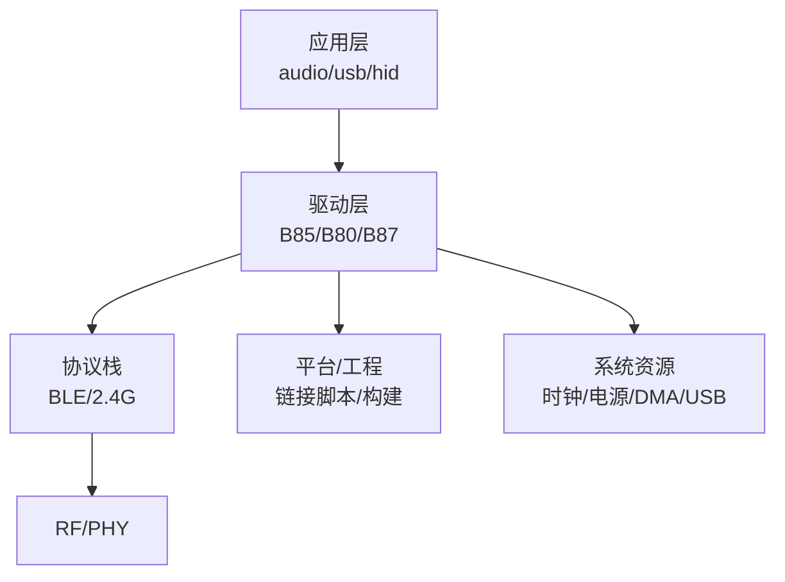
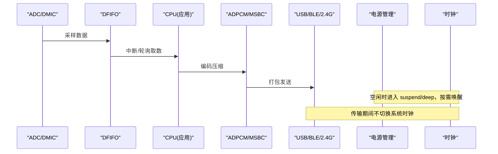
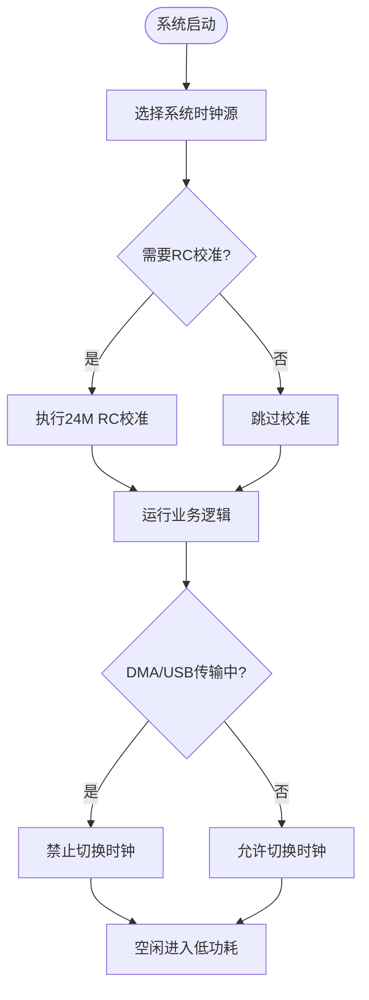
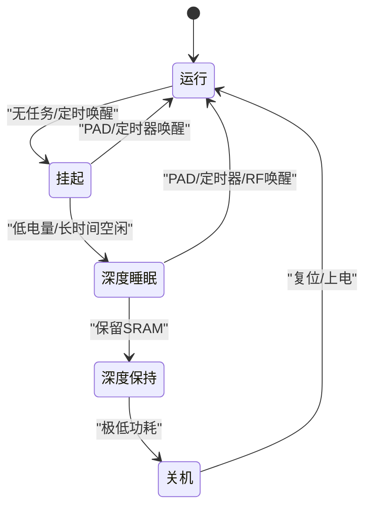
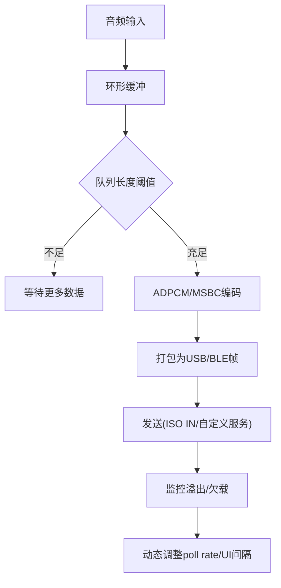
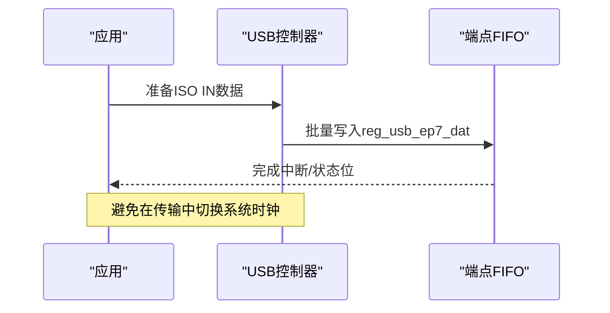
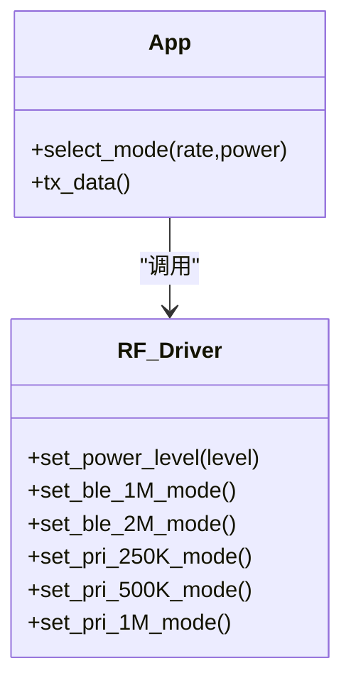
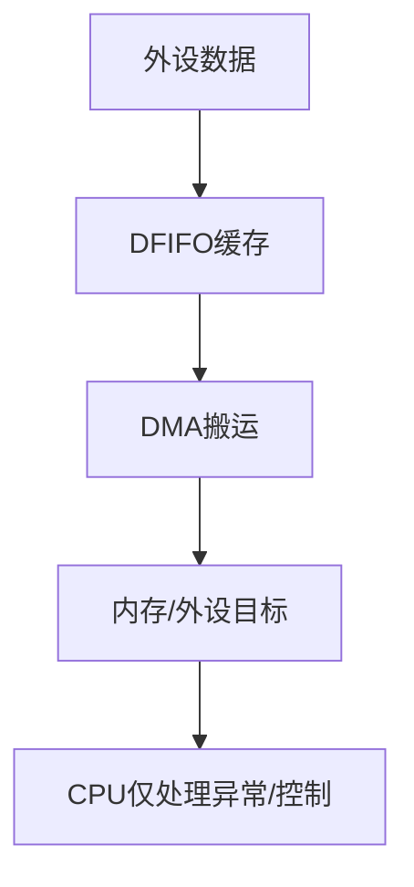
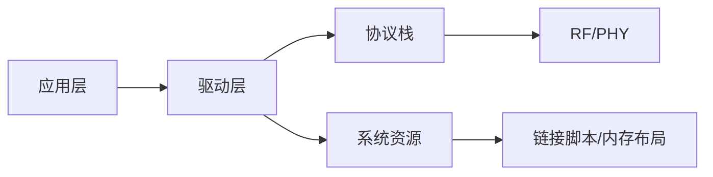

# 性能优化指南

<cite>
**本文引用的文件列表**
- [README.md](file://README.md)
- [telink_b85m_triple_mode_audio_mouse_sdk_Release_Note .md](file://telink_b85m_triple_mode_audio_mouse_sdk_Release_Note .md)
- [SDK_Wiki.md](file://doc/SDK_Wiki.md)
- [B85 时钟驱动 clock.c](file://tc_ble_single_sdk/drivers/B85/clock.c)
- [B85 电源管理 pm.h](file://tc_ble_single_sdk/drivers/B85/lib/include/pm.h)
- [音频处理 tl_audio.c](file://tc_ble_single_sdk/application/audio/tl_audio.c)
- [B85 DFIFO 接口 dfifo.h](file://tc_ble_single_sdk/drivers/B85/dfifo.h)
- [B85 DMA 接口 dma.h](file://tc_ble_single_sdk/drivers/B85/dma.h)
- [B85 USB 寄存器定义 register.h](file://tc_ble_single_sdk/drivers/B85/register.h)
- [B80 EMI 测试 pri2m_emi.c](file://8373_dongle_for_km/chip/B80/drivers/pri2m_emi.c)
- [RF 驱动 rf_drv.h](file://tc_ble_single_sdk/drivers/TC321X/lib/include/rf_drv.h)
- [B85 链接脚本 boot_B85_dual_mouse.link](file://doc/boot_B85_dual_mouse.link)
</cite>

## 目录
1. [简介](#简介)
2. [项目结构](#项目结构)
3. [核心组件](#核心组件)
4. [架构总览](#架构总览)
5. [详细组件分析](#详细组件分析)
6. [依赖关系分析](#依赖关系分析)
7. [性能考量与调优策略](#性能考量与调优策略)
8. [故障排查指南](#故障排查指南)
9. [结论](#结论)
10. [附录：基准测试与工具](#附录：基准测试与工具)

## 简介
本指南面向基于 Telink B85 芯片的三模（BLE/2.4G/USB）音频鼠标固件，聚焦于 CPU 利用率、内存使用与启动时间的优化方法；并给出低功耗模式配置、动态频率调节、外设电源管理与实时性能分析方法。文档结合 SDK 中的时钟、电源管理、音频缓冲、DMA、USB 与 RF 等关键模块，提供针对 B85 的实操建议与可落地的优化路径。

## 项目结构
该 SDK 按“应用层 / 驱动层 / 协议栈 / 平台”分层组织：
- 应用层：音频采集/编解码、USB HID/Audio、键盘/打印等
- 驱动层：B85/B80/B87 系列时钟、PM、DMA、DFIFO、USB、Flash、GPIO 等
- 协议栈：BLE 控制器与主机、2.4G 链路
- 平台与工程：链接脚本、构建配置、示例工程

**章节来源**
- [README.md:1-231](file://README.md#L1-L231)
- [telink_b85m_triple_mode_audio_mouse_sdk_Release_Note .md:1-217](file://telink_b85m_triple_mode_audio_mouse_sdk_Release_Note .md#L1-L217)

## 核心组件
- 时钟与动态频率：支持 16/24/32/48MHz 系统时钟选择与 RC/Xtal 校准，避免在 DMA/USB 传输中切换时钟导致数据丢失
- 电源管理：suspend/deep/deep retention/shutdown 多模式，唤醒源（定时器/PAD/LPC/RF），可配置基带/USB/音频供电开关
- 音频处理：ADC→DFIFO→ADPCM→USB/BLE 输出，环形缓冲与阈值控制，避免溢出与卡顿
- DMA/DFIFO：零拷贝搬运，降低 CPU 占用，提高吞吐
- USB：端点 FIFO、ISO IN 批量写入、中断与状态位管理
- RF：BLE/2.4G 发射功率档位、模式切换、EMI 测试能力

**章节来源**
- [B85 时钟驱动 clock.c:50-81](file://tc_ble_single_sdk/drivers/B85/clock.c#L50-L81)
- [B85 电源管理 pm.h:100-162](file://tc_ble_single_sdk/drivers/B85/lib/include/pm.h#L100-L162)
- [音频处理 tl_audio.c:876-932](file://tc_ble_single_sdk/application/audio/tl_audio.c#L876-L932)
- [B85 DFIFO 接口 dfifo.h:50-84](file://tc_ble_single_sdk/drivers/B85/dfifo.h#L50-L84)
- [B85 DMA 接口 dma.h:97-157](file://tc_ble_single_sdk/drivers/B85/dma.h#L97-L157)
- [B85 USB 寄存器定义 register.h:522-559](file://tc_ble_single_sdk/drivers/B85/register.h#L522-L559)
- [RF 驱动 rf_drv.h:454-518](file://tc_ble_single_sdk/drivers/TC321X/lib/include/rf_drv.h#L454-L518)

## 架构总览
下图展示从音频采集到无线/有线输出的数据流，以及功耗与时钟的关键控制点。

**图表来源**
- [B85 时钟驱动 clock.c:40-81](file://tc_ble_single_sdk/drivers/B85/clock.c#L40-L81)
- [音频处理 tl_audio.c:876-932](file://tc_ble_single_sdk/application/audio/tl_audio.c#L876-L932)
- [B85 电源管理 pm.h:376-410](file://tc_ble_single_sdk/drivers/B85/lib/include/pm.h#L376-L410)

## 详细组件分析

### 时钟与动态频率调节（B85）
- 系统时钟可选 16/24/32/48MHz，初始化时会进行 24M RC 校准（可配置是否启用）
- 注意：DMA/USB 收发过程中禁止切换系统时钟，否则可能丢包
- 32K 时钟可选择 RC 或 XTAL，用于睡眠计时与唤醒

**图表来源**
- [B85 时钟驱动 clock.c:50-81](file://tc_ble_single_sdk/drivers/B85/clock.c#L50-L81)
- [B85 时钟驱动 clock.c:197-217](file://tc_ble_single_sdk/drivers/B85/clock.c#L197-L217)

**章节来源**
- [B85 时钟驱动 clock.c:50-81](file://tc_ble_single_sdk/drivers/B85/clock.c#L50-L81)
- [B85 时钟驱动 clock.c:197-217](file://tc_ble_single_sdk/drivers/B85/clock.c#L197-L217)

### 低功耗模式与外设电源管理（B85）
- 支持 suspend、deep、deep retention、shutdown 多种模式
- 唤醒源：PAD、定时器、LPC、RF 等
- 可在休眠前关闭基带/USB/音频供电以降低电流，唤醒后重新初始化
- 支持长睡眠（超过 268s）与早唤醒时间参数配置

**图表来源**
- [B85 电源管理 pm.h:100-162](file://tc_ble_single_sdk/drivers/B85/lib/include/pm.h#L100-L162)
- [B85 电源管理 pm.h:376-410](file://tc_ble_single_sdk/drivers/B85/lib/include/pm.h#L376-L410)

**章节来源**
- [B85 电源管理 pm.h:100-162](file://tc_ble_single_sdk/drivers/B85/lib/include/pm.h#L100-L162)
- [B85 电源管理 pm.h:376-410](file://tc_ble_single_sdk/drivers/B85/lib/include/pm.h#L376-L410)

### 音频处理与缓冲优化（B85）
- 采集路径：ADC/DMIC → DFIFO → 应用缓冲（环形）→ ADPCM/MSBC 编码 → USB/BLE 发送
- 缓冲策略：设置合理阈值，避免溢出与欠载；USB ISO IN 批量写入减少中断次数
- 自适应：根据连接间隔/队列长度动态调整 UI 上报率与音频 poll rate

**图表来源**
- [音频处理 tl_audio.c:876-932](file://tc_ble_single_sdk/application/audio/tl_audio.c#L876-L932)
- [音频处理 tl_audio.c:1176-1292](file://tc_ble_single_sdk/application/audio/tl_audio.c#L1176-L1292)
- [B85 DFIFO 接口 dfifo.h:50-84](file://tc_ble_single_sdk/drivers/B85/dfifo.h#L50-L84)

**章节来源**
- [音频处理 tl_audio.c:876-932](file://tc_ble_single_sdk/application/audio/tl_audio.c#L876-L932)
- [音频处理 tl_audio.c:1176-1292](file://tc_ble_single_sdk/application/audio/tl_audio.c#L1176-L1292)
- [B85 DFIFO 接口 dfifo.h:50-84](file://tc_ble_single_sdk/drivers/B85/dfifo.h#L50-L84)

### USB 传输优化（B85）
- 端点 FIFO 与 ISO IN 批量写入，减少 CPU 干预
- 通过寄存器控制端点忙/满标志、ISO EOF 等，确保连续流式传输
- 注意：USB 时钟为 48M，校准/切换时钟需避开传输时段

**图表来源**
- [B85 USB 寄存器定义 register.h:522-559](file://tc_ble_single_sdk/drivers/B85/register.h#L522-L559)
- [音频处理 tl_audio.c:1247-1292](file://tc_ble_single_sdk/application/audio/tl_audio.c#L1247-L1292)

**章节来源**
- [B85 USB 寄存器定义 register.h:522-559](file://tc_ble_single_sdk/drivers/B85/register.h#L522-L559)
- [音频处理 tl_audio.c:1247-1292](file://tc_ble_single_sdk/application/audio/tl_audio.c#L1247-L1292)

### 无线通信优化（BLE/2.4G）
- 发射功率可调，按场景选择合适档位以平衡功耗与覆盖
- 支持 BLE 1M/2M、2.4G 不同速率模式，短包高吞吐优先 2M
- EMI 测试能力可用于射频一致性评估

**图表来源**
- [RF 驱动 rf_drv.h:195-518](file://tc_ble_single_sdk/drivers/TC321X/lib/include/rf_drv.h#L195-L518)
- [B80 EMI 测试 pri2m_emi.c:36-73](file://8373_dongle_for_km/chip/B80/drivers/pri2m_emi.c#L36-L73)

**章节来源**
- [RF 驱动 rf_drv.h:195-518](file://tc_ble_single_sdk/drivers/TC321X/lib/include/rf_drv.h#L195-L518)
- [B80 EMI 测试 pri2m_emi.c:36-73](file://8373_dongle_for_km/chip/B80/drivers/pri2m_emi.c#L36-L73)

### DMA 与 DFIFO 协同
- DMA 通道使能/中断/大小配置，配合 DFIFO 实现零拷贝高效传输
- 合理设置 DMA 缓冲区大小，减少中断频率同时避免溢出

**图表来源**
- [B85 DMA 接口 dma.h:97-157](file://tc_ble_single_sdk/drivers/B85/dma.h#L97-L157)
- [B85 DFIFO 接口 dfifo.h:50-84](file://tc_ble_single_sdk/drivers/B85/dfifo.h#L50-L84)

**章节来源**
- [B85 DMA 接口 dma.h:97-157](file://tc_ble_single_sdk/drivers/B85/dma.h#L97-L157)
- [B85 DFIFO 接口 dfifo.h:50-84](file://tc_ble_single_sdk/drivers/B85/dfifo.h#L50-L84)

## 依赖关系分析
- 应用层依赖驱动层提供的时钟、PM、DMA、DFIFO、USB、RF 接口
- 协议栈与 RF 驱动耦合紧密，需在低功耗与吞吐间权衡
- 链接脚本定义 RAM/ROM 布局，影响启动时间与内存占用

**图表来源**
- [B85 链接脚本 boot_B85_dual_mouse.link:100-138](file://doc/boot_B85_dual_mouse.link#L100-L138)

**章节来源**
- [B85 链接脚本 boot_B85_dual_mouse.link:100-138](file://doc/boot_B85_dual_mouse.link#L100-L138)

## 性能考量与调优策略

### CPU 利用率优化
- 使用 DMA/DFIFO 零拷贝搬运，减少 CPU 参与
- 音频编码与发送采用批处理，降低中断频率
- 避免在高频路径中进行大对象分配与复杂计算

### 内存使用优化
- 合理设置音频环形缓冲大小，兼顾延迟与稳定性
- 将频繁访问的代码放入 RAM 段（如关键路径函数），减少 Flash 读取开销
- 利用链接脚本的保留区与对齐策略，减少碎片

### 启动时间优化
- 关闭不必要的 24M/32K RC 校准或在深保唤醒后跳过校准
- 最小化初始化流程，按需开启外设
- 使用快速启动路径（如从 SRAM 启动）缩短冷启动时间

### 低功耗模式配置
- 空闲时进入 suspend/deep，必要时使用 deep retention 保留关键状态
- 休眠前关闭基带/USB/音频供电，唤醒后按需恢复
- 配置早唤醒时间与硬件延时，保证稳定唤醒

### 动态频率调节
- 空闲降频（如 16/24M），高负载升频（32/48M）
- 传输期间禁止切换时钟，避免丢包
- 定期校准 RC 以保证时序准确

### 外设电源管理
- 非活跃外设及时断电
- 音频路径仅在采集/播放时开启
- USB 仅在枚举/传输时保持供电

### 实时性能分析与瓶颈识别
- 使用定时器/计数器统计关键路径耗时
- 观察音频缓冲溢出/欠载标志，定位瓶颈
- 通过 USB/BLE 日志与 EMI 测试辅助诊断

### 音频处理优化实践
- 根据连接间隔动态调整 UI 上报率与音频 poll rate
- 使用 MSBC/ADPCM 编码降低带宽占用
- 批量写入 ISO IN 端点，减少中断

### 无线通信优化实践
- 选择合适 BLE 速率（1M/2M）与发射功率
- 短包优先 2M 提升吞吐
- 使用 EMI 测试验证射频性能

### USB 传输优化实践
- 批量写入端点数据，减少 CPU 干预
- 避免在传输中切换系统时钟
- 合理设置端点 FIFO 大小与阈值

### B85 特定优化技术
- 48M 时钟下调整 DCDC 电压以满足 Flash 需求
- 深保唤醒后跳过不必要校准，缩短启动
- 使用 LPC 作为唤醒源，降低唤醒抖动

**章节来源**
- [B85 时钟驱动 clock.c:50-81](file://tc_ble_single_sdk/drivers/B85/clock.c#L50-L81)
- [B85 电源管理 pm.h:376-410](file://tc_ble_single_sdk/drivers/B85/lib/include/pm.h#L376-L410)
- [音频处理 tl_audio.c:876-932](file://tc_ble_single_sdk/application/audio/tl_audio.c#L876-L932)
- [B85 USB 寄存器定义 register.h:522-559](file://tc_ble_single_sdk/drivers/B85/register.h#L522-L559)
- [RF 驱动 rf_drv.h:195-518](file://tc_ble_single_sdk/drivers/TC321X/lib/include/rf_drv.h#L195-L518)

## 故障排查指南
- 音频卡顿/断音：检查环形缓冲溢出/欠载，调整阈值与 poll rate
- USB 传输异常：确认未在中途切换系统时钟，检查端点状态位
- 无法进入睡眠：检查唤醒源配置与 GPIO 极性，确保满足 LPC 条件
- 启动失败：确认 24M/32K RC 校准逻辑与外置晶振稳定时间
- 射频问题：调整发射功率与速率，使用 EMI 测试定位干扰

**章节来源**
- [音频处理 tl_audio.c:1176-1292](file://tc_ble_single_sdk/application/audio/tl_audio.c#L1176-L1292)
- [B85 时钟驱动 clock.c:197-217](file://tc_ble_single_sdk/drivers/B85/clock.c#L197-L217)
- [B85 电源管理 pm.h:120-162](file://tc_ble_single_sdk/drivers/B85/lib/include/pm.h#L120-L162)
- [B80 EMI 测试 pri2m_emi.c:36-73](file://8373_dongle_for_km/chip/B80/drivers/pri2m_emi.c#L36-L73)

## 结论
通过对时钟、电源、音频、DMA、USB 与 RF 的系统性优化，可在 B85 平台上实现高吞吐、低功耗与快速启动的三模音频鼠标方案。建议在生产环境中结合场景进行参数调优，并以基准测试持续验证效果。

## 附录：基准测试与工具
- 启动时间：测量上电到首包发送的时间，对比不同校准与启动路径
- CPU 占用：统计关键路径循环计数与中断频率
- 内存使用：分析链接脚本输出，关注 .data/.bss/.retention_data 大小
- 功耗：记录不同模式下的平均电流，验证低功耗策略
- 射频：使用 EMI 测试与功率计验证覆盖与干扰

**章节来源**
- [telink_b85m_triple_mode_audio_mouse_sdk_Release_Note .md:54-61](file://telink_b85m_triple_mode_audio_mouse_sdk_Release_Note .md#L54-L61)
- [B85 链接脚本 boot_B85_dual_mouse.link:100-138](file://doc/boot_B85_dual_mouse.link#L100-L138)
- [SDK_Wiki.md:666-693](file://doc/SDK_Wiki.md#L666-L693)