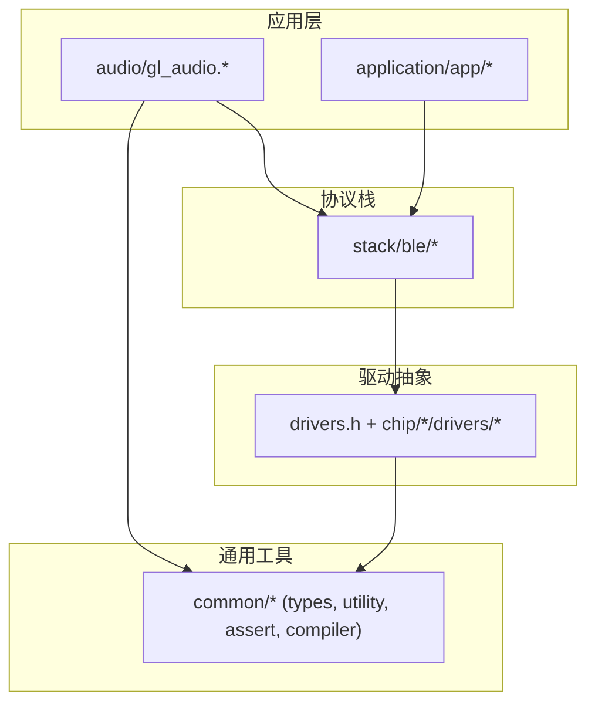
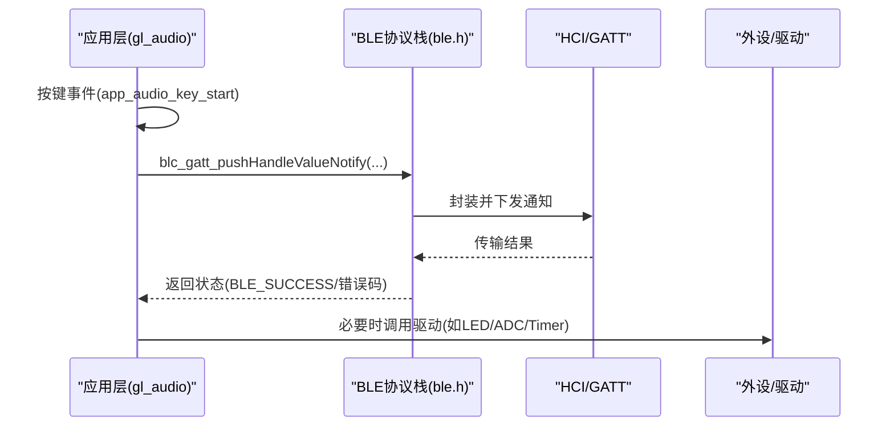
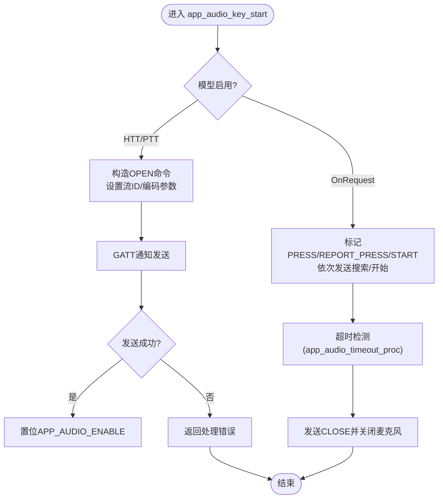
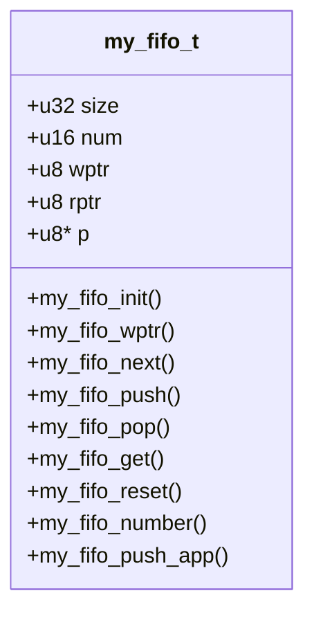
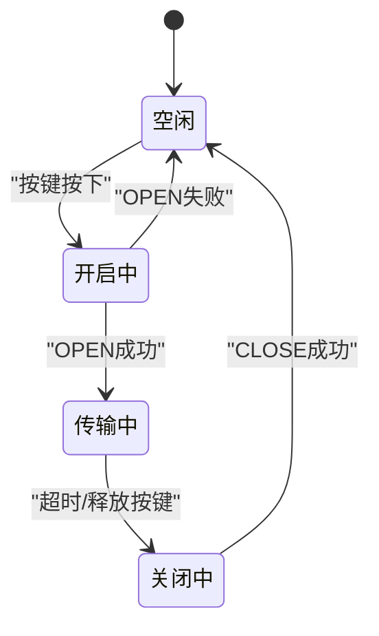
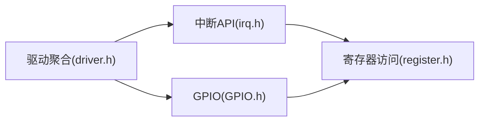
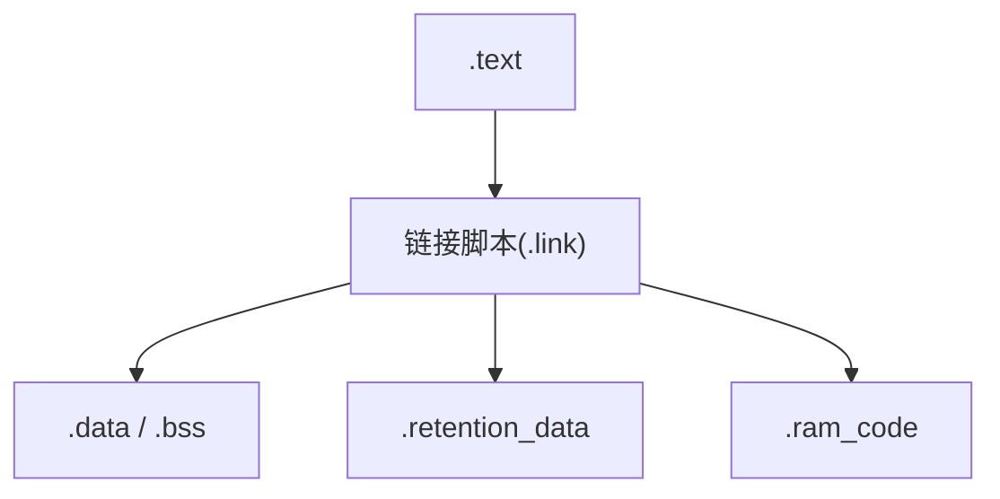
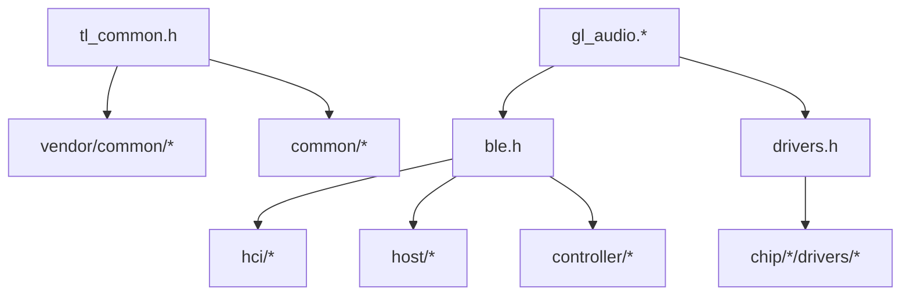

# 编程规范与架构

<cite>
**本文引用的文件**
- [README.md](file://README.md)
- [telink_b85m_triple_mode_audio_mouse_sdk_Release_Note .md](file://telink_b85m_triple_mode_audio_mouse_sdk_Release_Note .md)
- [tl_common.h](file://tc_ble_single_sdk/tl_common.h)
- [config.h](file://tc_ble_single_sdk/config.h)
- [drivers.h](file://tc_ble_single_sdk/drivers.h)
- [types.h](file://tc_ble_single_sdk/common/types.h)
- [compiler.h](file://tc_ble_single_sdk/common/compiler.h)
- [utility.h](file://tc_ble_single_sdk/common/utility.h)
- [assert.h](file://tc_ble_single_sdk/common/assert.h)
- [gl_audio.h](file://tc_ble_single_sdk/application/audio/gl_audio.h)
- [gl_audio.c](file://tc_ble_single_sdk/application/audio/gl_audio.c)
- [ble.h](file://tc_ble_single_sdk/stack/ble/ble.h)
- [driver.h](file://8373_dongle_for_km/chip/B80/drivers/driver.h)
- [gpio.h](file://8373_dongle_for_km/chip/B80/drivers/gpio.h)
- [irq.h](file://8373_dongle_for_km/chip/B80/drivers/irq.h)
- [boot_B85_dual_mouse.link](file://doc/boot_B85_dual_mouse.link)
</cite>

## 目录
1. [简介](#简介)
2. [项目结构](#项目结构)
3. [核心组件](#核心组件)
4. [架构总览](#架构总览)
5. [详细组件分析](#详细组件分析)
6. [依赖关系分析](#依赖关系分析)
7. [性能考虑](#性能考虑)
8. [故障排查指南](#故障排查指南)
9. [结论](#结论)
10. [附录](#附录)

## 简介
本指导文档面向嵌入式C语言开发，结合Telink SDK的实际代码结构，系统阐述编程规范、模块化设计、接口定义、数据结构设计模式、状态机实现、事件驱动与消息传递机制、内存与资源管理、错误处理策略，以及注释、版本控制与代码审查实践。目标是提升可维护性、可读性与可扩展性，确保在BLE音频鼠标（三模：USB/BLE/2.4G）场景下稳定高效地交付固件。

## 项目结构
该SDK采用分层组织：应用层（application）、协议栈（stack/ble）、通用工具（common）、驱动抽象（drivers），以及芯片相关驱动（chip/*/drivers）。顶层入口通过统一头文件聚合各模块，便于跨平台编译与配置裁剪。

图表来源
- [tl_common.h:24-53](file://tc_ble_single_sdk/tl_common.h#L24-L53)
- [drivers.h:24-31](file://tc_ble_single_sdk/drivers.h#L24-L31)
- [driver.h:24-70](file://8373_dongle_for_km/chip/B80/drivers/driver.h#L24-L70)

章节来源
- [tl_common.h:24-53](file://tc_ble_single_sdk/tl_common.h#L24-L53)
- [drivers.h:24-31](file://tc_ble_single_sdk/drivers.h#L24-L31)
- [driver.h:24-70](file://8373_dongle_for_km/chip/B80/drivers/driver.h#L24-L70)

## 核心组件
- 类型与常量：统一整型、布尔、成功/失败码等，保证跨模块一致。
- 编译器特性：段属性、内联、保留数据段等，支撑低功耗与实时路径。
- 工具库：FIFO、位操作、字节序转换、边界检查宏等。
- 断言与调试：条件编译的断言、TODO/WARN/NOTE提示。
- 音频子系统：Google语音协议适配、按键事件、超时处理、GATT通知。
- BLE协议栈：控制器/主机/HCI/GATT/OTA/HID等服务。
- 驱动抽象：GPIO、中断、时钟、定时器、I2C/SPI/UART、Flash、DMA等。

章节来源
- [types.h:27-99](file://tc_ble_single_sdk/common/types.h#L27-L99)
- [compiler.h:27-62](file://tc_ble_single_sdk/common/compiler.h#L27-L62)
- [utility.h:166-183](file://tc_ble_single_sdk/common/utility.h#L166-L183)
- [assert.h:29-39](file://tc_ble_single_sdk/common/assert.h#L29-L39)
- [gl_audio.h:24-154](file://tc_ble_single_sdk/application/audio/gl_audio.h#L24-L154)
- [gl_audio.c:24-58](file://tc_ble_single_sdk/application/audio/gl_audio.c#L24-L58)
- [ble.h:24-53](file://tc_ble_single_sdk/stack/ble/ble.h#L24-L53)
- [driver.h:24-70](file://8373_dongle_for_km/chip/B80/drivers/driver.h#L24-L70)

## 架构总览
整体采用“应用-协议栈-驱动”三层架构，配合事件驱动与消息队列（FIFO）解耦。音频流程以按键触发为事件源，经状态机驱动GATT通知发送；底层由BLE主机/控制器完成链路管理与传输。

图表来源
- [gl_audio.c:60-181](file://tc_ble_single_sdk/application/audio/gl_audio.c#L60-L181)
- [ble.h:24-53](file://tc_ble_single_sdk/stack/ble/ble.h#L24-L53)

## 详细组件分析

### 音频子系统（Google语音适配）
- 职责：处理语音键按下/释放、HTT/PTT/OnRequest三种交互模型，维护流ID与同步序列，按协议发送控制命令与数据。
- 关键接口：app_audio_key_start、google_handle_init、app_audio_timeout_proc。
- 状态与标志：使用位域标志表示按键状态、等待ACK、是否BLE连接、是否需要同步等。
- 超时处理：基于系统时钟检测传输超时，主动关闭麦克风并上报关闭原因。

图表来源
- [gl_audio.c:60-181](file://tc_ble_single_sdk/application/audio/gl_audio.c#L60-L181)
- [gl_audio.c:185-200](file://tc_ble_single_sdk/application/audio/gl_audio.c#L185-L200)
- [gl_audio.h:51-72](file://tc_ble_single_sdk/application/audio/gl_audio.h#L51-L72)

章节来源
- [gl_audio.h:24-154](file://tc_ble_single_sdk/application/audio/gl_audio.h#L24-L154)
- [gl_audio.c:24-200](file://tc_ble_single_sdk/application/audio/gl_audio.c#L24-L200)

### 事件驱动与消息传递（FIFO）
- FIFO结构：my_fifo_t包含大小、槽数、读写指针与缓冲区，提供push/pop/get/reset等操作。
- 用途：缓冲音频或应用数据，避免阻塞主循环；支持带命令字的应用级入队。
- 对齐与DMA：提供ATT对齐宏，便于DMA传输。

图表来源
- [utility.h:166-183](file://tc_ble_single_sdk/common/utility.h#L166-L183)

章节来源
- [utility.h:166-183](file://tc_ble_single_sdk/common/utility.h#L166-L183)

### 状态机与BLE连接管理
- 状态机体现：音频子系统的按键标志位、等待ACK计时器、流ID自增、超时关闭等构成轻量状态机。
- BLE状态：协议栈定义了LL/L2CAP/SMP/ATT/GATT/GAP等错误码，用于上层判断与恢复。

图表来源
- [gl_audio.c:60-181](file://tc_ble_single_sdk/application/audio/gl_audio.c#L60-L181)
- [ble_common.h:109-160](file://tc_ble_single_sdk/stack/ble/ble_common.h#L109-L160)

章节来源
- [gl_audio.c:60-181](file://tc_ble_single_sdk/application/audio/gl_audio.c#L60-L181)
- [ble_common.h:109-160](file://tc_ble_single_sdk/stack/ble/ble_common.h#L109-L160)

### 驱动与中断
- GPIO：端口分组与复用功能枚举，明确各引脚可用功能与限制。
- 中断：统一的IRQ开关、掩码设置、源获取与清除；RF专用中断屏蔽与状态读取。
- 驱动聚合：driver.h集中引入各类驱动头，形成统一接入点。

图表来源
- [irq.h:28-168](file://8373_dongle_for_km/chip/B80/drivers/irq.h#L28-L168)
- [gpio.h:87-200](file://8373_dongle_for_km/chip/B80/drivers/gpio.h#L87-L200)
- [driver.h:24-70](file://8373_dongle_for_km/chip/B80/drivers/driver.h#L24-L70)

章节来源
- [irq.h:28-168](file://8373_dongle_for_km/chip/B80/drivers/irq.h#L28-L168)
- [gpio.h:87-200](file://8373_dongle_for_km/chip/B80/drivers/gpio.h#L87-L200)
- [driver.h:24-70](file://8373_dongle_for_km/chip/B80/drivers/driver.h#L24-L70)

### 内存布局与资源分配
- 段属性：.retention_data、.data_no_init、.ram_code等用于低功耗保持与快速执行路径。
- 链接脚本：定义.data/.bss/.retention_data等段的起始与对齐，导出符号供启动代码初始化。
- 建议：将频繁访问且需保持的数据放入.retention_data；热路径代码放入.ram_code；无需初始化的静态数据放入.data_no_init以减少启动开销。

图表来源
- [boot_B85_dual_mouse.link:100-138](file://doc/boot_B85_dual_mouse.link#L100-L138)
- [compiler.h:27-62](file://tc_ble_single_sdk/common/compiler.h#L27-L62)

章节来源
- [boot_B85_dual_mouse.link:100-138](file://doc/boot_B85_dual_mouse.link#L100-L138)
- [compiler.h:27-62](file://tc_ble_single_sdk/common/compiler.h#L27-L62)

## 依赖关系分析
- 顶层聚合：tl_common.h聚合common、vendor公共模块与应用基础能力；drivers.h聚合驱动与扩展驱动。
- 协议栈：ble.h聚合controller/host/hci/service等子模块，向上提供统一接口。
- 应用依赖：gl_audio依赖BLE GATT能力与驱动（LED/ADC/Timer等）。

图表来源
- [tl_common.h:24-53](file://tc_ble_single_sdk/tl_common.h#L24-L53)
- [drivers.h:24-31](file://tc_ble_single_sdk/drivers.h#L24-L31)
- [ble.h:24-53](file://tc_ble_single_sdk/stack/ble/ble.h#L24-L53)

章节来源
- [tl_common.h:24-53](file://tc_ble_single_sdk/tl_common.h#L24-L53)
- [drivers.h:24-31](file://tc_ble_single_sdk/drivers.h#L24-L31)
- [ble.h:24-53](file://tc_ble_single_sdk/stack/ble/ble.h#L24-L53)

## 性能考虑
- 实时路径：将关键函数标记为always_inline并置于.ram_code段，减少中断延迟。
- 内存对齐：使用ALIGN宏与DMA友好对齐，降低总线开销。
- 批量传输：利用BLE MTU与多包能力，合理分片音频数据，避免频繁小包。
- 低功耗：合理使用.retention_data保存关键状态，减少唤醒成本；及时关闭未用外设输出。

[本节为通用指导，不直接分析具体文件]

## 故障排查指南
- 断言与调试：在DEBUG模式下启用assert，定位非法状态；使用TODO/WARN/NOTE辅助追踪未完成项与潜在问题。
- 错误码体系：依据BLE协议栈的错误码分类（LL/L2CAP/SMP/ATT/GATT/GAP）进行归因与恢复。
- 超时与重试：音频流程中设置超时阈值，超时后主动关闭并上报原因；对GATT通知失败进行重试或降级。
- 日志与打印：通过统一printf/u_printf接口输出关键路径信息，便于定位问题。

章节来源
- [assert.h:29-83](file://tc_ble_single_sdk/common/assert.h#L29-L83)
- [ble_common.h:109-160](file://tc_ble_single_sdk/stack/ble/ble_common.h#L109-L160)
- [gl_audio.c:185-200](file://tc_ble_single_sdk/application/audio/gl_audio.c#L185-L200)

## 结论
本规范以Telink SDK为基础，明确了嵌入式C的命名、接口、数据结构、状态机、事件驱动与消息传递、内存与资源管理、错误处理及调试方法。遵循这些原则可显著提升代码的可维护性、可读性与可扩展性，保障三模音频鼠标的稳定性与性能。

[本节为总结性内容，不直接分析具体文件]

## 附录

### 编程规范要点（基于仓库实际约定）
- 变量命名：使用小写下划线分隔（如app_audio_timer、g_stream_id），全局变量前缀区分作用域。
- 函数设计：单一职责，输入输出清晰；返回值使用统一状态码（SUCCESS/FAILURE或BLE_SUCCESS）。
- 注释格式：文件头包含版权与许可证信息；关键逻辑行内注释说明意图与约束。
- 模块化：按功能划分目录（application/audio、stack/ble、drivers），通过统一头文件聚合。
- 接口定义：对外暴露最小必要接口，内部细节隐藏于模块内；使用枚举与位域表达状态与选项。
- 数据结构：优先使用紧凑结构与对齐宏；FIFO作为通用消息缓冲。
- 状态机：以标志位+计时器实现轻量状态机，避免复杂跳转；所有状态迁移有明确触发与保护。
- 事件驱动：按键/定时器/中断作为事件源，回调中仅做最小处理，重任务入队异步处理。
- 消息传递：通过FIFO解耦生产与消费；注意容量与背压，防止溢出。
- 内存管理：严格区分.data/.bss/.retention_data/.data_no_init；避免动态分配，使用静态缓冲。
- 资源分配：外设使用前检查占用，使用后释放；中断服务程序尽量短小。
- 错误处理：统一错误码；关键路径增加断言与日志；失败时回滚到安全状态。
- 调试与发布：DEBUG宏控制断言与日志；发布构建关闭冗余输出。
- 版本控制：遵循Release Note记录变更；语义化版本号；提交信息描述影响范围。
- 代码审查：关注接口契约、错误分支、内存与功耗、并发与中断安全。

章节来源
- [gl_audio.c:24-200](file://tc_ble_single_sdk/application/audio/gl_audio.c#L24-L200)
- [utility.h:166-183](file://tc_ble_single_sdk/common/utility.h#L166-L183)
- [compiler.h:27-62](file://tc_ble_single_sdk/common/compiler.h#L27-L62)
- [assert.h:29-83](file://tc_ble_single_sdk/common/assert.h#L29-L83)
- [README.md:1-231](file://README.md#L1-L231)
- [telink_b85m_triple_mode_audio_mouse_sdk_Release_Note .md:1-217](file://telink_b85m_triple_mode_audio_mouse_sdk_Release_Note .md#L1-L217)