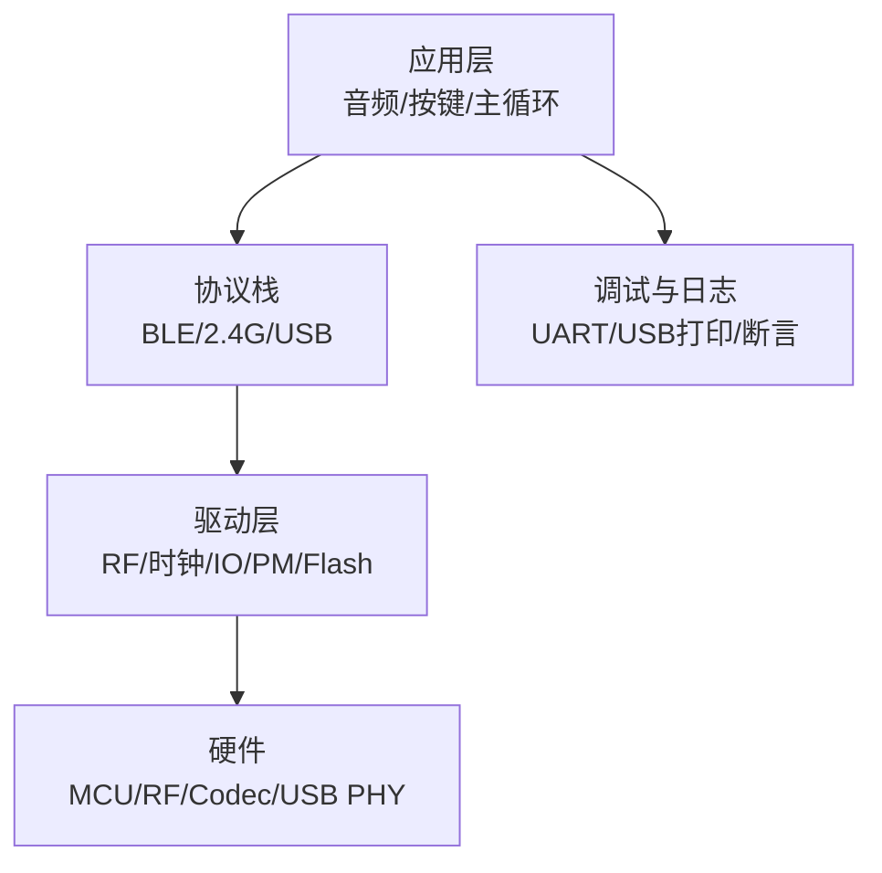
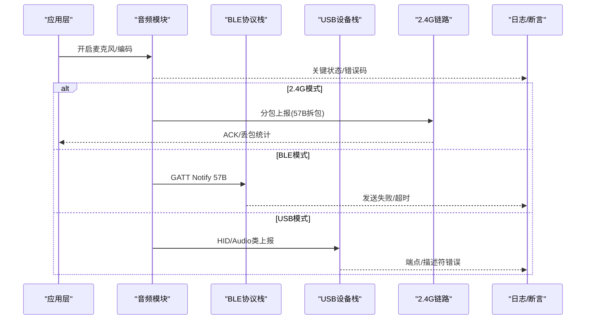
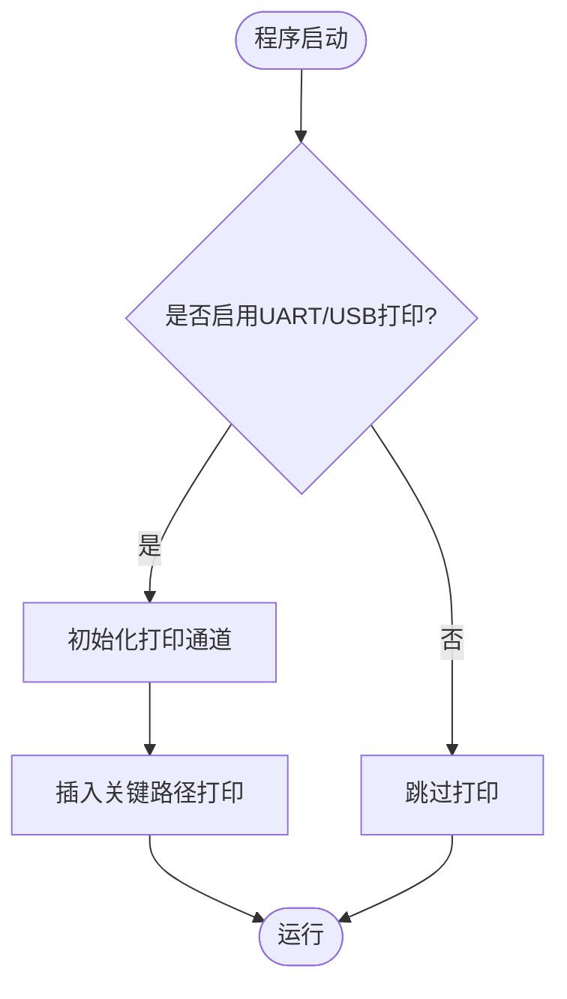
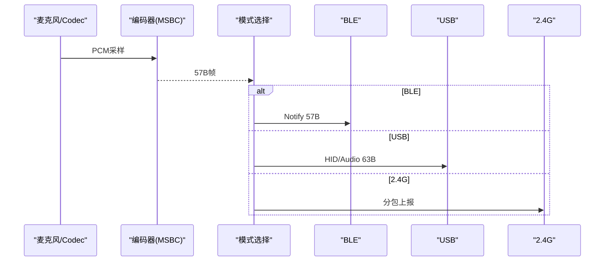
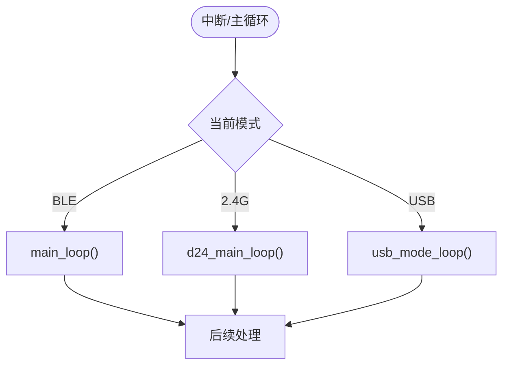
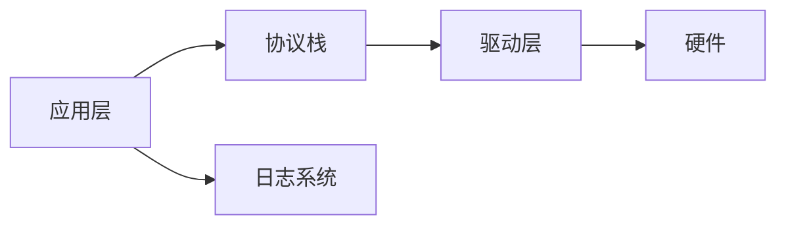

# 调试与故障排除

<cite>
**本文引用的文件**
- [AAA_main.c](file://tc_ble_single_sdk/vendor/827x_three_mode_mouse/AAA_main.c)
- [putchar.c](file://tc_ble_single_sdk/application/print/putchar.c)
- [u_printf.h](file://tc_ble_single_sdk/application/print/u_printf.h)
- [assert.h](file://tc_ble_single_sdk/common/assert.h)
- [tl_audio.c](file://tc_ble_single_sdk/application/audio/tl_audio.c)
- [gl_audio.c](file://tc_ble_single_sdk/application/audio/gl_audio.c)
- [audio_config.h](file://tc_ble_single_sdk/application/audio/audio_config.h)
- [usb.c](file://tc_ble_single_sdk/application/usbstd/usb.c)
- [usbaud.c](file://tc_ble_single_sdk/application/app/usbaud.c)
- [rf_drv.h](file://tc_ble_single_sdk/drivers/B85/lib/include/rf_drv.h)
- [SDK_Wiki.md](file://doc/SDK_Wiki.md)
- [printf.h](file://8373_dongle_for_km/chip/B80/drivers/printf.h)
</cite>

## 目录
1. [简介](#简介)
2. [项目结构](#项目结构)
3. [核心组件](#核心组件)
4. [架构总览](#架构总览)
5. [详细组件分析](#详细组件分析)
6. [依赖关系分析](#依赖关系分析)
7. [性能考虑](#性能考虑)
8. [故障排除指南](#故障排除指南)
9. [结论](#结论)
10. [附录](#附录)

## 简介
本指南面向三模音频鼠标（BLE/2.4G/USB）的调试与故障排除，覆盖JTAG/SWD调试器配置、断点设置、变量监视与内存查看；日志系统使用（UART/USB打印、断言输出）；常见硬件问题诊断与软件Bug定位技巧；性能分析、功耗测量与信号完整性测试实践；以及自动化测试、回归测试与质量保证流程，重点聚焦三模连接切换与音频处理链路。

## 项目结构
- 应用层：音频采集与编码（MSBC/ADPCM/SBC）、BLE GATT/USB HID/Audio类设备、按键与状态机、主循环与中断分发。
- 驱动层：时钟、GPIO、定时器、DMA、RF驱动、Flash保护、PM低功耗、ADC等。
- 协议栈：BLE主机/控制器、2.4G私有链路、USB设备栈。
- 工具链与工程：Telink IoT Studio + TC32 GCC，支持多芯片（B85/B87/B80）。

**章节来源**
- [SDK_Wiki.md:10-20](file://doc/SDK_Wiki.md#L10-L20)

## 核心组件
- 音频采集与编码：MSBC每帧57字节，按模式分包上报（2.4G/HID/GATT/USB）。
- 三模切换：BLE/2.4G/USB三种工作模式在主循环中分发处理，支持运行时切换。
- 日志系统：UART GPIO模拟或USB CDC/USB HID打印，编译期宏控制开关。
- 断言与错误追踪：开发构建启用断言输出，便于快速定位异常。
- Flash保护与OTA：在初始化与OTA事件前后自动解锁/锁定，避免误写。
- RF功率与EMI：提供功率档位枚举，支持EMI测试相关能力。

**章节来源**
- [SDK_Wiki.md:86-196](file://doc/SDK_Wiki.md#L86-L196)
- [AAA_main.c:335-558](file://tc_ble_single_sdk/vendor/827x_three_mode_mouse/AAA_main.c#L335-L558)
- [tl_audio.c:941-1011](file://tc_ble_single_sdk/application/audio/tl_audio.c#L941-L1011)
- [audio_config.h:74-122](file://tc_ble_single_sdk/application/audio/audio_config.h#L74-L122)
- [rf_drv.h:305-334](file://tc_ble_single_sdk/drivers/B85/lib/include/rf_drv.h#L305-L334)

## 架构总览
下图展示三模音频鼠标的整体数据流与调试切入点：

**图表来源**
- [AAA_main.c:482-551](file://tc_ble_single_sdk/vendor/827x_three_mode_mouse/AAA_main.c#L482-L551)
- [tl_audio.c:941-1011](file://tc_ble_single_sdk/application/audio/tl_audio.c#L941-L1011)
- [gl_audio.c:65-113](file://tc_ble_single_sdk/application/audio/gl_audio.c#L65-L113)
- [usb.c:506-554](file://tc_ble_single_sdk/application/usbstd/usb.c#L506-L554)

## 详细组件分析

### JTAG/SWD调试器配置与使用
- 目标：通过SWD/JTAG对B85/B87/B80进行在线调试，支持断点、单步、变量监视、内存查看。
- 建议步骤：
  - 连接调试器到目标板SWD引脚（CLK/DI/DO），确保供电与地线良好。
  - 在IDE中选择对应芯片与调试器，加载ELF并下载固件。
  - 设置断点于关键路径：主循环入口、音频任务、中断处理、协议栈回调。
  - 使用Watch窗口观察音频缓冲指针、状态标志、连接参数。
  - 使用Memory窗口检查USB端点缓冲区、RF FIFO、编解码输出。
  - 结合日志输出（见下一节）交叉验证执行路径。

[本节为通用调试指导，不直接分析具体文件]

### 日志系统与错误追踪
- UART打印：可通过GPIO模拟UART输出，支持不同系统时钟下的波特率补偿。
- USB打印：当USB已连接时优先走USB通道，否则回退到SWO/SWIRE。
- 断言：开发构建下启用断言，失败时输出文件与行号，便于定位。
- 使用要点：
  - 编译宏控制：UART_PRINT_DEBUG_ENABLE / USB_PRINT_DEBUG_ENABLE。
  - 关键位置插入打印：音频任务、协议栈回调、错误分支。
  - 注意高频打印对实时性的影响，必要时降低频率或使用环形缓冲。

**图表来源**
- [putchar.c:95-197](file://tc_ble_single_sdk/application/print/putchar.c#L95-L197)
- [u_printf.h:24-47](file://tc_ble_single_sdk/application/print/u_printf.h#L24-L47)
- [assert.h:24-39](file://tc_ble_single_sdk/common/assert.h#L24-L39)
- [printf.h:24-60](file://8373_dongle_for_km/chip/B80/drivers/printf.h#L24-L60)

**章节来源**
- [putchar.c:95-197](file://tc_ble_single_sdk/application/print/putchar.c#L95-L197)
- [u_printf.h:24-47](file://tc_ble_single_sdk/application/print/u_printf.h#L24-L47)
- [assert.h:24-39](file://tc_ble_single_sdk/common/assert.h#L24-L39)
- [printf.h:24-60](file://8373_dongle_for_km/chip/B80/drivers/printf.h#L24-L60)

### 音频处理调试（含三模切换）
- 采集与编码：AMIC输入→Codec/PGA→MSBC编码（57B/帧）。
- 上报策略：
  - 2.4G：分包（29B+28B）经私有命令上报，ACK确认。
  - BLE：GATT Notify 57B，MTU协商提升吞吐。
  - USB：HID/Audio类上报，报告率动态调整。
- 常见问题：
  - 卡顿/爆音：检查FIFO溢出、连接间隔、USB报告率。
  - 无声：检查DMIC/AMIC偏置、Codec使能、编码缓冲指针。
  - 切换异常：确认模式切换后各模块重新初始化。

**图表来源**
- [tl_audio.c:941-1011](file://tc_ble_single_sdk/application/audio/tl_audio.c#L941-L1011)
- [gl_audio.c:65-113](file://tc_ble_single_sdk/application/audio/gl_audio.c#L65-L113)
- [audio_config.h:74-122](file://tc_ble_single_sdk/application/audio/audio_config.h#L74-L122)
- [usb.c:506-554](file://tc_ble_single_sdk/application/usbstd/usb.c#L506-L554)

**章节来源**
- [tl_audio.c:941-1011](file://tc_ble_single_sdk/application/audio/tl_audio.c#L941-L1011)
- [gl_audio.c:65-113](file://tc_ble_single_sdk/application/audio/gl_audio.c#L65-L113)
- [audio_config.h:74-122](file://tc_ble_single_sdk/application/audio/audio_config.h#L74-L122)
- [usb.c:506-554](file://tc_ble_single_sdk/application/usbstd/usb.c#L506-L554)

### 三模连接切换与主循环
- 主循环根据当前模式分发到不同处理函数：BLE main_loop、2.4G d24_main_loop、USB usb_mode_loop。
- 中断处理根据模式路由到相应IRQ handler。
- 调试要点：
  - 在模式切换处设置断点，观察fun_mode变化。
  - 检查各模式的初始化顺序与资源释放。
  - 使用日志记录切换原因与耗时。

**图表来源**
- [AAA_main.c:59-75](file://tc_ble_single_sdk/vendor/827x_three_mode_mouse/AAA_main.c#L59-L75)
- [AAA_main.c:530-558](file://tc_ble_single_sdk/vendor/827x_three_mode_mouse/AAA_main.c#L530-L558)

**章节来源**
- [AAA_main.c:59-75](file://tc_ble_single_sdk/vendor/827x_three_mode_mouse/AAA_main.c#L59-L75)
- [AAA_main.c:530-558](file://tc_ble_single_sdk/vendor/827x_three_mode_mouse/AAA_main.c#L530-L558)

### 性能分析与功耗测量
- 性能分析：
  - 使用CPU周期计数器或外部逻辑分析仪抓取关键路径时序。
  - 关注音频任务调度、协议栈回调、USB端点传输耗时。
- 功耗测量：
  - 进入深度睡眠/保持睡眠，测量平均电流。
  - 对比开麦/关麦、不同模式下的功耗差异。
- 信号完整性：
  - 用示波器检查USB DP/DM、RF天线匹配、电源纹波。
  - 进行EMI测试（SDK支持相关功能）。

[本节为通用指导，不直接分析具体文件]

### 自动化测试、回归测试与质量保证
- 自动化测试：
  - 脚本化三模切换、音频开/关、连接断开/重连场景。
  - 采集日志与指标（丢包率、延迟、功耗）。
- 回归测试：
  - 每次版本更新执行基线用例，对比结果。
  - 重点覆盖音频质量、稳定性、兼容性。
- 质量保证：
  - 代码审查、静态分析、覆盖率统计。
  - 压力测试（长时间运行、高负载）。

[本节为通用指导，不直接分析具体文件]

## 依赖关系分析
- 应用层依赖协议栈与驱动层提供的接口。
- 音频模块依赖驱动层的ADC/Codec、DMA、定时器。
- 日志系统依赖UART/USB驱动与GPIO模拟。
- 三模切换依赖RF驱动与USB设备栈。

**图表来源**
- [AAA_main.c:335-558](file://tc_ble_single_sdk/vendor/827x_three_mode_mouse/AAA_main.c#L335-L558)
- [tl_audio.c:941-1011](file://tc_ble_single_sdk/application/audio/tl_audio.c#L941-L1011)
- [putchar.c:95-197](file://tc_ble_single_sdk/application/print/putchar.c#L95-L197)

**章节来源**
- [AAA_main.c:335-558](file://tc_ble_single_sdk/vendor/827x_three_mode_mouse/AAA_main.c#L335-L558)
- [tl_audio.c:941-1011](file://tc_ble_single_sdk/application/audio/tl_audio.c#L941-L1011)
- [putchar.c:95-197](file://tc_ble_single_sdk/application/print/putchar.c#L95-L197)

## 性能考虑
- 音频任务优先级与时序：确保编码与上报不阻塞主循环。
- 协议栈优化：合理设置连接间隔、MTU、批量通知。
- 内存管理：避免频繁分配，使用环形缓冲与预分配。
- 功耗优化：在非活跃时段进入低功耗模式，关闭未使用外设。

[本节为通用指导，不直接分析具体文件]

## 故障排除指南
- 常见问题与定位：
  - 无声/杂音：检查AMIC偏置、Codec使能、编码缓冲指针、USB报告率。
  - 卡顿/断连：检查FIFO溢出、连接间隔、蓝牙配对状态。
  - 模式切换失败：检查初始化顺序、资源释放、中断处理。
- 调试技巧：
  - 使用断点与日志交叉验证。
  - 监控关键变量（缓冲指针、状态标志、连接参数）。
  - 使用逻辑分析仪抓取USB/RF信号。
- 硬件问题：
  - 电源噪声导致复位：检查去耦电容与电源轨。
  - RF干扰：检查天线匹配与屏蔽。
  - USB通信异常：检查DP/DM阻抗与上拉电阻。

**章节来源**
- [tl_audio.c:941-1011](file://tc_ble_single_sdk/application/audio/tl_audio.c#L941-L1011)
- [gl_audio.c:65-113](file://tc_ble_single_sdk/application/audio/gl_audio.c#L65-L113)
- [usb.c:506-554](file://tc_ble_single_sdk/application/usbstd/usb.c#L506-L554)
- [AAA_main.c:530-558](file://tc_ble_single_sdk/vendor/827x_three_mode_mouse/AAA_main.c#L530-L558)

## 结论
本指南提供了三模音频鼠标的调试与故障排除方法，涵盖JTAG/SWD调试、日志系统、音频处理、三模切换、性能与功耗分析、信号完整性测试以及自动化测试流程。通过系统化调试与测试，可有效提升产品稳定性与用户体验。

[本节为总结性内容，不直接分析具体文件]

## 附录
- 参考文档：SDK Wiki、发布说明、用户配置。
- 常用宏与配置：音频模式、打印开关、Flash保护、EMI测试。
- 工具链与IDE：Telink IoT Studio、TC32 GCC、调试器配置。

[本节为补充信息，不直接分析具体文件]