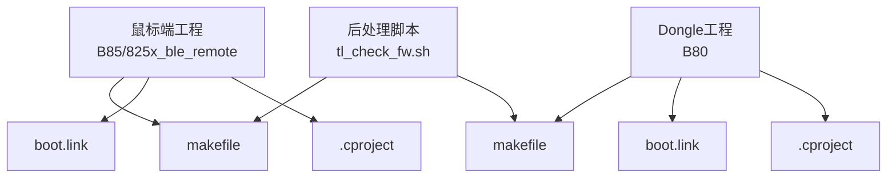
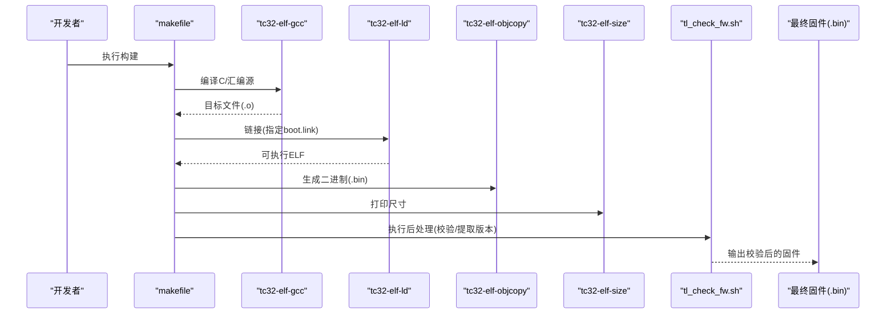
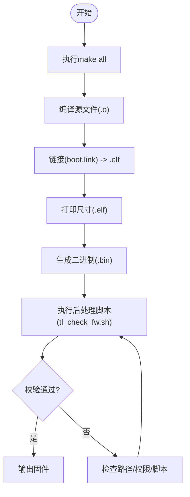
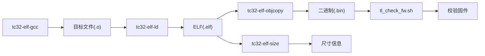

# 开发环境配置

<cite>
**本文引用的文件**
- [README.md](file://README.md)
- [telink_b85m_triple_mode_audio_mouse_sdk_Release_Note .md](file://telink_b85m_triple_mode_audio_mouse_sdk_Release_Note .md)
- [tc_ble_single_sdk/project/tlsr_tc32/B85/825x_ble_remote/makefile](file://tc_ble_single_sdk/project/tlsr_tc32/B85/825x_ble_remote/makefile)
- [tc_ble_single_sdk/project/tlsr_tc32/B87/827x_master_kma_dongle/makefile](file://tc_ble_single_sdk/project/tlsr_tc32/B87/827x_master_kma_dongle/makefile)
- [tc_ble_single_sdk/script/tl_check_fw/tl_check_fw.sh](file://tc_ble_single_sdk/script/tl_check_fw/tl_check_fw.sh)
- [tc_ble_single_sdk/project/tlsr_tc32/B85/boot.link](file://tc_ble_single_sdk/project/tlsr_tc32/B85/boot.link)
- [doc/boot_B85_dual_mouse.link](file://doc/boot_B85_dual_mouse.link)
- [8373_dongle_for_km/project/tlsr_tc32/B80/.cproject](file://8373_dongle_for_km/project/tlsr_tc32/B80/.cproject)
- [tc_ble_single_sdk/project/tlsr_tc32/tc321x/.cproject](file://tc_ble_single_sdk/project/tlsr_tc32/tc321x/.cproject)
</cite>

## 目录
1. [简介](#简介)
2. [项目结构](#项目结构)
3. [核心组件](#核心组件)
4. [架构总览](#架构总览)
5. [详细组件分析](#详细组件分析)
6. [依赖关系分析](#依赖关系分析)
7. [性能考虑](#性能考虑)
8. [故障排查指南](#故障排查指南)
9. [结论](#结论)
10. [附录](#附录)

## 简介
本指南面向Telink B85M三模音频鼠标SDK（V0.2.6）的开发环境搭建与配置，覆盖TC32工具链安装、IDE（Telink IoT Studio/Eclipse CDT）配置、构建系统（makefile与链接脚本）说明，以及Windows/Linux/macOS平台下的环境设置要点。同时提供常见问题定位思路与性能优化建议，帮助开发者快速完成从工具链到编译、烧录的完整流程。

## 项目结构
该SDK包含鼠标端（B85/TLSR825X）与接收端（B80/TLSR8373）两套工程，分别位于：
- tc_ble_single_sdk/project/tlsr_tc32/B85/...（鼠标端）
- tc_ble_single_sdk/project/tlsr_tc32/B87/...（兼容B87的工程示例）
- 8373_dongle_for_km/project/tlsr_tc32/B80/...（B80 Dongle工程）

每个工程目录下均包含：
- makefile：定义编译目标、源文件集合、工具链调用与后处理脚本
- boot.link：链接脚本，定义ROM/RAM布局、保留区、版本信息段等
- .cproject：Eclipse/Telink IoT Studio工程配置，含编译器选项、包含路径、宏定义等
- script：后处理脚本（如固件校验、bin生成）

图表来源
- [tc_ble_single_sdk/project/tlsr_tc32/B85/825x_ble_remote/makefile:1-83](file://tc_ble_single_sdk/project/tlsr_tc32/B85/825x_ble_remote/makefile#L1-L83)
- [tc_ble_single_sdk/project/tlsr_tc32/B87/827x_master_kma_dongle/makefile:1-83](file://tc_ble_single_sdk/project/tlsr_tc32/B87/827x_master_kma_dongle/makefile#L1-L83)
- [tc_ble_single_sdk/script/tl_check_fw/tl_check_fw.sh:1-32](file://tc_ble_single_sdk/script/tl_check_fw/tl_check_fw.sh#L1-L32)
- [tc_ble_single_sdk/project/tlsr_tc32/B85/boot.link:1-131](file://tc_ble_single_sdk/project/tlsr_tc32/B85/boot.link#L1-L131)
- [8373_dongle_for_km/project/tlsr_tc32/B80/.cproject:35-45](file://8373_dongle_for_km/project/tlsr_tc32/B80/.cproject#L35-L45)

章节来源
- [README.md:1-231](file://README.md#L1-L231)
- [telink_b85m_triple_mode_audio_mouse_sdk_Release_Note .md:1-217](file://telink_b85m_triple_mode_audio_mouse_sdk_Release_Note .md#L1-L217)

## 核心组件
- 工具链：TC32 ELF GCC4.3（tc32-elf-gcc / tc32-elf-ld / tc32-elf-size / tc32-elf-objcopy / tc32-elf-objdump），由Telink IoT Studio集成或独立安装。
- IDE：Telink IoT Studio（基于Eclipse CDT），工程配置通过.cproject管理；也可使用原生make+命令行工具链。
- 构建系统：各工程根makefile负责组装源文件、调用工具链、执行post-build脚本生成.bin并校验。
- 链接脚本：boot.link定义启动入口、向量表、RAM/ROM布局、保留区、版本信息段等。
- 后处理脚本：tl_check_fw.sh在Linux下调用check_fw二进制进行固件校验，在Windows下调用对应exe。

章节来源
- [telink_b85m_triple_mode_audio_mouse_sdk_Release_Note .md:14-16](file://telink_b85m_triple_mode_audio_mouse_sdk_Release_Note .md#L14-L16)
- [tc_ble_single_sdk/project/tlsr_tc32/B85/825x_ble_remote/makefile:41-75](file://tc_ble_single_sdk/project/tlsr_tc32/B85/825x_ble_remote/makefile#L41-L75)
- [tc_ble_single_sdk/script/tl_check_fw/tl_check_fw.sh:1-32](file://tc_ble_single_sdk/script/tl_check_fw/tl_check_fw.sh#L1-L32)
- [tc_ble_single_sdk/project/tlsr_tc32/B85/boot.link:24-131](file://tc_ble_single_sdk/project/tlsr_tc32/B85/boot.link#L24-L131)

## 架构总览
下图展示了从源码到可烧录固件的构建流程，包括编译、链接、生成列表/尺寸信息、生成bin及后处理校验。

图表来源
- [tc_ble_single_sdk/project/tlsr_tc32/B85/825x_ble_remote/makefile:41-75](file://tc_ble_single_sdk/project/tlsr_tc32/B85/825x_ble_remote/makefile#L41-L75)
- [tc_ble_single_sdk/script/tl_check_fw/tl_check_fw.sh:11-22](file://tc_ble_single_sdk/script/tl_check_fw/tl_check_fw.sh#L11-L22)

## 详细组件分析

### 工具链安装与环境变量
- 工具链名称：tc32-elf-*（gcc/ld/size/objcopy/objdump）
- 推荐方式：安装Telink IoT Studio，其内置TC32工具链；或在系统中安装独立工具链并将bin目录加入PATH。
- 验证方法：在终端执行tc32-elf-gcc --version，确认版本为GCC4.3系列。

章节来源
- [telink_b85m_triple_mode_audio_mouse_sdk_Release_Note .md:14-16](file://telink_b85m_triple_mode_audio_mouse_sdk_Release_Note .md#L14-L16)

### IDE配置（Telink IoT Studio / Eclipse CDT）
- 工程导入：打开工程目录中的.cproject，IDE将自动识别TC32工具链与编译选项。
- 关键编译选项（来自.cproject）：
  - 优化级别：通常为Level 2
  - 调试信息：Release默认关闭，Debug按需开启
  - 包含路径：指向common、drivers、vendor等目录
  - 预定义宏：如CHIP_TYPE、MCU_CORE_*、项目特定宏
- 多芯片支持：不同芯片（B80/B85/B87/TC321X）通过.cproject中的宏与包含路径区分。

章节来源
- [8373_dongle_for_km/project/tlsr_tc32/B80/.cproject:35-45](file://8373_dongle_for_km/project/tlsr_tc32/B80/.cproject#L35-L45)
- [tc_ble_single_sdk/project/tlsr_tc32/tc321x/.cproject:30-40](file://tc_ble_single_sdk/project/tlsr_tc32/tc321x/.cproject#L30-L40)
- [tc_ble_single_sdk/project/tlsr_tc32/tc321x/.cproject:200-210](file://tc_ble_single_sdk/project/tlsr_tc32/tc321x/.cproject#L200-L210)

### 构建系统与编译选项
- makefile职责：
  - 引入sources.mk与subdir.mk聚合源文件
  - 调用tc32-elf-ld链接，指定boot.link
  - 生成.lst、.bin，打印尺寸，执行post-build脚本
- 典型目标：
  - all：构建ELF与次要输出
  - clean：清理中间产物
  - post-build：生成bin并执行校验脚本
- 链接脚本boot.link：
  - 定义入口__start
  - 分配.vectors、.text、.rodata、.data、.bss、.retention_data等段
  - 提供_retention_data_size_、_code_size_、_bin_size_等符号供运行时使用
  - 插入.sdk_version段以固化版本信息

图表来源
- [tc_ble_single_sdk/project/tlsr_tc32/B85/825x_ble_remote/makefile:38-75](file://tc_ble_single_sdk/project/tlsr_tc32/B85/825x_ble_remote/makefile#L38-L75)
- [tc_ble_single_sdk/script/tl_check_fw/tl_check_fw.sh:11-22](file://tc_ble_single_sdk/script/tl_check_fw/tl_check_fw.sh#L11-L22)
- [tc_ble_single_sdk/project/tlsr_tc32/B85/boot.link:24-131](file://tc_ble_single_sdk/project/tlsr_tc32/B85/boot.link#L24-L131)

章节来源
- [tc_ble_single_sdk/project/tlsr_tc32/B85/825x_ble_remote/makefile:1-83](file://tc_ble_single_sdk/project/tlsr_tc32/B85/825x_ble_remote/makefile#L1-L83)
- [tc_ble_single_sdk/project/tlsr_tc32/B87/827x_master_kma_dongle/makefile:1-83](file://tc_ble_single_sdk/project/tlsr_tc32/B87/827x_master_kma_dongle/makefile#L1-L83)
- [tc_ble_single_sdk/project/tlsr_tc32/B85/boot.link:1-131](file://tc_ble_single_sdk/project/tlsr_tc32/B85/boot.link#L1-L131)

### 不同操作系统的环境配置示例
- Windows
  - 安装Telink IoT Studio，确保工具链可用
  - 在IDE中打开工程，直接构建；或使用命令行make
  - 注意路径分隔符与脚本路径（makefile中可能包含绝对路径，需按实际安装位置调整）
- Linux
  - 安装tc32-elf工具链，或将Telink IoT Studio的工具链加入PATH
  - 赋予后处理脚本执行权限（chmod +x）
  - 运行make all构建
- macOS
  - 同Linux，确保工具链在PATH中，脚本具备执行权限
  - 若遇到路径问题，可在makefile.init或环境变量中修正

章节来源
- [tc_ble_single_sdk/script/tl_check_fw/tl_check_fw.sh:5-22](file://tc_ble_single_sdk/script/tl_check_fw/tl_check_fw.sh#L5-L22)
- [tc_ble_single_sdk/project/tlsr_tc32/B85/825x_ble_remote/makefile:41-75](file://tc_ble_single_sdk/project/tlsr_tc32/B85/825x_ble_remote/makefile#L41-L75)

### 调试器与烧录工具
- 调试器：Telink IoT Studio集成调试器，配合TC32工具链进行断点、单步、寄存器查看等
- 烧录工具：通常由IDE提供；也可使用SDK提供的脚本或第三方工具对生成的.bin进行烧录
- 注意事项：
  - 确保设备进入下载模式（依据硬件设计）
  - 校验固件完整性（post-build已执行校验）
  - 若使用外部烧录器，请遵循其文档配置端口与速率

章节来源
- [telink_b85m_triple_mode_audio_mouse_sdk_Release_Note .md:14-16](file://telink_b85m_triple_mode_audio_mouse_sdk_Release_Note .md#L14-L16)
- [tc_ble_single_sdk/script/tl_check_fw/tl_check_fw.sh:11-22](file://tc_ble_single_sdk/script/tl_check_fw/tl_check_fw.sh#L11-L22)

## 依赖关系分析
- 工具链依赖：tc32-elf-gcc/ld/size/objcopy/objdump必须可用
- 脚本依赖：tl_check_fw.sh依赖系统命令（uname/grep/sed）与平台特定的校验工具（Linux下check_fw，Windows下tl_check_fw2.exe）
- 工程依赖：makefile依赖sources.mk/subdir.mk/objects.mk聚合源与对象；boot.link决定内存布局

图表来源
- [tc_ble_single_sdk/project/tlsr_tc32/B85/825x_ble_remote/makefile:41-75](file://tc_ble_single_sdk/project/tlsr_tc32/B85/825x_ble_remote/makefile#L41-L75)
- [tc_ble_single_sdk/script/tl_check_fw/tl_check_fw.sh:11-22](file://tc_ble_single_sdk/script/tl_check_fw/tl_check_fw.sh#L11-L22)

章节来源
- [tc_ble_single_sdk/project/tlsr_tc32/B85/825x_ble_remote/makefile:1-83](file://tc_ble_single_sdk/project/tlsr_tc32/B85/825x_ble_remote/makefile#L1-L83)
- [tc_ble_single_sdk/script/tl_check_fw/tl_check_fw.sh:1-32](file://tc_ble_single_sdk/script/tl_check_fw/tl_check_fw.sh#L1-L32)

## 性能考虑
- 编译优化：.cproject中默认优化等级为Level 2，适合大多数场景；如需极致体积/速度可调整
- 代码分割：启用-ffunction-sections/-fdata-sections，结合--gc-sections减少未用代码
- 链接优化：合理划分.retention_data与.data段，避免不必要的保留区占用
- 运行时内存：关注.boot.link中的ASSERT限制，防止RAM溢出
- 构建缓存：保持干净的build目录，避免增量构建带来的不一致

章节来源
- [tc_ble_single_sdk/project/tlsr_tc32/tc321x/.cproject:30-40](file://tc_ble_single_sdk/project/tlsr_tc32/tc321x/.cproject#L30-L40)
- [tc_ble_single_sdk/project/tlsr_tc32/B85/boot.link:115-131](file://tc_ble_single_sdk/project/tlsr_tc32/B85/boot.link#L115-L131)

## 故障排查指南
- 工具链不可用
  - 现象：make报找不到tc32-elf-*命令
  - 解决：安装Telink IoT Studio或独立工具链，并将bin目录加入PATH
- 路径错误
  - 现象：makefile中绝对路径与实际安装位置不符
  - 解决：修改makefile或环境变量，使路径指向正确位置
- 脚本权限不足（Linux/macOS）
  - 现象：post-build阶段无法执行check_fw
  - 解决：chmod +x脚本，确保具有执行权限
- 固件校验失败
  - 现象：tl_check_fw.sh报错
  - 解决：检查.bin是否完整、校验工具是否存在、路径是否正确
- 链接错误或内存溢出
  - 现象：boot.link中的ASSERT触发
  - 解决：调整代码或配置，确保.retention_data与.data不越界

章节来源
- [tc_ble_single_sdk/script/tl_check_fw/tl_check_fw.sh:5-22](file://tc_ble_single_sdk/script/tl_check_fw/tl_check_fw.sh#L5-L22)
- [tc_ble_single_sdk/project/tlsr_tc32/B85/boot.link:115-131](file://tc_ble_single_sdk/project/tlsr_tc32/B85/boot.link#L115-L131)

## 结论
通过安装TC32工具链、配置Telink IoT Studio工程、理解makefile与boot.link的作用，并在Windows/Linux/macOS上正确设置环境与权限，即可顺利完成B85M三模音频鼠标SDK的编译与固件生成。遇到问题时，优先检查工具链可用性、路径与脚本权限，再根据日志定位具体环节。

## 附录
- 版本与平台信息参考：
  - SDK版本、BLE SDK版本、芯片与硬件版本、平台版本、工具链版本
- 代码体积参考：
  - 鼠标端与Dongle端的固件大小与SRAM占用

章节来源
- [telink_b85m_triple_mode_audio_mouse_sdk_Release_Note .md:4-16](file://telink_b85m_triple_mode_audio_mouse_sdk_Release_Note .md#L4-L16)
- [telink_b85m_triple_mode_audio_mouse_sdk_Release_Note .md:54-61](file://telink_b85m_triple_mode_audio_mouse_sdk_Release_Note .md#L54-L61)