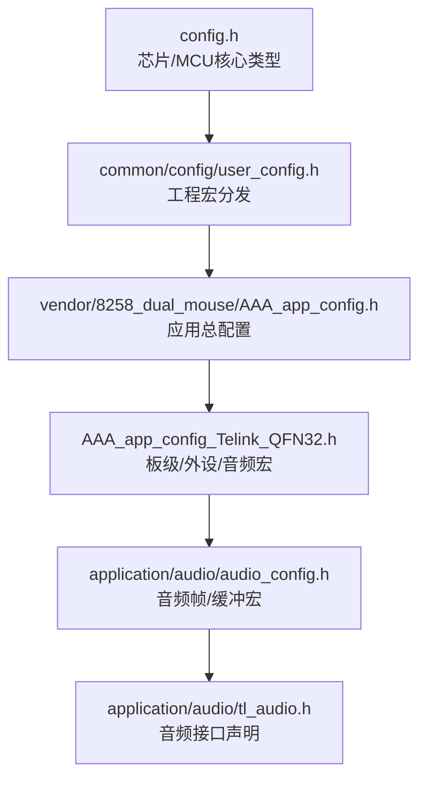
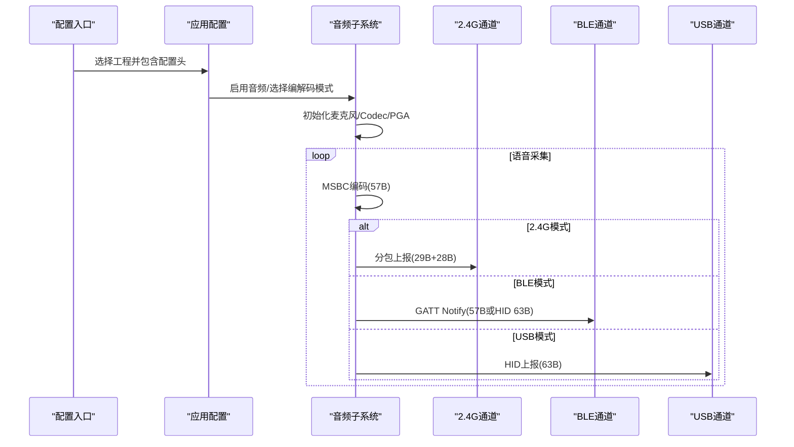

# 配置管理

<cite>
**本文引用的文件**
- [user_config.h](file://tc_ble_single_sdk/common/config/user_config.h)
- [audio_config.h](file://tc_ble_single_sdk/application/audio/audio_config.h)
- [config.h](file://tc_ble_single_sdk/config.h)
- [AAA_app_config.h](file://tc_ble_single_sdk/vendor/8258_dual_mouse/AAA_app_config.h)
- [AAA_app_config_Telink_QFN32.h](file://tc_ble_single_sdk/vendor/8258_dual_mouse/AAA_app_config_Telink_QFN32.h)
- [tl_audio.h](file://tc_ble_single_sdk/application/audio/tl_audio.h)
- [SDK_Wiki.md](file://doc/SDK_Wiki.md)
- [Release_Note.md](file://telink_b85m_triple_mode_audio_mouse_sdk_Release_Note .md)
</cite>

## 目录
1. [简介](#简介)
2. [项目结构](#项目结构)
3. [核心组件](#核心组件)
4. [架构总览](#架构总览)
5. [详细组件分析](#详细组件分析)
6. [依赖关系分析](#依赖关系分析)
7. [性能与资源考量](#性能与资源考量)
8. [故障排查指南](#故障排查指南)
9. [结论](#结论)
10. [附录：配置模板与迁移策略](#附录：配置模板与迁移策略)

## 简介
本操作指南面向三模（2.4G/BLE/USB）音频鼠标的配置管理，聚焦用户配置文件的结构与自定义选项、三模连接参数、音频参数设置与硬件资源分配规则，并提供不同应用场景下的推荐配置。同时说明配置参数的验证机制、默认值设定原则、运行时修改、持久化与备份恢复流程，以及版本管理与迁移策略。

## 项目结构
该 SDK 将“平台/芯片通用配置”、“应用层配置”和“音频子系统配置”分层组织：
- 平台与芯片选择：通过统一入口定义芯片类型与 MCU 核心类型，确保编译期分支正确。
- 用户配置入口：根据工程宏自动包含具体应用的配置头文件，形成“一个入口、多工程复用”的结构。
- 音频配置：按 RCU（鼠标端）与 Dongle 两类目标分别定义帧长、缓冲大小、编码单元等关键常量。
- 应用配置：集中定义 BLE/2.4G/USB 功能开关、GPIO、功耗策略、OTA、HID 报告映射等。

图表来源
- [config.h:31-55](file://tc_ble_single_sdk/config.h#L31-L55)
- [user_config.h:27-61](file://tc_ble_single_sdk/common/config/user_config.h#L27-L61)
- [AAA_app_config.h:39-52](file://tc_ble_single_sdk/vendor/8258_dual_mouse/AAA_app_config.h#L39-L52)
- [AAA_app_config_Telink_QFN32.h:91-136](file://tc_ble_single_sdk/vendor/8258_dual_mouse/AAA_app_config_Telink_QFN32.h#L91-L136)
- [audio_config.h:28-122](file://tc_ble_single_sdk/application/audio/audio_config.h#L28-L122)
- [tl_audio.h:112-127](file://tc_ble_single_sdk/application/audio/tl_audio.h#L112-L127)

章节来源
- [config.h:31-55](file://tc_ble_single_sdk/config.h#L31-L55)
- [user_config.h:27-61](file://tc_ble_single_sdk/common/config/user_config.h#L27-L61)
- [AAA_app_config.h:39-52](file://tc_ble_single_sdk/vendor/8258_dual_mouse/AAA_app_config.h#L39-L52)
- [AAA_app_config_Telink_QFN32.h:91-136](file://tc_ble_single_sdk/vendor/8258_dual_mouse/AAA_app_config_Telink_QFN32.h#L91-L136)
- [audio_config.h:28-122](file://tc_ble_single_sdk/application/audio/audio_config.h#L28-L122)
- [tl_audio.h:112-127](file://tc_ble_single_sdk/application/audio/tl_audio.h#L112-L127)

## 核心组件
- 芯片与核心类型选择：在编译期确定 MCU 核心类型，影响驱动与内存布局。
- 工程配置分发：依据工程宏自动包含对应应用配置，避免重复维护。
- 音频子系统配置：按工作模式（RCU/Dongle）与编解码方式（ADPCM/SBC/MSBC）派生帧长、缓冲与单位大小。
- 应用功能开关：BLE 音频服务、2.4G 音频、USB 设备形态、HID 报告映射、GPIO、功耗策略、OTA 等。

章节来源
- [config.h:31-55](file://tc_ble_single_sdk/config.h#L31-L55)
- [user_config.h:27-61](file://tc_ble_single_sdk/common/config/user_config.h#L27-L61)
- [audio_config.h:28-122](file://tc_ble_single_sdk/application/audio/audio_config.h#L28-L122)
- [AAA_app_config.h:177-337](file://tc_ble_single_sdk/vendor/8258_dual_mouse/AAA_app_config.h#L177-L337)
- [AAA_app_config_Telink_QFN32.h:91-136](file://tc_ble_single_sdk/vendor/8258_dual_mouse/AAA_app_config_Telink_QFN32.h#L91-L136)

## 架构总览
下图展示从配置入口到音频数据流的编译期与运行期路径，体现三模上报通道的差异与共享的采集/编码流水线。

图表来源
- [audio_config.h:28-122](file://tc_ble_single_sdk/application/audio/audio_config.h#L28-L122)
- [AAA_app_config_Telink_QFN32.h:91-136](file://tc_ble_single_sdk/vendor/8258_dual_mouse/AAA_app_config_Telink_QFN32.h#L91-L136)
- [tl_audio.h:112-127](file://tc_ble_single_sdk/application/audio/tl_audio.h#L112-L127)
- [SDK_Wiki.md:102-182](file://doc/SDK_Wiki.md#L102-L182)

## 详细组件分析

### 用户配置文件结构与含义
- 统一入口 user_config.h：根据工程宏（如三模鼠标、双模鼠标、Dongle、测试工程等）动态包含对应 app_config.h，实现“一处入口、多工程复用”。
- 应用总配置 AAA_app_config.h：定义 Flash 存储地址（MAC、配对码、DPI、设备模式、主设备地址）、安全与日志开关、2.4G FIFO 深度、HID ATT 表项、BLE 音频服务特征值等。
- 板级配置 AAA_app_config_Telink_QFN32.h：定义设备名、LED、按键、滚轮、传感器、电池检测 GPIO、PM 策略、2.4G/BLE/USB 功能开关、音频引脚与模式、USB 音频采样率/位深/声道等。

章节来源
- [user_config.h:27-61](file://tc_ble_single_sdk/common/config/user_config.h#L27-L61)
- [AAA_app_config.h:39-52](file://tc_ble_single_sdk/vendor/8258_dual_mouse/AAA_app_config.h#L39-L52)
- [AAA_app_config.h:177-337](file://tc_ble_single_sdk/vendor/8258_dual_mouse/AAA_app_config.h#L177-L337)
- [AAA_app_config_Telink_QFN32.h:59-136](file://tc_ble_single_sdk/vendor/8258_dual_mouse/AAA_app_config_Telink_QFN32.h#L59-L136)

### 三模连接配置参数
- 2.4G 模式
  - 发送 FIFO 深度：RF_TX_FIFO_ALLOW_NUM，用于控制音频与鼠标报告的并发容量，避免音频包拥塞导致鼠标卡顿。
  - 音频分包：每帧 57B 拆为两包（29B+28B），通过 MIC_DATA_CMD 命令上报，ACK 机制保障可靠性。
- BLE 模式
  - 音频服务：支持自定义 MY_DATA_INPUT_DP_H（57B）与可选 HID_MIC_REPORT_INPUT_DP_H（63B）。
  - MTU 协商：开启语音时执行 MTU 交换以提升单包载荷。
  - 通知流控：根据连接间隔动态调整 UI 通知频率，降低主机处理压力。
- USB 模式
  - 设备形态：可枚举为复合设备（HID + Audio），通过 HID 报告上报 63B 封装的 MSBC 帧。
  - 报告率：开语音时降低报告率以保带宽。

章节来源
- [AAA_app_config.h:66-74](file://tc_ble_single_sdk/vendor/8258_dual_mouse/AAA_app_config.h#L66-L74)
- [AAA_app_config.h:237-313](file://tc_ble_single_sdk/vendor/8258_dual_mouse/AAA_app_config.h#L237-L313)
- [AAA_app_config_Telink_QFN32.h:117-136](file://tc_ble_single_sdk/vendor/8258_dual_mouse/AAA_app_config_Telink_QFN32.h#L117-L136)
- [SDK_Wiki.md:145-172](file://doc/SDK_Wiki.md#L145-L172)

### 音频参数设置方法
- 编解码模式：TL_AUDIO_MODE 决定 RCU/Dongle 侧的帧长、缓冲与单位大小；常用为 MSBC（57B/帧）。
- 帧与缓冲：audio_config.h 根据 TL_AUDIO_MODE 派生 ADPCM_PACKET_LEN、MIC_SHORT_DEC_SIZE、TL_MIC_BUFFER_SIZE 等。
- 采集与编码：tl_audio.h 暴露 proc_mic_encoder、mic_encoder_data_buffer 等接口，完成采集、编码与取包。
- 引脚与增益：AMIC 偏置/信号引脚由板级配置定义，必要时可通过音频驱动接口设置 AMIC 模式与输出模式。

章节来源
- [audio_config.h:28-122](file://tc_ble_single_sdk/application/audio/audio_config.h#L28-L122)
- [tl_audio.h:112-127](file://tc_ble_single_sdk/application/audio/tl_audio.h#L112-L127)
- [AAA_app_config_Telink_QFN32.h:477-507](file://tc_ble_single_sdk/vendor/8258_dual_mouse/AAA_app_config_Telink_QFN32.h#L477-L507)
- [drivers/B85/audio.c:712-730](file://tc_ble_single_sdk/drivers/B85/audio.c#L712-L730)

### 硬件资源分配规则
- Flash 分区：MAC、配对码、DPI、设备模式、主设备地址等配置项使用固定 Flash 地址段，便于生产烧录与升级。
- SRAM 与 FIFO：音频与鼠标报告共用 RF FIFO，需合理设置深度，避免音频拥塞影响鼠标移动。
- GPIO 与外设：按键、滚轮、传感器、LED、电池检测等引脚在板级配置中集中定义，便于移植与调试。
- PM 策略：广告/连接超时进入深睡眠，保留必要寄存器以降低功耗。

章节来源
- [AAA_app_config.h:39-52](file://tc_ble_single_sdk/vendor/8258_dual_mouse/AAA_app_config.h#L39-L52)
- [AAA_app_config_Telink_QFN32.h:32-49](file://tc_ble_single_sdk/vendor/8258_dual_mouse/AAA_app_config_Telink_QFN32.h#L32-L49)
- [AAA_app_config_Telink_QFN32.h:147-475](file://tc_ble_single_sdk/vendor/8258_dual_mouse/AAA_app_config_Telink_QFN32.h#L147-L475)

### 配置参数验证机制与默认值原则
- 编译期验证：通过条件编译与宏派生（如 audio_config.h 对 TL_AUDIO_MODE 的多分支）确保帧长、缓冲与单位大小匹配，避免运行时越界。
- 默认值原则：未显式定义的宏采用保守默认（如音频关闭、最小缓冲），保证基础功能可用；按需开启高级特性。
- 运行时校验：FIFO 满丢弃音频包、连接断开自动关麦、语音时长上限自动关闭，防止资源泄漏与异常状态。

章节来源
- [audio_config.h:28-122](file://tc_ble_single_sdk/application/audio/audio_config.h#L28-L122)
- [SDK_Wiki.md:184-196](file://doc/SDK_Wiki.md#L184-L196)

### 运行时配置修改、持久化与备份恢复
- 运行时修改：
  - 2.4G/BLE/USB 音频开关可在运行时通过任务调度与接口调用切换（如 ui_enable_mic、任务函数 task_audio*）。
  - BLE 模式下可根据连接间隔动态调整通知频率，USB 模式可调整报告率。
- 持久化：
  - MAC、配对码、DPI、设备模式等保存在 Flash 指定地址，上电读取并初始化。
  - 低功耗保留区（retention_data）用于保存关键状态，减少重启开销。
- 备份与恢复：
  - 建议在生产阶段固化默认配置，并在 OTA 升级前后进行一致性校验；异常时回滚至已知良好版本。
  - 重要参数（如 MAC、配对信息）建议在升级前备份，升级失败后恢复。

章节来源
- [AAA_app_config.h:39-52](file://tc_ble_single_sdk/vendor/8258_dual_mouse/AAA_app_config.h#L39-L52)
- [project link script (retention):55-69](file://tc_ble_single_sdk/project/tlsr_tc32/tc321x/boot.link#L55-L69)
- [SDK_Wiki.md:119-182](file://doc/SDK_Wiki.md#L119-L182)

### 版本管理与迁移策略
- 版本标识：
  - 鼠标端（BLE SDK）：版本号模型 CERTIFICATION_MARK.SOFT_STRUCTURE.MAJOR_VERSION.MINOR_VERSION，编译后嵌入固件字符串。
  - Dongle 端（平台 SDK）：固件版本与 SDK 标识明确，支持 OTP 与 Flash 两种烧录方案。
- 迁移策略：
  - 保持 Flash 分区地址稳定，避免跨版本破坏已有配置。
  - 新增配置项采用向后兼容设计，旧固件忽略未知字段。
  - 升级脚本应校验版本与校验和，失败时回滚。

章节来源
- [SDK_Wiki.md:41-50](file://doc/SDK_Wiki.md#L41-L50)
- [Release_Note.md:4-16](file://telink_b85m_triple_mode_audio_mouse_sdk_Release_Note .md#L4-L16)
- [Release_Note.md:63-75](file://telink_b85m_triple_mode_audio_mouse_sdk_Release_Note .md#L63-L75)

## 依赖关系分析
配置依赖链自上而下：
- config.h 定义芯片与核心类型，影响后续驱动与内存布局。
- user_config.h 根据工程宏分发到具体应用配置。
- 应用配置包含音频、USB、BLE、GPIO、PM 等模块开关。
- 音频配置根据 TL_AUDIO_MODE 派生帧长与缓冲，供 tl_audio.h 接口使用。

图表来源
- [config.h:31-55](file://tc_ble_single_sdk/config.h#L31-L55)
- [user_config.h:27-61](file://tc_ble_single_sdk/common/config/user_config.h#L27-L61)
- [AAA_app_config.h:177-337](file://tc_ble_single_sdk/vendor/8258_dual_mouse/AAA_app_config.h#L177-L337)
- [AAA_app_config_Telink_QFN32.h:91-136](file://tc_ble_single_sdk/vendor/8258_dual_mouse/AAA_app_config_Telink_QFN32.h#L91-L136)
- [audio_config.h:28-122](file://tc_ble_single_sdk/application/audio/audio_config.h#L28-L122)
- [tl_audio.h:112-127](file://tc_ble_single_sdk/application/audio/tl_audio.h#L112-L127)

章节来源
- [config.h:31-55](file://tc_ble_single_sdk/config.h#L31-L55)
- [user_config.h:27-61](file://tc_ble_single_sdk/common/config/user_config.h#L27-L61)
- [AAA_app_config.h:177-337](file://tc_ble_single_sdk/vendor/8258_dual_mouse/AAA_app_config.h#L177-L337)
- [AAA_app_config_Telink_QFN32.h:91-136](file://tc_ble_single_sdk/vendor/8258_dual_mouse/AAA_app_config_Telink_QFN32.h#L91-L136)
- [audio_config.h:28-122](file://tc_ble_single_sdk/application/audio/audio_config.h#L28-L122)
- [tl_audio.h:112-127](file://tc_ble_single_sdk/application/audio/tl_audio.h#L112-L127)

## 性能与资源考量
- 音频带宽与报告率：开语音时降低鼠标报告率（2.4G/USB）以保证音频带宽，避免主机卡顿。
- FIFO 深度：RF_TX_FIFO_ALLOW_NUM 需兼顾音频与鼠标报告，过大增加延迟，过小导致丢包。
- 功耗管理：广告/连接超时进入深睡眠，保留必要寄存器；电池检测与自适应语音时长降低耗电。
- 编码效率：MSBC 每帧 57B，适合实时传输；ADPCM/SBC 作为备选，需权衡音质与带宽。

章节来源
- [SDK_Wiki.md:145-172](file://doc/SDK_Wiki.md#L145-L172)
- [AAA_app_config.h:66-74](file://tc_ble_single_sdk/vendor/8258_dual_mouse/AAA_app_config.h#L66-L74)
- [AAA_app_config_Telink_QFN32.h:32-49](file://tc_ble_single_sdk/vendor/8258_dual_mouse/AAA_app_config_Telink_QFN32.h#L32-L49)
- [SDK_Wiki.md:184-196](file://doc/SDK_Wiki.md#L184-L196)

## 故障排查指南
- 无法进入睡眠：检查 BLE_SNIFF_DEBUG 是否开启，若开启会阻止深睡眠。
- 开语音后鼠标卡顿：确认报告率已降低，RF FIFO 深度足够，避免音频包拥塞。
- BLE 无法上报音频：检查 MTU 交换是否成功，HID_REPORT_MIC_EN 与 MY_DATA_INPUT_DP_H 配置一致。
- USB 无音频：确认 USB_MIC_ENABLE 与 USB_APP_ENABLE 配置，报告 ID 与描述符匹配。
- 语音自动关闭：检查 mic_duration 与电量分档逻辑，确认超时关闭行为符合预期。

章节来源
- [AAA_app_config_Telink_QFN32.h:12-19](file://tc_ble_single_sdk/vendor/8258_dual_mouse/AAA_app_config_Telink_QFN32.h#L12-L19)
- [SDK_Wiki.md:145-182](file://doc/SDK_Wiki.md#L145-L182)
- [SDK_Wiki.md:184-196](file://doc/SDK_Wiki.md#L184-L196)

## 结论
本 SDK 的配置体系通过分层与宏派生实现了灵活的三模音频能力。用户只需在应用配置中选择合适的 TL_AUDIO_MODE、功能开关与 GPIO，即可在不同场景下快速构建稳定的音频鼠标产品。配合 Flash 分区、PM 策略与版本管理，可实现可靠的持久化与升级流程。

## 附录：配置模板与推荐设置

### 场景一：仅 2.4G 音频（办公/会议）
- 功能开关：APP_24G_AUDIO_EN=1，BLE_AUDIO_ENABLE=0，USB_MIC_ENABLE=0
- 音频模式：TL_AUDIO_MODE=TL_AUDIO_RCU_MSBC_HID
- FIFO 深度：RF_TX_FIFO_ALLOW_NUM=9（兼顾音频与鼠标）
- 引脚：GPIO_AMIC_BIAS=PC4，GPIO_AMIC_SP=PC0，GPIO_AMIC_SN=PC1
- 报告率：开语音时降低鼠标报告率

章节来源
- [AAA_app_config_Telink_QFN32.h:91-136](file://tc_ble_single_sdk/vendor/8258_dual_mouse/AAA_app_config_Telink_QFN32.h#L91-L136)
- [AAA_app_config_Telink_QFN32.h:477-507](file://tc_ble_single_sdk/vendor/8258_dual_mouse/AAA_app_config_Telink_QFN32.h#L477-L507)
- [AAA_app_config.h:66-74](file://tc_ble_single_sdk/vendor/8258_dual_mouse/AAA_app_config.h#L66-L74)

### 场景二：BLE 音频（手机/平板）
- 功能开关：BLE_AUDIO_ENABLE=1，APP_24G_AUDIO_EN=0，USB_MIC_ENABLE=0
- 音频通道：MY_DATA_INPUT_DP_H（57B）或 HID_MIC_REPORT_INPUT_DP_H（63B）
- MTU：开启语音时执行 MTU 交换
- 流控：根据连接间隔调整通知频率

章节来源
- [AAA_app_config.h:237-313](file://tc_ble_single_sdk/vendor/8258_dual_mouse/AAA_app_config.h#L237-L313)
- [SDK_Wiki.md:155-165](file://doc/SDK_Wiki.md#L155-L165)

### 场景三：USB 音频（桌面 PC）
- 功能开关：USB_MIC_ENABLE=1，USB_APP_ENABLE=1
- 采样率/位深/声道：MIC_SAMPLE_RATE=16000，MIC_RESOLUTION_BIT=16，MIC_CHANNLE_COUNT=1
- 报告率：开语音时降低报告率
- 报告 ID：根据工程确认（8258 工程为 0x0c）

章节来源
- [AAA_app_config_Telink_QFN32.h:117-136](file://tc_ble_single_sdk/vendor/8258_dual_mouse/AAA_app_config_Telink_QFN32.h#L117-L136)
- [SDK_Wiki.md:167-172](file://doc/SDK_Wiki.md#L167-L172)

### 场景四：三模切换（多设备办公）
- 功能开关：同时启用 2.4G/BLE/USB，按需切换
- 音频模式：统一 TL_AUDIO_MODE，各通道独立上报
- 资源分配：合理设置 RF FIFO 与 USB 报告率，避免冲突
- 持久化：MAC/配对信息保存在 Flash，切换模式不丢失

章节来源
- [AAA_app_config.h:39-52](file://tc_ble_single_sdk/vendor/8258_dual_mouse/AAA_app_config.h#L39-L52)
- [AAA_app_config_Telink_QFN32.h:91-136](file://tc_ble_single_sdk/vendor/8258_dual_mouse/AAA_app_config_Telink_QFN32.h#L91-L136)