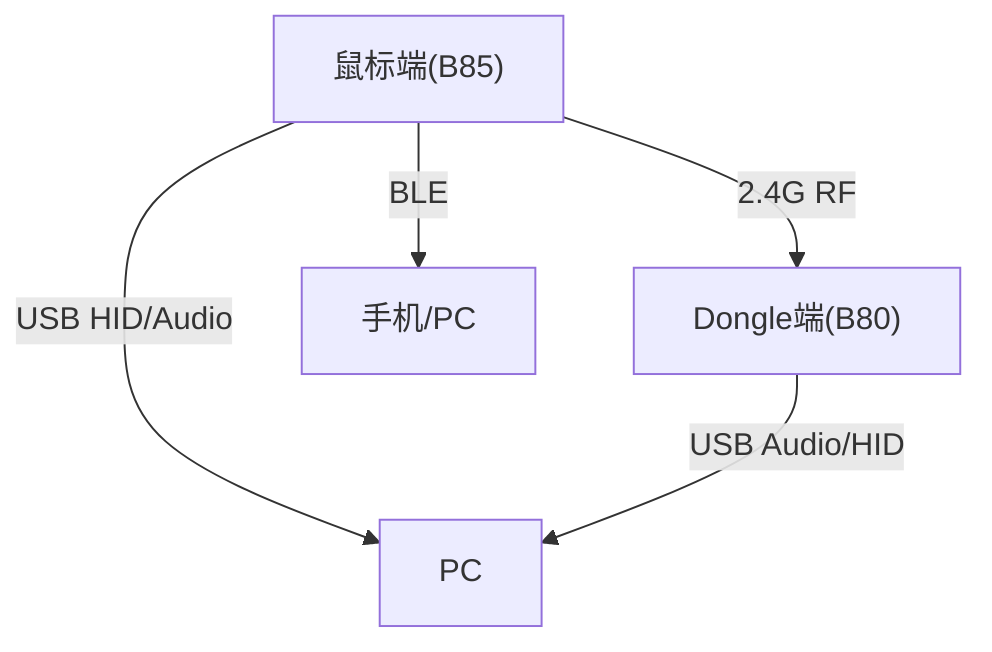
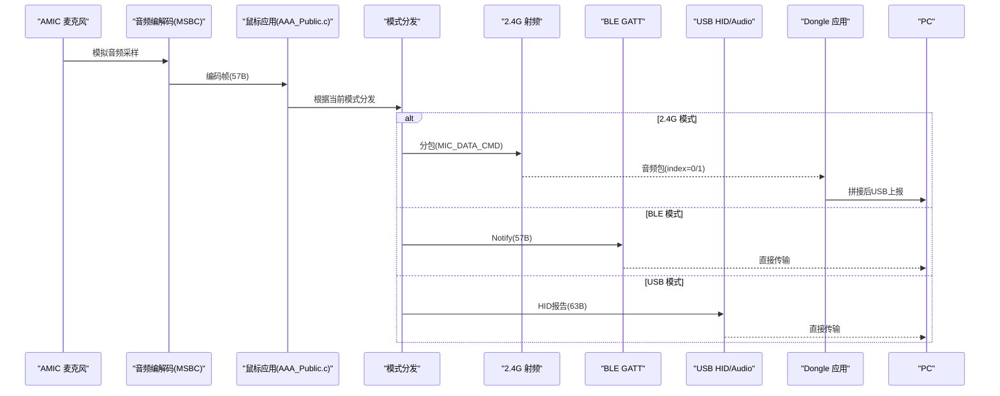
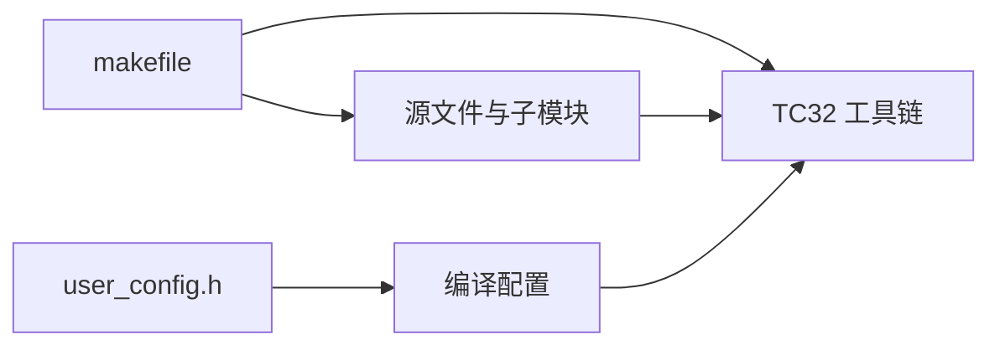

# 快速开始

<cite>
**本文引用的文件**
- [README.md](file://README.md)
- [telink_b85m_triple_mode_audio_mouse_sdk_Release_Note .md](file://telink_b85m_triple_mode_audio_mouse_sdk_Release_Note .md)
- [SDK_Wiki.md](file://doc/SDK_Wiki.md)
- [makefile（B85 双模鼠标工程）](file://tc_ble_single_sdk/project/tlsr_tc32/B85/825x_dual_mic_mouse/makefile)
- [user_config.h（BLE SDK）](file://tc_ble_single_sdk/common/config/user_config.h)
- [user_config.h（通用配置入口）](file://tc_ble_single_sdk/vendor/common/user_config.h)
</cite>

## 目录
1. [简介](#简介)
2. [项目结构](#项目结构)
3. [核心组件](#核心组件)
4. [架构总览](#架构总览)
5. [详细组件分析](#详细组件分析)
6. [依赖分析](#依赖分析)
7. [性能注意事项](#性能注意事项)
8. [故障排除指南](#故障排除指南)
9. [结论](#结论)
10. [附录](#附录)

## 简介
本快速开始指南面向首次接触 Telink B85m 三模音频鼠标 SDK 的开发者，目标是帮助你在最短时间内完成开发环境搭建、编译构建与固件烧录，并理解关键配置文件的作用与常用修改项。内容基于仓库内发布说明与 Wiki 文档整理，确保信息准确可追溯。

## 项目结构
该 SDK 包含鼠标端与 Dongle 端两套工程：
- 鼠标端（B85/TLSR825X）：支持 2.4G + BLE + USB 三模，内置 AI 语音采集与上报能力。
- Dongle 端（B80/TLSR8373）：接收鼠标 2.4G 数据并通过 USB 转发至 PC，同时具备 USB OTA 能力。

图表来源
- [SDK_Wiki.md:10-20](file://doc/SDK_Wiki.md#L10-L20)

章节来源
- [SDK_Wiki.md:10-20](file://doc/SDK_Wiki.md#L10-L20)

## 核心组件
- 工具链与 IDE：TC32 ELF GCC4.3，IDE 为 Telink IoT Studio。
- 工程构建：以 makefile 驱动 TC32 工具链进行编译、链接、生成二进制镜像与校验。
- 配置系统：通过 user_config.h 统一入口选择具体工程配置，再引入各工程的 app_config。
- 音频链路：AMIC 采集 → MSBC 编码 → 按模式分包上报（2.4G/BLE/USB）。
- Flash 保护与 OTA：平台 SDK V2.0.0 引入 HAL 层统一管理；鼠标端通过 BLE/USB/2.4G 通道升级。

章节来源
- [telink_b85m_triple_mode_audio_mouse_sdk_Release_Note .md:15-16](file://telink_b85m_triple_mode_audio_mouse_sdk_Release_Note .md#L15-L16)
- [SDK_Wiki.md:22-32](file://doc/SDK_Wiki.md#L22-L32)
- [SDK_Wiki.md:86-119](file://doc/SDK_Wiki.md#L86-L119)
- [SDK_Wiki.md:603-656](file://doc/SDK_Wiki.md#L603-L656)

## 架构总览
下图展示从麦克风采集到三种工作模式的上报路径，以及 Dongle 端的接收与 USB 转发流程。

图表来源
- [SDK_Wiki.md:100-119](file://doc/SDK_Wiki.md#L100-L119)
- [SDK_Wiki.md:141-170](file://doc/SDK_Wiki.md#L141-L170)
- [SDK_Wiki.md:172-180](file://doc/SDK_Wiki.md#L172-L180)

## 详细组件分析

### 开发环境搭建（TC32 工具链与 IDE）
- 工具链版本：TC32 ELF GCC4.3。
- IDE：Telink IoT Studio（官方推荐）。
- 建议步骤：
  - 安装 Telink IoT Studio。
  - 将 SDK 工程导入 IDE。
  - 在工程中确认目标芯片（B85 鼠标、B80 Dongle）与工具链路径。
  - 使用 IDE 或命令行执行 make 构建。

章节来源
- [telink_b85m_triple_mode_audio_mouse_sdk_Release_Note .md:15-16](file://telink_b85m_triple_mode_audio_mouse_sdk_Release_Note .md#L15-L16)
- [SDK_Wiki.md:22-32](file://doc/SDK_Wiki.md#L22-L32)

### 第一个示例程序的完整构建流程
- 选择工程：
  - 鼠标端：B85 相关工程（例如 dual mic mouse 工程作为参考构建入口）。
  - Dongle 端：8373 dongle demo。
- 构建命令：
  - 进入工程目录，执行 make（IDE 中可直接点击构建）。
  - 构建产物包括 .elf、.bin 等镜像文件。
- 烧录方式：
  - 鼠标端：可通过 BLE OTA、USB OTA 或调试器烧录。
  - Dongle 端：通过 USB OTA 或调试器烧录。
- 验证：
  - 连接 PC 或手机，观察设备枚举与功能是否正常（鼠标移动、按键、语音键开麦等）。

章节来源
- [makefile（B85 双模鼠标工程）:38-75](file://tc_ble_single_sdk/project/tlsr_tc32/B85/825x_dual_mic_mouse/makefile#L38-L75)
- [SDK_Wiki.md:693-733](file://doc/SDK_Wiki.md#L693-L733)

### 关键配置文件与常用修改选项
- 配置入口：
  - tc_ble_single_sdk/common/config/user_config.h：统一入口，包含 vendor/common/user_config.h。
  - tc_ble_single_sdk/vendor/common/user_config.h：根据宏定义选择具体工程的 app_config（如三模鼠标、双模鼠标、dongle 等）。
- 常见修改：
  - 切换工程：修改对应宏（例如 __PROJECT_827X_THREE_MODE_MOUSE__ 或 __PROJECT_8258_DUAL_MOUSE__），使能相应 app_config。
  - 音频模式：设置 TL_AUDIO_MODE（MSBC/ADPCM/SBC）。
  - 蓝牙名称：DEVICE_NAME_AAA。
  - 2.4G FIFO 深度：RF_TX_FIFO_ALLOW_NUM。
  - 引脚配置：GPIO_AMIC_BIAS / GPIO_AMIC_SP。
  - Flash 保护开关：APP_FLASH_PROTECTION_ENABLE（鼠标端）。

章节来源
- [user_config.h（BLE SDK）:24-28](file://tc_ble_single_sdk/common/config/user_config.h#L24-L28)
- [user_config.h（通用配置入口）:27-61](file://tc_ble_single_sdk/vendor/common/user_config.h#L27-L61)
- [SDK_Wiki.md:194-205](file://doc/SDK_Wiki.md#L194-L205)
- [SDK_Wiki.md:650-656](file://doc/SDK_Wiki.md#L650-L656)

### 音频功能与上报流程（AI 语音）
- 语音键交互：短按开启/关闭麦克风，2.4G 模式下同步上报自定义值（开 0x01、关 0x03）。
- 编码与帧格式：MSBC 每帧 57 字节，USB 通道承载 63 字节数组。
- 上报通道：
  - 2.4G：分包（index 0/1），FIFO 保护防止堵塞。
  - BLE：自定义服务 Notify，MTU 交换提升单包载荷。
  - USB：HID 报告，报告率策略随语音开关调整。
- Dongle 端：接收分包并拼接为完整帧，推送至 USB 音频链路。

章节来源
- [SDK_Wiki.md:117-170](file://doc/SDK_Wiki.md#L117-L170)
- [SDK_Wiki.md:172-180](file://doc/SDK_Wiki.md#L172-L180)

### Flash 保护与 OTA
- 平台 SDK V2.0.0 引入 HAL 层统一管理 Flash 保护，避免误擦写程序区。
- 鼠标端通过 BLE/USB/2.4G 通道实现 OTA，升级过程中临时解锁 Flash，完成后重新加锁。
- Dongle 端采用双块 Flash 方案，支持断点续传与 CRC32 校验。

章节来源
- [SDK_Wiki.md:603-656](file://doc/SDK_Wiki.md#L603-L656)
- [SDK_Wiki.md:693-733](file://doc/SDK_Wiki.md#L693-L733)

## 依赖分析
- 工具链依赖：TC32 ELF GCC4.3。
- 构建依赖：makefile 组织源文件与子模块，调用 TC32 工具链进行链接与后处理。
- 配置依赖：user_config.h 统一入口决定最终编译的配置集。
- 运行时依赖：音频库（MSBC/ADPCM）、BLE 协议栈、USB 驱动、Flash 驱动。

图表来源
- [makefile（B85 双模鼠标工程）:38-75](file://tc_ble_single_sdk/project/tlsr_tc32/B85/825x_dual_mic_mouse/makefile#L38-L75)
- [user_config.h（通用配置入口）:27-61](file://tc_ble_single_sdk/vendor/common/user_config.h#L27-L61)

章节来源
- [makefile（B85 双模鼠标工程）:38-75](file://tc_ble_single_sdk/project/tlsr_tc32/B85/825x_dual_mic_mouse/makefile#L38-L75)
- [user_config.h（通用配置入口）:27-61](file://tc_ble_single_sdk/vendor/common/user_config.h#L27-L61)

## 性能注意事项
- 报告率策略：开语音时降低鼠标报告率以保证音频带宽（2.4G/BLE/USB 各有不同策略）。
- FIFO 保护：2.4G 音频包超过阈值丢弃本帧，避免阻塞影响鼠标移动。
- 电量自适应：按电量限制单次开语音时长，超时自动关闭麦克风。
- 低功耗：2.4G 模式增加低功耗处理；USB/BLE 模式动态调整 UI 间隔与报告率。

章节来源
- [SDK_Wiki.md:141-170](file://doc/SDK_Wiki.md#L141-L170)
- [SDK_Wiki.md:182-193](file://doc/SDK_Wiki.md#L182-L193)
- [SDK_Wiki.md:686-691](file://doc/SDK_Wiki.md#L686-L691)

## 故障排除指南
- 无法识别设备：
  - 检查 USB 枚举与描述符是否正确；确认 VID/Product String 配置。
  - 确认 Dongle 与鼠标配对成功，2.4G 通道正常。
- 语音功能异常：
  - 确认 AMIC 引脚配置正确（GPIO_AMIC_BIAS / GPIO_AMIC_SP）。
  - 检查 TL_AUDIO_MODE 是否设置为 MSBC。
  - 查看 FIFO 是否溢出（2.4G 模式有保护机制）。
- 睡眠/唤醒问题：
  - 确认 PM 配置与唤醒源设置正确。
  - 注意 Chromebook/Ubuntu 等系统的兼容性问题（V0.2.5.4 起修复）。
- OTA 失败：
  - 检查 Flash 保护状态（OTA 期间需解锁）。
  - 确认 CRC32 校验与固件大小限制。

章节来源
- [SDK_Wiki.md:141-170](file://doc/SDK_Wiki.md#L141-L170)
- [SDK_Wiki.md:693-733](file://doc/SDK_Wiki.md#L693-L733)
- [telink_b85m_triple_mode_audio_mouse_sdk_Release_Note .md:21-32](file://telink_b85m_triple_mode_audio_mouse_sdk_Release_Note .md#L21-L32)

## 结论
通过本指南，你可以在最短时间内完成 Telink B85m 三模音频鼠标 SDK 的环境搭建、构建与基本验证。重点掌握配置入口、音频链路、Flash 保护与 OTA 流程，有助于后续功能扩展与问题定位。

## 附录
- 版本信息与兼容性：
  - SDK 版本：telink_B85m_triple_mode_audio_mouse_sdk_V0.2.6。
  - BLE SDK：tc_ble_single_sdk V3.4.2.8。
  - 平台 SDK：tc_platform_sdk V3.3.0（对外标注），内部标识 B80_V2.0.0_P12_Flash。
- 代码体积（V0.2.6 实测）：
  - 鼠标端：Firmware 91.6 KB，SRAM 29.8 KB。
  - Dongle 端：Firmware 20.2 KB，SRAM 11.3 KB。

章节来源
- [telink_b85m_triple_mode_audio_mouse_sdk_Release_Note .md:22-32](file://telink_b85m_triple_mode_audio_mouse_sdk_Release_Note .md#L22-L32)
- [telink_b85m_triple_mode_audio_mouse_sdk_Release_Note .md:54-60](file://telink_b85m_triple_mode_audio_mouse_sdk_Release_Note .md#L54-L60)
- [README.md:4-12](file://README.md#L4-L12)