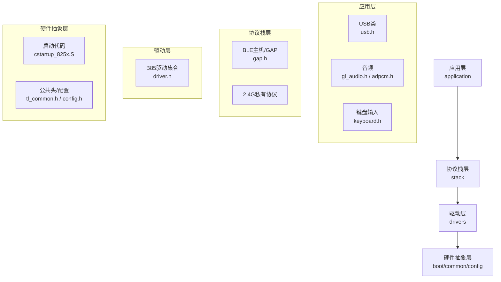
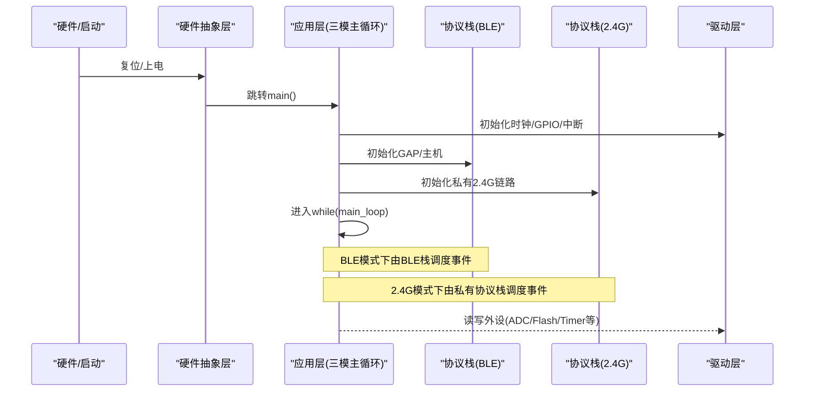
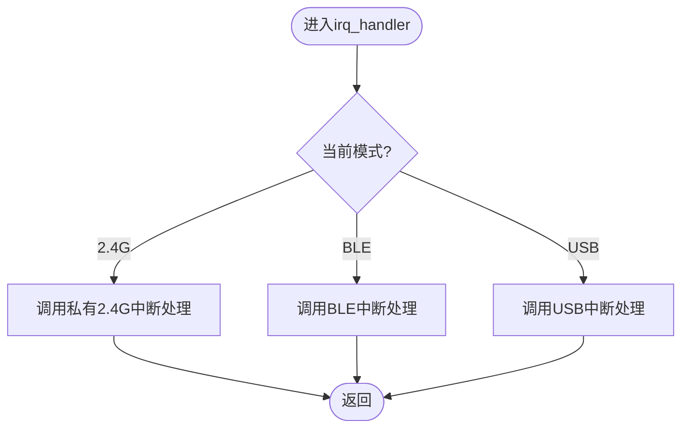
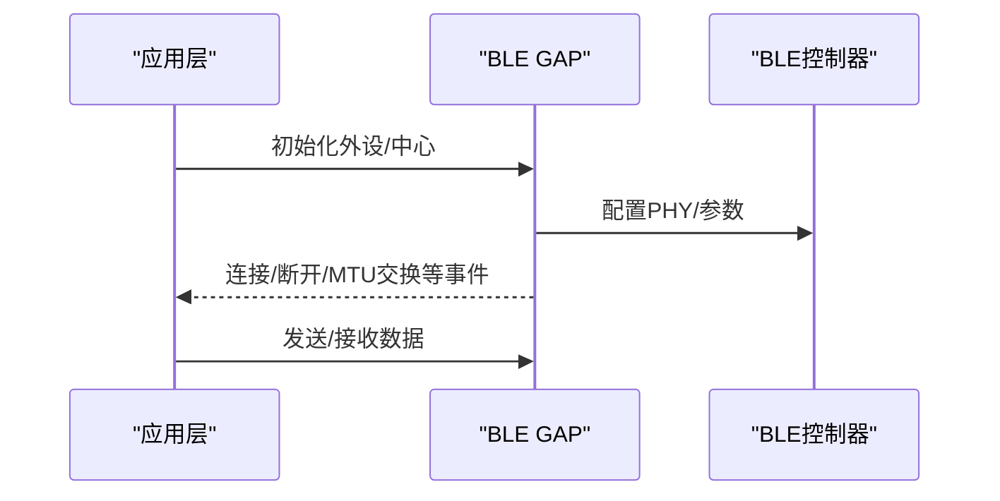
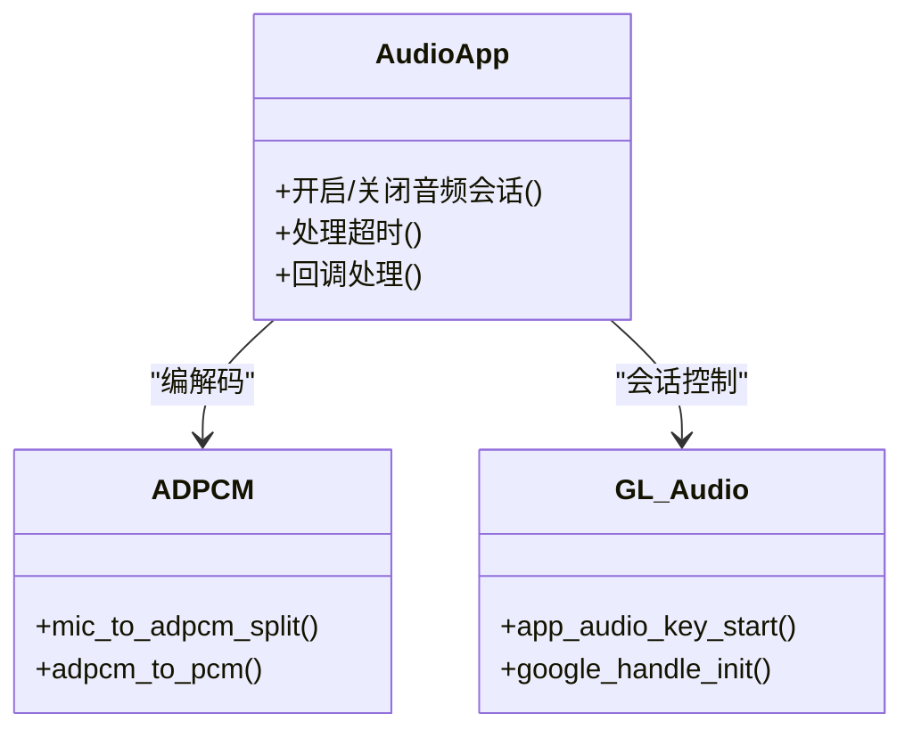

# 分层架构设计

<cite>
**本文引用的文件**
- [AAA_main.c](file://tc_ble_single_sdk/vendor/827x_three_mode_mouse/AAA_main.c)
- [tl_common.h](file://tc_ble_single_sdk/tl_common.h)
- [config.h](file://tc_ble_single_sdk/config.h)
- [drivers.h](file://tc_ble_single_sdk/drivers.h)
- [driver.h](file://tc_ble_single_sdk/drivers/B85/driver.h)
- [gap.h](file://tc_ble_single_sdk/stack/ble/host/gap/gap.h)
- [usb.h](file://tc_ble_single_sdk/application/usbstd/usb.h)
- [gl_audio.h](file://tc_ble_single_sdk/application/audio/gl_audio.h)
- [adpcm.h](file://tc_ble_single_sdk/application/audio/adpcm.h)
- [keyboard.h](file://tc_ble_single_sdk/application/keyboard/keyboard.h)
- [cstartup_825x.S](file://tc_ble_single_sdk/boot/B85/cstartup_825x.S)
- [README.md](file://README.md)
- [telink_b85m_triple_mode_audio_mouse_sdk_Release_Note .md](file://telink_b85m_triple_mode_audio_mouse_sdk_Release_Note .md)
</cite>

## 目录
1. [简介](#简介)
2. [项目结构](#项目结构)
3. [核心组件](#核心组件)
4. [架构总览](#架构总览)
5. [详细组件分析](#详细组件分析)
6. [依赖关系分析](#依赖关系分析)
7. [性能考量](#性能考量)
8. [故障排查指南](#故障排查指南)
9. [结论](#结论)
10. [附录：扩展新协议与驱动指南](#附录：扩展新协议与驱动指南)

## 简介
本文件面向三模（BLE、2.4G私有协议、USB）音频鼠标SDK，系统化阐述四层架构模式：应用层、协议栈层、驱动层、硬件抽象层。重点说明每层职责边界、接口定义、依赖关系与层间通信机制（函数调用、事件回调、中断处理），并解释该分层如何统一抽象三模连接。文档同时提供关键流程的时序图与流程图，以及扩展新协议或驱动的指导建议。

## 项目结构
仓库采用“按功能域+平台”组织：
- 应用层：application（USB类、音频、键盘等）
- 协议栈层：stack（BLE主机/控制器、2.4G相关模块）
- 驱动层：drivers（B85/B87/TC321X等芯片的具体外设驱动）
- 硬件抽象层：boot/startup、common/types、config等
- 厂商示例：vendor（三模鼠标主程序入口等）

图表来源
- [AAA_main.c:335-558](file://tc_ble_single_sdk/vendor/827x_three_mode_mouse/AAA_main.c#L335-L558)
- [tl_common.h:27-52](file://tc_ble_single_sdk/tl_common.h#L27-L52)
- [config.h:31-55](file://tc_ble_single_sdk/config.h#L31-L55)
- [drivers.h:26-29](file://tc_ble_single_sdk/drivers.h#L26-L29)
- [driver.h:28-63](file://tc_ble_single_sdk/drivers/B85/driver.h#L28-L63)
- [gap.h:77-114](file://tc_ble_single_sdk/stack/ble/host/gap/gap.h#L77-L114)
- [usb.h:24-41](file://tc_ble_single_sdk/application/usbstd/usb.h#L24-L41)
- [gl_audio.h:24-151](file://tc_ble_single_sdk/application/audio/gl_audio.h#L24-L151)
- [adpcm.h:27-46](file://tc_ble_single_sdk/application/audio/adpcm.h#L27-L46)
- [cstartup_825x.S:264-340](file://tc_ble_single_sdk/boot/B85/cstartup_825x.S#L264-L340)

章节来源
- [AAA_main.c:335-558](file://tc_ble_single_sdk/vendor/827x_three_mode_mouse/AAA_main.c#L335-L558)
- [tl_common.h:27-52](file://tc_ble_single_sdk/tl_common.h#L27-L52)
- [config.h:31-55](file://tc_ble_single_sdk/config.h#L31-L55)
- [drivers.h:26-29](file://tc_ble_single_sdk/drivers.h#L26-L29)
- [driver.h:28-63](file://tc_ble_single_sdk/drivers/B85/driver.h#L28-L63)
- [gap.h:77-114](file://tc_ble_single_sdk/stack/ble/host/gap/gap.h#L77-L114)
- [usb.h:24-41](file://tc_ble_single_sdk/application/usbstd/usb.h#L24-L41)
- [gl_audio.h:24-151](file://tc_ble_single_sdk/application/audio/gl_audio.h#L24-L151)
- [adpcm.h:27-46](file://tc_ble_single_sdk/application/audio/adpcm.h#L27-L46)
- [cstartup_825x.S:264-340](file://tc_ble_single_sdk/boot/B85/cstartup_825x.S#L264-L340)

## 核心组件
- 应用层
  - USB类：封装USB枚举、端点、报告描述符与数据收发（usb.h）。
  - 音频：ADPCM编解码（adpcm.h）、Google/T4H音频控制状态机（gl_audio.h）。
  - 键盘：按键扫描、去抖、重复键、上报数据结构（keyboard.h）。
- 协议栈层
  - BLE主机/GAP：设备发现、广播、连接管理、属性服务（gap.h）。
  - 2.4G私有协议：与接收端（Dongle）的链路层与业务逻辑。
- 驱动层
  - B85/B87/TC321X等芯片的外设驱动集合（GPIO、时钟、定时器、DMA、ADC、I2C、SPI、UART、Flash、Audio、RF等）（driver.h）。
- 硬件抽象层
  - 启动流程与系统初始化（cstartup_825x.S）。
  - 公共类型、工具、配置宏（tl_common.h、config.h）。

章节来源
- [usb.h:24-41](file://tc_ble_single_sdk/application/usbstd/usb.h#L24-L41)
- [adpcm.h:27-46](file://tc_ble_single_sdk/application/audio/adpcm.h#L27-L46)
- [gl_audio.h:24-151](file://tc_ble_single_sdk/application/audio/gl_audio.h#L24-L151)
- [keyboard.h:24-113](file://tc_ble_single_sdk/application/keyboard/keyboard.h#L24-L113)
- [gap.h:77-114](file://tc_ble_single_sdk/stack/ble/host/gap/gap.h#L77-L114)
- [driver.h:28-63](file://tc_ble_single_sdk/drivers/B85/driver.h#L28-L63)
- [cstartup_825x.S:264-340](file://tc_ble_single_sdk/boot/B85/cstartup_825x.S#L264-L340)
- [tl_common.h:27-52](file://tc_ble_single_sdk/tl_common.h#L27-L52)
- [config.h:31-55](file://tc_ble_single_sdk/config.h#L31-L55)

## 架构总览
下图展示从启动到三模运行的整体路径，体现“应用层→协议栈层→驱动层→硬件抽象层”的单向依赖与解耦。

图表来源
- [cstartup_825x.S:264-340](file://tc_ble_single_sdk/boot/B85/cstartup_825x.S#L264-L340)
- [AAA_main.c:335-558](file://tc_ble_single_sdk/vendor/827x_three_mode_mouse/AAA_main.c#L335-L558)
- [driver.h:28-63](file://tc_ble_single_sdk/drivers/B85/driver.h#L28-L63)
- [gap.h:77-114](file://tc_ble_single_sdk/stack/ble/host/gap/gap.h#L77-L114)

## 详细组件分析

### 应用层：三模主循环与中断分发
- 职责边界
  - 根据当前工作模式（BLE/2.4G/USB）选择对应的主循环与初始化流程。
  - 统一中断入口，按模式分派到具体协议栈或USB处理。
- 关键流程
  - main中完成系统初始化、配置加载、低功耗设置、中断使能。
  - while循环内根据fun_mode调用不同main_loop。
  - irq_handler根据fun_mode路由到私有2.4G、BLE或USB中断处理。
- 与下层交互
  - 通过驱动层API进行外设操作；通过协议栈层API进行连接/数据传输。

图表来源
- [AAA_main.c:59-75](file://tc_ble_single_sdk/vendor/827x_three_mode_mouse/AAA_main.c#L59-L75)

章节来源
- [AAA_main.c:59-75](file://tc_ble_single_sdk/vendor/827x_three_mode_mouse/AAA_main.c#L59-L75)
- [AAA_main.c:335-558](file://tc_ble_single_sdk/vendor/827x_three_mode_mouse/AAA_main.c#L335-L558)

### 协议栈层：BLE主机与GAP
- 职责边界
  - 提供BLE主机初始化、GAP角色配置、连接管理与事件回调。
  - 与应用层通过函数调用和事件回调交互。
- 关键接口
  - GAP外设/中心初始化、主机初始化检查等。
- 与上层交互
  - 应用层在初始化阶段调用GAP初始化；连接建立后，应用层订阅事件并处理。

图表来源
- [gap.h:77-114](file://tc_ble_single_sdk/stack/ble/host/gap/gap.h#L77-L114)

章节来源
- [gap.h:77-114](file://tc_ble_single_sdk/stack/ble/host/gap/gap.h#L77-L114)

### 应用层：音频子系统（ADPCM与Google/T4H）
- 职责边界
  - 将麦克风采样数据进行ADPCM压缩，或通过自定义服务/通道上传。
  - 维护音频会话状态（打开/关闭/超时/同步等）。
- 关键接口
  - ADPCM编解码函数（adpcm.h）。
  - Google/T4H音频控制命令与状态标志（gl_audio.h）。
- 与下层交互
  - 通过驱动层获取音频采样（如ADC/Audio外设），通过协议栈层发送数据。

图表来源
- [adpcm.h:27-46](file://tc_ble_single_sdk/application/audio/adpcm.h#L27-L46)
- [gl_audio.h:24-151](file://tc_ble_single_sdk/application/audio/gl_audio.h#L24-L151)

章节来源
- [adpcm.h:27-46](file://tc_ble_single_sdk/application/audio/adpcm.h#L27-L46)
- [gl_audio.h:24-151](file://tc_ble_single_sdk/application/audio/gl_audio.h#L24-L151)

### 应用层：USB类
- 职责边界
  - 管理USB枚举、端点、报告描述符与数据收发。
  - 为USB模式下的鼠标与音频数据提供统一接口。
- 关键接口
  - USB中断事件类型、超时配置等（usb.h）。
- 与下层交互
  - 通过驱动层USB硬件接口收发数据。

章节来源
- [usb.h:24-41](file://tc_ble_single_sdk/application/usbstd/usb.h#L24-L41)

### 应用层：键盘输入
- 职责边界
  - 扫描按键、去抖、重复键处理、上报数据结构。
- 关键接口
  - 按键扫描、有效性判断、缓存结构（keyboard.h）。
- 与下层交互
  - 通过驱动层GPIO/定时器读取按键状态。

章节来源
- [keyboard.h:24-113](file://tc_ble_single_sdk/application/keyboard/keyboard.h#L24-L113)

### 驱动层：外设驱动集合
- 职责边界
  - 对底层寄存器/外设进行封装，提供稳定API（GPIO、时钟、定时器、DMA、ADC、I2C、SPI、UART、Flash、Audio、RF等）。
- 与上层交互
  - 被应用层与协议栈层调用，屏蔽硬件差异。

章节来源
- [driver.h:28-63](file://tc_ble_single_sdk/drivers/B85/driver.h#L28-L63)

### 硬件抽象层：启动与配置
- 职责边界
  - 上电后的内存段初始化、BSS清零、数据段拷贝、跳转到main。
  - 提供芯片类型、MCU核心类型等编译期配置。
- 与上层交互
  - 为应用层提供稳定的运行环境与配置宏。

章节来源
- [cstartup_825x.S:264-340](file://tc_ble_single_sdk/boot/B85/cstartup_825x.S#L264-L340)
- [config.h:31-55](file://tc_ble_single_sdk/config.h#L31-L55)
- [tl_common.h:27-52](file://tc_ble_single_sdk/tl_common.h#L27-L52)

## 依赖关系分析
- 应用层依赖协议栈层提供的连接/传输能力，依赖驱动层的外设访问能力。
- 协议栈层依赖驱动层的射频/时钟/中断等基础能力。
- 驱动层直接操作寄存器/外设，向上暴露稳定接口。
- 硬件抽象层提供启动流程与全局配置，贯穿全栈。

图表来源
- [AAA_main.c:335-558](file://tc_ble_single_sdk/vendor/827x_three_mode_mouse/AAA_main.c#L335-L558)
- [drivers.h:26-29](file://tc_ble_single_sdk/drivers.h#L26-L29)
- [driver.h:28-63](file://tc_ble_single_sdk/drivers/B85/driver.h#L28-L63)
- [tl_common.h:27-52](file://tc_ble_single_sdk/tl_common.h#L27-L52)

章节来源
- [AAA_main.c:335-558](file://tc_ble_single_sdk/vendor/827x_three_mode_mouse/AAA_main.c#L335-L558)
- [drivers.h:26-29](file://tc_ble_single_sdk/drivers.h#L26-L29)
- [driver.h:28-63](file://tc_ble_single_sdk/drivers/B85/driver.h#L28-L63)
- [tl_common.h:27-52](file://tc_ble_single_sdk/tl_common.h#L27-L52)

## 性能考量
- 报告率与音频带宽平衡
  - 默认报告率与开启语音时的报告率需权衡，避免阻塞导致移动卡顿。
- FIFO与队列
  - 使用独立FIFO避免Linux等平台下语音数据堵塞影响鼠标移动。
- 低功耗
  - 合理设置休眠唤醒策略，减少不必要的唤醒与功耗。
- 编码与MTU
  - 使用高效编码（如MSBC/ADPCM）与合适的MTU交换，提升吞吐与稳定性。

章节来源
- [README.md:42-64](file://README.md#L42-L64)
- [telink_b85m_triple_mode_audio_mouse_sdk_Release_Note .md:21-41](file://telink_b85m_triple_mode_audio_mouse_sdk_Release_Note .md#L21-L41)

## 故障排查指南
- 常见问题定位
  - 快速移动画线异常：检查报告率与音频上报策略，确认FIFO是否堵塞。
  - 睡眠唤醒问题：确认USB/BLE模式下的唤醒源与电源管理配置。
  - 回连弹窗/断连：检查BLE配对与重连逻辑，确保状态机一致。
- 调试手段
  - 启用打印与日志，结合中断与主循环打点。
  - 使用EMI测试功能验证射频链路质量。

章节来源
- [README.md:31-64](file://README.md#L31-L64)
- [telink_b85m_triple_mode_audio_mouse_sdk_Release_Note .md:21-41](file://telink_b85m_triple_mode_audio_mouse_sdk_Release_Note .md#L21-L41)

## 结论
本SDK通过清晰的分层设计，将三模连接的复杂性与硬件差异隔离在协议栈与驱动层，应用层以统一接口实现鼠标与音频业务。中断分发与主循环调度保证了多模式的并发与实时性。该架构便于扩展新协议与新驱动，同时保持系统的可维护性与可移植性。

## 附录：扩展新协议与驱动指南
- 新增协议步骤
  - 在协议栈层新增协议模块，定义数据帧格式、状态机与回调接口。
  - 在应用层增加模式切换与主循环分支，复用现有中断分发机制。
  - 若涉及射频，需在驱动层提供相应RF初始化与收发API。
- 新增驱动步骤
  - 在驱动层新增外设驱动文件，遵循现有driver.h的组织方式。
  - 提供稳定API，并在应用层或协议栈层按需调用。
  - 更新配置宏与编译选项，确保目标芯片正确链接。
- 最佳实践
  - 严格遵循层间依赖方向，禁止跨层调用。
  - 使用事件回调与队列缓冲，避免阻塞式等待。
  - 充分测试各模式下的功耗、吞吐与时延指标。

章节来源
- [drivers.h:26-29](file://tc_ble_single_sdk/drivers.h#L26-L29)
- [driver.h:28-63](file://tc_ble_single_sdk/drivers/B85/driver.h#L28-L63)
- [AAA_main.c:59-75](file://tc_ble_single_sdk/vendor/827x_three_mode_mouse/AAA_main.c#L59-L75)
- [AAA_main.c:335-558](file://tc_ble_single_sdk/vendor/827x_three_mode_mouse/AAA_main.c#L335-L558)