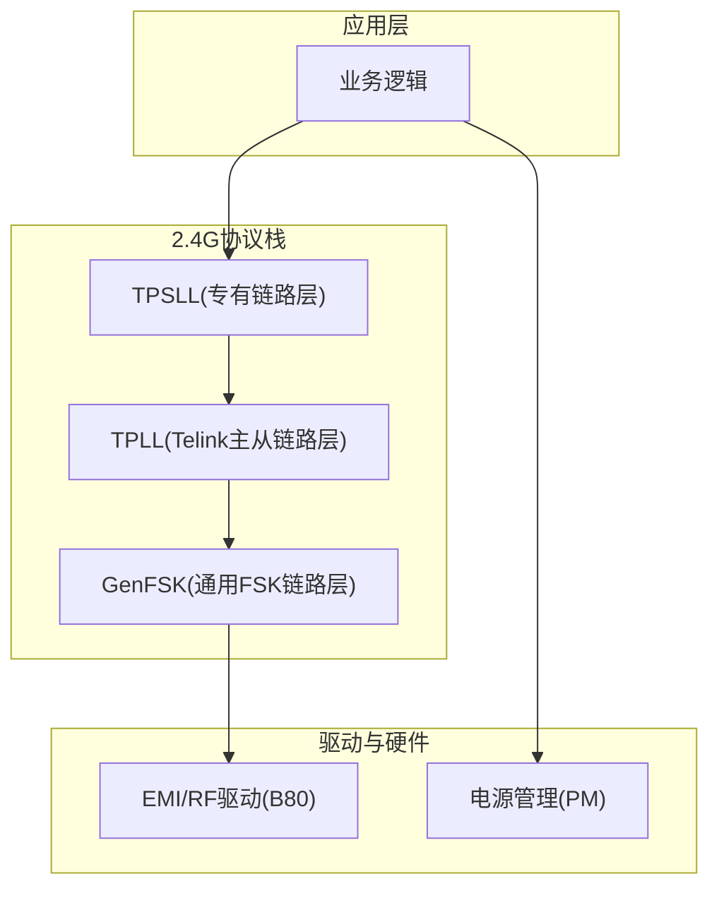
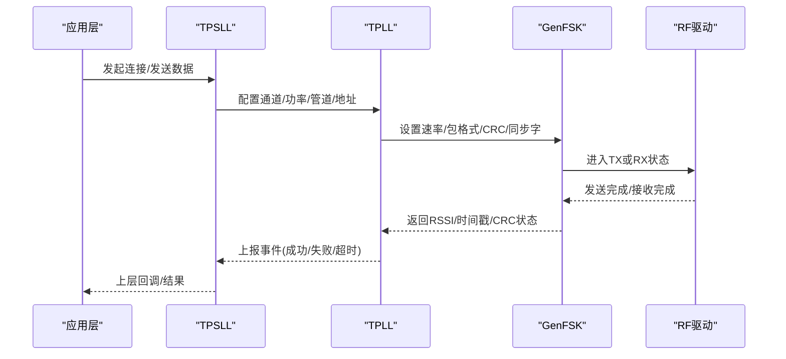
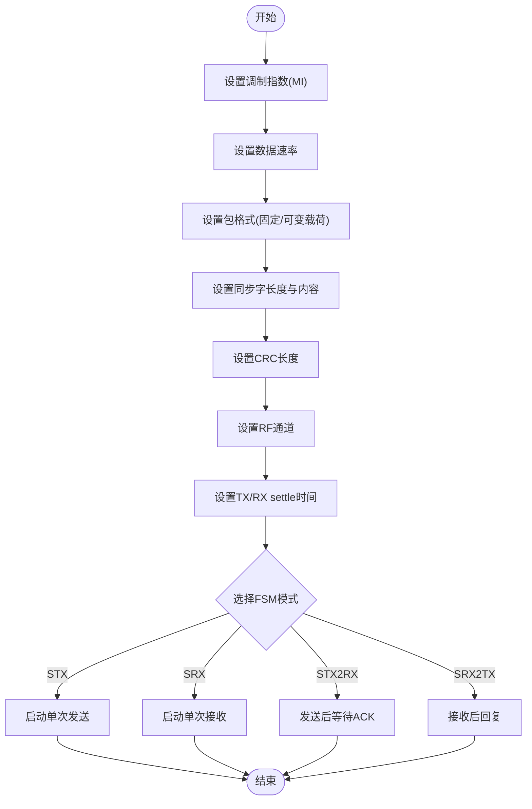
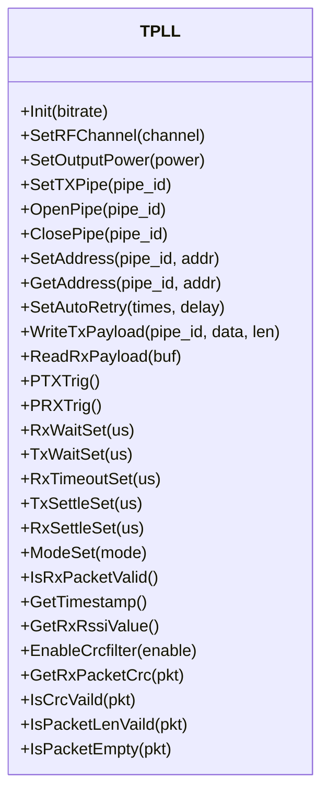
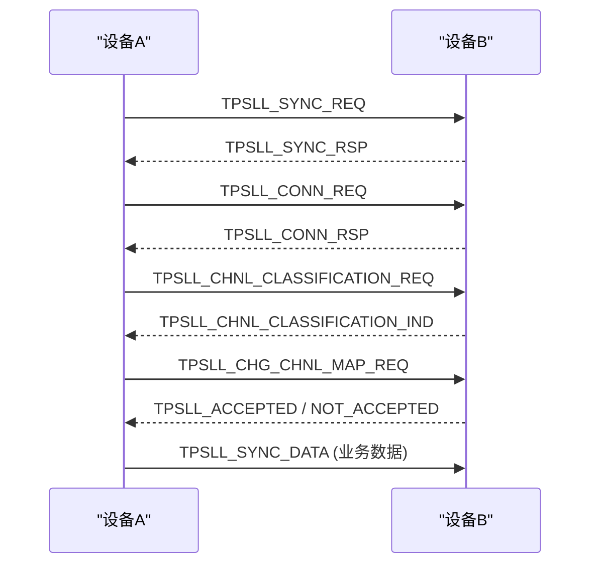
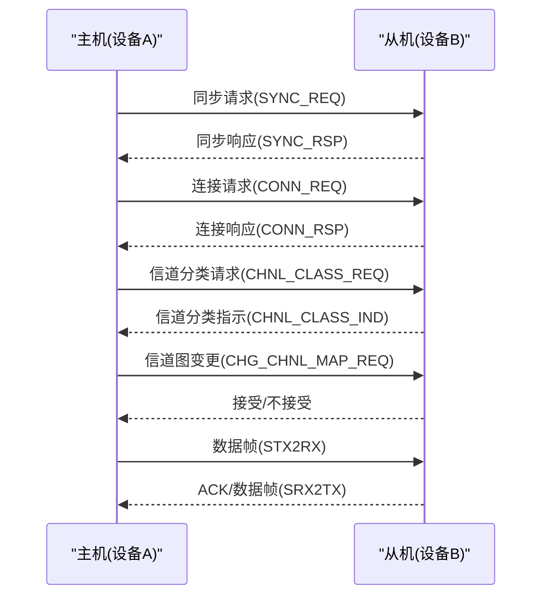
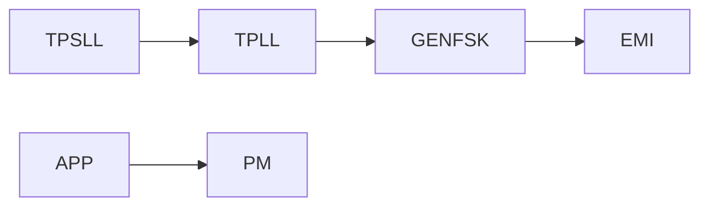

# 2.4G协议栈设计

<cite>
**本文引用的文件**
- [genfsk_ll.h](file://tc_ble_single_sdk/stack/2p4g/genfsk_ll/genfsk_ll.h)
- [tpll.h](file://tc_ble_single_sdk/stack/2p4g/tpll/tpll.h)
- [tpsll.h](file://tc_ble_single_sdk/stack/2p4g/tpsll/tpsll.h)
- [pri2m_emi.c](file://8373_dongle_for_km/chip/B80/drivers/pri2m_emi.c)
- [pm_internal.h](file://tc_ble_single_sdk/drivers/TC321X/lib/include/pm/pm_internal.h)
- [pm.h](file://8373_dongle_for_km/chip/B80/drivers/lib/include/pm.h)
</cite>

## 目录
1. [简介](#简介)
2. [项目结构](#项目结构)
3. [核心组件](#核心组件)
4. [架构总览](#架构总览)
5. [详细组件分析](#详细组件分析)
6. [依赖关系分析](#依赖关系分析)
7. [性能考量](#性能考量)
8. [故障排查指南](#故障排查指南)
9. [结论](#结论)
10. [附录](#附录)

## 简介
本文件面向2.4GHz无线通信协议栈的设计与实现，围绕物理层、链路层与网络层的职责划分展开，重点说明GenFSK调制解调、频率合成与信号处理的关键机制；阐述帧格式、信道管理与抗干扰策略；给出连接建立与数据传输的流程示例；并覆盖网络拓扑管理、设备发现与路由算法的要点。同时提供低功耗模式与功耗优化建议，帮助读者在工程实践中快速定位与优化关键路径。

## 项目结构
该SDK将2.4G协议栈相关代码集中在“stack/2p4g”目录下，按功能模块划分为：
- 通用FSK链路层接口（genfsk_ll）：提供底层射频收发、包格式、CRC、同步字、定时等API
- Telink私有主从链路层（TPLL）：封装PTX/PRX状态机、自动重传、ACK负载、地址与管道管理等
- 专有协议栈链路层（TPSLL）：定义高层命令集、报文结构与FSM调度（如STX/RX/TX-RX等）
- 驱动与EMI测试（B80平台）：提供单音发射、通道设置、RSSI采集等工具函数
- 电源管理（PM）：提供休眠唤醒、LDO配置、时钟源选择等低功耗能力

图表来源
- [genfsk_ll.h:118-141](file://tc_ble_single_sdk/stack/2p4g/genfsk_ll/genfsk_ll.h#L118-L141)
- [tpll.h:100-127](file://tc_ble_single_sdk/stack/2p4g/tpll/tpll.h#L100-L127)
- [tpsll.h:132-146](file://tc_ble_single_sdk/stack/2p4g/tpsll/tpsll.h#L132-L146)
- [pri2m_emi.c:81-154](file://8373_dongle_for_km/chip/B80/drivers/pri2m_emi.c#L81-L154)

章节来源
- [genfsk_ll.h:118-141](file://tc_ble_single_sdk/stack/2p4g/genfsk_ll/genfsk_ll.h#L118-L141)
- [tpll.h:100-127](file://tc_ble_single_sdk/stack/2p4g/tpll/tpll.h#L100-L127)
- [tpsll.h:132-146](file://tc_ble_single_sdk/stack/2p4g/tpsll/tpsll.h#L132-L146)
- [pri2m_emi.c:81-154](file://8373_dongle_for_km/chip/B80/drivers/pri2m_emi.c#L81-L154)

## 核心组件
- GenFSK链路层：提供射频通道、速率、包格式、CRC、同步字、预同步长度、DMA RX缓冲、RSSI、时间戳、TX/RX settle/wait、自动FSM（STX/SRX/STX2RX/SRX2TX）、调制指数（MI）等基础能力
- TPLL链路层：提供初始化、RF通道切换、输出镀率、管道与地址管理、自动重传、ACK负载、FIFO操作、触发收发、等待/超时/稳定时间、RSSI/时间戳读取、CRC校验、快速校准等
- TPSLL链路层：定义高层命令集（同步、接受/拒绝、连接请求/响应、信道分类/变更、同步数据等），并提供基于FSM的收发调度与负载写入
- EMI/RF驱动：支持单音发射、通道设置、RSSI采集、模式切换（私有2M/1M、BLE/Zigbee等）
- 电源管理：支持深度保持、挂起LDO、内部/外部32k时钟选择、重启原因记录等

章节来源
- [genfsk_ll.h:118-141](file://tc_ble_single_sdk/stack/2p4g/genfsk_ll/genfsk_ll.h#L118-L141)
- [tpll.h:100-127](file://tc_ble_single_sdk/stack/2p4g/tpll/tpll.h#L100-L127)
- [tpsll.h:132-146](file://tc_ble_single_sdk/stack/2p4g/tpsll/tpsll.h#L132-L146)
- [pri2m_emi.c:81-154](file://8373_dongle_for_km/chip/B80/drivers/pri2m_emi.c#L81-L154)
- [pm_internal.h:98-204](file://tc_ble_single_sdk/drivers/TC321X/lib/include/pm/pm_internal.h#L98-L204)
- [pm.h:391-429](file://8373_dongle_for_km/chip/B80/drivers/lib/include/pm.h#L391-L429)

## 架构总览
2.4G协议栈采用分层设计：
- 物理层（PHY）：由GenFSK与TPLL共同完成，负责GenFSK调制解调、频率合成（通道设置、PLL settle）、信号强度测量（RSSI）、时间戳捕获、预同步与同步字匹配
- 链路层（LL）：TPLL提供主从链路控制（PTX/PRX）、管道与地址、自动重传、ACK负载、FIFO、CRC校验；TPSLL在更高层组织命令与数据流，并通过FSM调度收发时序
- 网络层（NL）：由TPSLL的命令集承载，包括设备同步、连接建立、信道分类与变更、同步数据等，用于构建拓扑、发现设备与管理路由

图表来源
- [tpll.h:100-127](file://tc_ble_single_sdk/stack/2p4g/tpll/tpll.h#L100-L127)
- [genfsk_ll.h:118-141](file://tc_ble_single_sdk/stack/2p4g/genfsk_ll/genfsk_ll.h#L118-L141)
- [tpsll.h:132-146](file://tc_ble_single_sdk/stack/2p4g/tpsll/tpsll.h#L132-L146)

## 详细组件分析

### 物理层：GenFSK调制解调、频率合成与信号处理
- 调制与解调
  - 支持可调调制指数（MI），通过tx/rx MI设置影响频偏与比特率的关系，提升抗噪与距离权衡
  - 固定/可变载荷包格式，支持前导码、同步字、载荷与CRC字段组合
- 频率合成与通道管理
  - 通道号映射到中心频率（例如2400MHz + channel_num*0.5MHz），支持直接设置通道
  - TX/RX settle时间可配置，确保PLL稳定后再收发
- 信号处理
  - 支持RSSI获取（瞬时与冻结值）、时间戳捕获、CRC校验、丢包计数
  - 支持自动FSM（STX/SRX/STX2RX/SRX2TX）精确调度收发时序

图表来源
- [genfsk_ll.h:118-141](file://tc_ble_single_sdk/stack/2p4g/genfsk_ll/genfsk_ll.h#L118-L141)
- [genfsk_ll.h:314-354](file://tc_ble_single_sdk/stack/2p4g/genfsk_ll/genfsk_ll.h#L314-L354)
- [genfsk_ll.h:356-423](file://tc_ble_single_sdk/stack/2p4g/genfsk_ll/genfsk_ll.h#L356-L423)

章节来源
- [genfsk_ll.h:118-141](file://tc_ble_single_sdk/stack/2p4g/genfsk_ll/genfsk_ll.h#L118-L141)
- [genfsk_ll.h:314-354](file://tc_ble_single_sdk/stack/2p4g/genfsk_ll/genfsk_ll.h#L314-L354)
- [genfsk_ll.h:356-423](file://tc_ble_single_sdk/stack/2p4g/genfsk_ll/genfsk_ll.h#L356-L423)

### 链路层：TPLL主从链路控制
- 初始化与模式
  - 初始化时指定数据速率，设置RF通道、输出功率、管道与地址宽度
  - PTX/PRX模式切换，支持停止状态机
- 收发与可靠性
  - 自动重传次数与延迟配置，支持NoAck选项
  - ACK负载写入与本地ACK位设置
  - FIFO读写、丢弃、复用上次载荷
- 时间与稳定性
  - TX/RX wait/settle时间设置，支持快速校准序列
  - RSSI与时间戳读取，CRC有效性检查
- 状态与诊断
  - 管道状态查询、载波检测、丢包计数

图表来源
- [tpll.h:100-127](file://tc_ble_single_sdk/stack/2p4g/tpll/tpll.h#L100-L127)
- [tpll.h:142-221](file://tc_ble_single_sdk/stack/2p4g/tpll/tpll.h#L142-L221)
- [tpll.h:228-327](file://tc_ble_single_sdk/stack/2p4g/tpll/tpll.h#L228-L327)
- [tpll.h:335-401](file://tc_ble_single_sdk/stack/2p4g/tpll/tpll.h#L335-L401)
- [tpll.h:416-476](file://tc_ble_single_sdk/stack/2p4g/tpll/tpll.h#L416-L476)

章节来源
- [tpll.h:100-127](file://tc_ble_single_sdk/stack/2p4g/tpll/tpll.h#L100-L127)
- [tpll.h:142-221](file://tc_ble_single_sdk/stack/2p4g/tpll/tpll.h#L142-L221)
- [tpll.h:228-327](file://tc_ble_single_sdk/stack/2p4g/tpll/tpll.h#L228-L327)
- [tpll.h:335-401](file://tc_ble_single_sdk/stack/2p4g/tpll/tpll.h#L335-L401)
- [tpll.h:416-476](file://tc_ble_single_sdk/stack/2p4g/tpll/tpll.h#L416-L476)

### 网络层：TPSLL命令与拓扑管理
- 命令集
  - 同步请求/响应、接受/拒绝、连接请求/响应、信道分类请求/指示、信道图变更、同步数据
- 报文结构
  - 统一头（类型+长度）+ 载荷（命令+数据），限制最大载荷长度
- FSM调度
  - 提供STX/SRX/STX2RX/SRX2TX等自动FSM，结合超时与等待时间实现可靠握手与数据交换
- 拓扑与路由
  - 通过信道分类与变更命令进行拓扑维护，结合设备ID与管道管理实现多设备通信与路由

图表来源
- [tpsll.h:33-47](file://tc_ble_single_sdk/stack/2p4g/tpsll/tpsll.h#L33-L47)
- [tpsll.h:101-127](file://tc_ble_single_sdk/stack/2p4g/tpsll/tpsll.h#L101-L127)
- [tpsll.h:292-359](file://tc_ble_single_sdk/stack/2p4g/tpsll/tpsll.h#L292-L359)

章节来源
- [tpsll.h:33-47](file://tc_ble_single_sdk/stack/2p4g/tpsll/tpsll.h#L33-L47)
- [tpsll.h:101-127](file://tc_ble_single_sdk/stack/2p4g/tpsll/tpsll.h#L101-L127)
- [tpsll.h:292-359](file://tc_ble_single_sdk/stack/2p4g/tpsll/tpsll.h#L292-L359)

### 帧格式、信道管理与抗干扰机制
- 帧格式
  - 固定载荷：前导码 + 同步字 + 载荷 + CRC
  - 可变载荷：前导码 + 同步字 + 头部（含载荷长度） + 载荷 + CRC
- 信道管理
  - 通道号到中心频率的线性映射，支持直接通道设置与PLL settle
  - 支持快速TX/RX settle优化，减少跳频开销
- 抗干扰
  - 调制指数（MI）调节以平衡抗噪与带宽
  - CRC校验与自动重传，提高可靠性
  - 信道分类与变更，动态避开干扰信道
  - RSSI监测辅助信道选择与质量评估

章节来源
- [genfsk_ll.h:199-225](file://tc_ble_single_sdk/stack/2p4g/genfsk_ll/genfsk_ll.h#L199-L225)
- [genfsk_ll.h:126-141](file://tc_ble_single_sdk/stack/2p4g/genfsk_ll/genfsk_ll.h#L126-L141)
- [tpll.h:335-401](file://tc_ble_single_sdk/stack/2p4g/tpll/tpll.h#L335-L401)
- [tpsll.h:33-47](file://tc_ble_single_sdk/stack/2p4g/tpsll/tpsll.h#L33-L47)

### 连接建立与数据传输流程（示例）
- 连接建立
  - 设备A发送同步请求，设备B响应；随后进行连接请求/响应
  - 执行信道分类与变更，确定稳定工作信道
- 数据传输
  - 使用STX2RX或SRX2TX自动FSM，发送数据并等待ACK
  - 若超时或CRC错误，触发重传或回退策略

图表来源
- [tpsll.h:33-47](file://tc_ble_single_sdk/stack/2p4g/tpsll/tpsll.h#L33-L47)
- [tpsll.h:292-359](file://tc_ble_single_sdk/stack/2p4g/tpsll/tpsll.h#L292-L359)

章节来源
- [tpsll.h:33-47](file://tc_ble_single_sdk/stack/2p4g/tpsll/tpsll.h#L33-L47)
- [tpsll.h:292-359](file://tc_ble_single_sdk/stack/2p4g/tpsll/tpsll.h#L292-L359)

### 低功耗模式与功耗优化策略
- 模式选择
  - 使用内部或外部32k时钟作为唤醒源，降低待机功耗
  - 配置深度保持与挂起LDO电压，减少漏电流
- 射频优化
  - 合理设置TX/RX settle时间，避免过长等待造成浪费
  - 使用自动FSM减少CPU介入，降低活跃时间
  - 根据场景调整输出功率与调制指数，平衡距离与功耗
- 系统级优化
  - 在空闲时段进入睡眠，利用定时器或外设中断唤醒
  - 批量传输减少频繁唤醒次数

章节来源
- [pm_internal.h:98-204](file://tc_ble_single_sdk/drivers/TC321X/lib/include/pm/pm_internal.h#L98-L204)
- [pm.h:391-429](file://8373_dongle_for_km/chip/B80/drivers/lib/include/pm.h#L391-L429)
- [genfsk_ll.h:314-354](file://tc_ble_single_sdk/stack/2p4g/genfsk_ll/genfsk_ll.h#L314-L354)
- [tpll.h:335-401](file://tc_ble_single_sdk/stack/2p4g/tpll/tpll.h#L335-L401)

## 依赖关系分析
- 模块耦合
  - TPSLL依赖TPLL提供的收发能力与状态机
  - TPLL依赖GenFSK提供的底层射频控制与信号处理
  - 驱动层（EMI）提供具体芯片寄存器访问与模式切换
- 外部依赖
  - 电源管理模块对系统功耗有直接影响
  - 时钟源选择影响唤醒精度与功耗

图表来源
- [tpsll.h:132-146](file://tc_ble_single_sdk/stack/2p4g/tpsll/tpsll.h#L132-L146)
- [tpll.h:100-127](file://tc_ble_single_sdk/stack/2p4g/tpll/tpll.h#L100-L127)
- [genfsk_ll.h:118-141](file://tc_ble_single_sdk/stack/2p4g/genfsk_ll/genfsk_ll.h#L118-L141)
- [pri2m_emi.c:81-154](file://8373_dongle_for_km/chip/B80/drivers/pri2m_emi.c#L81-L154)

章节来源
- [tpsll.h:132-146](file://tc_ble_single_sdk/stack/2p4g/tpsll/tpsll.h#L132-L146)
- [tpll.h:100-127](file://tc_ble_single_sdk/stack/2p4g/tpll/tpll.h#L100-L127)
- [genfsk_ll.h:118-141](file://tc_ble_single_sdk/stack/2p4g/genfsk_ll/genfsk_ll.h#L118-L141)
- [pri2m_emi.c:81-154](file://8373_dongle_for_km/chip/B80/drivers/pri2m_emi.c#L81-L154)

## 性能考量
- 吞吐与时延
  - 合理选择数据速率与包格式，减少头部开销
  - 使用自动FSM减少CPU干预，降低时延抖动
- 可靠性
  - 配置合适的自动重传次数与延迟，平衡成功率与功耗
  - 启用CRC校验与RSSI监测，及时识别弱信号环境
- 功耗
  - 缩短TX/RX settle时间，避免过度等待
  - 在空闲期进入睡眠，使用低功率时钟源

[本节为通用指导，不直接分析具体文件]

## 故障排查指南
- 常见问题
  - 无法建立连接：检查同步字、通道设置、PLL settle时间是否匹配
  - 数据包丢失：确认CRC校验、自动重传配置、RSSI是否在阈值内
  - 高功耗：检查是否频繁唤醒、TX/RX settle时间是否过长
- 调试手段
  - 使用EMI工具进行单音发射与RSSI采集，验证射频链路
  - 通过TPLL状态机与FIFO状态判断收发是否正常
  - 使用PM模块配置不同睡眠模式，对比功耗曲线

章节来源
- [pri2m_emi.c:81-154](file://8373_dongle_for_km/chip/B80/drivers/pri2m_emi.c#L81-L154)
- [tpll.h:228-327](file://tc_ble_single_sdk/stack/2p4g/tpll/tpll.h#L228-L327)
- [pm_internal.h:98-204](file://tc_ble_single_sdk/drivers/TC321X/lib/include/pm/pm_internal.h#L98-L204)

## 结论
该2.4G协议栈通过清晰的三层架构（物理层、链路层、网络层）实现了可靠的无线通信能力。GenFSK提供灵活的调制与信号处理能力，TPLL保障链路可靠性与效率，TPSLL则负责高层拓扑管理与数据交换。结合EMI驱动与电源管理，可在不同应用场景中取得性能与功耗的最佳平衡。实际工程中应依据环境噪声、距离需求与电池约束，合理配置参数与策略。

[本节为总结性内容，不直接分析具体文件]

## 附录
- 术语
  - GenFSK：通用频移键控调制
  - TPLL：Telink私有主从链路层
  - TPSLL：Telink专有协议栈链路层
  - RSSI：接收信号强度指示
  - PLL：锁相环，用于频率合成
- 参考路径
  - 物理层API：[genfsk_ll.h](file://tc_ble_single_sdk/stack/2p4g/genfsk_ll/genfsk_ll.h)
  - 链路层API：[tpll.h](file://tc_ble_single_sdk/stack/2p4g/tpll/tpll.h)
  - 网络层命令：[tpsll.h](file://tc_ble_single_sdk/stack/2p4g/tpsll/tpsll.h)
  - 驱动与EMI：[pri2m_emi.c](file://8373_dongle_for_km/chip/B80/drivers/pri2m_emi.c)
  - 电源管理：[pm_internal.h](file://tc_ble_single_sdk/drivers/TC321X/lib/include/pm/pm_internal.h), [pm.h](file://8373_dongle_for_km/chip/B80/drivers/lib/include/pm.h)

[本节为补充信息，不直接分析具体文件]