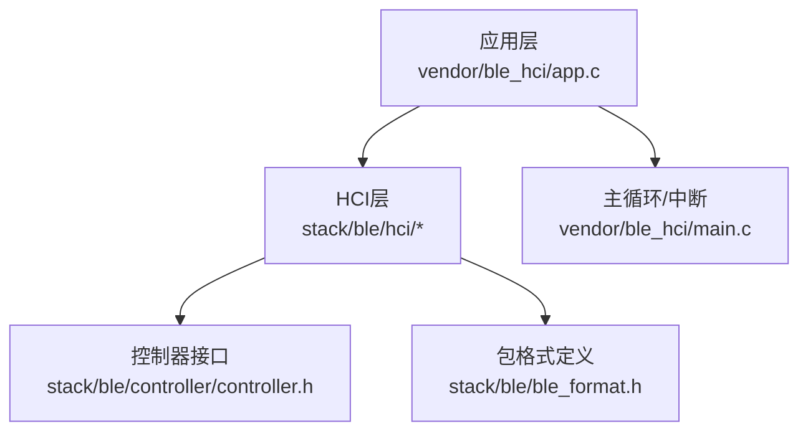
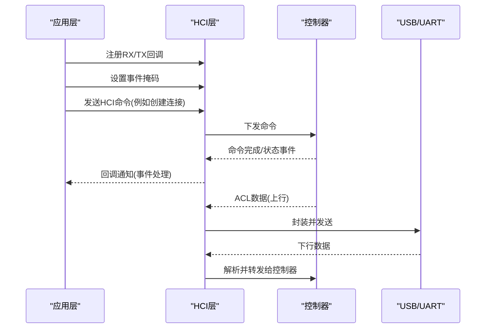
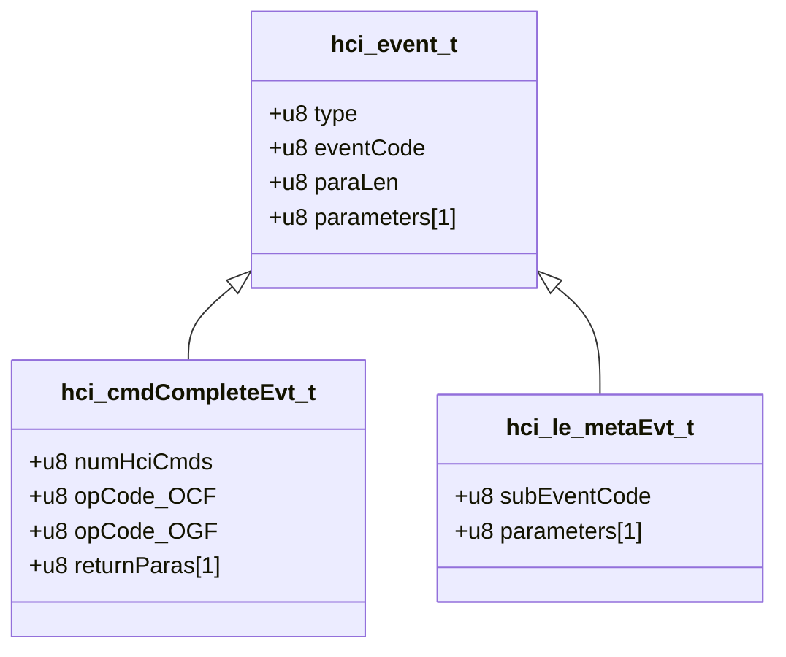
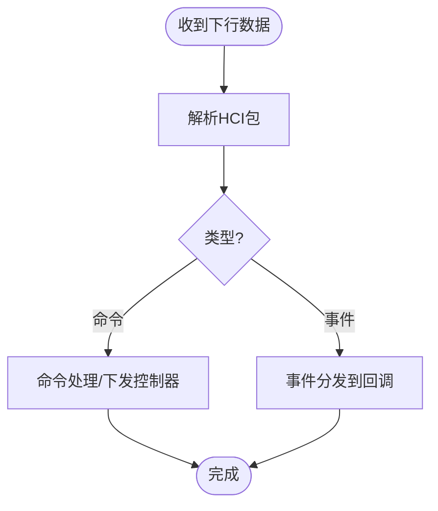
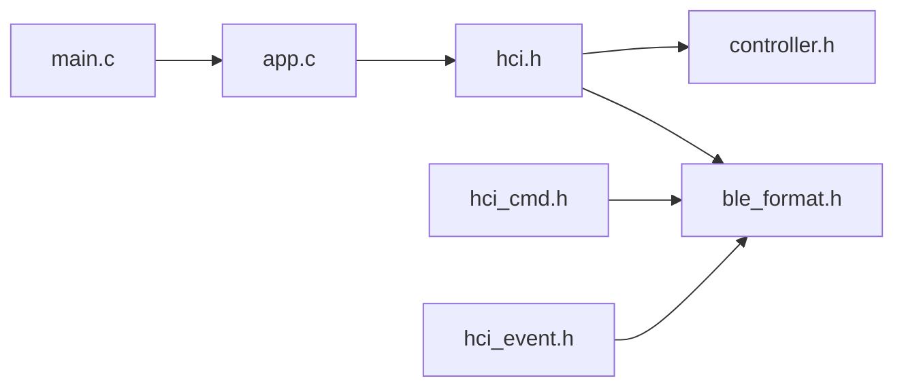

# BLE HCI层设计

<cite>
**本文引用的文件**
- [hci.h](file://tc_ble_single_sdk/stack/ble/hci/hci.h)
- [hci_cmd.h](file://tc_ble_single_sdk/stack/ble/hci/hci_cmd.h)
- [hci_event.h](file://tc_ble_single_sdk/stack/ble/hci/hci_event.h)
- [hci_const.h](file://tc_ble_single_sdk/stack/ble/hci/hci_const.h)
- [controller.h](file://tc_ble_single_sdk/stack/ble/controller/controller.h)
- [app.c](file://tc_ble_single_sdk/vendor/ble_hci/app.c)
- [main.c](file://tc_ble_single_sdk/vendor/ble_hci/main.c)
- [ble_format.h](file://tc_ble_single_sdk/stack/ble/ble_format.h)
</cite>

## 目录
1. [简介](#简介)
2. [项目结构](#项目结构)
3. [核心组件](#核心组件)
4. [架构总览](#架构总览)
5. [详细组件分析](#详细组件分析)
6. [依赖关系分析](#依赖关系分析)
7. [性能与缓冲管理](#性能与缓冲管理)
8. [故障排查指南](#故障排查指南)
9. [结论](#结论)
10. [附录：命令与事件分类速查](#附录：命令与事件分类速查)

## 简介
本文件面向BLE主机侧的HCI（Host Controller Interface）层设计与实现，围绕命令格式、事件类型、数据包结构、主机与控制器通信机制、命令发送/事件接收/状态同步流程、错误处理、超时与重传策略、缓冲区管理与流量控制等主题进行系统化说明。文档基于仓库中的HCI头文件与应用示例代码进行分析与归纳，帮助读者在不深入源码细节的情况下理解整体设计，并在需要时快速定位到具体实现位置。

## 项目结构
该SDK将BLE协议栈分为Controller（控制器）与Host（主机）两层，HCI位于两者之间，提供统一的命令/事件接口。关键目录与职责如下：
- stack/ble/hci：定义HCI命令、事件、常量及对外API（如注册回调、设置事件掩码、发送ACL数据等）。
- stack/ble/controller：控制器内部事件与初始化检查接口，用于上层感知连接、PHY更新、数据长度交换等链路层事件。
- vendor/ble_hci：应用层示例，演示如何通过UART或USB接入HCI，并配置广播、扫描、连接等流程。
- stack/ble：底层包格式定义（L2CAP/ATT等），供HCI在封装/解封装时使用。

图表来源
- [app.c:261-385](file://tc_ble_single_sdk/vendor/ble_hci/app.c#L261-L385)
- [hci.h:34-144](file://tc_ble_single_sdk/stack/ble/hci/hci.h#L34-L144)
- [controller.h:30-212](file://tc_ble_single_sdk/stack/ble/controller/controller.h#L30-L212)
- [ble_format.h:31-165](file://tc_ble_single_sdk/stack/ble/ble_format.h#L31-L165)

章节来源
- [app.c:261-385](file://tc_ble_single_sdk/vendor/ble_hci/app.c#L261-L385)
- [main.c:89-135](file://tc_ble_single_sdk/vendor/ble_hci/main.c#L89-L135)

## 核心组件
- HCI API与回调
  - 事件处理器注册：blc_hci_registerControllerEventHandler
  - RX/TX回调注册：blc_register_hci_handler
  - 事件掩码设置：blc_hci_setEventMask_cmd / blc_hci_le_setEventMask_cmd / blc_hci_le_setEventMask_2_cmd
  - ACL数据上送：blc_hci_sendACLData2Host
  - 通用事件发送：blc_hci_send_data
  - 数据处理入口：blc_hci_handler
  - 事件处理调度：blc_hci_proc

- 命令与事件定义
  - 命令参数与返回结构体：hci_cmd.h
  - 事件结构体与子事件：hci_event.h
  - 常量与OGF/OCF映射：hci_const.h

- 控制器事件
  - 连接建立/断开、PHY更新、数据长度交换、通道映射更新等：controller.h

章节来源
- [hci.h:34-144](file://tc_ble_single_sdk/stack/ble/hci/hci.h#L34-L144)
- [hci_cmd.h:31-800](file://tc_ble_single_sdk/stack/ble/hci/hci_cmd.h#L31-L800)
- [hci_event.h:31-780](file://tc_ble_single_sdk/stack/ble/hci/hci_event.h#L31-L780)
- [hci_const.h:27-423](file://tc_ble_single_sdk/stack/ble/hci/hci_const.h#L27-L423)
- [controller.h:30-212](file://tc_ble_single_sdk/stack/ble/controller/controller.h#L30-L212)

## 架构总览
HCI层作为主机与控制器之间的抽象层，负责：
- 将上层请求封装为HCI命令并通过TX路径下发至控制器
- 接收控制器上报的事件（包括标准HCI事件与LE Meta事件）并通过回调分发
- 管理ACL数据在主机与控制器之间的双向传输
- 通过事件掩码控制事件上报粒度，降低主机负载

图表来源
- [app.c:208-353](file://tc_ble_single_sdk/vendor/ble_hci/app.c#L208-L353)
- [hci.h:56-144](file://tc_ble_single_sdk/stack/ble/hci/hci.h#L56-L144)

## 详细组件分析

### HCI命令与事件模型
- 命令结构
  - OGF（操作组码）与OCF（操作码）组合唯一标识命令，见常量定义。
  - 命令参数与返回值以结构体形式定义，便于类型安全与内存布局对齐。
- 事件结构
  - 通用事件包包含type、eventCode、paraLen与parameters。
  - LE Meta事件通过subEventCode区分不同子事件（如连接建立、广播报告、PHY更新等）。
  - 命令完成事件包含numHciCmds、opCode_OCF/OPE_G、returnParas等字段。

图表来源
- [hci_event.h:31-90](file://tc_ble_single_sdk/stack/ble/hci/hci_event.h#L31-L90)
- [hci_const.h:39-100](file://tc_ble_single_sdk/stack/ble/hci/hci_const.h#L39-L100)

章节来源
- [hci_event.h:31-90](file://tc_ble_single_sdk/stack/ble/hci/hci_event.h#L31-L90)
- [hci_const.h:39-100](file://tc_ble_single_sdk/stack/ble/hci/hci_const.h#L39-L100)

### 主机与控制器通信机制
- RX路径
  - 通过USB或UART接收数据，进入应用回调rx_from_uart_cb或blc_hci_rx_from_usb，将数据交由blc_hci_handler处理。
- TX路径
  - 通过blc_register_hci_handler注册的tx_to_uart_cb或blc_hci_tx_to_usb将事件/ACL数据发送出去。
- 事件分发
  - blc_hci_registerControllerEventHandler注册事件回调，控制器事件经blc_hci_send_data统一派发。

图表来源
- [app.c:215-257](file://tc_ble_single_sdk/vendor/ble_hci/app.c#L215-L257)
- [hci.h:56-144](file://tc_ble_single_sdk/stack/ble/hci/hci.h#L56-L144)

章节来源
- [app.c:215-257](file://tc_ble_single_sdk/vendor/ble_hci/app.c#L215-L257)
- [hci.h:56-144](file://tc_ble_single_sdk/stack/ble/hci/hci.h#L56-L144)

### 命令分类与功能
- 初始化命令
  - 设置事件掩码（BT/EDR与LE）、读取本地能力、复位控制器等。
- 连接管理命令
  - 设置广播参数/使能、设置扫描参数/使能、创建连接、连接更新、白名单/解析列表管理等。
- 测试命令
  - 收发测试、IQ采样、CTE相关测试等。
- 其他
  - PHY设置、数据长度设置、ISO相关命令（CIS/BIG）等。

章节来源
- [hci_const.h:188-423](file://tc_ble_single_sdk/stack/ble/hci/hci_const.h#L188-L423)
- [hci_cmd.h:176-800](file://tc_ble_single_sdk/stack/ble/hci/hci_cmd.h#L176-L800)

### 事件类型与处理
- 标准事件
  - 连接断开、加密变化、读远程版本信息、命令完成/状态、数据缓冲区溢出等。
- LE Meta事件
  - 连接建立/更新、广播报告、PHY更新、周期性广播同步、CIS/BIG相关事件、路径损耗/发射功率上报、子速率变更等。
- 控制器事件
  - 连接建立/终止、数据长度交换、通道映射更新、PHY更新、GPIO唤醒等。

章节来源
- [hci_event.h:94-780](file://tc_ble_single_sdk/stack/ble/hci/hci_event.h#L94-L780)
- [controller.h:41-181](file://tc_ble_single_sdk/stack/ble/controller/controller.h#L41-L181)

### 状态同步流程
- 初始化阶段
  - 初始化MAC、控制器模块、主机模块；注册L2CAP回调；配置电源管理；检查初始化结果。
- 运行阶段
  - 通过事件掩码控制事件上报；应用根据事件更新连接状态、广播/扫描状态、PHY/数据长度等。

章节来源
- [app.c:261-385](file://tc_ble_single_sdk/vendor/ble_hci/app.c#L261-L385)

### 错误处理、超时与重传
- 错误事件
  - 命令状态事件、硬件错误、数据缓冲区溢出等事件用于指示异常。
- 超时与重传
  - 仓库未直接暴露HCI层的超时与重传逻辑；通常由上层（如GAP/L2CAP/应用）结合事件完成/状态事件实现等待与重试。
- 建议实践
  - 使用命令完成事件与状态事件判断成功与否；对关键命令设置应用级超时与重试计数；避免在事件回调中执行耗时操作。

章节来源
- [hci_event.h:94-135](file://tc_ble_single_sdk/stack/ble/hci/hci_event.h#L94-L135)
- [hci_const.h:39-54](file://tc_ble_single_sdk/stack/ble/hci/hci_const.h#L39-L54)

### 缓冲区管理与流量控制
- FIFO缓冲
  - 应用层维护HCI RX/TX FIFO与RF RX/TX FIFO，大小与数量可配置，支持DMA搬运与中断驱动。
- 流量控制
  - 通过“主机完成包数”命令与事件协调控制器与主机间的ACK节奏；结合事件掩码减少不必要的事件上报。
- DMA与中断
  - UART RX/DMA与TX完成中断配合，确保高吞吐与低CPU占用。

章节来源
- [app.c:60-105](file://tc_ble_single_sdk/vendor/ble_hci/app.c#L60-L105)
- [main.c:38-81](file://tc_ble_single_sdk/vendor/ble_hci/main.c#L38-L81)
- [hci_cmd.h:52-70](file://tc_ble_single_sdk/stack/ble/hci/hci_cmd.h#L52-L70)

## 依赖关系分析
- 头文件依赖
  - hci.h依赖ble_format.h（包格式）、controller.h（控制器事件）。
  - hci_cmd.h与hci_event.h依赖ble_common.h与ble_format.h。
- 运行时依赖
  - 应用层通过vendor/ble_hci/app.c注册回调并调用HCI API；main.c提供中断与主循环。
- 耦合性
  - HCI层与控制器通过事件回调松耦合；与上层通过函数指针回调进一步解耦。

图表来源
- [hci.h:1-148](file://tc_ble_single_sdk/stack/ble/hci/hci.h#L1-L148)
- [hci_cmd.h:1-800](file://tc_ble_single_sdk/stack/ble/hci/hci_cmd.h#L1-L800)
- [hci_event.h:1-790](file://tc_ble_single_sdk/stack/ble/hci/hci_event.h#L1-L790)
- [app.c:1-401](file://tc_ble_single_sdk/vendor/ble_hci/app.c#L1-L401)
- [main.c:1-136](file://tc_ble_single_sdk/vendor/ble_hci/main.c#L1-L136)

章节来源
- [hci.h:1-148](file://tc_ble_single_sdk/stack/ble/hci/hci.h#L1-L148)
- [hci_cmd.h:1-800](file://tc_ble_single_sdk/stack/ble/hci/hci_cmd.h#L1-L800)
- [hci_event.h:1-790](file://tc_ble_single_sdk/stack/ble/hci/hci_event.h#L1-L790)
- [app.c:1-401](file://tc_ble_single_sdk/vendor/ble_hci/app.c#L1-L401)
- [main.c:1-136](file://tc_ble_single_sdk/vendor/ble_hci/main.c#L1-L136)

## 性能与缓冲管理
- 缓冲设计
  - 采用环形FIFO与DMA，降低CPU干预；合理设置FIFO大小与数量以避免溢出。
- 事件过滤
  - 通过事件掩码仅启用必要事件，减少主机处理开销。
- 传输优化
  - 使用“主机完成包数”机制提升吞吐；在高频场景下注意避免阻塞事件回调。
- 功耗考虑
  - 空闲时进入低功耗模式，通过GPIO唤醒；在任务繁忙时禁止休眠。

章节来源
- [app.c:60-105](file://tc_ble_single_sdk/vendor/ble_hci/app.c#L60-L105)
- [app.c:184-206](file://tc_ble_single_sdk/vendor/ble_hci/app.c#L184-L206)
- [hci_cmd.h:52-70](file://tc_ble_single_sdk/stack/ble/hci/hci_cmd.h#L52-L70)

## 故障排查指南
- 常见问题
  - 事件未上报：检查事件掩码是否启用对应位；确认回调已正确注册。
  - 数据丢失：检查FIFO是否溢出；调整FIFO大小或提高处理频率。
  - 连接失败：查看命令状态事件与连接建立事件；核对广播/扫描参数与地址类型。
- 调试手段
  - 启用调试打印；观察命令完成事件与状态事件；必要时抓取HCI原始报文。
- 恢复策略
  - 遇到硬件错误或缓冲区溢出，尝试重置控制器并重新初始化；应用层记录错误码以便分析。

章节来源
- [hci_event.h:94-135](file://tc_ble_single_sdk/stack/ble/hci/hci_event.h#L94-L135)
- [hci_const.h:39-54](file://tc_ble_single_sdk/stack/ble/hci/hci_const.h#L39-L54)
- [app.c:372-385](file://tc_ble_single_sdk/vendor/ble_hci/app.c#L372-L385)

## 结论
该BLE HCI层设计遵循标准HCI规范，通过清晰的命令/事件结构与回调机制，实现了主机与控制器的高效解耦通信。应用层借助FIFO与DMA实现稳定可靠的数据通路，并通过事件掩码与完成事件实现可控的流量与状态同步。对于超时与重传，建议在应用层结合事件完成/状态事件实现，以满足不同场景的可靠性需求。

## 附录：命令与事件分类速查
- 初始化类
  - 设置事件掩码、读取本地能力、复位控制器
- 连接管理类
  - 广播参数/使能、扫描参数/使能、创建连接、连接更新、白名单/解析列表管理
- 测试类
  - 收发测试、IQ采样、CTE相关测试
- 事件类
  - 标准事件（断开、加密变化、命令完成/状态、缓冲区溢出等）
  - LE Meta事件（连接建立/更新、广播报告、PHY更新、周期性广播同步、CIS/BIG、路径损耗/发射功率上报、子速率变更等）
  - 控制器事件（连接建立/终止、数据长度交换、通道映射更新、PHY更新、GPIO唤醒等）

章节来源
- [hci_const.h:188-423](file://tc_ble_single_sdk/stack/ble/hci/hci_const.h#L188-L423)
- [hci_event.h:94-780](file://tc_ble_single_sdk/stack/ble/hci/hci_event.h#L94-L780)
- [controller.h:41-181](file://tc_ble_single_sdk/stack/ble/controller/controller.h#L41-L181)