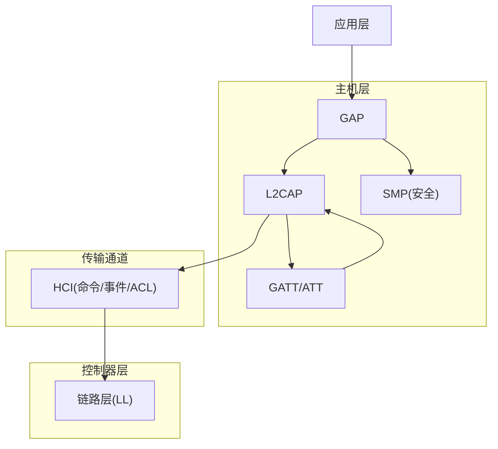
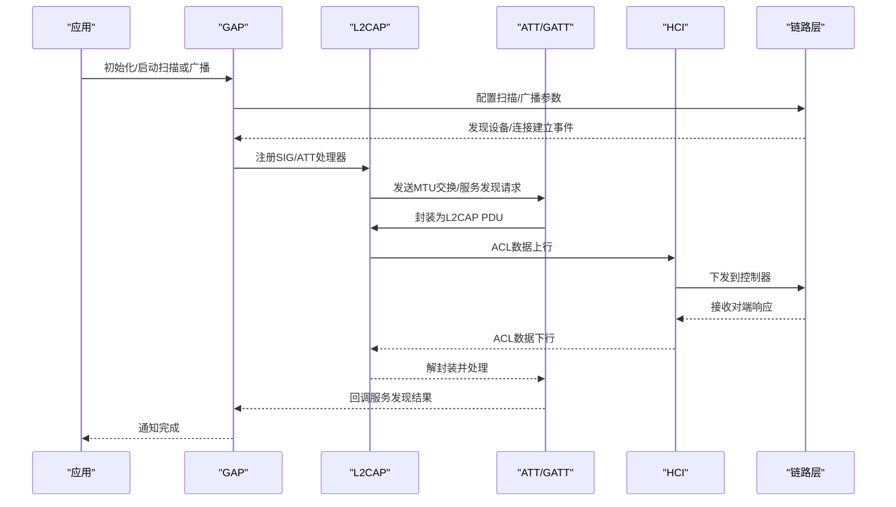
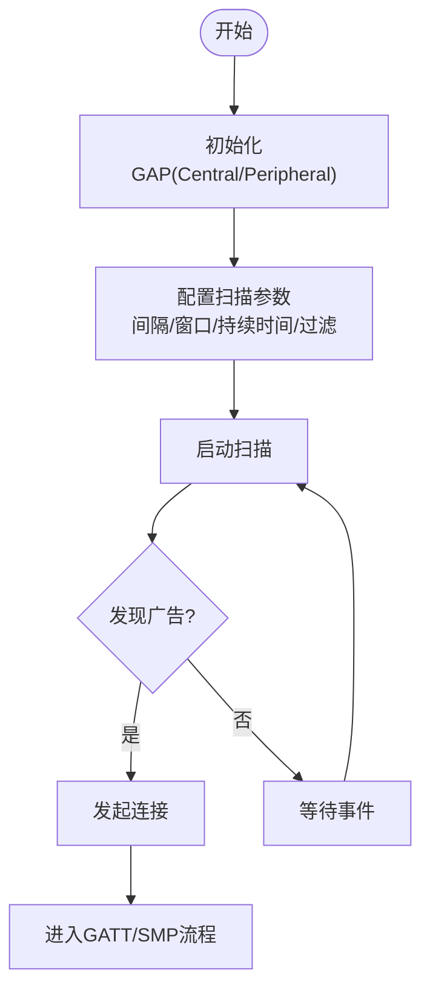
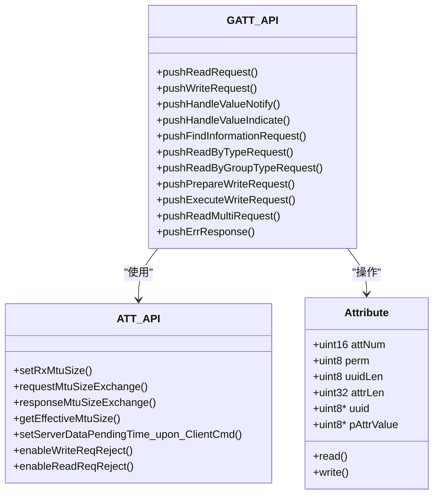
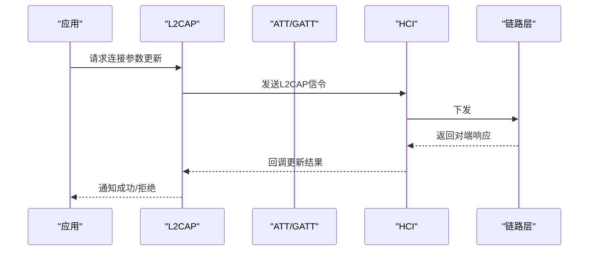
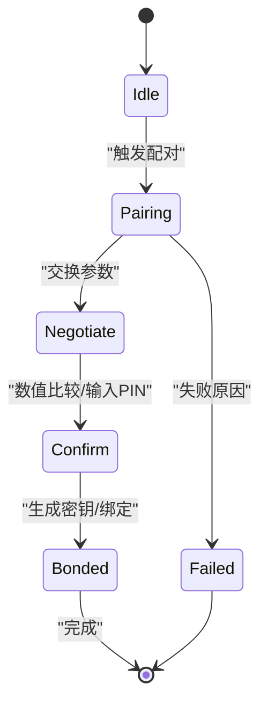
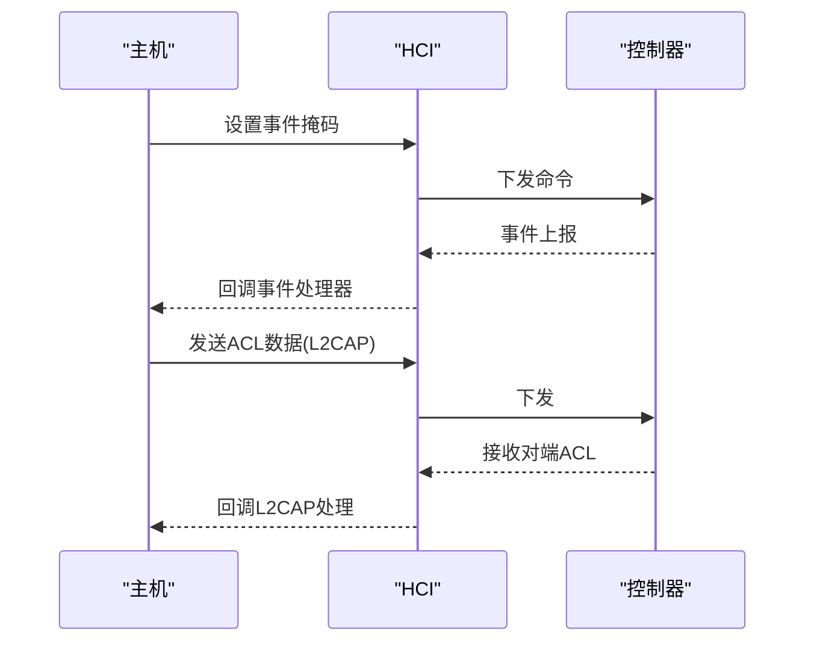
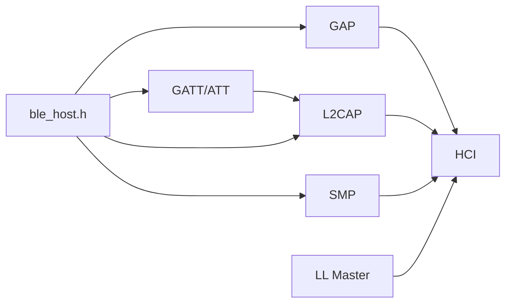

# BLE主机层设计

<cite>
**本文引用的文件**
- [ble_host.h](file://tc_ble_single_sdk/stack/ble/host/ble_host.h)
- [gap.h](file://tc_ble_single_sdk/stack/ble/host/gap/gap.h)
- [gatt.h](file://tc_ble_single_sdk/stack/ble/host/attr/gatt.h)
- [att.h](file://tc_ble_single_sdk/stack/ble/host/attr/att.h)
- [l2cap.h](file://tc_ble_single_sdk/stack/ble/host/l2cap/l2cap.h)
- [smp.h](file://tc_ble_single_sdk/stack/ble/host/smp/smp.h)
- [hci.h](file://tc_ble_single_sdk/stack/ble/hci/hci.h)
- [hci_cmd.h](file://tc_ble_single_sdk/stack/ble/hci/hci_cmd.h)
- [ll_master.h](file://tc_ble_single_sdk/stack/ble/controller/ll/ll_conn/ll_master.h)
- [device_information.h](file://tc_ble_single_sdk/stack/ble/service/device_information.h)
- [hids.h](file://tc_ble_single_sdk/stack/ble/service/hids.h)
</cite>

## 目录
1. [简介](#简介)
2. [项目结构](#项目结构)
3. [核心组件](#核心组件)
4. [架构总览](#架构总览)
5. [详细组件分析](#详细组件分析)
6. [依赖关系分析](#依赖关系分析)
7. [性能与优化](#性能与优化)
8. [故障排查指南](#故障排查指南)
9. [结论](#结论)
10. [附录：示例与最佳实践](#附录示例与最佳实践)

## 简介
本文件面向BLE主机层设计与实现，围绕GAP（通用访问配置文件）、GATT（通用属性配置文件）、L2CAP协议栈、ATT数据封装与安全机制进行系统化说明。重点覆盖设备发现、配对连接、服务枚举、数据传输流程，以及主机与控制器之间的HCI接口调用路径。文档同时给出基于SDK接口的服务创建与特征值操作指引，并解释安全认证、加密通信与权限控制的关键点。

## 项目结构
该SDK将BLE协议栈按层次组织：
- 主机层（Host）：包含GAP、GATT/ATT、L2CAP、SMP等协议子层
- 控制器层（Controller/LL）：负责链路层连接管理、射频调度等
- HCI层：主机与控制器之间命令/事件/ACL数据的抽象通道
- 服务定义：提供标准服务（如设备信息、HID）的UUID与常量

图表来源
- [ble_host.h:27-50](file://tc_ble_single_sdk/stack/ble/host/ble_host.h#L27-L50)
- [hci.h:47-144](file://tc_ble_single_sdk/stack/ble/hci/hci.h#L47-L144)
- [ll_master.h:30-101](file://tc_ble_single_sdk/stack/ble/controller/ll/ll_conn/ll_master.h#L30-L101)

章节来源
- [ble_host.h:27-50](file://tc_ble_single_sdk/stack/ble/host/ble_host.h#L27-L50)

## 核心组件
- GAP：负责广播/扫描、角色初始化、主机初始化检查等
- GATT/ATT：服务与特征值的读写、通知/指示、发现、MTU协商、错误响应
- L2CAP：连接参数更新、数据包收发、SIG/ATT通道处理、大MTU缓冲
- SMP：安全配对、密钥管理、MITM/OOB、绑定模式、IO能力、数字比较等
- HCI：事件掩码设置、事件处理器注册、ACL数据上下行、USB通道收发
- LL Master：主设备连接建立、断开、参数更新、远程特性读取、L2CAP打包

章节来源
- [gap.h:77-114](file://tc_ble_single_sdk/stack/ble/host/gap/gap.h#L77-L114)
- [gatt.h:32-208](file://tc_ble_single_sdk/stack/ble/host/attr/gatt.h#L32-L208)
- [att.h:29-274](file://tc_ble_single_sdk/stack/ble/host/attr/att.h#L29-L274)
- [l2cap.h:28-132](file://tc_ble_single_sdk/stack/ble/host/l2cap/l2cap.h#L28-L132)
- [smp.h:63-372](file://tc_ble_single_sdk/stack/ble/host/smp/smp.h#L63-L372)
- [hci.h:47-144](file://tc_ble_single_sdk/stack/ble/hci/hci.h#L47-L144)
- [ll_master.h:30-101](file://tc_ble_single_sdk/stack/ble/controller/ll/ll_conn/ll_master.h#L30-L101)

## 架构总览
BLE主机层采用分层协议栈：应用通过GAP发起连接或扫描；GATT/ATT在L2CAP之上承载属性协议；SMP在连接建立后执行安全握手；所有数据经HCI在主机与控制器间传递。

图表来源
- [l2cap.h:72-102](file://tc_ble_single_sdk/stack/ble/host/l2cap/l2cap.h#L72-L102)
- [gatt.h:86-150](file://tc_ble_single_sdk/stack/ble/host/attr/gatt.h#L86-L150)
- [hci.h:119-144](file://tc_ble_single_sdk/stack/ble/hci/hci.h#L119-L144)
- [ll_master.h:30-101](file://tc_ble_single_sdk/stack/ble/controller/ll/ll_conn/ll_master.h#L30-L101)

## 详细组件分析

### GAP（通用访问配置文件）
- 角色初始化：支持Central与Peripheral初始化入口
- 主机初始化校验：在所有主机初始化完成后进行检查，确保配置正确
- 广播/扫描：通过HCI命令配置扫描类型、间隔、窗口、持续时间及过滤策略

图表来源
- [gap.h:77-114](file://tc_ble_single_sdk/stack/ble/host/gap/gap.h#L77-L114)
- [hci_cmd.h:306-394](file://tc_ble_single_sdk/stack/ble/hci/hci_cmd.h#L306-L394)
- [hci_cmd.h:1039-1076](file://tc_ble_single_sdk/stack/ble/hci/hci_cmd.h#L1039-L1076)

章节来源
- [gap.h:77-114](file://tc_ble_single_sdk/stack/ble/host/gap/gap.h#L77-L114)
- [hci_cmd.h:306-394](file://tc_ble_single_sdk/stack/ble/hci/hci_cmd.h#L306-L394)
- [hci_cmd.h:1039-1076](file://tc_ble_single_sdk/stack/ble/hci/hci_cmd.h#L1039-L1076)

### GATT/ATT（通用属性配置文件）
- 服务发现：支持查找信息、按类型/组类型查询、读/写/准备写入/批量读等操作
- 通知/指示：单Handle或多Handle批量通知，确认机制
- MTU协商：设置/请求/响应MTU大小，获取有效MTU
- 权限控制：READ/WRITE/ENCRYPT/AUTHEN/SECURE_CONN等位域组合
- 服务端优化：在服务发现期间阻塞部分服务器数据发送，避免冲突

图表来源
- [gatt.h:32-208](file://tc_ble_single_sdk/stack/ble/host/attr/gatt.h#L32-L208)
- [att.h:87-132](file://tc_ble_single_sdk/stack/ble/host/attr/att.h#L87-L132)
- [att.h:146-274](file://tc_ble_single_sdk/stack/ble/host/attr/att.h#L146-L274)

章节来源
- [gatt.h:32-208](file://tc_ble_single_sdk/stack/ble/host/attr/gatt.h#L32-L208)
- [att.h:29-274](file://tc_ble_single_sdk/stack/ble/host/attr/att.h#L29-L274)

### L2CAP协议栈
- 连接参数更新：请求/响应，最小更新延迟时间设置
- 数据包处理：注册SIG/ATT处理器，接收与分发L2CAP包
- MTU缓冲：默认最大250字节，可自定义更大缓冲以支持高吞吐

图表来源
- [l2cap.h:53-119](file://tc_ble_single_sdk/stack/ble/host/l2cap/l2cap.h#L53-L119)
- [hci.h:119-144](file://tc_ble_single_sdk/stack/ble/hci/hci.h#L119-L144)

章节来源
- [l2cap.h:28-132](file://tc_ble_single_sdk/stack/ble/host/l2cap/l2cap.h#L28-L132)

### SMP（安全配对与绑定）
- 安全级别与配对方法：支持Legacy与Secure Connection，可配置MITM/OOB/按键输入
- IO能力与数字比较：支持显示/键盘/无输入输出，数值比较确认
- 绑定模式与IRK生成：本地IRK生成策略，调试模式ECDH密钥
- 会话阶段：快速重连与完整配对流程，失败原因枚举

图表来源
- [smp.h:63-372](file://tc_ble_single_sdk/stack/ble/host/smp/smp.h#L63-L372)

章节来源
- [smp.h:63-372](file://tc_ble_single_sdk/stack/ble/host/smp/smp.h#L63-L372)

### HCI接口（主机与控制器）
- 事件掩码：设置BT/LE事件掩码，选择性接收事件
- 事件处理器：注册控制器事件回调，统一处理
- ACL数据：发送/接收ACL数据，用于L2CAP载荷
- USB通道：在特定模式下通过USB收发HCI数据

图表来源
- [hci.h:47-144](file://tc_ble_single_sdk/stack/ble/hci/hci.h#L47-L144)

章节来源
- [hci.h:47-144](file://tc_ble_single_sdk/stack/ble/hci/hci.h#L47-L144)

### 链路层主控（LL Master）
- 主设备连接：初始化主角色、发起连接、断开连接
- 参数更新：连接间隔、时延、超时等
- 远程特性：读取远端特性以判断能力
- L2CAP打包：将L2CAP包封装为RF帧

章节来源
- [ll_master.h:30-101](file://tc_ble_single_sdk/stack/ble/controller/ll/ll_conn/ll_master.h#L30-L101)

## 依赖关系分析
- ble_host.h聚合了L2CAP、ATT/GATT、SMP、GAP等模块，作为主机层统一入口
- GAP依赖HCI进行底层控制，GATT/ATT依赖L2CAP进行数据封装
- SMP在连接建立后按需启用，影响GATT访问权限
- LL Master提供连接生命周期管理，被GAP和上层流程调用

图表来源
- [ble_host.h:27-50](file://tc_ble_single_sdk/stack/ble/host/ble_host.h#L27-L50)
- [hci.h:47-144](file://tc_ble_single_sdk/stack/ble/hci/hci.h#L47-L144)

章节来源
- [ble_host.h:27-50](file://tc_ble_single_sdk/stack/ble/host/ble_host.h#L27-L50)

## 性能与优化
- MTU优化：通过L2CAP与ATT的MTU协商提升吞吐量，必要时注册更大的TX/RX缓冲
- 服务发现期间的服务器数据暂停：避免并发导致的服务发现失败
- 连接参数更新：动态调整连接间隔与时延，平衡功耗与实时性
- 批量操作：使用多Handle通知/批量读减少交互次数

章节来源
- [l2cap.h:28-132](file://tc_ble_single_sdk/stack/ble/host/l2cap/l2cap.h#L28-L132)
- [att.h:206-231](file://tc_ble_single_sdk/stack/ble/host/attr/att.h#L206-L231)
- [gatt.h:42-49](file://tc_ble_single_sdk/stack/ble/host/attr/gatt.h#L42-L49)

## 故障排查指南
- 服务发现失败：检查是否在服务发现期间发送了通知/指示，必要时调整“服务器数据挂起时间”
- 配对失败：核对安全级别、IO能力、MITM/OOB配置，查看失败原因枚举
- 连接不稳定：检查连接参数更新是否被拒绝，适当放宽间隔/时延/超时
- 权限错误：确认ATT权限位（加密/认证/安全连接）与当前链路状态匹配

章节来源
- [att.h:206-231](file://tc_ble_single_sdk/stack/ble/host/attr/att.h#L206-L231)
- [smp.h:40-60](file://tc_ble_single_sdk/stack/ble/host/smp/smp.h#L40-L60)
- [gatt.h:200-208](file://tc_ble_single_sdk/stack/ble/host/attr/gatt.h#L200-L208)

## 结论
该BLE主机层以清晰的层次化设计实现了GAP/GATT/L2CAP/SMP/HCI的协同工作，提供了完整的设备发现、配对连接、服务枚举与数据传输能力。通过合理的MTU协商、连接参数优化与服务发现期间的数据暂停机制，系统在稳定性与性能上具备良好表现。结合SMP的安全配置与ATT权限控制，可满足多种应用场景的安全需求。

## 附录：示例与最佳实践

### 设备发现与连接流程（Central）
- 初始化GAP Central
- 配置扫描参数（类型、间隔、窗口、持续时间、过滤策略）
- 启动扫描，收到广告后发起连接
- 连接成功后注册L2CAP SIG/ATT处理器，进行MTU协商与服务发现

章节来源
- [gap.h:89-94](file://tc_ble_single_sdk/stack/ble/host/gap/gap.h#L89-L94)
- [hci_cmd.h:306-394](file://tc_ble_single_sdk/stack/ble/hci/hci_cmd.h#L306-L394)
- [hci_cmd.h:1039-1076](file://tc_ble_single_sdk/stack/ble/hci/hci_cmd.h#L1039-L1076)
- [l2cap.h:72-102](file://tc_ble_single_sdk/stack/ble/host/l2cap/l2cap.h#L72-L102)

### 服务枚举与特征值操作（Client）
- 使用GATT API进行服务发现（查找信息、按类型/组类型查询）
- 读取/写入特征值，支持准备写入与执行写入
- 订阅通知/指示，批量通知以提升效率
- 使用批量读接口提高读取性能

章节来源
- [gatt.h:86-198](file://tc_ble_single_sdk/stack/ble/host/attr/gatt.h#L86-L198)

### 安全配对与加密通信（SMP）
- 配置安全级别、配对方法与IO能力
- 根据需要启用MITM/OOB与按键输入
- 在配对阶段进行数值比较或PIN输入
- 完成配对后，根据ATT权限要求开启加密/认证访问

章节来源
- [smp.h:63-372](file://tc_ble_single_sdk/stack/ble/host/smp/smp.h#L63-L372)
- [att.h:29-63](file://tc_ble_single_sdk/stack/ble/host/attr/att.h#L29-L63)

### 主机与控制器HCI调用流程
- 设置事件掩码，注册事件处理器
- 通过ACL发送/接收L2CAP数据
- 在USB模式下通过USB收发HCI数据

章节来源
- [hci.h:47-144](file://tc_ble_single_sdk/stack/ble/hci/hci.h#L47-L144)

### 服务与特征值定义参考
- 设备信息服务：提供制造商名称、型号、序列号、硬件/固件/软件版本等特征
- HID服务：提供报告映射、控制点、协议模式、输入/输出报告等特征

章节来源
- [device_information.h:27-39](file://tc_ble_single_sdk/stack/ble/service/device_information.h#L27-L39)
- [hids.h:27-85](file://tc_ble_single_sdk/stack/ble/service/hids.h#L27-L85)