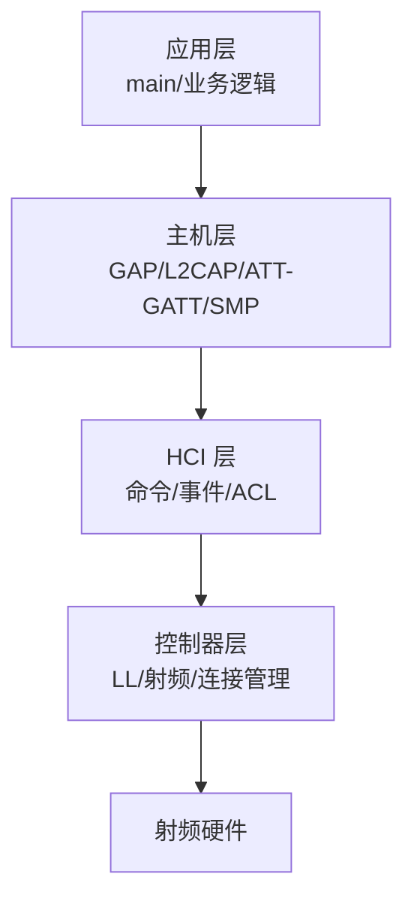
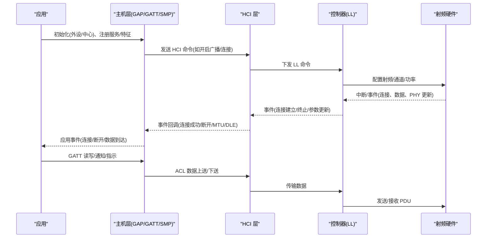
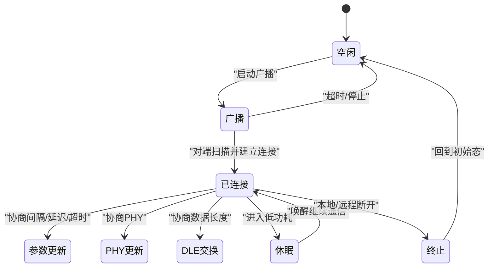
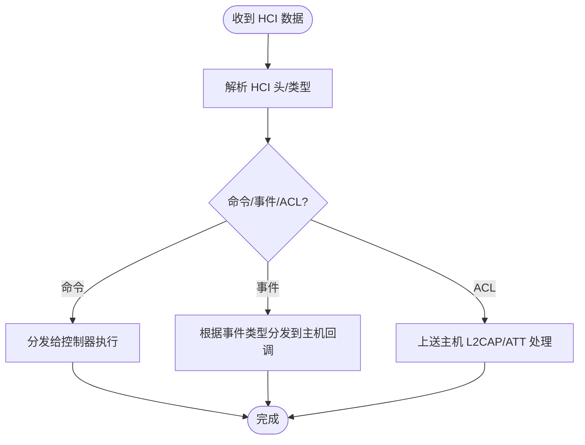
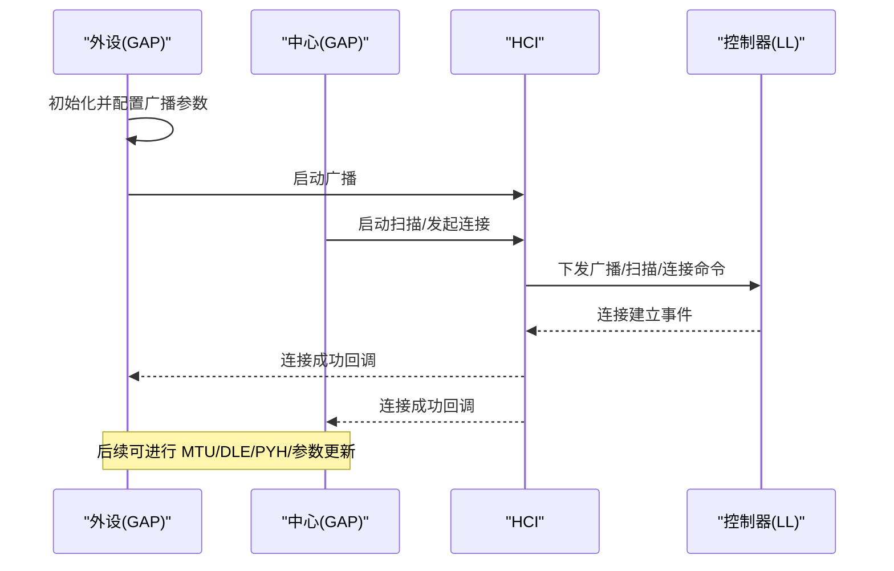
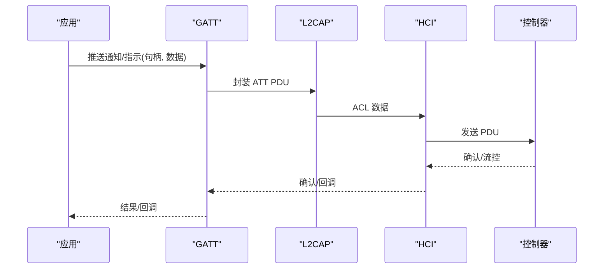
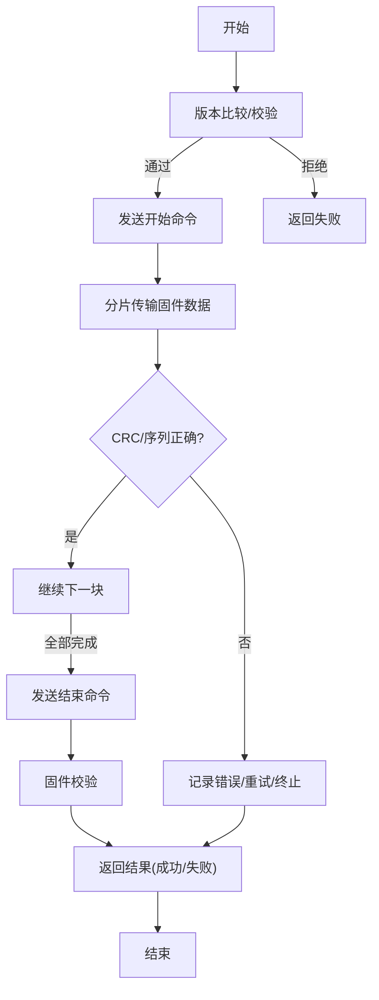
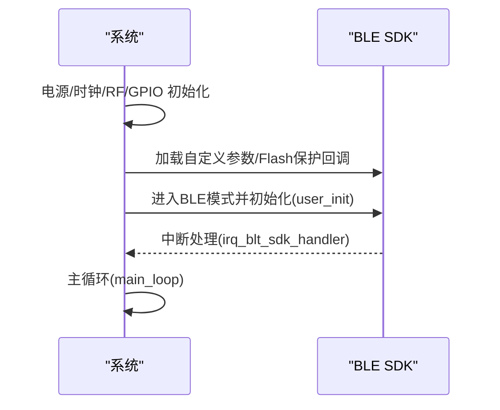
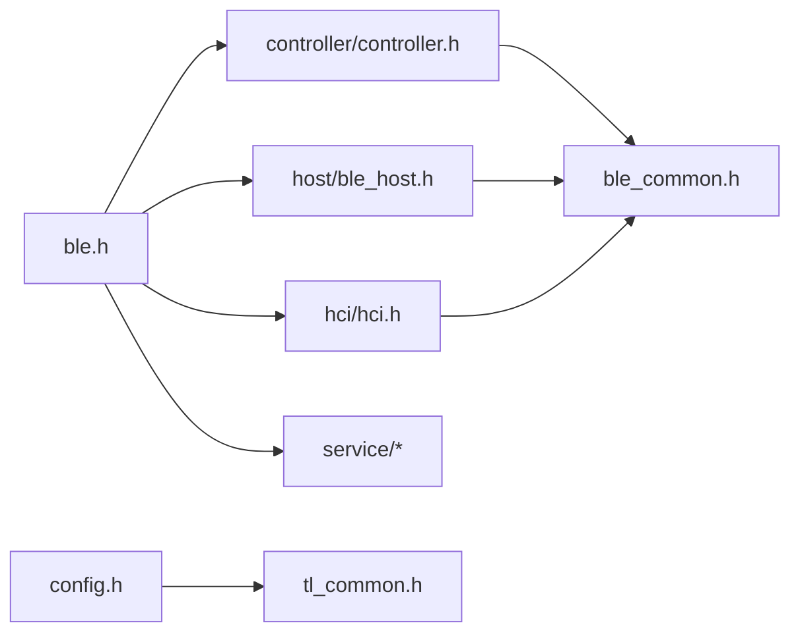

# BLE协议栈设计

<cite>
**本文引用的文件**   
- [ble.h](file://tc_ble_single_sdk/stack/ble/ble.h)
- [ble_common.h](file://tc_ble_single_sdk/stack/ble/ble_common.h)
- [controller.h](file://tc_ble_single_sdk/stack/ble/controller/controller.h)
- [hci.h](file://tc_ble_single_sdk/stack/ble/hci/hci.h)
- [ble_host.h](file://tc_ble_single_sdk/stack/ble/host/ble_host.h)
- [gap.h](file://tc_ble_single_sdk/stack/ble/host/gap/gap.h)
- [gatt.h](file://tc_ble_single_sdk/stack/ble/host/attr/gatt.h)
- [ota.h](file://tc_ble_single_sdk/stack/ble/service/ota/ota.h)
- [multi_device.h](file://tc_ble_single_sdk/stack/ble/device/multi_device.h)
- [config.h](file://tc_ble_single_sdk/config.h)
- [tl_common.h](file://tc_ble_single_sdk/tl_common.h)
- [feature_gatt_security/main.c](file://tc_ble_single_sdk/vendor/ble_feature_test/feature_gatt_security/main.c)
- [AAA_main.c](file://tc_ble_single_sdk/vendor/827x_three_mode_mouse/AAA_main.c)
</cite>

## 目录
1. [简介](#简介)
2. [项目结构](#项目结构)
3. [核心组件](#核心组件)
4. [架构总览](#架构总览)
5. [详细组件分析](#详细组件分析)
6. [依赖关系分析](#依赖关系分析)
7. [性能考虑](#性能考虑)
8. [故障排查指南](#故障排查指南)
9. [结论](#结论)
10. [附录](#附录)

## 简介
本文件面向使用 Telink BLE SDK 的开发者，系统性阐述该 SDK 中 BLE 协议栈的架构与实现要点，覆盖控制器层、主机层、HCI 层的职责划分；GAP/GATT 服务原理；连接管理、安全机制（SMP）与 OTA 升级流程；BLE 状态机与事件处理机制；并提供设备初始化与连接建立的实际代码路径参考。同时给出多设备连接管理与资源分配策略，以及数据传输优化建议。

## 项目结构
该 SDK 将 BLE 协议栈按标准分层组织：
- 控制器层（Controller/LL）：负责射频链路、广播/扫描、连接建立、PHY/DLE/信道选择等底层控制。
- HCI 层：作为主机与控制器之间的抽象接口，统一命令/事件/ACL 数据收发。
- 主机层（Host）：包含 GAP、L2CAP、ATT/GATT、SMP 等高层协议。
- 服务与应用：提供 OTA、设备信息、HID 等服务，以及应用入口与示例。

图示来源
- [ble.h:28-44](file://tc_ble_single_sdk/stack/ble/ble.h#L28-L44)
- [hci.h:34-144](file://tc_ble_single_sdk/stack/ble/hci/hci.h#L34-L144)
- [controller.h:30-212](file://tc_ble_single_sdk/stack/ble/controller/controller.h#L30-L212)

章节来源
- [ble.h:28-44](file://tc_ble_single_sdk/stack/ble/ble.h#L28-L44)
- [hci.h:34-144](file://tc_ble_single_sdk/stack/ble/hci/hci.h#L34-L144)
- [controller.h:30-212](file://tc_ble_single_sdk/stack/ble/controller/controller.h#L30-L212)

## 核心组件
- 控制器层（Controller/LL）
  - 定义并分发 LL 事件（如连接、终止、数据长度交换、PHY 更新、信道映射请求/更新、参数更新等），供上层回调处理。
  - 提供复位、版本设置、初始化检查等能力。
- HCI 层
  - 注册 RX/TX 处理器，处理 HCI 数据包，分发事件到主机层。
  - 支持 ACL 数据上送主机、事件掩码配置等。
- 主机层（Host）
  - GAP：外设/中心初始化、广播/扫描、发现模式、本地名、外观等 AD 类型。
  - L2CAP/ATT/GATT：属性协议封装，读写、通知/指示、批量操作等。
  - SMP：配对与安全（密钥、绑定、加密）。
- 服务与应用
  - OTA：扩展/传统 OTA 命令、结果码、CRC 校验、调度信息等。
  - 多设备：多本地设备索引、身份地址绑定与切换。
  - 示例：GATT 安全测试主循环、三模鼠标主程序入口等。

章节来源
- [controller.h:30-212](file://tc_ble_single_sdk/stack/ble/controller/controller.h#L30-L212)
- [hci.h:34-144](file://tc_ble_single_sdk/stack/ble/hci/hci.h#L34-L144)
- [gap.h:28-114](file://tc_ble_single_sdk/stack/ble/host/gap/gap.h#L28-L114)
- [gatt.h:32-208](file://tc_ble_single_sdk/stack/ble/host/attr/gatt.h#L32-L208)
- [ota.h:28-186](file://tc_ble_single_sdk/stack/ble/service/ota/ota.h#L28-L186)
- [multi_device.h:27-76](file://tc_ble_single_sdk/stack/ble/device/multi_device.h#L27-L76)

## 架构总览
下图展示从应用到射频的完整调用链与事件回传路径，体现控制器事件、HCI 事件、主机协议与服务之间的协作。

图示来源
- [hci.h:34-144](file://tc_ble_single_sdk/stack/ble/hci/hci.h#L34-L144)
- [controller.h:30-212](file://tc_ble_single_sdk/stack/ble/controller/controller.h#L30-L212)
- [gatt.h:32-208](file://tc_ble_single_sdk/stack/ble/host/attr/gatt.h#L32-L208)

## 详细组件分析

### 控制器层（LL）事件与状态机
- 事件类型
  - 广播/扫描响应、连接建立/终止、PHY 更新、数据长度交换、信道映射请求/更新、连接参数请求/更新、休眠进入/退出、版本指示等。
- 关键数据结构
  - 连接事件参数（发起端/广播端地址、接入码、窗口大小/偏移、间隔/延迟/超时、信道映射、跳频参数等）。
  - 数据长度交换参数（有效最大收发字节数、本地/远端最大收发字节数）。
  - 连接参数更新参数（新间隔/延迟/超时）。
- 状态机要点
  - 广播/扫描态 -> 连接建立 -> 连接态（可切换 PHY、DLE、信道映射、连接参数）。
  - 连接态可进入低功耗（休眠/唤醒）、可被远程或本地终止。
  - 事件驱动：控制器通过回调向主机上报事件，主机据此推进状态机。

图示来源
- [controller.h:30-212](file://tc_ble_single_sdk/stack/ble/controller/controller.h#L30-L212)

章节来源
- [controller.h:30-212](file://tc_ble_single_sdk/stack/ble/controller/controller.h#L30-L212)

### HCI 层职责与事件分发
- 职责
  - 注册 RX/TX 处理器，解析/封装 HCI 包。
  - 分发事件到主机层（包括 LE 事件掩码配置）。
  - 上送 ACL 数据给主机，支持自定义事件数据发送。
- 关键点
  - 事件掩码用于过滤感兴趣的事件。
  - 回调函数指针便于灵活对接不同平台（USB/UART 等）。

图示来源
- [hci.h:34-144](file://tc_ble_single_sdk/stack/ble/hci/hci.h#L34-L144)

章节来源
- [hci.h:34-144](file://tc_ble_single_sdk/stack/ble/hci/hci.h#L34-L144)

### 主机层 GAP 与连接管理
- GAP 角色
  - 外设（Peripheral）：广播、扫描响应、接受连接。
  - 中心（Central）：主动扫描、发起连接。
- 广播/扫描
  - 支持多种 AD 类型（标志、服务 UUID、本地名、外观、制造商特定数据等）。
- 连接生命周期
  - 建立连接后，进行 MTU 交换、DLE 协商、PHY 协商、连接参数更新。
  - 支持连接终止、休眠/唤醒。

图示来源
- [gap.h:28-114](file://tc_ble_single_sdk/stack/ble/host/gap/gap.h#L28-L114)
- [hci.h:34-144](file://tc_ble_single_sdk/stack/ble/hci/hci.h#L34-L144)
- [controller.h:30-212](file://tc_ble_single_sdk/stack/ble/controller/controller.h#L30-L212)

章节来源
- [gap.h:28-114](file://tc_ble_single_sdk/stack/ble/host/gap/gap.h#L28-L114)

### 主机层 GATT 服务与特征值操作
- 服务与特征
  - 通过 ATT/GATT 暴露服务与特征，支持读/写/通知/指示/批量操作。
- 常用 API
  - 推送通知/指示、请求写入（有/无响应）、发现信息、按类型查找、读取/批量读取、准备写入与执行写入、错误响应等。
- 优化点
  - 合理设置 MTU 与 DLE，减少分包次数。
  - 使用批量读取/通知提升吞吐。

图示来源
- [gatt.h:32-208](file://tc_ble_single_sdk/stack/ble/host/attr/gatt.h#L32-L208)
- [hci.h:34-144](file://tc_ble_single_sdk/stack/ble/hci/hci.h#L34-L144)

章节来源
- [gatt.h:32-208](file://tc_ble_single_sdk/stack/ble/host/attr/gatt.h#L32-L208)

### 安全机制（SMP）与配对
- 功能范围
  - 简单配对、密钥生成与存储、加密、绑定、安全级别控制。
- 集成点
  - 主机层通过 ble_host.h 暴露 SMP 相关头文件，配合 GAP 连接流程触发配对。
- 注意事项
  - 确保 MTU 满足安全连接要求（例如 ≥65）。
  - 合理配置绑定数量与存储。

章节来源
- [ble_host.h:27-51](file://tc_ble_single_sdk/stack/ble/host/ble_host.h#L27-L51)
- [ble_common.h:170-221](file://tc_ble_single_sdk/stack/ble/ble_common.h#L170-L221)

### OTA 升级功能
- 命令集
  - 传统与扩展 OTA 命令（开始/结束、版本查询/响应、结果、调度信息等）。
- 可靠性
  - CRC 校验（CRC16/CRC32）、序列号检查、超时保护、固件完整性校验。
- 流程
  - 客户端发起开始 -> 服务端返回调度信息 -> 传输固件块 -> 结束并校验 -> 返回结果。

图示来源
- [ota.h:28-186](file://tc_ble_single_sdk/stack/ble/service/ota/ota.h#L28-L186)

章节来源
- [ota.h:28-186](file://tc_ble_single_sdk/stack/ble/service/ota/ota.h#L28-L186)

### 多设备连接管理与资源分配
- 多本地设备
  - 支持多个本地设备索引与身份地址绑定，运行时可切换当前设备。
- 适用场景
  - 同一物理设备对外呈现多个 BLE 身份（如不同 MAC/角色）。
- 资源注意
  - 在 SMP 初始化前启用多设备功能，避免冲突。

章节来源
- [multi_device.h:27-76](file://tc_ble_single_sdk/stack/ble/device/multi_device.h#L27-L76)

### 代码级示例：设备初始化与连接建立
- 系统初始化
  - 电源/时钟/RF 初始化、GPIO、中断使能、主循环。
- BLE 初始化
  - 加载自定义参数、注册 Flash 保护回调、进入 BLE 模式后调用 user_init_normal/deepRetn。
- 事件处理
  - 中断中调用 BLE SDK 中断处理函数，主循环中运行 main_loop。

图示来源
- [feature_gatt_security/main.c:37-77](file://tc_ble_single_sdk/vendor/ble_feature_test/feature_gatt_security/main.c#L37-L77)
- [AAA_main.c:335-559](file://tc_ble_single_sdk/vendor/827x_three_mode_mouse/AAA_main.c#L335-L559)

章节来源
- [feature_gatt_security/main.c:37-77](file://tc_ble_single_sdk/vendor/ble_feature_test/feature_gatt_security/main.c#L37-L77)
- [AAA_main.c:335-559](file://tc_ble_single_sdk/vendor/827x_three_mode_mouse/AAA_main.c#L335-L559)

## 依赖关系分析
- 顶层入口
  - ble.h 聚合控制器、主机、HCI、服务等模块头文件，形成统一 SDK 入口。
- 公共定义
  - ble_common.h 定义错误码、地址类型、ATT/L2CAP/LL 常量等。
- 平台配置
  - config.h 定义芯片类型与 MCU 核心类型，影响编译分支。
- 通用库
  - tl_common.h 引入基础类型、工具、调试、Flash、LED、软定时器、SDP、自定义配对等。

图示来源
- [ble.h:28-44](file://tc_ble_single_sdk/stack/ble/ble.h#L28-L44)
- [ble_common.h:227-459](file://tc_ble_single_sdk/stack/ble/ble_common.h#L227-L459)
- [config.h:31-55](file://tc_ble_single_sdk/config.h#L31-L55)
- [tl_common.h:27-52](file://tc_ble_single_sdk/tl_common.h#L27-L52)

章节来源
- [ble.h:28-44](file://tc_ble_single_sdk/stack/ble/ble.h#L28-L44)
- [ble_common.h:227-459](file://tc_ble_single_sdk/stack/ble/ble_common.h#L227-L459)
- [config.h:31-55](file://tc_ble_single_sdk/config.h#L31-L55)
- [tl_common.h:27-52](file://tc_ble_single_sdk/tl_common.h#L27-L52)

## 性能考虑
- 连接参数优化
  - 根据应用场景调整连接间隔、延迟与超时，平衡功耗与实时性。
- DLE/MTU 协商
  - 尽早协商更大的 DLE/MTU，减少分包开销，提高吞吐。
- PHY 选择
  - 高吞吐选 2M PHY，远距离/抗干扰选 1M PHY。
- 广播与扫描
  - 合理设置广播间隔与扫描窗口，降低功耗并保证发现速度。
- 事件与中断
  - 在中断中仅做最小化处理，耗时逻辑放入主循环或任务队列。
- 内存与缓冲
  - 为 L2CAP/ATT 分配足够缓冲，避免 MTU 不匹配导致的错误。

[本节为通用指导，无需具体文件引用]

## 故障排查指南
- 常见错误码
  - HCI 错误：未知命令、连接超时、认证失败、连接限制等。
  - LL 错误：未建立连接、FIFO 不足、加密忙、无效参数等。
  - L2CAP/ATT/GATT/SMP 错误：无效参数、通道不可用、MTU 不匹配、配对忙等。
- 定位步骤
  - 检查初始化顺序与返回值（控制器/主机初始化检查）。
  - 查看事件掩码是否屏蔽了关键事件。
  - 核对 MTU/DLE/PHY 协商结果与对端一致性。
  - 结合日志与串口打印定位问题阶段。

章节来源
- [ble_common.h:31-221](file://tc_ble_single_sdk/stack/ble/ble_common.h#L31-L221)

## 结论
该 BLE 协议栈采用清晰的分层架构，控制器层专注射频与链路控制，HCI 层提供统一接口，主机层实现 GAP/GATT/SMP 等协议，服务层提供 OTA 等增值能力。通过事件驱动的状态机与回调机制，系统具备良好的可扩展性与可维护性。实际开发中应重点关注连接参数、DLE/MTU、PHY 的选择与优化，并结合示例代码快速搭建设备初始化与连接流程。

[本节为总结性内容，无需具体文件引用]

## 附录
- 典型 API 路径参考
  - 控制器事件与回调：[controller.h:30-212](file://tc_ble_single_sdk/stack/ble/controller/controller.h#L30-L212)
  - HCI 命令/事件/ACL：[hci.h:34-144](file://tc_ble_single_sdk/stack/ble/hci/hci.h#L34-L144)
  - GAP 初始化与 AD 类型：[gap.h:28-114](file://tc_ble_single_sdk/stack/ble/host/gap/gap.h#L28-L114)
  - GATT 读写/通知/指示：[gatt.h:32-208](file://tc_ble_single_sdk/stack/ble/host/attr/gatt.h#L32-L208)
  - OTA 命令与结果：[ota.h:28-186](file://tc_ble_single_sdk/stack/ble/service/ota/ota.h#L28-L186)
  - 多设备索引与切换：[multi_device.h:27-76](file://tc_ble_single_sdk/stack/ble/device/multi_device.h#L27-L76)
  - 平台与芯片配置：[config.h:31-55](file://tc_ble_single_sdk/config.h#L31-L55)
  - 通用库与调试：[tl_common.h:27-52](file://tc_ble_single_sdk/tl_common.h#L27-L52)
  - 示例主循环与初始化：[feature_gatt_security/main.c:37-77](file://tc_ble_single_sdk/vendor/ble_feature_test/feature_gatt_security/main.c#L37-L77), [AAA_main.c:335-559](file://tc_ble_single_sdk/vendor/827x_three_mode_mouse/AAA_main.c#L335-L559)

[本节为参考索引，无需额外说明]