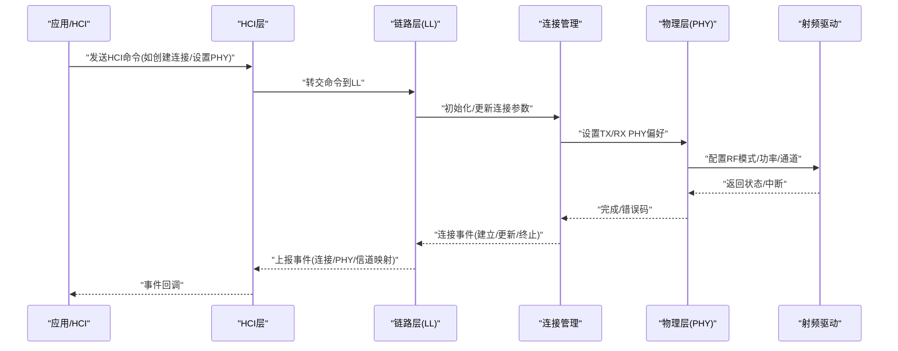
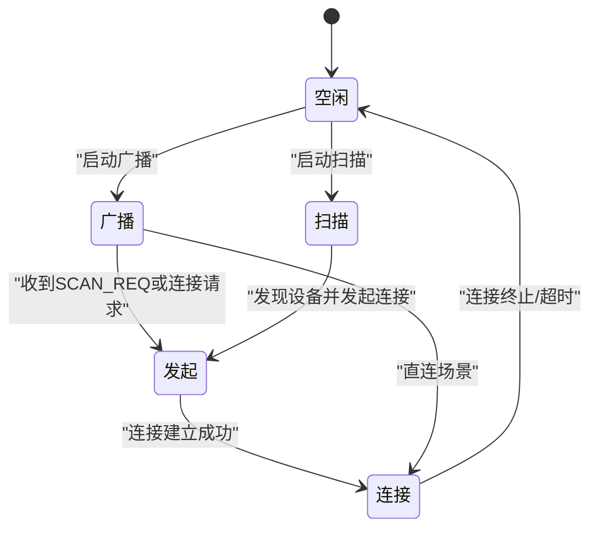
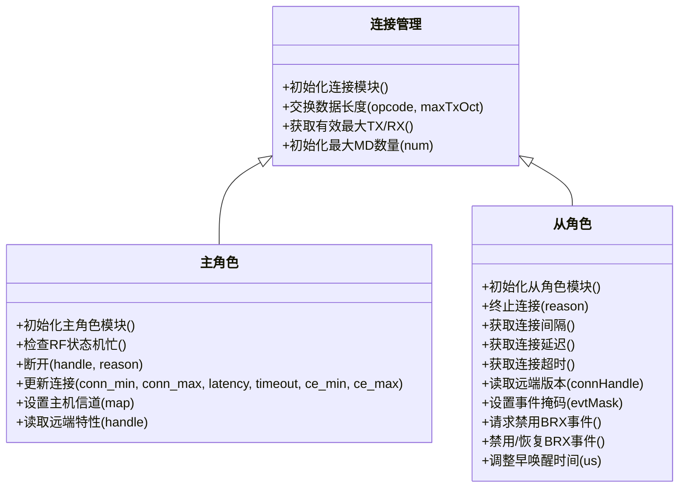
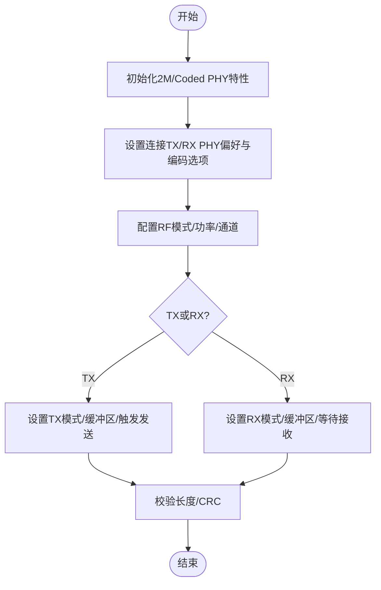
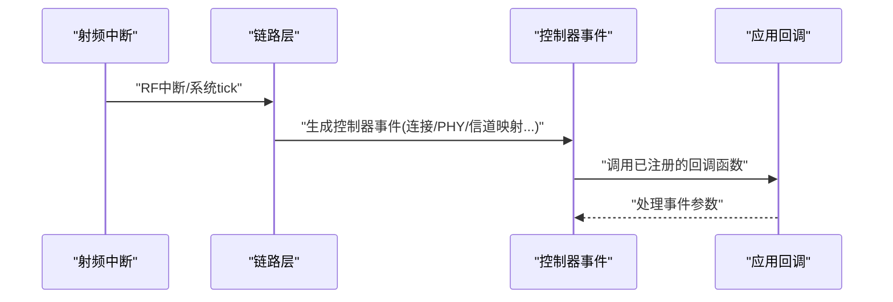
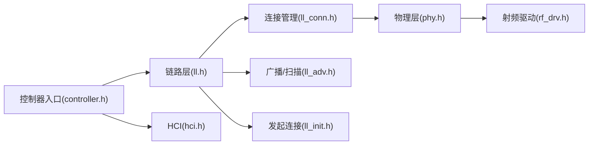

# BLE控制器层设计

<cite>
**本文引用的文件**
- [ble_controller.h](file://tc_ble_single_sdk/stack/ble/controller/ble_controller.h)
- [controller.h](file://tc_ble_single_sdk/stack/ble/controller/controller.h)
- [ll.h](file://tc_ble_single_sdk/stack/ble/controller/ll/ll.h)
- [ll_conn.h](file://tc_ble_single_sdk/stack/ble/controller/ll/ll_conn/ll_conn.h)
- [ll_master.h](file://tc_ble_single_sdk/stack/ble/controller/ll/ll_conn/ll_master.h)
- [ll_slave.h](file://tc_ble_single_sdk/stack/ble/controller/ll/ll_conn/ll_slave.h)
- [ll_conn_csa.h](file://tc_ble_single_sdk/stack/ble/controller/ll/ll_conn/ll_conn_csa.h)
- [phy.h](file://tc_ble_single_sdk/stack/ble/controller/phy/phy.h)
- [hci.h](file://tc_ble_single_sdk/stack/ble/hci/hci.h)
- [rf_drv.h](file://tc_ble_single_sdk/drivers/B85/lib/include/rf_drv.h)
- [ll_init.h](file://tc_ble_single_sdk/stack/ble/controller/ll/ll_init.h)
- [ll_adv.h](file://tc_ble_single_sdk/stack/ble/controller/ll/ll_adv.h)
- [ll_pm.h](file://tc_ble_single_sdk/stack/ble/controller/ll/ll_pm.h)
- [ble_common.h](file://tc_ble_single_sdk/stack/ble/ble_common.h)
</cite>

## 目录
1. [简介](#简介)
2. [项目结构](#项目结构)
3. [核心组件](#核心组件)
4. [架构总览](#架构总览)
5. [详细组件分析](#详细组件分析)
6. [依赖关系分析](#依赖关系分析)
7. [性能考量](#性能考量)
8. [故障排查指南](#故障排查指南)
9. [结论](#结论)
10. [附录](#附录)

## 简介
本文件面向BLE控制器层设计与实现，聚焦物理层、链路层与连接管理模块的职责划分，系统阐述射频通信、数据包处理、连接建立与维护机制；深入解析LL（Link Layer）状态机设计与事件处理流程；给出初始化与配置的关键API路径；说明射频参数配置、功率控制与频率跳频机制的实现要点；并解释多连接管理与资源分配策略。文档以Telink SDK中的BLE控制器代码为依据，提供可追溯的源码引用与图示。

## 项目结构
BLE控制器层位于SDK的stack/ble/controller目录下，按职责分层组织：
- 控制器入口与事件定义：controller.h、ble_controller.h
- 链路层（LL）：ll.h、ll_adv.h、ll_scan.h、ll_init.h、ll_whitelist.h、ll_resolvlist.h、ll_pm.h
- 连接管理：ll_conn/ll_conn.h、ll_master.h、ll_slave.h、ll_conn_csa.h
- 物理层（PHY）：phy/phy.h
- HCI接口：hci.h
- 射频驱动：drivers/*/lib/include/rf_drv.h（以B85为例）

```mermaid
graph TB
subgraph "控制器入口"
Ctl["controller.h<br/>事件与回调"]
BcH["ble_controller.h<br/>聚合头文件"]
end
subgraph "链路层"
LL["ll.h<br/>状态/主循环/中断"]
Adv["ll_adv.h<br/>广播/扫描"]
Init["ll_init.h<br/>发起连接"]
PM["ll_pm.h<br/>并发/功耗"]
end
subgraph "连接管理"
Conn["ll_conn.h<br/>连接句柄/数据长度"]
Master["ll_master.h<br/>主角色操作"]
Slave["ll_slave.h<br/>从角色操作"]
CSA["ll_conn_csa.h<br/>信道选择算法"]
end
subgraph "物理层"
PHY["phy.h<br/>PHY设置/特性"]
end
subgraph "HCI"
HCI["hci.h<br/>事件/收发回调"]
end
subgraph "射频驱动"
RF["rf_drv.h<br/>RF模式/功率/通道"]
end
BcH --> Ctl
Ctl --> LL
LL --> Adv
LL --> Init
LL --> PM
LL --> Conn
Conn --> Master
Conn --> Slave
Conn --> CSA
LL --> PHY
LL --> HCI
LL --> RF
```

**图表来源**
- [controller.h:30-63](file://tc_ble_single_sdk/stack/ble/controller/controller.h#L30-L63)
- [ll.h:31-71](file://tc_ble_single_sdk/stack/ble/controller/ll/ll.h#L31-L71)
- [ll_conn.h:28-82](file://tc_ble_single_sdk/stack/ble/controller/ll/ll_conn/ll_conn.h#L28-L82)
- [phy.h:30-60](file://tc_ble_single_sdk/stack/ble/controller/phy/phy.h#L30-L60)
- [hci.h:34-144](file://tc_ble_single_sdk/stack/ble/hci/hci.h#L34-L144)
- [rf_drv.h:130-156](file://tc_ble_single_sdk/drivers/B85/lib/include/rf_drv.h#L130-L156)

**章节来源**
- [ble_controller.h:28-59](file://tc_ble_single_sdk/stack/ble/controller/ble_controller.h#L28-L59)
- [controller.h:30-63](file://tc_ble_single_sdk/stack/ble/controller/controller.h#L30-L63)
- [ll.h:31-71](file://tc_ble_single_sdk/stack/ble/controller/ll/ll.h#L31-L71)

## 核心组件
- 控制器事件与回调：定义BLE控制器事件类型与参数结构，提供统一的事件上报机制，便于上层应用订阅连接、终止、PHY更新、信道映射等事件。
- 链路层（LL）：维护BLE链路状态机（空闲、广播、扫描、发起、连接），提供主循环与中断处理入口，封装MCU初始化、随机地址、RSSI读取、BRX忙检测等能力。
- 连接管理：抽象ACL连接句柄（主/从固定句柄简化设计）、数据长度交换、最大MD数量配置；主角色支持断开、参数更新、主机信道设置、远端特性读取；从角色支持终止连接、查询当前连接参数、读取远端版本等。
- 物理层（PHY）：启用2M/Coded PHY特性，设置连接的TX/RX偏好PHY及编码选项，默认编码指示。
- HCI层：注册事件处理器与收发回调，处理HCI命令/事件，向上层透传ACL数据。
- 射频驱动：提供RF模式初始化、功率级别设置、通道设置、收发状态切换、缓冲区配置、CRC/长度校验宏等底层能力。

**章节来源**
- [controller.h:30-182](file://tc_ble_single_sdk/stack/ble/controller/controller.h#L30-L182)
- [ll.h:31-197](file://tc_ble_single_sdk/stack/ble/controller/ll/ll.h#L31-L197)
- [ll_conn.h:28-82](file://tc_ble_single_sdk/stack/ble/controller/ll/ll_conn/ll_conn.h#L28-L82)
- [ll_master.h:30-101](file://tc_ble_single_sdk/stack/ble/controller/ll/ll_conn/ll_master.h#L30-L101)
- [ll_slave.h:34-167](file://tc_ble_single_sdk/stack/ble/controller/ll/ll_conn/ll_slave.h#L34-L167)
- [phy.h:30-60](file://tc_ble_single_sdk/stack/ble/controller/phy/phy.h#L30-L60)
- [hci.h:34-144](file://tc_ble_single_sdk/stack/ble/hci/hci.h#L34-L144)
- [rf_drv.h:474-503](file://tc_ble_single_sdk/drivers/B85/lib/include/rf_drv.h#L474-L503)

## 架构总览
BLE控制器采用分层架构：应用通过HCI与控制器交互；控制器将命令分发至LL模块；LL根据当前状态机调度广播、扫描、发起与连接任务；连接阶段由连接管理模块协调主/从角色行为；物理层负责具体射频收发与PHY配置；射频驱动直接操作硬件寄存器完成调制解调、功率控制与通道切换。



**图表来源**
- [hci.h:47-144](file://tc_ble_single_sdk/stack/ble/hci/hci.h#L47-L144)
- [ll.h:42-71](file://tc_ble_single_sdk/stack/ble/controller/ll/ll.h#L42-L71)
- [ll_conn.h:44-82](file://tc_ble_single_sdk/stack/ble/controller/ll/ll_conn/ll_conn.h#L44-L82)
- [phy.h:30-60](file://tc_ble_single_sdk/stack/ble/controller/phy/phy.h#L30-L60)
- [rf_drv.h:474-503](file://tc_ble_single_sdk/drivers/B85/lib/include/rf_drv.h#L474-L503)

## 详细组件分析

### 链路层（LL）状态机与事件处理
- 状态定义：空闲、广播、扫描、发起、连接五种状态位，用于描述当前链路层工作模式。
- 中断与主循环：提供中断处理入口与主循环函数，处理系统tick与RF中断，驱动状态迁移与事件派发。
- 基础初始化：提供MCU初始化、待机模块初始化、随机地址设置、BD地址读取、RSSI获取、BRX忙检测、自定义访问码设置、缓冲区读取等能力。
- 隐私与闪存保护：支持本地RPA初始化与安全写入闪存状态以避免RF中断被干扰。



**图表来源**
- [ll.h:31-71](file://tc_ble_single_sdk/stack/ble/controller/ll/ll.h#L31-L71)

**章节来源**
- [ll.h:31-197](file://tc_ble_single_sdk/stack/ble/controller/ll/ll.h#L31-L197)

### 连接管理模块（主/从角色）
- 连接句柄：为单连接SDK提供固定的主/从连接句柄常量，简化开发；在多连接SDK中需动态管理句柄。
- 数据长度交换：支持交换有效最大TX/RX字节数，查询有效最大长度，配置最大MD数量。
- 主角色能力：检查RF状态机忙闲、发起断开、更新连接参数、设置主机信道、读取远端特性。
- 从角色能力：终止连接、查询当前连接间隔/延迟/超时、读取远端版本、设置事件掩码、请求禁用BRX事件、恢复BRX事件、调整早唤醒时间等。



**图表来源**
- [ll_conn.h:28-82](file://tc_ble_single_sdk/stack/ble/controller/ll/ll_conn/ll_conn.h#L28-L82)
- [ll_master.h:30-101](file://tc_ble_single_sdk/stack/ble/controller/ll/ll_conn/ll_master.h#L30-L101)
- [ll_slave.h:34-167](file://tc_ble_single_sdk/stack/ble/controller/ll/ll_conn/ll_slave.h#L34-L167)

**章节来源**
- [ll_conn.h:28-82](file://tc_ble_single_sdk/stack/ble/controller/ll/ll_conn/ll_conn.h#L28-L82)
- [ll_master.h:30-101](file://tc_ble_single_sdk/stack/ble/controller/ll/ll_conn/ll_master.h#L30-L101)
- [ll_slave.h:34-167](file://tc_ble_single_sdk/stack/ble/controller/ll/ll_conn/ll_slave.h#L34-L167)

### 物理层（PHY）与射频参数配置
- PHY特性初始化：启用2M/Coded PHY特性。
- 连接PHY设置：为指定连接设置所有PHY偏好、TX/RX偏好以及编码选项。
- 默认编码指示：设置LE Coded PHY的S2/S8偏好或无特定偏好。
- 射频驱动能力：
  - 模式初始化：支持BLE 1M/2M、长距离S2/S8、私有协议等模式。
  - 功率控制：提供功率级别枚举与索引列表，支持设置/读取发射功率。
  - 通道设置：设置RF通道，配合跳频使用。
  - 收发状态：进入TX/RX/Auto模式，配置缓冲区，判断收发完成与正确性。
  - 校验宏：不同速率下的包长度与CRC校验宏，确保数据完整性。



**图表来源**
- [phy.h:30-60](file://tc_ble_single_sdk/stack/ble/controller/phy/phy.h#L30-L60)
- [rf_drv.h:474-503](file://tc_ble_single_sdk/drivers/B85/lib/include/rf_drv.h#L474-L503)
- [rf_drv.h:640-680](file://tc_ble_single_sdk/drivers/B85/lib/include/rf_drv.h#L640-L680)
- [rf_drv.h:777-800](file://tc_ble_single_sdk/drivers/B85/lib/include/rf_drv.h#L777-L800)

**章节来源**
- [phy.h:30-60](file://tc_ble_single_sdk/stack/ble/controller/phy/phy.h#L30-L60)
- [rf_drv.h:130-156](file://tc_ble_single_sdk/drivers/B85/lib/include/rf_drv.h#L130-L156)
- [rf_drv.h:181-257](file://tc_ble_single_sdk/drivers/B85/lib/include/rf_drv.h#L181-L257)
- [rf_drv.h:474-503](file://tc_ble_single_sdk/drivers/B85/lib/include/rf_drv.h#L474-L503)
- [rf_drv.h:640-680](file://tc_ble_single_sdk/drivers/B85/lib/include/rf_drv.h#L640-L680)
- [rf_drv.h:777-800](file://tc_ble_single_sdk/drivers/B85/lib/include/rf_drv.h#L777-L800)

### 广播与扫描（辅助链路）
- 广播类型与地址类型设置：支持设置广播类型、地址类型、直接广播初始地址类型等。
- 连接创建：提供发起连接、取消创建、设置创建连接超时等能力。
- 连接时间戳：获取连接创建时间戳，便于调试与统计。

**章节来源**
- [ll_adv.h:137-193](file://tc_ble_single_sdk/stack/ble/controller/ll/ll_adv.h#L137-L193)
- [ll_init.h:29-82](file://tc_ble_single_sdk/stack/ble/controller/ll/ll_init.h#L29-L82)

### 事件处理流程（控制器事件）
- 事件类型：包括广播、扫描响应、连接建立、终止、PHY更新、数据长度交换、GPIO早唤醒、信道映射请求/更新、连接参数请求/更新、休眠进入/退出、版本指示、扫描请求、每通道ADV发送前事件等。
- 事件参数：每种事件携带对应参数结构，例如连接事件包含发起者地址、广播地址、接入码、窗口大小/偏移、连接间隔/延迟/超时、信道映射、跳频与SCA等。
- 回调注册：通过链路层事件回调注册函数，将控制器事件上报给应用层处理。



**图表来源**
- [controller.h:30-182](file://tc_ble_single_sdk/stack/ble/controller/controller.h#L30-L182)
- [ll.h:133-139](file://tc_ble_single_sdk/stack/ble/controller/ll/ll.h#L133-L139)

**章节来源**
- [controller.h:30-182](file://tc_ble_single_sdk/stack/ble/controller/controller.h#L30-L182)
- [ll.h:133-139](file://tc_ble_single_sdk/stack/ble/controller/ll/ll.h#L133-L139)

### 多连接管理与资源分配策略
- 单连接SDK：使用固定连接句柄（主/从）简化设计，避免动态句柄管理的复杂性。
- 多连接SDK：连接句柄需动态管理，注意资源分配与冲突避免。
- 数据长度与MTU：通过数据长度交换确定有效最大TX/RX字节数，结合L2CAP/ATT MTU缓冲配置，避免溢出与拥塞。
- BRX事件与闪存写保护：在连接状态下，必要时禁用BRX事件以避免Flash写状态影响RF中断，保证数据可靠性。

**章节来源**
- [ll_conn.h:28-82](file://tc_ble_single_sdk/stack/ble/controller/ll/ll_conn/ll_conn.h#L28-L82)
- [ll_slave.h:98-119](file://tc_ble_single_sdk/stack/ble/controller/ll/ll_conn/ll_slave.h#L98-L119)
- [ble_common.h:166-221](file://tc_ble_single_sdk/stack/ble/ble_common.h#L166-L221)

### 频率跳频与信道选择算法
- 信道映射：支持请求与更新信道映射，提供旧/新信道映射事件参数，便于上层监控与优化。
- 信道选择算法2：初始化CSA2特性，提升抗干扰与频谱利用率。
- 射频通道设置：通过驱动设置RF通道，配合跳频逻辑实现动态避障。

**章节来源**
- [controller.h:111-124](file://tc_ble_single_sdk/stack/ble/controller/controller.h#L111-L124)
- [ll_conn_csa.h:30-35](file://tc_ble_single_sdk/stack/ble/controller/ll/ll_conn/ll_conn_csa.h#L30-L35)
- [rf_drv.h:544-549](file://tc_ble_single_sdk/drivers/B85/lib/include/rf_drv.h#L544-L549)

## 依赖关系分析
- 控制器入口依赖链路层、HCI、PHY与射频驱动，形成自顶向下的调用链。
- 链路层依赖广播/扫描/发起/连接管理等子模块，并通过事件回调与上层解耦。
- 连接管理依赖PHY进行速率与编码配置，依赖射频驱动进行实际收发。
- HCI作为控制器与宿主之间的桥梁，屏蔽底层细节并提供统一事件/命令接口。



**图表来源**
- [controller.h:30-63](file://tc_ble_single_sdk/stack/ble/controller/controller.h#L30-L63)
- [ll.h:31-71](file://tc_ble_single_sdk/stack/ble/controller/ll/ll.h#L31-L71)
- [ll_conn.h:28-82](file://tc_ble_single_sdk/stack/ble/controller/ll/ll_conn/ll_conn.h#L28-L82)
- [phy.h:30-60](file://tc_ble_single_sdk/stack/ble/controller/phy/phy.h#L30-L60)
- [rf_drv.h:474-503](file://tc_ble_single_sdk/drivers/B85/lib/include/rf_drv.h#L474-L503)

**章节来源**
- [controller.h:30-63](file://tc_ble_single_sdk/stack/ble/controller/controller.h#L30-L63)
- [ll.h:31-71](file://tc_ble_single_sdk/stack/ble/controller/ll/ll.h#L31-L71)
- [ll_conn.h:28-82](file://tc_ble_single_sdk/stack/ble/controller/ll/ll_conn/ll_conn.h#L28-L82)
- [phy.h:30-60](file://tc_ble_single_sdk/stack/ble/controller/phy/phy.h#L30-L60)
- [rf_drv.h:474-503](file://tc_ble_single_sdk/drivers/B85/lib/include/rf_drv.h#L474-L503)

## 性能考量
- 中断与主循环：合理配置中断优先级与主循环调度，避免RF中断被长时间阻塞。
- 数据长度与缓冲：通过数据长度交换与MTU配置，减少分包与重传开销。
- BRX事件与闪存写：在连接状态下谨慎处理Flash写操作，必要时禁用BRX事件以降低误码率。
- 功率与范围：根据应用场景选择合适的发射功率，平衡功耗与覆盖范围。
- 信道选择与跳频：启用CSA2并动态更新信道映射，提升抗干扰能力。

[本节为通用指导，不直接分析具体文件]

## 故障排查指南
- 初始化错误：检查控制器初始化是否完整，确认ACL RX/TX缓冲配置满足最大数据长度要求。
- 连接失败：核查连接参数（间隔、延迟、超时）、PHY设置与信道映射是否正确。
- 数据丢失：确认BRX事件未受Flash写干扰，检查收发缓冲区与长度/CRC校验。
- 事件未上报：确认已注册控制器事件回调，检查事件掩码设置。
- 射频异常：验证RF模式、功率与通道设置，检查收发状态标志与完成标志。

**章节来源**
- [ble_common.h:166-221](file://tc_ble_single_sdk/stack/ble/ble_common.h#L166-L221)
- [controller.h:186-212](file://tc_ble_single_sdk/stack/ble/controller/controller.h#L186-L212)
- [ll.h:177-197](file://tc_ble_single_sdk/stack/ble/controller/ll/ll.h#L177-L197)
- [rf_drv.h:640-680](file://tc_ble_single_sdk/drivers/B85/lib/include/rf_drv.h#L640-L680)

## 结论
本设计以清晰的层次化架构实现了BLE控制器的物理层、链路层与连接管理功能。通过标准化的事件机制与模块化设计，确保了可扩展性与可维护性。结合射频驱动的精细控制与PHY配置，系统在功耗、范围与抗干扰方面具备良好表现。针对多连接与资源分配，提供了灵活的管理策略与优化手段。

[本节为总结，不直接分析具体文件]

## 附录
- 初始化与配置关键API路径（示例）：
  - 链路层基础初始化：blc_ll_initBasicMCU、blc_ll_initStandby_module
  - 连接模块初始化：blc_ll_initConnection_module
  - 主/从角色初始化：blc_ll_initMasterRoleSingleConn_module、blc_ll_initSlaveRole_module
  - 发起连接：blc_ll_createConnection、blc_ll_createConnectionCancel、blc_ll_setCreateConnectionTimeout
  - PHY设置：blc_ll_init2MPhyCodedPhy_feature、blc_ll_setPhy、blc_ll_setDefaultConnCodingIndication
  - 射频驱动：rf_drv_init、rf_set_power_level_index、rf_set_channel、rf_trx_state_set
  - 事件回调：bls_app_registerEventCallback、blc_hci_registerControllerEventHandler

**章节来源**
- [ll.h:58-71](file://tc_ble_single_sdk/stack/ble/controller/ll/ll.h#L58-L71)
- [ll_conn.h:44-82](file://tc_ble_single_sdk/stack/ble/controller/ll/ll_conn/ll_conn.h#L44-L82)
- [ll_master.h:30-35](file://tc_ble_single_sdk/stack/ble/controller/ll/ll_conn/ll_master.h#L30-L35)
- [ll_slave.h:34-39](file://tc_ble_single_sdk/stack/ble/controller/ll/ll_conn/ll_slave.h#L34-L39)
- [ll_init.h:29-82](file://tc_ble_single_sdk/stack/ble/controller/ll/ll_init.h#L29-L82)
- [phy.h:30-60](file://tc_ble_single_sdk/stack/ble/controller/phy/phy.h#L30-L60)
- [rf_drv.h:474-503](file://tc_ble_single_sdk/drivers/B85/lib/include/rf_drv.h#L474-L503)
- [controller.h:133-139](file://tc_ble_single_sdk/stack/ble/controller/controller.h#L133-L139)
- [hci.h:115-127](file://tc_ble_single_sdk/stack/ble/hci/hci.h#L115-L127)