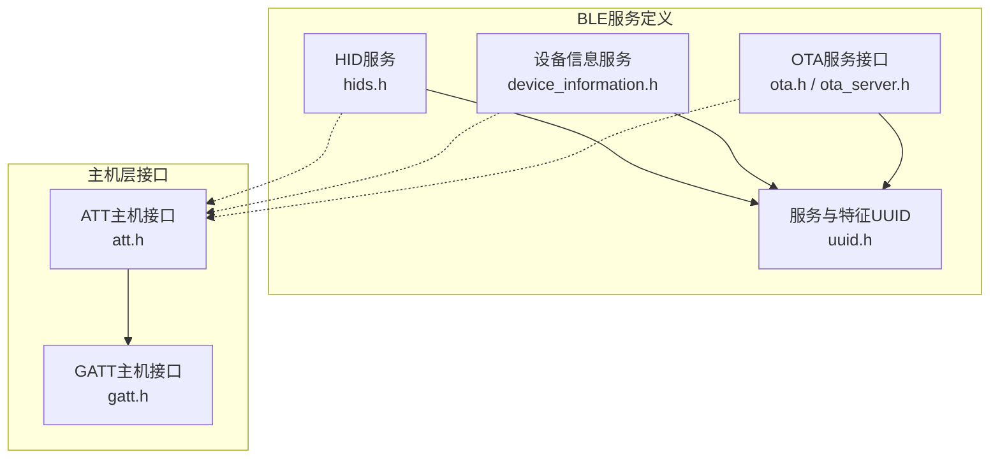
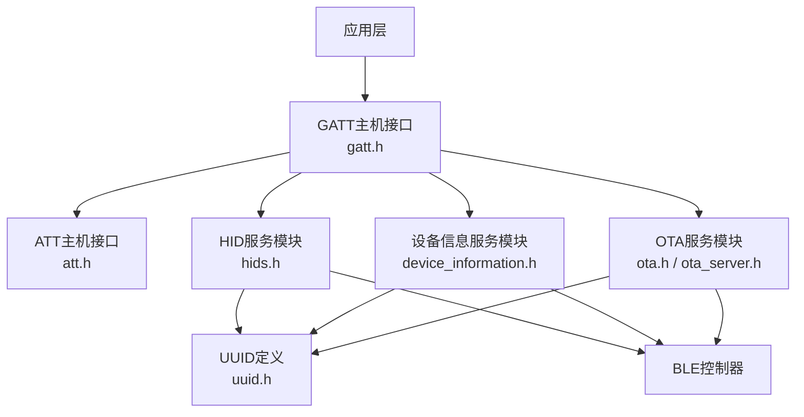
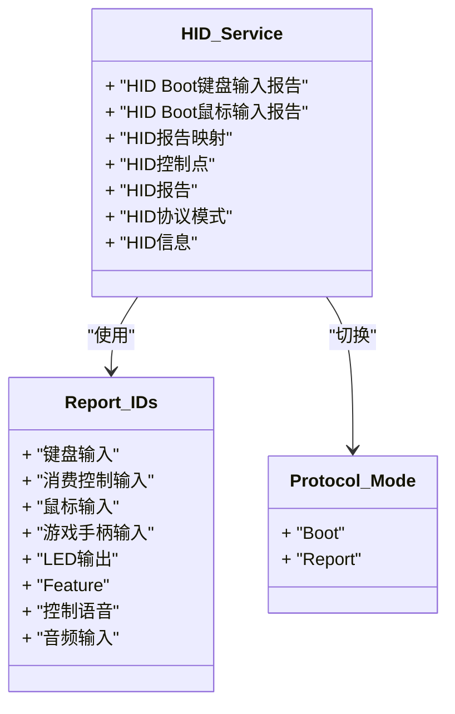
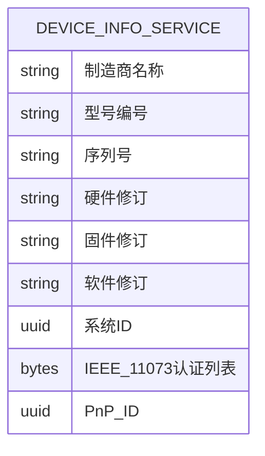
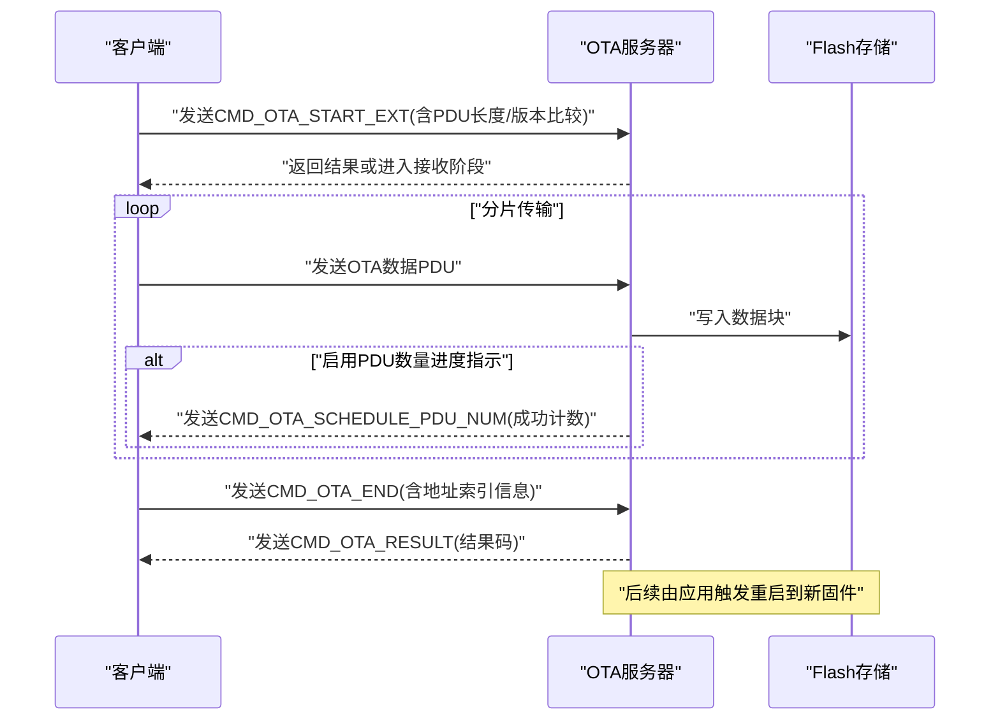
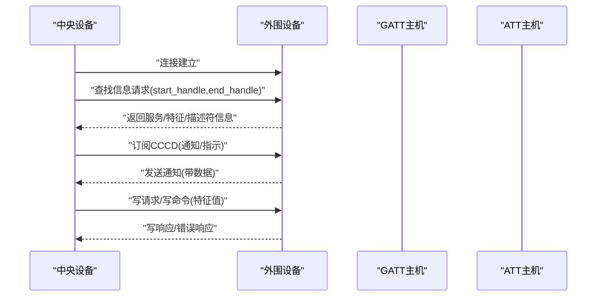
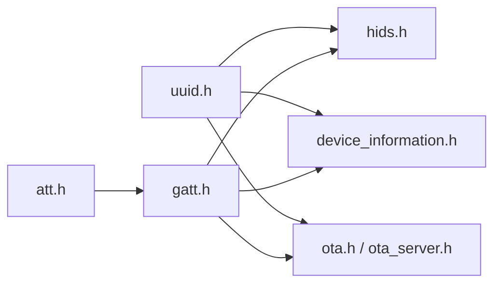

# BLE服务设计

<cite>
**本文引用的文件**
- [hids.h](file://tc_ble_single_sdk/stack/ble/service/hids.h)
- [device_information.h](file://tc_ble_single_sdk/stack/ble/service/device_information.h)
- [uuid.h](file://tc_ble_single_sdk/stack/ble/service/uuid.h)
- [ota.h](file://tc_ble_single_sdk/stack/ble/service/ota/ota.h)
- [ota_server.h](file://tc_ble_single_sdk/stack/ble/service/ota/ota_server.h)
- [att.h](file://tc_ble_single_sdk/stack/ble/host/attr/att.h)
- [gatt.h](file://tc_ble_single_sdk/stack/ble/host/attr/gatt.h)
</cite>

## 目录
1. [简介](#简介)
2. [项目结构](#项目结构)
3. [核心组件](#核心组件)
4. [架构总览](#架构总览)
5. [详细组件分析](#详细组件分析)
6. [依赖关系分析](#依赖关系分析)
7. [性能考虑](#性能考虑)
8. [故障排查指南](#故障排查指南)
9. [结论](#结论)
10. [附录](#附录)

## 简介
本文件面向BLE音频鼠标SDK中的BLE服务设计，系统性阐述标准服务与自定义服务的实现要点，包括HID服务、设备信息服务（Device Information Service, DIS）、OTA升级服务等。文档覆盖服务UUID定义、特征值结构与描述符配置、服务发现流程、特征值读写与通知订阅机制、服务间数据共享与事件传递、状态同步策略以及安全特性与权限控制。内容基于仓库中提供的头文件与接口声明进行归纳与可视化说明，便于开发者快速理解并正确集成。

## 项目结构
本项目在tc_ble_single_sdk/stack/ble/service目录下提供BLE服务相关的协议与接口定义：
- HID服务相关常量与报告ID定义位于hids.h
- 设备信息服务的特征UUID定义位于device_information.h
- 通用GATT服务与特征UUID、Telink自定义服务UUID定义位于uuid.h
- OTA服务命令、数据结构与结果码定义位于ota.h
- OTA服务端API与回调定义位于ota_server.h
- ATT/GATT主机层接口用于读写请求、错误响应等，位于att.h与gatt.h

图表来源
- [hids.h:27-85](file://tc_ble_single_sdk/stack/ble/service/hids.h#L27-L85)
- [device_information.h:27-39](file://tc_ble_single_sdk/stack/ble/service/device_information.h#L27-L39)
- [uuid.h:28-119](file://tc_ble_single_sdk/stack/ble/service/uuid.h#L28-L119)
- [ota.h:28-189](file://tc_ble_single_sdk/stack/ble/service/ota/ota.h#L28-L189)
- [ota_server.h:30-184](file://tc_ble_single_sdk/stack/ble/service/ota/ota_server.h#L30-L184)
- [att.h:224-265](file://tc_ble_single_sdk/stack/ble/host/attr/att.h#L224-L265)
- [gatt.h:62-209](file://tc_ble_single_sdk/stack/ble/host/attr/gatt.h#L62-L209)

章节来源
- [hids.h:27-85](file://tc_ble_single_sdk/stack/ble/service/hids.h#L27-L85)
- [device_information.h:27-39](file://tc_ble_single_sdk/stack/ble/service/device_information.h#L27-L39)
- [uuid.h:28-119](file://tc_ble_single_sdk/stack/ble/service/uuid.h#L28-L119)
- [ota.h:28-189](file://tc_ble_single_sdk/stack/ble/service/ota/ota.h#L28-L189)
- [ota_server.h:30-184](file://tc_ble_single_sdk/stack/ble/service/ota/ota_server.h#L30-L184)
- [att.h:224-265](file://tc_ble_single_sdk/stack/ble/host/attr/att.h#L224-L265)
- [gatt.h:62-209](file://tc_ble_single_sdk/stack/ble/host/attr/gatt.h#L62-L209)

## 核心组件
- HID服务：定义HID特征UUID、报告ID、协议模式与标志位，支持键盘、鼠标、消费控制、游戏手柄及音频输入等报告类型。
- 设备信息服务：提供制造商名称、型号、序列号、硬件/固件/软件版本、系统ID、PnP ID等标准特征。
- OTA服务：定义扩展与兼容的OTA命令、数据结构、结果码，并提供服务端初始化、版本设置、超时配置、进度指示、写Flash等API。
- ATT/GATT主机接口：提供写请求/命令、查找信息、读取多属性、错误响应等能力，支撑服务发现与数据交互。

章节来源
- [hids.h:27-85](file://tc_ble_single_sdk/stack/ble/service/hids.h#L27-L85)
- [device_information.h:27-39](file://tc_ble_single_sdk/stack/ble/service/device_information.h#L27-L39)
- [ota.h:28-189](file://tc_ble_single_sdk/stack/ble/service/ota/ota.h#L28-L189)
- [ota_server.h:30-184](file://tc_ble_single_sdk/stack/ble/service/ota/ota_server.h#L30-L184)
- [gatt.h:62-209](file://tc_ble_single_sdk/stack/ble/host/attr/gatt.h#L62-L209)
- [att.h:224-265](file://tc_ble_single_sdk/stack/ble/host/attr/att.h#L224-L265)

## 架构总览
下图展示BLE服务在主机层与控制器之间的交互关系，以及各服务模块的职责边界。应用通过GATT/ATT接口与服务模块交互；服务模块使用UUID定义构建SDP/GATT数据库；OTA服务通过回调与上层业务协同完成固件更新流程。

图表来源
- [gatt.h:62-209](file://tc_ble_single_sdk/stack/ble/host/attr/gatt.h#L62-L209)
- [att.h:224-265](file://tc_ble_single_sdk/stack/ble/host/attr/att.h#L224-L265)
- [hids.h:27-85](file://tc_ble_single_sdk/stack/ble/service/hids.h#L27-L85)
- [device_information.h:27-39](file://tc_ble_single_sdk/stack/ble/service/device_information.h#L27-L39)
- [ota.h:28-189](file://tc_ble_single_sdk/stack/ble/service/ota/ota.h#L28-L189)
- [ota_server.h:30-184](file://tc_ble_single_sdk/stack/ble/service/ota/ota_server.h#L30-L184)
- [uuid.h:28-119](file://tc_ble_single_sdk/stack/ble/service/uuid.h#L28-L119)

## 详细组件分析

### HID服务
- 服务与特征UUID：包含HID Boot输入/输出报告、HID信息、HID报告映射、HID控制点、HID报告、HID协议模式等标准特征。
- 报告ID：定义键盘输入、消费控制输入、鼠标输入、游戏手柄输入、LED输出、Feature、控制语音、音频输入等报告ID。
- 协议模式与标志：支持Boot与Report两种协议模式，支持远程唤醒与通常可连接标志。

图表来源
- [hids.h:27-85](file://tc_ble_single_sdk/stack/ble/service/hids.h#L27-L85)

章节来源
- [hids.h:27-85](file://tc_ble_single_sdk/stack/ble/service/hids.h#L27-L85)

### 设备信息服务（DIS）
- 标准特征：制造商名称字符串、型号编号字符串、序列号字符串、硬件修订、固件修订、软件修订、系统ID、IEEE 11073认证列表、PnP ID。
- 用途：向对端设备暴露设备基本信息，便于识别与配对显示。

图表来源
- [device_information.h:27-39](file://tc_ble_single_sdk/stack/ble/service/device_information.h#L27-L39)

章节来源
- [device_information.h:27-39](file://tc_ble_single_sdk/stack/ble/service/device_information.h#L27-L39)

### OTA服务
- 命令与数据结构：
  - 兼容命令：版本查询、开始、结束。
  - 扩展命令：开始扩展、固件版本请求/响应、结果、调度PDU数量、调度固件大小。
  - 结果码：涵盖数据包序列错误、无效包、CRC错误、Flash写入错误、数据不完整、流程错误、固件校验错误、版本比较错误、PDU长度错误、固件标记错误、固件大小错误、超时、连接终止、MCU不支持、逻辑错误等。
- 服务端API：
  - 初始化OTA服务器模块。
  - 设置最大固件尺寸与新固件启动地址。
  - 获取当前使用的多启动地址。
  - 设置固件版本号。
  - 注册OTA开始命令回调、固件版本请求回调、结果指示回调。
  - 设置OTA过程总超时与数据包间隔超时。
  - 设置按PDU数量的进度指示分辨率。
  - 设置ATT句柄偏移以区分写与通知句柄。
  - 将OTA数据写入Flash。

图表来源
- [ota.h:28-189](file://tc_ble_single_sdk/stack/ble/service/ota/ota.h#L28-L189)
- [ota_server.h:50-184](file://tc_ble_single_sdk/stack/ble/service/ota/ota_server.h#L50-L184)

章节来源
- [ota.h:28-189](file://tc_ble_single_sdk/stack/ble/service/ota/ota.h#L28-L189)
- [ota_server.h:50-184](file://tc_ble_single_sdk/stack/ble/service/ota/ota_server.h#L50-L184)

### 服务发现与特征值读写/通知订阅
- 服务发现：通过GATT查找信息请求遍历属性句柄与类型，建立服务-特征-描述符的映射。
- 读写操作：
  - 写命令（无响应）与写请求（需响应）。
  - 读取多属性与读取多变量。
  - 错误响应推送。
- 通知与指示：
  - 可通过主机层推送通知（如blc_gatt_pushHandleValueNotify），受服务器数据挂起时间影响。
  - 可配置拒绝写请求/读请求的能力，以便在服务端进行权限控制。

图表来源
- [gatt.h:62-209](file://tc_ble_single_sdk/stack/ble/host/attr/gatt.h#L62-L209)
- [att.h:224-265](file://tc_ble_single_sdk/stack/ble/host/attr/att.h#L224-L265)

章节来源
- [gatt.h:62-209](file://tc_ble_single_sdk/stack/ble/host/attr/gatt.h#L62-L209)
- [att.h:224-265](file://tc_ble_single_sdk/stack/ble/host/attr/att.h#L224-L265)

### 服务间数据共享、事件传递与状态同步
- 数据共享：不同服务可通过全局状态或消息队列共享数据（例如HID报告与音频输入共用同一报告通道时，通过报告ID区分）。
- 事件传递：OTA结果指示回调可用于向上层广播OTA进程事件；HID协议模式切换可触发上层状态机变化。
- 状态同步：通过GATT特征值（如HID协议模式、电池电量、设备信息）作为权威源，客户端定期读取或订阅变更，保持两端一致。

[本节为概念性说明，不直接分析具体文件]

### 安全特性与权限控制
- 读写拒绝：可启用ATT写请求拒绝与读请求拒绝，结合服务端回调实现细粒度权限控制。
- 设备名称设置：通过主机接口设置设备名，便于在配对过程中显示。
- OTA安全：通过版本比较、CRC校验、PDU长度检查、超时保护等手段保障OTA完整性与可靠性。

章节来源
- [att.h:224-265](file://tc_ble_single_sdk/stack/ble/host/attr/att.h#L224-L265)
- [ota.h:28-189](file://tc_ble_single_sdk/stack/ble/service/ota/ota.h#L28-L189)

## 依赖关系分析
- 服务模块依赖UUID定义：HID、DIS、OTA均引用uuid.h中的服务与特征UUID。
- 主机层接口被服务模块调用：GATT/ATT接口用于服务发现与数据交互。
- OTA模块依赖Flash写入能力：通过API将OTA数据写入指定地址。

图表来源
- [uuid.h:28-119](file://tc_ble_single_sdk/stack/ble/service/uuid.h#L28-L119)
- [hids.h:27-85](file://tc_ble_single_sdk/stack/ble/service/hids.h#L27-L85)
- [device_information.h:27-39](file://tc_ble_single_sdk/stack/ble/service/device_information.h#L27-L39)
- [ota.h:28-189](file://tc_ble_single_sdk/stack/ble/service/ota/ota.h#L28-L189)
- [ota_server.h:30-184](file://tc_ble_single_sdk/stack/ble/service/ota/ota_server.h#L30-L184)
- [gatt.h:62-209](file://tc_ble_single_sdk/stack/ble/host/attr/gatt.h#L62-L209)
- [att.h:224-265](file://tc_ble_single_sdk/stack/ble/host/attr/att.h#L224-L265)

章节来源
- [uuid.h:28-119](file://tc_ble_single_sdk/stack/ble/service/uuid.h#L28-L119)
- [gatt.h:62-209](file://tc_ble_single_sdk/stack/ble/host/attr/gatt.h#L62-L209)
- [att.h:224-265](file://tc_ble_single_sdk/stack/ble/host/attr/att.h#L224-L265)

## 性能考虑
- OTA分片大小与PDU长度：根据链路MTU与设备处理能力选择合适的PDU长度，避免频繁重传。
- 超时配置：合理设置OTA过程总超时与数据包间隔超时，平衡可靠性与时延。
- 通知频率：在高吞吐场景下降低通知频率，减少空中资源占用。
- 写请求拒绝：在拥塞或处理不过来时启用拒绝机制，防止缓冲区溢出。

[本节提供一般性指导，不直接分析具体文件]

## 故障排查指南
- OTA失败定位：
  - 检查结果码：数据包序列错误、无效包、CRC错误、Flash写入错误、数据不完整、流程错误、固件校验错误、版本比较错误、PDU长度错误、固件标记错误、固件大小错误、超时、连接终止、MCU不支持、逻辑错误。
  - 核对PDU长度与对齐要求，确保符合扩展开始命令声明。
  - 确认Flash写入地址与最大固件尺寸配置正确。
- 服务发现异常：
  - 检查GATT查找信息请求范围是否覆盖全部服务。
  - 确认服务UUID与特征UUID定义一致。
- 读写被拒：
  - 检查是否启用了写请求拒绝或读请求拒绝。
  - 确认权限策略与服务端回调逻辑。

章节来源
- [ota.h:47-77](file://tc_ble_single_sdk/stack/ble/service/ota/ota.h#L47-L77)
- [att.h:242-256](file://tc_ble_single_sdk/stack/ble/host/attr/att.h#L242-L256)
- [gatt.h:86-109](file://tc_ble_single_sdk/stack/ble/host/attr/gatt.h#L86-L109)

## 结论
本SDK提供了完善的BLE服务基础能力：HID服务满足人机交互需求，设备信息服务提供标准设备标识，OTA服务支持可靠固件升级。通过统一的UUID定义与主机层接口，服务间解耦清晰，易于扩展与维护。建议在实际项目中结合业务需求合理配置服务参数、权限策略与超时阈值，确保稳定性与用户体验。

[本节为总结性内容，不直接分析具体文件]

## 附录
- 关键API路径参考：
  - OTA初始化与配置：[ota_server.h:50-184](file://tc_ble_single_sdk/stack/ble/service/ota/ota_server.h#L50-L184)
  - OTA命令与结果码：[ota.h:28-189](file://tc_ble_single_sdk/stack/ble/service/ota/ota.h#L28-L189)
  - GATT读写与错误响应：[gatt.h:62-209](file://tc_ble_single_sdk/stack/ble/host/attr/gatt.h#L62-L209)
  - ATT拒绝与设备名设置：[att.h:224-265](file://tc_ble_single_sdk/stack/ble/host/attr/att.h#L224-L265)
  - HID报告与协议模式：[hids.h:27-85](file://tc_ble_single_sdk/stack/ble/service/hids.h#L27-L85)
  - 设备信息服务特征：[device_information.h:27-39](file://tc_ble_single_sdk/stack/ble/service/device_information.h#L27-L39)
  - 服务与特征UUID：[uuid.h:28-119](file://tc_ble_single_sdk/stack/ble/service/uuid.h#L28-L119)