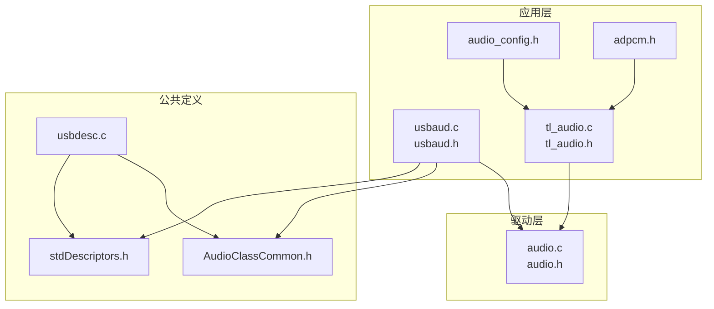
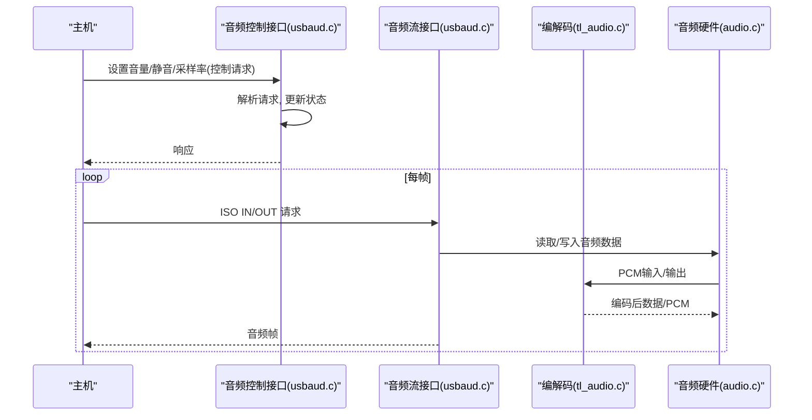
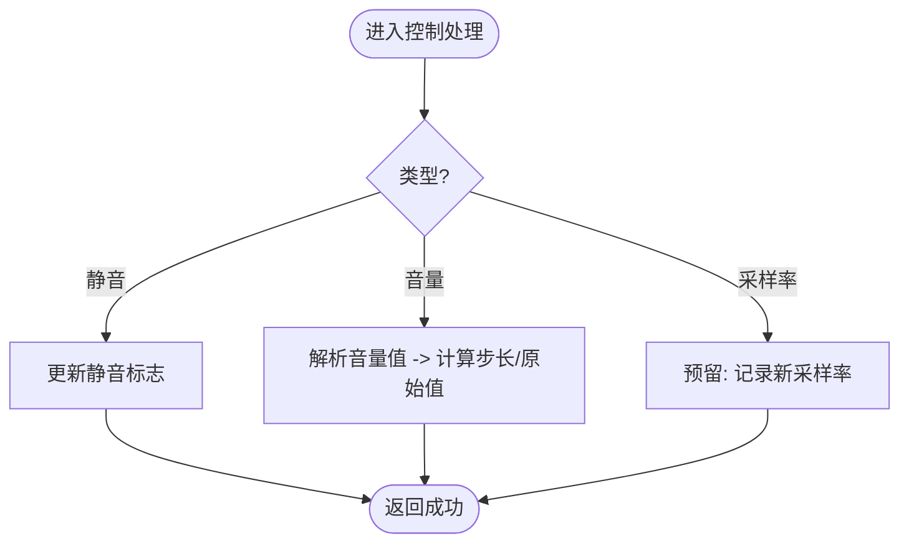
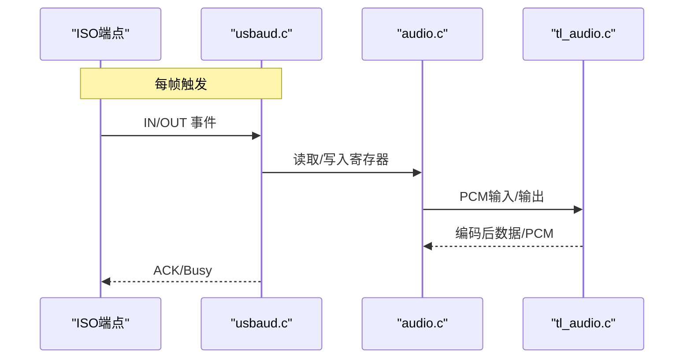
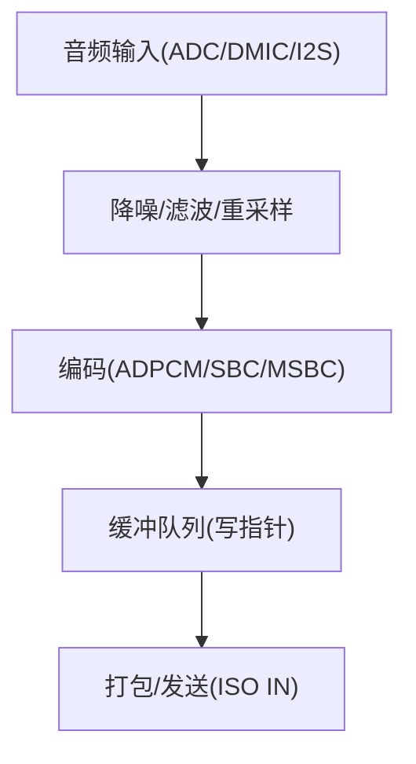
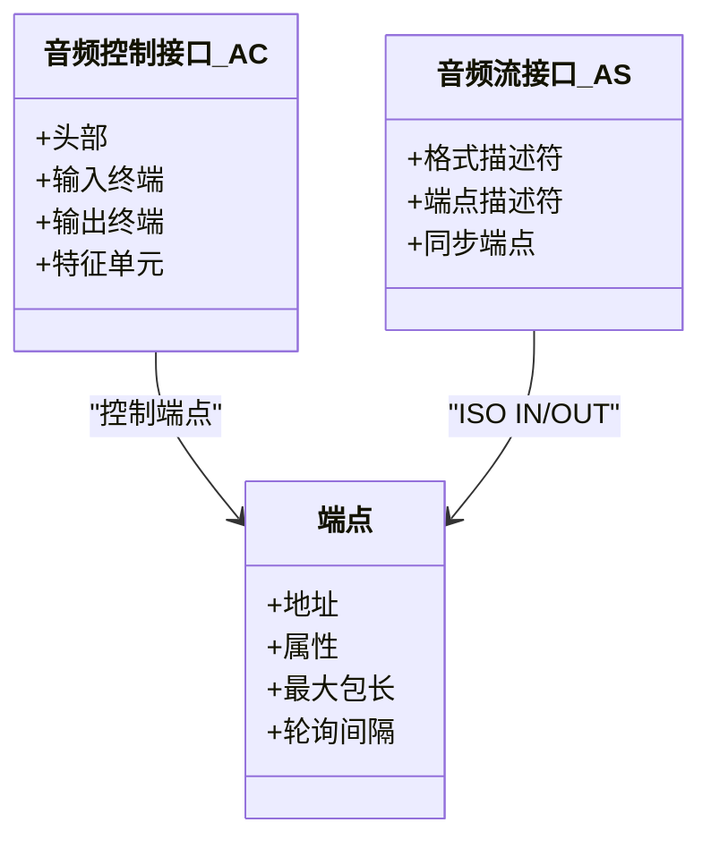
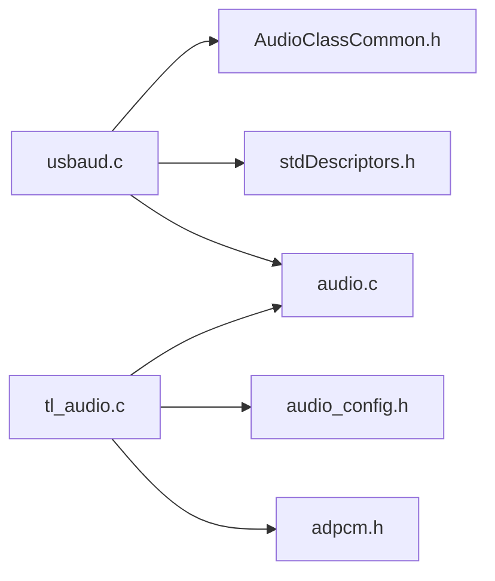

# Audio类驱动实现

<cite>
**本文引用的文件**
- [usbaud.h](file://tc_ble_single_sdk/application/app/usbaud.h)
- [usbaud.c](file://tc_ble_single_sdk/application/app/usbaud.c)
- [AudioClassCommon.h](file://tc_ble_single_sdk/application/usbstd/AudioClassCommon.h)
- [stdDescriptors.h](file://tc_ble_single_sdk/application/usbstd/stdDescriptors.h)
- [usbdesc.c](file://tc_ble_single_sdk/application/usbstd/usbdesc.c)
- [tl_audio.h](file://tc_ble_single_sdk/application/audio/tl_audio.h)
- [tl_audio.c](file://tc_ble_single_sdk/application/audio/tl_audio.c)
- [audio_config.h](file://tc_ble_single_sdk/application/audio/audio_config.h)
- [adpcm.h](file://tc_ble_single_sdk/application/audio/adpcm.h)
- [audio.h](file://tc_ble_single_sdk/drivers/B85/audio.h)
- [audio.c](file://tc_ble_single_sdk/drivers/B85/audio.c)
</cite>

## 目录
1. [简介](#简介)
2. [项目结构](#项目结构)
3. [核心组件](#核心组件)
4. [架构总览](#架构总览)
5. [详细组件分析](#详细组件分析)
6. [依赖关系分析](#依赖关系分析)
7. [性能考虑](#性能考虑)
8. [故障排查指南](#故障排查指南)
9. [结论](#结论)
10. [附录](#附录)

## 简介
本文件围绕该SDK中的USB音频设备（Audio Class）驱动实现，系统阐述以下要点：
- USB音频控制与数据流分离的设计思想与控制面/数据面职责划分
- 音频设备描述符的组织方式：音频控制接口、音频流接口与端点配置
- 采样率、位深度、通道数的配置与适配
- 音频数据采集、编码与传输流程（含ADPCM/SBC/MSBC等）
- 同步机制、缓冲区管理与延迟优化策略
- 兼容性要求与音质优化方法

## 项目结构
本项目将音频相关代码分为三层：
- 应用层：音频协议与上层逻辑（如Google语音、HID扩展等），以及USB音频控制命令处理
- 驱动层：MCU音频子系统（ADC/DMIC/I2S/DFIFO/SDM输出）、DMA/中断、端点收发
- 公共定义：USB标准与USB音频类描述符类型、常量与请求码

**图示来源**
- [usbaud.c:1-120](file://tc_ble_single_sdk/application/app/usbaud.c#L1-L120)
- [tl_audio.c:320-800](file://tc_ble_single_sdk/application/audio/tl_audio.c#L320-L800)
- [audio.c:80-200](file://tc_ble_single_sdk/drivers/B85/audio.c#L80-L200)
- [AudioClassCommon.h:120-355](file://tc_ble_single_sdk/application/usbstd/AudioClassCommon.h#L120-L355)
- [stdDescriptors.h:40-244](file://tc_ble_single_sdk/application/usbstd/stdDescriptors.h#L40-L244)
- [usbdesc.c:234-300](file://tc_ble_single_sdk/application/usbstd/usbdesc.c#L234-L300)

**章节来源**
- [usbaud.c:1-120](file://tc_ble_single_sdk/application/app/usbaud.c#L1-L120)
- [tl_audio.c:320-800](file://tc_ble_single_sdk/application/audio/tl_audio.c#L320-L800)
- [audio.c:80-200](file://tc_ble_single_sdk/drivers/B85/audio.c#L80-L200)
- [AudioClassCommon.h:120-355](file://tc_ble_single_sdk/application/usbstd/AudioClassCommon.h#L120-L355)
- [stdDescriptors.h:40-244](file://tc_ble_single_sdk/application/usbstd/stdDescriptors.h#L40-L244)
- [usbdesc.c:234-300](file://tc_ble_single_sdk/application/usbstd/usbdesc.c#L234-L300)

## 核心组件
- USB音频控制与状态管理：负责处理主机对音量、静音、采样率等控制请求，维护设备内部状态
- 音频采集与编码：从ADC/DMIC/I2S获取PCM，进行降噪、滤波、重采样与压缩编码（ADPCM/SBC/MSBC）
- USB数据流收发：通过ISO端点进行周期性音频数据传输，完成麦克风上行与扬声器下行
- 设备描述符：声明设备能力（接口、端点、格式、采样率等），使主机正确枚举与建立流

**章节来源**
- [usbaud.h:52-113](file://tc_ble_single_sdk/application/app/usbaud.h#L52-L113)
- [tl_audio.h:32-129](file://tc_ble_single_sdk/application/audio/tl_audio.h#L32-L129)
- [AudioClassCommon.h:120-355](file://tc_ble_single_sdk/application/usbstd/AudioClassCommon.h#L120-L355)

## 架构总览
USB音频采用“控制面+数据面”分离：
- 控制面：通过控制端点接收并解析音频类请求（音量、静音、采样率等），更新内部状态
- 数据面：通过ISO端点周期性地发送/接收音频帧，遵循USB音频类的时序与同步约束

**图示来源**
- [usbaud.c:162-215](file://tc_ble_single_sdk/application/app/usbaud.c#L162-L215)
- [usbaud.c:311-431](file://tc_ble_single_sdk/application/app/usbaud.c#L311-L431)
- [tl_audio.c:320-800](file://tc_ble_single_sdk/application/audio/tl_audio.c#L320-L800)
- [audio.c:80-200](file://tc_ble_single_sdk/drivers/B85/audio.c#L80-L200)

## 详细组件分析

### 组件A：USB音频控制接口（音量/静音/采样率）
- 功能：处理主机发来的音频类控制请求，包括静音开关、音量设置、当前/最小/最大/分辨率查询
- 关键数据结构：
  - 扬声器设置：当前音量、步长、静音标志
  - 麦克风设置：当前音量、步长、静音标志
- 关键流程：
  - 设置/获取音量：解析主机下发的值，转换为内部步长或原始值
  - 设置/获取静音：直接更新静音标志
  - 采样率设置：预留接口，便于后续扩展动态切换

**图示来源**
- [usbaud.c:162-215](file://tc_ble_single_sdk/application/app/usbaud.c#L162-L215)
- [usbaud.c:218-293](file://tc_ble_single_sdk/application/app/usbaud.c#L218-L293)

**章节来源**
- [usbaud.c:162-215](file://tc_ble_single_sdk/application/app/usbaud.c#L162-L215)
- [usbaud.c:218-293](file://tc_ble_single_sdk/application/app/usbaud.c#L218-L293)
- [usbaud.h:52-113](file://tc_ble_single_sdk/application/app/usbaud.h#L52-L113)

### 组件B：音频数据流收发（ISO端点）
- 功能：在ISO端点上周期性地进行音频数据的发送与接收
- 关键点：
  - 麦克风上行：按配置的速率读取音频数据，填充到ISO IN端点
  - 扬声器下行：从ISO OUT端点读取数据，写入音频DAC或I2S
  - 单声道/立体声模式：根据通道数配置端点行为

**图示来源**
- [usbaud.c:311-431](file://tc_ble_single_sdk/application/app/usbaud.c#L311-L431)
- [audio.c:80-200](file://tc_ble_single_sdk/drivers/B85/audio.c#L80-L200)

**章节来源**
- [usbaud.c:311-431](file://tc_ble_single_sdk/application/app/usbaud.c#L311-L431)
- [audio.c:80-200](file://tc_ble_single_sdk/drivers/B85/audio.c#L80-L200)

### 组件C：音频采集、编码与缓冲
- 采集路径：
  - ADC/DMIC/I2S输入，经DFIFO进入内存缓冲
  - 可选降噪、IIR滤波、重采样（32k→16k）
- 编码路径：
  - ADPCM：适用于低带宽场景
  - SBC/MSBC：适用于高质量语音
- 缓冲管理：
  - 环形缓冲读写指针，避免溢出与欠载
  - 多包缓冲队列，支持批量打包发送

**图示来源**
- [tl_audio.c:320-800](file://tc_ble_single_sdk/application/audio/tl_audio.c#L320-L800)
- [adpcm.h:27-45](file://tc_ble_single_sdk/application/audio/adpcm.h#L27-L45)
- [audio_config.h:28-123](file://tc_ble_single_sdk/application/audio/audio_config.h#L28-L123)

**章节来源**
- [tl_audio.c:320-800](file://tc_ble_single_sdk/application/audio/tl_audio.c#L320-L800)
- [adpcm.h:27-45](file://tc_ble_single_sdk/application/audio/adpcm.h#L27-L45)
- [audio_config.h:28-123](file://tc_ble_single_sdk/application/audio/audio_config.h#L28-L123)

### 组件D：设备描述符与接口组织
- 音频控制接口（AC）：
  - 包含头部、输入/输出终端、混音器/选择器/特征单元等
  - 用于承载控制请求（音量、静音、采样率）
- 音频流接口（AS）：
  - 包含格式描述符（采样率、位深、通道数）
  - 关联ISO端点（IN/OUT）及同步端点
- 端点属性：
  - 同步类型（自适应/同步/异步）
  - 最大包长、轮询间隔

**图示来源**
- [AudioClassCommon.h:147-355](file://tc_ble_single_sdk/application/usbstd/AudioClassCommon.h#L147-L355)
- [stdDescriptors.h:152-244](file://tc_ble_single_sdk/application/usbstd/stdDescriptors.h#L152-L244)
- [usbdesc.c:234-300](file://tc_ble_single_sdk/application/usbstd/usbdesc.c#L234-L300)

**章节来源**
- [AudioClassCommon.h:147-355](file://tc_ble_single_sdk/application/usbstd/AudioClassCommon.h#L147-L355)
- [stdDescriptors.h:152-244](file://tc_ble_single_sdk/application/usbstd/stdDescriptors.h#L152-L244)
- [usbdesc.c:234-300](file://tc_ble_single_sdk/application/usbstd/usbdesc.c#L234-L300)

## 依赖关系分析
- usbaud.c依赖AudioClassCommon.h与stdDescriptors.h以解析/构造描述符与请求
- tl_audio.c依赖audio_config.h确定编码参数与缓冲大小，依赖adpcm.h进行编码
- audio.c提供底层音频采集/输出能力，被usbaud.c与tl_audio.c调用

**图示来源**
- [usbaud.c:24-31](file://tc_ble_single_sdk/application/app/usbaud.c#L24-L31)
- [tl_audio.c:24-30](file://tc_ble_single_sdk/application/audio/tl_audio.c#L24-L30)
- [audio.c:24-31](file://tc_ble_single_sdk/drivers/B85/audio.c#L24-L31)

**章节来源**
- [usbaud.c:24-31](file://tc_ble_single_sdk/application/app/usbaud.c#L24-L31)
- [tl_audio.c:24-30](file://tc_ble_single_sdk/application/audio/tl_audio.c#L24-L30)
- [audio.c:24-31](file://tc_ble_single_sdk/drivers/B85/audio.c#L24-L31)

## 性能考虑
- 缓冲管理：
  - 使用环形缓冲与多包队列，减少CPU干预，降低抖动
  - 合理设置缓冲大小与包长度，平衡延迟与稳定性
- 编码选择：
  - ADPCM适合低功耗与低带宽；SBC/MSBC提供更高质量但占用更多带宽
- 同步机制：
  - 使用自适应同步端点，允许主机微调时钟，降低爆音/卡顿
- 延迟优化：
  - 缩短处理链路（降噪/滤波可裁剪），减少每帧处理时间
  - 合理设置轮询间隔与最大包长，提高吞吐

[本节为通用指导，不直接分析具体文件]

## 故障排查指南
- 无声音/无声：
  - 检查是否启用麦克风/扬声器通道，确认静音标志未置位
  - 验证ISO端点忙标志与ACK状态
- 爆音/卡顿：
  - 检查缓冲是否溢出或欠载，调整缓冲大小与包长
  - 确认同步端点工作正常，主机侧时钟匹配
- 控制命令无效：
  - 检查控制请求类型与特征单元ID是否正确
  - 确认音量范围与分辨率设置符合设备能力

**章节来源**
- [usbaud.c:162-215](file://tc_ble_single_sdk/application/app/usbaud.c#L162-L215)
- [usbaud.c:311-431](file://tc_ble_single_sdk/application/app/usbaud.c#L311-L431)
- [tl_audio.c:320-800](file://tc_ble_single_sdk/application/audio/tl_audio.c#L320-L800)

## 结论
该SDK的USB音频驱动实现了控制面与数据面的清晰分离，通过标准化的描述符与请求机制，兼容主流主机。音频采集与编码路径灵活可扩展，支持多种编码格式以满足不同质量与功耗需求。合理的缓冲与同步机制保障了稳定传输与较低延迟。实际部署中可根据应用场景裁剪处理链路与参数，进一步优化性能与兼容性。

[本节为总结性内容，不直接分析具体文件]

## 附录
- 采样率、位深度、通道数配置建议：
  - 语音通话：16kHz/16bit/单声道，ADPCM或SBC
  - 高保真播放：48kHz/16bit/立体声，SBC或更高码率
- 兼容性要求：
  - 遵循USB音频类规范，确保描述符完整与端点属性正确
  - 提供必要的字符串描述符与OS特性描述符以提升兼容性

[本节为补充信息，不直接分析具体文件]