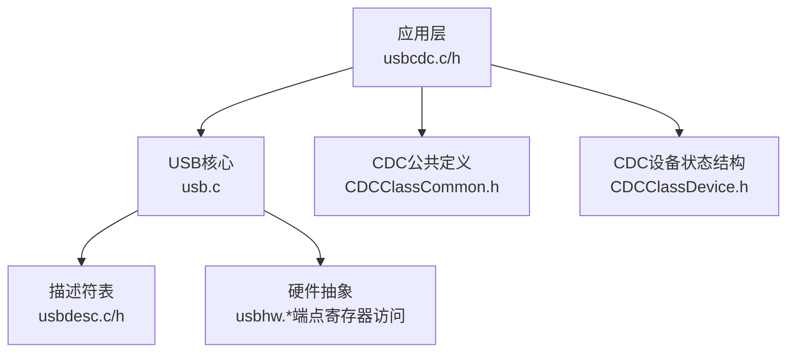
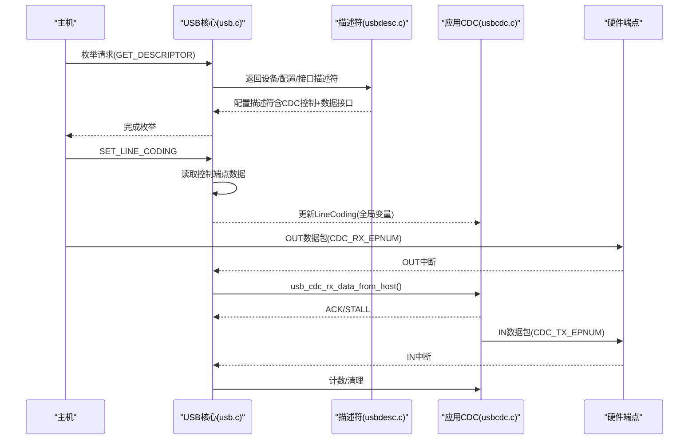
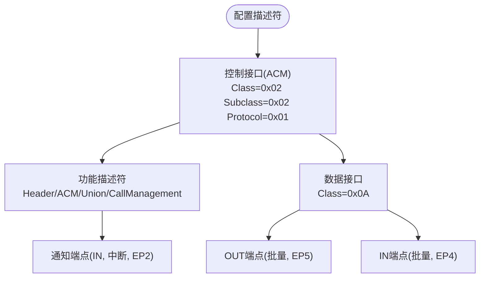
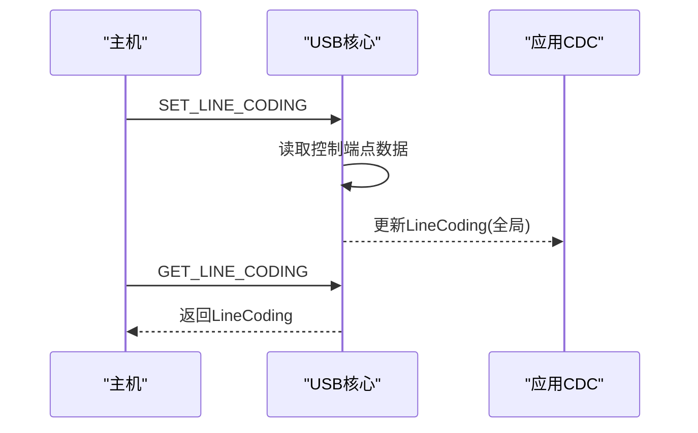
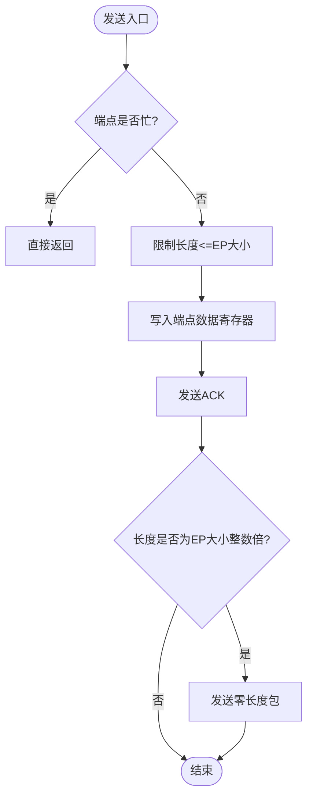
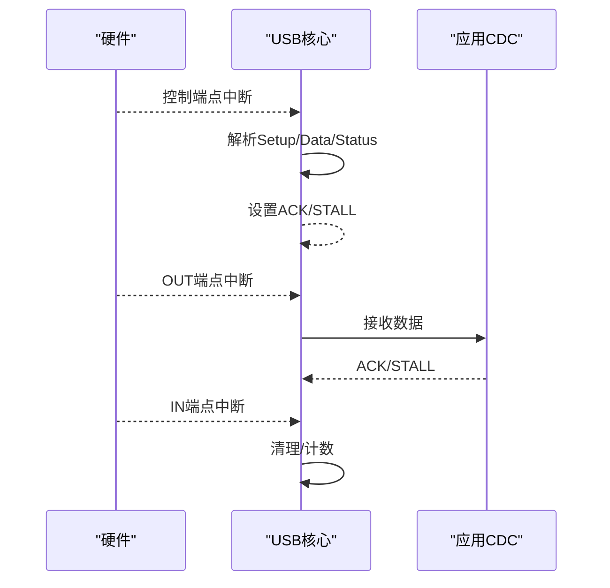
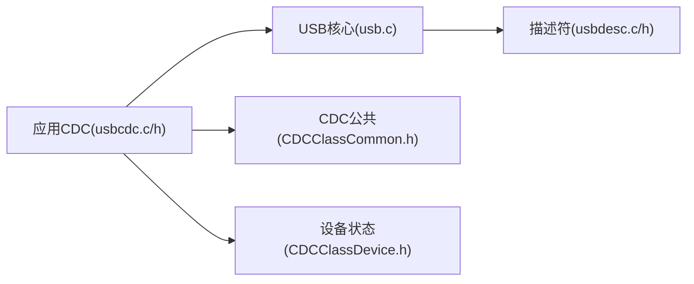

# CDC类驱动实现

<cite>
**本文引用的文件**
- [usbcdc.c](file://tc_ble_single_sdk/application/app/usbcdc.c)
- [usbcdc.h](file://tc_ble_single_sdk/application/app/usbcdc.h)
- [usbcdc_i.h](file://tc_ble_single_sdk/application/app/usbcdc_i.h)
- [CDCClassCommon.h](file://tc_ble_single_sdk/application/usbstd/CDCClassCommon.h)
- [CDCClassDevice.h](file://tc_ble_single_sdk/application/usbstd/CDCClassDevice.h)
- [usbdesc.c](file://tc_ble_single_sdk/application/usbstd/usbdesc.c)
- [usbdesc.h](file://tc_ble_single_sdk/application/usbstd/usbdesc.h)
- [usb.c](file://tc_ble_single_sdk/application/usbstd/usb.c)
</cite>

## 目录
1. [简介](#简介)
2. [项目结构](#项目结构)
3. [核心组件](#核心组件)
4. [架构总览](#架构总览)
5. [详细组件分析](#详细组件分析)
6. [依赖关系分析](#依赖关系分析)
7. [性能考虑](#性能考虑)
8. [故障排查指南](#故障排查指南)
9. [结论](#结论)
10. [附录](#附录)

## 简介
本文件围绕该SDK中的USB CDC（Communication Device Class）类驱动实现，系统阐述虚拟串口的组织方式、控制接口与数据接口的配置、端点映射、中断处理流程以及串口参数（波特率、校验位等）的获取与上报。同时说明当前实现为“ACM（抽象通信模型）”模式，未包含以太网CDC（ECM/NCM）相关描述符与协议栈，因此不提供网络连接的建立过程；若需以太网功能，需在描述符与协议栈层面扩展。文档还给出流控制、错误处理与性能优化建议，并附调试方法。

## 项目结构
CDC相关代码主要分布在应用层与USB标准库层：
- 应用层CDC实现：负责数据收发、LineCoding维护、端点操作
- USB标准库：负责设备枚举、描述符返回、控制请求分发、中断处理
- 描述符定义：声明CDC控制接口、通知端点、数据IN/OUT端点及Union/CallManagement等功能描述符

**图示来源**
- [usb.c:707-837](file://tc_ble_single_sdk/application/usbstd/usb.c#L707-L837)
- [usbdesc.c:304-409](file://tc_ble_single_sdk/application/usbstd/usbdesc.c#L304-L409)
- [usbcdc.c:42-93](file://tc_ble_single_sdk/application/app/usbcdc.c#L42-L93)
- [CDCClassCommon.h:122-175](file://tc_ble_single_sdk/application/usbstd/CDCClassCommon.h#L122-L175)
- [CDCClassDevice.h:35-61](file://tc_ble_single_sdk/application/usbstd/CDCClassDevice.h#L35-L61)

**章节来源**
- [usbdesc.c:304-409](file://tc_ble_single_sdk/application/usbstd/usbdesc.c#L304-L409)
- [usb.c:707-837](file://tc_ble_single_sdk/application/usbstd/usb.c#L707-L837)
- [usbcdc.c:42-93](file://tc_ble_single_sdk/application/app/usbcdc.c#L42-L93)

## 核心组件
- 应用层CDC接口
  - 发送数据到主机：检查端点忙、写入数据、必要时发送零长度包
  - 从主机接收数据：读取端点数据指针、拷贝到缓冲区、更新长度
  - LineCoding维护：默认值在应用层定义，由USB核心在SET_LINE_CODING时更新
- USB核心
  - 控制请求分发：处理GET/SET LINE CODING、GET SERIAL STATE等
  - 中断处理：CDC IN/OUT端点中断回调，ACK/STALL管理
- 描述符
  - 控制接口（ACM）、通知端点（中断）、数据接口（批量IN/OUT）
  - Union与CallManagement功能描述符用于绑定控制与数据接口

**章节来源**
- [usbcdc.c:42-93](file://tc_ble_single_sdk/application/app/usbcdc.c#L42-L93)
- [usb.c:351-557](file://tc_ble_single_sdk/application/usbstd/usb.c#L351-L557)
- [usbdesc.c:304-409](file://tc_ble_single_sdk/application/usbstd/usbdesc.c#L304-L409)

## 架构总览
下图展示了CDC设备从主机枚举到数据收发的整体流程，包括控制接口与数据接口的交互。

**图示来源**
- [usbdesc.c:304-409](file://tc_ble_single_sdk/application/usbstd/usbdesc.c#L304-L409)
- [usb.c:351-557](file://tc_ble_single_sdk/application/usbstd/usb.c#L351-L557)
- [usb.c:1004-1031](file://tc_ble_single_sdk/application/usbstd/usb.c#L1004-L1031)
- [usbcdc.c:42-93](file://tc_ble_single_sdk/application/app/usbcdc.c#L42-L93)

## 详细组件分析

### CDC控制接口与数据接口组织
- 控制接口（ACM）
  - 类/子类/协议：CDC类、ACM子类、AT命令协议
  - 功能描述符：Header、ACM、Union、CallManagement
  - 通知端点：中断类型，用于上报串行状态（当前未使用）
- 数据接口
  - 批量OUT端点：主机→设备（RX）
  - 批量IN端点：设备→主机（TX）
- 端点编号
  - 通知端点：2
  - TX端点：4
  - RX端点：5
  - 端点大小：64字节

**图示来源**
- [usbdesc.c:304-409](file://tc_ble_single_sdk/application/usbstd/usbdesc.c#L304-L409)
- [usbdesc.h:262-274](file://tc_ble_single_sdk/application/usbstd/usbdesc.h#L262-L274)

**章节来源**
- [usbdesc.c:304-409](file://tc_ble_single_sdk/application/usbstd/usbdesc.c#L304-L409)
- [usbdesc.h:262-274](file://tc_ble_single_sdk/application/usbstd/usbdesc.h#L262-L274)

### 串口参数（LineCoding）与状态上报
- 默认LineCoding在应用层定义，包含波特率、停止位、校验位、数据位
- 主机通过SET_LINE_CODING下发新参数，USB核心读取控制端点数据并更新全局数组
- GET_LINE_CODING时，USB核心将当前LineCoding回传主机
- 串行状态上报（NOTIF_SERIAL_STATE）已预留但当前未使用

**图示来源**
- [usb.c:351-376](file://tc_ble_single_sdk/application/usbstd/usb.c#L351-L376)
- [usb.c:542-557](file://tc_ble_single_sdk/application/usbstd/usb.c#L542-L557)
- [usbcdc.c:31-35](file://tc_ble_single_sdk/application/app/usbcdc.c#L31-L35)

**章节来源**
- [usb.c:351-376](file://tc_ble_single_sdk/application/usbstd/usb.c#L351-L376)
- [usb.c:542-557](file://tc_ble_single_sdk/application/usbstd/usb.c#L542-L557)
- [usbcdc.c:31-35](file://tc_ble_single_sdk/application/app/usbcdc.c#L31-L35)

### 数据收发流程与端点管理
- 发送（IN）
  - 检查端点忙，避免重复提交
  - 限制单次发送长度不超过端点大小
  - 写满端点后，若长度为wMaxPacketSize整数倍，发送零长度包以结束数据阶段
- 接收（OUT）
  - 读取端点数据指针，拷贝到缓冲区
  - 更新接收长度，供上层处理
  - 在中断中ACK或STALL

**图示来源**
- [usbcdc.c:42-73](file://tc_ble_single_sdk/application/app/usbcdc.c#L42-L73)

**章节来源**
- [usbcdc.c:42-73](file://tc_ble_single_sdk/application/app/usbcdc.c#L42-L73)

### 中断处理与错误处理
- 控制端点中断：解析Setup/Data/Status阶段，分发到具体处理函数
- 数据端点中断：
  - IN端点：清除中断、重置指针、增加发送计数
  - OUT端点：调用接收函数，根据结果ACK或STALL
- 复位处理：确保CDC OUT端点先ACK，避免后续中断丢失

**图示来源**
- [usb.c:813-862](file://tc_ble_single_sdk/application/usbstd/usb.c#L813-L862)
- [usb.c:990-1031](file://tc_ble_single_sdk/application/usbstd/usb.c#L990-L1031)
- [usb.c:906-926](file://tc_ble_single_sdk/application/usbstd/usb.c#L906-L926)

**章节来源**
- [usb.c:813-862](file://tc_ble_single_sdk/application/usbstd/usb.c#L813-L862)
- [usb.c:990-1031](file://tc_ble_single_sdk/application/usbstd/usb.c#L990-L1031)
- [usb.c:906-926](file://tc_ble_single_sdk/application/usbstd/usb.c#L906-L926)

### SAM与EAM的区别与应用场景
- SAM（Serial Abstract Model，抽象通信模型）
  - 对应ACM子类，提供虚拟串口能力（LineCoding、控制线状态、Break等）
  - 适用于需要串口透传、调试日志、固件升级等场景
  - 本实现采用SAM（ACM），具备完整的数据通道与控制通道
- EAM（Ethernet Abstract Model，以太网抽象模型）
  - 对应ECM/NCM等以太网CDC子类，提供以太网帧透传
  - 适用于将USB设备作为以太网网卡使用
  - 本实现未包含EAM相关描述符与协议栈，如需以太网功能需扩展描述符与协议处理

**章节来源**
- [CDCClassCommon.h:55-104](file://tc_ble_single_sdk/application/usbstd/CDCClassCommon.h#L55-L104)
- [usbdesc.c:304-409](file://tc_ble_single_sdk/application/usbstd/usbdesc.c#L304-L409)

### 代码示例路径（非内容展示）
- 串口数据发送到主机：[发送函数路径:42-73](file://tc_ble_single_sdk/application/app/usbcdc.c#L42-L73)
- 串口数据从主机接收：[接收函数路径:81-93](file://tc_ble_single_sdk/application/app/usbcdc.c#L81-L93)
- LineCoding设置与获取：[设置路径:351-376](file://tc_ble_single_sdk/application/usbstd/usb.c#L351-L376)、[获取路径:542-557](file://tc_ble_single_sdk/application/usbstd/usb.c#L542-L557)
- 配置描述符（CDC控制+数据接口）：[描述符路径:304-409](file://tc_ble_single_sdk/application/usbstd/usbdesc.c#L304-L409)

## 依赖关系分析
- 应用层CDC模块依赖USB核心提供的控制请求分发与端点中断回调
- USB核心依赖描述符表进行枚举与配置
- CDC公共头文件定义了LineEncoding结构与功能描述符类型
- 设备状态结构体用于保存控制线与编码信息（当前未完全使用）

**图示来源**
- [usb.c:707-837](file://tc_ble_single_sdk/application/usbstd/usb.c#L707-L837)
- [usbdesc.c:304-409](file://tc_ble_single_sdk/application/usbstd/usbdesc.c#L304-L409)
- [CDCClassCommon.h:122-175](file://tc_ble_single_sdk/application/usbstd/CDCClassCommon.h#L122-L175)
- [CDCClassDevice.h:35-61](file://tc_ble_single_sdk/application/usbstd/CDCClassDevice.h#L35-L61)

**章节来源**
- [usb.c:707-837](file://tc_ble_single_sdk/application/usbstd/usb.c#L707-L837)
- [usbdesc.c:304-409](file://tc_ble_single_sdk/application/usbstd/usbdesc.c#L304-L409)
- [CDCClassCommon.h:122-175](file://tc_ble_single_sdk/application/usbstd/CDCClassCommon.h#L122-L175)
- [CDCClassDevice.h:35-61](file://tc_ble_single_sdk/application/usbstd/CDCClassDevice.h#L35-L61)

## 性能考虑
- 端点忙检测：发送前检查端点忙，避免覆盖未发送数据
- 零长度包：当发送长度为端点大小的整数倍时，发送零长度包以正确结束数据阶段
- 中断处理效率：及时ACK/STALL，减少主机等待时间
- 批量传输：数据接口使用批量端点，适合大数据量传输
- 缓冲策略：合理设计应用层缓冲，避免频繁小包发送

[本节为通用指导，不直接分析具体文件]

## 故障排查指南
- 主机无法识别CDC设备
  - 检查描述符是否正确（控制接口、数据接口、端点）
  - 确认USB_CDC_ENABLE宏启用
- 串口无数据
  - 检查OUT端点中断是否触发，ACK是否发送
  - 确认LineCoding设置成功
- 发送卡住
  - 检查端点忙标志，确认零长度包发送
  - 查看IN端点中断是否处理
- 复位后通信异常
  - 确保复位后对CDC OUT端点先ACK，避免中断丢失

**章节来源**
- [usb.c:906-926](file://tc_ble_single_sdk/application/usbstd/usb.c#L906-L926)
- [usb.c:1004-1031](file://tc_ble_single_sdk/application/usbstd/usb.c#L1004-L1031)
- [usbcdc.c:42-73](file://tc_ble_single_sdk/application/app/usbcdc.c#L42-L73)

## 结论
该SDK实现了基于ACM的CDC虚拟串口功能，包含完整的控制接口与数据接口描述符、LineCoding支持、端点中断处理与基本错误处理。当前未实现以太网CDC（EAM），如需网络功能需扩展描述符与协议栈。通过合理的缓冲与零长度包策略，可实现稳定高效的串口数据传输。

[本节为总结性内容，不直接分析具体文件]

## 附录
- 关键宏与端点
  - CDC_NOTIFICATION_EPNUM = 2
  - CDC_TX_EPNUM = 4
  - CDC_RX_EPNUM = 5
  - CDC_TXRX_EPSIZE = 64
- 数据结构
  - CDC_LineEncoding_t：波特率、停止位、校验位、数据位
  - USB_ClassInfo_CDC_Device_t：配置与状态信息

**章节来源**
- [usbcdc.h:38-59](file://tc_ble_single_sdk/application/app/usbcdc.h#L38-L59)
- [CDCClassCommon.h:122-175](file://tc_ble_single_sdk/application/usbstd/CDCClassCommon.h#L122-L175)
- [CDCClassDevice.h:35-61](file://tc_ble_single_sdk/application/usbstd/CDCClassDevice.h#L35-L61)