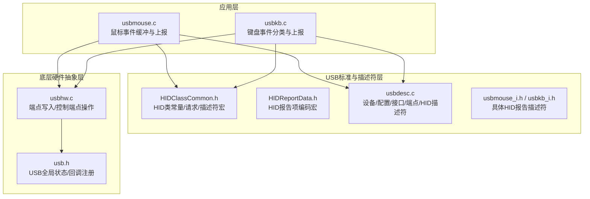
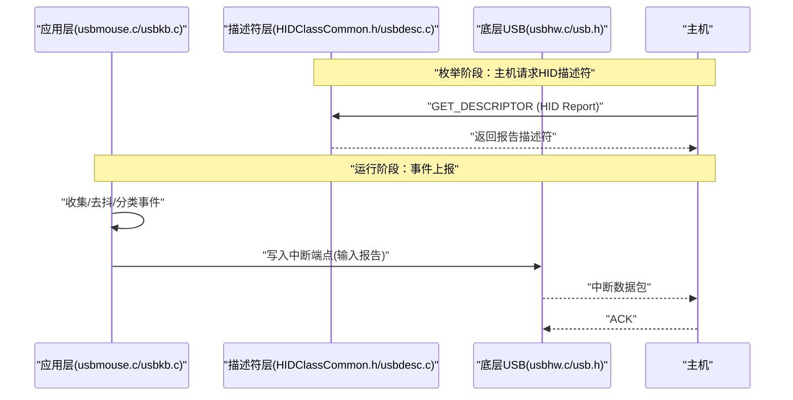
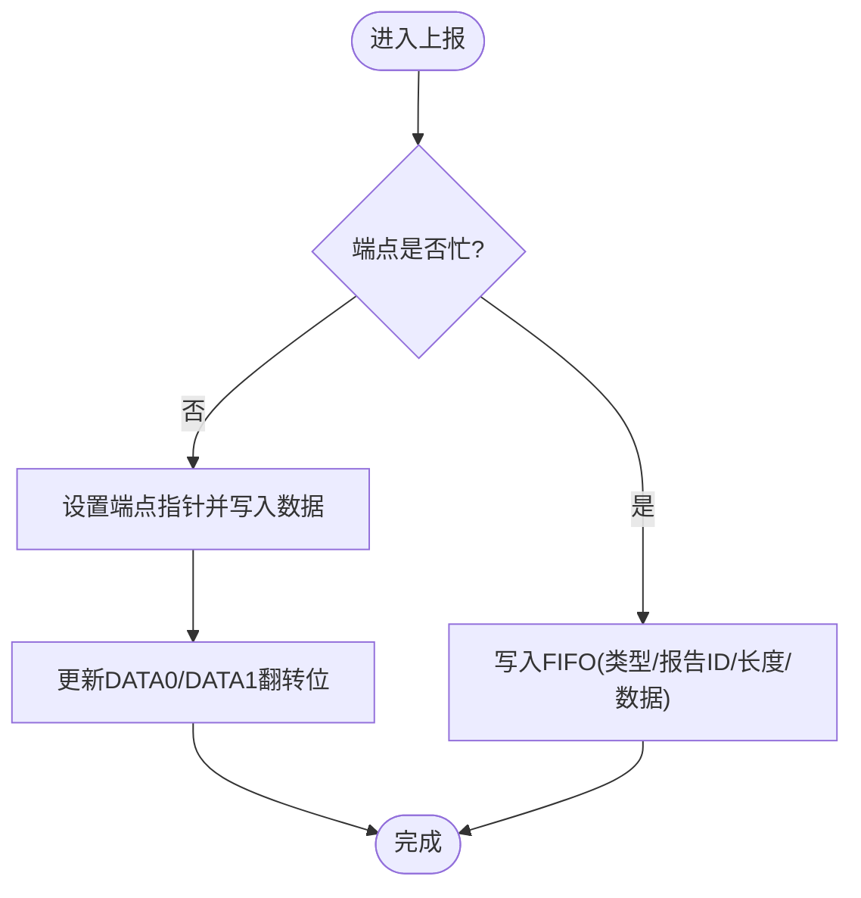
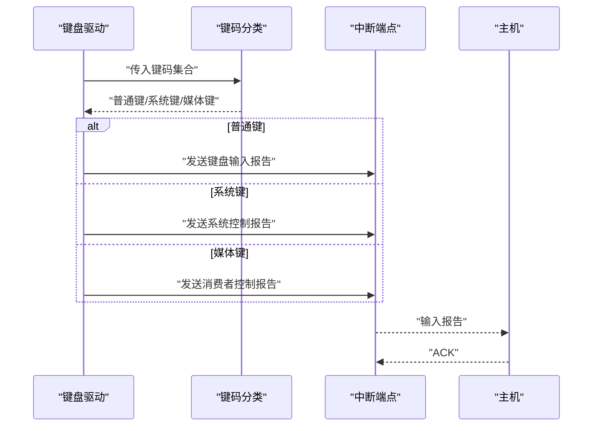
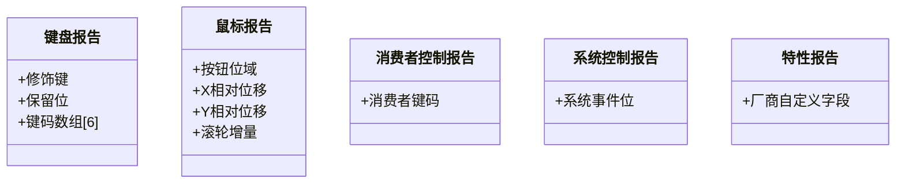
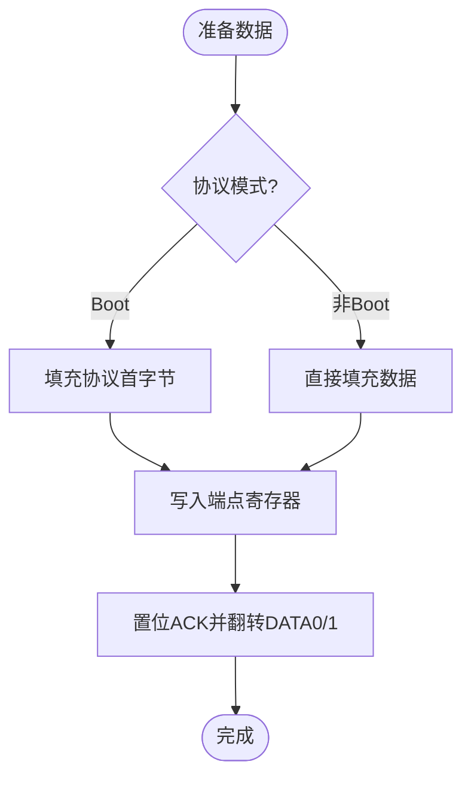
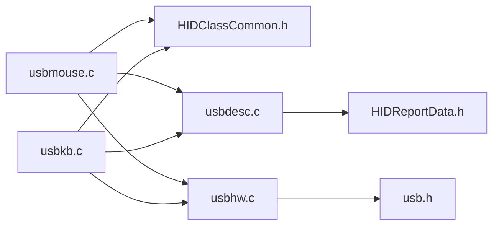

# HID类驱动实现

<cite>
**本文引用的文件**
- [usbmouse.c](file://tc_ble_single_sdk/application/app/usbmouse.c)
- [usbkb.c](file://tc_ble_single_sdk/application/app/usbkb.c)
- [HIDClassCommon.h](file://tc_ble_single_sdk/application/usbstd/HIDClassCommon.h)
- [HIDReportData.h](file://tc_ble_single_sdk/application/usbstd/HIDReportData.h)
- [usbdesc.c](file://tc_ble_single_sdk/application/usbstd/usbdesc.c)
- [usbmouse_i.h](file://tc_ble_single_sdk/application/app/usbmouse_i.h)
- [usbkb_i.h](file://tc_ble_single_sdk/application/app/usbkb_i.h)
- [usb.h](file://tc_ble_single_sdk/application/usbstd/usb.h)
- [usbhw.c](file://tc_ble_single_sdk/drivers/B85/usbhw.c)
- [default_config.h](file://tc_ble_single_sdk/vendor/common/default_config.h)
</cite>

## 目录
1. [简介](#简介)
2. [项目结构](#项目结构)
3. [核心组件](#核心组件)
4. [架构总览](#架构总览)
5. [详细组件分析](#详细组件分析)
6. [依赖关系分析](#依赖关系分析)
7. [性能考虑](#性能考虑)
8. [故障排查指南](#故障排查指南)
9. [结论](#结论)
10. [附录](#附录)

## 简介
本文件围绕该SDK中的USB HID类驱动实现，系统性阐述鼠标与键盘设备的驱动架构、HID报告描述符定义与配置、中断端点数据传输机制、典型事件上报流程（鼠标移动、按键、滚轮）、电源管理与休眠唤醒、多实例支持以及协议兼容性与测试方法。文档以代码为依据，提供可追溯的源码路径与图示，帮助读者快速理解并扩展HID功能。

## 项目结构
该SDK将HID相关代码分为三层：
- 应用层：鼠标与键盘的事件采集与上报逻辑（usbmouse.c、usbkb.c）
- USB标准与描述符层：HID类常量、报告描述符宏、设备/配置/接口/端点描述符（HIDClassCommon.h、HIDReportData.h、usbdesc.c）
- 底层硬件抽象层：USB端点寄存器操作、中断处理、写端点等（usbhw.c、usb.h）

**图表来源**
- [usbmouse.c:44-151](file://tc_ble_single_sdk/application/app/usbmouse.c#L44-L151)
- [usbkb.c:82-388](file://tc_ble_single_sdk/application/app/usbkb.c#L82-L388)
- [HIDClassCommon.h:295-354](file://tc_ble_single_sdk/application/usbstd/HIDClassCommon.h#L295-L354)
- [HIDReportData.h:71-110](file://tc_ble_single_sdk/application/usbstd/HIDReportData.h#L71-L110)
- [usbdesc.c:668-712](file://tc_ble_single_sdk/application/usbstd/usbdesc.c#L668-L712)
- [usbmouse_i.h:248-449](file://tc_ble_single_sdk/application/app/usbmouse_i.h#L248-L449)
- [usbkb_i.h:35-45](file://tc_ble_single_sdk/application/app/usbkb_i.h#L35-L45)
- [usbhw.c:54-61](file://tc_ble_single_sdk/drivers/B85/usbhw.c#L54-L61)
- [usb.h:57-80](file://tc_ble_single_sdk/application/usbstd/usb.h#L57-L80)

**章节来源**
- [usbdesc.c:668-712](file://tc_ble_single_sdk/application/usbstd/usbdesc.c#L668-L712)
- [usbmouse_i.h:248-449](file://tc_ble_single_sdk/application/app/usbmouse_i.h#L248-L449)
- [usbkb_i.h:35-45](file://tc_ble_single_sdk/application/app/usbkb_i.h#L35-L45)

## 核心组件
- 鼠标驱动模块（usbmouse.c）
  - 维护环形缓冲与读写指针，批量入队鼠标帧
  - 检测端点忙状态，必要时走FIFO队列延迟发送
  - 通过HID中断端点发送输入报告，支持协议模式切换（Boot/Non-Boot）
  - 释放超时检查，确保按键释放被正确上报
- 键盘驱动模块（usbkb.c）
  - 分离普通键、系统键、媒体键三类，分别上报到不同Report ID
  - 去重与重复上报抑制，避免主机侧重复触发
  - 支持消费者控制（Consumer Control）与系统控制（System Control）
- 描述符与类定义（HIDClassCommon.h、HIDReportData.h、usbdesc.c、usbmouse_i.h、usbkb_i.h）
  - 定义键盘/鼠标HID报告描述符宏与具体字节序列
  - 声明设备、配置、接口、端点及HID描述符长度
  - 暴露获取报告描述符的接口供USB枚举使用
- 底层USB抽象（usbhw.c、usb.h）
  - 提供端点数据写入、控制端点读写、手动中断开关
  - 暴露USB全局状态、回调注册、轮询间隔等配置

**章节来源**
- [usbmouse.c:44-151](file://tc_ble_single_sdk/application/app/usbmouse.c#L44-L151)
- [usbkb.c:82-388](file://tc_ble_single_sdk/application/app/usbkb.c#L82-L388)
- [HIDClassCommon.h:295-354](file://tc_ble_single_sdk/application/usbstd/HIDClassCommon.h#L295-L354)
- [HIDReportData.h:71-110](file://tc_ble_single_sdk/application/usbstd/HIDReportData.h#L71-L110)
- [usbdesc.c:668-712](file://tc_ble_single_sdk/application/usbstd/usbdesc.c#L668-L712)
- [usbmouse_i.h:248-449](file://tc_ble_single_sdk/application/app/usbmouse_i.h#L248-L449)
- [usbkb_i.h:35-45](file://tc_ble_single_sdk/application/app/usbkb_i.h#L35-L45)
- [usbhw.c:54-61](file://tc_ble_single_sdk/drivers/B85/usbhw.c#L54-L61)
- [usb.h:57-80](file://tc_ble_single_sdk/application/usbstd/usb.h#L57-L80)

## 架构总览
HID驱动采用“事件采集→缓冲→分类→上报”的分层架构。上层传感器或扫描结果产生原始事件，应用层进行去抖、合并、分类后，按HID协议打包为输入报告，经中断端点发送至主机。描述符层在枚举阶段向主机声明设备能力与报告格式；底层USB抽象负责寄存器级数据搬运与ACK。

**图表来源**
- [usbdesc.c:668-712](file://tc_ble_single_sdk/application/usbstd/usbdesc.c#L668-L712)
- [usbmouse.c:107-151](file://tc_ble_single_sdk/application/app/usbmouse.c#L107-L151)
- [usbkb.c:150-213](file://tc_ble_single_sdk/application/app/usbkb.c#L150-L213)
- [usbhw.c:54-61](file://tc_ble_single_sdk/drivers/B85/usbhw.c#L54-L61)

## 详细组件分析

### 鼠标驱动（usbmouse.c）
- 缓冲区管理
  - 使用固定大小环形缓冲保存鼠标帧，写满时丢弃最旧数据，防止溢出
  - 读指针仅在成功发送后推进，保证不丢包
- 上报策略
  - 优先直接写入端点；若端点忙则入队至共享FIFO，由通用处理器择机发送
  - 支持协议模式：非Boot模式下直接发送数据；Boot模式下按协议格式填充
- 释放超时
  - 若检测到按键未释放且超过阈值，自动发送全零报告确保主机状态一致

**图表来源**
- [usbmouse.c:107-151](file://tc_ble_single_sdk/application/app/usbmouse.c#L107-L151)

**章节来源**
- [usbmouse.c:44-151](file://tc_ble_single_sdk/application/app/usbmouse.c#L44-L151)

### 键盘驱动（usbkb.c）
- 键码分类
  - 普通键：通过标准键盘输入报告上报
  - 系统键：映射到系统控制报告（如睡眠、唤醒、关机）
  - 媒体键：通过消费者控制报告上报
- 去重与防抖
  - 比较上次上报数据，相同则忽略，减少总线负载
  - 对持续按键，仅首次上报，后续由主机负责重复触发
- 释放处理
  - 分别维护三类键的释放标志，超时后统一发送空报告释放状态

**图表来源**
- [usbkb.c:134-276](file://tc_ble_single_sdk/application/app/usbkb.c#L134-L276)

**章节来源**
- [usbkb.c:82-388](file://tc_ble_single_sdk/application/app/usbkb.c#L82-L388)

### HID报告描述符与格式
- 键盘报告
  - 使用标准键盘报告宏生成，包含修饰键、保留位与最多N个键码
  - 输出报告用于LED状态（Num/Caps/Scroll Lock）
- 鼠标报告
  - 按钮位域（左/右/中/扩展），X/Y相对位移，滚轮增量
  - 可选消费者控制与系统控制报告，使用独立Report ID区分
- 特性报告
  - 厂商自定义特性报告，用于配置或调试（例如Report ID=5/7等）

**图表来源**
- [HIDClassCommon.h:295-354](file://tc_ble_single_sdk/application/usbstd/HIDClassCommon.h#L295-L354)
- [usbmouse_i.h:248-449](file://tc_ble_single_sdk/application/app/usbmouse_i.h#L248-L449)
- [usbkb_i.h:35-45](file://tc_ble_single_sdk/application/app/usbkb_i.h#L35-L45)

**章节来源**
- [HIDClassCommon.h:295-354](file://tc_ble_single_sdk/application/usbstd/HIDClassCommon.h#L295-L354)
- [HIDReportData.h:71-110](file://tc_ble_single_sdk/application/usbstd/HIDReportData.h#L71-L110)
- [usbmouse_i.h:248-449](file://tc_ble_single_sdk/application/app/usbmouse_i.h#L248-L449)
- [usbkb_i.h:35-45](file://tc_ble_single_sdk/application/app/usbkb_i.h#L35-L45)

### 数据传输机制（中断端点与数据包）
- 端点配置
  - 键盘与鼠标均使用中断输入端点，端点大小分别为8字节（键盘）与8字节（鼠标）
  - 轮询间隔由配置宏决定，鼠标通常更短以提升响应性
- 数据包格式
  - 非Boot模式：直接发送报告数据
  - Boot模式：按协议要求填充首字节（报告ID或协议特定字段）
- ACK与数据翻转
  - 每次发送后设置ACK并翻转DATA0/DATA1，确保主机同步

**图表来源**
- [usbdesc.c:668-712](file://tc_ble_single_sdk/application/usbstd/usbdesc.c#L668-L712)
- [usbmouse.c:135-151](file://tc_ble_single_sdk/application/app/usbmouse.c#L135-L151)
- [usbkb.c:168-213](file://tc_ble_single_sdk/application/app/usbkb.c#L168-L213)

**章节来源**
- [usbdesc.c:668-712](file://tc_ble_single_sdk/application/usbstd/usbdesc.c#L668-L712)
- [usbmouse.c:135-151](file://tc_ble_single_sdk/application/app/usbmouse.c#L135-L151)
- [usbkb.c:168-213](file://tc_ble_single_sdk/application/app/usbkb.c#L168-L213)

### 电源管理与休眠唤醒
- 选择性挂起与远程唤醒
  - 设备描述符属性包含远程唤醒标志，允许主机选择性挂起
  - OS特性描述符中启用默认空闲状态与用户启用的选择性挂起
- 唤醒时机
  - USB中断或按键事件可作为唤醒源；从深度睡眠唤醒后需重新校准时钟与外设
- 建议实践
  - 在无事件时允许挂起以降低功耗
  - 唤醒后立即恢复USB状态与HID端点配置

**章节来源**
- [usbdesc.c:90-171](file://tc_ble_single_sdk/application/usbstd/usbdesc.c#L90-L171)
- [usbdesc.c:234-278](file://tc_ble_single_sdk/application/usbstd/usbdesc.c#L234-L278)

### 多实例支持
- 多接口设计
  - 键盘与鼠标作为独立HID接口，各自拥有独立的端点与报告描述符
  - 可通过条件编译开启/关闭各接口，灵活组合功能
- 报告ID隔离
  - 不同功能使用不同Report ID（如鼠标、媒体键、系统键、特性），避免冲突
- 扩展建议
  - 新增HID功能时，增加新接口与报告描述符，分配独立端点与Report ID

**章节来源**
- [usbdesc.c:668-712](file://tc_ble_single_sdk/application/usbstd/usbdesc.c#L668-L712)
- [usbmouse_i.h:248-449](file://tc_ble_single_sdk/application/app/usbmouse_i.h#L248-L449)

### 兼容性要求与测试方法
- 兼容性
  - 遵循HID 1.1规范，使用标准Usage Page与Usage
  - 键盘/鼠标采用Boot子类与协议，确保广泛兼容
- 测试要点
  - 枚举阶段验证设备/配置/接口/端点/HID描述符完整性
  - 运行时验证输入报告格式、轮询间隔、释放行为
  - 压力测试：高频按键/鼠标移动，观察FIFO溢出与丢包情况
  - 电源测试：挂起/唤醒后功能恢复正常

**章节来源**
- [HIDClassCommon.h:374-398](file://tc_ble_single_sdk/application/usbstd/HIDClassCommon.h#L374-L398)
- [usbdesc.c:668-712](file://tc_ble_single_sdk/application/usbstd/usbdesc.c#L668-L712)

## 依赖关系分析
- 应用层依赖描述符层提供的报告描述符与类常量
- 应用层通过底层USB抽象进行端点写入与状态查询
- 描述符层依赖USB标准结构与宏定义
- 底层USB抽象依赖芯片寄存器与中断机制

**图表来源**
- [usbmouse.c:107-151](file://tc_ble_single_sdk/application/app/usbmouse.c#L107-L151)
- [usbkb.c:150-213](file://tc_ble_single_sdk/application/app/usbkb.c#L150-L213)
- [HIDClassCommon.h:295-354](file://tc_ble_single_sdk/application/usbstd/HIDClassCommon.h#L295-L354)
- [HIDReportData.h:71-110](file://tc_ble_single_sdk/application/usbstd/HIDReportData.h#L71-L110)
- [usbdesc.c:668-712](file://tc_ble_single_sdk/application/usbstd/usbdesc.c#L668-L712)
- [usbhw.c:54-61](file://tc_ble_single_sdk/drivers/B85/usbhw.c#L54-L61)
- [usb.h:57-80](file://tc_ble_single_sdk/application/usbstd/usb.h#L57-L80)

**章节来源**
- [usbmouse.c:107-151](file://tc_ble_single_sdk/application/app/usbmouse.c#L107-L151)
- [usbkb.c:150-213](file://tc_ble_single_sdk/application/app/usbkb.c#L150-L213)
- [HIDClassCommon.h:295-354](file://tc_ble_single_sdk/application/usbstd/HIDClassCommon.h#L295-L354)
- [HIDReportData.h:71-110](file://tc_ble_single_sdk/application/usbstd/HIDReportData.h#L71-L110)
- [usbdesc.c:668-712](file://tc_ble_single_sdk/application/usbstd/usbdesc.c#L668-L712)
- [usbhw.c:54-61](file://tc_ble_single_sdk/drivers/B85/usbhw.c#L54-L61)
- [usb.h:57-80](file://tc_ble_single_sdk/application/usbstd/usb.h#L57-L80)

## 性能考虑
- 轮询间隔
  - 鼠标轮询间隔较短（默认1ms），提升移动与滚轮响应
  - 键盘轮询间隔略长（默认10ms），平衡功耗与实时性
- 缓冲与FIFO
  - 鼠标与键盘均使用环形缓冲与FIFO，避免端点忙导致丢包
  - FIFO溢出时覆盖最旧数据，保证最新事件优先
- 去重与节流
  - 键盘驱动对重复数据进行去重，减少无效传输
- 协议模式
  - Boot模式兼容性好但带宽受限；非Boot模式可自定义更高效的数据格式

**章节来源**
- [default_config.h:158-163](file://tc_ble_single_sdk/vendor/common/default_config.h#L158-L163)
- [usbmouse.c:44-98](file://tc_ble_single_sdk/application/app/usbmouse.c#L44-L98)
- [usbkb.c:293-337](file://tc_ble_single_sdk/application/app/usbkb.c#L293-L337)

## 故障排查指南
- 无响应或卡顿
  - 检查端点是否忙，确认FIFO是否溢出
  - 调整轮询间隔与缓冲大小
- 按键未释放
  - 检查释放超时逻辑是否正确触发
  - 确认释放报告已发送并被主机接收
- 描述符错误
  - 核对HID报告描述符长度与内容
  - 验证设备/配置/接口/端点描述符一致性
- 电源问题
  - 确认远程唤醒与选择性挂起配置正确
  - 唤醒后重新初始化USB与HID端点

**章节来源**
- [usbmouse.c:59-98](file://tc_ble_single_sdk/application/app/usbmouse.c#L59-L98)
- [usbkb.c:119-132](file://tc_ble_single_sdk/application/app/usbkb.c#L119-L132)
- [usbdesc.c:668-712](file://tc_ble_single_sdk/application/usbstd/usbdesc.c#L668-L712)

## 结论
该HID驱动实现采用清晰的分层架构，结合高效的缓冲与FIFO机制，确保了鼠标与键盘事件的稳定上报。通过标准化的HID报告描述符与灵活的协议模式，实现了良好的兼容性与可扩展性。电源管理支持选择性挂起与远程唤醒，满足低功耗需求。建议在新增功能时遵循现有模式，保持接口与报告ID的独立性，并通过系统化测试验证兼容性与稳定性。

## 附录
- 关键配置项
  - 轮询间隔：USB_KEYBOARD_POLL_INTERVAL、USB_MOUSE_POLL_INTERVAL
  - 功能开关：USB_KEYBOARD_ENABLE、USB_MOUSE_ENABLE
- 参考路径
  - 鼠标上报：[usbmouse.c:107-151](file://tc_ble_single_sdk/application/app/usbmouse.c#L107-L151)
  - 键盘上报：[usbkb.c:150-213](file://tc_ble_single_sdk/application/app/usbkb.c#L150-L213)
  - 描述符：[usbdesc.c:668-712](file://tc_ble_single_sdk/application/usbstd/usbdesc.c#L668-L712)
  - 类常量：[HIDClassCommon.h:295-354](file://tc_ble_single_sdk/application/usbstd/HIDClassCommon.h#L295-L354)
  - 报告宏：[HIDReportData.h:71-110](file://tc_ble_single_sdk/application/usbstd/HIDReportData.h#L71-L110)
  - 底层写入：[usbhw.c:54-61](file://tc_ble_single_sdk/drivers/B85/usbhw.c#L54-L61)
  - USB状态：[usb.h:57-80](file://tc_ble_single_sdk/application/usbstd/usb.h#L57-L80)